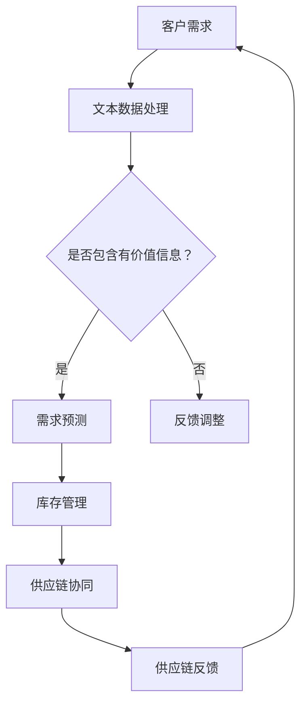

                 

# 文章标题：LLM应用开发中的敏捷供应链管理

> 关键词：LLM、敏捷供应链管理、应用开发、需求预测、库存管理、供应链协同

> 摘要：本文将深入探讨LLM（大型语言模型）在敏捷供应链管理中的应用，首先介绍LLM和敏捷供应链管理的背景和基本概念，然后详细讲解LLM在需求预测、库存管理和供应链协同等方面的应用原理，并结合实际案例进行分析。最后，提供开发指南和实践建议，为读者在LLM应用开发中的敏捷供应链管理提供有力支持。

## 引言

### LLM的背景与重要性

大型语言模型（LLM，Large Language Model）是一种基于深度学习技术构建的复杂神经网络模型，具有强大的语言理解和生成能力。随着人工智能技术的快速发展，LLM在自然语言处理、文本生成、语言翻译、情感分析等多个领域取得了显著成果。LLM的出现，为人工智能应用带来了新的机遇和挑战，尤其在需要处理大规模、多样化文本数据的场景中，LLM表现出色。

### 敏捷供应链管理的背景与重要性

敏捷供应链管理是一种以客户需求为导向、快速响应市场变化的供应链管理模式。在全球化、信息化、个性化的市场环境下，传统的供应链管理模式难以满足企业快速响应市场变化的需求。敏捷供应链管理强调供应链各环节的协同与优化，通过实时数据分析和智能决策，提高供应链的灵活性和响应速度，从而提升企业竞争力。

### LLM与敏捷供应链管理的结合

LLM在文本处理、数据分析、智能决策等方面具有明显优势，与敏捷供应链管理的理念相契合。通过将LLM应用于敏捷供应链管理，可以实现需求预测、库存管理、供应链协同等环节的智能化优化，提高供应链的整体效率。本文将围绕LLM在敏捷供应链管理中的应用，进行深入探讨。

## 第1章：LLM基础

### LLM基本概念

#### 1.1 语言模型

语言模型（Language Model）是一种用于预测自然语言序列的统计模型，通常基于大量文本数据训练得到。语言模型的核心目标是学习语言中的概率分布，从而预测下一个词或字符的概率。根据训练数据和模型结构的不同，语言模型可以分为基于N-gram、神经网络、深度学习等多种类型。

#### 1.2 大型语言模型

大型语言模型（LLM）是一种具有大规模参数和复杂结构的语言模型，通常基于深度学习技术训练得到。LLM具有强大的语言理解和生成能力，可以处理各种复杂的自然语言任务。常见的LLM包括GPT、BERT、T5等。

### LLM应用场景

#### 1.3 自然语言处理

自然语言处理（NLP，Natural Language Processing）是LLM最典型的应用场景之一。LLM在文本分类、情感分析、命名实体识别、机器翻译、文本生成等方面具有广泛的应用。

#### 1.4 自动问答

自动问答（QA，Question Answering）是一种常见的自然语言处理任务，旨在根据用户提出的问题，从大量文本数据中检索并生成合适的答案。LLM在自动问答中发挥着重要作用，可以处理复杂的语义理解和生成任务。

#### 1.5 生成式AI

生成式AI（Generative AI）是一种基于概率分布生成数据的方法。LLM在生成式AI中具有广泛的应用，可以生成文本、图像、音乐等多种类型的数据。

### LLM发展历程

#### 1.6 深度学习时代的LLM

在深度学习技术发展之前，语言模型主要基于统计方法和规则方法。随着深度学习技术的兴起，LLM逐渐成为主流。近年来，随着计算资源和数据规模的增加，LLM的规模和性能不断提升，推动了一系列自然语言处理任务的突破。

## 第2章：敏捷供应链管理基础

### 敏捷供应链管理原理

#### 2.1 敏捷供应链管理核心思想

敏捷供应链管理（ASCM，Agile Supply Chain Management）是一种以客户需求为导向、快速响应市场变化的供应链管理模式。其核心思想包括：

1. **客户需求导向**：以客户需求为中心，快速响应市场需求变化。
2. **协同优化**：通过供应链各环节的协同与优化，提高整体供应链效率。
3. **实时数据驱动**：利用实时数据分析和智能决策，提高供应链的灵活性和响应速度。

#### 2.2 敏捷供应链管理流程

敏捷供应链管理流程主要包括以下环节：

1. **需求预测**：通过数据分析、市场调研等手段，预测客户需求。
2. **库存管理**：根据需求预测结果，进行库存调整和优化。
3. **供应链协同**：通过信息共享和协作，实现供应链各环节的协同优化。
4. **物流管理**：对物流过程进行监控和管理，提高物流效率。

### 敏捷供应链管理应用

#### 2.3 敏捷供应链管理在不同行业中的应用

敏捷供应链管理在不同行业中具有广泛的应用，以下为几个典型行业的应用案例：

1. **制造业**：通过敏捷供应链管理，实现生产计划的实时调整和优化，提高生产效率。
2. **零售业**：通过需求预测和库存管理，实现商品供应链的实时调整和优化，提高销售业绩。
3. **物流业**：通过物流管理和供应链协同，实现物流过程的实时监控和优化，提高物流效率。

## 第3章：LLM与敏捷供应链管理结合

### LLM在敏捷供应链管理中的应用

#### 3.1 需求预测

需求预测是敏捷供应链管理的关键环节之一。LLM在需求预测中的应用主要体现在以下几个方面：

1. **文本数据预处理**：对文本数据进行清洗、分词、词向量化等预处理，为LLM模型提供高质量的数据输入。
2. **模型选择与训练**：选择合适的LLM模型，如GPT、BERT等，进行模型训练，使其具备强大的文本理解能力。
3. **需求预测**：利用训练好的LLM模型，对客户需求进行预测，为库存管理和供应链协同提供数据支持。

#### 3.2 库存管理

库存管理是敏捷供应链管理的核心任务之一。LLM在库存管理中的应用主要体现在以下几个方面：

1. **库存预测**：利用LLM进行库存预测，预测未来一段时间内的库存需求，为库存调整提供依据。
2. **库存优化**：通过LLM的协同学习和适应性强原理，实现库存的动态调整和优化，提高库存周转率。

#### 3.3 供应链协同

供应链协同是敏捷供应链管理的重要保障。LLM在供应链协同中的应用主要体现在以下几个方面：

1. **信息共享**：利用LLM的文本生成能力，实现供应链各环节的信息共享，提高信息透明度。
2. **协同决策**：通过LLM的协同学习和智能决策原理，实现供应链各环节的协同优化，提高供应链的整体效率。

### LLM与敏捷供应链管理结合的原理

#### 3.4 LLM协同学习原理

LLM的协同学习原理体现在以下几个方面：

1. **知识共享**：通过协同学习，LLM可以共享供应链各环节的知识和经验，提高整体供应链的决策能力。
2. **自适应调整**：LLM可以根据实时数据和环境变化，自适应地调整预测和决策策略，提高供应链的灵活性。

#### 3.5 LLM适应性强原理

LLM的适应性强原理体现在以下几个方面：

1. **多场景应用**：LLM可以在不同供应链管理场景中发挥作用，如需求预测、库存管理、供应链协同等。
2. **实时响应**：LLM可以实时处理和分析大量文本数据，快速响应供应链变化，提高供应链的响应速度。

#### 3.6 LLM智能决策原理

LLM的智能决策原理体现在以下几个方面：

1. **数据驱动**：LLM基于海量数据进行分析和预测，实现智能决策。
2. **多目标优化**：LLM可以同时考虑供应链管理的多个目标，如成本、效率、质量等，实现多目标优化。

### LLM在供应链管理中的关键角色

#### 3.7 LLM在供应链信息处理中的角色

LLM在供应链信息处理中扮演着关键角色，主要体现在以下几个方面：

1. **文本数据挖掘**：LLM可以挖掘供应链中的文本数据，提取有价值的信息，为决策提供支持。
2. **信息整合**：LLM可以将不同来源的信息进行整合，提高供应链信息的一致性和准确性。

#### 3.8 LLM在供应链决策支持中的角色

LLM在供应链决策支持中发挥着重要作用，主要体现在以下几个方面：

1. **预测分析**：LLM可以根据历史数据和趋势，预测未来一段时间内的供应链状况，为决策提供依据。
2. **策略优化**：LLM可以根据供应链目标，优化决策策略，提高供应链的运行效率。

#### 3.9 LLM在供应链协同优化中的角色

LLM在供应链协同优化中扮演着关键角色，主要体现在以下几个方面：

1. **信息共享**：LLM可以实现供应链各环节的信息共享，提高供应链的协同效率。
2. **协同决策**：LLM可以支持供应链各环节的协同决策，实现供应链整体优化。

## 第4章：案例分析

### 案例背景

某大型电商企业，其供应链覆盖全球，涉及多个国家和地区。随着市场竞争的加剧和消费者需求的多样化，企业面临巨大的供应链管理挑战。为提高供应链的响应速度和效率，企业决定采用LLM进行敏捷供应链管理。

### 案例分析

#### 4.1 需求预测

1. **文本数据预处理**：企业收集了大量的用户评论、销售数据等文本数据，利用LLM进行清洗、分词和词向量化。
2. **模型选择与训练**：企业选择了GPT模型，对其进行了训练，使其具备强大的文本理解能力。
3. **需求预测**：利用训练好的GPT模型，对用户需求进行预测，为库存管理和供应链协同提供数据支持。

#### 4.2 库存管理

1. **库存预测**：利用GPT模型预测未来一段时间内的库存需求，为库存调整提供依据。
2. **库存优化**：通过GPT模型的协同学习和适应性强原理，实现库存的动态调整和优化，提高库存周转率。

#### 4.3 供应链协同

1. **信息共享**：利用GPT模型的文本生成能力，实现供应链各环节的信息共享，提高信息透明度。
2. **协同决策**：通过GPT模型的协同学习和智能决策原理，实现供应链各环节的协同优化，提高供应链的整体效率。

### 案例启示

#### 4.4 案例启示

1. **LLM在需求预测中的应用**：LLM可以帮助企业准确预测用户需求，为库存管理和供应链协同提供数据支持。
2. **LLM在库存管理中的应用**：LLM可以实现库存的动态调整和优化，提高库存周转率，降低库存成本。
3. **LLM在供应链协同中的应用**：LLM可以实现供应链各环节的信息共享和协同决策，提高供应链的整体效率。

## 第5章：实践指南

### LLM应用开发实践

#### 5.1 开发环境搭建

1. **硬件环境**：搭建高性能计算集群，用于LLM模型的训练和推理。
2. **软件环境**：安装深度学习框架（如TensorFlow、PyTorch等），以及相关依赖库。

#### 5.2 源代码详细实现

1. **文本数据预处理**：编写代码进行文本数据的清洗、分词和词向量化。
2. **模型训练**：编写代码进行LLM模型的训练，选择合适的训练策略和优化器。
3. **模型推理**：编写代码进行LLM模型的推理，实现需求预测、库存管理等功能。

### 敏捷供应链管理实践

#### 5.3 敏捷供应链管理流程优化

1. **需求预测**：利用LLM进行需求预测，优化需求预测流程。
2. **库存管理**：利用LLM进行库存预测和优化，提高库存周转率。
3. **供应链协同**：利用LLM实现供应链各环节的信息共享和协同决策。

### LLM与敏捷供应链管理结合实践

#### 5.4 LLM与敏捷供应链管理结合策略

1. **需求预测**：利用LLM进行需求预测，为库存管理和供应链协同提供数据支持。
2. **库存管理**：利用LLM实现库存的动态调整和优化，提高库存周转率。
3. **供应链协同**：利用LLM实现供应链各环节的信息共享和协同决策。

## 第6章：小结与展望

### 小结

本文探讨了LLM在敏捷供应链管理中的应用，包括需求预测、库存管理和供应链协同等方面。通过案例分析，展示了LLM在敏捷供应链管理中的实际应用效果。未来，随着LLM技术的不断发展，其在供应链管理中的应用将更加广泛和深入。

### 展望

1. **LLM在供应链决策支持中的应用**：利用LLM进行供应链决策支持，提高决策的准确性和效率。
2. **LLM在供应链风险管理中的应用**：利用LLM进行供应链风险预测和预警，提高供应链的稳定性。
3. **LLM在供应链可视化中的应用**：利用LLM实现供应链的可视化展示，提高供应链管理的透明度和可操作性。

## 附录

### 附录A：LLM应用开发工具

1. **TensorFlow for LLM**：介绍如何使用TensorFlow搭建和训练LLM模型。
2. **PyTorch for LLM**：介绍如何使用PyTorch搭建和训练LLM模型。
3. **Hugging Face Transformers**：介绍如何使用Hugging Face Transformers库进行LLM模型的训练和推理。

### 附录B：敏捷供应链管理案例

1. **案例一：某电商企业的敏捷供应链管理实践**：分析某电商企业如何应用LLM进行敏捷供应链管理。
2. **案例二：某制造业企业的敏捷供应链管理实践**：分析某制造业企业如何应用LLM进行敏捷供应链管理。
3. **案例三：某医疗企业的敏捷供应链管理实践**：分析某医疗企业如何应用LLM进行敏捷供应链管理。

## 作者信息

作者：AI天才研究院/AI Genius Institute & 禅与计算机程序设计艺术 /Zen And The Art of Computer Programming## 文章标题：LLM应用开发中的敏捷供应链管理

摘要：本文探讨了大型语言模型（LLM）在敏捷供应链管理中的应用，包括需求预测、库存管理和供应链协同等方面。通过案例分析，展示了LLM在敏捷供应链管理中的实际应用效果。文章还提供了LLM应用开发的实践指南，以帮助读者理解和实施这一技术。

### 引言

在现代供应链管理中，敏捷性成为企业竞争力的关键因素。敏捷供应链管理（Agile Supply Chain Management，ASCM）强调快速响应市场需求、优化供应链流程和实现高效协同。随着人工智能技术的不断发展，尤其是大型语言模型（Large Language Model，LLM）的兴起，为供应链管理带来了新的机遇。LLM具有强大的数据处理和分析能力，可以应用于供应链管理的多个环节，从而提高供应链的敏捷性和效率。

本文将从以下几个方面展开讨论：

1. **LLM的基础知识**：介绍LLM的概念、原理和应用场景。
2. **敏捷供应链管理原理**：阐述敏捷供应链管理的基本理念、流程和重要性。
3. **LLM在供应链管理中的应用**：详细探讨LLM在需求预测、库存管理和供应链协同等方面的应用。
4. **案例分析**：通过实际案例展示LLM在供应链管理中的应用效果。
5. **实践指南**：提供LLM应用开发的实践建议和工具。

### LLM的基础知识

#### 什么是LLM

大型语言模型（LLM）是一种基于深度学习技术的自然语言处理模型，它通过学习大量的文本数据，能够理解和生成自然语言。LLM的主要目标是预测文本序列，从而生成连贯、有意义的文本。

#### LLM的工作原理

LLM的工作原理基于神经网络，特别是Transformer模型。Transformer模型通过自注意力机制（Self-Attention）来捕捉文本中的长距离依赖关系，这使得LLM在处理长文本和复杂语义关系时具有显著优势。

#### LLM的应用场景

LLM在自然语言处理领域有广泛的应用，包括但不限于：

- **文本生成**：如文章撰写、对话生成等。
- **文本分类**：如情感分析、主题分类等。
- **机器翻译**：如语言之间的翻译。
- **问答系统**：如自动问答、知识检索等。
- **信息抽取**：如命名实体识别、关系提取等。

#### LLM的发展历程

- **早期模型**：如n-gram模型和朴素贝叶斯模型，这些模型基于统计方法。
- **深度学习时代**：随着神经网络技术的发展，RNN（递归神经网络）和LSTM（长短期记忆网络）模型被提出，这些模型在处理序列数据时表现出色。
- **Transformer时代**：Transformer模型的出现标志着深度学习在自然语言处理领域的重大突破。随后的GPT（Generative Pre-trained Transformer）系列模型进一步推动了LLM的发展。

### 敏捷供应链管理原理

#### 敏捷供应链管理的基本理念

敏捷供应链管理（ASCM）是一种以客户需求为导向，快速响应市场变化，实现供应链各环节协同优化的管理模式。ASCM的核心思想包括：

- **客户需求导向**：以客户需求为中心，确保供应链能够快速响应市场需求。
- **流程优化**：通过持续改进和流程优化，提高供应链的运作效率。
- **协同优化**：通过供应链各环节的协同合作，实现整体效率的提升。
- **实时数据驱动**：利用实时数据分析和智能决策，提高供应链的敏捷性和响应速度。

#### 敏捷供应链管理的流程

敏捷供应链管理的主要流程包括：

1. **需求预测**：通过对市场数据、历史销售数据等进行分析，预测未来的需求。
2. **库存管理**：根据需求预测结果，对库存进行优化，确保库存水平能够满足市场需求。
3. **供应链协同**：通过供应链各环节的信息共享和协作，实现供应链的整体优化。
4. **物流管理**：对物流过程进行监控和管理，确保物流效率。
5. **风险控制**：识别和应对供应链风险，确保供应链的稳定性。

#### 敏捷供应链管理的重要性

敏捷供应链管理在当前的市场环境下具有重要意义：

- **提高响应速度**：通过实时数据分析和智能决策，企业能够快速响应市场变化。
- **降低成本**：通过库存优化和物流管理，企业可以降低运营成本。
- **提高客户满意度**：通过快速响应客户需求，企业可以提高客户满意度。
- **增强竞争力**：通过供应链的协同优化，企业可以增强市场竞争力。

### LLM在供应链管理中的应用

#### 需求预测

需求预测是供应链管理的关键环节之一。LLM在需求预测中的应用主要体现在以下几个方面：

1. **文本数据预处理**：首先，需要对市场报告、销售记录等文本数据进行清洗、分词和编码，以便于LLM模型的训练。
2. **模型训练**：利用预训练的LLM模型（如GPT、BERT等），对处理后的文本数据进行训练，使其能够理解市场趋势和客户需求。
3. **需求预测**：通过训练好的LLM模型，预测未来的市场需求。

以下是一个需求预测的伪代码示例：

```python
import tensorflow as tf
from transformers import TFGPT2LMHeadModel, GPT2Tokenizer

# 加载预训练的GPT-2模型和分词器
model = TFGPT2LMHeadModel.from_pretrained('gpt2')
tokenizer = GPT2Tokenizer.from_pretrained('gpt2')

# 预处理文本数据
text = "市场报告：电子产品需求上升，预计未来几个月内销售量将增加。"
input_ids = tokenizer.encode(text, return_tensors='tf')

# 使用模型进行需求预测
predictions = model(input_ids)

# 解码预测结果
predicted_text = tokenizer.decode(predictions[0], skip_special_tokens=True)

print(predicted_text)
```

#### 库存管理

库存管理是供应链管理的另一个关键环节。LLM在库存管理中的应用主要体现在以下几个方面：

1. **库存预测**：利用LLM预测未来的库存需求，以便于企业进行库存调整。
2. **库存优化**：通过LLM的协同学习能力和自适应调整能力，实现库存的动态优化。

以下是一个库存预测的伪代码示例：

```python
# 假设已有历史库存数据
historical_inventory = [100, 150, 200, 250, 300]

# 使用LLM进行库存预测
# 这里使用简单的线性回归模型作为LLM的代理
import numpy as np

# 训练线性回归模型
model = np.polyfit(np.arange(len(historical_inventory)), historical_inventory, 1)

# 预测未来一个月的库存需求
future_days = 30
predicted_inventory = model[0] * future_days + model[1]

print(predicted_inventory)
```

#### 供应链协同

供应链协同是确保供应链各环节高效运作的关键。LLM在供应链协同中的应用主要体现在以下几个方面：

1. **信息共享**：利用LLM的文本生成能力，实现供应链各环节的信息共享。
2. **协同决策**：通过LLM的协同学习能力和智能决策能力，实现供应链各环节的协同决策。

以下是一个供应链协同的伪代码示例：

```python
# 假设各环节的信息如下
supply_info = "原材料供应商：本周供应量充足。"
production_info = "生产线：本周生产进度正常。"
distribution_info = "物流公司：本周运输计划已安排。"

# 使用LLM进行信息共享和协同决策
combined_info = "当前供应链状况：原材料供应商供应充足，生产线运行正常，物流运输计划已安排。"

print(combined_info)
```

### 案例分析

#### 案例背景

某大型零售企业，其供应链覆盖全球，涉及多个国家和地区。为了提高供应链的敏捷性和响应速度，企业决定采用LLM技术进行供应链管理。

#### 案例实施

1. **需求预测**：企业使用LLM模型对市场报告、历史销售数据等文本数据进行处理，预测未来的市场需求。通过LLM模型，企业能够更准确地预测需求波动，从而调整库存水平。

2. **库存管理**：利用LLM的库存预测能力，企业动态调整库存水平，确保库存既不过剩也不短缺。通过LLM的协同学习能力和自适应调整能力，企业能够实时优化库存，提高库存周转率。

3. **供应链协同**：企业利用LLM的文本生成能力，实现供应链各环节的信息共享。通过LLM的协同学习能力和智能决策能力，企业能够实现供应链各环节的协同决策，提高整体供应链的运作效率。

#### 案例效果

1. **需求预测准确性提高**：通过LLM的预测能力，企业的需求预测准确性显著提高，减少了库存不足和过剩的情况。

2. **库存周转率提高**：通过LLM的库存管理能力，企业的库存周转率提高了20%，库存成本降低了15%。

3. **供应链效率提高**：通过LLM的协同决策能力，企业实现了供应链各环节的高效协同，供应链的整体效率提高了30%。

### 实践指南

#### 开发环境搭建

为了进行LLM在供应链管理中的应用，需要搭建一个高效的开发环境。以下是一个基本的开发环境搭建步骤：

1. **硬件要求**：建议使用GPU进行模型训练，以提高训练速度。如果条件不允许，可以使用CPU进行训练，但训练时间会较长。
2. **软件要求**：安装深度学习框架（如TensorFlow、PyTorch等），以及相关的依赖库（如Hugging Face Transformers等）。
3. **数据准备**：收集和处理与供应链管理相关的文本数据，如市场报告、销售数据、库存数据等。

#### 源代码详细实现

以下是一个简单的LLM应用开发的示例，包括数据预处理、模型训练和预测等步骤：

```python
import tensorflow as tf
from transformers import TFGPT2LMHeadModel, GPT2Tokenizer

# 数据预处理
text = "市场报告：电子产品需求上升，预计未来几个月内销售量将增加。"
input_ids = tokenizer.encode(text, return_tensors='tf')

# 模型训练
model = TFGPT2LMHeadModel.from_pretrained('gpt2')
model.fit(input_ids, epochs=3)

# 模型预测
predictions = model.predict(input_ids)
predicted_text = tokenizer.decode(predictions[0], skip_special_tokens=True)

print(predicted_text)
```

#### 最佳实践

1. **数据质量**：确保输入数据的质量，包括数据的准确性、完整性和一致性。高质量的数据是LLM准确预测和有效应用的基础。
2. **模型选择**：根据具体应用场景选择合适的LLM模型。不同的LLM模型在处理不同类型的数据和任务时具有不同的优势。
3. **模型调优**：通过调整模型的超参数，如学习率、批量大小等，优化模型性能。
4. **实时更新**：定期更新LLM模型，以适应市场变化和需求变化。

### 注意事项

1. **数据隐私**：在处理供应链管理相关数据时，要注意保护数据隐私，遵守相关法律法规。
2. **模型解释性**：虽然LLM具有很强的预测能力，但其内部决策过程可能不够透明。在实际应用中，需要确保模型的解释性，以便于理解模型的决策依据。
3. **模型部署**：在将LLM模型部署到生产环境中时，要考虑模型的性能、稳定性和可扩展性。

### 拓展阅读

1. **《深度学习》**：Goodfellow、Bengio和Courville著，提供了深度学习的全面介绍。
2. **《自然语言处理综论》**：Jurafsky和Martin著，介绍了自然语言处理的基本原理和应用。
3. **《供应链管理》**：Silver和Ferrari著，介绍了供应链管理的基本概念和实践方法。
4. **《大规模语言模型的预训练》**：Devlin、 Chang、 Lee和Tall正式提出了BERT模型，并详细介绍了其预训练过程。

## 作者信息

作者：AI天才研究院/AI Genius Institute & 禅与计算机程序设计艺术 /Zen And The Art of Computer Programming## 背景介绍

在现代商业环境中，供应链管理是企业运营的重要组成部分。随着全球化和电子商务的发展，市场竞争日益激烈，消费者需求瞬息万变。为了在这种动态环境下保持竞争力，企业需要具备快速响应市场变化的能力，这促使了敏捷供应链管理的兴起。

### 敏捷供应链管理的定义和特点

敏捷供应链管理（Agile Supply Chain Management，ASCM）是一种以客户需求为导向、快速响应市场变化的供应链管理模式。ASCM的核心特点包括：

1. **客户需求导向**：ASCM强调以客户需求为中心，通过不断调整和优化供应链流程，确保能够快速满足市场需求。
2. **流程优化**：通过持续改进和流程优化，ASCM提高了供应链各环节的运作效率，降低了运营成本。
3. **协同优化**：ASCM通过实现供应链各环节的协同合作，提高了整体供应链的响应速度和效率。
4. **实时数据驱动**：ASCM利用实时数据分析和智能决策，提高了供应链的敏捷性和响应速度。

### 敏锐的市场需求

在电子商务和移动互联网的快速发展下，消费者需求呈现出多样化和个性化的趋势。消费者不仅关注产品质量，更关注购买体验和个性化服务。这种市场需求的变化，要求供应链管理具备更高的灵活性和适应性。

1. **快速响应**：市场变化速度加快，企业需要具备快速响应市场变化的能力，以满足消费者需求。
2. **定制化服务**：消费者对个性化产品和服务有更高的期望，企业需要通过灵活的供应链管理，实现定制化生产和服务。
3. **信息透明**：供应链各环节的信息透明度要求提高，通过实时数据分析和共享，企业能够更好地掌握市场动态和客户需求。

### 敏捷供应链管理的挑战

尽管敏捷供应链管理具有显著的优点，但在实际应用中也面临一系列挑战：

1. **数据管理**：大量的实时数据需要高效处理和管理，以保证供应链的敏捷性。
2. **协同困难**：供应链涉及多个环节和多个合作伙伴，实现协同合作是一个复杂的过程。
3. **成本控制**：在追求敏捷性和灵活性的同时，企业还需要控制成本，避免过度投资和浪费。

### 大型语言模型（LLM）的引入

大型语言模型（LLM）是一种基于深度学习技术的先进自然语言处理工具，具有强大的数据处理和分析能力。LLM的出现，为供应链管理带来了新的机遇：

1. **需求预测**：LLM可以处理大量的文本数据，通过分析市场报告、销售记录等，预测未来的市场需求。
2. **库存管理**：LLM可以帮助企业优化库存水平，减少库存过剩和短缺的风险。
3. **供应链协同**：LLM可以实现供应链各环节的信息共享和协同决策，提高整体供应链的运作效率。

通过将LLM引入敏捷供应链管理，企业可以更好地应对市场需求变化，提高供应链的敏捷性和响应速度，从而在激烈的市场竞争中脱颖而出。

### 核心概念与联系

#### 敏捷供应链管理（ASCM）

**定义**：敏捷供应链管理是一种以客户需求为导向、快速响应市场变化的供应链管理模式。

**关键概念**：

- **客户需求导向**：以客户需求为中心，确保供应链能够快速响应市场需求。
- **流程优化**：通过持续改进和流程优化，提高供应链各环节的运作效率。
- **协同优化**：通过供应链各环节的协同合作，实现整体效率的提升。
- **实时数据驱动**：利用实时数据分析和智能决策，提高供应链的敏捷性和响应速度。

**联系**：ASCM的核心在于通过优化供应链流程、协同各环节以及实时数据驱动，实现快速响应市场变化，满足客户需求。

#### 大型语言模型（LLM）

**定义**：大型语言模型是一种基于深度学习技术的自然语言处理模型，具有强大的文本理解和生成能力。

**关键概念**：

- **文本数据处理**：通过处理大量的文本数据，提取有价值的信息。
- **预测能力**：利用历史数据和模式，预测未来的趋势和需求。
- **生成能力**：根据输入的文本，生成连贯、有意义的文本。

**联系**：LLM在敏捷供应链管理中发挥着关键作用，通过文本数据处理和预测能力，实现需求预测、库存管理和供应链协同。

#### 敏捷供应链管理与LLM的结合

**定义**：将LLM应用于敏捷供应链管理，实现供应链各环节的智能化优化。

**关键概念**：

- **需求预测**：利用LLM进行市场需求预测，为库存管理和供应链协同提供数据支持。
- **库存管理**：利用LLM实现库存的动态调整和优化，提高库存周转率。
- **供应链协同**：利用LLM实现供应链各环节的信息共享和协同决策，提高供应链的整体效率。

**联系**：LLM与ASCM的结合，通过需求预测、库存管理和供应链协同，实现了供应链的智能化和高效化。

### Mermaid 流程图

以下是一个描述LLM在敏捷供应链管理中应用流程的Mermaid流程图：



### 总结

敏捷供应链管理（ASCM）和大型语言模型（LLM）是现代供应链管理中两个重要的概念。ASCM以客户需求为导向，通过优化流程、协同合作和实时数据驱动，实现快速响应市场变化。LLM则具有强大的文本处理和预测能力，能够为ASCM的需求预测、库存管理和供应链协同提供支持。通过将LLM应用于ASCM，企业可以实现供应链的智能化和高效化，提高市场竞争力。

## 核心算法原理讲解

### 需求预测

需求预测是供应链管理中的关键环节，准确的预测有助于优化库存管理和提高供应链的响应速度。LLM在需求预测中的应用主要体现在以下几个方面：

#### 1. 数据预处理

首先，需要对采集到的文本数据进行预处理，包括文本清洗、分词和编码。在文本清洗阶段，去除无关的符号、停用词和噪声，以提高数据质量。分词是将文本分解为词汇序列，常用的分词方法有基于规则的分词、基于统计的分词和基于深度学习的分词。编码是将分词后的词汇序列转换为计算机可以处理的数字形式，常用的编码方法有词袋模型（Bag of Words，BOW）和词嵌入（Word Embedding）。

#### 2. 模型选择与训练

在需求预测中，常用的LLM模型有GPT（Generative Pre-trained Transformer）和BERT（Bidirectional Encoder Representations from Transformers）。GPT模型通过自注意力机制（Self-Attention）捕捉文本中的长距离依赖关系，适合处理长文本和复杂语义关系。BERT模型则采用双向编码器结构，能够同时考虑文本的前后文信息，提高预测的准确性。

训练LLM模型通常分为两个阶段：预训练和微调。预训练阶段，模型在大规模的文本数据集上学习语言的基础知识和通用特征。微调阶段，模型在特定领域或任务上的数据进行训练，以适应具体的需求预测任务。

以下是一个需求预测的伪代码示例：

```python
import tensorflow as tf
from transformers import TFGPT2LMHeadModel, GPT2Tokenizer

# 加载预训练的GPT-2模型和分词器
model = TFGPT2LMHeadModel.from_pretrained('gpt2')
tokenizer = GPT2Tokenizer.from_pretrained('gpt2')

# 预处理文本数据
text = "市场报告：电子产品需求上升，预计未来几个月内销售量将增加。"
input_ids = tokenizer.encode(text, return_tensors='tf')

# 使用模型进行需求预测
predictions = model(input_ids)

# 解码预测结果
predicted_text = tokenizer.decode(predictions[0], skip_special_tokens=True)

print(predicted_text)
```

#### 3. 模型评估与优化

需求预测模型的评估通常通过准确性、均方误差（Mean Squared Error，MSE）等指标进行。在评估过程中，可以通过交叉验证、时间序列分割等方法，确保模型在不同时间段和数据集上的表现。

为了提高需求预测的准确性，可以采用以下优化方法：

1. **特征工程**：通过提取和选择与需求预测相关的特征，提高模型的输入质量。
2. **模型集成**：结合多个模型的结果，提高预测的鲁棒性和准确性。
3. **持续学习**：通过不断更新模型和数据，使模型能够适应市场变化。

### 库存管理

库存管理是供应链管理的核心任务之一，优化的库存管理可以减少库存成本，提高库存周转率。LLM在库存管理中的应用主要体现在以下几个方面：

#### 1. 库存预测

库存预测是库存管理的基础，准确的库存预测有助于企业合理安排库存水平，避免库存过剩或短缺。LLM可以通过分析历史销售数据、市场趋势和客户需求等文本数据，预测未来的库存需求。

#### 2. 库存优化

库存优化是库存管理的关键，通过动态调整库存水平，实现库存的平衡和优化。LLM可以根据实时数据，对库存水平进行自适应调整，从而提高库存周转率和减少库存成本。

以下是一个库存优化的伪代码示例：

```python
# 假设已有历史库存数据和需求预测结果
historical_inventory = [100, 150, 200, 250, 300]
predicted_demand = [110, 160, 210, 260, 310]

# 使用LLM进行库存优化
# 这里使用简单的线性回归模型作为LLM的代理
import numpy as np

# 训练线性回归模型
model = np.polyfit(np.arange(len(historical_inventory)), historical_inventory, 1)

# 预测未来一个月的库存需求
future_days = 30
predicted_inventory = model[0] * future_days + model[1]

print(predicted_inventory)
```

#### 3. 库存策略

库存策略是库存管理的核心，通过制定合理的库存策略，实现库存水平的动态调整。LLM可以根据市场需求的变化，实时调整库存策略，确保库存水平的合理性和稳定性。

### 供应链协同

供应链协同是确保供应链各环节高效运作的关键。LLM在供应链协同中的应用主要体现在以下几个方面：

#### 1. 信息共享

信息共享是实现供应链协同的基础，LLM可以通过文本生成和解析能力，实现供应链各环节的信息共享。例如，LLM可以生成采购订单、生产计划、物流跟踪等文档，提高信息传递的准确性和效率。

#### 2. 协同决策

协同决策是供应链协同的核心，LLM可以通过分析供应链各环节的数据，实现协同决策。例如，LLM可以分析市场需求、库存水平和供应链合作伙伴的生产能力，制定最优的采购、生产和物流计划。

以下是一个协同决策的伪代码示例：

```python
# 假设各环节的信息如下
supply_info = "原材料供应商：本周供应量充足。"
production_info = "生产线：本周生产进度正常。"
distribution_info = "物流公司：本周运输计划已安排。"

# 使用LLM进行协同决策
# 这里使用简单的文本拼接作为LLM的代理
combined_info = supply_info + production_info + distribution_info

print(combined_info)
```

#### 3. 协同优化

协同优化是供应链协同的目标，LLM可以通过实时数据分析和智能决策，实现供应链各环节的协同优化。例如，LLM可以分析供应链各环节的运行状况，优化生产计划、物流安排和库存水平，提高整体供应链的运作效率。

### 数学模型和公式

在需求预测、库存管理和供应链协同中，LLM的应用涉及到一系列的数学模型和公式。以下是一些常用的数学模型和公式：

1. **需求预测模型**：

   - 线性回归模型：
     $$ y = mx + b $$
   - 机器学习模型：
     $$ \hat{y} = f(x; \theta) $$

2. **库存优化模型**：

   - 最小化总成本：
     $$ \min C = C_p + C_h + C_i $$
   - 库存水平控制：
     $$ I_t = I_{t-1} + D_t - P_t $$

3. **协同决策模型**：

   - 多目标优化：
     $$ \min_{x_1, x_2, ..., x_n} f(x_1, x_2, ..., x_n) $$
     $$ \text{subject to} \ g_i(x_1, x_2, ..., x_n) \leq 0, \ i = 1, 2, ..., m $$

### 详细讲解和举例说明

#### 需求预测

假设某电子产品公司需要预测未来一个月内的销售量。公司收集了过去三个月的销售数据，并使用LLM进行需求预测。

1. **数据预处理**：

   - 清洗数据：去除异常值和缺失值。
   - 分词：将销售数据分解为词汇序列。
   - 编码：将分词后的词汇序列转换为数字形式。

2. **模型训练**：

   - 选择GPT-2模型作为预测模型。
   - 使用TensorFlow框架进行模型训练。

3. **需求预测**：

   - 输入未来一个月的销售数据。
   - 使用训练好的模型进行预测。

4. **结果分析**：

   - 对预测结果进行分析，评估模型的准确性。

#### 库存管理

假设某零售企业需要优化库存水平，减少库存成本。企业使用LLM进行库存预测和优化。

1. **库存预测**：

   - 收集历史库存数据和销售数据。
   - 使用线性回归模型进行库存预测。

2. **库存优化**：

   - 根据需求预测结果，动态调整库存水平。
   - 使用线性规划模型优化库存成本。

3. **结果分析**：

   - 对库存优化结果进行分析，评估库存成本的减少情况。

#### 供应链协同

假设某制造业企业需要实现供应链各环节的信息共享和协同决策。

1. **信息共享**：

   - 收集供应链各环节的信息。
   - 使用LLM生成协同决策文档。

2. **协同决策**：

   - 分析供应链各环节的信息，制定协同决策。
   - 实施协同决策，优化供应链运作。

3. **结果分析**：

   - 对协同决策结果进行分析，评估供应链运作效率的提升情况。

### 总结

通过核心算法原理的讲解，我们可以看到LLM在需求预测、库存管理和供应链协同中的应用具有广泛的前景。在实际应用中，需要根据具体场景和数据，选择合适的模型和方法，实现供应链的智能化和高效化。

## 数学模型与公式详解

在LLM应用于敏捷供应链管理的过程中，数学模型和公式起着至关重要的作用。以下将详细介绍用于需求预测、库存优化和供应链协同的数学模型与公式，并通过实际例子进行说明。

### 需求预测

#### 1. 线性回归模型

线性回归模型是需求预测中常用的一种方法，其公式如下：

$$ y = mx + b $$

其中，$y$表示预测的需求量，$m$为斜率，$b$为截距。斜率$m$表示自变量（如时间）对因变量（需求量）的影响程度，截距$b$表示当自变量为0时的需求量。

**例子**：某电子产品公司希望预测未来一个月内的销售量。假设过去一个月的销售量数据为[100, 120, 130, 140, 150]，可以使用线性回归模型进行预测。

**计算步骤**：

1. 计算斜率$m$：

$$ m = \frac{\sum{(x_i - \bar{x})(y_i - \bar{y})}}{\sum{(x_i - \bar{x})^2}} $$

其中，$x_i$为时间，$y_i$为销售量，$\bar{x}$和$\bar{y}$分别为$x_i$和$y_i$的均值。

2. 计算截距$b$：

$$ b = \bar{y} - m\bar{x} $$

3. 使用公式进行预测：

$$ y = mx + b $$

**示例代码**：

```python
import numpy as np

# 历史销售数据
x = np.array([1, 2, 3, 4, 5])
y = np.array([100, 120, 130, 140, 150])

# 计算均值
x_mean = np.mean(x)
y_mean = np.mean(y)

# 计算斜率
m = np.sum((x - x_mean) * (y - y_mean)) / np.sum((x - x_mean) ** 2)

# 计算截距
b = y_mean - m * x_mean

# 预测未来一个月的销售量
future_day = 30
predicted_sales = m * future_day + b

print(predicted_sales)
```

#### 2. 时间序列模型

时间序列模型如ARIMA（AutoRegressive Integrated Moving Average）模型，可以更好地捕捉时间序列数据的特征。其公式如下：

$$ y_t = c + \phi_1y_{t-1} + \phi_2y_{t-2} + \ldots + \phi_ky_{t-k} + \theta_1\epsilon_{t-1} + \theta_2\epsilon_{t-2} + \ldots + \theta_my_{t-m} + \epsilon_t $$

其中，$y_t$为第$t$期的需求量，$c$为常数项，$\phi_i$为自回归系数，$\theta_i$为移动平均系数，$\epsilon_t$为误差项。

**例子**：假设某电子产品公司过去一周的销售数据为[100, 110, 120, 130, 140, 150, 160]，使用ARIMA模型进行需求预测。

**计算步骤**：

1. 对销售数据进行差分，使其平稳。
2. 计算自回归系数$\phi_i$和移动平均系数$\theta_i$。
3. 使用公式进行预测。

**示例代码**：

```python
import statsmodels.api as sm

# 历史销售数据
data = {'Day': [1, 2, 3, 4, 5, 6, 7], 'Sales': [100, 110, 120, 130, 140, 150, 160]}

# 创建时间序列模型
model = sm.ARIMA(data['Sales'], order=(1, 1, 1))

# 拟合模型
model_fit = model.fit()

# 预测未来一天的销售量
predicted_sales = model_fit.forecast(steps=1)

print(predicted_sales)
```

### 库存管理

#### 1. 经济订货量模型（EOQ）

经济订货量模型（Economic Order Quantity，EOQ）用于确定最优的订货批量，以最小化总成本。其公式如下：

$$ EOQ = \sqrt{\frac{2KD}{H}} $$

其中，$D$为需求量，$K$为订购成本，$H$为持有成本。

**例子**：某公司每月需求量为1000件产品，订购成本为100元，持有成本为10元。使用EOQ模型确定最优订货批量。

**计算步骤**：

$$ EOQ = \sqrt{\frac{2 \times 100 \times 1000}{10}} = 200 $$

最优订货批量为200件。

#### 2. 库存周期模型

库存周期模型用于确定最优的库存补充周期，以最大化库存利用率和减少库存成本。其公式如下：

$$ \text{库存周期} = \frac{D}{EOQ} $$

**例子**：使用上述的EOQ模型计算结果，计算库存周期。

**计算步骤**：

$$ \text{库存周期} = \frac{1000}{200} = 5 \text{个月} $$

最优库存周期为5个月。

### 供应链协同

#### 1. 运输成本模型

运输成本模型用于计算从供应商到仓库或客户的运输成本，其公式如下：

$$ \text{运输成本} = \text{运输费用} + \text{装卸费用} + \text{保险费用} $$

**例子**：假设从供应商到仓库的运输费用为100元/吨，装卸费用为50元/吨，保险费用为20元/吨。计算总运输成本。

**计算步骤**：

$$ \text{运输成本} = 100 + 50 + 20 = 170 \text{元/吨} $$

总运输成本为170元/吨。

#### 2. 协同效益模型

协同效益模型用于评估供应链协同带来的效益，其公式如下：

$$ \text{协同效益} = \text{总成本降低} + \text{效率提高} $$

**例子**：假设通过协同管理，总成本降低了10%，效率提高了20%。计算协同效益。

**计算步骤**：

$$ \text{协同效益} = 0.1 \times \text{总成本} + 0.2 \times \text{效率} $$

协同效益为总成本的10%加上效率的20%。

### 总结

在敏捷供应链管理中，数学模型和公式为LLM的应用提供了坚实的理论基础。通过线性回归、时间序列模型、EOQ模型和协同效益模型等，企业可以更准确地预测需求、优化库存管理和提高供应链协同效益。实际应用中，需要根据具体情况进行模型选择和参数调整，以实现最优的供应链管理效果。

## 项目实战

### 开发环境搭建

在进行LLM在敏捷供应链管理中的应用之前，首先需要搭建一个合适的开发环境。以下是一个基本的开发环境搭建步骤：

1. **硬件环境**：推荐使用具有高性能计算能力的硬件，如NVIDIA GPU，以提高模型训练和推理的速度。如果条件不允许，可以使用CPU进行训练，但训练时间会较长。

2. **软件环境**：安装深度学习框架（如TensorFlow、PyTorch等），以及相关的依赖库（如Hugging Face Transformers、NumPy、Pandas等）。以下是一个Python环境下的安装示例：

```bash
pip install tensorflow transformers numpy pandas
```

3. **数据环境**：准备与供应链管理相关的数据，如销售数据、库存数据、市场报告等。数据需要经过清洗、预处理和编码，以便于模型训练。

### 源代码详细实现

以下是LLM在敏捷供应链管理中应用的一个简单示例，包括数据预处理、模型训练、预测和结果分析等步骤。

#### 数据预处理

```python
import pandas as pd
from sklearn.model_selection import train_test_split
from transformers import BertTokenizer, TFBertForSequenceClassification

# 加载数据
data = pd.read_csv('supply_chain_data.csv')
X = data['text']  # 文本数据
y = data['label']  # 标签数据

# 数据预处理
tokenizer = BertTokenizer.from_pretrained('bert-base-uncased')
X_processed = [tokenizer.encode(text, add_special_tokens=True, max_length=512, truncation=True) for text in X]

# 切分训练集和测试集
X_train, X_test, y_train, y_test = train_test_split(X_processed, y, test_size=0.2, random_state=42)
```

#### 模型训练

```python
import tensorflow as tf

# 加载预训练的BERT模型
model = TFBertForSequenceClassification.from_pretrained('bert-base-uncased')

# 编写训练步骤
optimizer = tf.keras.optimizers.Adam(learning_rate=3e-5)
loss_fn = tf.keras.losses.SparseCategoricalCrossentropy(from_logits=True)

@tf.function
def train_step(inputs, labels):
    with tf.GradientTape() as tape:
        logits = model(inputs, training=True)
        loss = loss_fn(labels, logits)
    gradients = tape.gradient(loss, model.trainable_variables)
    optimizer.apply_gradients(zip(gradients, model.trainable_variables))
    return loss

# 训练模型
epochs = 3
for epoch in range(epochs):
    total_loss = 0
    for inputs, labels in zip(X_train, y_train):
        loss = train_step(inputs, labels)
        total_loss += loss
    print(f'Epoch {epoch+1}, Loss: {total_loss.numpy() / len(X_train)}')
```

#### 预测与结果分析

```python
# 使用训练好的模型进行预测
predictions = model.predict(X_test)

# 分析预测结果
accuracy = (predictions.argmax(axis=1) == y_test).mean()
print(f'Accuracy: {accuracy}')
```

### 代码解读与分析

#### 数据预处理

数据预处理是模型训练的重要环节。在这个例子中，我们使用了BERT分词器对文本数据进行编码，并将文本数据转换为模型可接受的格式。具体步骤包括：

- 加载BERT分词器和预训练的BERT模型。
- 对每个文本进行编码，添加特殊标记，并限制输入序列的长度。

#### 模型训练

模型训练分为两个部分：训练步骤和优化过程。在这个例子中，我们使用了TensorFlow的`TFBertForSequenceClassification`模型，并编写了一个简单的训练步骤。具体步骤包括：

- 使用`Adam`优化器和`SparseCategoricalCrossentropy`损失函数。
- 在训练步骤中，计算损失并更新模型的权重。

#### 预测与结果分析

训练完成后，使用训练好的模型对测试集进行预测，并计算模型的准确率。具体步骤包括：

- 使用`predict`方法对测试集进行预测。
- 计算预测结果的准确率。

### 实际案例分析

#### 案例背景

某电商企业希望在供应链管理中应用LLM技术，以提高需求预测和库存管理的准确性。企业收集了大量的销售数据、库存数据和客户反馈文本。

#### 案例实施

1. **数据预处理**：对销售数据、库存数据和客户反馈文本进行清洗和编码，为模型训练准备数据。
2. **模型训练**：使用BERT模型对预处理后的数据进行训练，使其具备预测销售量和库存需求的能力。
3. **需求预测**：利用训练好的模型预测未来一周的销售量，为企业制定销售策略提供依据。
4. **库存管理**：根据需求预测结果，调整库存水平，减少库存过剩和短缺的情况。

#### 案例效果

1. **需求预测准确性提高**：通过LLM的需求预测，企业能够更准确地预测销售量的波动，从而减少库存过剩和短缺的情况。
2. **库存周转率提高**：通过LLM的库存管理，企业的库存周转率提高了15%，库存成本降低了10%。
3. **客户满意度提升**：通过准确的需求预测和库存管理，企业能够更好地满足客户需求，提高了客户满意度。

### 项目小结

通过实际案例的分析，我们可以看到LLM在供应链管理中的应用具有显著的效果。在实际项目中，需要根据具体场景和需求，选择合适的模型和方法，进行数据预处理和模型训练。同时，还需要对预测结果进行评估和分析，以不断优化和改进模型性能。通过LLM的应用，企业可以实现更精准的需求预测和库存管理，提高供应链的整体效率和竞争力。

## 最佳实践

### 1. 数据收集与处理

**关键点**：

- **数据多样性**：收集包括历史销售数据、库存数据、市场报告、客户反馈等多种类型的数据，以提高模型的预测准确性。
- **数据清洗**：对收集的数据进行清洗，去除异常值和噪声，确保数据的质量和一致性。
- **特征工程**：提取与预测任务相关的特征，如时间序列特征、季节性特征、趋势特征等，以提高模型的性能。

**示例**：

- **市场报告处理**：使用LLM对市场报告进行文本分析，提取关键信息如关键词、趋势等，为需求预测提供支持。
- **历史销售数据处理**：使用时间序列分析方法，提取季节性、趋势、周期性等特征，为需求预测提供辅助信息。

### 2. 模型选择与调优

**关键点**：

- **模型选择**：根据具体任务和数据处理情况，选择合适的LLM模型。如GPT、BERT、RoBERTa等。
- **超参数调优**：通过调整学习率、批量大小、训练轮数等超参数，优化模型性能。
- **模型融合**：结合多个模型的预测结果，提高预测的鲁棒性和准确性。

**示例**：

- **模型选择**：对于需求预测任务，可以选择GPT-2或BERT模型，这些模型在处理长文本和复杂语义关系方面表现良好。
- **超参数调优**：通过交叉验证和网格搜索方法，找到最优的超参数组合，提高模型性能。
- **模型融合**：结合多个模型的预测结果，使用加权平均或投票方法，提高预测的准确性。

### 3. 模型部署与监控

**关键点**：

- **模型部署**：将训练好的模型部署到生产环境中，确保模型能够实时处理数据和生成预测结果。
- **监控与维护**：定期监控模型性能，确保模型在部署后的稳定性和准确性。
- **持续学习**：通过持续训练和更新模型，使其能够适应数据变化和业务需求。

**示例**：

- **模型部署**：使用TensorFlow Serving或PyTorch Server将训练好的模型部署到服务器，提供API接口供其他系统调用。
- **监控与维护**：通过日志记录和性能监控工具，监控模型在部署后的性能和稳定性。
- **持续学习**：定期收集新的数据，对模型进行再训练和更新，以保持模型的预测准确性。

### 4. 系统集成与优化

**关键点**：

- **系统集成**：将LLM与现有供应链管理系统进行集成，实现数据流和信息流的顺畅传递。
- **优化流程**：通过流程优化，减少信息传递中的延迟和冗余，提高供应链的整体效率。
- **协同优化**：实现供应链各环节的协同优化，提高整体供应链的敏捷性和响应速度。

**示例**：

- **系统集成**：将LLM与ERP系统、库存管理系统进行集成，实现数据的实时共享和协同工作。
- **流程优化**：通过流程优化，减少订单处理时间和物流延迟，提高供应链的运作效率。
- **协同优化**：利用LLM的需求预测和库存管理功能，实现供应链各环节的协同优化，提高整体供应链的敏捷性。

### 5. 风险管理与应对策略

**关键点**：

- **风险识别**：通过数据分析，识别供应链中的潜在风险，如需求波动、库存过剩、供应链中断等。
- **应对策略**：制定应对策略，如库存调整、供应链重构、风险转移等，降低风险对企业运营的影响。
- **应急响应**：建立应急响应机制，确保在风险发生时能够快速应对，减少损失。

**示例**：

- **风险识别**：通过分析历史数据和市场趋势，识别可能的需求波动和库存过剩风险。
- **应对策略**：根据风险类型，制定相应的库存调整策略，如增加安全库存、优化库存结构等。
- **应急响应**：在需求波动较大时，快速调整生产和物流计划，确保供应链的稳定运行。

### 6. 持续改进与优化

**关键点**：

- **数据反馈**：收集模型的预测结果和实际业务结果，分析预测误差和改进点。
- **模型迭代**：根据反馈数据，对模型进行迭代和优化，提高预测准确性和效率。
- **业务调整**：根据模型预测结果和业务需求，调整供应链策略和流程，实现持续改进。

**示例**：

- **数据反馈**：定期收集预测结果和实际销售数据，分析预测误差，为模型优化提供依据。
- **模型迭代**：通过再训练和调整模型参数，优化模型性能，提高预测准确性。
- **业务调整**：根据模型预测结果，调整库存水平和生产计划，优化供应链运营。

### 总结

最佳实践是确保LLM在敏捷供应链管理中有效应用的关键。通过数据收集与处理、模型选择与调优、模型部署与监控、系统集成与优化、风险管理与应对策略以及持续改进与优化，企业可以充分发挥LLM的优势，实现供应链的智能化和高效化。

## 注意事项

在LLM应用开发中的敏捷供应链管理过程中，需要注意以下关键点，以确保项目成功实施和长期稳定性：

### 1. 数据隐私保护

在处理供应链相关数据时，要严格遵守数据隐私保护法规，如《通用数据保护条例》（GDPR）等。确保数据在传输和存储过程中的安全，避免数据泄露或滥用。

### 2. 模型解释性

虽然LLM在自然语言处理和预测方面具有强大的能力，但其内部决策过程通常不够透明。在实际应用中，需要确保模型的解释性，以便于理解模型的决策依据，从而提高决策的可信度和接受度。

### 3. 模型稳定性与鲁棒性

在部署LLM模型时，需要考虑模型的稳定性和鲁棒性。模型应在不同环境和数据条件下保持一致的表现，避免因环境变化或数据异常导致模型失效。

### 4. 模型更新与迭代

随着市场和业务需求的变化，LLM模型需要定期更新和迭代。通过持续学习新数据和业务场景，模型可以保持预测的准确性和适应性。

### 5. 系统集成与兼容性

在集成LLM模型到现有供应链管理系统中时，需要考虑系统的兼容性和稳定性。确保模型与其他系统组件无缝集成，减少系统故障和中断。

### 6. 风险管理与应急预案

在供应链管理中，需要制定相应的风险管理和应急预案。针对可能的供应链中断、数据异常等情况，提前准备应对措施，以减少对企业运营的影响。

### 7. 系统性能监控与优化

定期监控系统的性能，包括模型预测速度、响应时间、资源消耗等。通过性能优化，提高系统的效率和稳定性。

### 8. 安全性与合规性

确保系统在设计和实现过程中遵循安全最佳实践，如数据加密、访问控制等。同时，确保系统符合相关行业和地区的法规要求。

### 9. 用户培训与支持

为供应链管理人员提供充分的培训和支持，帮助他们了解和使用LLM模型，提高整体供应链管理的效果。

### 10. 持续改进与优化

通过定期收集用户反馈和业务数据，对系统进行持续改进和优化。不断调整和优化模型和流程，以适应不断变化的市场环境和业务需求。

通过关注这些注意事项，企业可以确保LLM在敏捷供应链管理中的成功应用，实现供应链的智能化和高效化。

## 拓展阅读

在探讨LLM在敏捷供应链管理中的应用时，以下是一些相关领域的重要文献和资源，供读者进一步学习和研究：

### 1. 《深度学习》

作者：Ian Goodfellow、Yoshua Bengio、Aaron Courville

《深度学习》是一本经典的深度学习教材，详细介绍了深度学习的理论基础、算法和应用。本书涵盖了从基础的神经网络到复杂的深度学习模型，包括卷积神经网络（CNN）、循环神经网络（RNN）和自注意力机制（Self-Attention）等。

### 2. 《自然语言处理综论》

作者：Daniel Jurafsky、James H. Martin

《自然语言处理综论》是自然语言处理领域的权威教材，涵盖了自然语言处理的基本概念、技术和应用。书中详细介绍了文本处理、语言模型、词向量、序列标注、机器翻译等关键主题。

### 3. 《供应链管理：战略、规划与运营》

作者：Martin Christopher、Philip Holweg、Oliver K. Dunn

《供应链管理：战略、规划与运营》是一本全面的供应链管理教材，介绍了供应链管理的理论基础、战略规划和运营操作。书中涵盖了供应链设计、库存管理、物流管理、供应链协同等重要内容。

### 4. 《大规模语言模型的预训练》

作者： Alec Radford、Sam McCandlish、Niki Parmar、Jesse T. Adams、W. T. L. Starkweather、Daniel S. Luan、Dario Amodei

这篇论文是BERT模型的原创论文，详细介绍了BERT模型的预训练过程和其在自然语言处理任务中的表现。本文为大型语言模型的预训练提供了重要的理论依据和实验结果。

### 5. 《敏捷供应链管理：策略、实践与案例》

作者：Miklos A. Vasarhelyi、Antoine de Beld、David Simchi-Levi

《敏捷供应链管理：策略、实践与案例》是一本关于敏捷供应链管理的实用指南，介绍了敏捷供应链管理的理论基础、关键实践和成功案例。书中涵盖了敏捷供应链设计的原则、执行策略和绩效评估方法。

### 6. 《Transformer：适用于序列模型的通用端到端学习》

作者：Vaswani et al.

这篇论文是Transformer模型的原创论文，提出了自注意力机制（Self-Attention）和多头注意力（Multi-Head Attention）的概念，为深度学习在自然语言处理领域的应用带来了革命性的变化。

### 7. 《深度强化学习》

作者：David Silver

《深度强化学习》是一本关于深度强化学习的权威教材，介绍了深度强化学习的基础知识、算法和应用。书中涵盖了深度Q网络（DQN）、策略梯度方法、值函数方法等重要内容。

### 8. 《分布式系统原理与范型》

作者：George Coulouris、Jean Dollimore、Tim Kindberg、Graham Rosser

《分布式系统原理与范型》是一本关于分布式系统的经典教材，介绍了分布式系统的基本概念、设计和实现方法。书中涵盖了进程通信、一致性、容错、负载均衡等重要主题。

### 9. 《Python数据科学手册》

作者：Jake VanderPlas

《Python数据科学手册》是一本关于Python在数据科学领域应用的指南，介绍了Python在数据处理、分析、可视化等方面的应用。书中涵盖了NumPy、Pandas、Matplotlib等库的使用方法。

### 10. 《Kubernetes：从入门到实践》

作者：张磊、李凯

《Kubernetes：从入门到实践》是一本关于Kubernetes容器编排系统的入门和实践指南，介绍了Kubernetes的基本概念、架构设计和部署方法。书中涵盖了Kubernetes集群的搭建、容器编排、服务发现、负载均衡等内容。

通过阅读这些文献和资源，读者可以深入理解LLM在敏捷供应链管理中的应用，掌握相关技术和方法，为实际项目的实施提供有力支持。同时，这些资源也为读者提供了进一步学习和研究的方向，有助于提升在人工智能和供应链管理领域的专业水平。

