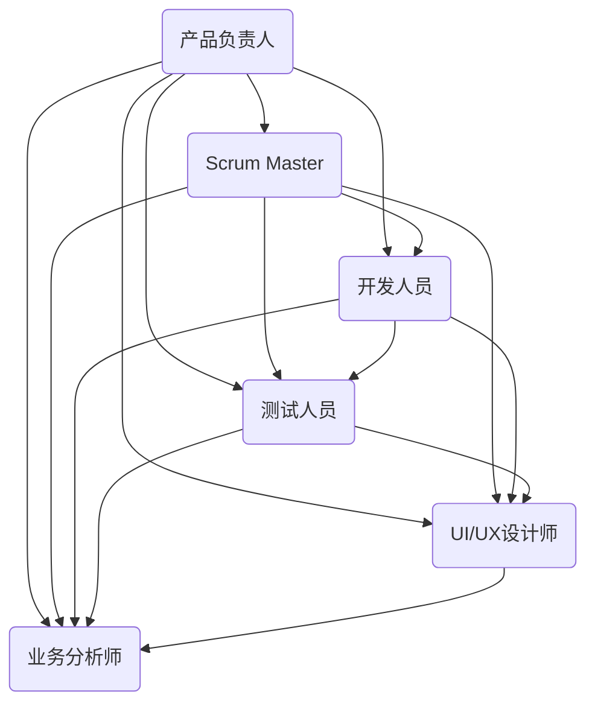

                 

### 引言

#### LLM应用开发的挑战与需求

近年来，大型语言模型（LLM，Large Language Model）在自然语言处理（NLP，Natural Language Processing）领域取得了显著的突破。从GPT-3到ChatGLM，这些模型在文本生成、机器翻译、情感分析等方面展现出了强大的能力。随着LLM技术的不断进步，其应用场景也越来越广泛，从智能客服、内容创作到教育、医疗等多个领域。然而，LLM应用开发的复杂性和挑战也随之增加。

首先，LLM模型的训练和部署过程需要大量的计算资源和数据。这不仅带来了硬件和基础设施的挑战，也对开发和运维团队的技术能力和协作提出了更高的要求。其次，LLM应用通常需要处理海量数据和实时响应，这对系统的性能和稳定性提出了严峻考验。此外，LLM应用还需要不断优化和更新，以适应不断变化的需求和场景。

为了应对这些挑战，敏捷开发（Agile Development）成为一种重要的开发方法论。敏捷开发强调快速迭代、持续交付和团队协作，通过灵活应对变化，提高开发效率和产品质量。在LLM应用开发中，敏捷团队的建设尤为重要。一个高效的敏捷团队不仅能够快速响应需求变化，还能够高效地协同工作，共同推动项目的成功。

本文将围绕LLM应用开发中的敏捷团队建设进行深入探讨。首先，我们将介绍敏捷团队建设的基础知识，包括敏捷开发的核心理念、敏捷团队的角色和组织结构等。然后，我们将详细讨论敏捷团队的工作流程、工具和文化建设，并通过具体案例来分析敏捷团队在LLM应用开发中的实际应用。最后，我们将总结敏捷团队建设的关键要素和未来展望。

#### 敏捷团队建设的重要性

敏捷团队建设在LLM应用开发中具有重要意义。首先，敏捷团队能够更好地适应快速变化的需求。在LLM应用开发中，需求变化频繁，新的应用场景和技术不断涌现。敏捷团队通过迭代开发和持续交付，可以快速调整开发方向和策略，确保项目能够及时响应市场需求。

其次，敏捷团队强调团队合作和沟通。在LLM应用开发中，项目通常涉及多个技术领域和业务场景，需要不同专业背景的团队成员共同协作。敏捷团队通过透明的沟通机制和协作工具，能够有效促进团队成员之间的信息共享和知识传递，提高整体开发效率。

此外，敏捷团队建设有助于提升项目质量和用户满意度。通过持续的迭代和反馈，敏捷团队能够及时发现和解决问题，确保产品的质量和用户体验。同时，敏捷团队注重用户参与，通过用户故事和需求评审，确保开发的工作始终围绕用户价值进行。

最后，敏捷团队建设能够提高团队的创新能力和竞争力。在快速变化的市场环境中，创新能力是企业生存和发展的关键。敏捷团队通过不断探索和实践，能够培养团队成员的创新思维和解决问题的能力，为企业的长远发展奠定基础。

总之，敏捷团队建设在LLM应用开发中具有重要的战略意义。通过建立高效、协作、创新的敏捷团队，企业能够更好地应对技术挑战和市场变化，推动项目的成功实施。

### 敏捷开发概述

#### 敏捷开发的起源与核心理念

敏捷开发（Agile Development）起源于20世纪90年代，由一组软件开发人员在美国犹他州的雪鸟滑雪胜地聚首，共同探讨如何提高软件项目的开发效率和质量。这次会议的成果是《敏捷宣言》（Manifesto for Agile Software Development），它提出了敏捷开发的核心理念。

敏捷开发的起源可以追溯到传统软件开发方法的一些局限性。在20世纪80年代和90年代初期，瀑布模型（Waterfall Model）是主流的开发方法。然而，瀑布模型过于僵化，无法应对需求变化，导致许多项目延期、超预算和失败。为了解决这些问题，软件开发界开始探索新的开发方法，以更好地适应快速变化的需求和用户需求。

《敏捷宣言》明确提出了四个核心价值观：

1. **个体和互动重于过程和工具**：敏捷开发强调团队中个体的能力和互动，认为这是提高开发效率和质量的关键。虽然工具和过程也很重要，但它们应该服务于团队的协作和个体的能力。

2. **可工作的软件重于详尽的文档**：敏捷开发认为，最终目标是交付一个可工作的软件产品，而不是产生大量的文档。虽然文档在某些情况下是必要的，但它们应该简明扼要，并且能够真正帮助团队理解项目。

3. **客户合作重于合同谈判**：敏捷开发强调与客户的紧密合作，通过不断的交流和反馈，确保开发工作始终符合客户的需求和期望。这种方法有助于提前发现和解决问题，提高客户满意度。

4. **响应变化重于遵循计划**：敏捷开发认为，需求变化是不可避免的，甚至是有益的。因此，开发团队应该具备快速适应变化的能力，通过灵活的计划和迭代开发，确保项目能够快速响应市场和技术变化。

敏捷开发的核心理念主要包括以下几个方面：

- **迭代开发**：敏捷开发采用迭代（Iteration）的方式，将开发过程划分为多个短周期（通常为2-4周）。每个迭代都会产生一个可工作的软件版本，团队可以基于用户反馈进行迭代和改进。

- **增量交付**：敏捷开发强调增量交付（Incremental Delivery），即在每个迭代中交付尽可能多的功能。这种方法有助于降低风险，确保项目能够逐步交付有价值的功能。

- **用户故事**：用户故事（User Story）是敏捷开发中的一种需求描述方式。用户故事以用户的语言编写，描述了用户希望软件实现的功能。这种方法有助于团队更好地理解用户需求，提高开发效率。

- **自动化测试**：敏捷开发强调自动化测试（Automated Testing），通过持续集成（Continuous Integration）和持续部署（Continuous Deployment）确保代码的质量和可靠性。

- **透明度**：敏捷开发强调团队内部的透明度，通过站立会议（Stand-up Meeting）、燃尽图（Burn Down Chart）等工具和方法，确保团队成员能够及时了解项目进展和问题。

敏捷开发与传统的开发方法，如瀑布模型（Waterfall Model）有显著的区别。瀑布模型是一种线性、顺序的开发方法，将开发过程划分为需求分析、设计、编码、测试等阶段，每个阶段完成后才能进入下一个阶段。这种方法在早期开发阶段确定所有需求时效果较好，但一旦需求发生变化，整个项目将面临严重的风险和挑战。

相比之下，敏捷开发更加灵活和适应变化。它采用迭代和增量的方式，允许团队在开发过程中不断调整和优化。敏捷开发还强调团队协作和用户参与，通过持续交付和反馈，确保项目能够快速响应市场需求和技术变化。

总之，敏捷开发为LLM应用开发提供了一种有效的开发方法论。通过快速迭代、持续交付和团队协作，敏捷团队能够更好地应对技术挑战和市场变化，提高开发效率和产品质量。

#### 敏捷团队与传统开发模式的主要区别

敏捷团队与传统开发模式在多个方面存在显著差异，这些差异不仅体现在开发流程上，还体现在团队组织、工作方式和价值观等方面。

首先，在开发流程上，传统开发模式通常采用瀑布模型（Waterfall Model），这种模型将整个开发过程划分为多个阶段，如需求分析、设计、编码、测试和部署，每个阶段依次进行，前一阶段完成后才能进入下一阶段。这种线性、顺序的开发方法在需求相对稳定的情况下效果较好，但一旦需求发生变化，整个项目将面临巨大的风险和挑战。

相比之下，敏捷团队采用迭代（Iteration）和增量（Incremental）的开发方式。敏捷开发将开发过程划分为多个短周期（通常为2-4周），每个周期称为一个Sprint。在每个Sprint中，团队会集中精力完成一个具体的功能模块，并交付一个可工作的软件版本。通过不断的迭代和反馈，团队可以快速调整开发方向和策略，确保项目能够及时响应市场需求和技术变化。

其次，在团队组织方面，传统开发模式通常采用职能型组织结构，团队成员按照职能分工，如开发、测试、设计等。这种组织结构有助于专业化，但可能导致团队之间的信息孤岛和沟通障碍。相比之下，敏捷团队采用跨职能型组织结构，团队成员来自不同职能领域，如开发、测试、UI设计等，共同参与项目的开发和交付。这种组织结构有助于促进团队协作和信息共享，提高整体开发效率。

在工作方式上，传统开发模式通常以任务为导向，团队成员按照任务分配进行工作，较少关注团队成员之间的互动和沟通。相比之下，敏捷团队强调团队合作和互动，通过每日站立会议（Stand-up Meeting）、迭代评审（Iteration Review）和迭代回顾（Iteration Retrospective）等机制，确保团队成员能够及时沟通和解决问题。这种工作方式有助于提高团队的凝聚力和工作效率。

在价值观方面，传统开发模式强调计划和控制，追求完美和确定性。相比之下，敏捷团队更加注重适应变化和快速响应，追求高效和灵活性。敏捷团队通过用户故事（User Story）和优先级排序（Prioritization）等方法，确保开发工作始终围绕用户价值进行。此外，敏捷团队还强调持续学习和改进，通过迭代回顾不断优化开发过程和团队协作。

总之，敏捷团队与传统开发模式在开发流程、团队组织、工作方式和价值观等方面存在显著差异。敏捷团队通过快速迭代、持续交付和团队协作，能够更好地应对技术挑战和市场变化，提高开发效率和产品质量。

#### 敏捷团队的典型角色

敏捷团队的成功离不开每个成员的协作和贡献。敏捷团队由多个关键角色组成，每个角色都有其独特的职责和功能，共同推动项目的顺利进展。以下是敏捷团队中的典型角色及其职责：

1. **产品负责人（Product Owner）**：
   - 产品负责人是敏捷团队的领导者，负责定义和明确产品的愿景、目标和优先级。
   - 他们需要与客户和利益相关者紧密合作，确保开发工作始终符合用户需求和市场趋势。
   - 产品负责人还负责编写和管理用户故事，确定每个迭代的目标和任务。

2. **Scrum Master**：
   - Scrum Master是敏捷团队的协调者和教练，负责确保团队遵循敏捷原则和流程。
   - 他们帮助团队识别和解决障碍，提供必要的支持和资源，确保团队能够高效工作。
   - Scrum Master还负责组织每日站立会议、迭代评审和迭代回顾，确保团队成员能够及时沟通和改进。

3. **开发人员（Developers）**：
   - 开发人员是敏捷团队的核心，负责实际编码、开发和测试工作。
   - 他们需要具备多种技能，如编程、测试和UI设计等，以确保软件产品的高质量和可维护性。
   - 开发人员还需要与其他团队成员紧密合作，确保每个迭代的目标能够顺利实现。

4. **测试人员（Testers）**：
   - 测试人员在敏捷团队中负责确保软件产品的质量和可靠性。
   - 他们编写和执行自动化测试脚本，进行功能测试、性能测试和兼容性测试。
   - 测试人员还需要与开发人员紧密合作，及时反馈问题，并确保问题得到有效解决。

5. **UI/UX设计师（UI/UX Designer）**：
   - UI/UX设计师负责软件产品的用户界面设计和用户体验优化。
   - 他们通过用户研究和用户故事，确保软件产品的设计符合用户需求和预期。
   - UI/UX设计师还需要与开发人员和产品负责人密切合作，确保设计能够在技术和商业目标之间取得平衡。

6. **业务分析师（Business Analyst）**：
   - 业务分析师负责分析和理解业务需求，确保软件产品能够满足业务目标。
   - 他们与产品负责人和开发人员紧密合作，确保用户故事和需求文档的准确性和可实施性。
   - 业务分析师还需要进行需求验证和用户测试，确保软件产品在商业和用户层面均符合预期。

通过以上典型角色的协作，敏捷团队能够高效地完成软件项目的开发和交付。每个角色都有其独特的职责和贡献，共同推动项目的成功。产品负责人的愿景和目标设定，Scrum Master的流程指导和团队协调，开发人员的编码和测试工作，测试人员的质量保障，UI/UX设计师的用户体验设计，以及业务分析师的业务需求理解，都是敏捷团队成功的关键要素。

#### 敏捷团队的角色职责与协作

在敏捷团队中，各个角色之间的高效协作是实现项目成功的关键。每个角色都承担着特定的职责，同时与其他角色密切合作，以确保项目目标的实现。

**产品负责人（Product Owner）**负责定义产品的愿景和目标，他们与利益相关者（如客户、管理层）密切沟通，确保开发工作始终围绕用户需求和市场趋势展开。产品负责人负责编写和管理用户故事，确定每个迭代的目标和任务。在敏捷团队中，产品负责人需要定期与Scrum Master和开发团队进行沟通，确保用户故事的清晰性和优先级。

**Scrum Master**作为团队的协调者和教练，负责确保团队遵循敏捷原则和流程。Scrum Master的职责包括组织每日站立会议、迭代评审和迭代回顾。在每日站立会议中，团队成员汇报自己的工作进展和遇到的障碍，Scrum Master协调解决这些问题。在迭代评审中，团队展示已完成的工作，获取用户和利益相关者的反馈。在迭代回顾中，团队总结经验教训，持续改进开发流程。Scrum Master还需要监控团队的进度，提供必要的支持和资源，确保团队高效工作。

**开发人员**负责实际编码、开发和测试工作。他们是敏捷团队的核心，需要与其他角色紧密合作。在敏捷开发中，开发人员通常采用结对编程（Pair Programming）和代码审查（Code Review）等方法，提高代码质量和团队协作。开发人员与产品负责人协作，确保开发工作符合用户需求。与Scrum Master协作，确保及时解决开发中的问题。与测试人员协作，确保软件产品的质量和可靠性。

**测试人员**负责确保软件产品的质量和可靠性。他们编写和执行自动化测试脚本，进行功能测试、性能测试和兼容性测试。测试人员与开发人员紧密合作，及时反馈问题，并参与问题的分析和解决。在敏捷开发中，测试人员不仅参与测试阶段，还参与设计和开发阶段，通过持续集成（Continuous Integration）和持续部署（Continuous Deployment）确保代码的质量和稳定性。

**UI/UX设计师**负责软件产品的用户界面设计和用户体验优化。他们通过用户研究和用户故事，确保软件产品的设计符合用户需求和预期。UI/UX设计师与开发人员紧密合作，确保设计能够落地实施。同时，他们还需要与产品负责人和Scrum Master沟通，确保设计决策符合商业目标和敏捷流程。

**业务分析师**负责分析和理解业务需求，确保软件产品能够满足业务目标。他们与产品负责人和开发团队协作，确保用户故事和需求文档的准确性和可实施性。业务分析师还需要进行需求验证和用户测试，确保软件产品在商业和用户层面均符合预期。

通过以上角色的密切协作，敏捷团队能够高效地完成软件项目的开发和交付。每个角色都发挥其独特的作用，同时与其他角色紧密合作，确保项目目标的实现。以下是敏捷团队角色协作的Mermaid流程图：

```mermaid
gantt
    title 敏捷团队角色协作流程

    section 每日站立会议
    A(:Scrum Master) :ongoing->B(:Developers) :3d
    B(:Developers) :ongoing->C(:Testers) :3d
    C(:Testers) :ongoing->D(:UI/UX Designer) :3d
    D(:UI/UX Designer) :ongoing->E(:Business Analyst) :3d

    section 迭代评审
    E(:Business Analyst) :ongoing->F(:Product Owner) :3d
    F(:Product Owner) :ongoing->G(:Scrum Master) :3d
    G(:Scrum Master) :ongoing->H(:All Team Members) :3d

    section 迭代回顾
    H(:All Team Members) :ongoing->I(:Scrum Master) :3d
    I(:Scrum Master) :ongoing->J(:Product Owner) :3d
```

通过这种高效的协作机制，敏捷团队能够更好地应对变化，提高开发效率和产品质量，确保项目的成功实施。

#### 敏捷团队架构

敏捷团队架构是确保团队高效协作和项目成功的关键。一个良好的敏捷团队架构不仅能够促进团队成员之间的沟通和协作，还能够适应不同项目的需求和变化。以下是敏捷团队架构的几个关键组成部分：

**1. 团队规模和组织结构**

敏捷团队通常采用小型团队结构，以促进团队成员之间的紧密协作和快速沟通。团队规模一般控制在5-9人之间，这样能够确保团队成员能够充分了解彼此的工作内容和进展情况。在组织结构上，敏捷团队通常采用跨职能型组织结构，即团队成员来自不同的职能领域，如开发、测试、UI设计等，共同参与项目的开发和交付。这种组织结构有助于打破信息孤岛，提高团队的协同效率。

**2. 团队角色的职责划分**

在敏捷团队中，每个成员都扮演着特定的角色，并承担相应的职责。主要角色包括：

- **产品负责人（Product Owner）**：负责定义产品愿景、目标和优先级，编写和管理用户故事。
- **Scrum Master**：负责确保团队遵循敏捷原则和流程，协调解决团队中的障碍和问题。
- **开发人员**：负责实际编码、开发和测试工作，确保软件产品的质量和可靠性。
- **测试人员**：负责测试软件产品的质量和可靠性，编写和执行自动化测试脚本。
- **UI/UX设计师**：负责软件产品的用户界面设计和用户体验优化。
- **业务分析师**：负责分析和理解业务需求，确保软件产品能够满足业务目标。

这些角色之间需要密切协作，共同推动项目的进展。

**3. 团队沟通机制**

高效的沟通是敏捷团队成功的关键。敏捷团队通常采用以下沟通机制：

- **每日站立会议**：每天早晨，团队成员会举行站立会议，每人用不超过15分钟的时间汇报自己的工作进展和遇到的障碍。这有助于团队成员快速了解项目进展，及时解决问题。
- **迭代评审**：在迭代周期的末尾，团队会展示已完成的工作，获取用户和利益相关者的反馈。这有助于确保团队交付的软件产品符合用户需求。
- **迭代回顾**：在迭代周期的末尾，团队会进行回顾，总结经验教训，持续改进开发流程和团队协作。

**4. 团队协作工具**

敏捷团队通常使用一系列协作工具，以提高团队的协作效率和沟通质量。常用的协作工具有：

- **项目管理工具**：如Jira、Trello等，用于跟踪任务、管理进度和分配工作。
- **协作平台**：如Slack、Microsoft Teams等，用于实时沟通和协作。
- **代码管理工具**：如Git，用于代码的版本控制和协作开发。
- **测试管理工具**：如Selenium、Cypress等，用于自动化测试和测试管理。

**5. 敏捷团队的架构设计**

敏捷团队的架构设计需要考虑以下几个方面：

- **灵活性**：团队架构应该具有灵活性，能够适应不同项目需求的变化和扩展。
- **适应性**：团队架构应该能够快速适应新成员的加入和角色的变化。
- **透明度**：团队架构应该具有高透明度，确保团队成员能够及时了解项目进展和问题。

以下是敏捷团队架构设计的Mermaid流程图：



通过合理的敏捷团队架构设计，团队能够高效协作，快速响应变化，确保项目的成功实施。同时，敏捷团队的架构设计也需要根据具体项目的需求和团队特点进行灵活调整，以实现最佳效果。

#### 敏捷团队的工作流程

敏捷团队的工作流程是确保项目高效、有序推进的关键。敏捷开发强调快速迭代、持续交付和透明度，通过灵活的工作流程，团队能够更好地应对变化，提高开发效率。以下是敏捷团队的主要工作流程：

**1. Sprint计划会议**

Sprint计划会议是敏捷团队在开始每个迭代周期时的第一个重要活动。在这个会议上，团队会确定本次迭代的目标和任务，并分配工作。产品负责人（Product Owner）会详细介绍用户故事和优先级，开发人员会根据用户故事进行任务分解，并评估完成每个任务所需的时间和资源。

伪代码示例：

```python
# Sprint计划会议伪代码

def sprint_plan会议(product_owner, developers):
    user_stories = product_owner.get_user_stories()
    priorities = product_owner.get_priorities()
    
    for user_story in user_stories:
        developers.break_down_task(user_story)
        developers.estimate_time_and_resources()

    schedule_tasks(developers)
```

**2. 每日站立会议**

每日站立会议是敏捷团队每天早晨进行的一个简短会议，每个团队成员用不超过15分钟的时间汇报自己的工作进展和遇到的障碍。这种会议有助于团队成员之间保持沟通，及时解决问题，确保项目按计划进行。

伪代码示例：

```python
# 每日站立会议伪代码

def daily_stand_up(team_members):
    for member in team_members:
        member.report_progress()
        member.report_blocked_issues()
```

**3. 迭代评审**

迭代评审是每个迭代周期的末尾进行的一个活动，团队会展示已完成的工作，并获取用户和利益相关者的反馈。这个会议有助于确保团队交付的软件产品符合用户需求，并及时调整后续的开发方向。

伪代码示例：

```python
# 迭代评审伪代码

def iteration_review(developers, product_owner, stakeholders):
    completed_work = developers.show_completed_work()
    feedback = product_owner.collect_feedback(completed_work)
    stakeholders.review_and_discuss(feedback)
```

**4. 迭代回顾**

迭代回顾是每个迭代周期结束时的一个活动，团队会总结本次迭代的经验教训，讨论改进的机会和措施，并规划下一个迭代的目标和任务。这个会议有助于团队不断学习和改进，提高开发效率。

伪代码示例：

```python
# 迭代回顾伪代码

def iteration_retrospective(team_members):
    lessons_learned = team_members.summarize_lessons()
    improvements = team_members.identify_improvements()
    plan_next_sprint(lessons_learned, improvements)
```

**5. 燃尽图**

燃尽图（Burn Down Chart）是敏捷团队用于跟踪项目进度和评估项目风险的重要工具。燃尽图显示任务剩余时间与实际消耗时间的关系，通过分析燃尽图，团队可以及时调整计划和资源，确保项目按时完成。

以下是一个燃尽图的Mermaid示例：

```mermaid
gantt
    title 燃尽图示例

    section Sprint 1
    A1(任务1) :start=>2023-04-01 :duration=>5d
    A2(任务2) :start=>2023-04-06 :duration=>3d
    A3(任务3) :start=>2023-04-09 :duration=>2d

    section Sprint 2
    B1(任务4) :start=>2023-04-11 :duration=>4d
    B2(任务5) :start=>2023-04-15 :duration=>3d
    B3(任务6) :start=>2023-04-18 :duration=>2d

    section Sprint 3
    C1(任务7) :start=>2023-04-20 :duration=>5d
    C2(任务8) :start=>2023-04-25 :duration=>3d
    C3(任务9) :start=>2023-04-28 :duration=>2d
```

通过以上敏捷团队的工作流程，团队能够高效地推进项目，快速响应变化，确保项目的成功实施。

#### 用户故事与任务管理

在敏捷开发中，用户故事（User Story）是需求描述的核心机制，它以用户的视角来定义软件功能，确保开发工作始终围绕用户价值进行。用户故事的编写和管理是敏捷团队成功的关键环节。

**用户故事的格式**

用户故事通常遵循以下标准格式：

```
As a [user role],
I want [a feature or functionality],
so that [a reason or benefit].
```

例如：

```
As a user,
I want to search for products,
so that I can find what I am looking for easily.
```

这种格式有助于明确用户角色、期望功能和实现目标。

**用户故事的特点**

- **简洁性**：用户故事应简洁明了，避免冗长和复杂。
- **可测试性**：用户故事应具备可测试性，即能够明确地判断其是否完成。
- **可分解性**：用户故事可以分解成更小的任务，以适应迭代开发。

**用户故事的编写过程**

编写用户故事通常分为以下几个步骤：

1. **识别用户角色**：确定软件的目标用户，明确用户故事的主体。
2. **确定用户需求**：与用户进行交流，了解他们的需求和期望。
3. **编写用户故事**：根据用户需求和角色，按照标准格式编写用户故事。
4. **验证用户故事**：与用户和团队成员验证用户故事的准确性，确保其符合用户需求和可实施性。

**任务管理**

在敏捷开发中，用户故事通常分解成一系列任务（Tasks），这些任务是由开发人员负责完成的具体工作项。任务管理是确保用户故事顺利实现的重要环节。

**任务管理的步骤**

1. **分解用户故事**：将用户故事分解成可操作的任务，确保每个任务都是独立的、可测量的。
2. **任务优先级排序**：根据用户故事的优先级和项目的整体进度，对任务进行优先级排序。
3. **任务分配**：将任务分配给相应的开发人员，明确任务的负责人和完成时间。
4. **任务跟踪**：使用任务管理工具（如Jira、Trello等）跟踪任务的进度，确保每个任务按时完成。

**任务管理工具**

敏捷团队常用的任务管理工具有：

- **Jira**：功能强大的任务跟踪和管理工具，支持任务分配、进度跟踪和报告生成。
- **Trello**：简洁直观的任务管理工具，通过卡片和看板视图管理任务。
- **Asana**：灵活的任务管理平台，支持任务分配、进度跟踪和团队协作。

**任务管理的伪代码示例**：

```python
# 用户故事分解和任务管理伪代码

def decompose_user_story(user_story):
    tasks = []
    for step in user_story.steps:
        task = create_task(step)
        tasks.append(task)
    return tasks

def create_task(step):
    return {
        "name": step.description,
        "status": "pending",
        "assignee": find_assignee(),
        "due_date": calculate_due_date()
    }

def find_assignee():
    # 算法根据任务复杂度和团队成员技能进行任务分配
    return "developer1"

def calculate_due_date():
    # 算法根据任务优先级和项目进度计算任务的完成日期
    return "2023-04-15"
```

通过有效的用户故事和任务管理，敏捷团队能够确保需求得到准确理解和实现，从而提高开发效率和产品质量。用户故事的简洁性和可测试性，以及任务管理的有序和透明，都是敏捷团队成功的关键因素。

#### 敏捷团队的沟通与协作

在敏捷团队中，沟通与协作是确保项目顺利进行和团队高效工作的关键。通过透明的沟通机制和高效的协作工具，敏捷团队能够确保信息流畅传递，团队成员之间能够及时解决问题，共同推动项目成功。

**沟通机制**

1. **每日站立会议**：每日站立会议是敏捷团队每日早晨进行的一个简短会议，每个团队成员用不超过15分钟的时间汇报自己的工作进展和遇到的障碍。这种会议有助于团队成员之间保持沟通，及时解决问题，确保项目按计划进行。

2. **迭代评审**：迭代评审是每个迭代周期的末尾进行的一个活动，团队会展示已完成的工作，并获取用户和利益相关者的反馈。这种会议有助于确保团队交付的软件产品符合用户需求，并及时调整后续的开发方向。

3. **迭代回顾**：迭代回顾是每个迭代周期结束时的一个活动，团队会总结本次迭代的经验教训，讨论改进的机会和措施，并规划下一个迭代的目标和任务。这种会议有助于团队不断学习和改进，提高开发效率。

**协作工具**

1. **项目管理工具**：敏捷团队常用的项目管理工具包括Jira、Trello和Asana等。这些工具支持任务分配、进度跟踪和报告生成，有助于团队高效管理项目和任务。

2. **协作平台**：协作平台如Slack、Microsoft Teams和Google Chat等，提供实时沟通和协作功能，团队成员可以通过文字、语音和视频进行交流，确保信息及时传递。

3. **代码管理工具**：代码管理工具如Git，用于代码的版本控制和协作开发。通过Git，团队成员可以实时更新代码，进行代码审查和合并，确保代码的质量和一致性。

4. **测试管理工具**：测试管理工具如Selenium、Cypress等，用于自动化测试和测试管理。通过这些工具，团队可以确保软件产品的质量和可靠性。

**敏捷团队与外部团队的协作**

敏捷团队不仅需要在内部高效协作，还需要与外部团队（如客户、供应商和合作伙伴）进行紧密合作。以下是一些关键的协作方式：

1. **用户故事地图**：用户故事地图是一种可视化工具，用于展示软件产品的功能模块和用户故事之间的关系。通过用户故事地图，敏捷团队可以更好地理解客户需求，并与客户保持持续沟通。

2. **迭代交付**：敏捷团队通过迭代交付，将已完成的功能模块交付给外部团队。这种方式有助于外部团队及时反馈和调整需求，确保软件产品能够满足客户需求。

3. **持续集成与部署**：敏捷团队采用持续集成（CI，Continuous Integration）和持续部署（CD，Continuous Deployment）的方法，确保代码的持续集成和交付。通过自动化测试和部署，团队可以快速响应外部团队的需求变化。

4. **定期会议**：敏捷团队定期与外部团队进行会议，如需求评审会议、进度汇报会议等。这些会议有助于外部团队了解项目进展，及时调整需求和资源。

总之，敏捷团队的沟通与协作是项目成功的关键。通过透明的沟通机制和高效的协作工具，敏捷团队能够确保信息流畅传递，团队成员之间能够及时解决问题，共同推动项目成功。同时，敏捷团队与外部团队的紧密协作，也有助于确保软件产品能够满足客户需求，实现项目的商业目标。

### 敏捷开发工具介绍

在敏捷团队的建设中，选择合适的工具是确保团队高效协作和项目顺利进行的关键。以下是几种常用的敏捷开发工具及其功能特点：

**1. Jira**

Jira是由Atlassian公司开发的一款功能强大的敏捷项目管理工具。它支持任务跟踪、迭代规划、报告生成和协作等多种功能，广泛应用于软件开发和项目管理的各个阶段。

- **功能特点**：
  - **任务管理**：Jira提供了丰富的任务管理功能，包括任务创建、分配、状态更新和进度跟踪。
  - **迭代规划**：通过迭代看板，团队可以直观地查看任务进度和迭代目标。
  - **报告生成**：Jira支持多种报告类型，如燃尽图、迭代进度报告等，帮助团队了解项目状况。
  - **协作与沟通**：Jira内置了协作功能，支持团队之间的实时沟通和任务讨论。

- **应用场景**：适用于大型团队和复杂项目，能够有效地管理多个迭代和任务。

**2. Trello**

Trello是一款基于看板的简单直观的任务管理工具。它通过卡片和看板视图，帮助团队可视化任务流程和进度。

- **功能特点**：
  - **看板视图**：Trello的主要特点是看板视图，通过拖放操作，团队可以轻松管理任务状态和优先级。
  - **卡片功能**：每个任务卡片都包含详细信息、标签、评论和附件，支持任务追踪和协作。
  - **集成扩展**：Trello支持与多种工具和服务的集成，如Slack、Google Drive等，提高团队协作效率。

- **应用场景**：适用于小型团队和简单项目，特别适合需要可视化任务流程和灵活调整的团队。

**3. Asana**

Asana是一款灵活的任务管理平台，旨在帮助团队更好地组织工作、跟踪任务和协作。

- **功能特点**：
  - **任务跟踪**：Asana支持任务创建、分配和进度跟踪，确保每个任务都按时完成。
  - **团队协作**：通过协作功能，团队成员可以实时沟通、共享文件和讨论任务。
  - **时间跟踪**：Asana提供了时间跟踪功能，帮助团队监控项目进度和工作量。
  - **报告与仪表盘**：Asana支持多种报告和仪表盘，帮助团队了解项目状况和进度。

- **应用场景**：适用于各种规模和类型的团队，特别适合需要跨部门和跨功能协作的项目。

**4. Slack**

Slack是一款流行的即时通讯和协作工具，支持实时消息、语音和视频通话，以及文件共享和集成第三方服务。

- **功能特点**：
  - **实时沟通**：Slack提供实时消息和聊天功能，支持创建频道和群组，方便团队成员之间的沟通。
  - **集成扩展**：Slack支持与多种工具和服务的集成，如Jira、Google Drive、Trello等，提高工作效率。
  - **自动化和机器人**：Slack支持自动化流程和机器人，帮助团队自动化日常任务和提醒。

- **应用场景**：适用于需要高效实时沟通的团队，特别适合跨地域、跨时区的团队协作。

**5. Git**

Git是一款分布式版本控制系统，用于代码的版本控制和协作开发。它是敏捷开发中不可或缺的工具。

- **功能特点**：
  - **版本控制**：Git支持对代码的版本控制，确保代码的完整性和可追溯性。
  - **分支管理**：Git提供了强大的分支管理功能，支持多人协作和代码合并。
  - **分布式特性**：Git是分布式版本控制系统，每个开发人员都可以在自己的计算机上管理和维护代码。

- **应用场景**：适用于所有软件开发项目，特别适合需要多人协作和版本管理的项目。

通过合理选择和利用这些敏捷开发工具，团队可以显著提高工作效率，确保项目顺利推进。不同的工具各有特点，团队可以根据项目需求和团队习惯选择合适的工具，以实现最佳效果。

### 敏捷工具的实际应用案例

为了更好地理解敏捷工具在实际项目中的应用，我们来看几个具体的案例，这些案例展示了敏捷工具如何帮助团队提高开发效率、管理任务和优化协作流程。

**案例一：某电商平台的敏捷团队建设**

某电商平台在进行新功能的开发时，采用了Jira进行任务管理和项目进度跟踪。该团队首先在Jira中创建了一个项目，并定义了多个迭代周期。每个迭代周期开始时，产品负责人（Product Owner）会在Jira中创建一系列用户故事和任务，并分配给开发人员和测试人员。

- **任务管理**：团队使用Jira的迭代看板（Sprint Board），将任务分为“待办（To Do）”、“进行中（In Progress）”和“已完成（Done）”三个状态。通过看板，团队成员可以实时了解任务的状态和进度。
- **进度跟踪**：Jira的燃尽图（Burn Down Chart）帮助团队监控项目的进展情况。通过分析燃尽图，团队可以及时发现进度偏差，并采取相应的措施进行调整。
- **协作与沟通**：Jira内置的评论功能允许团队成员在任务卡片上讨论问题，分享心得。此外，团队还使用了Slack进行实时沟通，确保信息传递的及时性和准确性。

**案例二：某金融公司的敏捷开发项目**

某金融公司的一个敏捷开发项目涉及到多个业务模块的整合。团队采用了Trello进行任务管理和协作。Trello的看板视图使得任务流程可视化，团队可以直观地看到每个任务的状态和优先级。

- **任务分解**：用户故事在Trello中分解成多个任务，每个任务都附有详细的描述和标签。
- **优先级排序**：团队使用Trello的优先级功能，将任务按照紧急程度和重要性进行排序。
- **协作与跟踪**：团队成员在任务卡片上添加评论，共享文件，确保任务进度透明和可控。同时，Trello支持与其他工具的集成，如Google Drive和Confluence，提高了团队协作的效率。

**案例三：某医疗健康应用的敏捷团队实践**

某医疗健康应用开发团队在项目开发过程中使用了Asana进行任务管理和协作。Asana的灵活性和多功能性使得团队能够高效地管理复杂项目。

- **任务分配与跟踪**：团队通过Asana创建任务，并将任务分配给具体的团队成员。Asana的“任务进度”功能允许团队成员实时更新任务状态，确保任务按时完成。
- **时间跟踪**：团队使用Asana的时间跟踪功能，记录每个任务的实际耗时，帮助团队了解项目的工作量和工作效率。
- **协作与沟通**：Asana的协作功能支持团队成员实时沟通和讨论。团队还通过Asana的“讨论板”功能，汇总讨论结果，确保团队成员之间的信息同步。

**案例分析**

通过以上案例，我们可以看到，敏捷工具在实际项目中发挥了重要作用：

1. **任务管理和进度跟踪**：敏捷工具帮助团队清晰定义任务，明确任务状态和优先级，确保任务按时完成。燃尽图等可视化工具提供了直观的项目进度展示，有助于团队及时发现和解决问题。

2. **协作与沟通**：敏捷工具提供了多种协作机制，如任务评论、实时聊天和文件共享，确保团队成员之间的信息流畅传递。这种高效的沟通机制有助于提高团队的协作效率。

3. **灵活性与可扩展性**：不同的敏捷工具具有不同的功能特点，团队可以根据项目需求和团队习惯选择合适的工具，以实现最佳效果。同时，敏捷工具的支持集成扩展，有助于团队整合多种工具和服务，提高整体效率。

4. **持续改进**：敏捷工具鼓励团队通过迭代和反馈不断优化开发流程和团队协作。通过迭代回顾和持续改进，团队能够不断提升开发效率和产品质量。

总之，敏捷工具的实际应用案例展示了它们在任务管理、进度跟踪、协作与沟通以及持续改进等方面的优势。通过合理利用这些工具，敏捷团队能够显著提高项目效率，确保项目的成功实施。

#### 敏捷团队文化建设

敏捷团队的文化建设是确保团队高效协作和项目成功的关键因素。一个积极、开放和协作的团队文化能够促进团队成员之间的信任和理解，提高团队的凝聚力和工作效率。以下是敏捷团队文化建设的重要性、核心价值以及实践方法。

**1. 重要性**

敏捷团队文化建设的重要性主要体现在以下几个方面：

- **提高团队凝聚力**：一个共同的价值观和文化能够将团队成员紧密联系在一起，形成强大的团队凝聚力。团队成员在共同的目标和文化氛围下，更容易产生共鸣，共同克服困难。

- **促进团队合作**：敏捷团队强调跨职能协作和开放沟通。一个积极的团队文化能够鼓励团队成员相互支持，共同解决问题，提高整体协作效率。

- **提高工作效率**：良好的团队文化能够营造一个高效的工作环境，减少内部摩擦和沟通障碍，从而提高团队的整体工作效率。

- **持续学习和改进**：敏捷文化倡导持续学习和不断改进。一个积极向上的团队文化能够鼓励团队成员不断学习新知识、新技能，并通过迭代和反馈不断提升团队和项目的质量。

**2. 核心价值**

敏捷团队文化的核心价值包括：

- **开放和透明**：团队成员之间的沟通是敏捷团队成功的关键。一个开放和透明的团队文化鼓励团队成员分享知识和经验，及时沟通问题和进展，确保信息流通。

- **协作和互助**：敏捷团队强调团队合作，鼓励团队成员相互支持、共同成长。一个协作和互助的团队文化能够促进团队成员之间的紧密合作，提高整体工作效率。

- **自主和责任**：敏捷团队鼓励团队成员自主决策和承担责任。一个自主和责任的团队文化能够激发团队成员的积极性和创造力，提高团队自主解决问题和应对变化的能力。

- **学习和改进**：敏捷团队重视持续学习和不断改进。一个学习和改进的团队文化能够鼓励团队成员不断探索新知识、新方法，并通过迭代和反馈不断提升团队和项目的质量。

**3. 实践方法**

以下是一些实践方法，用于建立和维护敏捷团队文化：

- **团队建设活动**：定期组织团队建设活动，如团队聚餐、户外拓展等，增强团队成员之间的互动和信任。

- **沟通机制**：建立有效的沟通机制，如每日站立会议、迭代评审和迭代回顾，确保团队成员之间的信息流畅传递。

- **知识共享**：鼓励团队成员分享知识和经验，通过技术分享、内部讲座等方式，提升团队的整体技能水平。

- **激励与认可**：建立公平的激励机制，对团队成员的成就和贡献进行认可和奖励，增强团队成员的积极性和归属感。

- **持续学习**：提供培训和学习机会，鼓励团队成员不断提升自己的技能和知识，支持团队成员参加专业培训和认证。

- **冲突管理**：建立冲突管理机制，通过有效沟通和协商解决团队成员之间的分歧，确保团队和谐稳定。

通过以上实践方法，敏捷团队能够建立一个积极、开放和协作的团队文化，提高团队的凝聚力和工作效率，为项目的成功实施奠定坚实的基础。

### 敏捷团队协作技巧

在敏捷团队中，高效的协作是确保项目成功的关键。以下是一些关键的敏捷团队协作技巧，包括团队内部的有效沟通和冲突管理策略。

**1. 团队内部的有效沟通**

- **每日站立会议**：每日站立会议是敏捷团队保持沟通的有效方式。每个成员用不超过15分钟的时间分享自己的工作进展、遇到的障碍和计划，确保团队成员对项目状态有清晰了解。

  ```mermaid
  graph TD
      A(站立会议) --> B(进展汇报)
      B --> C(障碍反馈)
      C --> D(计划讨论)
  ```

- **迭代评审和回顾**：迭代评审和回顾会议是团队交流的重要环节。在评审会议上，团队展示已完成的工作，获取用户和利益相关者的反馈；在回顾会议上，团队总结经验教训，讨论改进措施。

  ```mermaid
  graph TD
      A(迭代评审) --> B(工作展示)
      B --> C(反馈收集)
      C --> D(需求调整)
      
      E(迭代回顾) --> F(经验总结)
      F --> G(改进讨论)
      G --> H(计划制定)
  ```

- **信息共享**：利用协作工具（如Jira、Trello等）创建任务看板，实时更新任务状态和进度，确保所有团队成员都能及时获取信息。

  ```mermaid
  graph TD
      A(协作工具) --> B(任务看板)
      B --> C(任务状态更新)
      B --> D(进度跟踪)
  ```

**2. 冲突管理策略**

- **主动沟通**：在冲突发生时，主动与相关方进行沟通，表达自己的观点和感受。通过坦诚交流，理解对方的立场和需求，寻找共同点。

  ```mermaid
  graph TD
      A(冲突发生) --> B(主动沟通)
      B --> C(理解立场)
      C --> D(寻找共同点)
  ```

- **中立调解**：当团队成员之间的冲突难以自行解决时，可以邀请Scrum Master或外部调解人员介入。他们以中立身份帮助团队找到解决方案。

  ```mermaid
  graph TD
      A(冲突难以解决) --> B(邀请调解)
      B --> C(中立调解)
      C --> D(解决方案)
  ```

- **建立共识**：通过团队讨论，达成共识，确保所有团队成员对问题解决方案和行动计划有共同的理解和承诺。

  ```mermaid
  graph TD
      A(团队讨论) --> B(建立共识)
      B --> C(行动计划)
      C --> D(执行落实)
  ```

通过这些敏捷团队协作技巧，团队能够更好地应对项目中的各种挑战，提高整体工作效率和项目成功概率。

### 案例一：某公司的敏捷团队建设实践

**案例背景**

某知名科技公司A公司在进行其最新人工智能产品LLM模型的开发和部署过程中，遇到了传统开发模式带来的诸多挑战。随着项目需求的不断增加和变化，A公司发现传统的瀑布模型已经无法满足快速迭代和灵活响应的需求。因此，公司决定采用敏捷开发方法，并着手进行敏捷团队的建设。

**敏捷团队建设过程**

1. **团队组建**：
   - **角色分配**：A公司根据项目需求，组建了一个跨职能的敏捷团队。团队成员包括产品负责人（Product Owner）、Scrum Master、开发人员、测试人员和UI/UX设计师。
   - **职责明确**：每个团队成员的职责和角色都进行了清晰的定义。产品负责人负责定义产品的愿景和用户需求，Scrum Master负责确保团队遵循敏捷原则和流程，开发人员负责编码和实现功能，测试人员负责测试和确保产品质量，UI/UX设计师负责用户界面的设计和用户体验优化。

2. **流程优化**：
   - **迭代周期**：A公司采用了两周一次的迭代周期，每个迭代周期包含Sprint计划会议、每日站立会议、迭代评审和迭代回顾。
   - **任务管理**：团队使用了Jira进行任务管理和进度跟踪。每个迭代开始时，产品负责人在Jira中创建用户故事和任务，并分配给团队成员。团队成员通过Jira实时更新任务状态和进度。

3. **文化建设**：
   - **沟通机制**：团队建立了每日站立会议和迭代评审会议，确保团队成员之间的信息畅通。同时，通过内部邮件和协作工具（如Slack）进行日常沟通。
   - **知识共享**：团队定期举办技术分享会，鼓励成员分享经验和学习成果，提高整体技术水平。
   - **激励制度**：公司建立了公平的激励机制，对团队成员的突出表现给予认可和奖励，增强团队成员的积极性和归属感。

**敏捷团队建设效果评估**

1. **项目进展**：
   - **迭代交付**：通过敏捷开发方法，A公司能够快速迭代交付功能模块，及时响应用户需求和市场变化。每个迭代周期结束时，团队都会交付一个可工作的软件版本。
   - **进度跟踪**：通过Jira的燃尽图，团队可以实时监控项目进度，确保每个任务按时完成。

2. **团队协作**：
   - **沟通效率**：每日站立会议和迭代评审会议提高了团队成员之间的沟通效率，确保项目进展透明和可控。
   - **知识共享**：通过技术分享会，团队成员之间的知识共享和技能提升，增强了团队的整体战斗力。

3. **用户满意度**：
   - **用户反馈**：通过迭代评审会议，团队能够及时获取用户和利益相关者的反馈，并根据反馈进行调整和优化，提高了用户满意度。
   - **产品质量**：通过严格的测试流程和持续改进，团队交付的软件产品在质量和用户体验方面得到了用户的认可。

4. **文化建设**：
   - **团队凝聚力**：通过定期的团队建设和文化建设活动，团队成员之间的信任和凝聚力得到了提升，团队氛围更加积极向上。

**总结与启示**

A公司的敏捷团队建设实践表明，敏捷开发方法在LLM应用开发中具有显著的成效。通过敏捷团队的建设，公司不仅提高了项目进展的透明度和沟通效率，还增强了团队的协作和用户满意度。以下是案例的主要启示：

- **敏捷团队建设的重要性**：敏捷团队建设是成功实施敏捷开发的关键。通过明确角色职责和优化流程，团队能够高效地协同工作。
- **持续学习和改进**：敏捷团队注重持续学习和知识共享，通过不断优化开发流程和文化建设，团队能够不断提升整体效能。
- **用户参与**：敏捷开发强调用户参与和反馈，通过及时调整和优化，团队能够更好地满足用户需求，提高产品满意度。
- **灵活应对变化**：敏捷团队通过快速迭代和灵活应对变化，能够更好地适应市场需求和技术进步。

A公司的成功实践为其他公司在LLM应用开发中实施敏捷团队建设提供了有益的参考。

### 案例二：LLM应用开发的敏捷团队实践

**案例背景**

某人工智能初创公司B公司专注于开发基于大型语言模型（LLM）的应用，如智能客服系统、内容创作平台等。随着项目的不断推进，B公司发现传统的开发模式已经无法满足快速迭代和市场需求的变化。为了提高开发效率和产品质量，B公司决定采用敏捷开发方法，并着手组建一个高效的敏捷团队。

**敏捷团队建设过程**

1. **团队组建**：
   - **角色分配**：B公司根据项目需求，组建了一个包括产品负责人（Product Owner）、Scrum Master、开发人员、测试人员、UI/UX设计师和业务分析师的敏捷团队。每个团队成员都有明确的职责，如产品负责人负责用户需求收集和优先级排序，Scrum Master负责确保团队遵循敏捷原则和流程，开发人员负责实际编码和功能实现，测试人员负责确保产品质量，UI/UX设计师负责用户界面设计，业务分析师负责业务需求分析和验证。
   - **技能匹配**：团队成员来自不同的专业背景，确保团队具备多样化的技能和知识，能够应对各种复杂的技术挑战。

2. **流程优化**：
   - **迭代周期**：团队采用了两周一次的迭代周期，每个迭代周期包括Sprint计划会议、每日站立会议、迭代评审和迭代回顾。通过短周期迭代，团队能够快速响应变化和用户反馈。
   - **任务管理**：团队使用Jira进行任务管理，将用户故事分解为具体任务，并分配给合适的团队成员。Jira的看板视图帮助团队实时监控任务进度和状态。

3. **文化建设**：
   - **沟通机制**：团队建立了每日站立会议和迭代评审会议，确保团队成员之间的信息畅通。通过协作工具（如Slack）进行日常沟通，及时解决开发过程中的问题。
   - **知识共享**：团队定期举办技术分享会和头脑风暴会议，鼓励团队成员分享知识和经验，促进技能提升。
   - **激励制度**：公司建立了公平的激励机制，对团队成员的突出贡献进行奖励，增强团队成员的积极性和归属感。

**敏捷团队建设效果评估**

1. **项目进展**：
   - **迭代交付**：通过敏捷开发，B公司能够快速迭代交付功能模块，每个迭代周期都会交付一个可工作的软件版本。这种快速迭代的方式确保了产品能够及时适应市场需求。
   - **进度跟踪**：通过Jira的燃尽图和任务看板，团队可以实时监控项目进度和任务状态，确保项目按计划进行。

2. **团队协作**：
   - **沟通效率**：每日站立会议和迭代评审会议提高了团队成员之间的沟通效率，确保项目进展透明和可控。
   - **知识共享**：通过技术分享会和头脑风暴会议，团队成员之间的知识共享和技能提升，增强了团队的整体战斗力。

3. **用户满意度**：
   - **用户反馈**：通过迭代评审会议，团队能够及时获取用户和利益相关者的反馈，并根据反馈进行调整和优化，提高了用户满意度。
   - **产品质量**：通过严格的测试流程和持续改进，团队交付的软件产品在质量和用户体验方面得到了用户的认可。

4. **文化建设**：
   - **团队凝聚力**：通过定期的团队建设和文化建设活动，团队成员之间的信任和凝聚力得到了提升，团队氛围更加积极向上。

**总结与启示**

B公司的敏捷团队建设实践展示了敏捷开发在LLM应用开发中的实际效果。以下是案例的主要启示：

- **敏捷团队建设的重要性**：敏捷团队建设是成功实施敏捷开发的关键。通过明确角色职责和优化流程，团队能够高效地协同工作。
- **灵活应对变化**：敏捷团队通过快速迭代和灵活应对变化，能够更好地适应市场需求和技术进步。
- **用户参与**：敏捷开发强调用户参与和反馈，通过及时调整和优化，团队能够更好地满足用户需求，提高产品满意度。
- **持续学习和改进**：敏捷团队注重持续学习和知识共享，通过不断优化开发流程和文化建设，团队能够不断提升整体效能。

B公司的成功实践为其他公司在LLM应用开发中实施敏捷团队建设提供了有益的参考。

### 总结与展望

#### 敏捷团队建设的成功要素

敏捷团队建设的关键要素包括以下几个方面：

1. **明确角色职责**：每个团队成员都应明确自己的职责，包括产品负责人、Scrum Master、开发人员、测试人员、UI/UX设计师和业务分析师等。明确的角色分工有助于团队高效协作。

2. **灵活的迭代周期**：敏捷开发强调短周期迭代，通过快速反馈和调整，确保项目能够及时响应市场需求和技术变化。

3. **高效的沟通机制**：每日站立会议、迭代评审和迭代回顾等会议机制有助于团队成员之间的沟通和信息共享，确保项目进展透明和可控。

4. **持续学习和改进**：敏捷团队应注重持续学习和知识共享，通过技术分享、内部培训等方式，不断提升团队成员的技能和知识水平。

5. **用户参与**：用户参与和反馈是敏捷团队成功的重要因素。通过用户故事和需求评审，确保开发工作始终围绕用户价值进行。

6. **合适的工具和平台**：选择合适的敏捷工具（如Jira、Trello、Asana等）可以提高团队协作效率和任务管理效果。

#### 敏捷团队建设中的常见问题与解决方案

在敏捷团队建设过程中，团队可能会遇到以下问题：

1. **角色职责不明确**：解决方案：通过详细的角色定义和职责分配，确保每个成员都明确自己的职责和期望。

2. **沟通不畅**：解决方案：建立有效的沟通机制，如每日站立会议、迭代评审和迭代回顾，确保团队成员之间的信息流畅传递。

3. **任务分配不均**：解决方案：通过合理的任务分配和优先级排序，确保每个团队成员的工作负荷均衡。

4. **持续改进困难**：解决方案：定期组织团队讨论和反思，鼓励团队成员提出改进建议，并制定实施计划。

#### 敏捷团队建设的未来展望

随着技术的不断进步和市场需求的多样化，敏捷团队建设将面临新的挑战和机遇：

1. **自动化和智能化**：随着人工智能和自动化技术的发展，敏捷团队可以通过智能化工具和平台提高协作效率和自动化流程，减少人工干预。

2. **跨地域协作**：随着全球化进程的加快，敏捷团队将面临跨地域协作的挑战。通过云协作工具和虚拟办公室，团队可以更高效地协同工作。

3. **持续集成和持续交付**：敏捷团队将继续采用持续集成（CI）和持续交付（CD）的方法，确保软件产品的高质量和快速交付。

4. **用户中心化**：用户需求将继续成为敏捷团队的核心关注点。通过更深入的用户研究和用户反馈机制，团队将不断提升用户体验和产品满意度。

总之，敏捷团队建设在LLM应用开发中具有重要意义。通过有效的团队协作、灵活的迭代和持续的学习与改进，敏捷团队能够更好地应对技术挑战和市场变化，确保项目的成功实施。

### 最佳实践 tips

在敏捷团队建设中，以下最佳实践可以帮助团队更高效地推进项目：

1. **定期回顾**：定期进行团队回顾会议，总结经验教训，讨论改进机会。这有助于团队不断优化流程和提升协作效率。

2. **持续学习**：鼓励团队成员参加相关培训和学习活动，不断提升自己的技能和知识水平。这有助于团队应对不断变化的技术和市场需求。

3. **用户故事映射**：通过用户故事地图，明确用户需求和使用场景，确保开发工作始终围绕用户价值进行。

4. **自动化测试**：采用自动化测试工具，确保代码质量和系统稳定性。这有助于团队更快地发现和解决问题，提高开发效率。

5. **透明度**：确保团队成员之间的沟通和协作透明，通过共享信息、展示进展和问题，增强团队凝聚力。

### 小结

本文通过详细的案例分析和技术剖析，探讨了敏捷团队在LLM应用开发中的建设与实践。敏捷团队建设的关键在于明确角色职责、灵活的迭代周期、高效的沟通机制和持续的学习与改进。通过这些最佳实践，团队能够更好地应对技术挑战和市场变化，确保项目的成功实施。

### 注意事项

1. **角色职责明确**：确保每个团队成员都清楚自己的职责和期望，避免职责重叠和任务分配不均。

2. **沟通机制高效**：建立有效的沟通机制，如每日站立会议、迭代评审和迭代回顾，确保信息流通和问题及时解决。

3. **用户参与**：确保用户参与和反馈机制的有效性，通过用户故事和需求评审，确保开发工作始终围绕用户价值进行。

4. **持续学习和改进**：鼓励团队成员持续学习和技能提升，通过回顾和反馈，不断优化开发流程和团队协作。

### 拓展阅读

- 《敏捷实践指南》 - Michael James
- 《Scrum敏捷实践指南》 - Jeff Sutherland
- 《用户故事地图》 - Jeff Patton

通过阅读这些书籍和资料，读者可以更深入地了解敏捷团队建设的方法和实践，进一步提升敏捷开发的技能和水平。

### 致谢

感谢您阅读本文，希望本文对您在LLM应用开发中的敏捷团队建设有所帮助。特别感谢AI天才研究院（AI Genius Institute）和《禅与计算机程序设计艺术》（Zen And The Art of Computer Programming）对敏捷团队建设技术的贡献。希望本文能激发您在敏捷开发领域的深入探索和持续实践。

### 作者信息

**作者：AI天才研究院/AI Genius Institute & 禅与计算机程序设计艺术 /Zen And The Art of Computer Programming**。本文旨在通过深入的技术分析，探讨敏捷团队在LLM应用开发中的建设与实践，旨在为读者提供有价值的技术见解和实践指导。

