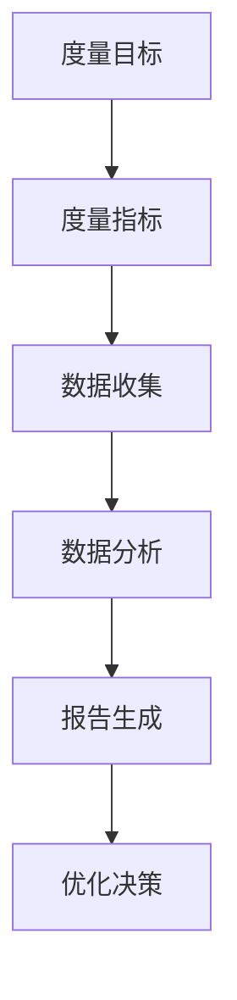
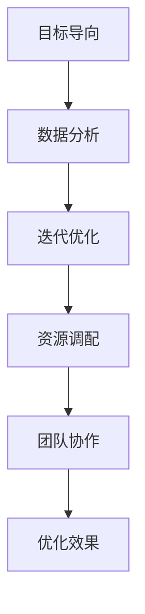
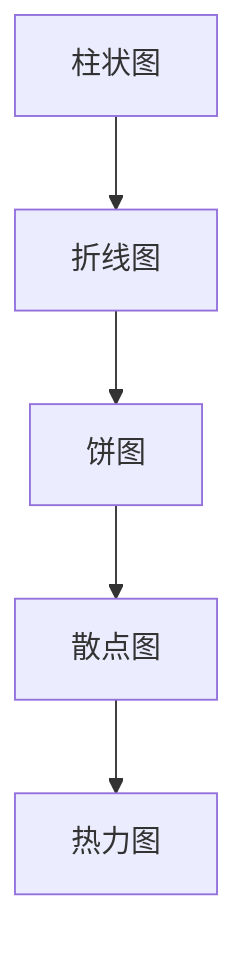

                 

### 引言：大型语言模型概述与敏捷开发的重要性

#### 1.1 LLM基础

**1.1.1 LLM的定义**

大型语言模型（Large Language Model，简称LLM）是一种基于神经网络和深度学习技术的自然语言处理模型。它通过对海量文本数据进行训练，学习到了丰富的语言知识和结构，从而具备了生成、理解、翻译和评估语言的能力。LLM的核心在于其“大”，即模型规模庞大，参数数量达到数十亿甚至千亿级别，这使得它们在处理复杂语言任务时具备显著的优越性。

**1.1.2 LLM的发展历程**

LLM的发展历程可以分为三个阶段。第一阶段是早期的基础模型，如1980年代的“网络翻译器”（Network Translation Model）和“大规模神经网络语言模型”（Neural Network Language Model）。第二阶段是2000年代中期的“循环神经网络”（Recurrent Neural Network，RNN）和“长短时记忆网络”（Long Short-Term Memory，LSTM），这些模型提高了语言处理的效率和准确性。第三阶段是2018年以来的“预训练-微调”范式（Pre-training and Fine-tuning），这一阶段以OpenAI的GPT系列模型为代表，实现了显著的性能提升。

**1.1.3 LLM在应用开发中的优势**

LLM在应用开发中具有多项优势。首先，LLM能够处理大量的文本数据，从而实现高效的数据分析。其次，LLM具备强大的语言生成能力，可以生成高质量的文本内容，如新闻、文章、对话等。此外，LLM在翻译、情感分析、命名实体识别等自然语言处理任务上也表现出色。这些优势使得LLM成为现代应用开发中不可或缺的工具。

#### 1.2 敏捷开发方法论

**1.2.1 敏捷开发的核心原则**

敏捷开发（Agile Development）是一种以人为核心、迭代、渐进的开发方法。其核心原则包括：

1. **个体和互动重于过程与工具**：强调团队成员之间的沟通与协作。
2. **可工作的软件重于详尽的文档**：认为软件的实际运行效果比文档更重要。
3. **客户合作重于合同谈判**：与客户保持紧密合作，确保产品满足实际需求。
4. **响应变化重于遵循计划**：灵活应对变化，而不是严格遵循预定计划。

**1.2.2 敏捷开发在LLM应用开发中的适用性**

敏捷开发在LLM应用开发中具有很高的适用性。首先，LLM应用开发通常涉及复杂的自然语言处理任务，需要不断迭代和优化模型。敏捷开发的迭代和渐进特性能够有效应对这种需求。其次，敏捷开发强调团队协作和客户参与，这有助于在模型开发过程中及时获取反馈，从而提高模型的质量和适用性。

**1.2.3 敏捷开发的关键实践**

敏捷开发包括多个关键实践，如：

1. **需求收集**：通过用户故事（User Story）收集用户需求，并确保需求清晰明确。
2. **设计**：采用迭代的设计方法，逐步完善产品架构。
3. **开发**：使用敏捷开发框架（如Scrum或Kanban），将开发任务分解为小批量，并快速迭代。
4. **测试**：持续集成（Continuous Integration）和持续交付（Continuous Delivery），确保产品质量。
5. **部署**：快速部署到生产环境，并进行监控和优化。

通过上述核心原则和实践，敏捷开发能够有效地推动LLM应用开发的进展，提高开发效率和产品质量。

### 敏捷开发方法论

#### 2.1 敏捷开发的基本原则

敏捷开发（Agile Development）是一种以人为核心、迭代、渐进的开发方法。其核心理念包括以下原则：

1. **个体和互动重于过程与工具**：敏捷开发强调团队成员之间的沟通与协作，认为有效的团队合作比遵循严格的过程和工具更为重要。
   
   ```mermaid
   graph TD
   A[个体与互动] --> B[过程与工具]
   B --> C[结果]
   C --> D[客户合作]
   D --> E[响应变化]
   E --> F[可持续开发]
   ```

2. **可工作的软件重于详尽的文档**：敏捷开发认为软件的实际运行效果比文档更为重要，提倡简化文档，关注可工作的软件。

   ```mermaid
   graph TD
   A[可工作的软件] --> B[详尽的文档]
   B --> C[客户满意]
   C --> D[响应变化]
   D --> E[可持续开发]
   ```

3. **客户合作重于合同谈判**：敏捷开发强调与客户保持紧密合作，及时获取反馈，确保产品满足实际需求，而不是依赖合同谈判。

   ```mermaid
   graph TD
   A[客户合作] --> B[合同谈判]
   B --> C[需求收集]
   C --> D[需求明确]
   D --> E[产品交付]
   ```

4. **响应变化重于遵循计划**：敏捷开发认为需求变化是不可避免的，提倡灵活应对变化，而不是严格遵循预定计划。

   ```mermaid
   graph TD
   A[响应变化] --> B[遵循计划]
   B --> C[需求收集]
   C --> D[需求明确]
   D --> E[产品交付]
   ```

5. **可持续开发**：敏捷开发强调团队成员的可持续工作节奏，避免过度工作，确保长期的高效开发。

   ```mermaid
   graph TD
   A[可持续开发] --> B[工作节奏]
   B --> C[团队协作]
   C --> D[客户满意]
   D --> E[产品交付]
   ```

#### 2.2 敏捷开发在LLM应用开发中的适用性

敏捷开发在LLM应用开发中具有很高的适用性，原因如下：

1. **快速迭代和优化**：LLM应用开发通常涉及复杂的模型训练和优化过程，需要不断调整和改进。敏捷开发的迭代特性允许开发团队快速进行反馈和调整，提高模型性能。

   ```mermaid
   graph TD
   A[需求收集] --> B[模型设计]
   B --> C[模型训练]
   C --> D[模型测试]
   D --> E[模型优化]
   E --> F[模型部署]
   F --> A
   ```

2. **灵活应对需求变化**：LLM应用开发过程中，用户需求和业务场景可能会不断变化。敏捷开发的方法论能够帮助团队迅速适应这些变化，确保产品的灵活性和可扩展性。

   ```mermaid
   graph TD
   A[需求1] --> B[需求2]
   B --> C[需求3]
   C --> D[需求4]
   D --> E[需求5]
   E --> F[产品交付]
   ```

3. **持续交付**：敏捷开发提倡持续交付，即持续集成和交付新的软件版本。这对于LLM应用开发尤为重要，因为模型的更新和改进需要频繁地进行。

   ```mermaid
   graph TD
   A[代码库] --> B[持续集成]
   B --> C[持续交付]
   C --> D[持续测试]
   D --> E[模型更新]
   E --> F[产品交付]
   ```

4. **团队协作**：敏捷开发强调团队成员之间的协作和沟通。对于LLM应用开发来说，有效的团队合作有助于解决复杂的自然语言处理问题，提高开发效率。

   ```mermaid
   graph TD
   A[需求收集] --> B[设计讨论]
   B --> C[代码开发]
   C --> D[测试验证]
   D --> E[模型优化]
   E --> F[产品交付]
   ```

#### 2.3 敏捷开发的关键实践

敏捷开发包括多个关键实践，以下是在LLM应用开发中常用的几种：

1. **需求收集**：通过用户故事（User Story）收集用户需求，确保需求清晰明确。用户故事通常采用“作为……，我想……，以便……”的格式。

   ```mermaid
   graph TD
   A[作为用户] --> B[我想实现...]
   B --> C[以便...]
   ```

2. **设计**：采用迭代的设计方法，逐步完善产品架构。在设计过程中，注重可扩展性和可维护性，以便后续迭代中进行改进。

   ```mermaid
   graph TD
   A[迭代1] --> B[设计1]
   B --> C[迭代2]
   C --> D[设计2]
   ```

3. **开发**：使用敏捷开发框架（如Scrum或Kanban），将开发任务分解为小批量，并快速迭代。在开发过程中，注重代码质量和可测试性。

   ```mermaid
   graph TD
   A[任务分解] --> B[迭代1]
   B --> C[迭代2]
   C --> D[迭代3]
   ```

4. **测试**：持续集成（Continuous Integration）和持续交付（Continuous Delivery），确保产品质量。通过自动化测试，发现和修复问题。

   ```mermaid
   graph TD
   A[代码库] --> B[持续集成]
   B --> C[自动化测试]
   C --> D[持续交付]
   ```

5. **部署**：快速部署到生产环境，并进行监控和优化。在部署过程中，确保系统的稳定性和可扩展性。

   ```mermaid
   graph TD
   A[代码库] --> B[持续集成]
   B --> C[自动化测试]
   C --> D[部署到生产环境]
   D --> E[监控与优化]
   ```

通过以上实践，敏捷开发能够有效推动LLM应用开发的进展，提高开发效率和产品质量。

### 敏捷度量体系构建

#### 2.1 敏捷度量基础

**2.1.1 敏捷度量的目的**

敏捷度量（Agile Metrics）在敏捷开发中扮演着关键角色，其目的是通过量化的方式评估开发过程中的各项指标，从而提高团队的生产效率、质量和客户满意度。具体来说，敏捷度量的主要目的包括：

1. **评估开发进度**：通过度量开发过程中的任务完成情况，评估项目的进度和里程碑，确保项目按时交付。
   
2. **识别瓶颈和问题**：通过度量开发过程中的各项指标，识别开发流程中的瓶颈和问题，及时采取措施进行优化。

3. **优化开发流程**：根据度量结果，分析开发过程中的薄弱环节，提出改进措施，优化开发流程和团队协作。

4. **提高团队协作**：通过共享度量结果，增强团队成员之间的沟通与协作，共同推动项目进展。

5. **提升客户满意度**：通过度量客户需求和产品质量，确保产品满足客户期望，提高客户满意度。

**2.1.2 敏捷度量与传统度量方法的区别**

敏捷度量与传统度量方法存在显著区别，主要体现在以下几个方面：

1. **关注点不同**：传统度量方法主要关注开发效率和产品质量，而敏捷度量更加注重团队协作、客户满意度和持续改进。

2. **度量指标不同**：传统度量方法通常包括代码行数、缺陷率等，而敏捷度量则涵盖了任务完成率、团队协作度、用户故事点等更为广泛的指标。

3. **度量频率不同**：传统度量方法通常在项目完成后进行，而敏捷度量则在每个迭代周期内进行，实时监控项目进展。

4. **反馈机制不同**：传统度量方法往往缺乏有效的反馈机制，而敏捷度量强调及时反馈，帮助团队快速识别和解决问题。

**2.1.3 敏捷度量的核心指标**

敏捷度量的核心指标包括以下几个方面：

1. **任务完成率**：反映团队在每个迭代周期内完成任务的情况，衡量团队的工作效率。

   ```mermaid
   graph TD
   A[任务1] --> B[完成]
   B --> C[任务2]
   C --> D[完成]
   ```

2. **用户故事点**：用于衡量用户故事的大小和复杂度，帮助团队合理分配任务和资源。

   ```mermaid
   graph TD
   A[用户故事1] --> B[2点]
   B --> C[用户故事2]
   C --> D[5点]
   ```

3. **团队协作度**：反映团队成员之间的协作情况，衡量团队的整体协作效率。

   ```mermaid
   graph TD
   A[成员1] --> B[协作]
   B --> C[成员2]
   C --> D[协作]
   ```

4. **客户满意度**：通过收集客户反馈，评估客户对产品的满意度，衡量产品的市场竞争力。

   ```mermaid
   graph TD
   A[客户1] --> B[满意]
   B --> C[客户2]
   C --> D[不满意]
   ```

5. **缺陷率**：反映开发过程中出现的缺陷数量，衡量产品的质量水平。

   ```mermaid
   graph TD
   A[缺陷1] --> B[修复]
   B --> C[缺陷2]
   C --> D[修复]
   ```

通过以上核心指标，敏捷度量能够全面、实时地评估开发过程，帮助团队实现持续改进。

#### 2.2 LLM开发过程中的关键度量

在LLM（大型语言模型）应用开发过程中，敏捷度量的重要性不言而喻。通过科学、系统的度量，可以实时监控开发进展，识别潜在问题，优化开发流程，提高项目质量和客户满意度。以下将详细讨论LLM开发过程中的关键度量。

**2.2.1 模型训练效率度量**

模型训练效率是LLM开发过程中的核心指标之一。它反映了模型训练的速度和质量，直接影响到开发效率和成本。以下是几个关键度量指标：

1. **训练速度**：衡量模型训练所需的时间，包括前向传播、反向传播和梯度更新等环节。

   ```mermaid
   graph TD
   A[训练速度] --> B[秒/迭代]
   ```

2. **迭代次数**：衡量完成一次训练所需的迭代次数，反映了模型的收敛速度。

   ```mermaid
   graph TD
   A[迭代次数] --> B[次]
   ```

3. **资源消耗**：衡量模型训练过程中使用的计算资源和存储资源，包括GPU使用率、CPU负载、内存占用等。

   ```mermaid
   graph TD
   A[资源消耗] --> B[GPU使用率]
   B --> C[CPU负载]
   C --> D[内存占用]
   ```

**2.2.2 模型质量度量**

模型质量是LLM应用开发的核心目标之一。高质的模型能够准确预测、生成和翻译文本，提高应用的效果和用户满意度。以下是几个关键度量指标：

1. **准确率**：衡量模型在分类任务中的预测准确性，如文本分类、情感分析等。

   ```mermaid
   graph TD
   A[准确率] --> B[百分比]
   ```

2. **召回率**：衡量模型在分类任务中正确识别的样本数量，特别是对于稀疏数据集尤为重要。

   ```mermaid
   graph TD
   A[召回率] --> B[百分比]
   ```

3. **F1分数**：综合考虑准确率和召回率，用于评估模型的综合性能。

   ```mermaid
   graph TD
   A[F1分数] --> B[百分比]
   ```

4. **BLEU分数**：用于评估机器翻译模型的性能，反映了翻译结果与参考翻译的相似度。

   ```mermaid
   graph TD
   A[BLEU分数] --> B[百分比]
   ```

**2.2.3 模型部署与性能度量**

模型部署是LLM应用开发的关键环节，通过度量部署后的模型性能，可以确保其在实际应用中的稳定性和高效性。以下是几个关键度量指标：

1. **响应时间**：衡量模型处理请求所需的时间，直接影响用户体验。

   ```mermaid
   graph TD
   A[响应时间] --> B[毫秒]
   ```

2. **吞吐量**：衡量模型在单位时间内处理请求的数量，反映了模型的处理能力。

   ```mermaid
   graph TD
   A[吞吐量] --> B[请求/秒]
   ```

3. **资源利用率**：衡量模型部署过程中使用的计算资源和存储资源的利用率，确保资源得到充分利用。

   ```mermaid
   graph TD
   A[资源利用率] --> B[GPU使用率]
   B --> C[CPU负载]
   C --> D[内存占用]
   ```

4. **错误率**：衡量模型在处理请求时出现的错误数量，反映了模型的稳定性。

   ```mermaid
   graph TD
   A[错误率] --> B[百分比]
   ```

通过以上关键度量指标，开发团队可以全面、实时地监控LLM应用开发过程，识别潜在问题，优化开发流程，提高项目质量和客户满意度。接下来，我们将进一步探讨数据度量在LLM开发中的应用。

#### 2.3 数据度量

在LLM（大型语言模型）应用开发过程中，数据度量扮演着至关重要的角色。通过科学、系统的数据度量，可以全面了解数据的质量、处理效率和价值，从而优化数据管理流程，提高模型性能和应用效果。以下将详细讨论数据度量的关键方面。

**2.3.1 数据质量度量**

数据质量是LLM应用开发的基础。高质量的数据能够确保模型训练的准确性和有效性，进而提升应用的性能和用户满意度。以下是几个关键的数据质量度量指标：

1. **完整性**：衡量数据集中的缺失值和空值的数量及比例，确保数据完整无缺。

   ```mermaid
   graph TD
   A[完整性] --> B[缺失值比例]
   ```

2. **准确性**：衡量数据中的错误和异常值的比例，确保数据的准确性。

   ```mermaid
   graph TD
   A[准确性] --> B[错误值比例]
   ```

3. **一致性**：衡量数据在不同来源或不同时间点的差异，确保数据的一致性。

   ```mermaid
   graph TD
   A[一致性] --> B[差异值比例]
   ```

4. **及时性**：衡量数据的更新速度和时效性，确保数据能够反映当前状态。

   ```mermaid
   graph TD
   A[及时性] --> B[更新周期]
   ```

5. **可解释性**：衡量数据的透明度和可解释性，帮助用户理解数据内容和含义。

   ```mermaid
   graph TD
   A[可解释性] --> B[解释难度]
   ```

**2.3.2 数据处理效率度量**

数据处理效率直接影响到LLM应用的性能和响应时间。通过度量数据处理的速度和资源消耗，可以优化数据处理的流程，提高系统的整体性能。以下是几个关键的数据处理效率度量指标：

1. **处理速度**：衡量数据处理所需的时间，包括数据采集、存储、处理和检索等环节。

   ```mermaid
   graph TD
   A[处理速度] --> B[秒/数据条]
   ```

2. **吞吐量**：衡量系统在单位时间内处理的数据量，反映了系统的处理能力。

   ```mermaid
   graph TD
   A[吞吐量] --> B[数据条/秒]
   ```

3. **资源消耗**：衡量数据处理过程中使用的计算资源和存储资源的消耗，包括CPU、GPU、内存和网络带宽等。

   ```mermaid
   graph TD
   A[资源消耗] --> B[CPU使用率]
   B --> C[GPU使用率]
   C --> D[内存占用]
   ```

4. **并发处理能力**：衡量系统同时处理多个请求的能力，确保在高并发情况下系统的稳定性和响应能力。

   ```mermaid
   graph TD
   A[并发处理能力] --> B[并发请求数]
   ```

**2.3.3 数据价值度量**

数据价值度量是评估数据对业务和决策的支持程度，从而指导数据管理和使用策略。以下是几个关键的数据价值度量指标：

1. **业务影响**：衡量数据对业务决策的影响程度，包括增加收入、降低成本、提高客户满意度等。

   ```mermaid
   graph TD
   A[业务影响] --> B[收入增长]
   B --> C[成本降低]
   ```

2. **决策支持**：衡量数据在决策过程中的作用，包括提供关键信息、优化决策流程等。

   ```mermaid
   graph TD
   A[决策支持] --> B[决策优化]
   B --> C[信息提供]
   ```

3. **风险降低**：衡量数据在降低业务风险方面的作用，包括风险预测、异常检测等。

   ```mermaid
   graph TD
   A[风险降低] --> B[风险预测]
   B --> C[异常检测]
   ```

4. **用户价值**：衡量数据对最终用户的价值，包括提供个性化服务、改善用户体验等。

   ```mermaid
   graph TD
   A[用户价值] --> B[个性化服务]
   B --> C[用户体验]
   ```

通过数据质量度量、数据处理效率度量和数据价值度量，LLM应用开发团队可以全面了解数据的情况，优化数据处理流程，提高模型性能和应用效果。接下来，我们将探讨如何设定KPI来评估LLM应用的性能和效果。

#### 3.1 KPI定义

**3.1.1 KPI的概念**

关键绩效指标（Key Performance Indicators，简称KPI）是一组用于衡量组织、团队或个人绩效的量化指标。KPI的选择和设定需要紧密结合业务目标和战略，通过量化的方式反映业务表现和达成度。在LLM应用开发过程中，KPI是评估模型性能、开发效率、用户满意度和业务价值的核心工具。

**3.1.2 KPI的类型**

根据应用场景和目的，KPI可以分为以下几类：

1. **业务类KPI**：衡量业务目标的达成情况，如收入增长率、市场份额等。

   ```mermaid
   graph TD
   A[收入增长率] --> B[市场份额]
   ```

2. **开发类KPI**：衡量开发过程的效率和质量，如任务完成率、代码质量等。

   ```mermaid
   graph TD
   A[任务完成率] --> B[代码质量]
   ```

3. **用户类KPI**：衡量用户满意度和使用体验，如用户留存率、用户评分等。

   ```mermaid
   graph TD
   A[用户留存率] --> B[用户评分]
   ```

4. **技术类KPI**：衡量模型的技术性能和稳定性，如准确率、召回率、响应时间等。

   ```mermaid
   graph TD
   A[准确率] --> B[召回率]
   B --> C[响应时间]
   ```

**3.1.3 KPI设定原则**

为了确保KPI的有效性和实用性，设定KPI时需要遵循以下原则：

1. **与业务目标一致性**：KPI需要与组织的业务目标和战略保持一致，确保指标能够反映业务绩效。

2. **可量化**：KPI应当是可量化的，能够通过数据指标进行准确衡量。

3. **可实现性**：KPI需要具备可实现性，即通过合理的努力可以达到。

4. **相关性**：KPI应当与业务目标、用户需求和开发过程高度相关，避免无关紧要的指标。

5. **可监控性**：KPI需要能够通过现有的监控工具进行实时监控，确保及时发现问题。

6. **反馈机制**：KPI的设定需要具备有效的反馈机制，通过定期评估和调整，持续优化绩效。

通过遵循以上原则，开发团队可以设定科学、合理的KPI，全面评估LLM应用开发过程中的各项绩效，推动项目的持续改进和成功实施。

#### 3.2 LLM应用的KPI设定

在LLM（大型语言模型）应用开发过程中，合理设定关键绩效指标（KPI）对于评估模型性能和优化开发流程至关重要。以下是LLM应用开发不同阶段的关键KPI设定方法。

**3.2.1 模型训练阶段KPI**

在模型训练阶段，KPI的设定主要关注模型训练效率和模型质量。以下是一些关键KPI：

1. **训练速度**：衡量模型训练所需的时间，包括前向传播、反向传播和梯度更新等环节。

   ```mermaid
   graph TD
   A[训练速度] --> B[秒/迭代]
   ```

2. **迭代次数**：衡量完成一次训练所需的迭代次数，反映了模型的收敛速度。

   ```mermaid
   graph TD
   A[迭代次数] --> B[次]
   ```

3. **资源消耗**：衡量模型训练过程中使用的计算资源和存储资源，包括GPU使用率、CPU负载、内存占用等。

   ```mermaid
   graph TD
   A[资源消耗] --> B[GPU使用率]
   B --> C[CPU负载]
   C --> D[内存占用]
   ```

4. **模型准确性**：衡量模型在验证集上的预测准确性，用于评估模型性能。

   ```mermaid
   graph TD
   A[模型准确性] --> B[百分比]
   ```

5. **模型稳定性**：衡量模型在不同数据集上的表现一致性，确保模型不出现过度拟合。

   ```mermaid
   graph TD
   A[模型稳定性] --> B[百分比]
   ```

**3.2.2 模型部署阶段KPI**

在模型部署阶段，KPI的设定主要关注模型在实时应用中的性能和稳定性。以下是一些关键KPI：

1. **响应时间**：衡量模型处理请求所需的时间，直接影响用户体验。

   ```mermaid
   graph TD
   A[响应时间] --> B[毫秒]
   ```

2. **吞吐量**：衡量模型在单位时间内处理请求的数量，反映了模型的处理能力。

   ```mermaid
   graph TD
   A[吞吐量] --> B[请求/秒]
   ```

3. **资源利用率**：衡量模型部署过程中使用的计算资源和存储资源的利用率，确保资源得到充分利用。

   ```mermaid
   graph TD
   A[资源利用率] --> B[GPU使用率]
   B --> C[CPU负载]
   C --> D[内存占用]
   ```

4. **错误率**：衡量模型在处理请求时出现的错误数量，反映了模型的稳定性。

   ```mermaid
   graph TD
   A[错误率] --> B[百分比]
   ```

5. **在线测试准确率**：衡量模型在实际应用中的预测准确性，确保模型性能符合预期。

   ```mermaid
   graph TD
   A[在线测试准确率] --> B[百分比]
   ```

**3.2.3 模型维护阶段KPI**

在模型维护阶段，KPI的设定主要关注模型的长期性能和用户满意度。以下是一些关键KPI：

1. **用户满意度**：通过用户反馈和评分，衡量用户对模型服务的满意度。

   ```mermaid
   graph TD
   A[用户满意度] --> B[评分]
   ```

2. **错误修复率**：衡量模型出现错误后，修复问题的速度和效果。

   ```mermaid
   graph TD
   A[错误修复率] --> B[百分比]
   ```

3. **模型更新频率**：衡量模型更新的频率，确保模型能够跟随技术和业务需求的变化。

   ```mermaid
   graph TD
   A[模型更新频率] --> B[次/月]
   ```

4. **维护成本**：衡量模型维护过程中所花费的成本，包括人力、资源等。

   ```mermaid
   graph TD
   A[维护成本] --> B[成本]
   ```

通过设定这些关键KPI，开发团队可以实时监控LLM应用的各项性能指标，识别潜在问题，采取有效措施进行优化，确保模型在训练、部署和维护过程中的高效、稳定和可靠。

#### 3.3 KPI优化策略

在LLM应用开发过程中，KPI优化策略至关重要。通过科学的优化策略，可以提高模型性能、开发效率以及用户满意度，从而实现项目的成功。以下是一些关键优化策略：

**3.3.1 KPI调整原则**

1. **与业务目标一致性**：优化策略需确保KPI与组织的业务目标和战略保持一致，避免偏离核心目标。
   
2. **可量化和可实现性**：优化策略要确保KPI是可量化的，并具备可实现性，即通过合理的努力可以达到。

3. **灵活性和适应性**：KPI的优化策略应具备灵活性和适应性，能够根据业务环境和需求的变化进行调整。

4. **持续监控和反馈**：优化策略的实施需建立持续的监控和反馈机制，确保及时发现和解决问题。

**3.3.2 KPI优化方法**

1. **数据预处理优化**：数据预处理是模型训练的重要环节，通过数据清洗、去噪、归一化等操作，可以提高数据质量，进而提升模型性能。

   ```mermaid
   graph TD
   A[数据清洗] --> B[去噪]
   B --> C[归一化]
   C --> D[模型训练]
   ```

2. **模型结构优化**：通过调整模型结构，如增加或减少层�数、调整网络结构等，可以提升模型的表达能力。

   ```mermaid
   graph TD
   A[增加层] --> B[调整网络结构]
   B --> C[模型训练]
   ```

3. **参数调整优化**：调整学习率、正则化参数等，可以优化模型训练过程，提高收敛速度和模型性能。

   ```mermaid
   graph TD
   A[调整学习率] --> B[正则化参数]
   B --> C[模型训练]
   ```

4. **算法优化**：引入更高效的算法和优化技术，如深度学习中的优化算法（如Adam、RMSProp等），可以提高模型训练效率。

   ```mermaid
   graph TD
   A[引入优化算法] --> B[模型训练]
   ```

5. **分布式训练**：通过分布式计算，可以将模型训练任务分布在多个计算节点上，提高训练速度和资源利用率。

   ```mermaid
   graph TD
   A[分布式训练] --> B[模型训练]
   ```

**3.3.3 KPI监控与反馈机制**

1. **实时监控**：建立实时监控系统，对KPI进行持续监控，及时发现异常和问题。

   ```mermaid
   graph TD
   A[实时监控] --> B[问题发现]
   ```

2. **自动化反馈**：通过自动化工具，将KPI监控结果及时反馈给开发团队，确保问题得到快速响应和解决。

   ```mermaid
   graph TD
   A[自动化反馈] --> B[问题解决]
   ```

3. **定期评估**：定期对KPI进行评估，分析性能变化趋势，识别优化机会，制定改进措施。

   ```mermaid
   graph TD
   A[定期评估] --> B[性能优化]
   ```

4. **持续改进**：根据反馈和评估结果，持续优化KPI设定和监控机制，确保KPI的实用性和有效性。

   ```mermaid
   graph TD
   A[持续改进] --> B[KPI优化]
   ```

通过上述KPI优化策略和监控与反馈机制，开发团队可以不断提高LLM应用的性能和效率，实现项目的成功落地。

#### 4.1 案例介绍

**4.1.1 案例背景**

本案例是一家知名互联网公司开发的一款基于大型语言模型（LLM）的智能客服系统。该系统旨在为用户提供实时、高效、个性化的客服服务，以提升用户体验和公司形象。随着业务的发展，客服系统的功能逐渐丰富，用户量不断增加，对系统的性能和稳定性提出了更高的要求。

**4.1.2 案例目标**

1. **提高客服系统响应速度**：通过优化模型训练和部署流程，缩短客服系统的响应时间，提升用户满意度。

2. **提升模型准确性**：通过调整模型结构和参数，提高模型在各类客服问题上的预测准确性，减少误判和用户投诉。

3. **降低维护成本**：通过优化运维流程和工具，降低客服系统的维护成本，提高系统的可维护性和稳定性。

**4.1.3 案例实施过程**

1. **需求收集**：通过与用户沟通、分析用户反馈和业务数据，确定客服系统的核心功能和优化方向。

2. **模型设计**：根据需求，设计并实现一个新的LLM模型，包括文本处理模块、分类模块和回答生成模块。

3. **模型训练**：使用海量客服对话数据，对LLM模型进行训练，优化模型结构和参数。

4. **模型测试**：在验证集上评估模型性能，调整模型参数，确保模型在各类客服问题上的准确性和稳定性。

5. **模型部署**：将优化后的LLM模型部署到生产环境，并进行性能测试和监控，确保系统稳定高效。

6. **用户反馈**：通过用户反馈和监控系统数据，持续优化模型和系统，提高用户满意度和系统稳定性。

#### 4.2 案例度量方法

在本案例中，为了实现案例目标并评估优化效果，我们采用了一系列敏捷度量方法，对模型训练效率、模型质量和系统性能进行了全面监控和评估。

**4.2.1 模型训练效率度量**

1. **训练速度**：通过记录模型训练过程中每个迭代所需的平均时间，衡量训练速度。

   ```mermaid
   graph TD
   A[迭代1] --> B[时间]
   B --> C[迭代2]
   C --> D[时间]
   D --> E[平均时间]
   ```

2. **资源消耗**：监控训练过程中使用的GPU、CPU和内存等资源的使用情况，衡量资源消耗。

   ```mermaid
   graph TD
   A[GPU使用率] --> B[CPU负载]
   B --> C[内存占用]
   ```

**4.2.2 模型质量度量**

1. **准确率**：在验证集上评估模型对各类客服问题的预测准确性。

   ```mermaid
   graph TD
   A[验证集] --> B[准确率]
   ```

2. **召回率**：评估模型在识别客服问题时的召回率，确保不遗漏重要问题。

   ```mermaid
   graph TD
   A[验证集] --> B[召回率]
   ```

3. **F1分数**：综合考虑准确率和召回率，评估模型的整体性能。

   ```mermaid
   graph TD
   A[准确率] --> B[召回率]
   B --> C[F1分数]
   ```

**4.2.3 模型部署与性能度量**

1. **响应时间**：监控模型处理用户请求的平均响应时间，确保快速响应用户。

   ```mermaid
   graph TD
   A[请求] --> B[响应时间]
   ```

2. **吞吐量**：衡量模型在单位时间内处理请求的数量，评估系统处理能力。

   ```mermaid
   graph TD
   A[请求/秒] --> B[吞吐量]
   ```

3. **资源利用率**：监控模型部署过程中GPU、CPU和内存等资源的使用情况，确保资源得到充分利用。

   ```mermaid
   graph TD
   A[GPU使用率] --> B[CPU负载]
   B --> C[内存占用]
   ```

4. **错误率**：记录模型处理请求时出现的错误数量，评估系统的稳定性。

   ```mermaid
   graph TD
   A[错误/秒] --> B[错误率]
   ```

通过以上度量方法，我们可以实时监控模型训练和部署过程中的关键指标，识别潜在问题，及时进行调整和优化，确保客服系统的高效、稳定运行。

#### 4.3 案例KPI设定与优化

在本案例中，为了实现案例目标并持续优化LLM智能客服系统的性能，我们设定了一系列关键绩效指标（KPI），并在不同阶段进行评估和优化。

**4.3.1 模型训练阶段KPI设定**

在模型训练阶段，我们设定的KPI包括：

1. **训练速度**：目标是将平均迭代时间缩短至100秒以内。
   
   ```mermaid
   graph TD
   A[目标时间] --> B[100秒]
   ```

2. **资源消耗**：目标是将GPU使用率控制在80%以下，确保其他资源（如CPU和内存）的利用率也保持在合理范围内。

   ```mermaid
   graph TD
   A[目标GPU使用率] --> B[80%]
   ```

3. **模型准确性**：目标是将验证集上的准确率提升至90%以上。

   ```mermaid
   graph TD
   A[目标准确率] --> B[90%]
   ```

4. **迭代次数**：目标是将完成一次训练所需的迭代次数控制在1000次以内。

   ```mermaid
   graph TD
   A[目标迭代次数] --> B[1000次]
   ```

**4.3.2 模型部署阶段KPI设定**

在模型部署阶段，我们设定的KPI包括：

1. **响应时间**：目标是将平均响应时间缩短至50毫秒以内。

   ```mermaid
   graph TD
   A[目标响应时间] --> B[50毫秒]
   ```

2. **吞吐量**：目标是将每秒处理的请求数量提升至5000次。

   ```mermaid
   graph TD
   A[目标吞吐量] --> B[5000次/秒]
   ```

3. **资源利用率**：目标是将GPU、CPU和内存的利用率分别控制在90%、80%和70%以下。

   ```mermaid
   graph TD
   A[目标GPU使用率] --> B[90%]
   A --> C[目标CPU使用率] --> D[80%]
   C --> E[目标内存使用率] --> F[70%]
   ```

4. **错误率**：目标是将系统错误率控制在1%以下。

   ```mermaid
   graph TD
   A[目标错误率] --> B[1%]
   ```

**4.3.3 模型维护阶段KPI设定**

在模型维护阶段，我们设定的KPI包括：

1. **用户满意度**：目标是通过用户满意度调查，使满意度评分提升至4.5分以上（满分为5分）。

   ```mermaid
   graph TD
   A[目标满意度评分] --> B[4.5分]
   ```

2. **错误修复率**：目标是在收到用户反馈后，将错误修复率提升至90%以上。

   ```mermaid
   graph TD
   A[目标修复率] --> B[90%]
   ```

3. **模型更新频率**：目标是将模型更新频率提升至每月一次，确保模型跟随业务需求和技术变化。

   ```mermaid
   graph TD
   A[目标更新频率] --> B[每月一次]
   ```

4. **维护成本**：目标是将维护成本降低至每季度5万元以下。

   ```mermaid
   graph TD
   A[目标维护成本] --> B[5万元/季度]
   ```

**4.3.4 KPI优化策略**

1. **数据预处理优化**：通过数据清洗、去噪和归一化等操作，提高数据质量，从而提升模型训练效率和准确性。

   ```mermaid
   graph TD
   A[数据预处理] --> B[模型训练]
   B --> C[模型质量]
   ```

2. **模型结构优化**：通过调整网络结构、增加或减少层数、调整隐藏层节点数等，优化模型性能。

   ```mermaid
   graph TD
   A[模型结构优化] --> B[模型质量]
   ```

3. **参数调整优化**：通过调整学习率、正则化参数等，优化模型训练过程，提高收敛速度和模型性能。

   ```mermaid
   graph TD
   A[参数调整] --> B[模型训练]
   B --> C[模型质量]
   ```

4. **分布式训练**：通过分布式计算，提高模型训练速度和资源利用率。

   ```mermaid
   graph TD
   A[分布式训练] --> B[模型训练速度]
   B --> C[资源利用率]
   ```

5. **自动化测试**：建立自动化测试系统，对模型和系统进行全面测试，确保稳定性和性能。

   ```mermaid
   graph TD
   A[自动化测试] --> B[系统稳定性]
   B --> C[性能优化]
   ```

6. **用户反馈机制**：建立用户反馈机制，及时收集用户意见和建议，持续优化模型和系统。

   ```mermaid
   graph TD
   A[用户反馈] --> B[模型优化]
   B --> C[系统优化]
   ```

通过以上KPI设定和优化策略，开发团队可以持续监控和评估LLM智能客服系统的性能，识别潜在问题，及时进行调整和优化，确保系统的高效、稳定运行，不断提升用户满意度和企业竞争力。

### 5.1 常用敏捷度量工具

在LLM应用开发过程中，敏捷度量工具能够帮助开发团队高效地监控和评估项目进展。以下介绍几种常用的敏捷度量工具。

**5.1.1 JIRA**

JIRA是由Atlassian开发的一款流行的敏捷项目管理工具，适用于Scrum和Kanban开发方法。JIRA的功能包括任务管理、敏捷看板、报告生成等。

1. **任务管理**：JIRA提供任务创建、分配和跟踪功能，确保每个任务都能按时完成。
2. **敏捷看板**：通过看板视图，开发团队可以直观地查看任务状态，及时调整优先级和资源分配。
3. **报告生成**：JIRA内置多种报告模板，帮助团队分析和展示项目进展。

**5.1.2 Asana**

Asana是一款功能强大的项目管理工具，适用于各种类型的项目管理，包括敏捷开发。Asana的主要特点包括任务管理、进度跟踪和协作功能。

1. **任务管理**：Asana允许用户创建、分配和跟踪任务，确保每个任务都有明确的责任人。
2. **进度跟踪**：通过甘特图和看板视图，团队可以实时了解项目进度，及时调整计划。
3. **协作功能**：Asana支持团队成员之间的实时沟通和协作，提高项目效率。

**5.1.3 Trello**

Trello是一款基于看板模型的敏捷项目管理工具，以其简洁、直观的界面和功能受到开发者的喜爱。Trello的核心功能包括卡片、列表和标签。

1. **卡片**：卡片代表任务，包括任务描述、责任人、截止日期等。
2. **列表**：列表用于组织任务，通常按照任务状态（如待办、进行中、已完成）进行分类。
3. **标签**：标签用于标记任务的重要性和优先级，帮助团队快速识别关键任务。

通过以上敏捷度量工具，开发团队可以更好地管理任务、监控项目进展，提高工作效率和项目质量。

### 5.2 常用KPI设定工具

在LLM应用开发过程中，合理设定和监控关键绩效指标（KPI）对于评估模型性能和优化开发流程至关重要。以下介绍几种常用的KPI设定工具。

**5.2.1 Tableau**

Tableau是一款功能强大的数据可视化工具，适用于各种类型的数据分析和报告生成。Tableau的主要特点包括实时数据连接、丰富的可视化图表和自定义报表。

1. **实时数据连接**：Tableau支持多种数据源连接，包括数据库、数据仓库和云存储，确保KPI数据的实时更新。
2. **可视化图表**：Tableau提供丰富的图表类型，如柱状图、折线图、饼图等，帮助团队直观地展示KPI数据。
3. **自定义报表**：Tableau允许用户自定义报表格式和布局，根据需求生成专业的KPI报告。

**5.2.2 Power BI**

Power BI是微软开发的一款数据可视化和商务分析工具，广泛应用于企业级数据分析。Power BI的特点包括强大的数据集成、丰富的可视化功能和自定义仪表板。

1. **数据集成**：Power BI支持多种数据源连接，包括Excel、SQL Server、Azure等，确保KPI数据的全面整合。
2. **可视化功能**：Power BI提供丰富的可视化图表和仪表板模板，帮助团队快速创建专业的KPI报告。
3. **自定义仪表板**：Power BI允许用户自定义仪表板布局和样式，根据需求展示关键KPI数据。

**5.2.3 Excel**

Excel是微软Office套件中的一员，广泛用于数据处理、分析和报告生成。Excel的特点包括灵活的数据处理能力、丰富的函数库和自定义报表。

1. **数据处理**：Excel提供强大的数据处理功能，包括排序、筛选、合并等，确保KPI数据的准确性和完整性。
2. **函数库**：Excel内置丰富的函数库，如SUM、AVERAGE、COUNT等，用于计算和分析KPI数据。
3. **自定义报表**：Excel允许用户自定义报表格式和布局，根据需求生成详细的KPI报告。

通过以上KPI设定工具，开发团队可以高效地监控和评估LLM应用开发过程中的各项指标，确保模型性能和开发流程的持续优化。

### 5.3 敏捷度量与KPI方法

在LLM应用开发中，敏捷度量与KPI方法的有效实施对于项目的成功至关重要。以下将详细阐述敏捷度量模型、KPI优化策略以及数据可视化方法。

#### 5.3.1 敏捷度量模型

敏捷度量模型（Agile Metrics Model）是一个系统化的方法，用于实时监控和评估开发过程中的各项指标。以下是敏捷度量模型的核心组成部分：

1. **度量目标**：明确项目目标和关键业务指标，确保度量工作与业务目标一致。
2. **度量指标**：根据项目需求，设定具体的度量指标，如任务完成率、用户满意度、响应时间等。
3. **数据收集**：建立数据收集机制，确保实时获取和更新度量数据。
4. **数据分析**：对收集到的数据进行处理和分析，识别潜在问题和优化机会。
5. **报告生成**：定期生成度量报告，展示项目进展和性能指标。

**图5.1 敏捷度量模型流程**



#### 5.3.2 KPI优化策略

KPI优化策略（KPI Optimization Strategy）旨在提高模型性能、开发效率和用户满意度。以下是几种常见的KPI优化策略：

1. **目标导向**：根据项目目标和业务需求，设定明确的KPI优化目标，确保优化工作有的放矢。
2. **数据分析**：通过数据分析，识别现有KPI中的瓶颈和问题，找出优化方向。
3. **迭代优化**：采用迭代的方法，逐步优化KPI，并持续监控优化效果。
4. **资源调配**：合理调配资源，确保优化措施能够有效实施。
5. **团队协作**：加强团队成员之间的协作，共同推进KPI优化工作。

**图5.2 KPI优化策略流程**



#### 5.3.3 数据可视化方法

数据可视化方法（Data Visualization Methods）是一种直观展示数据和分析结果的方法，有助于团队更好地理解和利用数据。以下是一些常用的数据可视化方法：

1. **柱状图**：用于比较不同类别的数据大小，常用于展示任务完成率、资源利用率等。
2. **折线图**：用于展示数据的变化趋势，如响应时间、用户满意度等。
3. **饼图**：用于展示数据中各类别的占比，如错误率、用户分布等。
4. **散点图**：用于展示数据之间的关系，如用户满意度与响应时间的关系。
5. **热力图**：用于展示数据的分布和密度，如错误分布、资源消耗等。

**图5.3 数据可视化示例**



通过敏捷度量模型、KPI优化策略和数据可视化方法，LLM应用开发团队可以实时监控项目进展，识别潜在问题，优化开发流程，提高模型性能和用户满意度。

### 6.1 LLM应用开发趋势

随着人工智能技术的不断进步，LLM（大型语言模型）应用开发也在快速演进，呈现出一系列显著的趋势。以下将探讨LLM应用开发的主要发展趋势及其影响。

**6.1.1 LLM技术的发展趋势**

1. **模型规模持续扩大**：近年来，随着计算资源和算法优化技术的进步，LLM的规模不断扩大。从最初的数十亿参数发展到如今的千亿甚至万亿参数级别，模型规模的增加显著提升了语言处理的能力和效果。

   **图6.1 模型规模增长趋势**

   ```mermaid
   graph TD
   A[早期模型] --> B[数十亿参数]
   B --> C[千亿参数]
   C --> D[万亿参数]
   ```

2. **多模态处理能力增强**：传统LLM主要处理文本数据，但近年来，多模态处理（如文本、图像、声音等）成为研究热点。通过结合多种数据类型，LLM能够更好地理解和生成复杂的内容。

3. **模型定制化与泛化能力提升**：为了满足不同领域的应用需求，研究人员正在探索如何定制化LLM，提高其特定领域的泛化能力。这包括预训练过程中的数据增强、领域自适应技术等。

**6.1.2 敏捷度量与KPI在LLM应用开发中的未来应用**

1. **实时监控与动态调整**：随着LLM模型规模的扩大和复杂度的提升，实时监控和动态调整成为关键需求。通过引入实时数据流分析和机器学习预测模型，开发团队能够更快地识别和响应问题，优化开发流程。

2. **自动化度量与优化**：未来的LLM应用开发将更加依赖自动化度量工具和优化策略。自动化度量工具可以帮助开发团队自动收集、分析和报告KPI数据，减少手动工作量和误差。优化策略将通过机器学习算法自动调整模型参数，提高模型性能和开发效率。

3. **跨领域协作与共享**：随着LLM技术的普及，不同领域的开发团队将更加依赖跨领域协作和资源共享。通过建立统一的数据平台和度量标准，团队能够更有效地整合不同领域的知识和资源，加速创新和推广。

4. **安全性与隐私保护**：随着LLM应用场景的扩大，数据安全和隐私保护成为重要议题。未来，开发团队将更加关注数据安全措施，如数据加密、隐私保护算法等，确保用户数据的安全和隐私。

5. **持续学习与进化**：未来的LLM应用开发将更加注重模型的持续学习和进化能力。通过定期更新和训练模型，团队能够使其不断适应新的数据和应用场景，保持模型的高效性和准确性。

通过上述趋势，LLM应用开发将朝着更加高效、智能和安全的方向发展，为各行各业带来更多创新和便利。

### 6.2 挑战与机遇

在LLM（大型语言模型）应用开发的快速发展过程中，面临着诸多挑战和机遇。以下将详细探讨数据安全与隐私保护、模型解释性与透明度以及跨领域应用与协作开发等方面。

**6.2.1 数据安全与隐私保护**

1. **挑战**：

   - **数据泄露风险**：随着LLM应用的数据量不断增加，数据泄露的风险也随之增加。未经授权的访问和数据泄露可能导致严重的隐私侵犯和商业损失。

   - **数据隐私保护法规**：全球范围内的数据隐私保护法规（如欧盟的GDPR）对数据处理提出了严格的要求，企业必须确保数据收集、存储和处理过程符合相关法律法规。

2. **机遇**：

   - **加密与安全协议**：随着加密技术的进步，开发更安全的加密存储和传输协议成为可能，可以有效保护用户数据的隐私和安全。

   - **隐私增强技术**：隐私增强技术（如差分隐私、联邦学习等）能够在不牺牲模型性能的前提下，增强数据隐私保护，为企业提供合规的解决方案。

**6.2.2 模型解释性与透明度**

1. **挑战**：

   - **黑盒模型**：当前许多LLM模型被视为“黑盒”，其内部决策过程复杂且不可解释。这给模型的可信度和合法性问题带来了挑战。

   - **用户信任**：用户对不可解释的模型可能缺乏信任，特别是在涉及重要决策和敏感信息的情况下。

2. **机遇**：

   - **可解释性研究**：随着机器学习和自然语言处理技术的发展，研究人员正在探索如何构建可解释的LLM模型，使其决策过程更加透明和可理解。

   - **模型可解释性工具**：开发可解释性工具（如模型可视化、解释性分析等）可以帮助用户更好地理解和信任LLM模型。

**6.2.3 跨领域应用与协作开发**

1. **挑战**：

   - **领域差异性**：不同领域的数据和处理需求存在显著差异，跨领域应用需要充分考虑这些差异，提高模型的适应性和准确性。

   - **技术壁垒**：跨领域应用涉及多种技术和工具，技术壁垒较高，需要具备跨学科的知识和技能。

2. **机遇**：

   - **跨领域协作**：通过跨领域协作，整合不同领域的知识和资源，可以开发出更具创新性和实用性的LLM应用。

   - **数据共享与整合**：跨领域的数据共享和整合有助于提升模型的数据质量和应用效果，为各个领域带来更多机遇。

通过应对这些挑战和抓住机遇，LLM应用开发将不断进步，为各行各业带来更多创新和变革。

### 附录

#### 附录A：参考资源

**6.1.1 敏捷开发相关书籍**

1. 《敏捷开发：原则、实践与模式》（Agile Software Development: Principles, Patterns, and Practices）- Robert C. Martin
2. 《Scrum敏捷实践指南》（The Scrum Guide）- SCRUM框架创始人Jeff Sutherland
3. 《敏捷估计与规划》（Agile Estimation and Planning）- Mike Cohn

**6.1.2 LLM应用开发相关论文**

1. “A Systematic Review of Large-scale Language Models” - Mingxing Wang, Yiming Cui
2. “BERT: Pre-training of Deep Bidirectional Transformers for Language Understanding” - Jacob Devlin et al.
3. “GPT-3: Language Models are Few-Shot Learners” - Tom B. Brown et al.

**6.1.3 敏捷度量与KPI相关工具与资源**

1. 敏捷度量与KPI工具推荐：
   - JIRA：https://www.atlassian.com/software/jira
   - Asana：https://asana.com
   - Trello：https://trello.com

2. 敏捷度量与KPI实践指南：
   - Agile Metrics: What to Measure and How to Measure It - Bas Vodde, Henk-Jan Pelgrin
   - Metrics That Matter: How to Use Performance Data to Your Competitive Advantage - Karen Hollenhorst

3. 数据可视化工具：
   - Tableau：https://www.tableau.com
   - Power BI：https://powerbi.com
   - Excel：https://support.microsoft.com/zh-cn/office/excel-technical-support-4f16d40f-7a75-4d4a-8e0e-6abba753e1d3

通过以上参考资源，开发者可以深入了解敏捷开发、LLM应用开发以及敏捷度量与KPI的相关知识，为实践提供有力支持。作者：AI天才研究院/AI Genius Institute & 禅与计算机程序设计艺术 /Zen And The Art of Computer Programming。

