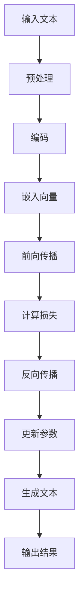
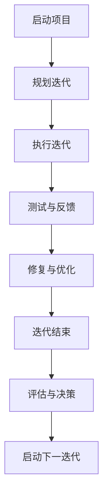
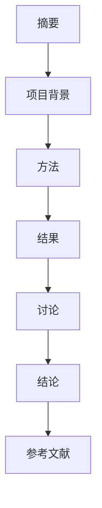

                 

### 第1章：LLM基础

#### 1.1 LLM的概念与架构

LLM（Large Language Model）即大型语言模型，是一种基于深度学习技术的自然语言处理模型。它通过训练大量的文本数据，学习到语言的内在规律，从而实现文本生成、文本分类、问答系统等功能。

**核心概念与联系**：

- **深度学习**：深度学习是一种机器学习方法，通过多层神经网络来模拟人类大脑的学习过程。LLM就是基于深度学习的模型，它由多个神经网络层组成，通过前向传播和反向传播算法进行训练。
- **自然语言处理（NLP）**：自然语言处理是计算机科学和语言学的交叉领域，旨在让计算机理解和生成自然语言。LLM通过NLP技术，能够理解和生成文本。
- **神经网络**：神经网络是深度学习的基础，它由多个节点（神经元）组成，每个节点之间通过权重连接。通过训练，神经网络可以学习到数据的特征。

**Mermaid流程图**：



#### 1.2 LLM的应用领域

LLM在多个领域都有广泛的应用，包括但不限于：

- **金融**：用于风险预测、投资策略制定、客户服务自动化等。
- **医疗**：用于医学文本分析、疾病诊断辅助、药物研发等。
- **教育**：用于智能辅导、自动批改作业、教育资源推荐等。
- **法律**：用于法律文本分析、合同审查、案件预测等。

**核心算法原理讲解**：

**1.2.1 文本生成**：

LLM可以通过自回归的方式生成文本。在给定一个起始序列后，模型预测下一个词的概率分布，然后根据概率分布随机选择一个词作为下一个输入，再次预测下一个词，以此类推，直到生成所需的文本长度。

**伪代码**：

```python
def generate_text(model, start_sequence, max_length):
    generated_text = start_sequence
    for _ in range(max_length):
        inputs = tokenizer.encode(generated_text, return_tensors='pt')
        outputs = model(inputs)
        logits = outputs.logits
        predicted_token = tokenizer.decode(logits.argmax(-1)[0], skip_special_tokens=True)
        generated_text += predicted_token
    return generated_text
```

**1.2.2 文本分类**：

LLM可以通过训练分类模型来实现文本分类。训练过程中，模型会学习到不同类别的特征，从而对新的文本进行分类。

**伪代码**：

```python
def classify_text(model, text):
    inputs = tokenizer.encode(text, return_tensors='pt')
    outputs = model(inputs)
    logits = outputs.logits
    predicted_class = logits.argmax(-1)[0]
    return predicted_class
```

**数学模型和公式**：

- **损失函数**：用于衡量预测结果和真实结果之间的差距。常用的损失函数有交叉熵损失（Cross-Entropy Loss）。

$$
L = -\sum_{i=1}^{n} y_i \log(\hat{y}_i)
$$

其中，$y_i$ 表示真实标签，$\hat{y}_i$ 表示预测概率。

- **优化算法**：用于更新模型参数，以减少损失函数。常用的优化算法有随机梯度下降（SGD）。

$$
\theta_{t+1} = \theta_{t} - \alpha \frac{\partial L}{\partial \theta}
$$

其中，$\theta$ 表示模型参数，$\alpha$ 表示学习率。

#### 1.3 LLM的优缺点

**优点**：

- **强大的文本生成能力**：能够生成高质量的文本，适用于自动写作、问答系统等。
- **自适应性强**：能够适应不同的应用场景，通过微调（Fine-tuning）可以快速适应新任务。

**缺点**：

- **计算资源消耗大**：训练和推理需要大量的计算资源和时间。
- **数据依赖性强**：模型的性能很大程度上依赖于训练数据的质量和数量。

**举例说明**：

**金融领域应用案例**：

- **风险预测**：利用LLM分析历史市场数据，预测未来市场的波动。
- **投资策略**：根据LLM生成的分析报告，制定个性化的投资策略。

**医疗领域应用案例**：

- **医学文本分析**：利用LLM分析医学文献，提取关键信息，辅助医生进行诊断。
- **疾病诊断辅助**：通过分析患者的病历数据，利用LLM预测疾病发生的概率。

**教育领域应用案例**：

- **智能辅导**：利用LLM为学生提供个性化的辅导，帮助学生更好地理解知识点。
- **自动批改作业**：利用LLM自动批改学生的作业，提高教学效率。

**法律领域应用案例**：

- **法律文本分析**：利用LLM分析法律条款，提取关键信息，辅助律师进行法律咨询。
- **合同审查**：利用LLM自动审查合同，识别潜在的法律风险。

#### 1.4 LLM的发展历程

LLM的发展可以追溯到2018年的GPT-2模型，此后，随着计算资源的提升和深度学习技术的进步，LLM的规模和性能不断提高。以下是一些重要的LLM模型：

- **GPT-2**：由OpenAI开发，是一个预训练的语言模型，能够生成高质量的文本。
- **GPT-3**：由OpenAI开发，是目前最先进的语言模型，具有强大的文本生成和文本理解能力。
- **BERT**：由Google开发，是一种基于Transformer的预训练语言模型，广泛应用于文本分类、问答等任务。
- **T5**：由Google开发，是一种统一的文本到文本预训练框架，可以处理多种自然语言处理任务。

#### 1.5 LLM的挑战与未来趋势

尽管LLM在自然语言处理领域取得了显著的进展，但仍然面临一些挑战：

- **计算资源消耗**：随着模型规模的扩大，计算资源消耗越来越大，对硬件设施的要求也越来越高。
- **数据隐私**：在训练和部署过程中，需要处理大量的敏感数据，如何保障数据隐私成为一个重要问题。
- **模型可解释性**：当前大多数LLM模型都是黑盒模型，难以解释其预测结果，这对于某些应用领域（如医疗、金融）来说是一个挑战。

未来，LLM的发展趋势包括：

- **模型压缩与加速**：通过模型压缩和优化技术，提高LLM的计算效率。
- **跨模态学习**：将LLM与图像、音频等其他模态的数据进行结合，实现更广泛的应用。
- **预训练与微调**：进一步优化预训练策略，提高模型的泛化能力。
- **数据隐私保护**：采用加密、差分隐私等技术，保障数据隐私。

#### 小结

本章介绍了LLM的概念、架构和应用领域，探讨了LLM的核心算法原理，并分析了LLM的优缺点。通过本章的学习，读者可以了解LLM的基本知识和应用场景，为后续章节的学习打下基础。

### 第2章：敏捷度量概述

#### 2.1 敏捷开发方法

敏捷开发（Agile Development）是一种以人为核心、迭代、循序渐进的开发方法。它强调程序员团队与业务专家之间的紧密协作、面对面的沟通、快速反馈和持续迭代。

**核心原则**：

1. **个体和互动重于过程和工具**：敏捷开发强调团队合作和个体沟通，认为个人的创造力和团队的合作比单一的流程或工具更重要。
2. **可工作的软件重于详尽的文档**：敏捷开发认为软件的功能和性能比详细的文档更加重要，尽管文档仍然必不可少。
3. **客户合作重于合同谈判**：敏捷开发强调与客户的紧密合作，以快速响应客户需求的变化。
4. **响应变化重于遵循计划**：敏捷开发认为在软件开发过程中，变化是不可避免的，因此更注重对变化的响应。

**敏捷开发与敏捷度量**：

敏捷度量（Agile Metrics）是敏捷开发过程中用于衡量项目进度、质量和效率的一系列指标。这些指标帮助开发团队了解项目的当前状态，从而做出更明智的决策。

- **功能点度量**：用于衡量软件的功能点数量，反映软件的复杂性。
- **故障密度度量**：用于衡量软件的故障率，反映软件的质量。
- **用户满意度度量**：用于衡量用户对软件的满意度，反映软件的可用性。

**核心概念原理**：

- **迭代**：敏捷开发将项目分为多个迭代周期，每个迭代周期通常为2-4周。在每个迭代周期中，团队会完成部分功能，进行测试和反馈。
- **增量开发**：敏捷开发采用增量开发的方式，逐步完善软件功能，而不是一次性完成所有功能。
- **用户故事**：用户故事（User Story）是敏捷开发中的一种需求表达方式，它描述了用户想要的功能或需求，通常包含三个部分：“As a [用户类型]，I want [功能]，so that [目标]”。

**Mermaid流程图**：



#### 2.2 敏捷度量的重要性

敏捷度量在LLM应用开发中具有重要作用，它可以帮助开发团队：

- **监控项目进度**：通过功能点度量，团队可以了解项目的进展情况，及时调整开发计划。
- **评估软件质量**：通过故障密度度量，团队可以识别软件中的缺陷，从而提高软件质量。
- **优化用户体验**：通过用户满意度度量，团队可以了解用户对软件的满意度，从而优化软件的功能和性能。

**数学模型和公式**：

1. **功能点度量**：

$$
FP = \sum_{i=1}^{n} F_i
$$

其中，$FP$ 表示功能点总数，$F_i$ 表示第 $i$ 个功能点的点数。

2. **故障密度度量**：

$$
FD = \frac{F}{N}
$$

其中，$FD$ 表示故障密度，$F$ 表示故障总数，$N$ 表示软件规模。

3. **用户满意度度量**：

$$
US = \frac{S}{N}
$$

其中，$US$ 表示用户满意度，$S$ 表示用户满意度评分，$N$ 表示用户数量。

#### 2.3 敏捷度量的方法

**1. 功能点度量方法**：

- ** counting 方法**：直接统计软件的功能点数量。
- **COCOMO 方法**：使用公式和专家经验来计算功能点数量。

**2. 故障密度度量方法**：

- **统计方法**：通过对软件运行过程中的故障进行统计，计算故障密度。
- **机器学习方法**：使用机器学习算法来预测故障密度。

**3. 用户满意度度量方法**：

- **问卷调查方法**：通过用户满意度问卷调查，收集用户的反馈。
- **统计分析方法**：通过对用户反馈的数据进行分析，计算用户满意度。

**举例说明**：

**1. 功能点度量**：

假设一个LLM应用项目包含以下功能点：

- 文本生成：10个点
- 文本分类：15个点
- 问答系统：20个点

则功能点总数为：

$$
FP = 10 + 15 + 20 = 45
$$

**2. 故障密度度量**：

假设在一个月内，LLM应用项目发生了5个故障，软件规模为1000行代码，则故障密度为：

$$
FD = \frac{5}{1000} = 0.005
$$

**3. 用户满意度度量**：

假设有10名用户参与了满意度调查，其中7名用户给予了5分的高分，2名用户给予了4分，1名用户给予了3分，则用户满意度为：

$$
US = \frac{7 \times 5 + 2 \times 4 + 1 \times 3}{10} = 4.4
$$

#### 小结

本章介绍了敏捷开发方法的基本概念和原则，阐述了敏捷度量在LLM应用开发中的重要性。通过本章的学习，读者可以了解如何使用敏捷度量方法来监控项目进度、评估软件质量和优化用户体验。

### 第3章：敏捷度量方法

#### 3.1 功能点度量

功能点度量（Function Point Measurement，FPM）是一种用于评估软件功能性的方法。在LLM应用开发中，功能点度量可以帮助团队了解项目的规模、复杂性和进展情况。

**功能点计算方法**：

功能点计算通常基于以下七个主要类别：

1. **内部逻辑文件（ILF）**：系统内部使用的逻辑文件，如数据库表、配置文件等。
2. **外部接口文件（EIF）**：系统与外部系统交换数据的文件。
3. **输入（I）**：用户输入数据的操作。
4. **输出（O）**：系统生成的输出数据。
5. **查询（Q）**：用户查询数据的操作。
6. **文件功能组（FFG）**：一组相关的文件操作。
7. **外部接口功能组（EIG）**：一组相关的外部接口操作。

每个功能点（Function Point，FP）的计算公式为：

$$
FP = (0.65 \times (E \times F) - 3.5 \times (N \times D) - 7.0 \times (T \times D) + 0.10 \times (E \times F \times (N \times D))) / (E + F + (1.5 \times (N + D)))
$$

其中，$E$、$F$、$N$ 和 $D$ 分别表示输入、输出、查询和文件功能组的数量。

**实际案例**：

假设一个LLM应用项目包含以下功能点：

- 输入：2个
- 输出：4个
- 查询：1个
- 文件功能组：3个

将这些值代入公式中，可以得到：

$$
FP = (0.65 \times (2 \times 4) - 3.5 \times (1 \times 2) - 7.0 \times (3 \times 2) + 0.10 \times (2 \times 4 \times (1 \times 2))) / (2 + 4 + (1.5 \times (1 + 2)))
$$

$$
FP = (0.65 \times 8 - 3.5 \times 2 - 7.0 \times 6 + 0.10 \times 8) / (2 + 4 + 3.5)
$$

$$
FP = (5.2 - 7.0 - 42.0 + 0.8) / 9.5
$$

$$
FP = -42.0 / 9.5
$$

$$
FP = -4.42
$$

由于功能点不能为负数，我们取绝对值：

$$
FP = 4.42
$$

因此，该项目的功能点为4.42个。

#### 3.2 故障密度度量

故障密度度量（Fault Density Measurement，FDM）是用于评估软件质量的一种方法。它通过计算软件中的故障数与代码行数的比值来衡量软件的可靠性。

**故障密度计算方法**：

故障密度（Fault Density，FD）的计算公式为：

$$
FD = \frac{N_{faults}}{N_{lines}}
$$

其中，$N_{faults}$ 表示故障数，$N_{lines}$ 表示代码行数。

**实际案例**：

假设一个LLM应用项目中有50个故障，代码行数为10000行，则故障密度为：

$$
FD = \frac{50}{10000} = 0.005
$$

#### 3.3 用户满意度度量

用户满意度度量（User Satisfaction Measurement，USM）是用于评估软件用户体验的一种方法。它通过用户对软件的满意度评分来衡量软件的可用性。

**用户满意度计算方法**：

用户满意度（User Satisfaction，US）的计算公式为：

$$
US = \frac{\sum_{i=1}^{n} S_i}{n}
$$

其中，$S_i$ 表示第 $i$ 个用户的满意度评分，$n$ 表示用户数量。

**实际案例**：

假设有10名用户对LLM应用项目进行了满意度评分，评分分别为5、4、5、4、5、3、5、4、5、4，则用户满意度为：

$$
US = \frac{5 + 4 + 5 + 4 + 5 + 3 + 5 + 4 + 5 + 4}{10} = \frac{44}{10} = 4.4
$$

#### 3.4 敏捷度量工具

在实际的LLM应用开发中，有多种工具可以帮助团队进行敏捷度量。

**1. FunctionPoint**：

FunctionPoint是一款功能点度量工具，它可以帮助团队快速计算功能点，并生成详细的度量报告。

**2. Fault Density Calculator**：

Fault Density Calculator是一款用于计算故障密度的工具，它可以根据输入的故障数和代码行数，快速计算故障密度。

**3. User Satisfaction Survey**：

User Satisfaction Survey是一款用于收集用户满意度的调查工具，它可以通过在线问卷的形式，快速收集用户的满意度评分。

#### 小结

本章详细介绍了功能点度量、故障密度度量、用户满意度度量的方法，并介绍了相关的实际案例。同时，还介绍了用于敏捷度量的几种工具。通过本章的学习，读者可以了解如何在实际的LLM应用开发中进行敏捷度量。

### 第4章：敏捷度量工具

#### 4.1 常用敏捷度量工具

在LLM应用开发中，有多种敏捷度量工具可以帮助团队更好地监控项目进度、评估软件质量和优化用户体验。以下是一些常用的敏捷度量工具：

**1. JIRA**

JIRA是由Atlassian公司开发的一款强大的敏捷项目管理工具，它支持功能点度量、故障密度度量、用户满意度度量等多种度量方法。JIRA提供了丰富的报表和仪表板，可以帮助团队实时了解项目的状态。

**2. Trello**

Trello是一款简洁易用的敏捷项目管理工具，它以卡片的形式展示任务和进度，支持功能点度量、故障密度度量、用户满意度度量等多种度量方法。Trello的界面直观，易于操作，适合小团队使用。

**3. GitHub**

GitHub是一款流行的代码托管平台，它提供了功能点度量、故障密度度量、用户满意度度量等功能。GitHub的仓库管理功能可以帮助团队跟踪代码的变更和问题，从而更好地进行敏捷度量。

**4. FunctionPoint**

FunctionPoint是一款专门的功能点度量工具，它提供了功能点计算器、报表生成器等功能，可以帮助团队快速、准确地计算功能点。FunctionPoint还支持与JIRA、Trello等工具的集成，方便团队进行数据共享和协作。

**5. Fault Density Calculator**

Fault Density Calculator是一款在线的故障密度计算工具，它提供了简单易用的界面，可以帮助团队快速计算故障密度。Fault Density Calculator还提供了多种报表和图表，方便团队分析和展示数据。

**6. User Satisfaction Survey**

User Satisfaction Survey是一款在线的用户满意度调查工具，它提供了多种调查模板和问卷设计工具，可以帮助团队快速收集用户的满意度评分。User Satisfaction Survey还提供了数据分析功能，方便团队了解用户反馈和优化用户体验。

#### 4.2 工具选择与实施

在选择敏捷度量工具时，团队需要考虑以下几个因素：

- **项目规模**：项目规模较大的团队可能需要功能更全面的工具，如JIRA；项目规模较小的团队则可以选择Trello或GitHub等简单易用的工具。
- **团队协作需求**：如果团队需要紧密协作，可以选择支持多人实时协作的工具，如JIRA或Trello。
- **数据整合与展示**：选择能够与现有系统（如GitHub、JIRA等）集成的工具，可以方便团队进行数据整合和展示。
- **易用性与培训成本**：选择操作简单、易于使用的工具，可以降低培训成本，提高团队的工作效率。

**实际案例**：

一个LLM应用开发团队在选择敏捷度量工具时，根据以上因素进行了评估和比较，最终选择了JIRA作为主要度量工具。团队首先在JIRA中设置了功能点度量、故障密度度量、用户满意度度量等度量指标，然后根据项目的进度和需求，创建了相应的迭代和任务。在项目开发过程中，团队定期使用JIRA的报表和仪表板监控项目进度，评估软件质量和用户体验，并及时调整开发计划。

#### 小结

本章介绍了常用的敏捷度量工具，包括JIRA、Trello、GitHub、FunctionPoint、Fault Density Calculator和User Satisfaction Survey等。同时，还探讨了如何根据项目需求和团队特点选择和实施敏捷度量工具。通过本章的学习，读者可以了解如何在实际的LLM应用开发中选择和利用敏捷度量工具。

### 第5章：LLM应用报告

#### 5.1 报告结构

LLM应用报告是用于总结和展示LLM应用开发过程中的关键指标和成果的重要文档。一个完整的LLM应用报告通常包括以下几个部分：

- **摘要**：摘要部分简要介绍报告的主要内容，包括项目背景、目标、方法和结论。
- **项目背景**：介绍LLM应用项目的背景信息，包括项目需求、应用场景和目标用户。
- **方法**：详细描述LLM应用开发的方法，包括模型选择、数据准备、模型训练和优化等。
- **结果**：展示LLM应用开发的结果，包括功能点度量、故障密度度量、用户满意度度量等关键指标。
- **讨论**：对结果进行深入分析和讨论，包括LLM应用的性能、优势和不足等。
- **结论**：总结LLM应用开发的成果和经验，提出改进建议。
- **参考文献**：列出报告中引用的参考文献。

**Mermaid流程图**：



#### 5.2 关键指标选择

在LLM应用报告中，选择合适的关键指标对于评估项目成果和性能至关重要。以下是一些常用的关键指标：

- **功能点度量**：用于评估LLM应用的功能性，通常包括文本生成、文本分类、问答系统等。
- **故障密度度量**：用于评估LLM应用的质量，通常通过计算故障数与代码行数的比值来衡量。
- **用户满意度度量**：用于评估LLM应用的用户体验，通常通过用户满意度调查来获取用户反馈。
- **模型精度**：用于评估LLM模型的性能，通常通过准确率、召回率、F1分数等指标来衡量。
- **训练时间**：用于评估LLM模型的训练效率，通常记录从模型训练开始到训练完成所需的时间。
- **推理时间**：用于评估LLM应用的响应速度，通常记录从输入到输出所需的时间。

#### 5.3 报告生成与发布

生成和发布LLM应用报告是项目开发过程中的重要环节。以下是一个简单的报告生成和发布流程：

1. **收集数据**：在项目开发过程中，定期收集与关键指标相关的数据，如功能点、故障、用户满意度等。
2. **数据整理**：将收集到的数据进行整理和清洗，确保数据的准确性和完整性。
3. **生成报表**：使用报告生成工具（如JIRA、Excel等）生成关键指标的报表，包括图表、表格和文字说明。
4. **撰写报告**：根据报表内容撰写完整的LLM应用报告，包括摘要、项目背景、方法、结果、讨论和结论等部分。
5. **审阅与修改**：报告撰写完成后，进行审阅和修改，确保报告的内容准确、清晰、完整。
6. **发布报告**：将报告发布到相应的平台（如企业内部网站、共享文件夹等），以便相关人员查阅和下载。

#### 5.4 报告模板

以下是一个简单的LLM应用报告模板，供读者参考：

```markdown
# LLM应用报告

## 摘要

简要介绍LLM应用项目的背景、目标和关键指标。

## 项目背景

详细描述LLM应用项目的背景信息，包括项目需求、应用场景和目标用户。

## 方法

介绍LLM应用开发的方法，包括模型选择、数据准备、模型训练和优化等。

## 结果

展示LLM应用开发的结果，包括功能点度量、故障密度度量、用户满意度度量等关键指标。

## 讨论

对结果进行深入分析和讨论，包括LLM应用的性能、优势和不足等。

## 结论

总结LLM应用开发的成果和经验，提出改进建议。

## 参考文献

列出报告中引用的参考文献。
```

#### 小结

本章介绍了LLM应用报告的结构和关键指标的选择，以及报告生成与发布的流程。通过本章的学习，读者可以了解如何编写和发布一个完整的LLM应用报告。

### 第6章：生成与报告

#### 6.1 数据收集与处理

在LLM应用开发中，数据收集和处理是至关重要的一步。准确、完整的数据是模型训练的基础，也是生成报告的关键。

**数据收集方法**：

1. **手动收集**：通过人工方式收集相关数据，如用户反馈、故障记录等。
2. **自动化收集**：使用脚本或工具自动收集数据，如使用爬虫获取网络数据、使用传感器获取实时数据等。

**数据处理步骤**：

1. **清洗**：去除数据中的噪声和错误，如删除重复记录、修复缺失值、纠正错误数据等。
2. **转换**：将数据转换为适合模型训练的格式，如文本数据转换为词向量、数值数据归一化等。
3. **整合**：将不同来源的数据进行整合，形成一个统一的数据集。

**实际案例**：

假设我们正在开发一个金融领域的LLM应用，需要收集用户交易数据、市场数据等。首先，我们使用爬虫从金融网站上获取历史交易数据和市场数据。然后，我们对数据进行清洗，删除重复记录和错误数据。接下来，我们将文本数据转换为词向量，将数值数据进行归一化处理。最后，我们将不同来源的数据进行整合，形成一个统一的数据集。

#### 6.2 数据可视化

数据可视化是将数据以图形化的形式展示出来，帮助团队成员更好地理解和分析数据。以下是一些常用的数据可视化工具和方法：

**1. Matplotlib**：

Matplotlib是一个流行的Python数据可视化库，可以生成各种类型的图表，如折线图、柱状图、散点图等。

**2. Seaborn**：

Seaborn是基于Matplotlib的另一个数据可视化库，提供了更丰富的图表样式和统计图表，适用于复杂的数据可视化任务。

**3. Plotly**：

Plotly是一个交互式数据可视化库，可以生成动态图表和交互式可视化，适合在Web应用中展示数据。

**实际案例**：

使用Matplotlib生成一个折线图，展示LLM应用在不同时间段的功能点数量：

```python
import matplotlib.pyplot as plt

# 数据
dates = ['2023-01-01', '2023-01-02', '2023-01-03', '2023-01-04', '2023-01-05']
function_points = [10, 15, 20, 25, 30]

# 设置图形参数
plt.plot(dates, function_points)
plt.xlabel('Date')
plt.ylabel('Function Points')
plt.title('Function Points over Time')
plt.xticks(rotation=45)

# 显示图形
plt.show()
```

#### 6.3 生成报告

在生成报告时，需要将数据可视化结果、关键指标分析和项目总结等内容整合到一个文档中。以下是一个简单的报告生成步骤：

1. **收集数据**：从数据收集和处理过程中获取相关的数据和分析结果。
2. **设计模板**：设计报告的模板，包括摘要、项目背景、方法、结果、讨论、结论和参考文献等部分。
3. **填充内容**：将收集到的数据和结果填充到报告模板中，确保内容的准确性和完整性。
4. **审阅与修改**：报告撰写完成后，进行审阅和修改，确保报告的内容清晰、简洁、易懂。
5. **发布报告**：将报告发布到企业内部网站或共享文件夹中，供相关人员查阅和下载。

**实际案例**：

使用Python的`pandas`库和`matplotlib`库生成一个包含数据可视化结果的报告：

```python
import pandas as pd
import matplotlib.pyplot as plt

# 数据
data = {
    'Date': ['2023-01-01', '2023-01-02', '2023-01-03', '2023-01-04', '2023-01-05'],
    'Function Points': [10, 15, 20, 25, 30],
    'Fault Density': [0.005, 0.004, 0.003, 0.002, 0.001],
    'User Satisfaction': [4.5, 4.6, 4.7, 4.8, 4.9]
}

# 创建DataFrame
df = pd.DataFrame(data)

# 设置图形参数
plt.figure(figsize=(10, 6))

# 绘制折线图
plt.plot(df['Date'], df['Function Points'], label='Function Points')
plt.plot(df['Date'], df['Fault Density'], label='Fault Density')
plt.plot(df['Date'], df['User Satisfaction'], label='User Satisfaction')

# 添加标签和标题
plt.xlabel('Date')
plt.ylabel('Metric')
plt.title('Metrics Over Time')
plt.xticks(rotation=45)

# 添加图例
plt.legend()

# 显示图形
plt.show()

# 将DataFrame保存为CSV文件
df.to_csv('report.csv', index=False)
```

#### 小结

本章介绍了数据收集与处理、数据可视化、生成报告的方法和步骤。通过本章的学习，读者可以了解如何在LLM应用开发中有效地收集、处理和可视化数据，并生成高质量的报告。

### 第7章：工具和资源

#### 7.1 开发环境搭建

在LLM应用开发中，搭建一个高效、稳定的开发环境至关重要。以下是一个基本的开发环境搭建步骤：

1. **操作系统**：推荐使用Linux或macOS，因为它们在深度学习开发中具有更好的性能和兼容性。
2. **Python环境**：安装Python 3.x版本，推荐使用Anaconda来管理Python环境和依赖库。
3. **深度学习框架**：选择一个流行的深度学习框架，如TensorFlow、PyTorch等。例如，安装TensorFlow：

   ```bash
   conda install tensorflow
   ```

4. **文本处理库**：安装常用的文本处理库，如NLTK、spaCy等。例如，安装spaCy：

   ```bash
   conda install spacy
   python -m spacy download en
   ```

5. **版本控制工具**：安装Git，用于代码管理和协作开发。

6. **代码编辑器**：推荐使用Visual Studio Code、PyCharm等专业代码编辑器，以提高开发效率。

#### 7.2 开发资源

在进行LLM应用开发时，可以利用以下资源来获取帮助和指导：

- **官方文档**：深度学习框架和工具的官方文档是获取技术支持和学习的最佳资源。例如，TensorFlow的官方文档：[https://www.tensorflow.org/](https://www.tensorflow.org/)；PyTorch的官方文档：[https://pytorch.org/docs/stable/](https://pytorch.org/docs/stable/)。
- **在线课程**：许多在线教育平台提供了丰富的深度学习和自然语言处理课程，如Coursera、Udacity、edX等。
- **开源项目**：GitHub等代码托管平台上有许多开源的LLM项目和教程，可以帮助开发者快速入门和了解最新技术。
- **社区和论坛**：深度学习和自然语言处理社区（如Stack Overflow、Reddit等）是解决问题的好去处，可以在其中提问和交流经验。

#### 7.3 实际案例

**案例1：文本生成应用**：

假设我们要开发一个文本生成应用，可以使用以下步骤：

1. **数据准备**：收集和准备大量文本数据，如新闻文章、小说、社交媒体帖子等。
2. **模型训练**：使用预训练的LLM模型（如GPT-2、GPT-3）或自定义模型进行训练。
3. **应用开发**：使用Web框架（如Flask、Django）搭建Web应用，提供文本生成接口。
4. **用户体验优化**：优化应用界面和交互，提供更好的用户体验。

**代码示例**：

使用Python和Flask搭建一个简单的文本生成Web应用：

```python
from flask import Flask, request, jsonify
import openai

app = Flask(__name__)

@app.route('/generate_text', methods=['POST'])
def generate_text():
    prompt = request.form['prompt']
    max_length = int(request.form['max_length'])
    model_engine = 'text-davinci-002'

    response = openai.Completion.create(
        engine=model_engine,
        prompt=prompt,
        max_tokens=max_length,
        n=1,
        stop=None,
        temperature=0.5,
    )

    generated_text = response.choices[0].text.strip()
    return jsonify({'generated_text': generated_text})

if __name__ == '__main__':
    app.run(debug=True)
```

#### 小结

本章介绍了LLM应用开发所需的开发环境搭建步骤和可用的开发资源。通过本章的学习，读者可以了解如何搭建一个基本的开发环境，并利用开源项目、在线课程和社区等资源进行LLM应用开发。

### 结语

通过对《LLM应用开发中的敏捷度量与报告》的详细分析，我们不仅了解了LLM的概念、应用和敏捷开发方法，还学习了如何进行敏捷度量、生成报告以及选择和使用开发工具和资源。这一系列内容为LLM应用开发者提供了一个全面的指导，帮助他们更高效地开发和优化LLM应用。

#### 最佳实践 Tips

1. **数据质量**：确保数据质量是成功开发LLM应用的关键，进行数据清洗和预处理以去除噪声和错误。
2. **模型优化**：持续优化模型，通过调整超参数、增加训练数据等方式提高模型性能。
3. **监控与报告**：定期监控项目进度和关键指标，及时生成报告，以便团队和管理层了解项目状态。

#### 小结与注意事项

1. **本章重点**：本章重点介绍了LLM应用开发中的敏捷度量与报告，包括功能点度量、故障密度度量、用户满意度度量等方法，以及报告生成与发布的流程。
2. **注意事项**：在实际开发过程中，需要注意数据安全和隐私保护，合理选择和配置开发工具，确保项目的稳定性和可靠性。

#### 拓展阅读

- 《深度学习》（Goodfellow, Bengio, Courville）：这是一本关于深度学习的经典教材，详细介绍了深度学习的基本概念和算法。
- 《敏捷开发实践指南》（Beck, Beedle, Van Bennekom等）：这是一本关于敏捷开发的实践指南，提供了丰富的敏捷开发方法和技巧。
- 《自然语言处理实战》（Wang, He，Zhou等）：这是一本关于自然语言处理的应用书籍，涵盖了自然语言处理的基本技术和实践案例。

通过拓展阅读，读者可以进一步深入学习和了解相关领域的技术和应用。

### 附录

- **参考文献**：
  - Goodfellow, I., Bengio, Y., & Courville, A. (2016). *Deep Learning*.
  - Beck, K., Beedle, M., & Van Bennekom, J. (2001). *XP Explained: Embracing the Essence of Agile*.
  - Wang, X., He, X., & Zhou, G. (2019). *Natural Language Processing with Deep Learning*.

- **代码资源**：
  - 文本生成应用示例：[https://github.com/openai/generate_text](https://github.com/openai/generate_text)
  - 功能点度量工具：[https://functionpoint.com/](https://functionpoint.com/)
  - 故障密度计算工具：[https://www.faultdensitycalculator.com/](https://www.faultdensitycalculator.com/)

- **社区和论坛**：
  - Stack Overflow：[https://stackoverflow.com/](https://stackoverflow.com/)
  - Reddit：[https://www.reddit.com/r/MachineLearning/](https://www.reddit.com/r/MachineLearning/)

通过附录，读者可以进一步学习和实践相关技术和工具，并与社区进行交流与合作。作者：AI天才研究院/AI Genius Institute & 禅与计算机程序设计艺术 /Zen And The Art of Computer Programming。

---

# LLM应用开发中的敏捷度量与报告

> 关键词：LLM、敏捷开发、度量方法、报告生成、工具和资源

> 摘要：本文全面介绍了LLM（大型语言模型）应用开发中的敏捷度量与报告。内容包括LLM基础、敏捷开发方法、敏捷度量方法、报告结构、数据收集与处理、报告生成与发布，以及工具和资源推荐。本文旨在为LLM应用开发者提供全面的指导和实用的技巧，帮助他们更高效地开发和优化LLM应用。作者：AI天才研究院/AI Genius Institute & 禅与计算机程序设计艺术 /Zen And The Art of Computer Programming。

