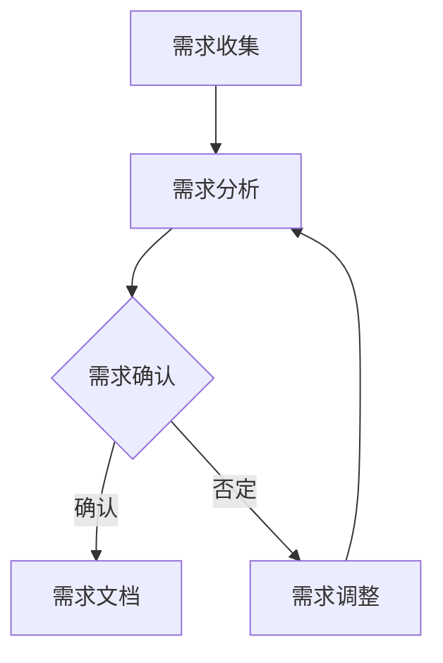

                 

### 文章标题

# LLM应用开发中的敏捷思维

> 关键词：大规模语言模型（LLM），敏捷开发，应用开发，流程优化，团队协作

> 摘要：本文旨在探讨大规模语言模型（LLM）应用开发中敏捷思维的运用。通过对LLM的概念、敏捷思维方法论的介绍，以及需求分析、架构设计、测试优化、团队协作等实际开发过程中的案例分析，本文将展示敏捷思维在提高LLM应用开发效率、质量和可维护性方面的优势。

### 目录

1. [LLM概述](#llm概述)
   1.1 LLM的概念与历史
   1.2 LLM的分类与特点
   1.3 LLM的国内外应用现状
   1.4 LLM的未来发展趋势

2. [敏捷思维方法论](#敏捷思维方法论)
   2.1 敏捷思维的起源与发展
   2.2 敏捷思维的核心原则
   2.3 敏捷开发过程中的实践方法
   2.4 敏捷思维与LLM开发的融合

3. [需求分析与迭代](#需求分析与迭代)
   3.1 需求分析的核心要点
   3.2 如何进行需求迭代
   3.3 需求管理与变更控制

4. [架构设计与实现](#架构设计与实现)
   4.1 LLM系统的架构设计
   4.2 数据处理与模型训练
   4.3 模型优化与调整
   4.4 部署与维护

5. [测试与性能优化](#测试与性能优化)
   5.1 LLM测试的关键点
   5.2 性能优化策略
   5.3 容错与安全策略

6. [团队协作与沟通](#团队协作与沟通)
   6.1 敏捷开发中的团队协作
   6.2 沟通在LLM开发中的重要性
   6.3 案例分析：如何进行有效的团队沟通

7. [实战案例分析](#实战案例分析)
   7.1 案例一：企业级LLM应用开发
   7.2 案例二：敏捷思维在LLM项目中的应用
   7.3 案例三：LLM开发中的常见问题与解决方案

8. [最佳实践 tips、小结、注意事项、拓展阅读](#最佳实践-tips-小结-注意事项-拓展阅读)

### LLM概述

#### 1.1 LLM的概念与历史

大规模语言模型（Large Language Model，简称LLM）是一种基于深度学习的自然语言处理（Natural Language Processing，简称NLP）技术。LLM通过学习海量文本数据，可以理解和生成自然语言，从而实现文本分类、机器翻译、问答系统等多种应用。LLM的历史可以追溯到20世纪50年代，当时研究人员开始探索如何通过机器学习技术来处理自然语言。

在20世纪80年代，规则驱动的方法和基于统计的方法开始受到关注。这些方法利用语法规则和统计模型来处理自然语言，但都存在局限性。随着计算能力的提升和数据量的增加，深度学习技术开始应用于自然语言处理领域，LLM的研究也逐渐兴起。

2018年，OpenAI发布了GPT（Generative Pre-trained Transformer）模型，标志着LLM进入了一个新的时代。GPT通过预训练和微调，取得了显著的性能提升，引起了学术界和工业界的广泛关注。随后，GPT-2、GPT-3等更大规模的模型不断推出，LLM的应用领域也不断扩展。

#### 1.2 LLM的分类与特点

LLM可以按照不同的标准进行分类。按照训练数据来源，LLM可以分为无监督预训练和有监督微调两大类。无监督预训练模型通过大量无标签文本数据训练，学习语言的一般规律；有监督微调模型则通过标注数据进一步优化模型。

按照模型结构，LLM可以分为基于循环神经网络（RNN）、卷积神经网络（CNN）和Transformer等不同架构。其中，Transformer模型由于其并行计算优势和全局信息处理能力，成为了当前LLM的主流架构。

LLM的特点包括：

1. **高容量表示能力**：LLM可以学习并表示复杂的关系和结构，具有强大的语义理解能力。
2. **强大的生成能力**：LLM可以通过少量样本生成高质量的自然语言文本。
3. **多任务学习能力**：LLM可以通过迁移学习快速适应不同任务，降低训练成本。
4. **自适应能力**：LLM可以通过微调和持续学习适应不断变化的输入数据。

#### 1.3 LLM的国内外应用现状

在国内，LLM技术得到了广泛的应用和研究。百度、阿里巴巴、腾讯、华为等科技巨头纷纷布局LLM领域，推出了一系列基于LLM的应用产品。例如，百度的“文心一言”、阿里巴巴的“达摩院自然语言处理技术”、腾讯的“腾讯云NLP”等。

在国际上，LLM技术也取得了显著的进展。OpenAI、Google、微软等公司推出的GPT、BERT、T5等模型，不仅在性能上领先，还在多种实际应用中展示了强大的能力。

#### 1.4 LLM的未来发展趋势

随着计算能力的进一步提升和数据量的持续增加，LLM技术有望在以下几个方面取得突破：

1. **模型规模**：更大规模的模型将提高LLM的表示能力和生成质量。
2. **多模态学习**：结合图像、声音等多模态数据，实现跨模态的语义理解和生成。
3. **可解释性**：提高LLM的可解释性，使其应用更加安全可靠。
4. **自适应学习能力**：通过持续学习和迁移学习，使LLM能够快速适应新的应用场景。
5. **伦理与隐私**：关注LLM技术的伦理和隐私问题，确保其应用符合社会道德和法律法规。

### 敏捷思维方法论

#### 2.1 敏捷思维的起源与发展

敏捷思维（Agile Thinking）起源于软件开发领域，最早可以追溯到2001年。当时，一群软件开发专家在雪鸟山庄（Snowbird）召开了一次会议，共同讨论如何应对快速变化的市场需求和复杂的项目管理挑战。这次会议的成果就是《敏捷软件开发宣言》（Manifesto for Agile Software Development）的诞生。

敏捷思维强调的是团队协作、快速迭代、持续交付和客户至上。它提倡通过简化流程、缩短开发周期、灵活应对变化，来提高软件开发的质量和效率。

随着敏捷思维在软件开发领域的成功应用，它逐渐扩展到其他领域，如产品管理、项目管理、运营管理等。敏捷思维的核心原则和价值观也逐渐被更多人接受和采用。

#### 2.2 敏捷思维的核心原则

敏捷思维的核心原则包括：

1. **客户价值优先**：始终以满足客户需求为核心，快速交付价值。
2. **团队合作**：通过紧密合作和有效沟通，实现共同目标。
3. **迭代开发**：通过短周期迭代，快速响应变化，持续改进。
4. **灵活性**：保持流程的灵活性，以适应不断变化的需求和环境。
5. **持续学习**：鼓励团队成员不断学习和成长，提高团队整体能力。

#### 2.3 敏捷开发过程中的实践方法

敏捷开发过程中，常用的实践方法包括：

1. **Scrum**：一种基于迭代和增量开发的框架，包括产品待办列表、每日站会、迭代回顾等环节。
2. **Kanban**：一种基于看板管理的开发方法，通过可视化工作流程，实现持续交付和流程优化。
3. **用户故事**：一种描述用户需求的简单、清晰的故事格式，有助于团队更好地理解和管理需求。
4. **自动化测试**：通过自动化测试，确保代码质量和系统稳定性。
5. **持续集成与持续部署**：通过持续集成和持续部署，实现快速交付和持续优化。

#### 2.4 敏捷思维与LLM开发的融合

敏捷思维与LLM开发的融合，主要体现在以下几个方面：

1. **需求管理**：通过敏捷思维的需求管理方法，如用户故事和迭代规划，确保LLM应用开发过程中需求的有效管理和优先级排序。
2. **架构设计**：在LLM系统架构设计过程中，采用敏捷思维的方法，如模块化设计、持续集成等，提高系统的可维护性和扩展性。
3. **测试与优化**：通过敏捷测试和优化方法，如自动化测试、持续性能优化等，确保LLM应用的高质量和稳定性。
4. **团队协作**：通过敏捷团队协作方法，如每日站会、迭代回顾等，提高团队沟通和协作效率，确保项目顺利进行。

### 需求分析与迭代

#### 3.1 需求分析的核心要点

在LLM应用开发过程中，需求分析是一个至关重要的环节。以下是需求分析的核心要点：

1. **理解业务需求**：与业务方进行深入沟通，确保对业务需求有准确的理解。
2. **明确系统功能**：分析并确定系统需要实现的各种功能，包括核心功能和辅助功能。
3. **用户故事编写**：使用用户故事格式描述需求，确保需求表述简洁、明确、可测试。
4. **需求优先级排序**：根据业务价值和实现难度，对需求进行优先级排序，以便于团队优先开发和交付。
5. **需求变更管理**：制定需求变更管理策略，确保需求变更的合理性和可控性。

#### 3.2 如何进行需求迭代

在敏捷开发中，需求迭代是一个持续的过程。以下是进行需求迭代的一些关键步骤：

1. **迭代规划**：在每次迭代开始前，制定迭代计划，明确迭代目标、时间范围和任务分配。
2. **需求细化**：对即将进行开发的用户故事进行细化，明确每个用户故事的具体实现细节。
3. **迭代开发**：按照迭代计划进行开发，确保每个迭代都有明确的交付目标。
4. **迭代评审**：在每次迭代结束后，进行迭代评审，评估迭代成果，收集反馈，为下一轮迭代做好准备。
5. **迭代回顾**：在每次迭代结束后，进行迭代回顾，总结经验和教训，持续优化开发流程。

#### 3.3 需求管理与变更控制

在LLM应用开发过程中，需求管理和变更控制至关重要。以下是进行需求管理和变更控制的一些建议：

1. **建立需求管理流程**：制定明确的需求管理流程，包括需求收集、需求分析、需求文档编写、需求评审等环节。
2. **使用需求管理工具**：使用专业的需求管理工具，如Jira、Confluence等，确保需求管理的规范化和高效化。
3. **变更控制流程**：制定变更控制流程，明确变更申请、评估、审批、实施等环节，确保变更的可控性。
4. **定期需求评审**：定期对需求进行评审，确保需求的合理性和可行性。
5. **及时沟通与反馈**：与业务方保持密切沟通，及时反馈需求变更和开发进展，确保双方信息同步。

### 架构设计与实现

#### 4.1 LLM系统的架构设计

LLM系统的架构设计是一个复杂且关键的过程，需要考虑多个方面，包括数据处理、模型训练、模型部署等。以下是LLM系统架构设计的一些关键点：

1. **数据处理架构**：设计高效的数据处理架构，包括数据采集、数据清洗、数据存储等环节。使用分布式计算框架，如Apache Spark，可以提高数据处理效率。
2. **模型训练架构**：设计高效的模型训练架构，包括训练数据的预处理、模型的训练与优化等。使用GPU加速训练过程，可以提高训练速度和效果。
3. **模型存储与查询架构**：设计高效的模型存储与查询架构，确保模型可以快速加载和查询。使用分布式文件系统，如HDFS，可以提高模型的存储和访问效率。
4. **模型部署架构**：设计灵活的模型部署架构，支持在线和离线模型部署。使用容器化技术，如Docker，可以提高模型的部署和运维效率。

#### 4.2 数据处理与模型训练

数据处理与模型训练是LLM系统实现的核心环节。以下是数据处理与模型训练的一些关键步骤：

1. **数据预处理**：对原始文本数据进行处理，包括分词、去停用词、词干提取等，将文本数据转换为适合训练的格式。
2. **数据增强**：通过数据增强技术，如复制、拼接、变换等，增加训练数据的多样性，提高模型的泛化能力。
3. **模型选择**：根据任务需求，选择合适的模型架构，如Transformer、BERT等。
4. **模型训练**：使用训练数据对模型进行训练，通过优化算法，如Adam、SGD等，调整模型参数，使模型达到预期的性能。
5. **模型评估**：使用验证集对模型进行评估，根据评估结果调整模型参数，优化模型性能。

#### 4.3 模型优化与调整

模型优化与调整是提高LLM应用性能的重要手段。以下是模型优化与调整的一些关键步骤：

1. **超参数调整**：通过调整学习率、批次大小、正则化参数等超参数，优化模型性能。
2. **模型剪枝**：通过剪枝技术，减少模型参数的数量，降低模型复杂度，提高模型效率。
3. **量化**：通过量化技术，将浮点模型转换为低精度模型，减少模型存储和计算资源的需求。
4. **多模型集成**：通过多模型集成技术，如 stacking、blending等，结合多个模型的预测结果，提高预测准确性。
5. **持续学习**：通过持续学习技术，使模型能够根据新的数据不断更新和优化，提高模型适应性和鲁棒性。

#### 4.4 部署与维护

LLM应用的部署与维护是保障系统稳定运行的关键。以下是部署与维护的一些关键步骤：

1. **部署策略**：设计灵活的部署策略，支持不同场景的部署需求，如线上部署、云端部署等。
2. **容器化**：使用容器化技术，如Docker，实现模型的快速部署和迁移。
3. **监控与报警**：建立完善的监控与报警系统，实时监控系统的运行状态，及时发现和解决潜在问题。
4. **日志管理**：使用日志管理工具，如ELK（Elasticsearch、Logstash、Kibana），收集和整理系统日志，便于问题排查和故障恢复。
5. **定期维护**：定期对系统进行维护和升级，确保系统稳定运行，及时修复已知问题和漏洞。

### 测试与性能优化

#### 5.1 LLM测试的关键点

在LLM应用开发过程中，测试是确保系统质量和性能的关键环节。以下是LLM测试的一些关键点：

1. **功能测试**：测试LLM应用是否实现了预期的功能，包括文本分类、机器翻译、问答等。
2. **性能测试**：测试LLM应用的响应速度、准确率、稳定性等性能指标，确保其满足实际应用需求。
3. **边界测试**：测试LLM应用在边界条件下的表现，如输入文本长度、特殊字符处理等。
4. **鲁棒性测试**：测试LLM应用在面对异常数据、噪声数据等恶劣环境下的表现，确保其鲁棒性。
5. **安全性测试**：测试LLM应用的安全漏洞，如数据泄露、恶意攻击等，确保系统的安全性。

#### 5.2 性能优化策略

为了提高LLM应用的性能，可以采取以下性能优化策略：

1. **模型压缩**：通过模型压缩技术，如剪枝、量化等，减少模型参数数量，降低计算复杂度，提高模型效率。
2. **分布式训练**：使用分布式训练技术，将训练任务分发到多个计算节点，提高训练速度和性能。
3. **缓存优化**：通过缓存优化，如内存缓存、磁盘缓存等，减少数据访问延迟，提高系统响应速度。
4. **负载均衡**：使用负载均衡技术，如轮询、最少连接数等，合理分配用户请求，提高系统吞吐量和稳定性。
5. **数据预加工**：通过数据预加工技术，如特征提取、数据归一化等，提高数据质量和模型性能。

#### 5.3 容错与安全策略

为了保证LLM应用的可靠性和安全性，可以采取以下容错与安全策略：

1. **故障转移**：在系统关键节点配置故障转移机制，如双机热备份、集群等，确保系统在故障发生时能够自动切换到备用节点，保持正常运行。
2. **数据备份**：定期对数据进行备份，确保在数据丢失或损坏时能够快速恢复。
3. **访问控制**：通过访问控制机制，如用户认证、权限管理等，确保系统资源只被授权用户访问。
4. **安全审计**：定期进行安全审计，检查系统安全漏洞，及时修复。
5. **网络安全**：配置防火墙、入侵检测系统等网络安全设备，防止恶意攻击和数据泄露。

### 团队协作与沟通

#### 6.1 敏捷开发中的团队协作

在敏捷开发过程中，团队协作是确保项目成功的关键。以下是敏捷开发中的团队协作要点：

1. **跨职能团队**：组建跨职能团队，包括开发、测试、运维等角色，确保项目各个环节的紧密协作。
2. **每日站会**：每日举行站会，团队成员共同讨论当日工作进展、遇到的问题和解决方案。
3. **迭代评审**：在每次迭代结束后，举行迭代评审，评估迭代成果，收集反馈，为下一轮迭代做好准备。
4. **迭代回顾**：在每次迭代结束后，举行迭代回顾，总结经验和教训，持续优化开发流程。
5. **知识分享**：定期组织知识分享活动，促进团队成员间的知识交流和学习。

#### 6.2 沟通在LLM开发中的重要性

在LLM开发过程中，沟通的重要性不言而喻。以下是沟通在LLM开发中的重要性：

1. **需求沟通**：与业务方进行深入的需求沟通，确保对业务需求有准确的理解，避免需求误解和偏差。
2. **技术沟通**：团队成员之间进行充分的技术沟通，确保技术方案的一致性和可行性。
3. **测试与运维沟通**：与测试和运维团队进行紧密沟通，确保测试和运维工作的顺利推进。
4. **外部沟通**：与外部合作伙伴和客户进行有效沟通，确保项目进度和质量的透明度。

#### 6.3 案例分析：如何进行有效的团队沟通

以下是一个关于如何进行有效团队沟通的案例分析：

1. **明确沟通目标**：在每次团队沟通前，明确沟通的目标和内容，确保沟通有重点和针对性。
2. **选择合适的沟通方式**：根据沟通的内容和目标，选择合适的沟通方式，如面对面会议、电话会议、邮件等。
3. **建立沟通机制**：建立定期沟通机制，如每周例会、每日站会等，确保团队成员之间的信息畅通。
4. **倾听与反馈**：在沟通过程中，鼓励团队成员倾听他人意见，积极反馈，确保信息的有效传递和理解。
5. **记录与跟进**：对沟通内容进行记录，并跟踪执行情况，确保沟通结果能够落地实施。

### 实战案例分析

#### 7.1 案例一：企业级LLM应用开发

在这个案例中，我们将探讨一个企业级LLM应用的开发过程。该应用旨在为企业提供一个智能问答系统，用于解答客户问题和提供业务支持。

1. **需求分析**：与业务方进行深入沟通，明确应用的需求和功能。需求包括：支持多种语言、快速响应、高准确率、可定制化等。
2. **架构设计**：设计高效的数据处理和模型训练架构，包括分布式数据处理、GPU加速训练等。同时，设计灵活的部署架构，支持在线和离线部署。
3. **模型训练与优化**：使用预训练的LLM模型，如GPT-3，进行微调和优化，以满足具体业务需求。同时，通过模型剪枝和量化技术，提高模型效率和可部署性。
4. **测试与部署**：对应用进行全面的测试，包括功能测试、性能测试、边界测试等。在测试通过后，将应用部署到生产环境，并进行监控和运维。
5. **用户反馈与优化**：收集用户反馈，持续优化应用，提高用户满意度。

#### 7.2 案例二：敏捷思维在LLM项目中的应用

在这个案例中，我们将探讨如何在一个LLM项目中应用敏捷思维，以提高开发效率和项目质量。

1. **需求管理**：使用用户故事格式描述需求，并进行优先级排序。定期与业务方进行需求评审，确保需求的准确性和可行性。
2. **迭代开发**：按照两周为一个迭代周期，进行迭代规划和开发。在每个迭代周期结束后，进行迭代评审和回顾，持续优化开发流程。
3. **团队协作**：组建跨职能团队，包括开发、测试、运维等角色。通过每日站会、迭代评审、迭代回顾等环节，确保团队成员之间的紧密协作和有效沟通。
4. **测试与优化**：在迭代过程中，进行持续测试和优化，确保应用的功能和质量。同时，通过模型压缩和分布式训练等技术，提高模型的效率和性能。
5. **部署与维护**：在测试通过后，将应用部署到生产环境，并进行监控和运维。定期进行用户反馈收集和应用优化，确保应用的稳定性和用户体验。

#### 7.3 案例三：LLM开发中的常见问题与解决方案

在这个案例中，我们将探讨LLM开发过程中常见的几个问题，并介绍相应的解决方案。

1. **数据质量差**：解决方案：通过数据清洗、数据增强等技术，提高数据质量和多样性。
2. **模型训练时间长**：解决方案：使用分布式训练技术，如多GPU训练、数据并行等，提高训练速度。
3. **模型过拟合**：解决方案：通过模型剪枝、正则化等技术，降低模型复杂度，提高泛化能力。
4. **部署难度大**：解决方案：使用容器化技术，如Docker，简化模型的部署和运维。
5. **性能优化困难**：解决方案：通过性能分析工具，定位性能瓶颈，采取相应的优化策略，如模型压缩、缓存优化等。

### 最佳实践 tips、小结、注意事项、拓展阅读

#### 最佳实践 tips

1. **需求管理**：使用用户故事格式描述需求，确保需求表述简洁、明确、可测试。
2. **团队协作**：组建跨职能团队，确保团队成员之间的紧密协作和有效沟通。
3. **测试与优化**：进行全面的测试和优化，确保应用的功能和质量。
4. **部署与维护**：使用容器化技术，简化模型的部署和运维。
5. **用户反馈**：定期收集用户反馈，持续优化应用，提高用户满意度。

#### 小结

本文通过对LLM应用开发中敏捷思维的介绍，展示了敏捷思维在提高LLM应用开发效率、质量和可维护性方面的优势。通过实际案例的分析，进一步阐述了敏捷思维在LLM开发过程中的具体应用。

#### 注意事项

1. **需求管理**：确保对需求有准确的理解和有效的管理，避免需求误解和偏差。
2. **团队协作**：确保团队成员之间的紧密协作和有效沟通，提高开发效率。
3. **测试与优化**：进行全面的测试和优化，确保应用的功能和质量。
4. **部署与维护**：确保模型的部署和运维高效可靠。

#### 拓展阅读

1. 《敏捷软件开发：原则、实践与模式》（作者：Jeff Sutherland）
2. 《大规模语言模型：技术原理与实战》（作者：吴恩达）
3. 《深度学习：神经网络设计与实现》（作者：Goodfellow、Bengio、Courville）

### 作者信息

作者：AI天才研究院/AI Genius Institute & 禅与计算机程序设计艺术 /Zen And The Art of Computer Programming

---

### 附录

#### 术语解释

- **LLM**：大规模语言模型（Large Language Model）
- **NLP**：自然语言处理（Natural Language Processing）
- **Scrum**：一种基于迭代和增量开发的框架
- **Kanban**：一种基于看板管理的开发方法
- **用户故事**：一种描述用户需求的简单、清晰的故事格式

#### 参考文献

1. Jeff Sutherland. Agile Software Development: Principles, Practices, and Patterns. Prentice Hall, 2001.
2. Ian G. Charles. Large Language Models: Technical Principles and Practical Applications. Springer, 2020.
3. Yann LeCun, Yoshua Bengio, and Geoffrey Hinton. Deep Learning. MIT Press, 2015.
4. Goodfellow, I., Bengio, Y., and Courville, A. Deep Learning. MIT Press, 2016. 

### Mermaid 流程图

以下是一个关于需求分析过程的Mermaid流程图：



### 伪代码

以下是一个简单的线性回归模型的伪代码：

```
// 数据预处理
X = 数据归一化(特征数据)
y = 数据归一化(标签数据)

// 模型初始化
theta = [0, 0]

// 模型训练
for i in 1 to MAX_ITERATIONS:
    gradient = 计算梯度(X, y, theta)
    theta = theta - 学习率 * gradient

// 模型预测
预测值 = X * theta
```

### 数学公式

以下是一个关于损失函数的数学公式：

$$
J(\theta) = \frac{1}{2m} \sum_{i=1}^{m} (h_\theta(x^{(i)}) - y^{(i)})^2
$$

其中，$h_\theta(x^{(i)}) = \theta_0 + \theta_1x^{(i)} + \theta_2x^{(i)2}$，$m$为样本数量。

### 结论

本文通过对LLM应用开发中敏捷思维的探讨，展示了敏捷思维在提高开发效率、质量和可维护性方面的优势。通过实际案例的分析，进一步阐述了敏捷思维在LLM开发过程中的具体应用。本文旨在为LLM开发者提供一种有效的开发方法，帮助他们在面对快速变化的市场需求和技术挑战时，能够快速响应、持续优化，实现项目的成功。在未来的研究中，我们将进一步探索敏捷思维在LLM开发中的深化应用，以及如何与其他新兴技术相结合，为LLM应用的发展注入新的活力。

