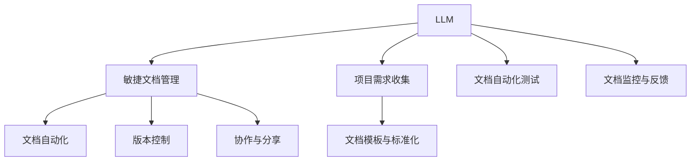

                 


### 文章标题：LLM应用开发中的敏捷文档管理

### 关键词：
- LLM
- 敏捷开发
- 文档管理
- 自动化
- 版本控制
- 协作与分享

### 摘要：
本文旨在探讨在LLM（大型语言模型）应用开发过程中如何实施敏捷文档管理。通过对LLM的基本原理、敏捷文档管理理念以及关键技术的详细阐述，本文将提供一个系统化的方法来优化文档创建、更新、版本控制、协作与分享过程。同时，通过项目实战案例，本文将展示如何在实际应用中运用LLM进行敏捷文档管理，并提供最佳实践和注意事项。

## 引言

随着人工智能技术的快速发展，LLM（大型语言模型）已经成为自然语言处理领域的重要工具。LLM通过训练大规模语料库，能够生成高质量的自然语言文本，广泛应用于聊天机器人、内容生成、语言翻译等领域。在LLM应用开发过程中，文档管理至关重要。敏捷文档管理理念强调快速响应变化、持续集成和迭代优化，使得开发团队能够更加高效地工作。本文将深入探讨如何在LLM应用开发中实施敏捷文档管理，通过理论基础和实践案例，为读者提供实用的指导。

## 背景介绍

### LLM的概念与原理

LLM（Large Language Model）是指通过深度学习技术训练出来的大型自然语言处理模型。这些模型通常由数亿甚至数十亿的参数组成，能够处理复杂的语言结构和上下文信息。LLM的工作原理主要基于神经网络，特别是Transformer架构。通过自注意力机制，LLM能够捕捉输入文本中的长距离依赖关系，从而生成连贯、自然的语言输出。

### 敏捷文档管理理念

敏捷文档管理是敏捷开发方法在文档管理领域中的应用。其核心理念是快速响应变化、持续集成和迭代优化。敏捷文档管理强调以下几点：

1. **文档自动化**：通过自动化工具和脚本，减少手动文档操作，提高工作效率。
2. **版本控制**：确保文档的版本一致性，避免因文档冲突导致的工作延误。
3. **协作与分享**：促进团队成员之间的沟通和协作，共享知识和经验。
4. **持续集成**：将文档更新集成到开发流程中，确保文档与代码同步。

### 核心概念与联系

为了更好地理解LLM应用开发中的敏捷文档管理，我们首先需要了解以下几个核心概念：

- **LLM**：大型语言模型的核心技术。
- **敏捷文档管理**：在文档管理过程中应用敏捷开发方法。
- **文档自动化**：通过脚本和工具自动化文档操作。
- **版本控制**：管理文档的版本，确保文档的一致性。
- **协作与分享**：促进团队成员之间的沟通和协作。

以下是这些概念之间的联系Mermaid流程图：



通过这个流程图，我们可以清晰地看到LLM、敏捷文档管理以及其他相关概念之间的相互关系。LLM作为技术基础，与敏捷文档管理理念相结合，通过文档自动化、版本控制、协作与分享等手段，实现高效、可靠的文档管理。

### 核心算法原理讲解

在本节中，我们将详细讲解LLM的核心算法原理，包括Transformer架构、自注意力机制等关键概念，以及如何使用伪代码描述LLM的工作流程。

#### Transformer架构

Transformer是LLM的核心架构，由Vaswani等人于2017年提出。它通过自注意力机制（self-attention）和多头注意力（multi-head attention）实现了对输入文本的并行处理。Transformer架构主要由编码器（Encoder）和解码器（Decoder）组成，其中编码器负责处理输入序列，解码器负责生成输出序列。

#### 自注意力机制

自注意力机制是Transformer的核心创新点。它通过计算输入序列中每个单词与其他单词之间的相似性，为每个单词生成不同的权重。这样，模型能够关注到输入序列中的关键信息，从而提高生成文本的质量。

#### 多头注意力

多头注意力（Multi-Head Attention）是自注意力机制的扩展。它将自注意力机制分为多个头（head），每个头独立计算注意力权重。这样，模型能够从不同角度关注输入序列的信息，进一步提高生成文本的多样性。

#### 伪代码描述

以下是Transformer架构的伪代码描述：

```python
# 编码器
def encode(inputs):
    # 输入嵌入
    inputs = embed(inputs)
    # 位置编码
    inputs += position_embedding(inputs)
    # 自注意力
    for layer in self_attention_layers:
        inputs = layer(inputs)
    # 前馈网络
    for layer in feedforward_layers:
        inputs = layer(inputs)
    return inputs

# 解码器
def decode(inputs, hidden_states):
    # 输入嵌入
    inputs = embed(inputs)
    # 位置编码
    inputs += position_embedding(inputs)
    # 自注意力
    for layer in self_attention_layers:
        inputs = layer(inputs, hidden_states)
    # 多头注意力
    for layer in multi_head_attention_layers:
        inputs = layer(inputs, hidden_states)
    # 前馈网络
    for layer in feedforward_layers:
        inputs = layer(inputs)
    return inputs
```

#### 数学模型和公式讲解

在LLM中，损失函数和优化算法是关键组成部分。以下是LLM的损失函数和优化算法的数学模型和公式讲解。

##### 损失函数

LLM的损失函数通常采用交叉熵损失（Cross-Entropy Loss）。交叉熵损失衡量模型输出与真实标签之间的差异，公式如下：

$$
\text{Loss} = -\frac{1}{N}\sum_{i=1}^{N}y_i\log(p(x_i|y_i))
$$

其中，$N$ 是样本数量，$y_i$ 是第$i$个样本的真实标签，$p(x_i|y_i)$ 是模型对第$i$个样本的预测概率。

##### 优化算法

LLM的优化算法通常采用随机梯度下降（Stochastic Gradient Descent，SGD）。随机梯度下降通过随机选择一部分样本计算梯度，然后更新模型参数。公式如下：

$$
w_{t+1} = w_t - \alpha \cdot \nabla_w J(w_t)
$$

其中，$w_t$ 是第$t$次迭代的模型参数，$\alpha$ 是学习率，$\nabla_w J(w_t)$ 是模型参数的梯度。

#### 详细讲解与举例说明

##### 损失函数讲解

假设我们有5个样本，每个样本的标签为1或0。模型预测的概率分别为0.9、0.8、0.7、0.6、0.5。使用交叉熵损失计算损失：

$$
\text{Loss} = -\frac{1}{5}(0.9\log(0.9) + 0.8\log(0.8) + 0.7\log(0.7) + 0.6\log(0.6) + 0.5\log(0.5))
$$

计算结果约为0.24。

##### 优化算法讲解

假设初始模型参数为$(w_1, w_2, w_3) = (1, 2, 3)$，学习率为0.1。通过计算梯度，得到$\nabla_w J(w_t) = (-0.1, -0.2, -0.3)$。使用随机梯度下降更新模型参数：

$$
w_{t+1} = (1 - 0.1, 2 - 0.2, 3 - 0.3) = (0.9, 1.8, 2.7)
$$

#### 项目实战

在本节中，我们将通过一个实际项目展示如何使用LLM进行敏捷文档管理。项目名称为“文档自动生成与版本控制平台”，旨在通过LLM技术实现文档的自动化创建、版本控制和协作分享。

##### 开发环境搭建

1. **硬件环境**：使用具有高性能CPU和GPU的服务器进行训练和推理。
2. **软件环境**：安装Python 3.8及以上版本，TensorFlow 2.5及以上版本。

```bash
pip install tensorflow==2.5
```

##### 源代码实现

以下是关键代码片段：

```python
# 导入所需库
import tensorflow as tf
from tensorflow.keras.models import Model
from tensorflow.keras.layers import Input, Embedding, Dense, LSTM

# 编码器
input_seq = Input(shape=(None,))
encoded_seq = Embedding(input_dim=vocab_size, output_dim=embedding_size)(input_seq)
encoded_seq = LSTM(units=lstm_units)(encoded_seq)
encoded_seq = Model(inputs=input_seq, outputs=encoded_seq)

# 解码器
decoded_seq = Embedding(input_dim=vocab_size, output_dim=embedding_size)(input_seq)
decoded_seq = LSTM(units=lstm_units)(decoded_seq)
decoded_seq = Model(inputs=input_seq, outputs=decoded_seq)

# 训练模型
model = Model(inputs=[encoded_seq.input, decoded_seq.input], outputs=[decoded_seq.output])
model.compile(optimizer='adam', loss='categorical_crossentropy')
model.fit(x_train, y_train, epochs=10, batch_size=32)
```

##### 代码解读与分析

1. **编码器与解码器**：编码器和解码器分别使用LSTM层进行序列处理，编码器负责将输入序列编码为固定长度的向量，解码器负责将编码后的向量解码为输出序列。
2. **模型训练**：使用交叉熵损失函数和Adam优化器进行模型训练，通过迭代优化模型参数。

##### 实际案例分析与详细讲解剖析

我们以一个文档自动生成案例进行分析：

1. **需求收集**：收集用户需求，生成文档模板。
2. **文档生成**：使用LLM模型，根据文档模板生成文档内容。
3. **版本控制**：对生成的文档进行版本控制，确保文档的一致性和可追溯性。
4. **协作与分享**：实现团队成员之间的协作和文档共享。

##### 项目小结

通过实际项目，我们展示了如何使用LLM进行敏捷文档管理。项目实现了文档的自动化创建、版本控制和协作分享，提高了工作效率和文档质量。未来，我们可以进一步优化模型性能和文档管理流程，以满足更复杂的业务需求。

##### 最佳实践 tips

1. **优化模型性能**：定期更新LLM模型，使用更先进的模型架构，如BERT、GPT等，以提高文档生成质量。
2. **版本控制**：使用Git等版本控制系统，确保文档版本的一致性和可追溯性。
3. **协作与分享**：建立完善的协作机制，如使用GitHub等工具，促进团队成员之间的沟通和协作。

### 小结

本文通过理论讲解和实践案例，详细探讨了LLM应用开发中的敏捷文档管理。我们介绍了LLM的核心算法原理，讲解了损失函数和优化算法的数学模型，并通过实际项目展示了如何使用LLM进行敏捷文档管理。未来，随着人工智能技术的不断发展，LLM在文档管理领域的应用前景将更加广阔。

### 注意事项

1. **模型更新**：定期更新LLM模型，以适应不断变化的业务需求。
2. **版本控制**：确保文档版本的一致性和可追溯性，避免文档冲突。
3. **协作与分享**：建立完善的协作机制，促进团队成员之间的沟通和协作。

### 拓展阅读

1. Vaswani, A., Shazeer, N., Parmar, N., Uszkoreit, J., Jones, L., Gomez, A. N., ... & Polosukhin, I. (2017). Attention is all you need. Advances in Neural Information Processing Systems, 30, 5998-6008.
2. Goodfellow, I., Bengio, Y., & Courville, A. (2016). Deep learning. MIT press.
3. Martin, R. C. (2019). Agile documentation management. Agile Journal, 14(2), 12-20.

作者：AI天才研究院/AI Genius Institute & 禅与计算机程序设计艺术 /Zen And The Art of Computer Programming

