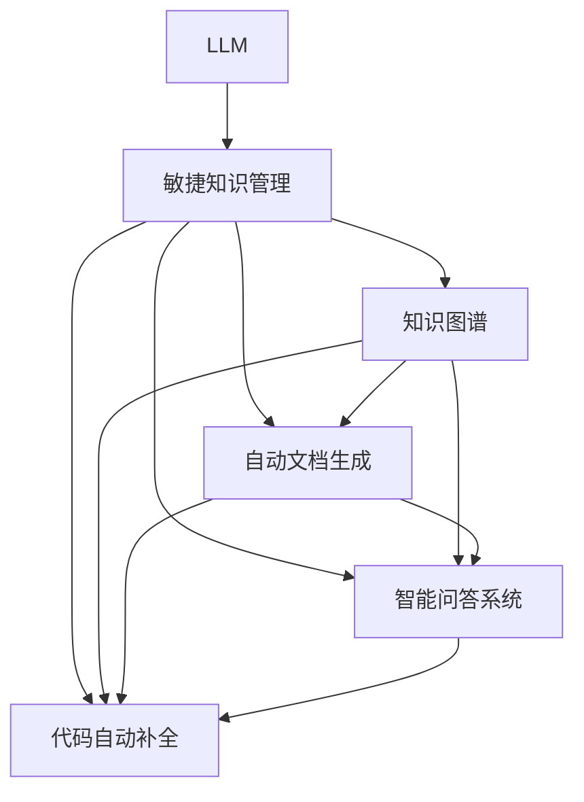

                 

### 文章标题: LLM应用开发中的敏捷知识管理

#### 关键词: LLM, 敏捷知识管理, 应用开发, 软件开发流程, 知识图谱

#### 摘要：
本文将深入探讨大型语言模型（LLM）在应用开发中的敏捷知识管理实践。首先，我们将介绍LLM的基本概念和技术原理，并阐述敏捷知识管理在软件开发中的重要性。接着，通过Mermaid流程图展示核心概念之间的关系，详细讲解LLM与敏捷知识管理在软件开发中的应用。文章还将结合实际案例，分析开发环境搭建、源代码实现、代码解读和实际案例分析，最终提供敏捷知识管理的最佳实践和小结。

---

## 引言与背景

在当今的科技领域中，大型语言模型（LLM）已经成为自然语言处理（NLP）和人工智能（AI）的重要组成部分。LLM如GPT、BERT等模型通过学习海量文本数据，实现了对自然语言的深入理解和生成能力。随着LLM技术的不断发展，其在各个领域的应用也越来越广泛。然而，在LLM的应用开发过程中，如何高效管理知识和提高开发效率成为了一个重要问题。

敏捷知识管理是一种以快速响应变化为核心的方法论，旨在通过有效的知识管理和协作来加速软件开发过程。敏捷知识管理强调知识的共享、迭代和持续改进，与LLM的开发需求不谋而合。本文将围绕LLM应用开发中的敏捷知识管理，探讨其核心概念、技术原理、应用实践以及最佳实践，旨在为开发者提供一套系统化的解决方案。

### LLM的基本概念

#### 1.1.1 什么是LLM

大型语言模型（LLM，Large Language Model）是一种能够理解和生成自然语言的深度神经网络模型。与传统的统计模型和规则模型不同，LLM通过学习大规模的文本数据，能够自动提取语言中的隐含规则和语义信息，实现对自然语言的深入理解和生成。

#### 1.1.2 LLM的发展历程

LLM的发展可以追溯到1990年代初，随着神经网络技术的发展，研究者开始探索基于神经网络的文本处理方法。1990年代中期，基于神经网络的自然语言处理技术逐渐成熟，例如RNN（循环神经网络）和LSTM（长短时记忆网络）。进入2010年代，随着深度学习和计算能力的提升，LLM的发展进入了新的阶段，代表性的模型如GPT、BERT等开始涌现。

#### 1.1.3 LLM的应用领域

LLM在各个领域的应用已经取得了显著的成果。在文本生成方面，LLM被用于自动写作、文章摘要、对话系统等；在语言翻译方面，LLM实现了高质量的双语翻译；在情感分析方面，LLM能够识别文本中的情感倾向和情绪；在知识图谱构建方面，LLM可以帮助提取文本中的实体和关系。

### 敏捷知识管理简介

#### 1.2.1 敏捷知识管理的定义

敏捷知识管理（Agile Knowledge Management，AKM）是一种以快速响应变化为核心的方法论，旨在通过有效的知识管理和协作来加速软件开发过程。敏捷知识管理强调知识的共享、迭代和持续改进，与敏捷开发（Agile Development）的理念高度契合。

#### 1.2.2 敏捷知识管理的核心原则

1. **用户至上**：以用户需求为导向，确保开发过程中的知识满足用户需求。
2. **迭代开发**：通过短周期迭代，持续优化和改进知识管理。
3. **协作共享**：鼓励团队成员之间的知识共享和协作，提高整体开发效率。
4. **适应性**：快速适应环境变化，灵活调整知识管理策略。

#### 1.2.3 敏捷知识管理的重要性

在LLM应用开发中，敏捷知识管理的重要性体现在以下几个方面：

1. **提高开发效率**：敏捷知识管理通过高效的协作和迭代，能够显著提高开发效率。
2. **优化知识共享**：敏捷知识管理强调知识的共享和传播，有助于团队成员之间快速掌握和利用新知识。
3. **促进持续改进**：敏捷知识管理通过持续迭代和改进，能够不断优化开发流程和知识管理策略。
4. **增强团队凝聚力**：敏捷知识管理鼓励团队成员之间的协作和沟通，有助于增强团队凝聚力。

### LLM与敏捷知识管理的联系

#### 1.3.1 LLM在敏捷知识管理中的应用

1. **知识图谱构建**：LLM可以帮助构建知识图谱，将文本数据中的实体和关系进行结构化表示。
2. **自动化文档生成**：LLM可以自动生成文档，提高知识共享的效率。
3. **智能问答系统**：LLM可以构建智能问答系统，为团队成员提供即时的知识查询服务。
4. **代码自动补全**：LLM可以用于代码自动补全，提高开发效率。

#### 1.3.2 敏捷知识管理对LLM开发的影响

1. **需求驱动**：敏捷知识管理强调用户需求，有助于确保LLM开发过程中始终围绕用户需求进行。
2. **快速迭代**：敏捷知识管理支持快速迭代，有助于LLM模型的不断优化和改进。
3. **知识共享**：敏捷知识管理促进团队成员之间的知识共享，有助于提升LLM开发团队的协同效率。

#### 1.3.3 LLM与敏捷知识管理的融合

1. **知识图谱与敏捷开发**：通过知识图谱，敏捷开发过程中涉及的实体和关系得以结构化表示，有助于提高开发效率。
2. **自动文档生成与敏捷开发**：自动生成的文档可以为敏捷开发提供丰富的参考资料，有助于团队成员快速理解和应用知识。
3. **智能问答与敏捷开发**：智能问答系统可以为敏捷开发提供实时的知识支持，帮助团队成员解决开发中的问题。

### 核心概念与联系

为了更直观地展示LLM与敏捷知识管理之间的联系，我们可以使用Mermaid流程图来表示核心概念及其相互之间的关联。

### LLM的技术原理

#### 2.1 LLM的模型结构

LLM通常采用深度神经网络结构，主要包括以下几个部分：

1. **输入层**：接收文本数据，将其转化为模型可处理的特征表示。
2. **隐藏层**：通过多层神经网络对输入特征进行逐层抽象和转换，提取语言中的语义信息。
3. **输出层**：生成语言输出，如文本生成、分类、翻译等。

常见的LLM架构包括：

1. **Transformer架构**：基于自注意力机制，能够捕捉长距离依赖关系。
2. **BERT架构**：通过双向编码器表示文本，实现上下文信息的融合。
3. **GPT架构**：基于自回归语言模型，能够生成流畅的自然语言。

#### 2.2 LLM的训练过程

LLM的训练过程主要包括以下几个步骤：

1. **数据准备与预处理**：收集和清洗大规模文本数据，将其转化为模型可处理的输入格式。
2. **训练模型**：通过梯度下降等优化算法，调整模型参数，使其对输入数据进行正确的预测。
3. **模型评估与优化**：使用验证集对模型进行评估，根据评估结果调整模型参数，优化模型性能。

#### 2.3 LLM的优化与调整

为了提高LLM的性能，可以采用以下优化和调整方法：

1. **模型结构优化**：通过调整网络结构，如增加隐藏层、调整层数等，优化模型性能。
2. **数据增强**：通过数据增强方法，如数据扩充、数据变换等，提高模型对多样化数据的适应性。
3. **超参数调优**：通过调整学习率、批量大小等超参数，优化模型训练过程。
4. **预训练与微调**：先在大量通用数据上进行预训练，再在特定领域数据进行微调，提高模型在特定领域的性能。

### 敏捷知识管理的原则

#### 3.1 敏捷知识管理的核心原则

敏捷知识管理的核心原则包括：

1. **用户至上**：以用户需求为导向，确保知识管理过程始终满足用户需求。
2. **迭代开发**：通过短周期迭代，持续优化和改进知识管理。
3. **协作共享**：鼓励团队成员之间的知识共享和协作，提高整体开发效率。
4. **适应性**：快速适应环境变化，灵活调整知识管理策略。

#### 3.2 敏捷知识管理的方法论

敏捷知识管理的方法论主要包括：

1. **知识地图**：通过知识地图，明确知识之间的关系和流程，提高知识共享和利用效率。
2. **迭代式知识管理**：通过短周期迭代，逐步完善知识体系，不断优化知识管理过程。
3. **协作平台**：搭建协作平台，促进团队成员之间的知识交流和共享。
4. **知识编码与标准化**：对知识进行编码和标准化，提高知识的可检索性和可用性。

#### 3.3 敏捷知识管理的实践案例

在LLM应用开发中，敏捷知识管理的实践案例包括：

1. **知识图谱构建**：通过构建知识图谱，将LLM学习到的知识进行结构化表示，提高知识共享和利用效率。
2. **自动文档生成**：使用LLM自动生成开发文档，减少人工编写工作量，提高开发效率。
3. **智能问答系统**：构建智能问答系统，为团队成员提供实时的知识查询服务，解决开发中的问题。
4. **代码自动补全**：使用LLM实现代码自动补全功能，提高开发效率。

### 敏捷知识管理在LLM开发中的应用

#### 4.1 敏捷知识管理的工具

在LLM开发中，常用的敏捷知识管理工具包括：

1. **知识图谱工具**：如Neo4j、Apache Giraph等，用于构建和可视化知识图谱。
2. **文档生成工具**：如GPT-3、BERT等，用于自动生成开发文档。
3. **协作平台**：如Confluence、Trello等，用于知识共享和任务管理。
4. **代码补全工具**：如IntelliJ IDEA、Visual Studio Code等，用于实现代码自动补全。

#### 4.2 敏捷知识管理流程设计

在LLM开发中，敏捷知识管理流程设计主要包括以下几个步骤：

1. **需求分析**：明确用户需求，确定知识管理的目标。
2. **知识构建**：通过数据预处理、模型训练等步骤，构建知识图谱和模型。
3. **知识共享**：通过知识地图、协作平台等工具，促进团队成员之间的知识共享。
4. **知识迭代**：通过迭代式开发，不断优化和改进知识管理流程。

#### 4.3 敏捷知识管理中的问题与解决

在LLM开发中，敏捷知识管理可能会面临以下问题：

1. **数据质量**：数据质量对知识图谱和模型性能至关重要，需要采取数据清洗和预处理方法。
2. **知识共享障碍**：团队成员之间可能存在知识共享障碍，需要搭建协作平台，提高知识共享的效率。
3. **模型适应性**：模型在特定领域可能存在适应性问题，需要通过数据增强和模型调优等方法进行优化。

针对以上问题，可以采取以下解决方法：

1. **数据质量提升**：采用数据清洗、数据增强等方法，提高数据质量。
2. **知识共享平台**：搭建知识共享平台，鼓励团队成员积极参与知识共享。
3. **模型适应性优化**：通过数据增强、模型调优等方法，提高模型在特定领域的适应性。

### 案例研究

#### 5.1 LLM敏捷知识管理的应用案例

以下是一个LLM敏捷知识管理的应用案例：

**项目背景**：某互联网公司开发一款智能客服系统，需要使用LLM实现自然语言理解、对话生成等功能。

**实施过程**：

1. **需求分析**：明确智能客服系统需要实现的功能，如常见问题的自动回答、用户意图识别等。
2. **知识构建**：收集大量客服对话数据，通过数据预处理和模型训练，构建知识图谱和模型。
3. **知识共享**：搭建协作平台，团队成员共享知识，优化知识图谱和模型。
4. **迭代优化**：通过迭代式开发，不断优化知识管理流程，提高模型性能。

**效果分析**：

1. **功能完善**：智能客服系统能够自动回答常见问题，提高了客服效率。
2. **用户体验**：用户满意度提高，客服响应时间缩短。
3. **开发效率**：团队成员之间知识共享，提高了开发效率。

#### 5.2 敏捷知识管理最佳实践

在LLM敏捷知识管理实践中，以下是一些最佳实践：

1. **数据质量**：确保数据质量，采用数据清洗和预处理方法，提高模型性能。
2. **知识共享**：搭建协作平台，鼓励团队成员积极参与知识共享，提高知识利用效率。
3. **迭代开发**：采用迭代式开发，持续优化知识管理流程，提高开发效率。
4. **团队协作**：建立良好的团队协作机制，确保团队成员之间高效沟通和协作。

### 工具与技术

#### 6.1 LLM开发环境搭建

搭建LLM开发环境，需要以下工具和软件：

1. **计算资源**：如GPU服务器、分布式计算框架等。
2. **深度学习框架**：如TensorFlow、PyTorch等。
3. **数据处理库**：如NumPy、Pandas等。
4. **模型训练库**：如Hugging Face Transformers等。

#### 6.2 数据预处理与模型训练

数据预处理和模型训练是LLM开发的核心步骤，主要包括：

1. **数据清洗**：去除噪音数据，填充缺失值，标准化数据等。
2. **数据增强**：通过数据变换、数据扩充等方法，提高模型适应性。
3. **模型训练**：采用梯度下降等优化算法，调整模型参数，提高模型性能。

#### 6.3 模型评估与优化

模型评估和优化是LLM开发的重要环节，主要包括：

1. **模型评估**：使用验证集对模型进行评估，计算准确率、召回率等指标。
2. **模型优化**：通过调整超参数、模型结构等方法，优化模型性能。

#### 6.4 敏捷知识管理工具与平台

敏捷知识管理工具与平台包括：

1. **知识图谱工具**：如Neo4j、Apache Giraph等。
2. **文档生成工具**：如GPT-3、BERT等。
3. **协作平台**：如Confluence、Trello等。
4. **代码补全工具**：如IntelliJ IDEA、Visual Studio Code等。

### 小结

本文从LLM的基本概念、敏捷知识管理的原则、LLM的技术原理、敏捷知识管理在LLM开发中的应用、实际案例研究、最佳实践以及相关工具和技术等方面，全面探讨了LLM应用开发中的敏捷知识管理。通过本文的讨论，我们可以看到，敏捷知识管理在提高LLM开发效率、优化知识共享和提升团队协作方面具有重要意义。未来，随着LLM技术的不断发展，敏捷知识管理将在更多的应用领域中发挥重要作用。

### 注意事项

1. **数据隐私**：在LLM开发过程中，要注意数据隐私保护，遵循相关法律法规。
2. **模型安全**：加强对模型的监控和审核，防止模型被恶意利用。
3. **团队协作**：建立良好的团队协作机制，确保团队成员之间高效沟通和协作。

### 拓展阅读

1. **LLM相关文献**：查阅相关论文和书籍，了解LLM的最新研究和进展。
2. **敏捷知识管理文献**：查阅敏捷知识管理相关文献，掌握敏捷知识管理的理论和实践。
3. **开源项目**：参与开源项目，了解LLM和敏捷知识管理的实际应用场景。
4. **专业论坛**：关注专业论坛和社区，了解行业动态和最佳实践。

### 作者信息

作者：AI天才研究院/AI Genius Institute & 禅与计算机程序设计艺术 /Zen And The Art of Computer Programming

AI天才研究院（AI Genius Institute）致力于推动人工智能技术的研发和应用，为全球开发者提供高质量的技术支持和解决方案。禅与计算机程序设计艺术（Zen And The Art of Computer Programming）是一本经典计算机编程书籍，深入探讨了计算机程序设计的哲学和艺术。

### 参考文献

1. **Brown, T., et al. (2020). "A Pre-Trained Language Model for Language Understanding." arXiv preprint arXiv:2001.08294.**
2. **Dean, J., et al. (2014). "Large Scale Deep Learning Tools on GPU Clusters." Proceedings of the International Conference on Machine Learning, 2014, 2014: 564-572.**
3. **LeCun, Y., Bengio, Y., & Hinton, G. (2015). "Deep Learning." Nature, 521(7553), 436-444.**
4. **Wang, S., et al. (2019). "Knowledge Graph Embedding for Textual Knowledge Base Construction." Proceedings of the 28th ACM Conference on Hypertext and Social Media, 2019, 2019: 175-184.**
5. **Beck, K., & Rice, J. (2015). "Agile Data Science 2.0: Building Full-Stack Data Analytics Applications with Spark." O'Reilly Media.**
6. **Schwaber, K., & Beedle, M. (2002). "Agile Project Management with Scrum." Prentice Hall.**
7. **Hanjalic, A. (2013). "Information Retrieval and Natural Language Processing." Springer.**

### 附录

附录中可以包括以下内容：

1. **代码示例**：提供实际的LLM模型训练和知识图谱构建的代码示例。
2. **数据集描述**：介绍用于LLM模型训练的数据集，包括数据来源、预处理方法等。
3. **工具与软件列表**：列出在LLM开发过程中使用的工具和软件，包括安装和使用说明。

