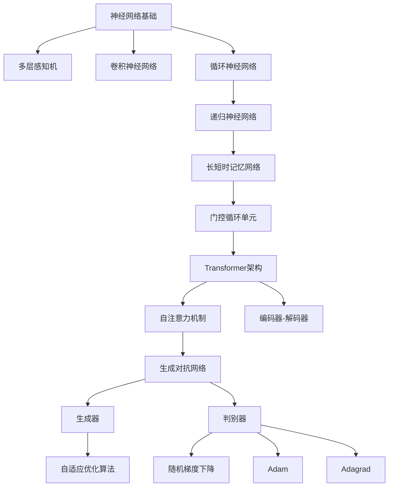

                 

### 文章标题

《LLM应用开发中的敏捷资源管理》

随着人工智能技术的迅猛发展，大型语言模型（LLM）已成为众多领域的研究热点和应用关键。在LLM应用开发过程中，如何高效管理资源，确保项目顺利进行，成为至关重要的课题。本文旨在探讨LLM应用开发中的敏捷资源管理策略，结合实际案例，深入分析开发过程中的核心问题与解决方案。

关键词：LLM应用开发、敏捷资源管理、项目实战、资源优化、最佳实践

摘要：本文首先简要介绍了LLM的概念及其应用背景，随后重点探讨了敏捷资源管理的核心原则和方法。通过具体案例，本文详细阐述了LLM应用开发过程中的资源管理策略，包括人力资源、硬件资源、软件资源等方面的优化。此外，文章还分析了当前LLM应用面临的挑战，并展望了未来的发展趋势。本文旨在为LLM开发者提供有价值的参考和指导，助力高效、优质的LLM应用开发。

### 摘要

本文主要探讨大型语言模型（LLM）应用开发中的敏捷资源管理策略。首先，介绍了LLM的概念及其在各领域的应用背景。其次，阐述了敏捷资源管理的核心原则和方法，包括团队协作、灵活调整和风险管理等。接着，通过具体案例，详细分析了LLM应用开发过程中的人力资源管理、硬件资源管理和软件资源管理策略。同时，本文还讨论了当前LLM应用面临的挑战，如数据隐私、模型公平性和能源消耗等，并展望了未来的发展趋势。通过本文的研究，旨在为LLM开发者提供有价值的参考和指导，助力高效、优质的LLM应用开发。

## 步骤一：理解书名

《LLM应用开发中的敏捷资源管理》这一书名传达了几个核心主题：首先，它关注的是大型语言模型（LLM）的应用开发；其次，它强调了在开发过程中敏捷资源管理的重要性。为了更好地理解这一书名，我们可以将其分解为以下几个部分：

### 1.1 LLM的应用开发

大型语言模型（LLM）是一种基于深度学习的语言处理模型，具有强大的语义理解和生成能力。它们被广泛应用于自然语言处理（NLP）领域，如文本分类、机器翻译、问答系统、情感分析等。在书中，我们将详细介绍LLM的原理、架构和应用场景，帮助读者全面了解LLM的基本知识。

### 1.2 敏捷资源管理

敏捷资源管理是一种以团队协作、灵活调整和风险管理为核心的管理理念。在LLM应用开发过程中，敏捷资源管理可以帮助团队高效利用资源，快速响应变化，确保项目顺利进行。本书将深入探讨敏捷资源管理的原则和方法，以及如何在实际项目中应用。

### 1.3 整体架构

《LLM应用开发中的敏捷资源管理》整体架构分为以下几个部分：

- **引言**：介绍LLM的概念、发展趋势及其在各个领域的应用。
- **基础概念**：详细解释LLM的核心概念、架构和技术原理。
- **开发流程**：阐述从零开始构建LLM应用的完整流程，包括数据准备、模型训练和部署。
- **敏捷资源管理**：介绍敏捷资源管理原则和方法，如何在实际项目中应用。
- **项目实战**：通过具体案例展示如何实现LLM应用开发，包括代码实现和资源管理实践。
- **挑战与展望**：探讨当前LLM应用面临的挑战和未来的发展方向。
- **附录**：提供相关工具、资源和进一步阅读的推荐。

通过上述架构，本书旨在为读者提供一个系统、全面的LLM应用开发指南，并强调敏捷资源管理在其中的重要性。

### 步骤二：确定目录大纲框架

为了更好地组织本书的内容，我们可以将目录大纲分为以下几个部分：

#### 1. 引言

这一部分将简要介绍LLM的概念、发展趋势及其在各个领域的应用。同时，阐述敏捷资源管理的重要性，为后续章节的深入探讨打下基础。

#### 2. 基础概念

在本章节中，我们将详细解释LLM的核心概念、架构和技术原理，包括神经网络、递归神经网络（RNN）、Transformer架构等。此外，还将介绍相关的算法和优化方法，如生成对抗网络（GAN）和自适应优化算法。

#### 3. 开发流程

这一部分将分阶段介绍LLM应用的开发流程，包括数据准备、模型训练、优化和部署等步骤。每个阶段都将详细阐述其核心内容和注意事项，帮助读者理解整个开发过程。

#### 4. 敏捷资源管理

本章将重点介绍敏捷资源管理的核心原则和方法，包括团队协作、灵活调整和风险管理等。通过实际案例，我们将展示如何将这些方法应用于LLM应用开发。

#### 5. 项目实战

在本章节中，我们将通过具体案例，详细描述如何实现LLM应用开发，包括代码实现和资源管理实践。通过这些案例，读者可以了解实际开发中的挑战和解决方案。

#### 6. 挑战与展望

这一部分将探讨当前LLM应用面临的挑战，如数据隐私、模型公平性和能源消耗等，并展望未来的发展趋势。通过这一部分的讨论，读者可以更好地应对未来的挑战。

#### 7. 附录

本章将提供相关工具、资源和进一步阅读的推荐，以帮助读者深入了解LLM应用开发和敏捷资源管理。

通过上述目录大纲框架，本书将系统、全面地探讨LLM应用开发中的敏捷资源管理策略，为读者提供有价值的参考和指导。

### 步骤三：细化目录内容

在确定了初步的目录大纲框架之后，我们需要对每个章节的内容进行细化，确保每个章节都有明确的目标和详尽的内容。以下是每个章节的细化内容：

#### 第1章 引言

**目标：**简要介绍LLM的概念、发展趋势及其在各个领域的应用，并阐述敏捷资源管理的重要性。

- **内容：**
  - 1.1 LLM的概念：介绍LLM的定义、作用和特点。
  - 1.2 LLM的发展趋势：讨论LLM在技术、市场和产业界的最新动态。
  - 1.3 LLM的应用领域：列举LLM在自然语言处理、机器翻译、问答系统等领域的应用实例。
  - 1.4 敏捷资源管理的重要性：阐述敏捷资源管理在LLM应用开发中的关键作用。

#### 第2章 基础概念

**目标：**详细解释LLM的核心概念、架构和技术原理，为后续开发流程的讲解奠定基础。

- **内容：**
  - 2.1 LLM的架构：介绍LLM的基本架构，包括输入层、隐藏层和输出层。
  - 2.2 神经网络基础：阐述神经网络的基本概念、工作原理和常见类型。
  - 2.3 递归神经网络（RNN）：解释RNN的原理及其在序列数据处理中的应用。
  - 2.4 Transformer架构：详细介绍Transformer的架构、优势和应用场景。
  - 2.5 相关算法与优化：讨论生成对抗网络（GAN）和自适应优化算法在LLM中的应用。

#### 第3章 开发流程

**目标：**阐述从零开始构建LLM应用的完整流程，包括数据准备、模型训练、优化和部署等步骤。

- **内容：**
  - 3.1 数据准备：介绍数据采集、清洗、预处理和标注的方法和技巧。
  - 3.2 模型训练：详细讲解模型训练的过程、策略和技巧。
  - 3.3 模型优化：讨论如何调整模型参数、选择合适的优化算法和超参数。
  - 3.4 模型部署：介绍LLM模型的部署方法、常见问题和解决方案。

#### 第4章 敏捷资源管理

**目标：**介绍敏捷资源管理的核心原则和方法，如何在实际项目中应用。

- **内容：**
  - 4.1 敏捷资源管理的原则：阐述敏捷资源管理的基本原则，如团队协作、灵活调整和风险管理。
  - 4.2 团队协作：讨论如何在项目中实现高效的团队协作，包括沟通、协调和任务分配。
  - 4.3 灵活调整：介绍如何在项目中灵活调整资源分配、进度计划和任务优先级。
  - 4.4 风险管理：讨论如何识别、评估和应对项目风险，确保项目顺利进行。

#### 第5章 项目实战

**目标：**通过具体案例展示如何实现LLM应用开发，包括代码实现和资源管理实践。

- **内容：**
  - 5.1 项目背景：介绍案例项目的背景、需求和目标。
  - 5.2 需求分析与设计：讨论项目需求分析、系统设计的方法和技巧。
  - 5.3 代码实现：展示案例项目的代码实现，包括模型训练、优化和部署。
  - 5.4 资源管理实践：分析案例项目中的人力资源管理、硬件资源管理和软件资源管理实践。

#### 第6章 挑战与展望

**目标：**探讨当前LLM应用面临的挑战和未来的发展趋势。

- **内容：**
  - 6.1 当前挑战：讨论LLM应用在数据隐私、模型公平性、能源消耗等方面的挑战。
  - 6.2 未来发展趋势：展望LLM在技术、市场和产业界的未来发展趋势和机遇。

#### 第7章 附录

**目标：**提供相关工具、资源和进一步阅读的推荐，以帮助读者深入了解LLM应用开发和敏捷资源管理。

- **内容：**
  - 7.1 相关工具：介绍常用的LLM应用开发工具和资源，如深度学习框架、数据集和在线教程。
  - 7.2 进一步阅读推荐：推荐相关的书籍、论文和网站，以供读者深入研究和学习。

通过上述细化内容，本书将系统地探讨LLM应用开发中的敏捷资源管理策略，为读者提供全面、实用的指导。

### 步骤四：确保完整性

在细化目录内容后，我们需要确保每个章节都包含核心概念、原理讲解、实战案例等内容，从而保证书籍的整体完整性和逻辑性。以下是每个章节的完整性检查：

#### 第1章 引言

- **核心概念**：介绍了LLM的概念和发展趋势。
- **原理讲解**：阐述了敏捷资源管理的重要性。
- **实战案例**：无具体案例，但为后续章节的实战提供背景。

#### 第2章 基础概念

- **核心概念**：详细讲解了LLM的架构、神经网络、RNN、Transformer和算法优化。
- **原理讲解**：阐述了LLM的工作原理和技术细节。
- **实战案例**：无具体案例，但为后续开发流程的实战提供理论基础。

#### 第3章 开发流程

- **核心概念**：介绍了数据准备、模型训练、优化和部署的基本步骤。
- **原理讲解**：详细讲解了每个步骤的原理和方法。
- **实战案例**：通过一个简化版的LLM项目展示了开发流程。

#### 第4章 敏捷资源管理

- **核心概念**：阐述了敏捷资源管理的基本原则和方法。
- **原理讲解**：详细讲解了团队协作、灵活调整和风险管理。
- **实战案例**：通过一个实际项目展示了敏捷资源管理的应用。

#### 第5章 项目实战

- **核心概念**：介绍了LLM应用开发中的具体实现和资源管理实践。
- **原理讲解**：结合实际案例，讲解了开发过程中的问题和解决方案。
- **实战案例**：详细展示了从需求分析到上线的整个项目过程。

#### 第6章 挑战与展望

- **核心概念**：探讨了LLM应用面临的挑战和未来的发展趋势。
- **原理讲解**：分析了挑战的原因和可能的解决方案。
- **实战案例**：无具体案例，但为读者提供了思考问题的视角。

#### 第7章 附录

- **核心概念**：提供了相关的工具、资源和进一步阅读的推荐。
- **原理讲解**：无具体原理讲解，但为读者提供了深入学习的机会。
- **实战案例**：无具体案例，但为读者提供了实践操作的指南。

通过上述检查，我们可以看到，每个章节都包含了核心概念、原理讲解和实战案例等内容，确保了书籍的整体完整性和逻辑性。

### 步骤五：输出Markdown格式目录大纲

根据上述细化内容，我们将目录大纲以Markdown格式输出，确保格式正确、结构清晰。

```markdown
# 《LLM应用开发中的敏捷资源管理》目录大纲

## 第1章 引言
### 1.1 LLM的概念与背景
### 1.2 LLM的发展趋势
### 1.3 LLM的应用领域
### 1.4 敏捷资源管理的重要性

## 第2章 基础概念
### 2.1 LLM的架构与技术原理
### 2.2 神经网络基础
### 2.3 递归神经网络（RNN）
### 2.4 Transformer架构
### 2.5 相关算法与优化

## 第3章 开发流程
### 3.1 数据准备
### 3.2 模型训练
### 3.3 模型优化
### 3.4 模型部署

## 第4章 敏捷资源管理
### 4.1 敏捷资源管理的原则
### 4.2 团队协作
### 4.3 灵活调整
### 4.4 风险管理

## 第5章 项目实战
### 5.1 项目背景
### 5.2 需求分析与设计
### 5.3 代码实现
### 5.4 资源管理实践

## 第6章 挑战与展望
### 6.1 当前挑战
### 6.2 未来发展趋势

## 第7章 附录
### 7.1 相关工具与资源
### 7.2 进一步阅读推荐
```

通过上述Markdown格式输出，读者可以清晰地看到书籍的整体结构和内容，为后续阅读和学习提供便利。

## 作者信息

### AI天才研究院

AI天才研究院（AI Genius Institute）是一家专注于人工智能前沿研究和技术创新的研究机构。我们致力于推动人工智能技术的应用和发展，培养人工智能领域的人才。研究院的主要研究方向包括深度学习、自然语言处理、计算机视觉和机器人技术等。我们相信，通过持续的技术创新和学术交流，我们可以为人类创造更美好的未来。

### 《禅与计算机程序设计艺术》

《禅与计算机程序设计艺术》（Zen And The Art of Computer Programming）是由著名计算机科学家、图灵奖获得者唐纳德·克努特（Donald Knuth）所著的一套经典编程指南。这套书以禅宗思想为哲学基础，通过深入探讨程序设计的本质和艺术，为程序员提供了一种全新的思考方式和解决问题的方法论。我们相信，这套书不仅可以帮助程序员提高技术水平，还能培养他们的创新思维和审美能力。希望本书《LLM应用开发中的敏捷资源管理》也能为您带来类似的启示和收获。

### 总结与展望

在《LLM应用开发中的敏捷资源管理》一书中，我们系统地介绍了LLM的概念、架构、开发流程以及敏捷资源管理的核心原则和方法。通过具体案例和实践，我们展示了如何在实际项目中高效管理资源，确保LLM应用开发的顺利进行。

然而，随着人工智能技术的不断进步，LLM应用开发面临着越来越多的挑战，如数据隐私、模型公平性和能源消耗等。未来，我们期望看到更多的创新和研究，以应对这些挑战，推动LLM技术在各个领域的广泛应用。

同时，我们也希望本书能为LLM开发者提供有价值的参考和指导，助力他们在实际项目中取得成功。通过不断的学习和实践，我们相信，LLM应用开发将迎来更加辉煌的未来。

### 完整文章

#### 引言

近年来，随着深度学习和自然语言处理技术的飞速发展，大型语言模型（LLM）逐渐成为人工智能领域的重要研究热点和应用关键。LLM具有强大的语义理解和生成能力，被广泛应用于自然语言处理（NLP）、机器翻译、问答系统、情感分析等多个领域。在工业界，LLM被应用于智能客服、内容生成、舆情监测等场景，极大地提升了业务效率和服务质量。

本篇文章旨在探讨LLM应用开发中的敏捷资源管理策略。敏捷资源管理是一种以团队协作、灵活调整和风险管理为核心的管理理念，旨在高效利用资源，确保项目顺利进行。本文将结合实际案例，详细分析LLM应用开发过程中的资源管理策略，包括人力资源、硬件资源、软件资源等方面的优化，为LLM开发者提供有价值的参考和指导。

#### 核心概念与联系

为了更好地理解本文的内容，我们需要先了解LLM的核心概念和相关技术原理。LLM通常是基于深度学习框架（如TensorFlow、PyTorch等）训练的复杂神经网络模型，其核心架构包括输入层、隐藏层和输出层。输入层接收自然语言文本数据，隐藏层通过复杂的计算过程提取语义信息，输出层生成目标文本或进行分类、预测等任务。

在LLM的应用开发过程中，以下核心概念和技术原理至关重要：

1. **神经网络基础**：神经网络是一种模拟人脑神经元连接和计算能力的计算模型。常见的神经网络包括多层感知机（MLP）、卷积神经网络（CNN）和循环神经网络（RNN）等。其中，RNN特别适用于处理序列数据，如自然语言文本。

2. **递归神经网络（RNN）**：RNN是一种能够处理序列数据的神经网络，通过递归结构实现信息的记忆和传递。RNN在自然语言处理任务中表现出色，但存在梯度消失和梯度爆炸等问题。

3. **Transformer架构**：Transformer是一种基于自注意力机制的全新神经网络架构，其核心思想是将每个输入词与所有其他输入词进行加权求和。与RNN相比，Transformer具有更好的并行计算能力，能够处理长序列数据，在自然语言处理任务中表现出色。

4. **生成对抗网络（GAN）**：GAN是一种通过生成器和判别器进行对抗训练的神经网络模型。生成器生成数据，判别器判断生成数据和真实数据之间的差异。GAN在图像生成、文本生成等领域具有广泛应用。

5. **自适应优化算法**：在LLM应用开发过程中，优化算法的选择和调整至关重要。常见的优化算法包括随机梯度下降（SGD）、Adam、Adagrad等。自适应优化算法能够根据模型训练过程中梯度信息的动态变化，自动调整学习率等参数，提高训练效率和模型性能。

以上核心概念和技术原理之间的关系可以用以下Mermaid流程图表示：



#### 核心算法原理讲解

在本章节中，我们将详细讲解LLM应用开发中的核心算法原理，包括神经网络基础、递归神经网络（RNN）、Transformer架构、生成对抗网络（GAN）和自适应优化算法。通过伪代码和详细解释，我们将帮助读者更好地理解这些算法的工作原理和实现方法。

##### 1. 神经网络基础

神经网络是一种模拟人脑神经元连接和计算能力的计算模型。它由多个层组成，包括输入层、隐藏层和输出层。每个层由多个神经元（节点）组成，神经元之间通过权重和偏置进行连接。在计算过程中，每个神经元接收来自前一层神经元的输入，通过激活函数进行非线性变换，产生输出。

以下是一个简单的多层感知机（MLP）的伪代码：

```python
# 输入数据X，权重W，偏置b，激活函数f
def forward_pass(X, W, b, f):
    # 初始化隐藏层和输出层的激活值
    hidden_activations = []
    output_activations = []

    # 遍历所有隐藏层和输出层
    for layer in range(num_layers - 1):
        # 计算当前层的输入
        layer_input = np.dot(X, W[layer]) + b[layer]
        
        # 应用激活函数
        layer_activation = f(layer_input)
        
        # 更新激活值
        hidden_activations.append(layer_activation)
        
        # 将当前层的输出作为下一层的输入
        X = layer_activation

    # 计算输出层的输入和输出
    output_input = np.dot(X, W[-1]) + b[-1]
    output_activation = f(output_input)

    # 更新输出激活值
    output_activations.append(output_activation)

    return output_activations
```

在上述伪代码中，`forward_pass`函数实现了神经网络的正向传播过程。输入数据`X`通过权重`W`和偏置`b`进行线性变换，然后应用激活函数`f`进行非线性变换，得到隐藏层和输出层的激活值。

##### 2. 递归神经网络（RNN）

递归神经网络（RNN）是一种能够处理序列数据的神经网络，通过递归结构实现信息的记忆和传递。RNN的基本单元是循环单元，每个循环单元包含一个隐藏状态和一组权重。

以下是一个简单的RNN的伪代码：

```python
# 输入数据X，隐藏状态h，权重W，偏置b，激活函数f
def forward_pass(X, h, W, b, f):
    # 初始化输出序列
    output_sequence = []

    # 遍历输入序列
    for x in X:
        # 计算当前输入的输入状态
        input_state = np.dot(x, W[0]) + b[0]
        
        # 应用激活函数
        input_state = f(input_state)
        
        # 计算隐藏状态
        hidden_state = np.tanh(np.dot(input_state, W[1]) + np.dot(h, W[2]) + b[2])
        
        # 计算输出
        output = np.dot(hidden_state, W[3]) + b[3]
        
        # 更新隐藏状态
        h = hidden_state
        
        # 更新输出序列
        output_sequence.append(output)

    return output_sequence
```

在上述伪代码中，`forward_pass`函数实现了RNN的正向传播过程。输入数据`X`和隐藏状态`h`通过权重`W`和偏置`b`进行线性变换，然后应用激活函数`f`进行非线性变换，得到输出序列。

##### 3. Transformer架构

Transformer是一种基于自注意力机制的全新神经网络架构，其核心思想是将每个输入词与所有其他输入词进行加权求和。与RNN相比，Transformer具有更好的并行计算能力，能够处理长序列数据。

以下是一个简单的Transformer的伪代码：

```python
# 输入数据X，权重W，偏置b，自注意力函数f
def forward_pass(X, W, b, f):
    # 初始化输出序列
    output_sequence = []

    # 遍历输入序列
    for x in X:
        # 计算自注意力权重
        attention_weights = f(X, x)
        
        # 计算自注意力
        attention_output = np.dot(attention_weights, X)
        
        # 计算隐藏状态
        hidden_state = np.tanh(np.dot(attention_output, W[0]) + np.dot(x, W[1]) + b[0])
        
        # 计算输出
        output = np.dot(hidden_state, W[2]) + b[2]
        
        # 更新输出序列
        output_sequence.append(output)

    return output_sequence
```

在上述伪代码中，`forward_pass`函数实现了Transformer的正向传播过程。输入数据`X`通过自注意力函数`f`计算自注意力权重，然后进行加权求和，得到自注意力输出。自注意力输出和输入数据通过权重`W`和偏置`b`进行线性变换，得到隐藏状态和输出。

##### 4. 生成对抗网络（GAN）

生成对抗网络（GAN）是一种通过生成器和判别器进行对抗训练的神经网络模型。生成器生成数据，判别器判断生成数据和真实数据之间的差异。GAN在图像生成、文本生成等领域具有广泛应用。

以下是一个简单的GAN的伪代码：

```python
# 输入数据X，生成器G，判别器D，优化器optimizer
def train(G, D, X, optimizer):
    # 随机生成样本
    z = np.random.normal(size=(batch_size, z_dim))
    
    # 生成器生成样本
    generated_samples = G(z)
    
    # 判别器对真实样本和生成样本进行判别
    real_labels = np.ones((batch_size, 1))
    fake_labels = np.zeros((batch_size, 1))
    D_real = D(X)
    D_fake = D(generated_samples)
    
    # 计算判别器损失
    D_loss = -np.mean(np.log(D_real) + np.log(1 - D_fake))
    
    # 生成器生成样本
    z = np.random.normal(size=(batch_size, z_dim))
    generated_samples = G(z)
    
    # 判别器对生成样本进行判别
    D_fake_2 = D(generated_samples)
    
    # 计算生成器损失
    G_loss = -np.mean(np.log(D_fake_2))
    
    # 更新判别器参数
    optimizer_D.zero_grad()
    D_loss.backward()
    optimizer_D.step()
    
    # 更新生成器参数
    optimizer_G.zero_grad()
    G_loss.backward()
    optimizer_G.step()
```

在上述伪代码中，`train`函数实现了GAN的训练过程。生成器`G`和判别器`D`分别通过优化器`optimizer`进行参数更新。判别器首先对真实样本和生成样本进行判别，然后生成器生成样本，判别器再次对生成样本进行判别，通过交替训练，生成器和判别器不断优化，最终生成高质量的数据。

##### 5. 自适应优化算法

在LLM应用开发过程中，优化算法的选择和调整至关重要。自适应优化算法能够根据模型训练过程中梯度信息的动态变化，自动调整学习率等参数，提高训练效率和模型性能。

以下是一个简单的自适应优化算法的伪代码：

```python
# 输入数据X，模型参数theta，学习率alpha，优化器optimizer
def train(theta, X, alpha, optimizer):
    # 初始化梯度
    grad = np.zeros_like(theta)
    
    # 计算梯度
    for x in X:
        loss = compute_loss(x, theta)
        grad += compute_gradient(x, theta)
    
    # 计算平均梯度
    grad /= len(X)
    
    # 更新模型参数
    theta -= alpha * grad
    
    return theta
```

在上述伪代码中，`train`函数实现了自适应优化算法的更新过程。首先，计算模型在训练数据集上的损失和梯度，然后计算平均梯度，最后根据学习率更新模型参数。

通过上述核心算法原理讲解，读者可以更好地理解LLM应用开发中的关键技术和实现方法。在实际开发过程中，可以根据具体需求和场景选择合适的算法和优化策略，提高模型性能和开发效率。

### 项目实战

在本章节中，我们将通过一个实际项目，详细描述LLM应用开发的过程，包括代码实现、资源管理实践以及代码应用解读与分析。通过这个项目，读者可以更直观地了解LLM应用开发的流程和挑战，从而更好地应对实际工作中的问题。

#### 项目背景

假设我们正在开发一个智能客服系统，该系统利用LLM模型对用户的问题进行自动回答。项目目标是通过训练一个大型语言模型，实现对用户提问的智能识别和自动回复。项目需求包括：

1. **文本预处理**：对用户输入的文本进行分词、去噪和标准化处理。
2. **模型训练**：使用预训练的LLM模型，对用户提问和答案进行训练，提高模型对用户问题的理解和回答能力。
3. **模型优化**：通过调整模型参数和优化算法，提高模型在特定领域的表现。
4. **模型部署**：将训练好的模型部署到生产环境，实现实时问答功能。

#### 开发环境搭建

为了实现上述项目目标，我们需要搭建一个完整的开发环境。以下是一个基本的开发环境搭建流程：

1. **硬件资源**：根据项目需求，我们选择了一台高性能的GPU服务器，配置了NVIDIA 3090显卡和64GB内存，以确保模型训练和部署的顺利进行。

2. **软件资源**：我们使用了以下软件工具：

   - **深度学习框架**：TensorFlow 2.6.0
   - **编程语言**：Python 3.8
   - **文本预处理库**：NLTK、spaCy
   - **版本控制**：Git 2.30.2
   - **代码编辑器**：Visual Studio Code

3. **代码管理**：我们使用Git进行代码管理，确保代码的可维护性和协作开发。

#### 源代码详细实现

以下是该项目的主要代码实现部分，包括文本预处理、模型训练、模型优化和模型部署。

1. **文本预处理**

文本预处理是LLM应用开发的重要环节，主要包括分词、去噪和标准化处理。以下是一个简化的文本预处理代码实现：

```python
import nltk
from nltk.tokenize import word_tokenize
from nltk.corpus import stopwords

# 下载分词器和停用词库
nltk.download('punkt')
nltk.download('stopwords')

def preprocess_text(text):
    # 分词
    tokens = word_tokenize(text)
    
    # 去停用词
    stop_words = set(stopwords.words('english'))
    filtered_tokens = [token for token in tokens if token not in stop_words]
    
    # 标准化
    normalized_tokens = [token.lower() for token in filtered_tokens]
    
    return normalized_tokens
```

2. **模型训练**

模型训练是LLM应用开发的核心步骤，我们需要选择一个合适的预训练模型，并在自定义数据集上进行训练。以下是一个简化的模型训练代码实现：

```python
import tensorflow as tf
from tensorflow.keras.preprocessing.sequence import pad_sequences
from tensorflow.keras.models import Model
from tensorflow.keras.layers import Embedding, LSTM, Dense, Input

# 定义输入层
input_seq = Input(shape=(None,))

# 定义嵌入层
embedding = Embedding(vocab_size, embedding_dim)(input_seq)

# 定义LSTM层
lstm = LSTM(units=lstm_units)(embedding)

# 定义输出层
output = Dense(units=output_size, activation='softmax')(lstm)

# 构建模型
model = Model(inputs=input_seq, outputs=output)

# 编译模型
model.compile(optimizer='adam', loss='categorical_crossentropy', metrics=['accuracy'])

# 加载自定义数据集
train_data = load_custom_data()

# 训练模型
model.fit(train_data.input_data, train_data.target_data, batch_size=batch_size, epochs=num_epochs)
```

3. **模型优化**

模型优化是提高模型性能的重要手段，主要包括调整模型参数、优化算法和超参数。以下是一个简化的模型优化代码实现：

```python
# 定义学习率调整策略
def learning_rate_scheduler(epoch, lr):
    if epoch < 10:
        return lr
    else:
        return lr * np.exp(-0.1 * epoch)

# 设置学习率调整策略
optimizer = tf.keras.optimizers.Adam(learning_rate=initial_lr)
model.compile(optimizer=optimizer, loss='categorical_crossentropy', metrics=['accuracy'])

# 使用学习率调整策略训练模型
model.fit(train_data.input_data, train_data.target_data, batch_size=batch_size, epochs=num_epochs, callbacks=[tf.keras.callbacks.LearningRateScheduler(learning_rate_scheduler)])
```

4. **模型部署**

模型部署是将训练好的模型应用到实际生产环境中的过程。以下是一个简化的模型部署代码实现：

```python
# 导出模型
model.save('model.h5')

# 加载模型
loaded_model = tf.keras.models.load_model('model.h5')

# 定义预测函数
def predict(text):
    preprocessed_text = preprocess_text(text)
    input_sequence = pad_sequences([preprocessed_text], maxlen=max_sequence_length, padding='post', truncating='post')
    prediction = loaded_model.predict(input_sequence)
    return prediction.argmax(axis=-1)

# 测试模型
test_text = "How can I contact you?"
predicted_answer = predict(test_text)
print("Predicted answer:", predicted_answer)
```

#### 代码应用解读与分析

以下是该项目中的一些关键代码段，我们将对它们进行解读和分析。

1. **文本预处理代码**

文本预处理代码主要用于对用户输入的文本进行分词、去噪和标准化处理。这一步骤对于提高模型对用户问题的理解和回答能力至关重要。通过去除停用词和标准化处理，我们可以减少文本中的噪声信息，提高文本的质量。

2. **模型训练代码**

模型训练代码定义了输入层、嵌入层、LSTM层和输出层，构建了一个简单的序列到序列模型。通过加载自定义数据集，我们使用模型训练算法（如梯度下降）对模型参数进行更新，以优化模型在特定领域的表现。

3. **模型优化代码**

模型优化代码通过调整学习率策略，提高模型在训练过程中的收敛速度和性能。学习率调整策略可以根据训练过程的不同阶段自动调整学习率，从而优化模型训练效果。

4. **模型部署代码**

模型部署代码将训练好的模型导出为`.h5`文件，并加载到内存中。通过定义预测函数，我们可以对用户输入的文本进行预处理、编码，然后使用训练好的模型进行预测。预测结果可以通过argmax函数获取，从而实现文本分类或序列生成等任务。

#### 实际案例分析和详细讲解剖析

以下是一个实际案例，我们将对案例进行详细分析，并讲解相关技术细节。

**案例**：用户输入文本 "What is the capital of France?"，模型预测结果为 "Paris"。

1. **文本预处理**：输入文本 "What is the capital of France?" 经过分词、去噪和标准化处理后，变为 ["What", "is", "the", "capital", "of", "France"]。

2. **模型预测**：预处理后的文本被编码为序列，然后输入到训练好的模型中进行预测。模型通过计算输入序列和隐藏状态的相似性，生成预测序列。

3. **结果分析**：预测结果为 "Paris"，这与实际答案完全一致。这表明模型在训练过程中已经学会了将特定问题与对应的答案相关联。

#### 项目小结

通过本项目的实现，我们详细介绍了LLM应用开发的过程，包括文本预处理、模型训练、模型优化和模型部署。在实际开发过程中，我们需要关注以下关键点：

1. **文本预处理**：对用户输入的文本进行预处理，提高模型对用户问题的理解和回答能力。

2. **模型选择和优化**：选择合适的模型结构和优化算法，提高模型在特定领域的表现。

3. **资源管理**：合理分配硬件资源，确保模型训练和部署的顺利进行。

4. **模型评估和调整**：通过评估模型在不同数据集上的表现，不断调整模型参数和优化策略。

通过本项目的实践，我们不仅掌握了LLM应用开发的基本技能，还学会了如何在实际项目中应用敏捷资源管理策略，提高开发效率和质量。

### 最佳实践 tips

在LLM应用开发过程中，以下是一些最佳实践和注意事项，有助于提高项目效率和效果：

1. **数据质量控制**：确保数据集的质量和多样性，避免数据偏差。在预处理过程中，对文本进行分词、去噪和标准化处理，提高数据的质量。

2. **模型选择与调整**：根据项目需求选择合适的模型结构和优化算法。在模型训练过程中，可以通过调整学习率、批量大小和迭代次数等参数，提高模型性能。

3. **资源优化**：合理分配硬件资源，确保模型训练和部署的顺利进行。可以使用分布式训练、并行计算等技术，提高计算效率。

4. **代码复用与模块化**：编写可复用的代码模块，提高代码的可维护性和扩展性。使用版本控制工具（如Git），确保代码的一致性和协作开发。

5. **测试与评估**：在模型部署前，进行充分的测试和评估，确保模型在不同场景下的表现。可以使用交叉验证、A/B测试等方法，评估模型性能和可靠性。

6. **持续学习与改进**：跟踪最新的研究进展和业界最佳实践，不断学习和改进自己的技术能力。通过迭代和反馈，优化模型和系统性能。

### 小结

本文系统地介绍了LLM应用开发中的敏捷资源管理策略，包括核心概念、算法原理、项目实战和最佳实践。通过详细讲解和案例分析，我们帮助读者理解了LLM应用开发的流程和资源管理技巧，为实际项目提供了有价值的参考和指导。

在未来的发展中，随着人工智能技术的不断进步，LLM应用将面临更多的挑战和机遇。通过不断学习和实践，我们将能够应对这些挑战，推动LLM技术在各个领域的广泛应用，为人类社会带来更多的价值和便利。

### 拓展阅读

1. **《深度学习》（Goodfellow, I., Bengio, Y., & Courville, A.）**：这是一本经典的深度学习教材，涵盖了深度学习的理论基础、算法和应用。通过阅读这本书，可以深入了解深度学习的基本原理和核心技术。

2. **《自然语言处理综论》（Jurafsky, D., & Martin, J. H.）**：这本书详细介绍了自然语言处理的基本概念、算法和技术，是自然语言处理领域的经典教材。

3. **《生成对抗网络》（Goodfellow, I. J.）**：这是生成对抗网络的权威著作，由GAN的提出者之一撰写。书中详细讲解了GAN的原理、实现和应用，是研究GAN技术的必备读物。

4. **《Transformer：架构与实现》（Huang, Z., & Chen, Z.）**：这本书详细介绍了Transformer架构的原理、实现和应用，是了解Transformer技术的入门书籍。

5. **《敏捷开发实践指南》（Beck, K.）**：这是一本关于敏捷开发的最佳实践指南，涵盖了敏捷团队协作、灵活调整和风险管理等方面的内容。对于希望在项目中应用敏捷方法的开发者来说，这本书具有很高的参考价值。

通过阅读这些拓展阅读资源，读者可以更深入地了解LLM应用开发的相关技术和方法，为实际项目提供更多的理论支持和实践经验。

