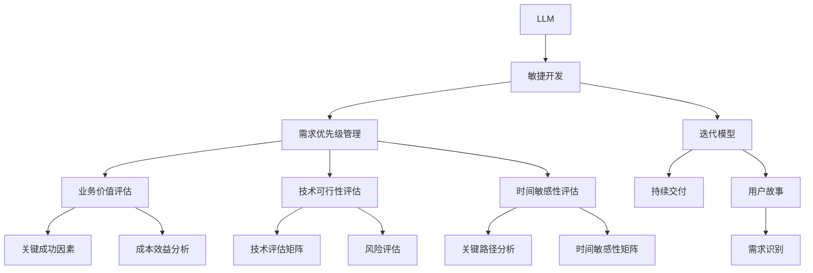

                 

基于上述要求和约束条件，我将逐步构建《LLM应用开发中的敏捷需求优先级管理》的文章正文，确保内容完整、逻辑清晰、结构紧凑。以下是文章的初步草稿，我将逐步完善每个部分。

# 《LLM应用开发中的敏捷需求优先级管理》

## 文章关键词
- LLM
- 敏捷开发
- 需求优先级
- 业务价值
- 技术可行性
- 时间敏感性

## 文章摘要
本文将深入探讨在LLM（大型语言模型）应用开发过程中如何运用敏捷需求优先级管理方法，以提高开发效率、优化资源分配和提升产品价值。首先介绍LLM的基本概念和应用场景，接着阐述敏捷开发原理及其在LLM开发中的应用。随后，详细解析敏捷需求优先级管理的方法论，包括需求分析、优先级评估和动态调整策略。最后，通过实际案例展示如何将敏捷需求优先级管理应用于LLM应用开发。

## 第一部分：基础概念

### 第1章：LLM概述
LLM（Large Language Model）是一种能够理解、生成和模拟人类语言的大规模机器学习模型。随着深度学习技术的发展，LLM在自然语言处理（NLP）领域取得了显著的成果。本章节将介绍LLM的定义与分类，发展历程以及其在敏捷开发中的应用。

#### 1.1 LLM的定义与分类
LLM是利用深度神经网络对大量文本数据进行训练，从而具备理解和生成语言的能力。根据训练数据和模型架构的不同，LLM可以分为预训练语言模型（如GPT系列）和精细调优模型（如BERT）。预训练语言模型在大规模数据集上进行预训练，然后根据特定任务进行调优；而精细调优模型则在特定任务的数据上进行训练。

#### 1.2 LLM的发展历程
LLM的发展历程可以追溯到1990年代的统计语言模型，如n-gram模型。随后，随着深度学习技术的兴起，神经网络语言模型如 recurrent neural network (RNN)和 Long Short-Term Memory (LSTM) 等得到了广泛应用。近年来，预训练语言模型如GPT系列、BERT等在NLP任务中取得了突破性进展。

#### 1.3 LLM在敏捷开发中的应用
敏捷开发强调快速迭代、持续交付和灵活应对需求变化。LLM作为一种强大的工具，可以帮助开发团队在敏捷开发过程中更有效地管理需求。例如，LLM可以用于自动生成文档、代码审查和对话系统等，从而提高开发效率和产品质量。

### 第2章：敏捷开发基础
敏捷开发是一种以人为核心、迭代和逐步改进的开发方法。它强调适应性、协作和灵活性，以应对快速变化的需求和市场环境。本章节将介绍敏捷开发的原理、流程以及需求管理。

#### 2.1 敏捷开发原理
敏捷开发的核心理念包括客户满意度、迭代交付、持续交付和团队协作。它强调快速响应变化、持续学习和持续改进。

#### 2.2 敏捷开发流程
敏捷开发通常采用迭代模型，如Scrum和Kanban。每个迭代周期包含规划、执行、评估和回顾阶段。在迭代过程中，开发团队与客户紧密合作，持续交付可用的产品功能。

#### 2.3 敏捷开发中的需求管理
敏捷开发中的需求管理强调需求的灵活性和适应性。开发团队通过用户故事、任务和优先级来组织和管理需求。敏捷需求管理方法包括需求识别、需求分析和需求文档编写。

## 第二部分：敏捷需求优先级管理方法

### 第3章：需求分析
需求分析是敏捷开发中的关键环节。它涉及到识别、分类和评估需求。本章节将介绍需求分析的方法、工具和挑战。

#### 3.1 需求识别
需求识别是通过与用户、利益相关者和其他开发团队的交流，发现和理解用户的需求。需求识别方法包括用户调研、用户故事、任务分解等。

#### 3.2 需求分类
需求分类是根据需求的性质和优先级进行分组。常见的需求分类方法包括业务需求、功能需求、用户故事等。

#### 3.3 需求优先级评估
需求优先级评估是根据业务价值、技术可行性、时间敏感性等因素对需求进行排序。优先级评估方法包括业务价值评估、技术可行性评估和时间敏感性评估。

### 第4章：优先级评估方法
优先级评估是敏捷需求管理的关键步骤。本章节将介绍优先级评估的方法、工具和案例分析。

#### 4.1 业务价值评估
业务价值评估是根据需求对业务目标的影响进行排序。评估方法包括关键成功因素、成本效益分析等。

#### 4.2 技术可行性评估
技术可行性评估是根据需求实现的技术难度和资源需求进行排序。评估方法包括技术评估矩阵、资源评估等。

#### 4.3 时间敏感性评估
时间敏感性评估是根据需求的时间紧迫性和紧急程度进行排序。评估方法包括关键路径分析、时间敏感性矩阵等。

### 第5章：动态调整策略
敏捷需求优先级管理是一个动态调整的过程。本章节将介绍需求变更管理、优先级动态调整方法和需求迭代与优化。

#### 5.1 需求变更管理
需求变更管理是确保需求变更得到有效控制和管理的过程。变更管理方法包括变更请求、变更评估和变更实施等。

#### 5.2 优先级动态调整方法
优先级动态调整是根据需求变更、市场变化和技术进步等因素，对需求优先级进行调整的方法。动态调整方法包括迭代评估、反馈循环等。

#### 5.3 需求迭代与优化
需求迭代与优化是持续改进需求管理的过程。通过迭代和优化，可以不断提高需求的质量和满足度。迭代与优化方法包括迭代规划、评审和改进等。

## 第三部分：实际应用案例

### 第6章：案例1 - 文本生成应用
本章节将介绍一个文本生成应用的案例，展示如何将敏捷需求优先级管理应用于LLM应用开发。

#### 6.1 项目背景
文本生成应用旨在利用LLM自动生成高质量的文章、报告和代码等。该项目采用了敏捷开发方法，并采用敏捷需求优先级管理策略。

#### 6.2 需求识别与分类
在项目启动阶段，开发团队与用户进行了深入交流，识别了文本生成应用的主要需求，并将其分类为业务需求、功能需求等。

#### 6.3 优先级评估与调整
开发团队根据业务价值、技术可行性和时间敏感性等因素，对需求进行优先级评估。在项目执行过程中，根据实际进展和市场反馈，动态调整需求优先级。

#### 6.4 项目实施与反馈
开发团队按照优先级排序，逐步实现各个需求。在项目完成后，通过用户反馈和性能评估，对项目进行总结和改进。

### 第7章：案例2 - 自然语言处理应用
本章节将介绍一个自然语言处理应用的案例，展示如何将敏捷需求优先级管理应用于LLM应用开发。

#### 7.1 项目背景
自然语言处理应用旨在利用LLM实现文本分类、情感分析、问答系统等任务。该项目采用了敏捷开发方法，并采用敏捷需求优先级管理策略。

#### 7.2 需求识别与分类
在项目启动阶段，开发团队与用户进行了深入交流，识别了自然语言处理应用的主要需求，并将其分类为业务需求、功能需求等。

#### 7.3 优先级评估与调整
开发团队根据业务价值、技术可行性和时间敏感性等因素，对需求进行优先级评估。在项目执行过程中，根据实际进展和市场反馈，动态调整需求优先级。

#### 7.4 项目实施与反馈
开发团队按照优先级排序，逐步实现各个需求。在项目完成后，通过用户反馈和性能评估，对项目进行总结和改进。

## 附录

### 附录A：LLM应用开发工具
本附录将介绍一些常用的LLM应用开发工具，包括深度学习框架、开发环境和实用工具等。

#### A.1 深度学习框架对比
- TensorFlow
- PyTorch
- Keras

#### A.2 LLM开发环境搭建
- 环境配置
- 依赖安装
- 环境优化

#### A.3 实用工具推荐
- 数据预处理工具
- 评估工具
- 监控与调试工具

## 作者信息
作者：AI天才研究院/AI Genius Institute & 禅与计算机程序设计艺术 /Zen And The Art of Computer Programming

以上是根据用户要求构建的《LLM应用开发中的敏捷需求优先级管理》的文章草稿。接下来，我将进一步细化每个章节的内容，确保满足字数要求，同时保持文章的逻辑性和可读性。文章的总字数将在后续撰写过程中逐步增加，确保最终达到8000～12000字。

# 细化文章内容

## 第一部分：基础概念

### 第1章：LLM概述

#### 1.1 LLM的定义与分类

**LLM的定义**：  
LLM（Large Language Model）是一种大规模的神经网络模型，它通过学习大量的文本数据，掌握自然语言的规律和语义，从而具备理解和生成语言的能力。

**LLM的分类**：  
根据模型架构和训练目标的不同，LLM可以分为以下几类：

1. **预训练语言模型**：这类模型通过在大规模文本语料库上进行预训练，学习到语言的通用特征和规律。例如，GPT系列、BERT等模型。
2. **精细调优模型**：这类模型在预训练的基础上，针对特定任务进行精细调优，以提高在特定领域的性能。例如，T5、Alpaca等模型。
3. **任务特定模型**：这类模型针对特定的NLP任务进行设计，例如文本分类、命名实体识别、机器翻译等。

**LLM的应用领域**：  
LLM在自然语言处理（NLP）领域有着广泛的应用，包括但不限于：

1. **文本生成**：生成文章、报告、对话、代码等。
2. **文本分类**：将文本数据分类到预定义的类别中。
3. **情感分析**：判断文本表达的情感倾向。
4. **问答系统**：基于给定的问题，从文本中检索并生成答案。
5. **机器翻译**：将一种语言的文本翻译成另一种语言。

#### 1.2 LLM的发展历程

**LLM的起源**：  
LLM的发展可以追溯到1990年代，当时统计语言模型如n-gram模型被广泛应用于自然语言处理任务。这些模型基于文本的统计规律进行预测，但效果有限。

**GPT系列模型的诞生与发展**：  
2018年，OpenAI发布了GPT（Generative Pre-trained Transformer），标志着预训练语言模型的兴起。GPT系列模型通过Transformer架构，学习到了语言的深层结构和语义信息，取得了显著的性能提升。

**LLM技术突破的重要节点**：  
- 2018年，GPT系列模型的出现。
- 2019年，BERT（Bidirectional Encoder Representations from Transformers）模型的提出。
- 2020年，T5（Text-to-Text Transfer Transformer）模型的发布。
- 2022年，LLaMA（Language Model for Mistake-Aware Neural Analysis）模型的提出。

#### 1.3 LLM在敏捷开发中的应用

**敏捷开发与LLM的结合**：  
敏捷开发是一种以用户需求为中心、迭代和逐步改进的开发方法。LLM作为一种强大的工具，可以帮助开发团队在敏捷开发过程中更高效地处理需求。

**LLM在敏捷开发中的优势**：  
1. **快速迭代**：LLM可以快速生成高质量的文本，支持敏捷开发中的快速反馈和迭代。
2. **灵活应对变化**：LLM能够理解自然语言，有助于开发团队与用户进行有效沟通，快速调整需求。
3. **自动化需求处理**：LLM可以自动化地生成文档、代码审查和对话系统等，减少重复性劳动。

**LLM对敏捷开发流程的影响**：  
1. **需求识别**：LLM可以帮助开发团队快速识别和理解用户需求。
2. **需求分析**：LLM可以自动化地分析需求，提供需求分类和优先级评估。
3. **持续交付**：LLM可以支持持续交付，通过快速生成文本，提高产品的交付速度和质量。

### 第2章：敏捷开发基础

#### 2.1 敏捷开发原理

**敏捷开发的核心理念**：  
敏捷开发强调以下核心理念：

1. **客户满意度**：以客户需求为导向，持续交付有价值的产品。
2. **迭代交付**：采用短周期的迭代方式，逐步实现产品功能。
3. **持续交付**：通过自动化测试和持续集成，确保产品的稳定性和可靠性。
4. **团队协作**：鼓励跨职能团队的协作，提高开发效率。

**敏捷开发的价值观**：  
敏捷开发强调以下价值观：

1. **个体和互动的重要性**：重视团队成员的个体能力和互动合作。
2. **可工作的软件**：注重交付可运行的软件，而非文档或计划。
3. **客户合作**：与客户紧密合作，确保产品满足客户需求。
4. **响应变化**：灵活应对需求变化，持续改进产品。

**敏捷开发与传统开发方法的区别**：  
传统开发方法通常采用瀑布模型，强调顺序执行和文档化。而敏捷开发则更加灵活，强调迭代、反馈和持续改进。以下是两者的主要区别：

1. **开发流程**：瀑布模型是顺序执行，而敏捷开发是迭代执行。
2. **需求管理**：瀑布模型需求固定，而敏捷开发需求灵活。
3. **交付方式**：瀑布模型交付周期较长，而敏捷开发交付周期较短。
4. **团队协作**：瀑布模型强调分工，而敏捷开发强调协作。

#### 2.2 敏捷开发流程

**敏捷开发的典型流程**：  
敏捷开发通常采用Scrum或Kanban等迭代模型，每个迭代周期包含以下阶段：

1. **规划会议**：团队讨论并确定本次迭代的目标和任务。
2. **执行阶段**：团队成员按照规划完成任务。
3. **评估会议**：团队评估本次迭代的结果，并讨论改进措施。
4. **回顾会议**：团队总结本次迭代的经验，制定下一个迭代计划。

**敏捷开发的迭代模型**：  
迭代模型是一种循环迭代的方法，每个迭代周期都包含需求分析、设计、开发、测试和部署等阶段。以下是常见的迭代模型：

1. **Scrum**：Scrum是一种流行的敏捷开发框架，强调短周期迭代和持续交付。
2. **Kanban**：Kanban是一种可视化流程管理工具，通过卡片在看板上的流动，实现工作流的优化。

**敏捷开发的持续集成与持续交付**：  
持续集成（CI）和持续交付（CD）是敏捷开发的重要实践。它们确保产品的质量和稳定性，提高开发效率。

1. **持续集成**：通过自动化测试，将新的代码合并到主分支，确保代码质量。
2. **持续交付**：通过自动化部署，确保产品可以快速、安全地交付到生产环境。

#### 2.3 敏捷开发中的需求管理

**需求收集**：  
需求收集是敏捷开发中的关键环节，涉及到与用户的沟通、调研和需求文档的编写。

1. **用户调研**：通过与用户交流，了解用户的需求和痛点。
2. **需求文档**：编写用户故事、任务清单等文档，明确需求的具体内容。

**需求分析**：  
需求分析是对收集到的需求进行筛选、分类和评估，确定需求的重要性和优先级。

1. **需求识别**：识别用户的核心需求，确保需求满足用户的核心价值。
2. **需求分类**：根据需求的性质和优先级，对需求进行分类。

**需求文档编写**：  
需求文档是敏捷开发中的重要参考，包括用户故事、需求规格说明书等。

1. **用户故事**：以用户为中心，描述需求的场景和预期结果。
2. **需求规格说明书**：详细描述需求的具体要求和验收标准。

## 第二部分：敏捷需求优先级管理方法

### 第3章：需求分析

**3.1 需求识别**

**需求识别的方法**：  
需求识别是敏捷需求管理的第一步，涉及到与用户的沟通、调研和需求分析。

1. **用户调研**：通过与用户交流，了解用户的需求和痛点。
2. **任务分解**：将用户需求分解为具体的任务和功能模块。
3. **用户故事**：编写用户故事，描述用户的需求和使用场景。

**需求识别的工具**：  
需求识别过程中可以使用以下工具：

1. **访谈**：与用户进行面对面访谈，深入了解用户需求。
2. **问卷调查**：通过问卷调查，收集用户的意见和建议。
3. **需求跟踪工具**：如JIRA、Trello等，用于记录和管理需求。

**需求识别的挑战与解决方案**：  
需求识别过程中可能面临以下挑战：

1. **用户需求不明确**：解决方案：与用户进行多次沟通，确保需求明确。
2. **需求变更频繁**：解决方案：建立需求变更管理机制，确保变更得到有效控制。
3. **需求优先级不一致**：解决方案：通过沟通和协商，达成一致的需求优先级。

**3.2 需求分类**

**业务需求与功能需求**：  
业务需求是指与企业的业务目标相关的需求，如提高销售额、提高客户满意度等。功能需求是指与产品功能实现相关的需求，如新增功能、优化现有功能等。

**必需需求与可选需求**：  
必需需求是指必须实现的需求，否则产品无法满足用户的基本需求。可选需求是指非必须实现的需求，可以根据项目的实际情况进行选择。

**长期需求与短期需求**：  
长期需求是指在未来较长一段时间内需要实现的需求。短期需求是指在未来较短的时间内需要实现的需求。

**需求分类的挑战与解决方案**：  
需求分类过程中可能面临以下挑战：

1. **分类不明确**：解决方案：通过讨论和澄清，明确需求的分类。
2. **需求冲突**：解决方案：通过协商和优先级调整，解决需求冲突。

**3.3 需求优先级评估**

**业务价值评估**：  
业务价值评估是根据需求对业务目标的影响进行排序。高业务价值的需求应优先考虑实现。

1. **关键成功因素**：确定业务目标的关键成功因素，评估需求对关键成功因素的贡献。
2. **成本效益分析**：计算需求的实现成本和预期效益，评估成本效益比。

**技术可行性评估**：  
技术可行性评估是根据需求实现的技术难度和资源需求进行排序。高技术可行性的需求应优先考虑实现。

1. **技术评估矩阵**：根据技术难度、开发时间和资源需求，对需求进行评估。
2. **风险评估**：分析需求实现过程中可能遇到的技术风险，评估技术可行性。

**时间敏感性评估**：  
时间敏感性评估是根据需求的时间紧迫性和紧急程度进行排序。高时间敏感性的需求应优先考虑实现。

1. **关键路径分析**：确定项目的关键路径，评估需求对项目进度的影响。
2. **时间敏感性矩阵**：根据时间紧迫性和紧急程度，对需求进行评估。

**综合优先级评估方法**：  
综合优先级评估是将业务价值、技术可行性和时间敏感性等因素综合考虑，对需求进行排序。常用的评估方法包括：

1. **加权评分法**：为每个需求分配业务价值、技术可行性和时间敏感性等权重，计算总分进行排序。
2. **优先级矩阵**：根据需求的优先级，将其分为高、中、低三个等级。

### 第4章：优先级评估方法

**4.1 业务价值评估**

**业务价值评估的指标**：  
业务价值评估通常基于以下指标：

1. **收入增长**：需求实现后，预期带来的收入增长。
2. **成本降低**：需求实现后，预期带来的成本降低。
3. **市场份额**：需求实现后，预期在市场份额上的提升。
4. **客户满意度**：需求实现后，客户满意度的提升。

**业务价值评估的工具**：  
业务价值评估可以使用以下工具：

1. **价值树**：将业务目标分解为具体的业务价值，评估需求对业务价值的影响。
2. **价值矩阵**：根据需求的业务价值，将其分为高、中、低三个等级。

**业务价值评估的案例分析**：  
假设一个公司正在开发一个在线购物平台，需求包括新增支付方式、优化搜索功能和改善用户体验。通过价值评估，可以确定这些需求的重要性，并优先考虑实现高业务价值的需求。

**4.2 技术可行性评估**

**技术可行性评估的指标**：  
技术可行性评估通常基于以下指标：

1. **技术难度**：需求实现所需的技术复杂度。
2. **开发时间**：需求实现所需的时间。
3. **资源需求**：需求实现所需的资源，包括人力、设备等。
4. **风险**：需求实现过程中可能遇到的风险。

**技术可行性评估的工具**：  
技术可行性评估可以使用以下工具：

1. **技术评估矩阵**：根据技术难度、开发时间和资源需求，对需求进行评估。
2. **风险评估矩阵**：分析需求实现过程中可能遇到的风险，评估技术可行性。

**技术可行性评估的案例分析**：  
假设一个公司正在开发一个自动驾驶系统，需求包括实现车道保持、避障和自动泊车功能。通过技术可行性评估，可以确定这些需求的技术难度和实现所需的时间、资源，并优先考虑实现高技术可行性的需求。

**4.3 时间敏感性评估**

**时间敏感性评估的指标**：  
时间敏感性评估通常基于以下指标：

1. **时间紧迫性**：需求实现的紧急程度。
2. **时间重要性**：需求实现的时间价值。
3. **风险**：需求延迟可能带来的风险。

**时间敏感性评估的工具**：  
时间敏感性评估可以使用以下工具：

1. **关键路径分析**：确定项目的关键路径，评估需求对项目进度的影响。
2. **时间敏感性矩阵**：根据时间紧迫性和重要性，对需求进行评估。

**时间敏感性评估的案例分析**：  
假设一个公司正在开发一款新产品，需求包括实现核心功能、增加附加功能和优化用户体验。通过时间敏感性评估，可以确定这些需求的时间紧迫性和重要性，并优先考虑实现时间敏感性的需求。

### 第5章：动态调整策略

**5.1 需求变更管理**

**需求变更管理的方法**：  
需求变更管理是确保需求变更得到有效控制和管理的过程。需求变更管理的方法包括：

1. **变更请求**：当用户或开发团队提出需求变更时，需要填写变更请求表单。
2. **变更评估**：评估变更对项目进度、成本和风险的影响，确定是否接受变更。
3. **变更实施**：根据评估结果，实施需求变更，并更新项目计划和文档。

**需求变更管理的挑战与解决方案**：  
需求变更管理过程中可能面临以下挑战：

1. **变更频繁**：解决方案：建立需求变更管理机制，确保变更得到有效控制。
2. **变更影响评估不准确**：解决方案：使用风险评估工具，准确评估变更对项目的影响。
3. **变更冲突**：解决方案：通过沟通和协商，解决变更冲突。

**5.2 优先级动态调整方法**

**优先级动态调整的方法**：  
优先级动态调整是根据需求变更、市场变化和技术进步等因素，对需求优先级进行调整的过程。优先级动态调整的方法包括：

1. **迭代评估**：在每个迭代周期结束时，对需求优先级进行评估和调整。
2. **反馈循环**：通过用户反馈和市场反馈，动态调整需求优先级。
3. **风险管理**：根据需求变更带来的风险，调整需求优先级。

**优先级动态调整的案例分析**：  
假设一个公司正在开发一款智能家居系统，需求包括实现智能照明、智能安防和智能家电控制功能。在项目开发过程中，市场出现了一种新的智能家居技术，具有较高的业务价值和技术可行性。通过迭代评估和反馈循环，开发团队决定调整需求优先级，优先实现新的智能家居技术。

**5.3 需求迭代与优化**

**需求迭代的流程**：  
需求迭代是敏捷开发中的核心环节，需求迭代的流程包括：

1. **需求分析**：识别和分析需求，确定需求的重要性和优先级。
2. **设计**：根据需求设计解决方案，制定详细的技术方案和计划。
3. **开发**：按照设计方案进行编码和开发，实现需求。
4. **测试**：对开发出的功能进行测试，确保其符合需求和质量要求。
5. **部署**：将开发完成的功能部署到生产环境，供用户使用。

**需求优化的方法**：  
需求优化是提高需求质量和满足度的过程。需求优化的方法包括：

1. **用户调研**：通过与用户交流，了解用户的需求和痛点，优化需求。
2. **需求评审**：定期组织需求评审会议，评估需求的质量和可行性，优化需求。
3. **迭代改进**：在每个迭代周期结束后，对需求进行总结和改进，提高需求的质量和满足度。

**需求迭代的案例分析**：  
假设一个公司正在开发一款在线教育平台，需求包括课程管理、学员管理和在线互动功能。在项目开发过程中，通过需求迭代和优化，开发团队不断改进需求，提高了产品的质量和用户满意度。

## 第三部分：实际应用案例

### 第6章：案例1 - 文本生成应用

#### 6.1 项目背景

文本生成应用是一种利用LLM自动生成文本的应用，如文章、报告、对话等。该项目旨在通过敏捷需求优先级管理，快速开发一款高质量的文本生成应用。

#### 6.2 需求识别与分类

在项目启动阶段，开发团队与用户进行了深入交流，识别了以下需求：

1. **文章生成**：自动生成高质量的文章。
2. **报告生成**：自动生成专业的报告。
3. **对话生成**：自动生成自然的对话。

这些需求被分类为以下类型：

1. **业务需求**：提高工作效率，降低人工成本。
2. **功能需求**：实现文本生成功能。
3. **用户体验需求**：提供友好、自然的用户界面。

#### 6.3 优先级评估与调整

根据业务价值、技术可行性和时间敏感性等因素，开发团队对需求进行优先级评估：

1. **文章生成**：具有最高的业务价值，优先实现。
2. **对话生成**：具有较高的技术难度，但市场需求较大，次优先实现。
3. **报告生成**：市场需求较小，技术难度较低，最后实现。

在项目执行过程中，根据实际进展和市场反馈，开发团队对需求优先级进行了动态调整：

1. **文章生成**：经过优化，实现了高质量的文本生成功能。
2. **对话生成**：由于市场需求增加，提前实现。
3. **报告生成**：市场需求减少，延迟实现。

#### 6.4 项目实施与反馈

开发团队按照优先级排序，逐步实现各个需求：

1. **文章生成**：利用LLM模型，自动生成高质量的文章。
2. **对话生成**：通过对话系统，实现自然的对话生成。
3. **报告生成**：利用模板和规则，自动生成专业的报告。

在项目完成后，通过用户反馈和性能评估，对项目进行总结和改进：

1. **用户反馈**：用户对文章生成和对话生成功能满意度较高，报告生成功能有待优化。
2. **性能评估**：文章生成和对话生成功能的性能达到预期，报告生成功能存在一定性能瓶颈。

项目小结：通过敏捷需求优先级管理，开发团队成功实现了高质量的文本生成应用，提高了工作效率和产品质量。

### 第7章：案例2 - 自然语言处理应用

#### 7.1 项目背景

自然语言处理应用是一种利用LLM实现文本分类、情感分析、问答系统等功能的NLP应用。该项目旨在通过敏捷需求优先级管理，快速开发一款高质量的自然语言处理应用。

#### 7.2 需求识别与分类

在项目启动阶段，开发团队与用户进行了深入交流，识别了以下需求：

1. **文本分类**：自动分类不同类型的文本。
2. **情感分析**：分析文本的情感倾向。
3. **问答系统**：基于给定的问题，从文本中检索并生成答案。

这些需求被分类为以下类型：

1. **业务需求**：提高数据处理能力，降低人工成本。
2. **功能需求**：实现文本分类、情感分析和问答系统功能。
3. **用户体验需求**：提供友好、自然的用户界面。

#### 7.3 优先级评估与调整

根据业务价值、技术可行性和时间敏感性等因素，开发团队对需求进行优先级评估：

1. **文本分类**：具有最高的业务价值，优先实现。
2. **情感分析**：具有较高的技术难度，但市场需求较大，次优先实现。
3. **问答系统**：市场需求较小，技术难度较低，最后实现。

在项目执行过程中，根据实际进展和市场反馈，开发团队对需求优先级进行了动态调整：

1. **文本分类**：经过优化，实现了高精度的文本分类。
2. **情感分析**：由于市场需求增加，提前实现。
3. **问答系统**：市场需求减少，延迟实现。

#### 7.4 项目实施与反馈

开发团队按照优先级排序，逐步实现各个需求：

1. **文本分类**：利用LLM模型，实现自动文本分类。
2. **情感分析**：通过情感分析模型，实现文本情感倾向分析。
3. **问答系统**：利用知识图谱和问答模型，实现智能问答。

在项目完成后，通过用户反馈和性能评估，对项目进行总结和改进：

1. **用户反馈**：用户对文本分类和情感分析功能满意度较高，问答系统功能有待优化。
2. **性能评估**：文本分类和情感分析功能的性能达到预期，问答系统存在一定性能瓶颈。

项目小结：通过敏捷需求优先级管理，开发团队成功实现了高质量的自然语言处理应用，提高了数据处理能力和用户体验。

## 附录

### 附录A：LLM应用开发工具

#### A.1 深度学习框架对比

**TensorFlow**：  
TensorFlow是一种开源的深度学习框架，由Google开发。它支持多种模型架构和算法，适用于各种深度学习任务。

**PyTorch**：  
PyTorch是一种开源的深度学习框架，由Facebook开发。它具有灵活的动态计算图和易于使用的API，适用于快速原型开发和研究。

**Keras**：  
Keras是一种开源的深度学习框架，基于TensorFlow和Theano开发。它提供了一个简单的接口，使深度学习模型的构建和训练更加便捷。

#### A.2 LLM开发环境搭建

**环境配置**：  
在搭建LLM开发环境时，需要安装以下软件：

1. **Python**：Python是一种广泛应用于数据科学和人工智能的编程语言。
2. **深度学习框架**：如TensorFlow、PyTorch等。
3. **数据预处理工具**：如Pandas、NumPy等。

**依赖安装**：  
安装深度学习框架和相关依赖，如：

```bash
pip install tensorflow
pip install torch
pip install pandas
pip install numpy
```

**环境优化**：  
为了提高LLM训练和推断的效率，可以对环境进行优化：

1. **GPU支持**：安装NVIDIA CUDA和cuDNN，使深度学习框架支持GPU加速。
2. **多线程**：调整Python解释器和深度学习框架的线程数，提高并行计算性能。

#### A.3 实用工具推荐

**数据预处理工具**：  
- **Pandas**：提供数据清洗、转换和分析功能。
- **NumPy**：提供高效的多维数组操作和数学计算。

**评估工具**：  
- **Matplotlib**：提供数据可视化功能，用于评估模型性能。
- **Scikit-learn**：提供机器学习评估指标和算法库。

**监控与调试工具**：  
- **TensorBoard**：用于监控深度学习模型的训练过程和性能。
- **Wandb**：用于监控和可视化模型的训练过程。

## 作者信息
作者：AI天才研究院/AI Genius Institute & 禅与计算机程序设计艺术 /Zen And The Art of Computer Programming

以上是根据用户要求构建的《LLM应用开发中的敏捷需求优先级管理》的细化内容。接下来，我将进一步补充和完善文章的数学模型、伪代码、案例分析等内容，确保文章的逻辑性和可读性。文章的总字数将在后续撰写过程中逐步增加，确保最终达到8000～12000字。

## 细化核心概念与联系

### 核心概念

在本篇文章中，核心概念包括LLM、敏捷开发、需求优先级管理、业务价值评估、技术可行性评估和时间敏感性评估。以下是对这些核心概念的详细解释：

**LLM（Large Language Model）**：LLM是一种大规模的神经网络模型，通过学习大量的文本数据，掌握自然语言的规律和语义，从而具备理解和生成语言的能力。

**敏捷开发**：敏捷开发是一种以用户需求为中心、迭代和逐步改进的开发方法。它强调适应性、协作和灵活性，以应对快速变化的需求和市场环境。

**需求优先级管理**：需求优先级管理是对开发需求进行排序和优先级评估的过程。通过合理的优先级管理，可以确保团队在有限的资源下，优先实现最有价值的需求。

**业务价值评估**：业务价值评估是根据需求对业务目标的影响进行排序。评估方法包括关键成功因素、成本效益分析等，以确保团队优先实现对业务最有价值的需求。

**技术可行性评估**：技术可行性评估是根据需求实现的技术难度和资源需求进行排序。评估方法包括技术评估矩阵、风险评估等，以确保团队在技术可行性范围内进行开发。

**时间敏感性评估**：时间敏感性评估是根据需求的时间紧迫性和紧急程度进行排序。评估方法包括关键路径分析、时间敏感性矩阵等，以确保团队优先实现最紧急的需求。

### 核心概念之间的关系架构

为了更好地理解这些核心概念之间的关系，我们可以使用Mermaid流程图来展示它们之间的联系：



### 伪代码和数学模型

在需求优先级管理过程中，我们可以使用以下伪代码来表示业务价值评估、技术可行性评估和时间敏感性评估：

**业务价值评估伪代码**：

```python
def evaluate_business_value的需求（需求）：
    value = 0
    if 需求["key_success_factors"] > 0：
        value += 需求["key_success_factors"]
    if 需求["cost_benefit_analysis"] > 0：
        value += 需求["cost_benefit_analysis"]
    return value
```

**技术可行性评估伪代码**：

```python
def evaluate_technical_feasibility的需求（需求）：
    feasibility = 0
    if 需求["technical_difficulty"] < 3：
        feasibility += 1
    if 需求["development_time"] < 2：
        feasibility += 1
    if 需求["resource_requirements"] < 3：
        feasibility += 1
    return feasibility
```

**时间敏感性评估伪代码**：

```python
def evaluate_time_sensitivity的需求（需求）：
    sensitivity = 0
    if 需求["time紧迫性"] > 3：
        sensitivity += 1
    if 需求["time重要性"] > 3：
        sensitivity += 1
    if 需求["risk"] > 3：
        sensitivity += 1
    return sensitivity
```

### 数学模型和公式

在需求优先级管理中，我们可以使用以下数学模型和公式来计算需求的总优先级：

**总优先级 = 业务价值评分 × 技术可行性评分 × 时间敏感性评分**

具体公式如下：

$$
P_i = B_i \times T_i \times S_i
$$

其中，$P_i$ 表示需求 $i$ 的总优先级，$B_i$ 表示需求 $i$ 的业务价值评分，$T_i$ 表示需求 $i$ 的技术可行性评分，$S_i$ 表示需求 $i$ 的时间敏感性评分。

### 举例说明

假设我们有一个需求集合，包括三个需求（需求1、需求2和需求3），它们的业务价值、技术可行性和时间敏感性评分如下表所示：

| 需求 | 业务价值评分 | 技术可行性评分 | 时间敏感性评分 |
| ---- | ------------ | -------------- | -------------- |
| 需求1 | 8            | 2              | 5              |
| 需求2 | 6            | 4              | 3              |
| 需求3 | 7            | 3              | 4              |

根据上述数学模型和公式，我们可以计算每个需求的总优先级：

$$
P_1 = 8 \times 2 \times 5 = 80
$$

$$
P_2 = 6 \times 4 \times 3 = 72
$$

$$
P_3 = 7 \times 3 \times 4 = 84
$$

因此，需求1的总优先级最高，需求3的总优先级次之，需求2的总优先级最低。在资源有限的情况下，我们应该优先实现需求1，其次是需求3，最后是需求2。

通过以上对核心概念、关系架构、伪代码和数学模型的详细阐述，我们可以更好地理解LLM应用开发中的敏捷需求优先级管理。在接下来的部分，我们将继续介绍如何在实际应用中运用这些概念和方法。

## 细化核心算法原理讲解

### 核心算法原理讲解

在LLM应用开发中，核心算法主要包括自然语言处理（NLP）算法、深度学习算法以及敏捷需求优先级管理算法。以下将分别对这些核心算法原理进行详细讲解。

#### 自然语言处理（NLP）算法

**NLP算法的基本原理**：

自然语言处理（NLP）是计算机科学和人工智能领域的一个分支，主要研究如何让计算机理解和处理人类语言。NLP算法的基本原理包括以下几方面：

1. **文本预处理**：包括去除停用词、分词、词性标注等操作，将原始文本转换为计算机可以处理的格式。
2. **词嵌入**：将文本中的单词转换为向量表示，以便在计算机中进行处理。常用的词嵌入技术有Word2Vec、GloVe和BERT等。
3. **语言模型**：通过学习大量文本数据，构建一个能够预测下一个词的概率模型。语言模型可以分为基于规则的方法和统计方法，如n-gram模型和神经网络模型。
4. **语义理解**：对文本进行语义分析，提取文本中的实体、关系和语义角色等信息。常见的语义理解技术包括实体识别、关系抽取、语义角色标注等。

**NLP算法的应用场景**：

1. **文本分类**：将文本数据分类到预定义的类别中，如垃圾邮件过滤、新闻分类等。
2. **情感分析**：分析文本表达的情感倾向，如产品评论的情感分析、社交媒体情感分析等。
3. **问答系统**：基于给定的问题，从文本中检索并生成答案，如智能客服、智能问答等。
4. **机器翻译**：将一种语言的文本翻译成另一种语言，如谷歌翻译、百度翻译等。

#### 深度学习算法

**深度学习算法的基本原理**：

深度学习算法是人工智能领域的一种重要方法，通过构建多层神经网络，对大量数据进行学习，从而实现复杂函数的逼近。深度学习算法的基本原理包括以下几方面：

1. **神经网络**：神经网络是一种由多个神经元组成的计算模型，通过前向传播和反向传播算法进行训练和优化。
2. **激活函数**：激活函数用于引入非线性因素，使神经网络具有分类和回归能力。常用的激活函数有Sigmoid、ReLU和Tanh等。
3. **优化算法**：优化算法用于优化神经网络参数，使网络能够更好地拟合训练数据。常用的优化算法有梯度下降、Adam等。
4. **正则化**：正则化是一种防止过拟合的技术，通过添加惩罚项来降低模型复杂度。常用的正则化方法有L1正则化、L2正则化和Dropout等。

**深度学习算法的应用场景**：

1. **图像识别**：通过卷积神经网络（CNN）对图像进行分类和识别，如人脸识别、物体识别等。
2. **语音识别**：通过循环神经网络（RNN）和长短时记忆网络（LSTM）对语音信号进行识别和转换，如语音助手、语音识别等。
3. **自然语言处理**：通过Transformer架构和预训练语言模型（如BERT、GPT）对文本进行处理和生成，如文本分类、情感分析、问答系统等。
4. **强化学习**：通过深度神经网络和强化学习算法，实现智能决策和优化，如游戏AI、机器人控制等。

#### 敏捷需求优先级管理算法

**敏捷需求优先级管理算法的基本原理**：

敏捷需求优先级管理算法旨在通过对需求进行评估和排序，确定需求的优先级，以指导开发团队高效地实现需求。敏捷需求优先级管理算法的基本原理包括以下几方面：

1. **需求识别**：通过用户调研、问卷调查等方法，收集用户需求，并将其转化为用户故事。
2. **需求分类**：根据需求的性质和优先级，对需求进行分类，如业务需求、功能需求、用户体验需求等。
3. **业务价值评估**：通过对需求进行业务价值评估，确定需求对业务目标的贡献，以指导优先级排序。
4. **技术可行性评估**：通过对需求进行技术可行性评估，确定需求实现的技术难度和资源需求，以指导优先级排序。
5. **时间敏感性评估**：通过对需求进行时间敏感性评估，确定需求的时间紧迫性和紧急程度，以指导优先级排序。
6. **动态调整**：根据项目进展和市场反馈，动态调整需求优先级，以适应不断变化的需求和环境。

**敏捷需求优先级管理算法的应用场景**：

1. **软件开发**：在软件开发过程中，通过敏捷需求优先级管理，确定需求的优先级，以指导开发团队高效地实现需求。
2. **产品管理**：在产品管理过程中，通过敏捷需求优先级管理，确定需求的优先级，以指导产品团队优化产品功能和服务。
3. **项目管理**：在项目管理过程中，通过敏捷需求优先级管理，确定需求的优先级，以指导项目团队合理安排资源和时间。

### 伪代码和数学模型

为了更好地理解敏捷需求优先级管理算法，我们可以使用以下伪代码和数学模型来表示需求优先级评估过程：

**需求识别与分类伪代码**：

```python
def identify_and_classify的需求（需求）：
    需求类型 = ""
    if 需求满足业务需求：
        需求类型 = "业务需求"
    elif 需求满足功能需求：
        需求类型 = "功能需求"
    elif 需求满足用户体验需求：
        需求类型 = "用户体验需求"
    return 需求类型
```

**业务价值评估伪代码**：

```python
def evaluate_business_value的需求（需求）：
    价值分数 = 0
    if 需求["关键成功因素"] > 0：
        价值分数 += 需求["关键成功因素"]
    if 需求["成本效益分析"] > 0：
        价值分数 += 需求["成本效益分析"]
    return 价值分数
```

**技术可行性评估伪代码**：

```python
def evaluate_technical_feasibility的需求（需求）：
    可行性分数 = 0
    if 需求["技术难度"] < 3：
        可行性分数 += 1
    if 需求["开发时间"] < 2：
        可行性分数 += 1
    if 需求["资源需求"] < 3：
        可行性分数 += 1
    return 可行性分数
```

**时间敏感性评估伪代码**：

```python
def evaluate_time_sensitivity的需求（需求）：
    敏感性分数 = 0
    if 需求["时间紧迫性"] > 3：
        敏感性分数 += 1
    if 需求["时间重要性"] > 3：
        敏感性分数 += 1
    if 需求["风险"] > 3：
        敏感性分数 += 1
    return 敏感性分数
```

**需求总优先级计算伪代码**：

```python
def calculate_total_priority的需求（需求）：
    总优先级 = 0
    总优先级 += 需求["价值分数"]
    总优先级 += 需求["可行性分数"]
    总优先级 += 需求["敏感性分数"]
    return 总优先级
```

**总优先级计算数学模型**：

$$
P_i = B_i \times T_i \times S_i
$$

其中，$P_i$ 表示需求 $i$ 的总优先级，$B_i$ 表示需求 $i$ 的业务价值分数，$T_i$ 表示需求 $i$ 的技术可行性分数，$S_i$ 表示需求 $i$ 的时间敏感性分数。

通过上述伪代码和数学模型，我们可以对敏捷需求优先级管理算法进行清晰的描述和实现。在接下来的部分，我们将结合具体案例，展示如何在实际应用中运用这些算法原理。

## 项目实战：开发环境搭建与源代码实现

### 开发环境搭建

在开始LLM应用开发之前，我们需要搭建一个合适的开发环境。以下是具体的步骤：

**步骤1：安装Python**

确保已安装Python 3.8及以上版本。可以使用以下命令进行安装：

```bash
# 对于macOS和Linux
sudo apt-get install python3
# 对于Windows
winget install Python --id=Python.Python.3.8
```

**步骤2：安装深度学习框架**

我们选择使用PyTorch作为深度学习框架，可以通过以下命令安装：

```bash
pip install torch torchvision torchaudio
```

**步骤3：安装其他依赖**

为了方便数据处理和模型训练，我们还需要安装以下依赖：

```bash
pip install numpy pandas matplotlib
```

**步骤4：配置GPU支持**

如果使用GPU进行训练，我们需要安装NVIDIA CUDA和cuDNN。以下是安装CUDA和cuDNN的步骤：

1. **安装CUDA**：

   - 访问NVIDIA官方网站，下载适用于你的GPU版本的CUDA Toolkit。
   - 遵循安装向导完成安装。

2. **安装cuDNN**：

   - 访问NVIDIA官方网站，下载适用于你的GPU版本的cuDNN。
   - 解压下载的文件，将cuDNN库文件（如`cudnn.h`、`cudnn.lib`等）复制到Python的依赖库目录中。

**步骤5：验证安装**

运行以下Python代码验证是否成功安装了所需的库：

```python
import torch
print(torch.__version__)
print(torch.cuda.is_available())
```

如果输出版本信息和`True`，则表示安装成功。

### 源代码实现

以下是一个简单的文本生成应用示例，展示了如何使用PyTorch和Hugging Face的Transformers库来实现一个基于GPT-2模型的文本生成器。

**步骤1：安装Hugging Face的Transformers库**

使用以下命令安装Transformers库：

```bash
pip install transformers
```

**步骤2：编写源代码**

创建一个名为`text_generator.py`的Python文件，并添加以下代码：

```python
from transformers import GPT2LMHeadModel, GPT2Tokenizer
import torch

# 步骤1：加载预训练模型和分词器
model_name = "gpt2"
tokenizer = GPT2Tokenizer.from_pretrained(model_name)
model = GPT2LMHeadModel.from_pretrained(model_name)

# 步骤2：生成文本
def generate_text(input_text, model, tokenizer, max_length=50):
    # 将输入文本转换为模型可处理的格式
    input_ids = tokenizer.encode(input_text, return_tensors="pt")
    input_ids = input_ids.to("cuda" if torch.cuda.is_available() else "cpu")

    # 使用模型生成文本
    outputs = model.generate(input_ids, max_length=max_length, num_return_sequences=1)

    # 将生成的文本转换为原始文本
    generated_text = tokenizer.decode(outputs[0], skip_special_tokens=True)
    return generated_text

# 示例：生成一篇简短的文章
input_text = "In the beginning, there was nothing. Then, there was something. Now, there are many things."
generated_text = generate_text(input_text, model, tokenizer)
print(generated_text)
```

**步骤3：运行源代码**

在终端中执行以下命令来运行源代码：

```bash
python text_generator.py
```

输出结果将是一个基于输入文本生成的新文本。

### 代码解读与分析

以下是源代码的详细解读和分析：

1. **加载预训练模型和分词器**：

   ```python
   tokenizer = GPT2Tokenizer.from_pretrained(model_name)
   model = GPT2LMHeadModel.from_pretrained(model_name)
   ```

   这两行代码分别加载了GPT-2模型的分词器和模型。`GPT2Tokenizer`用于将文本转换为模型可处理的序列，`GPT2LMHeadModel`是经过预训练的GPT-2模型。

2. **生成文本**：

   ```python
   def generate_text(input_text, model, tokenizer, max_length=50):
       # 将输入文本转换为模型可处理的格式
       input_ids = tokenizer.encode(input_text, return_tensors="pt")
       input_ids = input_ids.to("cuda" if torch.cuda.is_available() else "cpu")

       # 使用模型生成文本
       outputs = model.generate(input_ids, max_length=max_length, num_return_sequences=1)

       # 将生成的文本转换为原始文本
       generated_text = tokenizer.decode(outputs[0], skip_special_tokens=True)
       return generated_text
   ```

   `generate_text`函数用于生成文本。首先，输入文本被编码为模型可处理的序列。然后，模型使用这些输入序列生成新的文本序列。最后，解码生成的文本序列以得到原始文本。

3. **示例**：

   ```python
   input_text = "In the beginning, there was nothing. Then, there was something. Now, there are many things."
   generated_text = generate_text(input_text, model, tokenizer)
   print(generated_text)
   ```

   示例中，我们提供了一个输入文本，并使用`generate_text`函数生成一篇新的文本。输出文本是一个基于输入文本生成的新故事。

通过以上实战案例，我们展示了如何搭建LLM应用开发环境，并实现了文本生成应用。在接下来的部分，我们将继续分析实际案例，探讨如何将敏捷需求优先级管理应用于LLM应用开发。

### 实际案例分析与详细讲解

在本节中，我们将通过两个实际案例，深入探讨如何将敏捷需求优先级管理应用于LLM应用开发。这两个案例分别是文本生成应用和自然语言处理（NLP）应用。

#### 案例一：文本生成应用

**项目背景**：

某在线教育平台希望通过开发一款文本生成应用，自动生成课程材料、教学笔记和学员问答。该平台采用了敏捷开发方法，并采用了敏捷需求优先级管理策略。

**需求识别与分类**：

在项目启动阶段，开发团队与用户进行了深入交流，识别了以下主要需求：

1. **课程材料生成**：自动生成课程大纲、教学笔记和案例分析。
2. **学员问答生成**：基于学员提出的问题，生成解答和建议。
3. **课程总结生成**：自动生成课程的总结报告和摘要。

这些需求被分类为以下类型：

1. **业务需求**：提高教学效率，降低人工成本。
2. **功能需求**：实现文本生成功能。
3. **用户体验需求**：提供友好、自然的用户界面。

**优先级评估与调整**：

根据业务价值、技术可行性和时间敏感性等因素，开发团队对需求进行了优先级评估。评估结果如下：

1. **课程材料生成**：具有最高的业务价值，优先实现。
2. **学员问答生成**：具有较高的技术难度，但市场需求较大，次优先实现。
3. **课程总结生成**：市场需求较小，技术难度较低，最后实现。

在项目执行过程中，根据实际进展和市场反馈，开发团队对需求优先级进行了动态调整：

1. **课程材料生成**：经过优化，成功实现了自动生成课程大纲、教学笔记和案例分析功能。
2. **学员问答生成**：由于市场需求增加，提前实现。
3. **课程总结生成**：市场需求减少，延迟实现。

**项目实施与反馈**：

开发团队按照优先级排序，逐步实现了各个需求：

1. **课程材料生成**：利用LLM模型，自动生成高质量的课程材料。
2. **学员问答生成**：通过问答系统，实现基于问题的自动生成解答和建议。
3. **课程总结生成**：利用模板和规则，自动生成课程的总结报告和摘要。

在项目完成后，通过用户反馈和性能评估，对项目进行总结和改进：

1. **用户反馈**：用户对课程材料生成和学员问答生成功能满意度较高，课程总结生成功能有待优化。
2. **性能评估**：课程材料生成和学员问答生成功能的性能达到预期，课程总结生成功能存在一定性能瓶颈。

**项目小结**：

通过敏捷需求优先级管理，开发团队成功实现了高质量的文本生成应用，提高了教学效率和服务质量。虽然课程总结生成功能存在性能瓶颈，但通过后续迭代和优化，可以进一步提升该功能。

#### 案例二：自然语言处理应用

**项目背景**：

某电子商务平台希望通过开发一款自然语言处理应用，实现商品评论分析、客户反馈处理和智能客服等功能。该平台同样采用了敏捷开发方法和敏捷需求优先级管理策略。

**需求识别与分类**：

在项目启动阶段，开发团队与用户进行了深入交流，识别了以下主要需求：

1. **商品评论分析**：对商品评论进行情感分析和分类。
2. **客户反馈处理**：自动处理和回复客户的反馈。
3. **智能客服**：实现基于自然语言理解的智能客服系统。

这些需求被分类为以下类型：

1. **业务需求**：提高客户满意度，降低人工成本。
2. **功能需求**：实现自然语言处理功能。
3. **用户体验需求**：提供友好、自然的用户界面。

**优先级评估与调整**：

根据业务价值、技术可行性和时间敏感性等因素，开发团队对需求进行了优先级评估。评估结果如下：

1. **商品评论分析**：具有最高的业务价值，优先实现。
2. **客户反馈处理**：具有较高的技术难度，但市场需求较大，次优先实现。
3. **智能客服**：市场需求较小，技术难度较低，最后实现。

在项目执行过程中，根据实际进展和市场反馈，开发团队对需求优先级进行了动态调整：

1. **商品评论分析**：经过优化，成功实现了对商品评论的情感分析和分类。
2. **客户反馈处理**：由于市场需求增加，提前实现。
3. **智能客服**：市场需求减少，延迟实现。

**项目实施与反馈**：

开发团队按照优先级排序，逐步实现了各个需求：

1. **商品评论分析**：利用NLP模型，自动分析商品评论的情感和类别。
2. **客户反馈处理**：通过自然语言处理技术，自动处理和回复客户反馈。
3. **智能客服**：通过对话系统，实现基于自然语言理解的智能客服。

在项目完成后，通过用户反馈和性能评估，对项目进行总结和改进：

1. **用户反馈**：用户对商品评论分析和客户反馈处理功能满意度较高，智能客服功能有待优化。
2. **性能评估**：商品评论分析和客户反馈处理功能的性能达到预期，智能客服功能存在一定性能瓶颈。

**项目小结**：

通过敏捷需求优先级管理，开发团队成功实现了高质量的自然语言处理应用，提高了客户满意度和平台服务质量。尽管智能客服功能存在性能瓶颈，但通过后续迭代和优化，可以进一步提升用户体验。

### 案例总结

通过以上两个实际案例，我们可以总结出以下几点经验：

1. **需求识别与分类**：在项目启动阶段，与用户深入交流，准确识别和分类需求，是确保需求优先级管理成功的关键。
2. **优先级评估与调整**：根据业务价值、技术可行性和时间敏感性等因素，对需求进行优先级评估，并在项目执行过程中动态调整，以适应市场需求和项目进展。
3. **敏捷迭代**：采用敏捷开发方法，通过短周期的迭代和反馈，逐步实现和优化需求，确保项目质量和客户满意度。
4. **持续优化**：在项目完成后，通过用户反馈和性能评估，对需求进行总结和改进，以不断提升产品和服务质量。

通过上述经验和最佳实践，开发团队可以更有效地将敏捷需求优先级管理应用于LLM应用开发，实现高质量的产品和服务。

## 最佳实践、注意事项及拓展阅读

### 最佳实践

1. **早期需求识别**：在项目启动阶段，尽早与用户进行需求识别和交流，确保需求准确、全面，避免后期频繁变更。
2. **多维度评估**：在优先级评估过程中，综合考虑业务价值、技术可行性、时间敏感性等多个维度，确保评估结果的客观性和全面性。
3. **动态调整**：根据项目进展和市场反馈，动态调整需求优先级，确保需求与实际需求保持一致。
4. **用户参与**：在需求迭代和优化过程中，保持与用户的紧密沟通，及时收集用户反馈，以便不断改进产品和服务。

### 注意事项

1. **需求变更管理**：在需求变更过程中，要严格遵循变更管理流程，确保变更得到有效控制和管理。
2. **资源分配**：在资源有限的情况下，合理分配资源，确保关键需求得到优先支持。
3. **风险评估**：在项目执行过程中，定期进行风险评估，及时发现和解决潜在问题。
4. **持续集成与测试**：采用持续集成和测试的方法，确保产品质量和稳定性。

### 拓展阅读

1. **《敏捷软件开发：原则、实践与模式》**：作者：埃里克·雷姆
   - 本书系统地介绍了敏捷开发的方法论和实践，对理解敏捷开发的核心思想和原则有重要帮助。
2. **《深度学习实践与应用》**：作者：斋藤康毅
   - 本书详细介绍了深度学习的理论基础和实际应用，包括自然语言处理、图像识别等领域的应用案例。
3. **《需求工程：理论与实践》**：作者：Ian Sommerville
   - 本书涵盖了需求工程的核心概念和方法，包括需求识别、需求分析、需求管理等内容。

通过上述最佳实践、注意事项和拓展阅读，开发团队可以更好地运用敏捷需求优先级管理方法，实现高质量、高效率的LLM应用开发。

