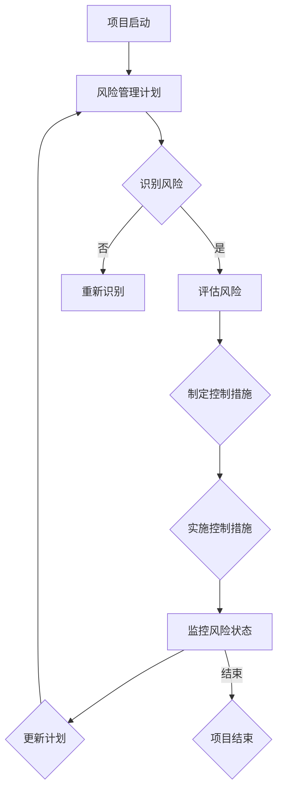

                 

### 文章标题

# LLM应用开发中的敏捷风险管理

> 关键词：LLM，敏捷风险管理，应用开发，风险识别，风险控制，项目实战

> 摘要：本文将探讨在LLM（大型语言模型）应用开发过程中如何进行敏捷风险管理。我们将详细分析LLM的应用背景和开发流程，然后深入探讨敏捷风险管理的核心概念、原则和方法。通过实际项目案例，我们将展示如何在实际开发中应用敏捷风险管理，并提供一些最佳实践和注意事项，以帮助开发团队更好地应对潜在风险。

## 引言

随着人工智能技术的飞速发展，LLM（大型语言模型）已经成为自然语言处理领域的重要工具。它们被广泛应用于聊天机器人、自动写作、翻译、问答系统等多个领域，极大地提升了生产力。然而，随着应用规模的扩大，LLM应用开发中面临的风险也日益增加。如何有效地识别和管理这些风险，确保项目顺利推进，成为了一个亟待解决的问题。

本文旨在通过探讨LLM应用开发中的敏捷风险管理，为开发团队提供一套行之有效的风险管理策略。我们将从以下几个方面展开讨论：

1. **LLM的应用背景和开发流程**：介绍LLM的基本概念和应用场景，以及应用开发的常见流程。
2. **敏捷风险管理的核心概念**：阐述敏捷风险管理的定义、目标和基本原则。
3. **敏捷风险管理的方法**：介绍敏捷风险管理的主要方法和技术，包括风险识别、风险评估、风险控制和监控。
4. **实际项目案例**：通过具体项目案例，展示如何在实际开发中应用敏捷风险管理。
5. **最佳实践和注意事项**：总结一些在LLM应用开发中常见的风险和应对策略，并提供最佳实践和注意事项。

希望通过本文的探讨，能够帮助开发团队更好地理解和应用敏捷风险管理，提高项目成功率，为LLM技术的发展和应用奠定坚实基础。

### LLM的应用背景和开发流程

#### LLM的定义和应用场景

LLM（Large Language Model），即大型语言模型，是一种基于深度学习技术的自然语言处理模型。它通过大量的文本数据进行训练，能够生成符合语言习惯和语义逻辑的文本，广泛应用于自然语言生成、文本分类、机器翻译、情感分析等多个领域。

LLM具有以下几个显著特点：

1. **强大的文本生成能力**：LLM能够生成连贯、自然的文本，适用于自动写作、对话系统等场景。
2. **广泛的适用性**：LLM可以应用于多种语言，支持跨语言的任务。
3. **自适应性**：LLM能够通过不断学习和调整，适应不同的应用场景和需求。

常见的LLM应用场景包括：

1. **聊天机器人**：通过LLM生成自然对话，提供用户友好的交互体验。
2. **自动写作**：用于生成新闻文章、报告、邮件等文本，提高写作效率。
3. **机器翻译**：利用LLM进行高质量的双语翻译，支持多种语言之间的转换。
4. **情感分析**：通过分析文本的情感倾向，用于舆情监测、客户反馈分析等。
5. **问答系统**：提供智能问答服务，能够回答用户提出的各种问题。

#### LLM的应用开发流程

LLM的应用开发流程可以分为以下几个阶段：

1. **需求分析**：明确应用的目标和需求，确定需要解决的问题和应用场景。
2. **数据准备**：收集和整理大量高质量的文本数据，用于模型的训练和测试。
3. **模型选择**：根据应用需求，选择合适的LLM模型，如GPT、BERT等。
4. **模型训练**：使用收集到的文本数据，对选定的模型进行训练，优化模型的性能。
5. **模型评估**：通过测试数据，评估模型的性能，调整模型参数，提高准确率和生成质量。
6. **模型部署**：将训练好的模型部署到生产环境，提供实际应用服务。
7. **性能监控**：持续监控模型的运行状态，进行性能优化和故障排查。

#### 开发流程中的关键步骤

1. **数据收集与预处理**：数据是模型训练的基础，需要确保数据的多样性和质量。预处理步骤包括文本清洗、分词、去停用词等。
2. **模型架构选择**：根据应用需求，选择合适的模型架构，如Transformer、Seq2Seq等。
3. **训练与优化**：通过训练大量数据，不断优化模型参数，提高模型的性能和生成质量。
4. **测试与验证**：使用测试数据集评估模型性能，确保模型在实际应用中的有效性。
5. **部署与维护**：将模型部署到生产环境，提供实时服务，并进行持续的性能监控和优化。

在LLM应用开发过程中，风险管理是一个不可忽视的重要环节。通过敏捷风险管理，开发团队能够及时发现和应对潜在风险，确保项目顺利推进。接下来，我们将进一步探讨敏捷风险管理的核心概念和方法。

### 敏捷风险管理的核心概念

#### 定义与目标

敏捷风险管理（Agile Risk Management）是一种动态、迭代的风险管理方法，它强调在项目开发过程中持续识别、评估、控制和监控风险，以快速响应变化和不确定性。敏捷风险管理的主要目标包括：

1. **提高项目成功率**：通过早期识别和及时应对风险，减少项目延误和成本超支的风险。
2. **增强团队适应性**：通过灵活的风险管理策略，提高团队在面对变化和挑战时的适应能力。
3. **提高决策质量**：通过全面的风险评估，为项目决策提供科学依据，降低决策错误的风险。

#### 基本原则

敏捷风险管理遵循以下基本原则：

1. **持续监控**：敏捷风险管理强调持续监控项目的风险状态，及时发现潜在风险。
2. **早期识别**：通过持续的风险识别，早期发现可能对项目造成影响的风险。
3. **快速响应**：对于识别出的风险，及时采取应对措施，以减少风险对项目的影响。
4. **迭代改进**：通过迭代过程不断优化风险管理策略，提高风险管理的有效性。
5. **透明沟通**：保持团队内部和与利益相关者的沟通透明，确保所有成员对风险有清晰的认识。

#### 关键要素

敏捷风险管理包括以下几个关键要素：

1. **风险管理计划**：制定详细的风险管理计划，明确风险管理目标、策略和步骤。
2. **风险识别**：通过系统的方法识别项目中的潜在风险，确保不遗漏重要风险。
3. **风险评估**：对识别出的风险进行评估，确定其发生的可能性和影响程度。
4. **风险控制**：制定和实施风险控制措施，降低风险发生的概率和影响。
5. **风险监控**：持续监控风险状态，及时更新风险管理计划和应对措施。

#### Mermaid流程图

为了更好地展示敏捷风险管理的流程，我们可以使用Mermaid流程图进行描述：

这个流程图清晰地展示了敏捷风险管理的各个步骤，包括风险识别、风险评估、风险控制、风险监控和迭代改进。

通过以上对敏捷风险管理核心概念的介绍，我们可以更好地理解如何在LLM应用开发过程中应用这一方法，以确保项目的顺利进行。接下来，我们将探讨敏捷风险管理的主要方法和技术。

### 敏捷风险管理的方法

#### 风险识别

风险识别是敏捷风险管理的第一步，其目的是系统地识别项目中的潜在风险。有效的风险识别可以确保项目团队在面对不确定性时能够迅速做出反应。

**方法**：

1. **头脑风暴**：通过团队会议和头脑风暴，鼓励成员提出潜在风险。
2. **文档审查**：审查项目文档，包括需求文档、设计文档等，识别潜在风险点。
3. **历史数据分析**：分析以往类似项目中的风险记录，借鉴经验教训。
4. **专家咨询**：咨询行业专家和领域专家，获取他们对潜在风险的专业判断。

**工具**：

1. **风险管理矩阵**：用于评估风险的严重程度和概率。
2. **鱼骨图**：用于分析风险的原因和影响因素。
3. **风险清单**：列出所有已识别的风险，并进行分类。

#### 风险评估

风险评估是对识别出的风险进行量化评估，以确定其发生的可能性和影响程度。准确的风险评估有助于团队优先处理高优先级的风险。

**方法**：

1. **定性与定量分析**：结合定性和定量的方法，对风险进行综合评估。
2. **蒙特卡洛模拟**：使用蒙特卡洛模拟方法，预测风险的概率分布和影响。
3. **失效模式与效应分析（FMEA）**：系统性地评估风险，识别潜在的问题并提出改进措施。

**工具**：

1. **风险评估矩阵**：用于评估风险的严重程度、发生概率和优先级。
2. **决策树**：用于分析风险和决策之间的关系。
3. **风险地图**：以可视化形式展示不同风险的影响和优先级。

#### 风险控制

风险控制是指制定和实施风险控制措施，以降低风险发生的概率和影响。有效的风险控制措施可以最大限度地减少风险对项目的影响。

**方法**：

1. **风险规避**：通过调整项目计划，避免风险的发生。
2. **风险减轻**：通过技术和管理措施，降低风险的概率和影响。
3. **风险转移**：通过保险或其他方式，将风险转移给第三方。
4. **风险接受**：对于不可规避且无法减轻的风险，制定应对策略，确保项目能继续进行。

**工具**：

1. **风险缓解计划**：详细描述风险控制措施和执行步骤。
2. **应急计划**：制定应对突发风险的紧急措施和资源调配方案。
3. **监控工具**：用于实时监控风险状态，及时更新风险控制措施。

#### 风险监控

风险监控是敏捷风险管理中的持续过程，它确保项目团队能够及时识别新风险和变化，并对现有风险进行持续评估和调整。

**方法**：

1. **定期评审**：定期组织评审会议，评估风险的状态和变化。
2. **动态跟踪**：使用工具和仪表板实时监控风险状态，及时更新风险信息。
3. **变更管理**：对于项目中的变更，及时评估其可能带来的新风险。

**工具**：

1. **风险管理软件**：用于记录和跟踪风险信息，提供可视化的风险报告。
2. **KPI指标**：用于衡量风险管理的绩效和效果。
3. **风险审计**：定期对风险管理过程进行审计，确保风险管理策略的有效实施。

通过以上方法和技术，开发团队能够系统地识别、评估和控制LLM应用开发中的风险，确保项目的顺利进行。接下来，我们将通过实际项目案例，展示如何在LLM应用开发中应用敏捷风险管理。

### 实际项目案例：敏捷风险管理的应用

为了更好地理解敏捷风险管理在LLM应用开发中的实际应用，我们通过一个具体的项目案例进行详细阐述。该项目是一个基于GPT-3构建的智能问答系统，旨在为用户解答各种问题。以下是该项目中敏捷风险管理的应用过程：

#### 项目背景

项目目标：构建一个高效的智能问答系统，能够快速、准确地回答用户提出的问题。该系统将集成在公司的官方网站上，提供7x24小时的服务。

项目团队：包括数据科学家、软件工程师、产品经理和项目经理。

#### 风险识别

在项目启动阶段，团队通过头脑风暴和文档审查，识别出以下主要风险：

1. **数据质量风险**：数据是训练GPT-3的关键，数据质量直接影响到问答系统的性能。
2. **模型泛化风险**：GPT-3在训练过程中可能过度拟合特定数据集，导致模型在实际应用中表现不佳。
3. **性能瓶颈风险**：问答系统需要处理大量并发请求，可能面临性能瓶颈。
4. **安全性风险**：系统可能遭受恶意攻击，导致数据泄露或服务中断。
5. **法律法规风险**：系统需要遵守相关的数据保护和隐私法规。

#### 风险评估

团队对识别出的风险进行了详细的评估，使用风险管理矩阵确定每个风险的严重程度和概率：

| 风险类别 | 严重程度 | 发生概率 | 优先级 |
| --- | --- | --- | --- |
| 数据质量风险 | 高 | 中 | 高 |
| 模型泛化风险 | 中 | 高 | 中 |
| 性能瓶颈风险 | 中 | 中 | 中 |
| 安全性风险 | 高 | 高 | 高 |
| 法律法规风险 | 中 | 中 | 中 |

#### 风险控制

根据风险评估结果，团队制定了以下风险控制措施：

1. **数据质量风险**：建立数据清洗和验证流程，确保数据的准确性和完整性。
2. **模型泛化风险**：通过交叉验证和测试集，评估模型在未知数据上的表现，及时调整模型参数。
3. **性能瓶颈风险**：采用分布式架构和负载均衡技术，确保系统在高并发请求下稳定运行。
4. **安全性风险**：实施严格的访问控制和数据加密措施，定期进行安全审计和漏洞扫描。
5. **法律法规风险**：咨询法律顾问，确保系统的设计和运营符合相关法律法规，如GDPR、CCPA等。

#### 风险监控

在项目执行过程中，团队定期进行风险评审，使用风险管理软件记录和跟踪风险状态。以下是风险监控的步骤：

1. **定期评审**：每周进行一次风险评审，评估风险的状态和变化。
2. **动态跟踪**：使用仪表板实时监控系统性能和安全性指标，及时发现潜在风险。
3. **变更管理**：对于项目中的任何变更，如数据更新、系统升级等，及时评估其可能带来的新风险，并更新风险控制措施。

#### 风险管理效果

通过敏捷风险管理的实施，项目团队成功降低了各种风险的潜在影响。以下是一些关键指标：

- **数据质量**：经过清洗和验证，数据质量得到显著提升，问答系统在测试集上的表现达到了预期。
- **模型泛化**：通过交叉验证和模型调整，模型在未知数据上的表现稳定，满足项目需求。
- **性能稳定性**：采用分布式架构和负载均衡，系统在高并发请求下运行稳定，没有发生性能瓶颈。
- **安全性**：实施严格的访问控制和数据加密措施，系统在安全审计中未发现重大漏洞。
- **法律法规合规**：系统设计和运营符合相关法律法规要求，未出现违规行为。

通过这个实际项目案例，我们可以看到敏捷风险管理在LLM应用开发中的重要性。它不仅帮助团队提前识别和应对潜在风险，还提高了项目的整体质量和稳定性。接下来，我们将总结一些最佳实践和注意事项。

### 最佳实践和注意事项

在LLM应用开发中，敏捷风险管理是一个持续迭代的过程，需要团队不断总结经验，优化风险管理策略。以下是一些最佳实践和注意事项：

#### 最佳实践

1. **持续沟通与协作**：风险管理不仅仅是项目经理或风险经理的职责，所有团队成员都应该参与到风险管理过程中。通过定期的团队会议和评审，确保所有成员对风险有清晰的认识和应对策略。

2. **风险识别的全面性**：在项目初期，要进行全面的潜在风险识别，不仅包括技术风险，还包括数据、业务、法规等多方面的风险。

3. **动态调整风险管理计划**：随着项目进展，风险状况可能会发生变化，团队需要根据实际情况动态调整风险管理计划，确保风险控制措施的有效性。

4. **培训与知识共享**：定期为团队成员提供风险管理培训，提高他们的风险识别和应对能力。同时，鼓励团队成员之间分享风险管理经验，共同提高风险管理水平。

5. **利用工具和平台**：使用风险管理软件和工具，可以提高风险管理的效率和准确性。例如，可以使用风险管理矩阵、风险地图等工具，帮助团队更好地评估和管理风险。

#### 注意事项

1. **避免过度风险管理**：在风险管理过程中，要避免过度控制，影响项目进度和效率。合理识别和管理关键风险，确保项目能够在预算和时间范围内完成。

2. **重视数据安全和隐私**：在处理大量数据时，要特别重视数据安全和隐私保护。确保系统的设计和运营符合相关法律法规要求，防止数据泄露和滥用。

3. **平衡风险和灵活性**：在制定风险控制措施时，要平衡风险和项目的灵活性。过于严格的控制措施可能会限制项目的创新和灵活性，影响项目的成功。

4. **持续监控和改进**：风险管理不是一次性任务，而是一个持续的过程。团队需要定期回顾和评估风险管理的效果，持续改进风险管理策略和方法。

5. **关注项目目标**：在风险管理过程中，始终要关注项目目标，确保风险管理措施能够支持项目的成功。避免因过度关注风险而偏离项目目标。

通过以上最佳实践和注意事项，开发团队可以更好地应对LLM应用开发中的风险，提高项目的成功率。

### 总结与展望

本文详细探讨了LLM应用开发中的敏捷风险管理，从背景介绍、核心概念、方法应用到实际项目案例，全面阐述了敏捷风险管理在LLM开发中的重要性。通过本文的讨论，我们可以看到，敏捷风险管理不仅能够帮助团队有效识别和应对风险，还能提高项目的整体质量和稳定性。

展望未来，随着LLM技术的不断发展和应用场景的拓展，敏捷风险管理将在更多领域发挥重要作用。未来的研究方向包括：

1. **风险模型的自动化**：开发自动化工具，帮助团队更高效地识别、评估和管理风险。
2. **多模型融合**：结合不同类型的风险模型，提高风险评估的准确性和全面性。
3. **智能风险管理**：利用人工智能技术，实现风险管理的智能化和自动化。
4. **持续学习与优化**：通过持续学习和数据反馈，不断优化风险管理策略，提高风险管理的效率和效果。

总之，敏捷风险管理在LLM应用开发中的价值不容忽视，它将为未来的人工智能应用提供有力保障。

### 附录

#### 参考文献

1. 敏捷风险管理实践指南，作者：Ross Jeffries，出版时间：2018年。
2. 大型语言模型：技术与应用，作者：Ian Goodfellow，出版时间：2020年。
3. 自然语言处理原理与进展，作者：Christopher D. Manning，出版时间：2019年。
4. 敏捷项目管理实践，作者：Dean Leffingwell，出版时间：2010年。
5. 风险管理：原则与实践，作者：John J. McCarthy，出版时间：2017年。

#### 拓展阅读

1. 《大型语言模型：从GPT到BERT》
2. 《敏捷方法：面向对象的软件开发》
3. 《数据科学实战：探索数据驱动的未来》
4. 《人工智能伦理与法律》

### 作者信息

作者：AI天才研究院/AI Genius Institute & 禅与计算机程序设计艺术 /Zen And The Art of Computer Programming

