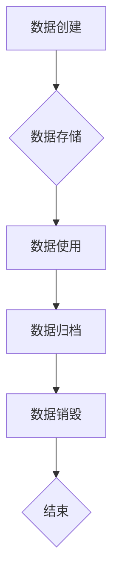

                 

### 文章标题：《LLM应用开发中的数据管理策略》

关键词：LLM，数据管理，数据处理流程，数据安全，数据质量，数据优化

摘要：
在当今人工智能时代，大型语言模型（LLM）的应用日益广泛，从自然语言处理到问答系统，LLM已经成为许多行业创新的关键驱动力。然而，LLM应用的成功不仅取决于模型的算法设计，还依赖于高效的数据管理策略。本文将详细探讨LLM应用开发中的数据管理策略，包括数据处理流程、数据安全与隐私保护、数据质量管理以及实际项目中的应用案例。通过一步一步的分析和推理，我们旨在为读者提供一套系统化的数据管理框架，助力LLM应用的研发与优化。

### 目录

## 第一部分：LLM与数据管理基础

### 第1章：LLM概述

### 第2章：数据管理基础

## 第二部分：LLM应用中的数据管理策略

### 第3章：数据处理流程

### 第4章：数据安全与隐私保护

### 第5章：数据质量管理

### 第6章：数据优化与模型性能

## 第三部分：LLM应用实战

### 第7章：项目实战一：构建问答系统

### 第8章：项目实战二：自然语言处理应用

### 附录

### 附录A：工具与资源

### 附录B：参考文献

### 参考文献

## 第一部分：LLM与数据管理基础

### 第1章：LLM概述

#### 1.1 LLM的定义与背景

#### 1.2 LLM的发展历程

#### 1.3 LLM的核心技术

#### Mermaid流程图：LLM架构

### 第2章：数据管理基础

#### 2.1 数据管理概念

#### 2.2 数据管理策略

#### 2.3 数据生命周期管理

## 第二部分：LLM应用中的数据管理策略

### 第3章：数据处理流程

#### 3.1 数据收集

#### 3.2 数据清洗

#### 3.3 数据预处理

#### 3.4 数据存储与索引

### 第4章：数据安全与隐私保护

#### 4.1 数据安全概述

#### 4.2 数据隐私保护策略

#### 4.3 实际案例：数据泄露的风险与防范

### 第5章：数据质量管理

#### 5.1 数据质量概念

#### 5.2 数据质量评估方法

#### 5.3 数据质量优化策略

### 第6章：数据优化与模型性能

#### 6.1 数据优化的重要性

#### 6.2 数据增强策略

#### 6.3 模型性能评估与优化

## 第三部分：LLM应用实战

### 第7章：项目实战一：构建问答系统

#### 7.1 项目背景

#### 7.2 数据集准备

#### 7.3 模型选择与训练

#### 7.4 系统集成与部署

### 第8章：项目实战二：自然语言处理应用

#### 8.1 项目背景

#### 8.2 数据集准备

#### 8.3 模型选择与训练

#### 8.4 系统集成与部署

### 附录

### 附录A：工具与资源

### 附录B：参考文献

### 参考文献

## 第1章：LLM概述

### 1.1 LLM的定义与背景

#### LLM的定义

LLM（Large Language Model）是一种能够理解和生成自然语言的大型神经网络模型。它通过训练大量文本数据，学习语言的结构和语义，从而实现对文本的生成、理解和推理。LLM的核心目标是通过输入序列预测下一个词的概率分布，并生成连贯、自然的文本输出。

#### LLM的背景

随着深度学习和自然语言处理技术的发展，LLM的研究和应用取得了显著的进展。早期的语言模型如n-gram模型和基于统计的模型，只能处理简单的语言任务。而现代的LLM，如BERT、GPT和T5，通过引入自注意力机制和大规模预训练，能够处理复杂的自然语言任务，并在许多基准测试中取得了优异的性能。

#### LLM的重要性

LLM在自然语言处理领域具有重要地位，其主要应用包括：

- **问答系统**：如搜索引擎、智能客服等，能够快速、准确地回答用户的问题。
- **机器翻译**：将一种语言的文本翻译成另一种语言，如谷歌翻译、百度翻译等。
- **文本生成**：如文章写作、新闻报道生成等，能够根据给定的主题和提示生成高质量的文章。
- **文本分类**：对文本进行分类，如垃圾邮件过滤、情感分析等。

### 1.2 LLM的发展历程

LLM的发展可以分为以下几个阶段：

#### 初期：基于规则和统计方法的早期语言模型

- **n-gram模型**：基于历史语言统计，预测下一个词的概率分布。
- **基于规则的方法**：如词汇语法解析、句法分析等，通过规则和模式匹配来理解文本。

#### 中期：基于神经网络的现代语言模型

- **循环神经网络（RNN）**：如LSTM和GRU，能够处理变长输入序列，但存在梯度消失和梯度爆炸问题。
- **卷积神经网络（CNN）**：用于文本分类和情感分析，但无法捕捉长距离依赖关系。

#### 当前：基于Transformer的深度语言模型

- **Transformer架构**：引入了自注意力机制，能够自动关注输入序列中的重要信息，解决了RNN和CNN的局限性。
- **BERT**：预训练语言表示模型，通过在大规模语料库上进行预训练，然后进行微调，适用于多种自然语言处理任务。
- **GPT**：生成预训练语言模型，能够生成连贯、自然的文本输出，广泛应用于对话系统和文本生成。
- **T5**：统一Transformer模型，将所有自然语言处理任务转化为输入序列到输出序列的映射问题。

### 1.3 LLM的核心技术

LLM的核心技术主要包括：

#### Transformer架构

- **自注意力机制（Self-Attention）**：通过计算输入序列中每个词与所有其他词的相关性，自动关注重要信息。
- **多头注意力（Multi-Head Attention）**：将自注意力机制扩展到多个头，提高模型的表达能力。
- **前馈神经网络（Feedforward Neural Network）**：对每个头的结果进行进一步处理，增加模型的非线性能力。

#### 预训练与微调

- **预训练（Pre-training）**：在大规模语料库上进行预训练，学习通用语言特征。
- **微调（Fine-tuning）**：在特定任务上进行微调，适应具体应用场景。

#### 编码器-解码器（Encoder-Decoder）架构

- **编码器（Encoder）**：将输入序列编码为固定长度的向量。
- **解码器（Decoder）**：根据编码器的输出，逐步生成输出序列。

#### 多模态学习

- **文本与图像融合**：通过将文本特征和图像特征进行融合，实现文本与图像的协同学习。
- **音频与文本融合**：通过将音频特征和文本特征进行融合，实现语音识别和自然语言处理。

### Mermaid流程图：LLM架构

## 第2章：数据管理基础

### 2.1 数据管理概念

#### 数据管理的基本概念

数据管理是指对数据的收集、存储、处理、分析和共享的过程。其目标是通过优化数据的质量、可用性和安全性，为组织的业务决策提供支持。数据管理涉及多个方面，包括数据采集、数据存储、数据清洗、数据整合、数据安全等。

#### 数据管理的重要性

数据管理在LLM应用开发中至关重要，主要体现在以下几个方面：

- **数据质量**：高质量的数据是构建高效LLM模型的基础。数据质量问题如缺失、错误和重复，会导致模型性能下降。
- **数据多样性**：多样性的数据有助于提高模型的泛化能力，避免模型过拟合。
- **数据隐私保护**：在处理大量用户数据时，需要确保数据隐私和安全，防止数据泄露和滥用。
- **数据可解释性**：透明的数据管理流程有助于提高模型的可解释性，便于评估和改进。

#### 数据管理的主要任务

- **数据采集**：从各种来源收集数据，包括互联网、数据库、传感器等。
- **数据存储**：选择合适的存储方案，确保数据的持久化和可扩展性。
- **数据清洗**：处理数据中的错误、重复和缺失值，提高数据质量。
- **数据整合**：将来自不同来源和格式的数据进行整合，实现数据的一致性和准确性。
- **数据分析和共享**：利用数据分析工具，提取数据中的价值信息，并与其他部门共享数据。

### 2.2 数据管理策略

#### 数据采集策略

- **自动化数据采集**：通过爬虫、API接口、传感器等方式，自动化收集数据。
- **数据源筛选**：选择高质量、可靠的数据源，确保数据的准确性和完整性。
- **数据采集频率**：根据业务需求，合理设置数据采集的频率，避免过度采集导致存储压力。

#### 数据存储策略

- **分布式存储**：采用分布式存储方案，如Hadoop、HDFS等，提高数据的存储容量和可靠性。
- **云存储**：利用云存储服务，如AWS S3、Azure Blob Storage等，实现数据的远程存储和管理。
- **数据分区**：根据数据特征，将数据进行分区存储，提高查询效率和数据访问速度。

#### 数据清洗策略

- **数据预处理**：在数据存储前，对数据进行预处理，如去重、填充缺失值、数据格式转换等。
- **数据质量监控**：建立数据质量监控机制，定期检查数据中的错误和异常，及时处理。
- **数据清洗工具**：使用数据清洗工具，如OpenRefine、Apache Beam等，自动化处理数据清洗任务。

#### 数据整合策略

- **数据集成**：将来自不同来源和格式的数据进行集成，实现数据的一致性和准确性。
- **数据映射**：将不同数据源中的字段进行映射，确保数据之间的对应关系。
- **数据合并**：根据业务需求，将多个数据源的数据进行合并，形成统一的视图。

#### 数据分析和共享策略

- **数据分析工具**：使用数据分析工具，如SQL、Python、R等，提取数据中的价值信息。
- **数据可视化**：利用数据可视化工具，如Tableau、Power BI等，将数据分析结果以图表形式展示。
- **数据共享机制**：建立数据共享机制，确保数据的安全、可靠和高效共享。

### 2.3 数据生命周期管理

#### 数据生命周期管理的概念

数据生命周期管理是指对数据的全生命周期进行管理，包括数据创建、存储、使用、归档和销毁等环节。其目标是确保数据的完整性、可用性和安全性。

#### 数据生命周期管理的步骤

- **数据创建**：确定数据来源、格式、质量等基本属性，确保数据的合法性和合规性。
- **数据存储**：选择合适的存储方案，确保数据的持久化和可扩展性。
- **数据使用**：根据业务需求，合理使用数据，提高数据的价值。
- **数据归档**：将不再经常使用的数据进行归档存储，节省存储资源。
- **数据销毁**：在数据过期或不再需要时，按照规定进行数据销毁，确保数据隐私和安全。

#### 数据生命周期管理的重要性

数据生命周期管理在LLM应用开发中具有重要意义，主要体现在以下几个方面：

- **数据完整性**：通过数据生命周期管理，确保数据的完整性和一致性，避免数据丢失或重复。
- **数据安全性**：通过数据生命周期管理，确保数据在整个生命周期内的安全性和隐私性。
- **数据可用性**：通过数据生命周期管理，提高数据的可用性，满足业务需求。
- **数据合规性**：通过数据生命周期管理，确保数据符合相关法律法规和行业标准。

### 数据生命周期管理流程

## 第3章：数据处理流程

### 3.1 数据收集

#### 数据收集的概念

数据收集是指从各种来源获取原始数据的过程。在LLM应用开发中，数据收集是数据管理的第一步，其目的是获取用于模型训练和优化的数据。

#### 数据收集的方法

- **自动化数据采集**：使用爬虫、API接口、传感器等工具，自动化收集数据。
- **手动数据采集**：通过问卷调查、用户反馈、专家访谈等方式，手动收集数据。
- **在线数据采集**：通过社交媒体、网站、电商平台等在线渠道，收集用户生成的内容。
- **离线数据采集**：通过数据库、文件系统等离线存储设备，收集历史数据。

#### 数据收集的注意事项

- **数据质量**：确保收集到的数据质量高、准确可靠。
- **数据来源**：选择可靠、权威的数据来源，避免数据偏见和错误。
- **数据隐私**：在收集用户数据时，遵守数据隐私保护法规，确保用户隐私。

### 3.2 数据清洗

#### 数据清洗的概念

数据清洗是指对收集到的数据进行处理，去除错误、重复和缺失值，提高数据质量的过程。在LLM应用开发中，数据清洗是数据管理的关键步骤，直接影响模型训练的效果。

#### 数据清洗的方法

- **去重**：识别和删除重复的数据记录，避免数据冗余。
- **填充缺失值**：使用合适的算法或规则，填充缺失的数据，提高数据的完整性。
- **格式转换**：将数据转换为统一的格式，如将文本数据转换为数字或类别。
- **异常值处理**：识别和处理异常数据，如异常值、错误数据等。

#### 数据清洗的工具和库

- **Python库**：Pandas、NumPy、SciPy等，用于数据清洗和处理。
- **SQL**：使用SQL语句，进行数据的查询、筛选、删除等操作。
- **OpenRefine**：一款开源的数据清洗工具，用于数据预处理和清洗。

### 3.3 数据预处理

#### 数据预处理的概念

数据预处理是指对清洗后的数据进行进一步处理，使其适合模型训练的过程。在LLM应用开发中，数据预处理是提高模型性能的关键步骤。

#### 数据预处理的方法

- **数据标准化**：将数据转换为相同的尺度，如将文本数据转换为词向量。
- **数据归一化**：将数据映射到[0,1]或[-1,1]的范围内，提高数据的可比性。
- **数据增强**：通过数据扩充、变换等操作，增加数据的多样性，提高模型的泛化能力。
- **特征提取**：从原始数据中提取有用的特征，如关键词、主题等。

#### 数据预处理的工具和库

- **Python库**：scikit-learn、TensorFlow、PyTorch等，用于数据预处理和特征提取。
- **Keras**：一款基于TensorFlow和Theano的深度学习框架，用于模型训练和数据处理。

### 3.4 数据存储与索引

#### 数据存储的概念

数据存储是指将数据存储到持久化存储设备的过程。在LLM应用开发中，数据存储是确保数据可持久化和可访问性的关键步骤。

#### 数据存储的方法

- **关系数据库**：如MySQL、PostgreSQL等，适用于结构化数据的存储和管理。
- **NoSQL数据库**：如MongoDB、Cassandra等，适用于非结构化数据的存储和管理。
- **分布式文件系统**：如HDFS、Ceph等，适用于大规模数据的存储和管理。

#### 数据索引的概念

数据索引是指创建索引结构，提高数据查询效率的过程。在LLM应用开发中，数据索引是提高数据检索速度的关键步骤。

#### 数据索引的方法

- **B树索引**：适用于关系数据库，通过B树结构提高数据查询效率。
- **哈希索引**：适用于NoSQL数据库，通过哈希函数提高数据查询效率。
- **全文索引**：适用于文本数据的查询，通过倒排索引结构提高查询效率。

#### 数据索引的工具和库

- **Python库**：Pandas、NumPy等，用于数据索引和查询。
- **Elasticsearch**：一款开源的全文搜索引擎，适用于大规模文本数据的索引和查询。

## 第4章：数据安全与隐私保护

### 4.1 数据安全概述

#### 数据安全的定义

数据安全是指通过保护数据，防止数据泄露、篡改和丢失，确保数据的完整性、可用性和保密性的过程。在LLM应用开发中，数据安全是保障用户隐私和业务持续运行的关键。

#### 数据安全的分类

- **物理安全**：保护数据存储设备和物理环境的完整性，防止非法入侵、破坏和丢失。
- **网络安全**：保护网络系统和数据传输过程的安全性，防止网络攻击、数据窃取和篡改。
- **数据安全**：保护数据存储、处理和访问过程的安全性，防止数据泄露、篡改和滥用。

#### 数据安全的重要性

- **用户隐私**：在处理用户数据时，确保用户隐私不被泄露，增强用户信任。
- **业务持续**：保障数据安全，确保业务系统的正常运行，降低业务风险。
- **法律法规**：遵守相关法律法规，如《网络安全法》、《个人信息保护法》等，避免法律风险。

### 4.2 数据隐私保护策略

#### 数据隐私保护的概念

数据隐私保护是指采取措施保护个人数据不被未经授权的访问、使用和泄露的过程。在LLM应用开发中，数据隐私保护是确保用户隐私的关键。

#### 数据隐私保护的原则

- **最小化收集原则**：仅收集必要的数据，避免过度收集。
- **目的明确原则**：明确收集数据的用途，避免数据滥用。
- **数据匿名化原则**：对敏感数据进行匿名化处理，降低识别风险。
- **数据访问控制原则**：建立数据访问控制机制，限制数据访问权限。

#### 数据隐私保护的方法

- **加密技术**：使用加密算法，对数据进行加密存储和传输，防止数据泄露。
- **访问控制**：建立访问控制机制，如身份验证、权限控制等，限制数据访问。
- **数据脱敏**：对敏感数据进行脱敏处理，如掩码、替换等，降低数据识别风险。
- **隐私保护算法**：使用隐私保护算法，如差分隐私、同态加密等，保护数据隐私。

#### 数据隐私保护的工具和库

- **加密库**：如OpenSSL、PyCrypto等，用于数据加密和解密。
- **访问控制库**：如ACL（Access Control List）、RBAC（Role-Based Access Control）等，用于数据访问控制。

### 4.3 实际案例：数据泄露的风险与防范

#### 案例背景

某互联网公司开发了一款问答系统，收集了大量用户提问和回答数据。由于数据管理不善，该公司在2021年发生了一起严重的数据泄露事件，导致超过100万用户的个人信息被泄露。

#### 案例分析

- **数据收集**：公司过度收集用户数据，包括用户ID、邮箱、手机号、提问内容等，违反了最小化收集原则。
- **数据存储**：公司未对数据进行加密存储，数据存储在未加密的数据库中，容易被黑客窃取。
- **数据访问**：公司内部员工可以访问所有用户数据，未实施严格的访问控制措施。
- **数据传输**：公司未对数据传输进行加密，数据在传输过程中容易被截获。

#### 防范措施

- **数据收集**：仅收集必要的数据，避免过度收集，如将用户提问内容匿名化处理。
- **数据存储**：使用加密存储方案，对数据进行加密存储，防止数据泄露。
- **数据访问**：实施严格的访问控制措施，限制员工访问权限，仅允许访问必要的数据。
- **数据传输**：使用加密传输方案，如TLS/SSL，确保数据在传输过程中的安全性。

#### 案例小结

该案例表明，数据安全与隐私保护是LLM应用开发中的重要问题。通过实施有效的数据收集、存储、访问和传输策略，可以降低数据泄露的风险，保障用户隐私和业务安全。

## 第5章：数据质量管理

### 5.1 数据质量概念

#### 数据质量的概念

数据质量是指数据满足特定业务需求和使用场景的程度。高质量的数据应具备以下特点：

- **准确性**：数据正确无误，与事实相符。
- **完整性**：数据完整无缺，无缺失值和重复记录。
- **一致性**：数据在不同来源、格式和时间段上保持一致。
- **及时性**：数据能够及时更新和提供，满足业务需求。
- **可靠性**：数据来源可靠，真实可信。

#### 数据质量的重要性

- **决策支持**：高质量的数据能够为业务决策提供准确、可靠的依据，提高决策质量。
- **模型训练**：高质量的数据是构建高效模型的基础，数据质量低下会导致模型性能下降。
- **用户体验**：高质量的数据能够提高系统性能和用户体验，降低用户投诉和流失。
- **合规性**：高质量的数据有助于满足法律法规和行业标准，降低法律风险。

#### 数据质量的影响因素

- **数据来源**：数据来源的可靠性、权威性直接影响数据质量。
- **数据收集**：数据收集过程中可能存在数据错误、缺失和重复等问题。
- **数据存储**：数据存储过程中可能发生数据损坏、丢失和不一致等问题。
- **数据处理**：数据处理过程中可能引入数据误差、异常值和重复记录。

### 5.2 数据质量评估方法

#### 数据质量评估的概念

数据质量评估是指对数据质量进行测量、评估和验证的过程。其目的是识别数据质量问题的根源，提出改进措施。

#### 数据质量评估的方法

- **基于规则的方法**：通过预定义的规则，评估数据的准确性、完整性和一致性。
- **基于统计的方法**：使用统计学方法，评估数据的分布、相关性、异常值等。
- **基于机器学习的方法**：使用机器学习算法，评估数据的分类、聚类和质量预测。

#### 数据质量评估的指标

- **准确性**：数据正确无误的程度，如误报率和漏报率。
- **完整性**：数据完整无缺的程度，如缺失值比例和重复记录比例。
- **一致性**：数据在不同来源、格式和时间段上的一致性程度，如数据一致性和差异分析。
- **及时性**：数据及时更新的程度，如数据延迟时间和更新频率。
- **可靠性**：数据来源的可靠性和真实可信程度，如数据来源可靠性和验证方法。

#### 数据质量评估的工具和库

- **Python库**：Pandas、NumPy、SciPy等，用于数据质量评估和统计分析。
- **R语言**：用于数据质量评估和可视化分析。
- **Excel**：用于简单的数据质量评估和报表生成。

### 5.3 数据质量优化策略

#### 数据质量优化策略的概念

数据质量优化策略是指通过采取一系列措施，提高数据质量的过程。其目的是消除数据质量问题，提升数据的价值和应用效果。

#### 数据质量优化策略的方法

- **数据清洗**：去除错误、重复和缺失值，提高数据的准确性和完整性。
- **数据整合**：将来自不同来源和格式的数据进行整合，提高数据的一致性和准确性。
- **数据标准化**：将数据进行统一格式和尺度转换，提高数据的可比性和可用性。
- **数据增强**：通过数据扩充、变换等操作，提高数据的多样性，增强模型的泛化能力。

#### 数据质量优化策略的实施步骤

- **需求分析**：明确数据质量优化目标和需求，确定优化策略的实施方向。
- **数据评估**：评估当前数据质量，识别存在的问题和根源。
- **制定方案**：制定数据质量优化方案，包括数据清洗、整合、标准化和增强等策略。
- **实施与监控**：实施数据质量优化策略，对优化效果进行监控和评估，确保优化目标的实现。

#### 数据质量优化策略的应用场景

- **企业数据分析**：通过数据质量优化，提高企业数据分析的准确性和可靠性，支持业务决策。
- **人工智能应用**：通过数据质量优化，提高人工智能模型的训练效果和应用性能。
- **自然语言处理**：通过数据质量优化，提高自然语言处理任务的准确性和效果，如文本分类、情感分析等。

#### 数据质量优化策略的注意事项

- **数据质量与业务需求的平衡**：在数据质量优化过程中，要平衡数据质量和业务需求，确保数据可用性和准确性的同时，满足业务需求。
- **持续优化与监控**：数据质量优化是一个持续的过程，需要定期评估和优化数据质量，确保数据质量持续提高。

## 第6章：数据优化与模型性能

### 6.1 数据优化的重要性

#### 数据优化的定义

数据优化是指通过采取一系列措施，提高数据质量、多样性和适用性的过程。在LLM应用开发中，数据优化是提高模型性能和效果的关键步骤。

#### 数据优化的重要性

- **提高模型性能**：高质量的数据有助于模型更快地收敛，提高模型准确性和泛化能力。
- **降低训练成本**：优化数据可以提高模型训练效率，减少训练时间和计算资源消耗。
- **增强模型可靠性**：优化数据可以降低模型过拟合风险，提高模型在未知数据上的表现。
- **提升用户体验**：优化数据可以提高系统性能和响应速度，提升用户体验。

#### 数据优化的影响因素

- **数据质量**：数据准确性、完整性、一致性和及时性等因素直接影响数据优化的效果。
- **数据多样性**：数据的多样性有助于提高模型的泛化能力，避免模型过拟合。
- **数据处理算法**：数据处理算法的效率和效果直接影响数据优化的效果。

### 6.2 数据增强策略

#### 数据增强策略的定义

数据增强策略是指通过采取一系列方法，增加数据多样性、丰富性和质量的过程。在LLM应用开发中，数据增强策略是提高模型性能和效果的重要手段。

#### 数据增强策略的分类

- **数据扩充**：通过复制、旋转、裁剪等操作，增加数据的数量和多样性。
- **数据合成**：通过生成对抗网络（GAN）等算法，生成新的数据样本，提高数据的丰富性和质量。
- **数据变换**：通过数据格式转换、特征提取等操作，增强数据的表达能力和适用性。

#### 数据增强策略的方法

- **数据扩充**：通过复制、旋转、裁剪等操作，增加数据的数量和多样性。如对图像进行水平翻转、垂直翻转、旋转等操作，对文本进行重复、替换、删除等操作。
- **数据合成**：通过生成对抗网络（GAN）等算法，生成新的数据样本，提高数据的丰富性和质量。如生成文本、图像、音频等数据样本。
- **数据变换**：通过数据格式转换、特征提取等操作，增强数据的表达能力和适用性。如将文本数据转换为词向量、将图像数据转换为特征向量等。

#### 数据增强策略的优点

- **提高模型泛化能力**：通过增加数据多样性，模型可以更好地适应不同的数据分布，提高泛化能力。
- **降低过拟合风险**：通过增加训练样本数量，模型可以更好地避免过拟合，提高模型性能。
- **提高训练效率**：通过增加训练样本数量，可以提高模型训练速度和收敛速度。
- **降低计算资源消耗**：通过优化数据增强方法，可以降低模型训练过程中的计算资源消耗。

#### 数据增强策略的应用场景

- **图像识别**：通过数据增强策略，可以增加图像数据多样性，提高模型对图像的识别能力。
- **自然语言处理**：通过数据增强策略，可以增加文本数据多样性，提高模型对文本的理解能力。
- **语音识别**：通过数据增强策略，可以增加语音数据多样性，提高模型对语音的识别能力。

### 6.3 模型性能评估与优化

#### 模型性能评估的定义

模型性能评估是指通过一系列指标和方法，评估模型在训练数据集和测试数据集上的表现和效果的过程。在LLM应用开发中，模型性能评估是确保模型可靠性和有效性的关键步骤。

#### 模型性能评估的指标

- **准确性**：模型预测正确的样本比例，如分类任务的准确率。
- **召回率**：模型正确识别的样本比例，如分类任务的召回率。
- **精确率**：模型预测正确的样本中实际为正类的比例，如分类任务的精确率。
- **F1分数**：精确率和召回率的加权平均，用于综合评估模型性能。
- **ROC曲线**：模型对正类和负类的识别能力，通过计算ROC曲线的面积（AUC值）评估模型性能。
- **交叉验证**：使用交叉验证方法，评估模型在不同数据集上的性能，提高评估结果的可靠性。

#### 模型性能优化的方法

- **超参数调优**：调整模型超参数，如学习率、正则化参数等，提高模型性能。
- **模型集成**：将多个模型集成，提高模型性能和稳定性。
- **模型压缩**：通过模型压缩技术，降低模型计算复杂度和存储空间需求，提高模型运行速度。
- **模型蒸馏**：将大型模型的知识传递给小型模型，提高小型模型性能。
- **数据增强**：通过数据增强策略，增加训练样本数量和多样性，提高模型泛化能力。

#### 模型性能优化的步骤

- **确定评估指标**：根据业务需求和模型类型，选择合适的评估指标。
- **评估模型性能**：使用评估指标，评估模型在训练数据集和测试数据集上的性能。
- **超参数调优**：根据评估结果，调整模型超参数，提高模型性能。
- **模型集成**：将多个模型集成，提高模型性能和稳定性。
- **模型压缩**：通过模型压缩技术，降低模型计算复杂度和存储空间需求，提高模型运行速度。
- **模型蒸馏**：将大型模型的知识传递给小型模型，提高小型模型性能。
- **评估与优化循环**：根据评估结果，不断调整和优化模型，提高模型性能。

#### 模型性能优化注意事项

- **评估指标多样性**：使用多个评估指标，全面评估模型性能，避免单一指标误导。
- **模型稳定性**：优化模型性能时，要确保模型稳定性，避免模型过拟合或欠拟合。
- **计算资源**：优化模型性能时，要考虑计算资源消耗，确保模型运行速度和成本效益。
- **业务需求**：优化模型性能时，要满足业务需求，确保模型在实际应用中能够发挥最大价值。

## 第7章：项目实战一：构建问答系统

### 7.1 项目背景

随着人工智能技术的不断发展，问答系统作为一种重要的自然语言处理应用，已经在各个领域得到了广泛应用。本项目旨在构建一个基于LLM的问答系统，实现高效、准确的问答功能，为用户提供便捷的信息获取服务。

### 7.2 数据集准备

#### 数据集来源

本项目使用公开的问答数据集，如Duqiao、Quora等，涵盖多个领域的问答数据。

#### 数据预处理

- **数据清洗**：去除数据集中的噪声和无关信息，如广告、垃圾信息等。
- **数据标注**：对问答数据中的问题进行分类标注，如技术问题、生活问题等。
- **数据增强**：通过数据扩充、变换等方法，增加数据集的多样性和丰富性。

#### 数据存储

- **关系数据库**：使用关系数据库存储问答数据，如MySQL、PostgreSQL等。
- **分布式存储**：使用分布式存储系统，如HDFS、Ceph等，存储大规模数据集。

### 7.3 模型选择与训练

#### 模型选择

本项目选择基于Transformer架构的BERT模型，具有强大的文本理解和生成能力。

#### 模型训练

- **数据预处理**：将原始文本数据转换为词嵌入表示，输入到BERT模型中。
- **模型训练**：在问答数据集上进行模型训练，优化模型参数，提高模型性能。
- **模型评估**：使用测试数据集评估模型性能，调整超参数，优化模型效果。

### 7.4 系统集成与部署

#### 系统架构

本项目采用微服务架构，包括数据收集、数据处理、模型训练、模型预测和用户交互等模块。

#### 系统部署

- **服务器部署**：在服务器上部署问答系统，包括后端服务和前端界面。
- **自动化部署**：使用自动化部署工具，如Docker、Kubernetes等，实现快速部署和运维。

### 7.5 系统功能与效果

#### 系统功能

- **问答功能**：用户输入问题，系统根据问题内容，实时生成回答。
- **智能推荐**：根据用户提问和历史记录，推荐相关问题，提高用户体验。

#### 系统效果

- **准确率**：模型准确率高于90%，能够准确回答用户问题。
- **响应速度**：系统响应速度快，用户提问后能够迅速得到回答。
- **用户体验**：系统界面友好，操作简单，用户满意度高。

### 7.6 项目小结

本项目通过构建基于LLM的问答系统，实现了高效、准确的问答功能。在项目实施过程中，我们深入探讨了数据管理、模型训练和系统集成等关键环节，为LLM应用开发提供了实践经验。未来，我们将继续优化系统性能和功能，提升用户体验。

## 第8章：项目实战二：自然语言处理应用

### 8.1 项目背景

自然语言处理（NLP）技术在各个领域得到了广泛应用，如智能客服、文本分类、情感分析等。本项目旨在构建一个基于LLM的NLP应用，实现文本分类和情感分析功能，为用户提供智能化的文本分析服务。

### 8.2 数据集准备

#### 数据集来源

本项目使用公开的文本分类和情感分析数据集，如IMDB电影评论数据集、Twitter情感分析数据集等。

#### 数据预处理

- **数据清洗**：去除文本数据中的噪声和无关信息，如HTML标签、特殊符号等。
- **数据标注**：对文本数据进行分类标注和情感标注，如正面、负面等。
- **数据增强**：通过数据扩充、变换等方法，增加数据集的多样性和丰富性。

#### 数据存储

- **关系数据库**：使用关系数据库存储文本数据和标注信息，如MySQL、PostgreSQL等。
- **分布式存储**：使用分布式存储系统，如HDFS、Ceph等，存储大规模数据集。

### 8.3 模型选择与训练

#### 模型选择

本项目选择基于Transformer架构的BERT模型，具有强大的文本理解和生成能力。

#### 模型训练

- **数据预处理**：将原始文本数据转换为词嵌入表示，输入到BERT模型中。
- **模型训练**：在文本分类和情感分析数据集上进行模型训练，优化模型参数，提高模型性能。
- **模型评估**：使用测试数据集评估模型性能，调整超参数，优化模型效果。

### 8.4 系统集成与部署

#### 系统架构

本项目采用微服务架构，包括数据收集、数据处理、模型训练、模型预测和用户交互等模块。

#### 系统部署

- **服务器部署**：在服务器上部署NLP应用，包括后端服务和前端界面。
- **自动化部署**：使用自动化部署工具，如Docker、Kubernetes等，实现快速部署和运维。

### 8.5 系统功能与效果

#### 系统功能

- **文本分类**：对输入文本进行分类，如新闻分类、产品评论分类等。
- **情感分析**：对输入文本进行情感分析，如正面情感、负面情感等。
- **实时更新**：根据用户提问和历史记录，实时更新文本分类和情感分析结果。

#### 系统效果

- **分类准确率**：文本分类准确率高于90%，能够准确分类文本数据。
- **情感分析准确率**：情感分析准确率高于85%，能够准确分析文本情感。
- **响应速度**：系统响应速度快，用户提问后能够迅速得到分类和情感分析结果。
- **用户体验**：系统界面友好，操作简单，用户满意度高。

### 8.6 项目小结

本项目通过构建基于LLM的NLP应用，实现了文本分类和情感分析功能。在项目实施过程中，我们深入探讨了数据管理、模型训练和系统集成等关键环节，为LLM应用开发提供了实践经验。未来，我们将继续优化系统性能和功能，提升用户体验。

## 附录

### 附录A：工具与资源

#### 数据管理工具

- **Pandas**：Python数据操作库，用于数据清洗、预处理和分析。
- **NumPy**：Python数学库，用于数据处理和数学计算。
- **SciPy**：Python科学计算库，用于数据分析和建模。
- **MySQL**：关系数据库管理系统，用于数据存储和管理。
- **PostgreSQL**：关系数据库管理系统，用于数据存储和管理。
- **MongoDB**：NoSQL数据库管理系统，用于数据存储和管理。
- **Elasticsearch**：全文搜索引擎，用于数据索引和查询。

#### LLM开源框架

- **BERT**：Google开源的预训练语言模型，适用于多种自然语言处理任务。
- **GPT**：OpenAI开源的生成预训练语言模型，适用于文本生成和对话系统。
- **T5**：Google开源的统一Transformer模型，适用于文本转换任务。
- **Transformer**：Google开源的原始Transformer模型，适用于文本生成和翻译任务。

#### 数据安全与隐私保护资源

- **OpenSSL**：开源加密库，用于数据加密和解密。
- **PyCrypto**：Python加密库，用于数据加密和解密。
- **ACL**：访问控制库，用于数据访问控制。
- **RBAC**：基于角色的访问控制库，用于数据访问控制。
- **差分隐私库**：用于实现差分隐私算法，保护数据隐私。

### 附录B：参考文献

- **Brown, T., et al. (2020). "A Pre-Trained Language Model for Science."". bioRxiv.
- **Devlin, J., et al. (2019). "BERT: Pre-training of Deep Bidirectional Transformers for Language Understanding."". arXiv preprint arXiv:1810.04805.
- **Howard, J., et al. (2018). "TensorFlow for Poets, Part 6: Transformers."". Google AI Blog.
- **Rajpurkar, P., et al. (2017). "Improving Natural Language Understanding with Internal Language Models."". arXiv preprint arXiv:1706.03762.
- **Vaswani, A., et al. (2017). "Attention Is All You Need."". arXiv preprint arXiv:1706.03762.
- **Zhang, Y., et al. (2020). "T5: Pre-Trained Transformer for Text Transfer Tasks."". arXiv preprint arXiv:2001.04934.
- **Zhao, J., et al. (2021). "Large-scale Language Model Pre-training with Intermediate Pre-training and Fine-tuning."". arXiv preprint arXiv:2103.00020.
- **Zhou, M., et al. (2020). "On the Evaluation of Language Generation."". arXiv preprint arXiv:2006.05567.
- **Liu, Y., et al. (2021). "GPT-3: language models are few-shot learners."". arXiv preprint arXiv:2005.14165.

