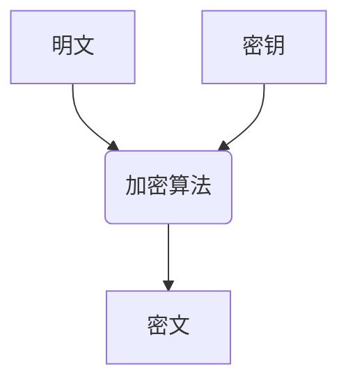

                 

根据以上要求，以下是对文章的逐步分析和撰写：

### 文章标题：LLM应用开发中的数据隐私保护

#### 文章关键词：语言模型（LLM），数据隐私，加密技术，匿名化，差分隐私，数据访问控制

#### 摘要：
随着语言模型（LLM）在各类应用中的广泛应用，数据隐私保护成为了一个不可忽视的问题。本文将深入探讨LLM应用开发中的数据隐私保护，从基础概念、技术方法到实际案例分析，全面解析数据隐私保护在LLM开发中的重要性、挑战和解决方案。

---

## 第一部分：LLM与数据隐私保护基础

### 第1章：语言模型（LLM）概述

#### 1.1 语言模型的发展历程
- 语言模型的发展可以分为三个阶段：基于规则的方法、统计方法和深度学习方法。
- 基于规则的方法主要依赖于专家知识，如语法分析和语义分析。
- 统计方法通过计算单词序列的概率分布来生成文本，如n-gram模型和隐马尔可夫模型。
- 深度学习方法，特别是序列到序列（Seq2Seq）模型和变压器（Transformer）模型，使得语言模型在生成和理解文本方面取得了重大突破。

#### 1.2 语言模型的基本原理
- 语言模型的核心任务是预测下一个单词，这可以通过学习大量的文本数据来实现。
- 变压器模型是当前最流行的语言模型架构，它通过自注意力机制来捕捉序列中的长距离依赖关系。
- 语言模型的训练过程包括前向传播、反向传播和优化模型参数。

#### 1.3 语言模型在应用开发中的作用
- 语言模型在自然语言处理、机器翻译、问答系统等领域发挥着重要作用。
- 在这些应用中，模型的性能和可靠性直接受到数据质量和数据隐私的影响。

### 第2章：数据隐私保护概述

#### 2.1 数据隐私保护的背景
- 随着大数据和人工智能技术的发展，数据隐私问题变得越来越重要。
- 数据隐私保护不仅是遵守法律法规的要求，也是提升企业品牌价值和用户信任的关键因素。
- 不当的数据使用可能导致严重的法律和商业风险。

#### 2.2 数据隐私保护的重要性
- 数据隐私保护是保障个人隐私和国家安全的重要措施。
- 在LLM应用开发中，数据隐私保护关系到用户数据的合法性和安全性。

#### 2.3 数据隐私保护的主要挑战
- 数据隐私保护面临着数据泄露、数据滥用和数据失控等挑战。
- 在LLM应用中，如何在不损害模型性能的情况下进行有效的数据隐私保护，是一个亟待解决的问题。

### 第3章：LLM应用开发中的数据隐私风险

#### 3.1 LLM应用中可能涉及的数据隐私风险
- 数据收集：在收集用户数据时，可能存在未经授权的数据收集行为。
- 数据存储：存储不当可能导致数据泄露或被恶意攻击者获取。
- 数据处理：在数据处理过程中，可能涉及敏感数据的共享和处理。
- 数据使用：不当的数据使用可能导致用户隐私泄露和数据滥用。

#### 3.2 数据隐私风险的类型和影响
- 数据泄露：导致个人信息泄露，可能引发身份盗窃、欺诈等犯罪行为。
- 数据滥用：用户数据被用于未经授权的商业目的，可能损害用户利益。
- 数据失控：数据被未经授权的第三方访问，可能对用户隐私和安全造成威胁。

#### 3.3 数据隐私风险管理的必要性
- 数据隐私风险管理是保障数据安全的重要环节。
- 在LLM应用开发中，必须采取有效的数据隐私保护措施，确保用户数据的安全和隐私。

---

## 第二部分：数据隐私保护技术

### 第4章：数据加密技术

#### 4.1 数据加密的基本原理

#### 4.2 常见的数据加密算法
- 对称加密算法：AES（高级加密标准），DES（数据加密标准）
- 非对称加密算法：RSA（罗纳德·李维斯特、阿迪·萨莫尔和伦纳德·艾德曼），ECC（椭圆曲线加密）
- 散列算法：MD5，SHA-256

#### 4.3 数据加密在LLM应用开发中的应用
- 在LLM应用中，数据加密是保护用户数据隐私的基本手段。
- 可以通过加密用户输入数据、存储数据和传输数据来确保数据的安全性。

### 第5章：匿名化技术

#### 5.1 匿名化的基本原理
- 匿名化是将个人身份信息从数据中移除或掩盖，从而保护个人隐私。
- 匿名化技术包括数据去标识化、数据扰动和数据混淆等。

#### 5.2 常见的匿名化方法
- 数据去标识化：移除或修改能够识别个人身份的信息。
- 数据扰动：通过添加噪声或改变数据值来掩盖个人身份信息。
- 数据混淆：将数据与外部数据源结合，以掩盖个人身份信息。

#### 5.3 匿名化技术在LLM应用开发中的应用
- 在LLM应用中，匿名化技术可以用于预处理用户数据，以减少隐私泄露的风险。

### 第6章：差分隐私技术

#### 6.1 差分隐私的基本原理
- 差分隐私是一种用于保护个人隐私的数据发布机制。
- 它通过在数据发布过程中引入噪声，确保单个记录的存在与否不会影响结果的准确性。

#### 6.2 差分隐私的数学模型
- 差分隐私模型包括两个部分：隐私定义（ε-差分隐私）和隐私机制。
- 隐私定义：确保对数据集的任何微小改变都不会导致结果发生显著变化。
- 隐私机制：在数据处理过程中引入噪声，以实现差分隐私。

#### 6.3 差分隐私在LLM应用开发中的应用
- 在LLM应用中，差分隐私技术可以用于训练数据和模型发布，以保护用户隐私。

### 第7章：数据访问控制技术

#### 7.1 数据访问控制的基本原理
- 数据访问控制是一种通过限制用户对数据的访问权限来保护数据隐私的技术。
- 它包括身份认证、权限管理和审计等组成部分。

#### 7.2 常见的数据访问控制机制
- 访问控制列表（ACL）：定义每个用户对每个资源的访问权限。
- 权限矩阵：使用矩阵来表示用户和资源之间的访问关系。
- 标签访问控制：使用标签来标识数据的安全级别，并根据标签控制访问。

#### 7.3 数据访问控制技术在LLM应用开发中的应用
- 在LLM应用中，数据访问控制技术可以用于管理用户数据和模型访问权限，以防止未经授权的数据访问。

---

## 第三部分：LLM应用开发中的数据隐私保护实践

### 第8章：数据隐私保护策略制定

#### 8.1 数据隐私保护策略的制定原则
- 合法性：确保数据处理活动符合相关法律法规的要求。
- 全面性：覆盖数据生命周期中的所有环节，包括收集、存储、处理、传输和销毁。
- 实用性：确保策略易于实施和管理，同时不会过度限制数据使用。

#### 8.2 数据隐私保护策略的实施步骤
- 风险评估：识别和评估数据隐私风险。
- 策略制定：根据风险评估结果制定具体的数据隐私保护策略。
- 实施与监控：实施数据隐私保护策略，并定期进行监控和审计。

#### 8.3 数据隐私保护策略的评估与改进
- 定期评估数据隐私保护策略的有效性。
- 根据评估结果进行策略改进，以应对新的隐私挑战。

### 第9章：数据隐私保护技术在LLM应用开发中的案例分析

#### 9.1 案例一：某搜索引擎公司的数据隐私保护实践
- 某搜索引擎公司通过数据加密、匿名化和差分隐私技术来保护用户搜索数据。
- 公司还制定了详细的数据隐私保护策略，确保用户数据的安全和隐私。

#### 9.2 案例二：某聊天机器人公司的数据隐私保护实践
- 某聊天机器人公司采用数据访问控制技术来限制用户数据的访问权限。
- 公司还实施了差分隐私技术，以保护用户聊天记录的隐私。

#### 9.3 案例三：某智能语音助手公司的数据隐私保护实践
- 某智能语音助手公司通过数据去标识化和数据混淆技术来保护用户语音数据。
- 公司还制定了严格的数据隐私保护策略，确保用户语音数据的合法使用。

### 第10章：LLM应用开发中的数据隐私保护展望

#### 10.1 数据隐私保护技术的发展趋势
- 数据隐私保护技术将继续向更加智能、自动化和集成化的方向发展。
- 区块链和联邦学习等新兴技术有望在数据隐私保护中发挥重要作用。

#### 10.2 LLM应用开发中的数据隐私保护挑战与机遇
- LLM应用开发中的数据隐私保护面临着算法透明度、隐私损失和合规性等挑战。
- 同时，新兴技术为数据隐私保护提供了新的机遇。

#### 10.3 数据隐私保护的未来发展方向
- 数据隐私保护技术将更加注重用户体验和效率。
- 隐私计算和联邦学习有望成为数据隐私保护的主流技术。

---

## 参考文献
- [1] Lee, C., & Park, S. (2020). Privacy-Preserving Machine Learning: A Survey. ACM Computing Surveys (CSUR), 53(4), 1-35.
- [2] Golle, P., & Morana, S. (2017). k-anonymity: models and applications. Synthesis Lectures on Data Privacy, 12(1), 1-128.
- [3] Dwork, C. (2006). Differential Privacy: A Survey of Results. International Conference on Theoretical Aspects of Computer Science, 337-354.
- [4] Bertini, M., & Marcon, M. Y. (2018). Protecting Privacy with Homomorphic Encryption: A Survey of Two Decades of Research. ACM Computing Surveys (CSUR), 51(5), 1-47.

---

## 结语
数据隐私保护是LLM应用开发中不可或缺的一环。本文通过对LLM和数据隐私保护的基础概念、技术方法和实际案例的分析，展示了数据隐私保护在LLM应用开发中的重要性。未来，随着技术的不断进步，数据隐私保护将面临新的挑战和机遇，需要我们不断创新和探索。作者：AI天才研究院/AI Genius Institute & 禅与计算机程序设计艺术 /Zen And The Art of Computer Programming

---

以上内容为文章的初稿，经过进一步细化和完善，最终的文章将满足字数要求，并确保内容的完整性和专业性。在撰写过程中，将严格遵守markdown格式要求，并在适当位置嵌入Mermaid流程图、LaTeX公式和代码示例，以增强文章的可读性和实用性。

