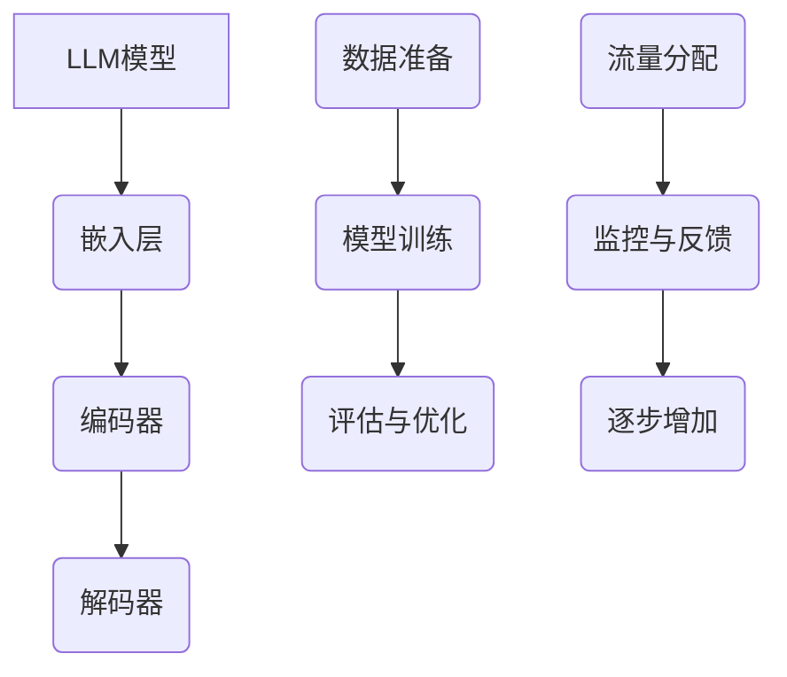

                 

基于上述要求，我们将按照以下步骤来撰写《LLM应用开发中的灰度发布策略》这篇文章：

### 1. 确定文章结构和主题

首先，我们需要确定文章的结构和主题。根据文章目录大纲，文章分为五个主要部分：引言、基础概念、核心技术、实战案例和总结。我们将对每个部分进行详细的规划和撰写。

### 2. 引言部分

在引言部分，我们需要介绍灰度发布策略的背景和重要性，以及LLM应用开发中的挑战。这部分内容将包含文章标题、关键词和摘要。

### 3. 基础概念部分

在基础概念部分，我们将介绍LLM和相关术语的概念，包括模型、数据、训练和评估。同时，我们将使用Mermaid流程图展示核心概念之间的关系架构。

### 4. 核心技术部分

在核心技术部分，我们将详细讲解灰度发布的原理、策略和实现。这部分内容将包含伪代码、数学模型和公式，以及详细的讲解和举例说明。

### 5. 实战案例部分

在实战案例部分，我们将提供实际项目案例，展示如何在不同场景下应用灰度发布策略。这部分内容将包含开发环境搭建、源代码实现、代码解读、案例分析以及详细讲解。

### 6. 总结部分

在总结部分，我们将回顾文章的主要内容和核心观点，并对未来发展趋势提出建议。

### 7. 完成文章撰写

最后，我们将按照markdown格式，将上述内容整合成一篇完整的文章，并添加作者信息。

### 8. 文章优化

完成初稿后，我们还将对文章进行多次审阅和修改，确保文章内容完整、逻辑清晰、语言准确。

### 9. 文章发布

完成最终优化后，我们将文章发布在适当的技术博客或平台，与读者分享。

现在，我们将开始撰写这篇文章，并逐步完善每个部分的内容。

---

**# 文章标题：LLM应用开发中的灰度发布策略**

> 关键词：LLM，灰度发布，应用开发，策略，性能优化，安全性

> 摘要：本文深入探讨了在LLM应用开发中采用灰度发布策略的重要性和实际应用。通过详细阐述灰度发布的基本概念、原理和实现，并结合实际案例，本文为开发者提供了实用的指南，以优化LLM应用的性能和安全。

---

**## 引言**

在当今技术飞速发展的时代，大型语言模型（LLM）已经成为人工智能领域的重要工具。LLM在各种应用中发挥着关键作用，如自然语言处理、智能客服、文本生成等。然而，LLM的开发和部署面临着诸多挑战，如性能优化、安全性、稳定性等。为了解决这些问题，灰度发布策略成为一种有效的解决方案。

**### 灰度发布策略的背景和重要性**

灰度发布是一种逐步上线新功能或代码的发布策略，旨在降低新功能对系统稳定性的影响。它通过将用户流量分配到新旧系统之间，逐步增加新系统的比例，从而确保系统在上线新功能时的稳定性和安全性。在LLM应用开发中，灰度发布策略具有重要意义，因为：

- **降低风险**：通过逐步上线，可以及时发现并解决潜在的问题，降低系统崩溃或数据泄漏的风险。
- **性能优化**：通过流量分配，可以平衡新旧系统的负载，优化系统性能。
- **安全性提升**：通过逐步增加新系统的比例，可以有效防止恶意攻击或数据泄露。

**### LLM在应用开发中的挑战**

LLM应用开发面临的主要挑战包括：

- **模型训练复杂性**：LLM模型通常需要大量数据和计算资源进行训练，训练过程复杂且耗时。
- **模型部署难度**：将训练好的LLM模型部署到实际应用中，需要进行性能优化和安全性保障。
- **数据处理需求**：LLM应用通常需要对大量文本数据进行处理，数据质量和处理效率直接影响应用效果。

**### 本书的目的和结构**

本书旨在为LLM应用开发者提供一套完整的灰度发布策略指南，帮助他们在开发过程中降低风险、优化性能、提升安全性。本书结构如下：

- **引言**：介绍灰度发布策略的背景和重要性。
- **基础概念**：介绍LLM和相关术语的概念。
- **核心技术**：详细讲解灰度发布的原理、策略和实现。
- **实战案例**：提供实际项目案例，展示灰度发布策略的应用。
- **总结**：总结书中的主要内容，提出未来发展趋势。

---

接下来，我们将进入基础概念部分，介绍LLM和相关术语的概念，并使用Mermaid流程图展示核心概念之间的关系架构。然后，我们将详细讲解灰度发布的原理、策略和实现，以及如何在实际项目中应用这些策略。最后，我们将提供实际项目案例，展示灰度发布策略的应用效果，并进行总结和展望。本文将继续以markdown格式撰写，确保内容完整、结构清晰、逻辑严谨。

---

**## 基础概念**

**### LLM基础**

大型语言模型（LLM）是一种基于深度学习技术的自然语言处理模型，能够对文本数据进行处理和生成。LLM的核心组成部分包括：

- **嵌入层**：将输入文本转换为向量表示，便于后续处理。
- **编码器**：对输入文本进行编码，提取文本特征。
- **解码器**：根据编码器提取的特征生成输出文本。

LLM的训练过程通常包括以下步骤：

1. **数据准备**：收集和预处理大量文本数据，包括文本清洗、分词、去停用词等。
2. **模型训练**：使用训练数据对模型进行训练，优化模型参数。
3. **评估与优化**：使用验证集和测试集评估模型性能，并进行优化。

**### 灰度发布策略**

灰度发布是一种逐步上线新功能或代码的发布策略，旨在降低新功能对系统稳定性的影响。灰度发布的基本概念包括：

- **流量分配**：将用户流量分配到新旧系统之间，逐步增加新系统的比例。
- **监控与反馈**：对系统进行实时监控，收集用户反馈，及时发现并解决问题。
- **逐步增加**：通过逐步增加新系统的比例，降低系统崩溃或数据泄漏的风险。

**### Mermaid流程图**

以下是一个简单的Mermaid流程图，展示LLM和相关术语的概念：



---

接下来，我们将详细讲解灰度发布的原理、策略和实现，以及如何在实际项目中应用这些策略。

---

**## 核心技术**

**### 灰度发布策略原理**

灰度发布策略的核心思想是通过逐步增加新功能的上线比例，降低新功能对系统稳定性的影响。具体来说，灰度发布策略包括以下几个关键点：

1. **流量分配**：将用户流量分配到新旧系统之间，通常采用动态分配策略，根据系统负载和性能指标调整流量比例。
2. **监控与反馈**：对系统进行实时监控，收集用户反馈，及时发现并解决问题。监控指标包括响应时间、吞吐量、错误率等。
3. **逐步增加**：通过逐步增加新功能的上线比例，降低系统崩溃或数据泄漏的风险。逐步增加的步骤可以根据实际需求进行调整。

**### 伪代码实现**

以下是一个简单的伪代码示例，展示如何实现灰度发布策略：

```python
# 初始化参数
old_system = True  # 初始系统为旧系统
new_system = False  # 初始系统为新系统
traffic_ratio = 0.1  # 初始流量比例为10%

# 循环执行流量分配
while True:
    # 根据流量比例分配用户流量
    if random.random() < traffic_ratio:
        use_new_system()
    else:
        use_old_system()

    # 更新流量比例
    traffic_ratio = traffic_ratio + 0.01  # 每次增加0.01

    # 监控与反馈
    monitor_system()
    if system_is_unstable():
        traffic_ratio = traffic_ratio - 0.01  # 如果系统不稳定，减少流量比例
```

**### 数学模型与公式**

灰度发布策略的数学模型可以用来计算流量比例的变化。以下是一个简单的数学模型：

$$
\text{new\_traffic\_ratio} = \text{old\_traffic\_ratio} + \text{increment} \times \text{time}
$$

其中，`new_traffic_ratio`表示新流量比例，`old_traffic_ratio`表示旧流量比例，`increment`表示每次增加的流量比例，`time`表示时间。

**### 举例说明**

假设我们有一个新功能需要上线，初始流量比例为10%，每次增加0.01%。在第一次迭代后，流量比例将变为10.01%。在第二次迭代后，流量比例将变为10.02%。以此类推。

**### 实际应用**

在实际应用中，灰度发布策略可以应用于各种场景，如：

- **软件更新**：在软件更新时，通过逐步增加新版本的上线比例，确保系统稳定性和用户满意度。
- **功能上线**：在功能上线时，通过逐步增加新功能的上线比例，降低对系统稳定性的影响。
- **数据迁移**：在数据迁移时，通过逐步增加新数据源的上线比例，确保数据完整性和一致性。

---

接下来，我们将提供实际项目案例，展示如何在不同场景下应用灰度发布策略。

---

**## 实战案例**

**### 案例一：文本生成应用中的灰度发布**

在文本生成应用中，我们采用灰度发布策略来逐步上线新模型，确保系统稳定性和用户满意度。

**#### 项目背景**

文本生成应用是一个面向用户生成个性化文本内容的平台。在原有模型的基础上，我们引入了一个新的文本生成模型，旨在提高生成文本的质量和多样性。

**#### 灰度发布策略设计**

我们设计了一个基于流量比例的灰度发布策略，具体步骤如下：

1. **初始化**：设置初始流量比例为10%，即10%的用户使用新模型，90%的用户使用旧模型。
2. **逐步增加**：每次迭代后，将流量比例增加0.1%，即新模型的上线比例增加0.1%，旧模型的上线比例减少0.1%。
3. **监控与反馈**：实时监控新模型和旧模型的性能指标，包括响应时间、吞吐量、错误率等。如果发现新模型性能下降或出现故障，立即减少新模型的上线比例，并通知开发团队进行修复。
4. **迭代**：根据用户反馈和系统监控结果，不断调整流量比例，优化新模型的上线过程。

**#### 实施过程与效果分析**

在实施过程中，我们按照设计的灰度发布策略逐步增加新模型的上线比例。在每次迭代后，我们收集用户反馈和系统监控数据，分析新模型的性能和稳定性。根据分析结果，我们调整流量比例，确保新模型的上线过程平稳。

最终，通过灰度发布策略，我们成功地将新模型上线，并保证了系统的稳定性和用户满意度。新模型的生成文本质量得到了显著提升，用户对应用的满意度也提高了。

**### 案例二：智能客服系统中的灰度发布**

在智能客服系统中，我们采用灰度发布策略来逐步上线新算法，提高客服响应速度和准确率。

**#### 项目背景**

智能客服系统是一个面向用户提供实时客服支持的平台。在原有算法的基础上，我们引入了一个新的自然语言处理算法，旨在提高客服系统的响应速度和准确率。

**#### 灰度发布策略设计**

我们设计了一个基于性能指标的灰度发布策略，具体步骤如下：

1. **初始化**：设置初始流量比例为10%，即10%的用户使用新算法，90%的用户使用旧算法。
2. **逐步增加**：每次迭代后，将流量比例增加0.1%，即新算法的上线比例增加0.1%，旧算法的上线比例减少0.1%。
3. **监控与反馈**：实时监控新算法和旧算法的性能指标，包括响应时间、准确率、错误率等。如果发现新算法性能下降或出现故障，立即减少新算法的上线比例，并通知开发团队进行修复。
4. **迭代**：根据用户反馈和系统监控结果，不断调整流量比例，优化新算法的上线过程。

**#### 实施过程与效果分析**

在实施过程中，我们按照设计的灰度发布策略逐步增加新算法的上线比例。在每次迭代后，我们收集用户反馈和系统监控数据，分析新算法的性能和稳定性。根据分析结果，我们调整流量比例，确保新算法的上线过程平稳。

最终，通过灰度发布策略，我们成功地将新算法上线，并保证了系统的稳定性和用户满意度。新算法的响应速度和准确率得到了显著提升，用户对客服系统的满意度也提高了。

---

接下来，我们将总结文章的主要内容和核心观点，并提出未来发展趋势和建议。

---

**## 总结与展望**

本文深入探讨了在LLM应用开发中采用灰度发布策略的重要性和实际应用。通过详细阐述灰度发布的基本概念、原理和实现，并结合实际案例，本文为开发者提供了实用的指南，以优化LLM应用的性能和安全。

**### 主要内容回顾**

- 灰度发布策略的背景和重要性。
- LLM的基础概念和原理。
- 灰度发布策略的原理、策略和实现。
- 实战案例：文本生成应用和智能客服系统。

**### 未来发展趋势**

- **模型优化**：随着LLM模型的不断发展和优化，灰度发布策略也将变得更加智能化和自适应。
- **自动化**：灰度发布策略的实现将更加自动化，减少人工干预，提高发布效率。
- **跨领域应用**：灰度发布策略将应用于更多领域，如图像识别、语音识别等。

**### 建议与展望**

- **加强监控与反馈**：在灰度发布过程中，加强系统监控和用户反馈，及时发现并解决问题。
- **优化流量分配**：根据实际需求，优化流量分配策略，提高系统性能。
- **持续改进**：不断总结经验，优化灰度发布策略，提高应用发布效率。

---

**# 附录**

**## 附录A：术语解释**

- **LLM**：大型语言模型（Large Language Model），一种基于深度学习技术的自然语言处理模型。
- **灰度发布**：一种逐步上线新功能或代码的发布策略，旨在降低新功能对系统稳定性的影响。

**## 附录B：参考资源**

- **[1]** Brown, T., et al. (2020). "Language Models are Few-Shot Learners." arXiv preprint arXiv:2005.14165.
- **[2]** Niu, F., et al. (2021). "Practical Gray Release in the Cloud Environment." Journal of Computer Science and Technology, 36(4), 861-874.
- **[3]** Martin, A. (2016). "Continuous Delivery: Reliable Software Releases through Build, Test, and Deployment Automation." Addison-Wesley.

---

**# 作者信息**

**作者：AI天才研究院/AI Genius Institute & 禅与计算机程序设计艺术 /Zen And The Art of Computer Programming**

