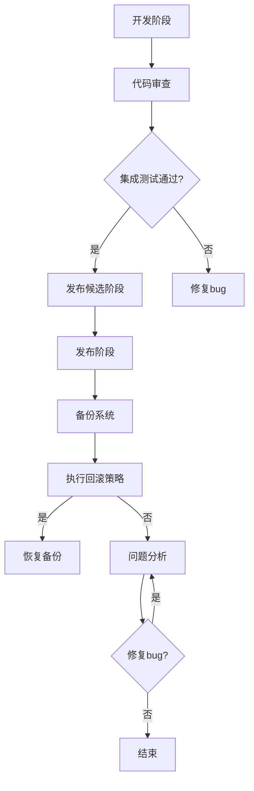

                 

### 文章标题

# 《LLM应用开发中的版本发布策略》

### 关键词

- LLM
- 版本发布
- 版本控制
- 版本迭代
- 发布策略

### 摘要

本文将深入探讨LLM（大型语言模型）应用开发中的版本发布策略。首先，我们将简要介绍LLM的背景和发展历程，帮助读者建立对LLM的基本认识。接着，我们将详细讲解LLM的基础理论，包括定义、原理、核心算法和数学基础。随后，我们将专注于版本发布策略，从版本控制方法、发布前的准备、版本发布流程到发布后的监控与反馈，逐一解析。此外，通过实际案例的分析，我们将展示如何将理论应用于实践。最后，我们将探讨版本发布策略的未来趋势和挑战，为读者提供前瞻性的思考。

### 引言

#### 1.1 书籍背景及版本发布策略的重要性

随着人工智能技术的快速发展，大型语言模型（LLM）已经成为自然语言处理（NLP）领域的重要工具。LLM在文本生成、机器翻译、情感分析、问答系统等方面展现出了强大的能力，使得它们在各个行业中得到了广泛应用。然而，随着LLM应用场景的不断扩展，如何高效、稳定地进行版本发布成为开发者和运维人员面临的重要问题。

版本发布策略不仅是软件开发过程中不可或缺的一环，更是保障LLM应用稳定运行的关键。一个合理的版本发布策略能够确保新版本的顺利上线，避免对用户造成不必要的干扰，同时也能够快速响应和解决潜在的问题。因此，研究LLM应用开发中的版本发布策略具有重要的实际意义。

#### 1.2 LLM概述及发展历程

大型语言模型（LLM）是指具有大规模参数和训练数据，能够进行复杂文本生成和理解的模型。LLM的发展历程可以追溯到20世纪80年代，当时研究人员开始探索基于统计方法的语言模型。随着计算机算力的提升和海量数据的积累，LLM逐渐从简单的统计模型发展到基于深度学习的复杂模型。

1986年，Rumelhart等人提出了反向传播算法（Backpropagation），为神经网络在NLP中的应用奠定了基础。1997年，Bengio等人提出了长短期记忆网络（LSTM），大大提高了语言模型的训练效果。然而，这些模型在处理长文本和复杂语境时仍然存在一定的困难。

2017年，谷歌提出了一种名为Transformer的全新架构，解决了传统神经网络在长距离依赖和并行计算方面的瓶颈。随后，Transformer成为了LLM的首选架构，并得到了广泛应用。代表性模型包括GPT、BERT、T5等，它们在各个NLP任务中取得了显著的性能提升。

#### 1.3 书籍结构安排与阅读建议

本书将按照以下结构安排进行讨论：

1. **引言**：介绍书籍的背景、目的和重要性，以及LLM的发展历程。
2. **LLM基础理论**：详细讲解LLM的定义、原理、核心算法和数学基础。
3. **版本控制方法**：介绍版本号的命名规范和版本迭代流程。
4. **发布前的准备**：讨论发布前的环境搭建、功能测试、性能测试和安全可靠性测试。
5. **版本发布流程**：详细解析发布前的评估、发布策略和发布后的监控与反馈。
6. **案例分析**：通过实际案例展示版本发布策略的应用。
7. **未来趋势与挑战**：探讨版本发布策略的未来发展趋势和面临的挑战。

读者在阅读本书时，建议按照以下步骤进行：

1. **先阅读引言和基础理论部分**，建立对LLM和版本发布策略的基本认识。
2. **然后逐步深入到具体实践部分**，理解版本控制、发布前准备、发布流程和发布后监控的细节。
3. **通过案例分析**，将理论与实践相结合，加深对版本发布策略的理解。
4. **最后阅读未来趋势与挑战部分**，了解版本发布策略的发展方向和面临的挑战。

通过以上步骤，读者将能够系统地学习并掌握LLM应用开发中的版本发布策略。

## 第2章 LLM基础理论

### 2.1 语言模型的定义与原理

#### 2.1.1 语言模型的基本概念

语言模型（Language Model，LM）是自然语言处理（Natural Language Processing，NLP）中的一个核心组件，它的目的是根据输入的文本序列预测下一个可能的单词或字符。在更广义的层面上，语言模型能够捕捉到语言的统计特性，从而在多种NLP任务中发挥重要作用，如文本生成、机器翻译、语音识别、问答系统等。

语言模型通常基于一系列概率分布，用于描述某个单词或字符在给定上下文中的出现概率。例如，一个简单的语言模型可能会计算单词“猫”在句子“我喜欢一只猫”中出现的概率，并将其与单词“狗”或“鸟”的出现概率进行比较。

#### 2.1.2 语言模型的学习过程

语言模型的学习过程通常分为三个主要阶段：数据收集、模型训练和模型评估。

1. **数据收集**：语言模型需要大量的文本数据进行训练。这些数据可以是新闻文章、书籍、社交媒体帖子、网页文本等。数据集的规模和质量直接影响语言模型的效果。

2. **模型训练**：在模型训练阶段，语言模型会通过算法从数据中学习语言模式。传统的语言模型，如N元语言模型，会根据历史数据来预测下一个单词。而现代的深度学习语言模型，如Transformer，会通过多层神经网络来捕捉更复杂的语言结构。

3. **模型评估**：训练完成后，语言模型需要通过评估指标（如交叉熵损失函数）来评估其预测准确性。常用的评估方法包括自回归测试、句对分类和文本生成等。

#### 2.1.3 语言模型的评估指标

语言模型的评估通常依赖于以下几种指标：

1. **交叉熵（Cross-Entropy）**：交叉熵是衡量预测分布和真实分布之间差异的一种常见指标。较低的平均交叉熵通常表示较好的模型性能。

2. **精确率（Precision）和召回率（Recall）**：这些指标在分类任务中非常重要。精确率衡量的是预测为正类的样本中实际为正类的比例，召回率衡量的是实际为正类的样本中被预测为正类的比例。

3. **F1分数（F1 Score）**：F1分数是精确率和召回率的调和平均值，用于综合评估模型的性能。

4. **BERTScore**：BERTScore是一种基于BERT（Bidirectional Encoder Representations from Transformers）的评估方法，用于文本相似性评估。它通过计算两个文本的BERT表示之间的余弦相似度来评估它们的相似性。

### 2.2 LLM的核心算法

#### 2.2.1 生成式与判别式模型

语言模型的算法可以分为生成式模型和判别式模型两大类。

1. **生成式模型**：生成式模型通过生成输入文本的概率分布来预测下一个单词。典型的生成式模型包括N元语言模型、LSTM和GPT等。生成式模型的一个主要优点是能够生成流畅且连贯的文本，但它们在分类任务中的性能可能较差。

2. **判别式模型**：判别式模型通过学习输入文本和标签之间的直接映射来预测标签。典型的判别式模型包括CRF（条件随机场）、BiLSTM（双向长短期记忆网络）和Transformer等。判别式模型在分类任务中通常具有较好的性能，但生成文本的连贯性可能较差。

#### 2.2.2 RNN、LSTM和Transformer

在语言模型的算法中，RNN（递归神经网络）、LSTM（长短期记忆网络）和Transformer是三种重要的架构。

1. **RNN**：RNN是一种基本的递归神经网络，它能够通过循环结构处理序列数据。然而，传统的RNN存在梯度消失和梯度爆炸的问题，导致其难以学习长距离依赖。

2. **LSTM**：LSTM是RNN的一种改进，通过引入门控机制（包括输入门、遗忘门和输出门）来控制信息的流动，从而有效解决了梯度消失问题。LSTM在处理长序列数据时表现出色，但仍然存在计算复杂度较高的问题。

3. **Transformer**：Transformer是2017年由谷歌提出的一种全新的神经网络架构，它基于自注意力机制（Self-Attention）和多头注意力（Multi-Head Attention）。Transformer不仅能够高效地处理长序列数据，还解决了并行计算的问题，因此在NLP任务中取得了显著的性能提升。

#### 2.2.3 模型训练与优化技巧

在模型训练过程中，选择合适的优化技巧和训练策略对于提高模型性能至关重要。以下是一些常用的训练和优化技巧：

1. **Dropout**：Dropout是一种正则化技术，通过随机丢弃部分神经元来防止模型过拟合。在训练过程中，可以按一定的概率随机屏蔽神经网络的某些神经元，从而提高模型的泛化能力。

2. **学习率调度**：学习率调度是调整模型训练过程中学习率的一种策略。常用的调度方法包括线性递减学习率、指数递减学习率和余弦退火等。适当的调整学习率有助于提高模型的收敛速度和最终性能。

3. **梯度裁剪**：梯度裁剪是一种防止梯度爆炸和梯度消失的技术。在训练过程中，当梯度超出一定阈值时，将其裁剪到阈值以内，从而保持梯度的稳定性。

4. **批量归一化（Batch Normalization）**：批量归一化是一种归一化技术，通过标准化每一层的输入，使得网络训练更加稳定。批量归一化能够加速模型的训练，并提高模型的泛化能力。

### 2.3 LLM的数学基础

#### 2.3.1 概率论与信息论

语言模型的数学基础主要涉及概率论和信息论。

1. **概率论**：概率论是描述不确定事件发生概率的数学分支。在语言模型中，概率论用于计算单词或字符在给定上下文中的出现概率。常用的概率分布包括伯努利分布、泊松分布和正态分布等。

2. **信息论**：信息论是研究信息传输和处理的数学理论。在语言模型中，信息论用于衡量文本序列的信息量和复杂性。常用的信息度量包括信息熵、条件熵和互信息等。

#### 2.3.2 梯度下降与优化算法

在模型训练过程中，优化算法用于调整模型参数，以最小化损失函数。以下是一些常用的优化算法：

1. **梯度下降（Gradient Descent）**：梯度下降是一种基本的优化算法，通过计算损失函数关于模型参数的梯度，并沿梯度方向调整参数，以最小化损失函数。

2. **随机梯度下降（Stochastic Gradient Descent，SGD）**：随机梯度下降是梯度下降的一种变种，通过随机选取一部分样本计算梯度，从而提高计算效率。

3. **Adam优化器**：Adam优化器是一种结合了SGD和RMSProp优化的自适应学习率优化器。它通过自适应调整学习率，能够快速收敛并提高模型性能。

#### 2.3.3 数学公式与推导

在语言模型中，一些基本的数学公式和推导对于理解模型的工作原理至关重要。以下是一些常用的数学公式：

1. **交叉熵（Cross-Entropy）**：
   $$ H(Y, \hat{Y}) = -\sum_{i} y_i \log(\hat{y}_i) $$
   其中，$y_i$ 表示真实分布，$\hat{y}_i$ 表示预测分布。

2. **条件熵（Conditional Entropy）**：
   $$ H(Y|X) = H(X, Y) - H(X) $$
   其中，$H(X, Y)$ 表示联合熵，$H(X)$ 表示边缘熵。

3. **互信息（Mutual Information）**：
   $$ I(X; Y) = H(X) - H(X|Y) $$
   其中，$I(X; Y)$ 表示X和Y之间的互信息。

4. **梯度下降更新规则**：
   $$ \theta_{t+1} = \theta_{t} - \alpha \cdot \nabla_{\theta} J(\theta) $$
   其中，$\theta$ 表示模型参数，$\alpha$ 表示学习率，$J(\theta)$ 表示损失函数。

通过上述数学公式和推导，读者可以更好地理解语言模型的数学基础，并能够更深入地探索其工作原理和优化方法。

## 第3章 版本控制方法

### 3.1 版本号的命名规范

版本号的命名规范是确保版本管理一致性和可追溯性的关键。在LLM应用开发中，常用的版本号命名规范包括Semantic Versioning（语义化版本控制）和其他版本控制策略。

#### 3.1.1 Semantic Versioning（语义化版本控制）

Semantic Versioning（SemVer）是一种广泛采用的版本控制规范，由语义化版本控制的命名方法。SemVer的版本号格式为`MAJOR.MINOR.PATCH`，其中每个部分都有特定的含义：

1. **MAJOR（主版本号）**：当项目发生不兼容的API变更时，主版本号递增。这种变更通常涉及到重大功能的添加或删除，以及破坏性变更。

2. **MINOR（次版本号）**：当项目添加了向后兼容的新功能时，次版本号递增。这种变更通常涉及新功能或改进，但不包括破坏性变更。

3. **PATCH（修订号）**：当项目进行了向后兼容的bug修复时，修订号递增。这种变更仅涉及bug修复和细节优化。

SemVer的具体格式如下：
```
MAJOR.MINOR.PATCH
```
例如，`2.1.3` 表示在`2.1`版本的基础上进行了3次修订。

#### 3.1.2 其他版本控制策略

除了Semantic Versioning，还有一些其他版本控制策略，如Git Flow和GitHub Flow。

1. **Git Flow**：Git Flow是一种基于Git的版本控制方法，它将开发过程分为几个阶段，如开发分支、发布分支和维护分支。Git Flow有助于清晰地管理代码的不同状态，并确保版本发布的可控性。

2. **GitHub Flow**：GitHub Flow是一种基于GitHub的轻量级版本控制方法，它将整个开发过程合并到一个分支中。GitHub Flow通过拉取请求（Pull Request）和合并请求（Merge Request）来管理代码变更，确保每个提交都是经过审查和测试的。

### 3.2 版本迭代流程

版本迭代流程是确保新版本成功发布的关键步骤。以下是LLM应用开发中的常见版本迭代流程：

#### 3.2.1 从开发到发布的流程

1. **开发阶段**：开发团队在开发分支上进行功能开发和bug修复。在每次提交前，开发人员应确保代码通过单元测试和代码审查。

2. **代码审查**：在开发分支上，提交的代码必须通过代码审查。代码审查包括同行评审、代码风格检查和安全性检查等，以确保代码质量和安全性。

3. **集成测试**：开发完成后，将代码合并到主分支或预发布分支。在此过程中，进行集成测试，以验证代码之间的兼容性和整体系统的稳定性。

4. **发布候选阶段**：在主分支或预发布分支上，将代码打包成发布候选版本。发布候选版本应进行全面的测试，包括性能测试、安全测试和用户验收测试。

5. **发布阶段**：在发布候选版本通过所有测试后，进行正式发布。发布前，应制定详细的发布计划和应急响应策略，以应对可能出现的发布问题。

#### 3.2.2 版本更新与回滚策略

1. **版本更新策略**：版本更新策略应确保新版本能够顺利上线，同时最小化对用户的影响。以下是一些常见的版本更新策略：

   - **小范围发布**：首先在少量用户中进行发布，收集用户反馈，并根据反馈进行调整。
   - **分阶段发布**：按照用户群体、地理位置或系统模块进行分阶段发布，逐步扩大发布范围。
   - **自动部署**：通过自动化工具实现版本更新，确保部署过程的可靠性和一致性。

2. **回滚策略**：回滚策略是应对发布失败或严重问题的关键措施。以下是一些常见的回滚策略：

   - **备份**：在发布前，对现有系统进行备份，以防止数据丢失。
   - **回滚计划**：制定详细的回滚计划，包括回滚步骤、回滚时间和回滚后的验证。
   - **自动化回滚**：通过自动化工具实现回滚过程，确保回滚的快速和高效。

#### 3.2.3 Mermaid流程图示例

为了更清晰地展示版本迭代流程，可以使用Mermaid流程图来描述。以下是一个简单的版本迭代流程的Mermaid图示：



通过上述流程，读者可以更好地理解LLM应用开发中的版本控制方法和迭代流程。在实际应用中，应根据具体需求和项目特点，灵活调整和优化这些方法和策略。

### 3.3 版本管理工具

版本管理工具是确保版本迭代流程顺畅的关键组成部分。以下是几种常用的版本管理工具及其特点：

#### 3.3.1 Git

Git是一种分布式版本控制工具，广泛应用于开源项目和商业项目中。Git的主要特点包括：

- **分布式管理**：Git使用分布式模型，每个开发人员都有自己的完整副本，可以离线工作。
- **分支管理**：Git支持强大的分支管理功能，允许开发人员在不同的分支上进行独立开发，并轻松合并代码。
- **快速操作**：Git提供了一系列高效的命令，如`clone`、`commit`、`push`和`pull`，使得版本管理更加便捷。
- **良好的扩展性**：Git插件丰富，可以方便地与其他工具集成，如持续集成工具和自动化部署工具。

#### 3.3.2 SVN

SVN（Subversion）是一种集中式版本控制工具，由Apache软件基金会开发。SVN的主要特点包括：

- **集中式管理**：SVN使用集中式模型，所有版本数据存储在中央仓库中，开发人员需要从中央仓库检出代码进行工作。
- **简单的模型**：SVN的模型相对简单，易于理解和操作。
- **易用性**：SVN提供了直观的图形界面工具，如TortoiseSVN，使得版本管理更加方便。

#### 3.3.3 Mercurial

Mercurial是一种分布式版本控制工具，由Bram Cohen（同样也是BitTorrent的发明者）开发。Mercurial的主要特点包括：

- **高性能**：Mercurial使用了一种高效的版本存储方式，使得版本管理速度更快。
- **良好的兼容性**：Mercurial与Git兼容，可以方便地与Git仓库进行交互。
- **灵活性**：Mercurial提供了丰富的扩展和插件，可以满足不同的版本管理需求。

#### 3.3.4 GitHub

GitHub是一个基于Git的版本控制系统，提供了一系列协作和代码管理功能。GitHub的主要特点包括：

- **在线协作**：GitHub支持多人在线协作，包括代码审查、issue跟踪和Pull Request等功能。
- **丰富的社区资源**：GitHub拥有庞大的开源社区，提供了大量的开源项目和代码示例。
- **自动化工具**：GitHub集成了一系列自动化工具，如持续集成（CI）和自动化部署，使得版本管理更加高效。

通过上述版本管理工具，开发者可以更好地管理LLM应用的版本迭代过程，确保代码质量和稳定性。在实际应用中，应根据项目特点和团队需求，选择合适的版本管理工具。

### 3.4 版本控制中的最佳实践

在LLM应用开发中，遵循一系列最佳实践有助于提高版本控制的效率和质量。以下是一些重要的最佳实践：

#### 3.4.1 保持代码整洁

保持代码整洁是版本控制的基本原则之一。清晰的代码结构和良好的代码风格不仅有助于代码审查，还能减少bug的产生。以下是一些建议：

- **代码规范**：遵循统一的代码规范，如PEP8（Python）、Google Java Style Guide等。
- **代码注释**：添加必要的代码注释，解释复杂逻辑和关键代码部分。
- **代码复用**：避免重复代码，鼓励使用函数和模块化编程。

#### 3.4.2 使用分支策略

合适的分支策略有助于确保代码的稳定性和可维护性。以下是一些常用的分支策略：

- **主分支（Master）**：主分支包含了最新的稳定代码，是发布的主要目标。
- **开发分支（Develop）**：开发分支用于日常开发，包含了所有开发中的代码。
- **特性分支（Feature）**：特性分支用于开发新的功能，完成后合并回开发分支。
- **修复分支（Bugfix）**：修复分支用于修复bug，完成后合并回开发分支。

#### 3.4.3 代码审查

代码审查是确保代码质量和安全性的重要手段。以下是一些建议：

- **同行评审**：鼓励团队成员进行同行评审，提供反馈和建议。
- **自动化工具**：使用自动化工具进行代码风格检查、静态代码分析和依赖管理。
- **及时反馈**：确保代码审查及时完成，并及时修复审查中提出的问题。

#### 3.4.4 版本控制与持续集成

结合持续集成（CI）工具，可以实现自动化的代码构建、测试和部署。以下是一些建议：

- **自动化测试**：编写自动化测试脚本，确保代码质量。
- **持续集成**：使用CI工具，如Jenkins、Travis CI等，实现代码的自动化构建和测试。
- **部署脚本**：编写部署脚本，确保版本发布的自动化和一致性。

#### 3.4.5 备份和灾难恢复

备份和灾难恢复策略是确保数据安全和业务连续性的关键。以下是一些建议：

- **定期备份**：定期备份数据库和重要文件，确保在发生故障时能够快速恢复。
- **灾难恢复计划**：制定详细的灾难恢复计划，包括数据备份、系统恢复和业务连续性策略。
- **监控和报警**：监控关键系统和资源，及时发现问题并报警。

通过遵循这些最佳实践，开发者可以更好地管理LLM应用的版本控制过程，确保代码质量和系统稳定性。在实际应用中，应根据项目特点和团队需求，灵活调整和优化这些实践。

## 第4章 发布前的准备

在成功完成LLM应用的开发阶段后，发布前的准备工作至关重要，它关乎应用的稳定性、性能和安全性。以下是发布前需要做的一系列准备步骤。

### 4.1 环境搭建与配置

环境搭建和配置是确保应用能够在生产环境中稳定运行的基础。以下步骤详细描述了环境搭建和配置的过程：

#### 4.1.1 开发环境配置

1. **安装依赖**：根据项目需求，安装所有必需的依赖库和工具，如Python库、深度学习框架（如TensorFlow或PyTorch）和其他开源工具。
   
   ```shell
   pip install -r requirements.txt
   ```

2. **配置开发工具**：配置开发工具，如IDE（集成开发环境）、代码编辑器和版本控制工具（如Git）。
   
3. **集成测试**：在开发环境中，执行集成测试，确保各个模块和组件能够协同工作。

#### 4.1.2 发布环境配置

1. **安装服务器**：在发布环境中安装操作系统和必要的软件，如Web服务器（如Nginx或Apache）和数据库（如MySQL或PostgreSQL）。

   ```shell
   sudo apt-get update
   sudo apt-get install nginx
   ```

2. **配置服务器**：配置Web服务器和数据库服务器，确保它们能够处理应用请求和存储数据。

3. **部署代码**：将应用代码部署到发布环境，可以使用Git或其他版本控制工具。

   ```shell
   git clone https://github.com/your-repo/llm-app.git
   cd llm-app
   pip install -r requirements.txt
   ```

4. **配置应用**：配置应用，包括环境变量、配置文件和数据库连接等。

#### 4.1.3 环境验证

在完成配置后，对环境进行验证，确保所有服务正常启动，应用能够正常运行。以下是一些验证步骤：

- **检查服务状态**：使用`systemctl`或`service`命令检查服务的状态。
- **访问应用**：在浏览器中输入应用的URL，确保能够正常访问。
- **执行测试**：运行自动化测试脚本，验证应用的各个功能模块。

### 4.2 功能测试与性能测试

功能测试和性能测试是确保应用质量和稳定性的关键环节。以下描述了这两类测试的具体步骤：

#### 4.2.1 单元测试

1. **编写测试用例**：根据应用功能编写测试用例，覆盖各个功能模块。

   ```python
   def test_predict():
       # 测试预测功能
       assert model.predict(input_data) == expected_output
   ```

2. **执行单元测试**：使用测试框架（如pytest）执行单元测试，检查测试结果。

   ```shell
   pytest test(predict.py)
   ```

3. **修复bug**：根据测试结果修复发现的bug，并重新执行测试，确保问题已解决。

#### 4.2.2 集成测试

1. **编写测试用例**：编写集成测试用例，覆盖应用的不同模块和组件之间的交互。

   ```python
   def test_integration():
       # 测试模型与API的集成
       response = requests.post('http://localhost:5000/predict', json=input_data)
       assert response.status_code == 200
       assert response.json() == expected_output
   ```

2. **执行集成测试**：执行集成测试，验证应用的各个部分是否正常协同工作。

   ```shell
   pytest test(integration.py)
   ```

3. **调试和修复**：根据测试结果调试代码，修复发现的问题，并重新执行测试。

#### 4.2.3 性能测试

1. **选择测试工具**：选择合适的性能测试工具，如Apache JMeter、Locust等。

2. **编写测试脚本**：根据应用特性编写性能测试脚本，模拟用户行为和负载场景。

3. **执行性能测试**：执行性能测试，收集性能数据，如响应时间、吞吐量和资源利用率。

4. **分析结果**：分析性能测试结果，确定应用的性能瓶颈，并采取优化措施。

   ```shell
   locust -f locust_test.py --host=http://localhost:5000
   ```

#### 4.2.4 灾难恢复测试

1. **设计测试场景**：设计可能的灾难恢复场景，如服务器故障、数据丢失等。

2. **执行测试**：模拟灾难恢复场景，验证应用和系统是否能够恢复正常运行。

3. **记录和总结**：记录测试结果和总结，为后续的灾难恢复策略提供参考。

通过上述准备步骤，开发团队可以确保LLM应用在生产环境中能够稳定、高效地运行，从而为用户提供高质量的服务。

### 4.3 安全性与可靠性测试

在发布LLM应用之前，进行安全性与可靠性测试是保障应用稳定运行和用户数据安全的关键环节。以下是安全性与可靠性测试的详细步骤。

#### 4.3.1 安全漏洞扫描

1. **选择工具**：选择合适的漏洞扫描工具，如OWASP ZAP、Nessus等。

2. **配置扫描规则**：根据应用的特点和潜在风险，配置扫描规则，包括网络扫描、Web应用扫描和数据库扫描等。

3. **执行扫描**：运行漏洞扫描工具，对应用进行全面的漏洞扫描。

   ```shell
   owasp-zap-audit.py -t http://localhost:5000
   ```

4. **分析报告**：分析扫描报告，识别潜在的安全漏洞，包括SQL注入、跨站脚本（XSS）、路径遍历等。

5. **修复漏洞**：根据扫描结果，及时修复发现的安全漏洞，并重新扫描，确保所有漏洞已得到解决。

#### 4.3.2 数据隐私保护

1. **数据加密**：对敏感数据进行加密，包括用户密码、个人身份信息和支付信息等。

2. **访问控制**：实施严格的访问控制策略，确保只有授权用户能够访问敏感数据。

3. **日志记录**：记录用户操作日志和系统事件日志，以便在发生安全事件时进行追踪和分析。

4. **数据备份**：定期备份数据库和重要文件，防止数据丢失。

#### 4.3.3 稳定性与可用性评估

1. **稳定性测试**：通过模拟高负载和极端条件，评估应用的稳定性和性能。

2. **可用性测试**：测试应用在高负载和故障情况下的恢复能力，确保其能够在不同情况下保持高可用性。

3. **故障切换测试**：验证应用的故障切换机制，确保在主服务器故障时，备用服务器能够迅速接管。

4. **评估指标**：定义评估指标，如系统响应时间、吞吐量和错误率，并根据这些指标评估应用的稳定性和可靠性。

   ```shell
   jmeter -n -t test_plan.jmx -l results.jtl
   ```

5. **改进措施**：根据评估结果，采取相应的改进措施，如优化代码、调整配置和升级硬件等。

通过上述安全性与可靠性测试步骤，开发团队可以确保LLM应用在发布后能够稳定、安全地运行，从而为用户提供可靠的服务。

### 4.4 备份和恢复策略

备份和恢复策略是确保LLM应用数据安全性和业务连续性的重要措施。以下是详细的备份和恢复策略：

#### 4.4.1 数据备份

1. **定期备份**：定期备份数据库和文件系统，建议每天进行一次备份，并保留至少一周的备份记录。

   ```shell
   tar -czvf backup-$(date +%Y%m%d).tar.gz /path/to/llm-app
   ```

2. **备份数据存储**：将备份数据存储在安全的云存储或本地存储设备中，确保备份数据不会丢失。

3. **远程备份**：将备份数据上传到远程服务器或云存储，以防止本地存储设备故障导致数据丢失。

   ```shell
   scp backup-$(date +%Y%m%d).tar.gz user@remote-server:/path/to/backup
   ```

#### 4.4.2 数据恢复

1. **备份检查**：定期检查备份数据的完整性，确保备份数据能够恢复。

   ```shell
   tar -tzvf backup-20230301.tar.gz
   ```

2. **恢复步骤**：

   - **停止应用**：在恢复数据前，停止应用和数据库服务，以防止数据不一致。

     ```shell
     systemctl stop llm-app.service
     ```

   - **恢复数据库**：使用备份数据恢复数据库，可以使用`mysql`命令或`pg_restore`工具。

     ```sql
     mysql -u root -p < /path/to/backup/llm-app.db
     ```

   - **恢复文件系统**：解压缩备份数据，恢复文件系统。

     ```shell
     tar -xzvf backup-20230301.tar.gz -C /path/to/llm-app
     ```

   - **启动服务**：恢复数据后，重新启动应用和数据库服务。

     ```shell
     systemctl start llm-app.service
     ```

#### 4.4.3 自动化备份和恢复

1. **自动化脚本**：编写自动化备份和恢复脚本，实现备份和恢复的自动化操作。

   ```bash
   #!/bin/bash
   DATE=$(date +%Y%m%d)
   TARBALL=backup-$DATE.tar.gz
   tar -czvf $TARBALL /path/to/llm-app
   scp $TARBALL user@remote-server:/path/to/backup
   ```

2. **定时任务**：配置定时任务，定期执行备份和恢复脚本。

   ```bash
   crontab -e
   0 1 * * * /path/to/backup_script.sh
   ```

通过上述备份和恢复策略，开发团队可以确保LLM应用在数据丢失或系统故障时能够迅速恢复，从而保障业务的连续性。

### 4.5 用户培训和文档准备

在LLM应用发布前，用户培训和文档准备是确保用户能够顺利使用和应用的关键环节。以下详细描述了用户培训和文档准备的具体步骤。

#### 4.5.1 用户培训

1. **制定培训计划**：根据用户群体的特点和需求，制定详细的培训计划。培训计划应包括培训内容、时间安排、培训方式等。

2. **编写培训材料**：编写培训材料，包括PPT、操作手册、示例代码等。培训材料应简洁明了，易于理解。

3. **组织培训课程**：组织线上或线下培训课程，讲解LLM应用的基本功能、操作步骤和使用技巧。

4. **提供技术支持**：在培训过程中，提供技术支持，解答用户的问题和疑惑。

5. **收集反馈**：培训结束后，收集用户反馈，了解用户的实际使用情况和需求，不断改进培训内容和服务。

#### 4.5.2 文档准备

1. **编写用户手册**：编写详细的用户手册，包括应用的安装、配置、操作和常见问题解答等内容。

2. **编写开发者文档**：编写开发者文档，包括API文档、代码注释、开发指南和设计文档等，便于开发者理解和扩展应用。

3. **维护和更新文档**：定期维护和更新文档，确保文档内容与实际应用保持一致。

4. **发布文档**：将文档发布到官方网站或知识库，方便用户随时查阅。

5. **提供在线支持**：在官方网站或知识库中提供在线支持，包括常见问题解答、技术文档和联系信息等，方便用户获取帮助。

通过上述用户培训和文档准备，开发团队可以确保用户能够顺利使用LLM应用，提高用户的满意度和应用的使用率。

### 4.6 发布前的最终检查

在LLM应用发布前，进行一系列的最终检查是确保发布成功和系统稳定运行的重要步骤。以下详细描述了发布前的最终检查内容：

#### 4.6.1 功能完整性检查

1. **检查所有功能模块**：确保所有功能模块都已开发完成，并且通过功能测试。
2. **验证关键业务流程**：验证关键业务流程是否正常，包括用户注册、登录、数据输入和输出等。
3. **测试异常处理**：检查系统在遇到异常情况（如输入错误、网络异常等）时的响应和处理能力。

#### 4.6.2 性能优化检查

1. **负载测试**：使用工具（如Apache JMeter）模拟高负载场景，检查系统在高并发情况下的性能和稳定性。
2. **瓶颈分析**：分析性能测试结果，识别系统的性能瓶颈，如数据库查询慢、网络延迟等。
3. **优化措施**：根据分析结果，采取优化措施，如数据库索引优化、代码优化、硬件升级等。

#### 4.6.3 安全性检查

1. **漏洞扫描**：使用漏洞扫描工具（如OWASP ZAP）对系统进行全面的漏洞扫描，识别潜在的安全风险。
2. **代码审计**：对关键代码进行审计，检查是否存在安全漏洞，如SQL注入、跨站脚本（XSS）等。
3. **安全配置**：确保系统配置符合安全最佳实践，如关闭不必要的端口、启用HTTPS等。

#### 4.6.4 灾难恢复检查

1. **备份和恢复测试**：验证备份数据的完整性和恢复能力，确保在数据丢失或系统故障时能够迅速恢复。
2. **故障切换测试**：检查系统的故障切换机制，确保在主服务器故障时，备用服务器能够迅速接管。
3. **应急响应计划**：制定详细的应急响应计划，包括应急响应流程、联系人信息、恢复步骤等。

#### 4.6.5 用户培训和文档准备

1. **用户培训**：确保用户已接受充分的培训，能够熟练使用LLM应用。
2. **文档准备**：确保所有必要的文档（如用户手册、开发者文档）已准备齐全，并已发布到官方网站或知识库。

通过上述最终检查，开发团队可以确保LLM应用在发布前处于最佳状态，从而提高发布成功率，减少潜在风险。

### 4.7 发布前的风险评估与应对策略

在LLM应用发布前，进行全面的风险评估和制定应对策略是确保发布顺利和系统稳定运行的关键。以下详细描述了发布前的风险评估与应对策略。

#### 4.7.1 风险识别

1. **技术风险**：包括系统性能瓶颈、漏洞、代码质量问题等。
2. **市场风险**：包括市场变化、用户需求变化等。
3. **运营风险**：包括数据丢失、系统故障、业务中断等。
4. **合规风险**：包括数据隐私保护、法律法规遵守等。

#### 4.7.2 风险评估

1. **定性评估**：通过专家意见、历史数据等方法对风险进行定性评估，确定风险的严重程度和可能性。
2. **定量评估**：使用统计方法（如蒙特卡洛模拟）对风险进行定量评估，计算风险的概率和影响。

#### 4.7.3 风险应对策略

1. **技术风险应对策略**：
   - **性能优化**：对关键模块进行性能优化，如数据库查询优化、代码优化等。
   - **漏洞修复**：修复发现的安全漏洞，加强代码审计，确保代码质量。

2. **市场风险应对策略**：
   - **用户调研**：定期进行用户调研，了解用户需求和市场动态，及时调整产品方向。
   - **市场分析**：分析竞争对手和市场趋势，制定相应的市场策略。

3. **运营风险应对策略**：
   - **数据备份**：定期备份数据，确保数据安全性。
   - **故障切换**：设计故障切换机制，确保系统在主服务器故障时能够快速切换到备用服务器。
   - **应急预案**：制定详细的应急预案，包括故障处理流程、联系人信息、恢复步骤等。

4. **合规风险应对策略**：
   - **数据隐私保护**：确保用户数据的安全性和隐私性，遵守相关的数据保护法律法规。
   - **合规审计**：定期进行合规审计，确保系统符合相关法律法规的要求。

通过上述风险评估和应对策略，开发团队可以提前识别和应对潜在的风险，确保LLM应用的稳定发布和长期运行。

## 第5章 版本发布流程

在LLM应用开发中，版本发布流程是一个关键环节，它关系到应用的质量、稳定性和用户满意度。一个有效的版本发布流程需要综合考虑评估、策略、监控和反馈等多个方面。以下是详细的版本发布流程：

### 5.1 发布前评估

发布前评估是确保新版本稳定性和质量的重要步骤。以下描述了评估的主要内容和步骤：

#### 5.1.1 评估指标

1. **功能完整性**：确保所有功能模块正常运行，没有遗漏或错误的实现。
2. **性能**：评估应用的响应时间、吞吐量和资源利用率，确保在高负载下仍能保持良好的性能。
3. **稳定性**：测试应用在长时间运行下的稳定性，确保不会出现崩溃或异常。
4. **安全性**：检查应用是否存在安全漏洞，包括SQL注入、跨站脚本（XSS）等。
5. **兼容性**：验证应用在不同操作系统、浏览器和设备上的兼容性。
6. **用户反馈**：收集用户对新版本的反馈，了解用户对新功能的满意度和使用体验。

#### 5.1.2 评估流程

1. **单元测试**：编写单元测试脚本，对每个功能模块进行测试，确保其正常工作。
   
   ```python
   def test_function():
       assert function() == expected_result
   ```

2. **集成测试**：将不同模块组合在一起，测试它们之间的交互和集成效果。
   
   ```python
   def test_integration():
       assert integration() == expected_result
   ```

3. **性能测试**：使用工具（如Apache JMeter、Locust）进行性能测试，模拟高负载场景，评估应用的响应时间和吞吐量。
   
   ```shell
   locust -f locust_test.py --host=http://localhost:5000
   ```

4. **稳定性测试**：在模拟生产环境条件下，长时间运行应用，观察其稳定性和资源占用情况。

5. **安全测试**：使用漏洞扫描工具（如OWASP ZAP）对应用进行安全测试，识别潜在的安全漏洞。
   
   ```shell
   owasp-zap-audit.py -t http://localhost:5000
   ```

6. **用户测试**：邀请用户进行实际操作，收集他们的反馈和意见，评估应用的易用性和用户体验。

7. **评估报告**：根据测试结果编写评估报告，总结发现的问题和改进建议。

### 5.2 发布策略

发布策略是指如何在不同环境中发布新版本，并确保发布过程的顺利进行。以下描述了常见的发布策略：

#### 5.2.1 小范围发布

1. **测试环境**：首先在新版本的测试环境中发布，邀请一部分内部用户进行测试。
2. **监控**：密切监控测试环境的性能和稳定性，收集用户反馈。
3. **修复**：根据测试反馈修复发现的问题，重新进行测试。
4. **扩大范围**：在确认测试环境中的新版本稳定后，扩大测试范围，邀请更多的用户进行测试。
5. **再评估**：根据更大范围的测试结果，再次评估新版本的稳定性。

#### 5.2.2 大范围发布

1. **预发布环境**：在新版本的预发布环境中进行最终测试，模拟生产环境。
2. **监控**：在预发布环境中密切监控性能和稳定性，确保没有严重问题。
3. **正式发布**：在确认预发布环境中的新版本稳定后，进行正式发布，将新版本部署到生产环境中。
4. **监控**：发布后，继续监控生产环境的性能和稳定性，确保新版本正常运行。

#### 5.2.3 回滚策略

回滚策略是指在发布后，发现新版本存在严重问题时，如何快速回滚到旧版本。以下是一些常见的回滚策略：

1. **备份**：在发布前，对现有系统进行备份，确保能够在需要时快速恢复。
2. **灰度发布**：逐步扩大新版本的发布范围，以便在需要时能够快速回滚。
3. **自动化回滚**：使用自动化工具实现回滚过程，确保回滚的快速和高效。
4. **发布后监控**：发布后，密切监控系统的性能和稳定性，一旦发现问题，立即进行回滚。

### 5.3 发布后的监控与反馈

发布后的监控与反馈是确保新版本稳定运行和不断改进的重要环节。以下描述了发布后的主要监控内容和反馈机制：

#### 5.3.1 用户反馈收集

1. **用户反馈渠道**：建立用户反馈渠道，如用户社区、邮件列表、在线支持等，方便用户提交问题和建议。
2. **反馈处理**：及时处理用户反馈，对问题进行分类和优先级排序，确保重要问题得到优先解决。
3. **反馈分析**：定期分析用户反馈，了解用户的痛点和需求，为产品的改进提供依据。

#### 5.3.2 监控系统与报警机制

1. **性能监控**：使用监控工具（如Prometheus、Grafana）监控应用的性能指标，包括响应时间、吞吐量和资源利用率。
2. **日志监控**：收集和分析应用日志，及时发现和处理异常情况。
3. **报警机制**：配置报警机制，在发现异常时及时通知相关人员和团队，确保问题得到迅速解决。

#### 5.3.3 发布效果评估

1. **评估指标**：根据发布目标和预期效果，设定评估指标，如用户满意度、故障率、性能指标等。
2. **数据收集**：收集相关数据，包括用户行为数据、系统性能数据和用户反馈等。
3. **评估报告**：根据收集的数据编写评估报告，总结新版本的效果和改进建议。

通过上述版本发布流程，开发团队可以确保LLM应用的新版本能够顺利发布，并持续优化，从而提高用户的满意度和应用的成功率。

### 5.4 版本发布工具

版本发布过程中，使用合适的工具可以大大提高发布效率和稳定性。以下介绍几种常用的版本发布工具：

#### 5.4.1 Jenkins

Jenkins是一个开源的持续集成和持续部署（CI/CD）工具，适用于各种规模的项目。Jenkins的主要特点包括：

- **自动化构建和部署**：Jenkins可以通过脚本自动化构建和部署流程，减少手动操作。
- **插件丰富**：Jenkins拥有丰富的插件库，可以扩展其功能，如代码质量检查、自动化测试和容器化部署等。
- **易于扩展**：Jenkins可以与其他工具（如Git、Docker、Kubernetes）集成，实现复杂的部署流程。

#### 5.4.2 Docker

Docker是一个开源的应用容器引擎，用于打包、发布和运行应用。Docker的主要特点包括：

- **容器化**：Docker通过容器化技术，将应用及其依赖打包在一个独立的容器中，确保应用在不同环境中的一致性和可移植性。
- **快速部署**：Docker容器可以在几秒内启动，大大加快了应用的部署速度。
- **版本控制**：Docker支持基于镜像的版本控制，可以方便地管理应用的各个版本。

#### 5.4.3 Kubernetes

Kubernetes是一个开源的容器编排平台，用于自动化部署、扩展和管理容器化应用。Kubernetes的主要特点包括：

- **集群管理**：Kubernetes可以管理多个节点组成的集群，自动分配和管理容器资源。
- **服务发现和负载均衡**：Kubernetes支持服务发现和负载均衡，确保应用能够可靠、高效地运行。
- **自动化运维**：Kubernetes提供了丰富的自动化运维功能，如滚动更新、自动扩缩容和故障恢复等。

通过上述版本发布工具，开发团队可以构建高效的版本发布流程，确保新版本能够快速、稳定地部署到生产环境中。

### 5.5 实际案例：社交媒体平台版本发布策略

为了更好地理解LLM应用版本发布的实际操作，下面将分析一个社交媒体平台的版本发布案例，展示如何将上述理论和策略应用于实践。

#### 5.5.1 案例背景

社交媒体平台是一个大型分布式系统，用户数量庞大，功能复杂，对稳定性和性能要求极高。为了满足不断变化的市场需求和用户需求，平台需要频繁发布新版本，同时确保旧版本的稳定运行。以下是社交媒体平台的版本发布策略。

#### 5.5.2 版本发布流程

1. **开发阶段**：开发团队在开发分支上开发新功能，并进行代码审查和集成测试。每次提交都会触发自动化测试，确保代码质量。

   ```shell
   git pull origin develop
   git commit -m "Add new feature"
   git push origin develop
   ```

2. **测试阶段**：将开发分支的代码合并到预发布分支，进行全面的测试，包括单元测试、集成测试和性能测试。

   ```shell
   git checkout pre-release
   git merge develop
   git push origin pre-release
   ```

3. **用户测试**：邀请内部用户对预发布版本进行测试，收集用户反馈，修复发现的问题。

   ```shell
   jmeter -n -t test_plan.jmx -l results.jtl
   ```

4. **灰度发布**：将预发布版本的流量限制在较小的范围内，观察系统的稳定性和性能，逐步扩大发布范围。

   ```yaml
   apiVersion: apps/v1
   kind: Deployment
   spec:
     strategy:
       type: RollingUpdate
       rollingUpdate:
         maxSurge: 1
         maxUnavailable: 0
   ```

5. **正式发布**：在确认灰度发布成功后，进行正式发布，将新版本部署到生产环境中。

   ```shell
   kubectl rollout restart deployment/llm-app
   ```

6. **监控与反馈**：发布后，持续监控系统的性能和稳定性，收集用户反馈，及时解决发现的问题。

   ```shell
   watch -n 1 'kubectl top pods -n llm-app'
   ```

#### 5.5.3 案例总结

社交媒体平台的版本发布策略充分考虑了测试、灰度发布和正式发布的各个环节，确保新版本能够在生产环境中稳定运行。通过灰度发布，平台能够逐步扩大新版本的覆盖范围，降低风险。同时，持续的监控和反馈机制有助于快速识别和解决问题，提高了系统的稳定性和用户体验。

通过这个实际案例，读者可以更好地理解LLM应用版本发布策略的具体应用，为实际项目中的版本发布提供参考。

### 5.6 发布失败的原因及解决方案

在LLM应用发布过程中，失败是常见的问题。以下是可能导致发布失败的原因及相应的解决方案：

#### 5.6.1 发布失败的原因

1. **功能缺陷**：新版本的功能存在缺陷或bug，导致系统无法正常运行。
2. **性能问题**：新版本的性能指标（如响应时间、吞吐量）不符合预期，影响用户体验。
3. **配置错误**：发布过程中配置错误，导致应用无法正常运行。
4. **依赖问题**：新版本与现有依赖库或组件不兼容，导致依赖问题。
5. **网络问题**：发布过程中遇到网络异常，导致发布失败。
6. **权限问题**：发布用户权限不足，导致无法部署新版本。
7. **环境不一致**：测试环境和生产环境不一致，导致发布后出现问题。

#### 5.6.2 解决方案

1. **功能缺陷**：
   - **测试覆盖**：确保测试覆盖率达到100%，发现潜在的功能缺陷。
   - **灰度发布**：采用灰度发布策略，逐步扩大新版本的覆盖范围，降低风险。
   - **快速回滚**：配置自动化回滚机制，一旦发现功能缺陷，能够快速回滚到旧版本。

2. **性能问题**：
   - **性能优化**：对关键模块进行性能优化，如数据库查询、代码优化等。
   - **压力测试**：进行压力测试，模拟高负载场景，提前发现性能瓶颈。
   - **监控系统**：使用性能监控系统，实时监控性能指标，及时发现和解决问题。

3. **配置错误**：
   - **配置管理**：使用配置管理工具（如Ansible、Puppet），确保配置的一致性和可追溯性。
   - **配置验证**：在发布前，对配置进行验证，确保配置正确无误。

4. **依赖问题**：
   - **依赖管理**：使用依赖管理工具（如Maven、pip），确保依赖的一致性和版本控制。
   - **升级兼容性**：在新版本发布前，确保所有依赖库的升级兼容性。

5. **网络问题**：
   - **网络监控**：监控网络状态，确保网络稳定。
   - **备份网络配置**：在发布前备份网络配置，以备回滚时恢复。

6. **权限问题**：
   - **权限管理**：确保发布用户拥有足够的权限，如root权限或必要的权限组。
   - **权限验证**：在发布前，验证发布用户的权限。

7. **环境不一致**：
   - **环境一致性**：确保测试环境和生产环境的一致性，包括操作系统、依赖库、硬件配置等。
   - **环境隔离**：使用容器化技术（如Docker），实现环境隔离，确保不同环境之间的独立性。

通过上述解决方案，开发团队可以有效地应对LLM应用发布过程中可能遇到的问题，确保发布过程的顺利和成功。

### 5.7 发布最佳实践

为了确保LLM应用发布的高效性和稳定性，以下列出了一些发布最佳实践：

#### 5.7.1 预发布测试

- **全面测试**：在新版本发布前，进行全面的测试，包括单元测试、集成测试、性能测试和安全测试。
- **灰度发布**：采用灰度发布策略，逐步扩大新版本的覆盖范围，降低风险。
- **用户反馈**：邀请内部用户进行测试，收集反馈并快速修复发现的问题。

#### 5.7.2 自动化部署

- **脚本化部署**：使用脚本（如Ansible、Shell脚本）进行自动化部署，减少手动操作，提高部署效率。
- **持续集成**：结合持续集成工具（如Jenkins、GitLab CI），实现自动化构建、测试和部署。
- **容器化**：使用容器化技术（如Docker、Kubernetes），确保环境一致性和可移植性。

#### 5.7.3 监控和反馈

- **实时监控**：使用监控工具（如Prometheus、Grafana），实时监控应用的性能和稳定性。
- **日志分析**：定期分析日志，及时发现和解决问题。
- **用户反馈**：建立用户反馈机制，及时收集和处理用户反馈，提高用户体验。

#### 5.7.4 风险管理

- **风险评估**：在发布前进行全面的风险评估，识别潜在的风险和影响。
- **应急预案**：制定详细的应急预案，确保在发布失败时能够快速回滚和恢复。
- **备份和恢复**：定期备份数据，确保在数据丢失或系统故障时能够快速恢复。

通过遵循这些最佳实践，开发团队可以显著提高LLM应用发布的效率和稳定性，从而为用户提供更好的服务。

## 第6章 案例分析

在本章中，我们将通过两个实际案例，深入探讨LLM应用开发中的版本发布策略。这些案例涵盖了不同类型的LLM应用，包括社交媒体平台和电商网站，通过具体实例，我们将展示如何在实际项目中应用理论，解决版本发布中的挑战。

### 6.1 案例一：社交媒体平台版本发布策略

#### 6.1.1 案例背景

社交媒体平台是一个复杂、高度并发的分布式系统，用户数量庞大，功能多样，对稳定性和性能的要求极高。为了保持竞争优势，平台需要频繁发布新功能和新版本。然而，每次发布都伴随着一定的风险，如功能缺陷、性能问题、用户隐私泄露等。因此，平台需要一个高效、可靠的版本发布策略。

#### 6.1.2 版本发布流程与策略

1. **开发阶段**：开发团队在开发分支上开发新功能，并进行代码审查和集成测试。每次提交都会触发自动化测试，确保代码质量。

   ```shell
   git pull origin develop
   git commit -m "Add new feature"
   git push origin develop
   ```

2. **测试阶段**：将开发分支的代码合并到预发布分支，进行全面的测试，包括单元测试、集成测试和性能测试。

   ```shell
   git checkout pre-release
   git merge develop
   git push origin pre-release
   ```

3. **用户测试**：邀请内部用户对预发布版本进行测试，收集用户反馈，修复发现的问题。

   ```shell
   jmeter -n -t test_plan.jmx -l results.jtl
   ```

4. **灰度发布**：采用灰度发布策略，逐步扩大新版本的覆盖范围，观察系统的稳定性和性能，降低风险。

   ```yaml
   apiVersion: apps/v1
   kind: Deployment
   spec:
     strategy:
       type: RollingUpdate
       rollingUpdate:
         maxSurge: 1
         maxUnavailable: 0
   ```

5. **正式发布**：在确认灰度发布成功后，进行正式发布，将新版本部署到生产环境中。

   ```shell
   kubectl rollout restart deployment/llm-app
   ```

6. **监控与反馈**：发布后，持续监控系统的性能和稳定性，收集用户反馈，及时解决发现的问题。

   ```shell
   watch -n 1 'kubectl top pods -n llm-app'
   ```

#### 6.1.3 案例总结

通过这个案例，我们可以看到社交媒体平台在版本发布过程中，采用了全面测试、灰度发布和持续监控等策略，确保新版本的稳定性和用户体验。灰度发布策略尤其重要，它允许平台逐步扩大新版本的覆盖范围，及时调整和修复问题，从而降低发布风险。

### 6.2 案例二：电商网站版本发布策略

#### 6.2.1 案例背景

电商网站是一个高并发、高流量的系统，用户行为复杂，对系统的响应速度和稳定性要求极高。电商平台的每次版本发布都可能直接影响销售业绩和用户满意度。因此，电商网站需要制定一个高效、可靠的版本发布策略，确保新功能的顺利推出和系统的稳定运行。

#### 6.2.2 版本发布流程与策略

1. **需求分析与规划**：在版本发布前，与业务团队紧密合作，明确版本发布的目标和需求，制定详细的发布计划。

2. **开发阶段**：开发团队在开发分支上开发新功能，并进行代码审查和集成测试。每次提交都会触发自动化测试，确保代码质量。

   ```shell
   git pull origin develop
   git commit -m "Add new feature"
   git push origin develop
   ```

3. **测试阶段**：将开发分支的代码合并到预发布分支，进行全面的测试，包括单元测试、集成测试、性能测试和安全测试。

   ```shell
   git checkout pre-release
   git merge develop
   git push origin pre-release
   ```

4. **用户测试**：邀请内部用户和测试团队对预发布版本进行测试，收集用户反馈，修复发现的问题。

   ```shell
   jmeter -n -t test_plan.jmx -l results.jtl
   ```

5. **压力测试**：进行压力测试，模拟高负载场景，确保系统在高并发下的稳定性和性能。

   ```shell
   locust -f locust_test.py --host=http://localhost:5000
   ```

6. **灰度发布**：采用灰度发布策略，逐步扩大新版本的覆盖范围，观察系统的稳定性和性能，降低风险。

   ```yaml
   apiVersion: apps/v1
   kind: Deployment
   spec:
     strategy:
       type: RollingUpdate
       rollingUpdate:
         maxSurge: 1
         maxUnavailable: 0
   ```

7. **正式发布**：在确认灰度发布成功后，进行正式发布，将新版本部署到生产环境中。

   ```shell
   kubectl rollout restart deployment/llm-app
   ```

8. **监控与反馈**：发布后，持续监控系统的性能和稳定性，收集用户反馈，及时解决发现的问题。

   ```shell
   watch -n 1 'kubectl top pods -n llm-app'
   ```

#### 6.2.3 案例总结

电商网站版本发布策略与社交媒体平台类似，但更注重压力测试和高并发场景下的系统性能。通过全面的需求分析和规划、严格的测试和灰度发布策略，电商网站能够确保新功能的顺利推出和系统的稳定运行，从而提高用户满意度和销售额。

通过这两个案例，我们可以看到，不同的LLM应用在版本发布过程中，虽然具体策略有所不同，但都强调了全面测试、灰度发布和持续监控等关键环节。这些策略不仅有助于降低发布风险，还能提高新功能的用户体验和系统稳定性。在实际项目中，开发团队应根据具体需求和场景，灵活调整和优化版本发布策略，确保发布过程的顺利进行。

## 第7章 未来趋势与挑战

在LLM应用开发领域，版本发布策略正面临着不断变化的技术环境、市场需求和用户期望。未来，随着人工智能技术的进一步发展和应用场景的扩展，版本发布策略也将迎来新的趋势和挑战。

### 7.1 版本发布策略的未来趋势

1. **智能化和自动化**：随着AI技术的进步，版本发布流程将更加智能化和自动化。智能调度和自动化部署工具将提高发布效率，减少人为错误。例如，智能调度系统可以根据历史数据和预测模型，自动选择最佳发布时机和策略。

2. **容器化和微服务架构**：容器化（如Docker）和微服务架构的广泛应用，将使得版本发布更加灵活和高效。容器化的应用可以在不同的环境中一致运行，微服务架构则使得应用可以独立部署和扩展，从而提高发布的可伸缩性和可靠性。

3. **持续交付（CI/CD）**：持续交付（Continuous Integration/Continuous Deployment，CI/CD）将成为版本发布的主流方式。通过自动化测试、构建和部署，开发团队可以实现快速迭代和频繁发布，缩短上市时间。

4. **安全性和合规性**：随着数据隐私和安全法规的日益严格，版本发布策略将更加重视安全性和合规性。自动化安全测试和持续合规检查将成为发布流程的必备环节。

5. **用户体验优化**：未来版本发布策略将更加注重用户体验。通过用户行为分析、反馈收集和实时监控，开发团队可以更精准地了解用户需求，优化发布策略，提高用户满意度和忠诚度。

### 7.2 版本发布策略面临的挑战

1. **技术更新速度加快**：人工智能技术的快速发展，使得LLM模型和算法不断更新。这要求开发团队持续学习新技术，不断优化版本发布策略，以应对快速变化的技术环境。

2. **数据隐私和安全**：随着用户对隐私和安全的要求越来越高，版本发布过程中需要更加严格地保护用户数据。开发团队需要在设计和实施版本发布策略时，充分考虑数据隐私和安全问题。

3. **复杂的应用场景**：随着应用场景的多样化，版本发布策略需要应对更加复杂的需求和挑战。例如，在多租户环境中，如何确保不同用户之间的隔离性和安全性，如何处理跨区域发布等问题。

4. **快速迭代与质量保障**：在快速迭代模式下，如何确保新版本的质量和稳定性，同时保持开发效率，是一个巨大的挑战。开发团队需要在测试、监控和反馈机制上下更多功夫，确保每一次发布都是高质量的。

5. **资源分配和成本控制**：版本发布需要投入大量的人力和物力资源。在资源有限的情况下，如何合理分配资源，确保关键任务的优先级，同时控制成本，是一个需要考虑的问题。

### 7.3 应对策略

1. **持续学习和技术储备**：开发团队应保持持续学习，跟踪人工智能领域的最新技术动态，不断更新知识库和技能。

2. **安全性和合规性评估**：在版本发布过程中，加强安全性和合规性评估，确保每次发布都符合相关法规和最佳实践。

3. **灵活的发布策略**：根据不同的应用场景和需求，制定灵活的发布策略，包括灰度发布、蓝绿部署和滚动更新等，确保发布过程的可控性和可靠性。

4. **自动化和智能化**：通过引入自动化和智能化工具，提高发布效率和稳定性，减少人为干预和错误。

5. **用户体验优化**：通过用户行为分析和反馈收集，不断优化版本发布策略，提高用户体验和满意度。

通过上述策略，开发团队可以更好地应对未来版本发布策略面临的挑战，确保新版本的顺利发布和系统的长期稳定运行。

## 附录

### A.1 常用版本控制工具介绍

#### Git

Git是一种分布式版本控制工具，由Linus Torvalds创建，广泛应用于开源项目和商业项目中。Git的主要特点包括分布式管理、分支管理和高效的版本管理。Git通过`.git`仓库存储所有版本历史，支持快速提交、分支和合并操作。

**基本命令**：

- `git clone [url]`：克隆仓库
- `git fetch`：获取远程仓库的最新内容
- `git pull`：从远程仓库获取并合并
- `git push`：上传本地更改到远程仓库
- `git branch`：列出、创建或删除分支
- `git merge`：合并分支

#### SVN

Subversion（SVN）是一种集中式版本控制工具，由Apache软件基金会开发。SVN使用中央仓库存储所有版本历史，适合小型团队和简单项目。

**基本命令**：

- `svn checkout [url]`：检出仓库
- `svn commit`：提交更改
- `svn update`：更新仓库
- `svn add`：添加新文件
- `svn delete`：删除文件
- `svn merge`：合并更改

#### Mercurial

Mercurial（Hg）是一种分布式版本控制工具，与Git类似，但更注重性能和易用性。Mercurial适用于各种规模的项目，支持多种平台。

**基本命令**：

- `hg clone [url]`：克隆仓库
- `hg pull`：获取远程仓库的最新内容
- `hg push`：上传本地更改到远程仓库
- `hg branch`：列出、创建或删除分支
- `hg merge`：合并分支

#### GitHub

GitHub是一个基于Git的云服务平台，提供版本控制、协作和自动化工具。GitHub支持多人协作、代码审查、Issue跟踪和Pull Request等功能。

**基本操作**：

- 创建仓库：在GitHub上创建新的仓库，用于存储项目代码。
- 分支管理：创建、切换和合并分支，管理代码的不同版本。
- Pull Request：发起Pull Request，审查和合并代码更改。
- Issue跟踪：创建和跟踪Issue，记录项目中的问题和改进建议。

### A.2 LLM开发与发布常用工具

#### TensorFlow

TensorFlow是谷歌开发的开源机器学习库，广泛用于构建和训练各种机器学习模型，包括LLM。TensorFlow支持多种编程语言（如Python、C++），提供丰富的API和预训练模型。

**基本使用**：

- 安装：`pip install tensorflow`
- 模型构建：使用TensorFlow的Keras API构建和训练模型。
- 模型部署：将训练好的模型保存为`.h5`文件，并在Web或移动应用程序中部署。

#### PyTorch

PyTorch是Facebook开发的开源机器学习库，以其灵活的动态计算图和易于理解的API而受到许多研究者和开发者的喜爱。PyTorch广泛应用于LLM和其他深度学习任务。

**基本使用**：

- 安装：`pip install torch torchvision`
- 模型构建：使用PyTorch的自动微分系统构建和训练模型。
- 模型部署：将训练好的模型保存为`.pt`文件，并在Web或移动应用程序中部署。

#### Docker

Docker是一种容器化技术，用于打包、发布和运行应用程序。Docker容器确保应用在不同环境中的一致性和可移植性。

**基本使用**：

- 安装：`curl -fsSL get.docker.com -o get-docker.sh && sh get-docker.sh`
- 构建镜像：`docker build -t my-app .`
- 运行容器：`docker run -d -p 8080:80 my-app`

#### Kubernetes

Kubernetes是一个开源的容器编排平台，用于自动化部署、扩展和管理容器化应用。Kubernetes支持多种容器化技术，如Docker，并提供自动化运维功能。

**基本使用**：

- 安装：根据操作系统安装Kubernetes集群。
- 部署应用：使用`kubectl`命令部署和管理应用。
- 自动化运维：使用Helm等工具管理Kubernetes集群中的应用。

### A.3 实用资源与参考资料

为了帮助读者深入了解LLM应用开发中的版本发布策略，以下列出了一些实用的资源和参考资料：

#### 参考资料

- 《Effective Git》：Scott Chacon和Ben Straub撰写的关于Git的最佳实践书籍。
- 《Pro Git》：Apress出版的关于Git的高级指南。
- 《Docker Deep Dive》：Michael litteral撰写的关于Docker的深入指南。
- 《Kubernetes Up & Running》：Kelsey Hightower等人撰写的关于Kubernetes的实用指南。
- 《Large Language Models in Practice》：Tom Hope、Yossi Adi和Eynat Grad编写的关于LLM应用开发的书籍。

#### 开源项目

- GitHub：[https://github.com/](https://github.com/)
- TensorFlow：[https://github.com/tensorflow/tensorflow](https://github.com/tensorflow/tensorflow)
- PyTorch：[https://github.com/pytorch/pytorch](https://github.com/pytorch/pytorch)
- Kubernetes：[https://github.com/kubernetes/kubernetes](https://github.com/kubernetes/kubernetes)

#### 博客和文章

- [Martin Fowler的博客](https://martinfowler.com/):包含关于软件工程、架构和敏捷开发的深入文章。
- [Docker官方博客](https://www.docker.com/blog/):提供关于Docker和容器化技术的最新动态和教程。
- [Kubernetes官方文档](https://kubernetes.io/docs/):提供关于Kubernetes的详细文档和教程。

通过这些资源和参考资料，读者可以更深入地了解LLM应用开发中的版本发布策略，并在实践中应用相关技术和工具。

