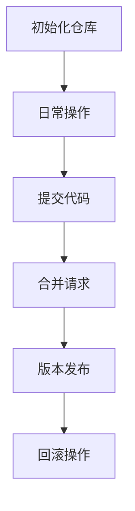
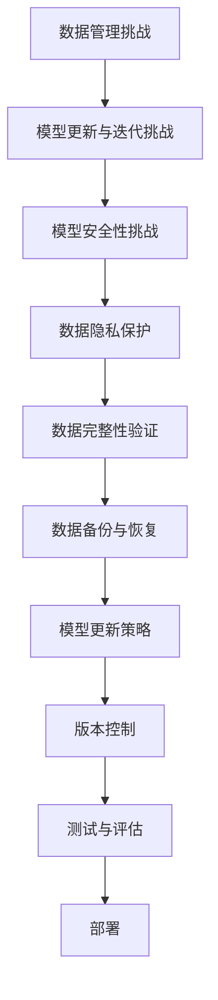
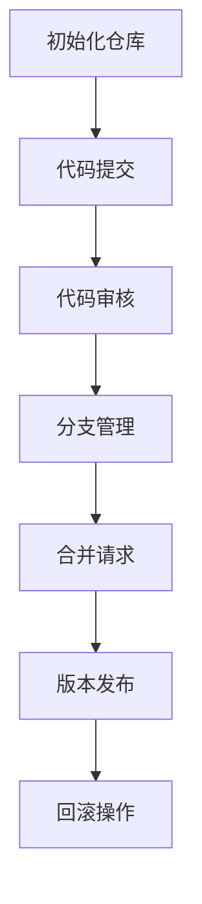
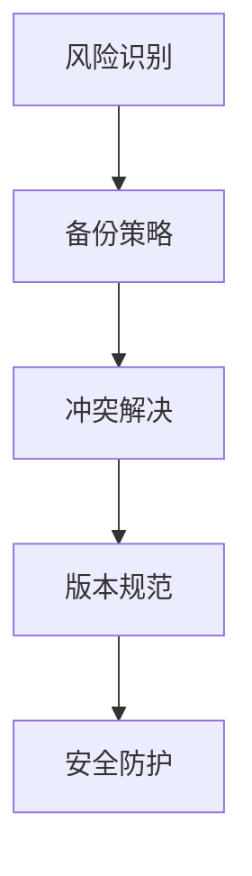

                 

### 第一部分：LLM基础

#### 第1章：LLM概述

##### 1.1 LLM的定义与作用

**LLM的定义**

大型语言模型（Large Language Model，简称LLM）是指那些通过深度学习技术训练而成的、具备较强语言理解和生成能力的模型。这些模型通常由数亿到数千亿的参数组成，能够理解并生成自然语言文本，实现诸如文本分类、机器翻译、问答系统、文本生成等多种语言任务。

**LLM的作用**

LLM的作用主要体现在以下几个方面：

1. **文本生成**：LLM可以生成高质量的文本，包括文章、新闻报道、对话等。
2. **自然语言理解**：LLM能够理解和处理自然语言，应用于信息检索、文本分类等任务。
3. **智能问答**：LLM可以基于输入问题生成相应的答案，为用户提供实时信息查询服务。
4. **机器翻译**：LLM能够进行高质量的双语翻译，提高跨语言沟通的效率。

##### 1.2 LLM的发展历程

LLM的发展经历了以下几个阶段：

1. **词袋模型（Bag of Words, BoW）**：最早的文本表示方法，将文本表示为单词的集合，不考虑单词之间的顺序。
2. **循环神经网络（Recurrent Neural Network, RNN）**：通过引入时间步的概念，考虑单词之间的顺序，使模型能够学习序列数据。
3. **长短期记忆网络（Long Short-Term Memory, LSTM）**：LSTM是RNN的一种变体，能够更好地处理长序列数据。
4. **Transformer模型**：引入了自注意力机制（Self-Attention），使得模型能够同时关注输入序列的每一个单词，大幅提高了模型的性能。
5. **预训练与微调**：通过预训练模型在大量无标签数据上，再通过微调模型在特定任务上，使得模型能够达到更高的性能。

##### 1.3 LLM的关键技术

LLM的核心技术主要包括以下几个方面：

1. **自注意力机制（Self-Attention）**：允许模型在处理输入序列时，能够关注到序列中的不同位置，提高了模型的表达能力。
2. **预训练与微调**：预训练模型在大量无标签数据上，然后通过微调模型在特定任务上，使得模型能够达到更高的性能。
3. **参数高效性**：通过参数共享等方式，降低模型参数的数量，使得模型在计算资源和存储资源上更加高效。
4. **多任务学习**：在一个模型中同时学习多个任务，提高模型的泛化能力。

**Mermaid 流程图：LLM发展历程**

```mermaid
graph TD
    A[词袋模型(BoW)] --> B[循环神经网络(RNN)]
    B --> C[长短期记忆网络(LSTM)]
    C --> D[Transformer模型]
    D --> E[预训练与微调]
```

#### 第2章：版本控制基础

##### 2.1 版本控制的基本概念

**版本号的定义**

版本号是用于标识软件、模型等代码或数据不同版本的标识符。常见的版本号格式为`MAJOR.MINOR.PATCH`，其中：

- **MAJOR**：主版本号，当代码发生重大变更时，例如新增功能或重大设计变更时，主版本号增加。
- **MINOR**：次版本号，当代码发生较小变更时，例如修复bug或添加新特性时，次版本号增加。
- **PATCH**：补丁版本号，当代码仅进行bug修复时，补丁版本号增加。

**版本控制的必要性**

版本控制是软件开发和模型开发过程中不可或缺的一部分，它能够：

- **追溯历史**：记录代码或模型的历史变更，方便回溯和调试。
- **协同工作**：多人协作时，通过版本控制工具管理代码或模型的版本，避免冲突。
- **代码稳定**：通过版本控制，确保代码或模型在不同环境下的稳定性和一致性。

##### 2.2 版本控制工具的选择

**常见版本控制工具的介绍**

1. **Git**：Git是目前最为流行的分布式版本控制工具，支持快速便捷的代码管理，适合大型项目和团队协作。
2. **SVN**：Subversion是集中式版本控制工具，虽然功能较为完备，但在分布式环境下的表现不如Git。
3. **Mercurial**：与Git类似，也是一种分布式版本控制工具，具有较好的兼容性和扩展性。

**适合LLM项目的版本控制工具**

对于LLM项目，由于数据量和代码量较大，建议选择分布式版本控制工具，如Git。Git具备以下优点：

- **高效的速度**：分布式架构使得代码的传输和操作更加高效。
- **分支管理**：Git支持灵活的分支管理，便于开发和维护。
- **协同工作**：Git支持多人协同工作，适合大型团队协作。

##### 2.3 版本控制的实践策略

**版本管理流程**

1. **初始化仓库**：在项目开始时，初始化Git仓库，确保所有团队成员都在同一版本基础上开始工作。
2. **日常操作**：团队成员进行日常开发时，及时提交代码，保持代码库的同步。
3. **合并请求**：开发完成后，提交合并请求（Pull Request），由团队负责人或代码审核人员进行代码审核和合并。
4. **版本发布**：合并通过后，进行版本发布，更新版本号，确保代码和模型的可追溯性。

**版本追踪与回滚策略**

1. **分支策略**：采用分支策略，如Git Flow或GitLab Flow，确保不同阶段的工作可以并行进行。
2. **标签管理**：为每个版本发布打上标签（Tag），记录版本的重要变更和发布时间。
3. **回滚操作**：如果发现版本发布存在问题，可以回滚到上一个稳定版本，确保系统的稳定运行。

**伪代码：版本控制流程**

```python
# 初始化仓库
init_repository()

# 提交代码
def submit_code():
    commit_message = input("请输入提交信息：")
    git_commit(commit_message)

# 合并请求
def submit_pull_request():
    pr_message = input("请输入合并请求信息：")
    git_create_pull_request(pr_message)

# 版本发布
def release_version():
    version = input("请输入版本号：")
    git_tag_version(version)
    git_push_tags()

# 回滚操作
def rollback_version():
    version = input("请输入要回滚的版本号：")
    git_rollback_version(version)
```

**Mermaid 流程图：版本控制流程**



---

### 总结

本文详细介绍了LLM的基础知识和版本控制的重要性。在接下来的章节中，我们将深入探讨LLM应用开发中的版本控制挑战和最佳实践。版本控制是确保LLM项目稳定性和可维护性的关键，希望读者能够从中获得有益的启示。

---

**作者：AI天才研究院/AI Genius Institute & 禅与计算机程序设计艺术 /Zen And The Art of Computer Programming**### 第二部分：LLM应用开发中的版本控制

#### 第3章：LLM应用开发的挑战

##### 3.1 数据管理挑战

**数据的安全性与完整性**

对于LLM应用开发，数据的安全性和完整性至关重要。由于LLM模型通常基于大规模数据集进行训练，数据泄露或损坏可能导致模型性能下降甚至完全失效。以下是一些数据管理方面的挑战：

- **数据隐私保护**：需确保数据在传输和存储过程中的安全性，防止未经授权的访问。
- **数据完整性验证**：对数据进行加密和校验，确保数据在传输过程中未被篡改。
- **数据备份与恢复**：定期备份数据，确保在数据损坏或丢失时能够快速恢复。

**数据的版本控制**

在LLM应用开发过程中，数据的版本控制同样重要。数据版本控制有助于追踪数据变更的历史，便于回溯和审计。以下是一些数据版本控制方面的挑战：

- **数据版本标识**：为数据版本分配唯一的标识符，如时间戳或版本号。
- **数据变更记录**：记录每次数据变更的操作，包括操作人员、时间、变更内容等。
- **数据回滚策略**：在发现数据变更存在问题或错误时，能够回滚到上一个稳定版本。

##### 3.2 模型更新与迭代挑战

**模型更新策略**

LLM模型的更新和迭代是提高模型性能的关键。在模型更新过程中，以下策略有助于确保模型更新顺利进行：

- **增量更新**：针对模型的微小错误或改进进行增量更新，避免对模型造成过大冲击。
- **版本控制**：为每个模型版本打上标签，记录版本信息，方便后续的回溯和审计。
- **测试与评估**：在更新模型前进行充分的测试和评估，确保更新后的模型性能符合预期。

**模型版本迭代**

在LLM应用开发中，模型的版本迭代通常分为以下几个阶段：

1. **预训练阶段**：在大量无标签数据上进行预训练，使得模型具备较强的语言理解和生成能力。
2. **微调阶段**：在特定领域或任务上对模型进行微调，提高模型在特定任务上的性能。
3. **测试与评估阶段**：对模型进行测试和评估，验证模型在特定任务上的表现。
4. **部署阶段**：将更新后的模型部署到生产环境，为用户提供服务。

##### 3.3 模型安全性挑战

**模型安全性问题**

LLM应用开发中，模型安全性是必须考虑的问题。以下是一些常见的模型安全性问题：

- **恶意攻击**：模型可能遭受恶意攻击，如对抗性攻击、注入攻击等，导致模型性能下降或输出错误。
- **数据泄露**：模型可能通过输入数据泄露敏感信息，如个人隐私或商业机密。
- **模型篡改**：恶意用户可能尝试篡改模型参数或数据，影响模型输出。

**应对策略**

以下是一些应对模型安全性问题的策略：

- **安全评估**：在模型开发过程中进行安全评估，发现并修复潜在的安全问题。
- **加密与签名**：对输入数据和应用结果进行加密和签名，确保数据在传输和存储过程中的安全性。
- **访问控制**：限制模型对数据的访问权限，确保只有授权用户可以访问敏感数据。

**Mermaid 流�程图：LLM应用开发的挑战**



---

### 总结

在LLM应用开发过程中，数据管理、模型更新与迭代以及模型安全性是三大关键挑战。有效的版本控制策略有助于应对这些挑战，确保项目的稳定性和安全性。在接下来的章节中，我们将进一步探讨版本控制的最佳实践，以帮助读者更好地管理LLM应用开发过程。

---

**作者：AI天才研究院/AI Genius Institute & 禅与计算机程序设计艺术 /Zen And The Art of Computer Programming**### 第三部分：实战案例与策略

#### 第4章：版本控制的最佳实践

##### 4.1 版本控制的流程设计

**流程设计目标**

版本控制流程的设计目标是确保LLM应用开发过程中的代码、数据和模型能够得到有效管理，提高项目的可维护性和可追溯性。以下是一个典型的版本控制流程设计：

1. **初始化仓库**：项目启动时，初始化Git仓库，为团队提供一个共同的工作基础。
2. **代码提交**：开发人员在进行代码修改后，及时提交代码至仓库，保持代码库的同步。
3. **代码审核**：提交的代码由代码审核人员（如团队负责人或资深开发者）进行审核，确保代码质量。
4. **分支管理**：根据项目阶段和功能需求，创建相应的分支，确保不同功能模块的独立开发和维护。
5. **合并请求**：开发完成后，提交合并请求（Pull Request），由审核人员审核并通过后合并代码。
6. **版本发布**：合并请求审核通过后，进行版本发布，更新版本号并记录发布日志。
7. **回滚策略**：在发现版本问题或需要回退时，根据记录的版本信息进行回滚操作。

**流程设计要点**

1. **代码提交**：鼓励开发人员频繁提交代码，避免长时间未提交的代码积累，提高代码的可维护性。
2. **代码审核**：审核过程中，重点关注代码的质量、规范性和安全性，确保代码库的一致性。
3. **分支管理**：合理规划分支结构，确保分支之间的清晰性和独立性，便于后续的合并和维护。
4. **合并请求**：合并请求的审核应严谨，确保代码的稳定性和功能的完整性。
5. **版本发布**：版本发布应记录详细的发布日志，包括版本号、发布日期、发布人等信息，便于后续的回溯和审计。

**伪代码：版本控制流程**

```python
# 初始化仓库
init_repository()

# 代码提交
def submit_code():
    commit_message = input("请输入提交信息：")
    git_commit(commit_message)

# 代码审核
def review_code():
    review_result = input("请输入审核结果：")
    if review_result == "通过":
        git_merge_pull_request()
    else:
        print("代码审核未通过，请进行修改并重新提交。")

# 分支管理
def create_branch():
    branch_name = input("请输入分支名称：")
    git_create_branch(branch_name)

# 合并请求
def submit_pull_request():
    pr_message = input("请输入合并请求信息：")
    git_create_pull_request(pr_message)

# 版本发布
def release_version():
    version = input("请输入版本号：")
    git_tag_version(version)
    git_push_tags()

# 回滚操作
def rollback_version():
    version = input("请输入要回滚的版本号：")
    git_rollback_version(version)
```

**Mermaid 流程图：版本控制流程**



##### 4.2 版本控制的工具应用

**Git工具应用**

Git是目前最为流行的版本控制工具，适用于LLM应用开发的版本控制。以下是一些Git工具的应用：

1. **Git命令行**：通过Git命令行进行代码的提交、审核、合并、分支管理等操作。
2. **Git图形界面**：使用Git图形界面（如GitKraken、SourceTree等），方便开发者进行版本控制操作。
3. **Git Hooks**：通过Git Hooks（如pre-commit、pre-push等）进行代码检查、格式化等操作，确保代码质量。
4. **Git Lab**：Git Lab是一个基于Git的集中式版本控制系统，提供代码仓库管理、代码审核、权限控制等功能。

**Git工具应用示例**

```bash
# 初始化仓库
git init

# 添加文件到暂存区
git add .

# 提交代码
git commit -m "提交代码"

# 创建分支
git checkout -b feature/new_function

# 合并分支
git merge feature/new_function

# 提交合并请求
git push origin feature/new_function

# 查看提交历史
git log --oneline

# 查看分支信息
git branch
```

**其他版本控制工具应用**

1. **SVN**：适用于大型项目或团队协作，支持集中式版本控制。
2. **Mercurial**：适用于分布式版本控制，与Git类似，但兼容性更好。

##### 4.3 版本控制的风险管理

**风险识别**

版本控制过程中可能面临的风险包括：

1. **数据丢失**：代码或数据在提交、备份过程中可能丢失。
2. **代码冲突**：多人协作时，代码提交可能产生冲突，导致代码库不一致。
3. **版本混乱**：未按照规范进行版本管理，导致版本信息混乱，影响代码维护和回溯。
4. **安全问题**：版本控制工具的安全性可能受到威胁，导致代码泄露或篡改。

**风险管理策略**

1. **备份策略**：定期备份代码和数据，确保在数据丢失时能够快速恢复。
2. **冲突解决**：制定冲突解决策略，确保代码冲突能够及时解决，避免代码库不一致。
3. **版本规范**：制定版本管理规范，确保版本信息清晰、有序，便于代码维护和回溯。
4. **安全防护**：加强版本控制工具的安全防护，确保代码和数据的安全性。

**Mermaid 流程图：版本控制风险管理**



##### 4.4 版本控制的策略优化

**优化目标**

版本控制策略优化的目标是提高版本控制的效率和效果，确保代码、数据和模型得到有效管理。以下是一些优化策略：

1. **自动化**：引入自动化工具和脚本，减少人工操作，提高版本控制的效率。
2. **流程简化**：简化版本控制流程，减少不必要的操作和等待时间。
3. **权限管理**：合理设置权限，确保只有授权用户可以进行关键操作，提高版本控制的安全性。
4. **培训与指导**：加强对开发人员的培训与指导，提高他们的版本控制意识和技能。

**优化策略示例**

1. **自动化合并请求**：使用自动化工具（如Jenkins）进行合并请求的自动化审核和合并，提高开发效率。
2. **简化代码审核**：通过自动化代码检查工具（如SonarQube）进行代码质量检查，简化人工审核流程。
3. **权限分级**：根据开发人员的职责和角色，设置不同的权限等级，确保关键操作的安全性。
4. **培训计划**：定期组织版本控制培训，帮助开发人员掌握最新版本控制工具的使用方法和最佳实践。

---

### 总结

版本控制是LLM应用开发过程中至关重要的一环。通过设计合理的版本控制流程、应用合适的版本控制工具、进行有效的风险管理以及不断优化版本控制策略，可以确保LLM项目的稳定性和可维护性。在接下来的案例研究中，我们将通过具体案例展示如何在实际项目中应用版本控制的最佳实践。

---

**作者：AI天才研究院/AI Genius Institute & 禅与计算机程序设计艺术 /Zen And The Art of Computer Programming**### 第5章：案例研究

在本章中，我们将通过两个具体的案例，展示如何在实际的LLM应用开发过程中应用版本控制的最佳实践。

#### 5.1 案例一：某电商平台的LLM应用版本控制

**背景介绍**

某大型电商平台为了提升用户体验，决定引入LLM技术，实现智能客服和个性化推荐功能。由于项目规模庞大，涉及多个团队和大量数据，版本控制变得至关重要。

**版本控制实践**

1. **初始化仓库**：
   - 项目启动时，团队初始化了Git仓库，确保所有开发人员基于同一版本开始工作。
   - 使用Git命令行和GitLab进行版本控制，方便团队协作和代码管理。

2. **分支管理**：
   - 根据不同功能模块，创建了多个分支，如`customer-service`、`personalized-recommendation`等，确保模块之间的独立开发和维护。
   - 使用Git的分支策略，如Git Flow，使得项目开发、测试和发布流程清晰、有序。

3. **代码审核**：
   - 每个开发人员提交的代码都需要经过团队成员的审核，确保代码质量符合团队标准。
   - 使用Git Hooks进行代码质量检查，如语法检查、代码风格检查等。

4. **版本发布**：
   - 完成功能的开发后，提交合并请求，经过审核后合并代码并进行版本发布。
   - 为每个版本打上标签，记录版本号、发布日期和发布人等信息。

5. **回滚操作**：
   - 在发现版本问题或需要回退时，根据版本信息进行回滚操作，确保系统的稳定性。
   - 回滚操作后，对问题进行详细分析，避免类似问题的再次发生。

**效果分析**

通过有效的版本控制，该电商平台的项目开发过程中代码冲突减少，代码质量和稳定性显著提升。版本信息清晰，方便后续的回溯和审计。团队成员的协作效率提高，项目按时交付。

**案例小结**

该案例展示了在大型电商平台中，通过合理的版本控制实践，可以有效管理LLM应用的开发过程，确保项目的稳定性和可维护性。

#### 5.2 案例二：某金融公司的LLM应用版本控制

**背景介绍**

某金融公司计划通过引入LLM技术，实现智能风控和客户服务。由于金融行业的特殊性和对数据安全性的严格要求，版本控制成为项目成功的关键。

**版本控制实践**

1. **数据隐私保护**：
   - 在数据版本控制中，特别关注数据隐私保护，确保数据在传输和存储过程中的安全性。
   - 对敏感数据进行加密和校验，确保数据未被篡改。

2. **数据备份与恢复**：
   - 定期对数据备份，确保在数据丢失或损坏时能够快速恢复。
   - 制定详细的数据备份和恢复策略，确保备份的完整性和可用性。

3. **模型更新与迭代**：
   - 采用增量更新策略，逐步优化模型性能，避免对系统造成过大冲击。
   - 在每个更新阶段，进行充分的测试和评估，确保更新后的模型稳定可靠。

4. **安全性管理**：
   - 对模型进行安全评估，发现并修复潜在的安全问题。
   - 限制模型对数据的访问权限，确保只有授权用户可以访问敏感数据。

**效果分析**

通过严格的版本控制实践，该金融公司的LLM应用项目在数据安全和模型性能方面取得了显著成效。数据备份和恢复策略确保了数据的完整性和可靠性，模型更新和迭代过程平稳进行，系统稳定运行。

**案例小结**

该案例展示了在金融行业中，通过严格的版本控制实践，可以有效管理LLM应用的开发过程，确保数据安全和模型性能，从而实现项目的成功。

### 总结

通过以上两个案例，我们可以看到，在不同类型的实际项目中，通过合理的版本控制实践，可以有效管理LLM应用的开发过程，确保项目的稳定性和可维护性。版本控制不仅是技术实践，更是项目管理的重要组成部分。

**作者：AI天才研究院/AI Genius Institute & 禅与计算机程序设计艺术 /Zen And The Art of Computer Programming**### 第6章：策略制定

在LLM应用开发中，制定合理的版本控制策略对于项目的成功至关重要。以下是一些具体的策略，旨在帮助开发者、团队和企业优化版本控制过程。

#### 6.1 面向开发者的版本控制建议

**1. 提高代码质量**

- **定期代码审查**：开发者应定期进行代码审查，确保代码质量符合团队标准。
- **使用静态代码分析工具**：引入静态代码分析工具，如SonarQube或Pylint，自动检测代码中的潜在问题。

**2. 提升协作效率**

- **明确的分支策略**：采用如Git Flow或GitLab Flow等明确的分支策略，便于团队协作和代码管理。
- **合理分配任务**：根据团队成员的技能和经验，合理分配任务，提高团队协作效率。

**3. 灵活应对变更**

- **版本号规范化**：遵循MAJOR.MINOR.PATCH的版本号规范，确保版本号准确反映代码变更情况。
- **快速响应变更**：及时响应代码变更，减少变更积累，降低冲突风险。

#### 6.2 面向团队协作的版本控制策略

**1. 建立代码审核机制**

- **代码审核流程**：制定详细的代码审核流程，明确审核人员、审核标准和审核步骤。
- **代码审核标准**：制定统一的代码审核标准，确保代码的一致性和高质量。

**2. 优化分支管理**

- **分支命名规范**：统一分支命名规范，如`feature/`用于新功能开发，`bugfix/`用于修复bug。
- **分支合并策略**：制定分支合并策略，确保分支之间的合并操作平稳进行。

**3. 提高沟通效率**

- **定期团队会议**：定期召开团队会议，讨论项目进展和版本控制相关问题。
- **使用协作工具**：利用如Slack或Microsoft Teams等协作工具，实时沟通和协作。

#### 6.3 面向企业规模的版本控制优化

**1. 版本控制工具选型**

- **根据需求选型**：根据企业的规模和需求，选择合适的版本控制工具，如Git、SVN或GitLab。
- **支持多团队协作**：选择支持多团队协作的版本控制工具，便于企业内部跨团队协作。

**2. 建立版本管理规范**

- **版本管理流程**：建立详细的版本管理流程，明确版本发布、回滚等操作的标准和流程。
- **版本管理文档**：编写版本管理文档，详细记录版本管理策略和操作指南。

**3. 提高版本控制培训**

- **定期培训**：定期组织版本控制培训，提高开发人员的版本控制意识和技能。
- **技能提升**：鼓励开发人员学习最新版本控制工具和技术，提升团队的整体技术水平。

**策略示例：版本管理流程**

1. **初始化仓库**：项目启动时，初始化Git仓库，团队成员共同工作。
2. **日常提交**：开发者每日提交代码，保持代码库的同步。
3. **代码审核**：提交的代码由审核人员审核，确保代码质量。
4. **分支管理**：根据项目阶段和需求，创建和维护分支。
5. **合并请求**：审核通过的代码提交合并请求，由团队负责人合并。
6. **版本发布**：合并请求审核通过后，进行版本发布，更新版本号。
7. **回滚操作**：在发现版本问题时，根据版本管理流程进行回滚操作。

**策略示例：版本控制培训**

1. **培训课程**：组织版本控制培训课程，讲解版本控制的基本概念、工具使用和最佳实践。
2. **实战演练**：通过实战演练，帮助开发人员掌握版本控制工具的使用和操作。
3. **案例分享**：分享实际项目中的版本控制案例，讨论解决方法和经验教训。

### 总结

通过制定合理的版本控制策略，开发者、团队和企业可以优化LLM应用开发的过程，提高项目的稳定性和可维护性。有效的版本控制不仅有助于代码和模型的管理，也是团队协作和企业发展的重要保障。

**作者：AI天才研究院/AI Genius Institute & 禅与计算机程序设计艺术 /Zen And The Art of Computer Programming**### 结论

在本文中，我们系统地探讨了LLM应用开发中的版本控制最佳实践。首先，我们介绍了LLM的基本概念、发展历程和关键技术，为后续的版本控制讨论奠定了基础。接着，我们详细阐述了版本控制的基础知识，包括版本号的定义、版本控制工具的选择和版本控制的实践策略。在分析LLM应用开发的挑战时，我们讨论了数据管理、模型更新与迭代以及模型安全性等方面的挑战，并提出了相应的风险管理策略。

通过案例研究，我们展示了如何在实际项目中应用版本控制的最佳实践，包括某电商平台的LLM应用版本控制和某金融公司的LLM应用版本控制。这些案例表明，合理的版本控制策略能够显著提高项目的稳定性和可维护性。

在策略制定部分，我们提供了面向开发者、团队和企业规模的版本控制建议，包括代码质量提升、团队协作优化和版本管理规范建立等方面的策略。这些策略有助于团队更好地管理LLM应用开发过程，确保项目的成功。

版本控制在LLM应用开发中具有至关重要的地位。它不仅有助于代码和模型的管理，也是团队协作和企业发展的重要保障。通过本文的探讨，我们希望读者能够深入理解版本控制的重要性，并在实际项目中灵活应用这些最佳实践，提升项目的开发效率和稳定性。

**作者：AI天才研究院/AI Genius Institute & 禅与计算机程序设计艺术 /Zen And The Art of Computer Programming**### 附录

#### 附录 A: 常用版本控制工具与资源

在LLM应用开发中，选择合适的版本控制工具对于项目的成功至关重要。以下是一些常用的版本控制工具和相关资源，供读者参考：

1. **Git**：
   - **官方文档**：[Git 官方文档](https://git-scm.com/docs)
   - **GitLab**：[GitLab 官方网站](https://about.gitlab.com/)
   - **GitHub**：[GitHub 官方网站](https://github.com/)

2. **SVN**：
   - **官方文档**：[Apache Subversion 官方文档](https://subversion.apache.org/docs/)

3. **Mercurial**：
   - **官方文档**：[Mercurial 官方文档](https://www.mercurial-scm.org/wiki)

4. **其他版本控制工具**：
   - **Bazaar**：[Bazaar 官方文档](https://www.bazaar-vcs.org/)
   - **Fossil**：[Fossil 官方文档](https://www.fossil-scm.org/)
   - **Docker**：[Docker 官方文档](https://docs.docker.com/)

5. **版本控制最佳实践**：
   - **Git Flow**：[Git Flow 官方文档](https://git-scm.com/book/zh/v2/Git-%E5%9B%9E%E6%BA%90-%E5%88%86%E6%94%AF%E7%9A%84%E7%BB%8F%E5%85%B8%E6%96%B9%E5%BC%8F)
   - **GitLab Flow**：[GitLab Flow 官方文档](https://about.gitlab.com/handbook/development/git-flow/)

6. **代码审核工具**：
   - **SonarQube**：[SonarQube 官方网站](https://www.sono

---

### 拓展阅读

为了帮助读者更深入地了解LLM应用开发和版本控制的相关知识，以下推荐几篇拓展阅读：

1. **《深度学习与自然语言处理》**：吴恩达（Andrew Ng）著，详细介绍了深度学习和自然语言处理的基本概念和技术。

2. **《大语言模型：原理、应用与未来》**：张祥雨著，深入探讨了大型语言模型的发展历程、关键技术及其在各个领域的应用。

3. **《版本控制指南》**：Linux 基金会著，提供了全面的版本控制指南，包括Git、SVN等多种版本控制工具的使用方法。

4. **《软件工程：实践者的研究方法》**：Roger S. Pressman 著，涵盖了软件工程中的项目管理、设计、测试等方面的实践方法。

5. **《代码大全》**：Steve McConnell 著，介绍了编写高质量代码的最佳实践，对提升代码质量和团队协作效率具有指导意义。

通过阅读这些书籍和文档，读者可以进一步了解LLM应用开发和版本控制的理论和实践，为实际项目提供有益的参考。

