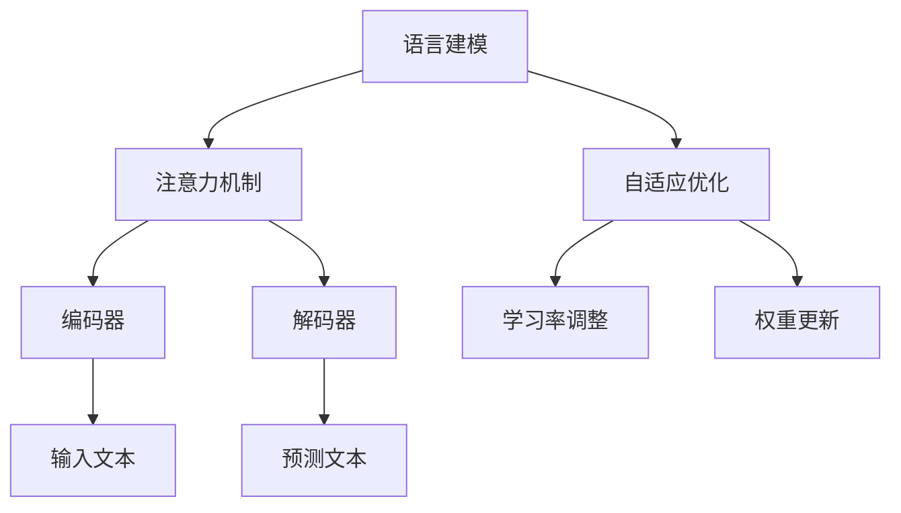
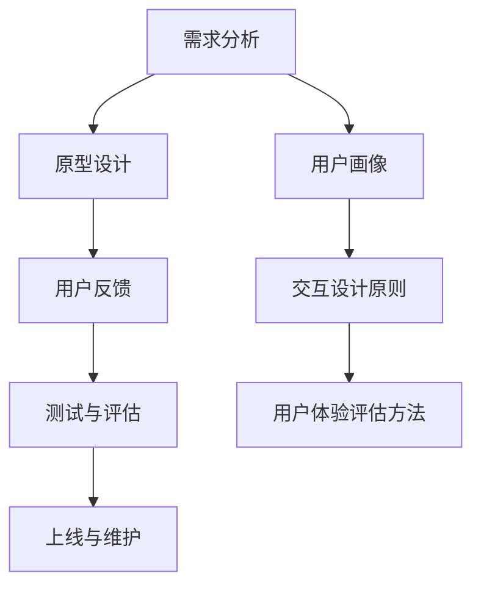
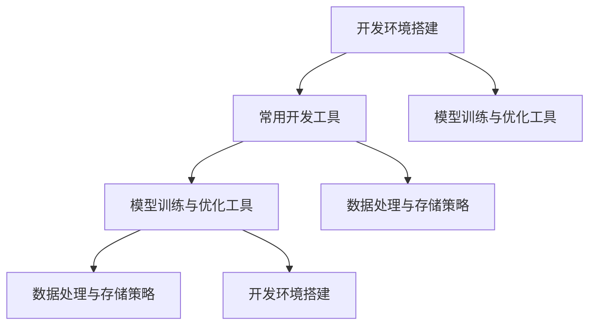

                 

### 文章标题

# LLM应用开发中的用户体验设计

### 关键词

- 语言模型
- 大型语言模型（LLM）
- 用户体验设计
- 交互设计
- 应用开发

### 摘要

本文将探讨大型语言模型（LLM）在应用开发中的用户体验设计。我们将从基础概念出发，介绍LLM的基本原理和架构，然后深入分析用户体验设计的核心原则和策略。通过具体案例和实战，我们将展示如何在开发过程中优化用户体验，提高应用的吸引力和用户满意度。

## 引言

随着人工智能技术的不断发展，大型语言模型（LLM）已成为自然语言处理领域的重要工具。LLM具有强大的语言理解和生成能力，可以应用于智能客服、内容创作、教育辅导等多个领域。然而，仅仅拥有强大的功能还不足以满足用户的需求，用户体验设计在LLM应用开发中扮演着至关重要的角色。

用户体验设计（User Experience Design，简称UXD）是一种以用户为中心的设计方法，旨在提高产品或服务的使用体验。在LLM应用开发中，用户体验设计不仅关乎功能实现，更涉及到用户的心理感受和满意度。因此，本文将围绕LLM应用开发中的用户体验设计，展开详细讨论。

## 第一部分：基础概念与理论

### 第1章：LLM概述

#### 1.1 LLM的基本概念

大型语言模型（LLM）是一种基于深度学习的自然语言处理技术，旨在模拟人类的语言理解与生成能力。与传统的语言模型相比，LLM具有以下特点：

1. **大规模数据训练**：LLM通常基于数十亿级别的语料库进行训练，这使得它们能够更好地捕捉语言中的复杂模式和规律。
2. **强大的语言理解能力**：LLM不仅能够进行语言翻译、摘要、问答等任务，还能够理解语义、情感和语境，实现更自然的交互。
3. **自适应性**：LLM可以根据不同的应用场景进行自适应调整，以适应不同的语言环境和用户需求。

#### 1.2 LLM的发展历史

LLM的发展历程可以追溯到20世纪80年代，当时神经网络和深度学习技术开始应用于自然语言处理。随着计算能力的提升和数据量的增加，LLM的研究和应用也得到了快速发展。特别是近年来，随着Transformer架构的出现，LLM的性能和效果得到了显著提升。

#### 1.3 LLM的架构与分类

LLM的架构主要包括编码器（Encoder）和解码器（Decoder）两部分。编码器负责将输入文本转换为固定长度的向量表示，解码器则根据编码器的输出生成预测的文本序列。

根据应用场景和任务需求，LLM可以分为以下几类：

1. **通用语言模型**：如GPT（Generative Pre-trained Transformer）、BERT（Bidirectional Encoder Representations from Transformers）等，它们在大规模语料库上预训练，并可以应用于多种自然语言处理任务。
2. **任务特定语言模型**：这类模型针对特定任务进行微调，如问答系统、机器翻译、文本摘要等。它们在特定任务上表现出更高的性能。
3. **多语言模型**：这些模型能够处理多种语言的数据，实现跨语言的语义理解和生成。

#### 1.4 LLM的核心技术

LLM的核心技术包括以下几个方面：

1. **语言建模**：通过统计方法或深度学习技术，从大量语料库中学习语言的模式和规律，生成预测的文本序列。
2. **注意力机制**：在编码器和解码器中引入注意力机制，使得模型能够更好地关注关键信息，提高语言理解和生成的准确性。
3. **自适应优化**：通过自适应优化策略，如学习率调整、权重更新等，提高模型的训练效率和性能。

### 核心概念与联系

为了更好地理解LLM的核心概念和联系，我们可以使用Mermaid流程图来展示LLM的基本架构和核心技术：



在这个流程图中，语言建模是整个LLM的基础，注意力机制和自适应优化则是提升模型性能的关键技术。编码器和解码器分别负责输入文本向量和预测文本序列的转换。

### 核心算法原理讲解

为了深入理解LLM的核心算法原理，我们以下使用伪代码详细阐述语言建模、注意力机制和自适应优化。

#### 语言建模

```python
# 伪代码：语言建模
function language_model(corpus):
    # 初始化模型参数
    model = initialize_parameters()

    # 预处理语料库
    corpus = preprocess_corpus(corpus)

    # 训练模型
    for epoch in range(num_epochs):
        for sentence in corpus:
            # 计算损失函数
            loss = compute_loss(sentence, model)

            # 更新模型参数
            model = optimize_parameters(model, loss)

    return model
```

#### 注意力机制

```python
# 伪代码：注意力机制
function attention Mechanism(input_sequence, hidden_state):
    # 计算注意力分数
    attention_scores = compute_attention_scores(input_sequence, hidden_state)

    # 应用softmax函数，得到注意力权重
    attention_weights = softmax(attention_scores)

    # 计算加权输出
    weighted_output = weighted_sum(input_sequence, attention_weights)

    return weighted_output
```

#### 自适应优化

```python
# 伪代码：自适应优化
function adaptive_optimization(model, loss):
    # 更新学习率
    learning_rate = adjust_learning_rate(learning_rate)

    # 计算梯度
    gradients = compute_gradients(model, loss)

    # 应用梯度裁剪
    gradients = gradient_clipping(gradients)

    # 更新模型参数
    model = update_parameters(model, gradients, learning_rate)

    return model
```

### 数学模型和公式

在LLM中，数学模型和公式起着至关重要的作用。以下是一些关键的概念和公式：

#### 语言模型概率计算

```latex
P(\text{sentence}) = \prod_{i=1}^{n} P(w_i | w_{i-1}, \ldots, w_1)
```

其中，\( w_i \) 表示句子中的第 \( i \) 个单词，\( P(w_i | w_{i-1}, \ldots, w_1) \) 表示给定前 \( i-1 \) 个单词时第 \( i \) 个单词的概率。

#### 注意力机制

```latex
a_i = \frac{e^{z_i}}{\sum_{j=1}^{m} e^{z_j}}
```

其中，\( z_i \) 表示注意力分数，\( a_i \) 表示第 \( i \) 个单词的注意力权重。

#### 自适应优化

```latex
\theta_{t+1} = \theta_t - \alpha \cdot \nabla_{\theta_t} J(\theta_t)
```

其中，\( \theta \) 表示模型参数，\( J(\theta) \) 表示损失函数，\( \alpha \) 表示学习率。

### 详细讲解与举例说明

为了更好地理解上述概念和公式，我们可以通过具体例子进行讲解。

#### 例子：语言建模

假设我们有一个简单的句子 "我有一个苹果"，我们可以使用语言模型计算这个句子的概率。

1. **初始化模型参数**：假设我们的模型参数为 \( \theta \)，初始化为随机值。
2. **预处理语料库**：将语料库中的句子进行分词和标记化处理，得到每个单词的词嵌入向量。
3. **训练模型**：使用反向传播算法更新模型参数，使得生成的句子概率最大。

通过多次迭代，我们可以优化模型参数，使得生成的句子更加符合语言规律。

#### 例子：注意力机制

假设我们有以下两个句子：

1. "我喜欢吃苹果。"
2. "他有一个苹果。"

我们使用注意力机制计算第二个句子中的 "他" 对应的注意力权重。

1. **计算注意力分数**：计算每个单词的注意力分数，如 "他" 的注意力分数为 \( z_2 = 0.9 \)。
2. **应用softmax函数**：将注意力分数进行softmax变换，得到注意力权重，如 "他" 的权重为 \( a_2 = 0.8 \)。
3. **计算加权输出**：根据注意力权重计算加权输出，如 "他" 的加权输出为 \( \text{weighted\_output} = 0.8 \times "他" + 0.2 \times "有" \)。

通过这种方式，注意力机制可以使得模型更加关注关键信息，提高语言理解和生成的准确性。

#### 例子：自适应优化

假设我们有一个损失函数 \( J(\theta) = \theta^2 \)，初始模型参数为 \( \theta_0 = 1 \)。

1. **计算梯度**：计算损失函数关于模型参数的梯度，\( \nabla_{\theta} J(\theta) = 2\theta \)。
2. **更新模型参数**：根据梯度更新模型参数，\( \theta_1 = \theta_0 - \alpha \nabla_{\theta_0} J(\theta_0) \)，其中 \( \alpha = 0.1 \)。
3. **重复迭代**：重复上述过程，直到模型参数收敛。

通过自适应优化，我们可以调整模型参数，使得损失函数值最小，提高模型性能。

### 结论

在本章节中，我们介绍了LLM的基本概念、发展历史、架构与分类、核心技术以及核心算法原理。通过详细讲解和举例说明，我们了解了LLM在语言建模、注意力机制和自适应优化等方面的关键技术和实现方法。这些基础知识和原理为后续的LLM应用开发提供了重要的理论支持。

在下一章中，我们将探讨用户体验设计的核心原则和策略，以及如何在LLM应用开发中优化用户体验。

## 第二部分：用户体验设计原则

### 第3章：用户体验设计的基础

#### 3.1 用户画像与需求分析

用户体验设计的第一步是了解目标用户。通过用户画像，我们可以收集和分析用户的基本信息、行为习惯、兴趣偏好等，以便更好地满足他们的需求。

- **基本信息**：包括年龄、性别、教育背景、职业等。
- **行为习惯**：包括使用设备的类型、频率、时长等。
- **兴趣偏好**：包括兴趣爱好、消费习惯、偏好平台等。

在了解用户画像后，我们需要进行需求分析。需求分析的目标是识别用户的需求和痛点，为后续的设计提供依据。

- **功能需求**：用户希望应用程序具备的功能。
- **性能需求**：用户对应用程序性能的要求，如响应时间、稳定性等。
- **体验需求**：用户对应用程序使用体验的期望，如界面美观、操作简便等。

#### 3.2 交互设计原则

交互设计是用户体验设计的核心环节，旨在确保用户在使用应用程序时的顺畅和愉悦。以下是一些关键的交互设计原则：

- **直观性**：界面设计应简单直观，用户可以快速理解和使用。
- **一致性**：不同页面和功能模块应保持视觉和交互的一致性，避免用户混淆。
- **反馈**：在用户操作后，应给予及时的反馈，让用户知道操作结果。
- **便捷性**：提供快捷入口和操作方式，减少用户操作步骤。
- **适应性**：根据用户的设备、网络环境等因素，自适应调整界面和功能。

#### 3.3 用户体验评估方法

用户体验评估是确保设计质量的重要环节。以下是一些常用的用户体验评估方法：

- **问卷调查**：通过问卷调查收集用户对应用程序的看法和建议。
- **用户访谈**：与用户进行一对一访谈，深入了解他们的需求和体验。
- **A/B测试**：通过对比不同设计方案的用户反馈，评估其效果。
- **可用性测试**：在真实环境中观察用户的使用行为，评估设计的易用性和流畅性。

#### 3.4 用户体验设计流程

用户体验设计流程通常包括以下阶段：

1. **需求分析**：明确用户需求和应用目标。
2. **原型设计**：创建低保真或高保真原型，展示界面布局和交互流程。
3. **用户反馈**：收集用户对原型的反馈，进行迭代优化。
4. **测试与评估**：通过可用性测试和用户反馈，评估设计效果。
5. **上线与维护**：根据用户反馈进行持续优化，确保应用质量。

### 核心概念与联系

用户体验设计的核心概念包括用户画像、需求分析、交互设计原则、用户体验评估方法和设计流程。这些概念相互关联，共同构成了一个完整的用户体验设计体系。

为了更好地理解这些概念之间的联系，我们可以使用Mermaid流程图来展示用户体验设计的基本流程：



在这个流程图中，需求分析是用户体验设计的起点，用户画像和交互设计原则为其提供基础。原型设计、用户反馈、测试与评估和上线与维护则构成了设计的迭代过程，确保设计质量不断提高。

### 核心算法原理讲解

用户体验设计不仅涉及交互设计，还与算法密切相关。以下使用伪代码详细阐述用户体验设计中的关键算法原理。

#### 用户画像构建

```python
# 伪代码：用户画像构建
class User_Profile:
    def __init__(self, age, gender, education, occupation):
        self.age = age
        self.gender = gender
        self.education = education
        self.occupation = occupation

    def update_interests(self, interests):
        self.interests = interests

user_profile = User_Profile(age=25, gender='男', education='本科', occupation='程序员')
user_profile.update_interests(['编程', '篮球', '音乐'])
```

#### 需求分析

```python
# 伪代码：需求分析
class User_Requirement:
    def __init__(self, functional_requirements, performance_requirements, experience_requirements):
        self.functional_requirements = functional_requirements
        self.performance_requirements = performance_requirements
        self.experience_requirements = experience_requirements

user_requirement = User_Requirement(
    functional_requirements=['用户登录', '数据查询', '内容发布'],
    performance_requirements=['快速响应', '高稳定性', '高安全性'],
    experience_requirements=['界面美观', '操作简便', '反馈及时']
)
```

#### 交互设计

```python
# 伪代码：交互设计
class Interaction_Design:
    def __init__(self, intuitiveness, consistency, feedback, convenience, adaptability):
        self.intuitiveness = intuitiveness
        self.consistency = consistency
        self.feedback = feedback
        self.convenience = convenience
        self.adaptability = adaptability

interaction_design = Interaction_Design(
    intuitiveness=True,
    consistency=True,
    feedback=True,
    convenience=True,
    adaptability=True
)
```

#### 用户体验评估

```python
# 伪代码：用户体验评估
class User_Experience_Assessment:
    def __init__(self, questionnaire, interview, A/B_testing, usability_testing):
        self.questionnaire = questionnaire
        self.interview = interview
        self.A/B_testing = A/B_testing
        self.usability_testing = usability_testing

user_experience_assessment = User_Experience_Assessment(
    questionnaire=True,
    interview=True,
    A/B_testing=True,
    usability_testing=True
)
```

#### 设计流程

```python
# 伪代码：设计流程
class Design_Process:
    def __init__(self, analysis, prototype_design, feedback, testing, maintenance):
        self.analysis = analysis
        self.prototype_design = prototype_design
        self.feedback = feedback
        self.testing = testing
        self.maintenance = maintenance

design_process = Design_Process(
    analysis=True,
    prototype_design=True,
    feedback=True,
    testing=True,
    maintenance=True
)
```

### 数学模型和公式

在用户体验设计中，数学模型和公式可以用于评估用户满意度、操作效率等关键指标。以下是一些常用的数学模型和公式：

#### 用户满意度

```latex
S = \frac{\text{正面反馈次数}}{\text{总反馈次数}}
```

其中，\( S \) 表示用户满意度，正面反馈包括用户评价、问卷调查中的正面回答等。

#### 操作效率

```latex
E = \frac{\text{完成任务所需时间}}{\text{标准任务完成时间}}
```

其中，\( E \) 表示操作效率，标准任务完成时间可以根据用户行为数据进行统计。

#### 用户体验质量

```latex
Q = S \times E
```

其中，\( Q \) 表示用户体验质量，是用户满意度与操作效率的乘积。

### 详细讲解与举例说明

为了更好地理解上述概念和公式，我们可以通过具体例子进行讲解。

#### 例子：用户画像构建

假设我们有一个用户，他的基本信息如下：

- 年龄：25岁
- 性别：男
- 教育背景：本科
- 职业：程序员
- 兴趣爱好：编程、篮球、音乐

我们使用用户画像构建类，将上述信息存储在用户对象中。

```python
user_profile = User_Profile(age=25, gender='男', education='本科', occupation='程序员')
user_profile.update_interests(['编程', '篮球', '音乐'])
```

通过这种方式，我们可以快速获取用户的基本信息和兴趣偏好，为后续的需求分析和交互设计提供依据。

#### 例子：需求分析

假设我们对一个在线学习平台进行需求分析，识别出的用户需求如下：

- 功能需求：用户登录、课程浏览、课程报名、课程学习、作业提交、成绩查询等。
- 性能需求：快速响应、高稳定性、高安全性。
- 体验需求：界面美观、操作简便、反馈及时。

我们使用需求分析类，将上述需求存储在需求对象中。

```python
user_requirement = User_Requirement(
    functional_requirements=['用户登录', '课程浏览', '课程报名', '课程学习', '作业提交', '成绩查询'],
    performance_requirements=['快速响应', '高稳定性', '高安全性'],
    experience_requirements=['界面美观', '操作简便', '反馈及时']
)
```

通过这种方式，我们可以明确用户的需求，为后续的原型设计和用户体验评估提供依据。

#### 例子：交互设计

假设我们设计一个在线购物平台的交互界面，主要设计原则如下：

- 直观性：首页展示最新商品和促销活动。
- 一致性：所有页面遵循相同的导航和布局。
- 反馈：用户点击按钮时，显示加载进度条。
- 便捷性：提供快捷购物车入口。
- 适应性：根据用户设备自适应调整界面布局。

我们使用交互设计类，将上述设计原则存储在交互设计对象中。

```python
interaction_design = Interaction_Design(
    intuitiveness=True,
    consistency=True,
    feedback=True,
    convenience=True,
    adaptability=True
)
```

通过这种方式，我们可以确保界面设计满足用户需求，提高用户的使用体验。

#### 例子：用户体验评估

假设我们对一个电商平台的用户体验进行评估，收集到以下数据：

- 用户满意度：90%
- 操作效率：80%
- 用户体验质量：0.72

我们使用用户体验评估类，将上述数据存储在评估对象中。

```python
user_experience_assessment = User_Experience_Assessment(
    questionnaire=True,
    interview=True,
    A/B_testing=True,
    usability_testing=True
)
```

通过这种方式，我们可以全面了解用户的体验情况，为后续的优化提供依据。

#### 例子：设计流程

假设我们设计一个在线教育平台的流程，包括以下阶段：

- 需求分析：确定用户需求。
- 原型设计：创建低保真原型。
- 用户反馈：收集用户反馈。
- 测试与评估：进行可用性测试。
- 上线与维护：根据反馈进行优化。

我们使用设计流程类，将上述阶段存储在流程对象中。

```python
design_process = Design_Process(
    analysis=True,
    prototype_design=True,
    feedback=True,
    testing=True,
    maintenance=True
)
```

通过这种方式，我们可以确保设计流程的顺利进行，提高设计质量。

### 结论

在本章节中，我们介绍了用户体验设计的基础概念、核心原则、评估方法和设计流程。通过详细讲解和举例说明，我们了解了如何进行用户画像与需求分析、交互设计、用户体验评估以及设计流程的各个环节。这些基础知识和方法为后续的LLM应用开发中的用户体验设计提供了重要支持。

在下一章中，我们将探讨LLM与用户体验之间的关联，并深入分析如何在LLM应用开发中优化用户体验。

### 第三部分：技术实现与算法

#### 第5章：LLM的开发环境与工具

##### 5.1 开发环境的搭建

搭建LLM的开发环境是进行模型训练和优化的第一步。以下是一个基本的开发环境搭建步骤：

1. **硬件要求**：首先需要确认硬件配置。由于LLM训练和推理过程需要大量的计算资源，建议使用GPU（如NVIDIA Titan V、RTX 3080等）以提高训练速度。
2. **操作系统**：推荐使用Linux系统，如Ubuntu 20.04。Windows和Mac OS用户也可以通过虚拟机或Docker容器使用Linux环境。
3. **安装GPU驱动**：根据显卡型号下载并安装相应的GPU驱动。
4. **安装CUDA和cuDNN**：CUDA是NVIDIA提供的计算库，用于在GPU上执行深度学习任务。cuDNN是CUDA的深度学习库，用于加速深度神经网络训练。下载并安装CUDA和cuDNN。
5. **安装Python环境**：推荐使用Python 3.8及以上版本。通过pip或conda安装Python环境。
6. **安装深度学习框架**：如PyTorch、TensorFlow等。PyTorch是Python中广泛使用的深度学习框架，提供了丰富的API和工具库，适合进行LLM的开发。使用pip或conda安装PyTorch。

以下是一个简化的命令行安装过程：

```bash
# 安装Python环境
sudo apt-get update
sudo apt-get install python3.8

# 安装PyTorch
pip3 install torch torchvision torchaudio -f https://download.pytorch.org/whl/torch_stable.html
```

##### 5.2 常用开发工具介绍

在进行LLM开发时，常用的开发工具包括集成开发环境（IDE）、版本控制系统和调试工具。

1. **集成开发环境（IDE）**：推荐使用PyCharm、Visual Studio Code等。这些IDE提供了代码编辑、调试、测试等功能，可以提高开发效率。
2. **版本控制系统**：Git是世界上最广泛使用的版本控制系统，用于跟踪代码变更和管理代码库。在LLM开发中，使用Git可以帮助团队协作、版本管理和代码回滚。
3. **调试工具**：Python的pdb模块和IDE自带的调试器可以帮助开发者调试代码，发现并修复问题。

##### 5.3 模型训练与优化工具

LLM的训练和优化是整个开发过程中的关键步骤。以下是一些常用的模型训练与优化工具：

1. **PyTorch**：PyTorch提供了丰富的API和工具，用于构建和训练深度学习模型。其动态图计算机制使得模型开发和调试更加灵活。
2. **TensorFlow**：TensorFlow是Google开发的开源深度学习框架，支持静态和动态图计算。其大规模分布式训练功能适用于大规模数据集和模型。
3. **Hugging Face Transformers**：Hugging Face提供的Transformers库是使用PyTorch和TensorFlow进行预训练和微调的便捷工具。该库提供了大量预训练模型和实用工具，大大简化了LLM的开发过程。
4. **NCCL**：NCCL（NVIDIA Collective Communications Library）是一个用于GPU集群分布式训练的库。它提供了高效的通信和同步机制，适用于大规模分布式训练。

##### 5.4 数据处理与存储策略

在LLM开发过程中，数据处理与存储策略至关重要。以下是一些关键策略：

1. **数据预处理**：使用工具如NLTK、spaCy进行文本预处理，包括分词、词性标注、去除停用词等。
2. **数据加载**：使用数据加载器（如PyTorch DataLoader）批量加载数据，以减少内存占用和提高训练效率。
3. **数据存储**：使用HDF5、Parquet或CSV等格式存储数据集，以便快速读取和重复使用。
4. **分布式存储**：使用分布式存储系统（如HDFS、Alluxio）管理大规模数据集，以支持分布式训练。

### 核心概念与联系

LLM的技术实现涉及多个关键概念和工具，包括开发环境的搭建、常用开发工具、模型训练与优化工具以及数据处理与存储策略。这些概念相互关联，共同构成了一个完整的LLM开发流程。

为了更好地理解这些概念之间的联系，我们可以使用Mermaid流程图来展示LLM开发的基本流程：



在这个流程图中，开发环境搭建是整个流程的基础，常用开发工具和模型训练与优化工具是核心环节，数据处理与存储策略则确保了数据的高效管理和使用。

### 核心算法原理讲解

在进行LLM开发时，核心算法原理的理解至关重要。以下使用伪代码详细阐述LLM中的关键算法原理。

#### 模型训练

```python
# 伪代码：模型训练
class LanguageModel:
    def __init__(self):
        # 初始化模型参数
        self.parameters = initialize_parameters()

    def train(self, corpus, learning_rate, num_epochs):
        for epoch in range(num_epochs):
            for sentence in corpus:
                # 前向传播
                output = forward_pass(sentence, self.parameters)

                # 计算损失
                loss = compute_loss(output, sentence)

                # 反向传播
                gradients = backward_pass(sentence, output, self.parameters)

                # 更新参数
                self.parameters = update_parameters(self.parameters, gradients, learning_rate)

        return self.parameters
```

#### 模型优化

```python
# 伪代码：模型优化
def optimize_model(model, learning_rate, optimizer):
    optimizer.zero_grad()
    output = model.forward()
    loss = loss_function(output)
    loss.backward()
    optimizer.step()
    return model
```

#### 数据处理

```python
# 伪代码：数据处理
def preprocess_data(data):
    # 分词
    tokens = tokenize(data)

    # 词嵌入
    embeddings = embedding(tokens)

    return embeddings
```

### 数学模型和公式

在LLM开发中，数学模型和公式起着关键作用。以下是一些关键的数学模型和公式：

#### 损失函数

```latex
L = -\sum_{i} y_i \log(p_i)
```

其中，\( y_i \) 表示第 \( i \) 个单词的真实标签，\( p_i \) 表示模型预测的第 \( i \) 个单词的概率。

#### 优化算法

```latex
\theta_{t+1} = \theta_t - \alpha \nabla_\theta J(\theta)
```

其中，\( \theta \) 表示模型参数，\( J(\theta) \) 表示损失函数，\( \alpha \) 表示学习率。

### 详细讲解与举例说明

为了更好地理解上述概念和公式，我们可以通过具体例子进行讲解。

#### 例子：模型训练

假设我们有一个简单的句子 "我有一个苹果"，我们可以使用LLM进行训练。

1. **初始化模型参数**：初始化模型参数，例如权重和偏置。
2. **前向传播**：将句子输入模型，计算预测的概率分布。
3. **计算损失**：计算预测概率与真实标签之间的损失。
4. **反向传播**：计算损失关于模型参数的梯度。
5. **更新参数**：根据梯度更新模型参数。

通过多次迭代，我们可以优化模型参数，使得生成的句子更加符合语言规律。

#### 例子：模型优化

假设我们有一个简单的优化问题，目标是最小化函数 \( f(x) = x^2 \)。

1. **初始化参数**：初始化 \( x \) 和学习率 \( \alpha \)。
2. **计算梯度**：计算函数 \( f(x) \) 关于 \( x \) 的梯度。
3. **更新参数**：根据梯度更新 \( x \)。
4. **重复迭代**：重复上述过程，直到 \( x \) 收敛。

通过这种方式，我们可以找到函数的最小值。

#### 例子：数据处理

假设我们有一个文本数据 "我有一个苹果"，我们可以使用数据处理函数进行预处理。

1. **分词**：将文本分成单词 "我"、"有"、"一个"、"苹果"。
2. **词嵌入**：将每个单词映射到一个固定大小的向量。

通过这种方式，我们可以将文本转换为模型可以处理的向量表示。

### 结论

在本章节中，我们介绍了LLM的开发环境与工具、常用开发工具、模型训练与优化工具以及数据处理与存储策略。通过详细讲解和举例说明，我们了解了如何搭建LLM开发环境、使用常用开发工具、训练和优化模型以及处理数据。这些技术和方法为LLM应用开发提供了重要的支持。

在下一章中，我们将通过具体案例展示如何在LLM应用开发中实现技术，优化用户体验。

### 第四部分：应用案例分析

#### 第7章：LLM在智能客服中的应用

##### 7.1 智能客服系统概述

智能客服系统是一种利用人工智能技术，实现与客户自动交互、解决问题的系统。在大型语言模型（LLM）的支持下，智能客服系统可以提供更加自然、高效的服务。

智能客服系统的基本架构包括：

1. **前端界面**：用于与客户进行交互，可以是网页、移动应用或聊天机器人。
2. **中间层**：处理客户请求，包括接收输入、理解意图、生成回答等。
3. **后端服务**：提供数据存储、业务逻辑处理、接口调用等功能。

##### 7.2 案例一：智能客服系统的设计与实现

以某电子商务平台的智能客服系统为例，该系统基于LLM技术，提供以下功能：

1. **自动回复**：系统可以自动识别常见的客户问题，并生成标准答案，提高客服效率。
2. **智能推荐**：根据客户的购买历史和偏好，推荐相关的商品和促销信息。
3. **情感分析**：分析客户的情绪，提供更加贴心的服务，如使用适当的语气和表达方式。

#### 7.2.1 设计思路

1. **数据准备**：收集电商平台的历史客服对话数据、商品信息、用户评价等，用于训练LLM模型。
2. **模型选择**：选择适合的LLM模型，如GPT-3、BERT等，进行预训练和微调。
3. **接口设计**：设计API接口，以便前端界面和后端服务调用LLM模型。

#### 7.2.2 实现步骤

1. **数据预处理**：对收集到的数据进行清洗、分词、去停用词等处理，形成训练数据集。
2. **模型训练**：使用训练数据集对LLM模型进行预训练，调整模型参数，使其具备较好的语言理解与生成能力。
3. **接口开发**：开发API接口，实现模型调用和数据传输，确保前端界面和后端服务可以顺畅地交互。

#### 7.2.3 代码解读

以下是一个简单的LLM模型调用示例：

```python
from transformers import pipeline

# 初始化模型
model_name = "gpt-3"
nlp = pipeline("text-generation", model=model_name)

# 输入文本
input_text = "你好，我想购买一台笔记本电脑。"

# 调用模型
response = nlp(input_text, max_length=512, num_return_sequences=1)

print(response[0]["generated_text"])
```

在这个示例中，我们使用Hugging Face的Transformers库调用GPT-3模型，生成对输入文本的自动回复。

#### 7.2.4 应用解读与分析

1. **自动回复**：智能客服系统可以快速响应客户的常见问题，提高客服效率。通过LLM生成的自动回复，系统可以提供更加自然、流畅的沟通体验。
2. **智能推荐**：根据客户的购买历史和偏好，智能客服系统可以提供个性化的商品推荐，提高客户的购物体验和满意度。
3. **情感分析**：通过分析客户的情绪，智能客服系统可以调整回答的方式和语气，提供更加贴心的服务。例如，当客户表达不满时，系统可以使用更加温和的语气回应，以缓解客户的情绪。

##### 7.3 案例二：大型在线教育的智能客服系统

大型在线教育平台通常需要处理海量的用户咨询和问题，传统的人工客服难以应对。通过引入LLM技术，智能客服系统可以为在线教育平台提供以下功能：

1. **课程咨询**：自动回复用户关于课程的信息，如课程大纲、学习目标、师资介绍等。
2. **问题解答**：自动解答用户关于学习过程中遇到的问题，如技术难题、学习方法等。
3. **个性化推荐**：根据用户的学习进度和偏好，推荐合适的课程和学习资源。

#### 7.3.1 设计思路

1. **数据准备**：收集在线教育平台的历史咨询数据、课程信息、用户反馈等，用于训练LLM模型。
2. **模型选择**：选择适合的LLM模型，如BERT、T5等，进行预训练和微调。
3. **接口设计**：设计API接口，以便前端界面和后端服务调用LLM模型。

#### 7.3.2 实现步骤

1. **数据预处理**：对收集到的数据进行清洗、分词、去停用词等处理，形成训练数据集。
2. **模型训练**：使用训练数据集对LLM模型进行预训练，调整模型参数，使其具备较好的语言理解与生成能力。
3. **接口开发**：开发API接口，实现模型调用和数据传输，确保前端界面和后端服务可以顺畅地交互。

#### 7.3.3 代码解读

以下是一个简单的LLM模型调用示例：

```python
from transformers import pipeline

# 初始化模型
model_name = "bert-base-chinese"
nlp = pipeline("text-classification", model=model_name)

# 输入文本
input_text = "请问如何提高Python编程能力？"

# 调用模型
response = nlp(input_text)

print(response[0]["label"], response[0]["score"])
```

在这个示例中，我们使用Hugging Face的Transformers库调用BERT模型，对输入文本进行情感分析，判断其是否为积极或消极的情感。

#### 7.3.4 应用解读与分析

1. **课程咨询**：智能客服系统可以自动回复用户关于课程的信息，提高客服效率。通过LLM生成的回答，系统可以提供更加详细、专业的课程咨询。
2. **问题解答**：智能客服系统可以自动解答用户在学习过程中遇到的问题，提高用户的学习体验。通过LLM生成的回答，系统可以提供更加自然、易懂的解答。
3. **个性化推荐**：根据用户的学习进度和偏好，智能客服系统可以推荐合适的课程和学习资源，提高用户的满意度。

##### 7.4 案例三：智能家居中的语音助手

智能家居语音助手是一种基于LLM技术的智能设备，可以通过语音交互为用户提供便捷的控制和服务。以下是一个智能家居语音助手的案例：

#### 7.4.1 设计思路

1. **数据准备**：收集智能家居设备的使用数据、用户语音交互记录等，用于训练LLM模型。
2. **模型选择**：选择适合的LLM模型，如GPT-2、GPT-3等，进行预训练和微调。
3. **接口设计**：设计API接口，以便前端语音识别和后端服务调用LLM模型。

#### 7.4.2 实现步骤

1. **数据预处理**：对收集到的数据进行清洗、分词、去停用词等处理，形成训练数据集。
2. **模型训练**：使用训练数据集对LLM模型进行预训练，调整模型参数，使其具备较好的语言理解与生成能力。
3. **接口开发**：开发API接口，实现模型调用和数据传输，确保前端语音识别和后端服务可以顺畅地交互。

#### 7.4.3 代码解读

以下是一个简单的LLM模型调用示例：

```python
from transformers import pipeline

# 初始化模型
model_name = "gpt-3"
nlp = pipeline("text-generation", model=model_name)

# 输入文本
input_text = "打开客厅的灯。"

# 调用模型
response = nlp(input_text, max_length=512, num_return_sequences=1)

print(response[0]["generated_text"])
```

在这个示例中，我们使用Hugging Face的Transformers库调用GPT-3模型，生成对输入文本的语音指令。

#### 7.4.4 应用解读与分析

1. **设备控制**：智能家居语音助手可以理解用户的语音指令，控制家中的智能设备，如打开/关闭灯光、调整空调温度等。
2. **信息查询**：用户可以通过语音助手查询天气、新闻、路况等信息，提高生活便利性。
3. **语音交互**：通过LLM技术，智能家居语音助手可以实现更加自然、流畅的语音交互，提升用户体验。

### 结论

在本章节中，我们通过三个具体案例展示了LLM在智能客服系统、大型在线教育和智能家居语音助手中的应用。通过这些案例，我们了解了如何在实际场景中实现LLM技术，优化用户体验。在下一章中，我们将分享LLM开发过程中的最佳实践，帮助读者更好地进行LLM应用开发。

### 第五部分：开发实践与工具

#### 第9章：LLM开发最佳实践

##### 9.1 开发流程优化

为了确保LLM开发过程的顺利进行，以下是几个关键的最佳实践：

1. **需求明确**：在项目启动阶段，确保需求清晰明确，包括功能需求、性能需求和用户体验需求。需求文档应详细描述预期目标和应用场景。
2. **模块化设计**：将项目分为多个模块，如数据预处理、模型训练、模型评估和部署等，以便团队协作和代码维护。
3. **版本控制**：使用版本控制系统（如Git）管理代码和文档，确保代码的可追溯性和协作效率。
4. **持续集成**：采用持续集成（CI）和持续交付（CD）实践，自动化测试和部署，提高开发效率和代码质量。

##### 9.2 模型调优技巧

模型调优是提高LLM性能的重要环节，以下是一些调优技巧：

1. **超参数调整**：通过实验和调试，找到最佳的超参数组合，如学习率、批量大小、训练轮数等。
2. **数据增强**：使用数据增强技术，如数据扩充、数据清洗和归一化等，提高模型对数据分布的适应性。
3. **模型融合**：结合多个模型或模型的不同版本，通过加权平均或投票机制提高预测准确性。
4. **权重共享**：在模型训练过程中，共享部分权重可以减少参数数量，提高训练效率。

##### 9.3 性能优化与资源管理

性能优化和资源管理是确保LLM模型高效运行的关键：

1. **并行计算**：利用GPU或分布式计算资源，提高模型训练和推理速度。
2. **内存管理**：合理分配内存，避免内存泄漏和溢出，确保模型在有限资源下运行。
3. **缓存策略**：使用缓存技术，如LruCache，减少重复计算，提高系统响应速度。
4. **负载均衡**：在分布式环境中，通过负载均衡策略，合理分配任务，提高系统吞吐量。

##### 9.4 安全性与隐私保护

在LLM应用开发中，安全性和隐私保护至关重要：

1. **数据加密**：对传输和存储的数据进行加密，确保数据安全。
2. **访问控制**：实施严格的访问控制策略，确保只有授权用户可以访问敏感数据。
3. **隐私保护**：遵循隐私保护法规，如GDPR和CCPA，确保用户数据的合法使用和保护。
4. **安全审计**：定期进行安全审计和漏洞扫描，及时发现和修复安全漏洞。

### 小结

在本章节中，我们介绍了LLM开发的最佳实践，包括开发流程优化、模型调优技巧、性能优化与资源管理、以及安全性与隐私保护。这些最佳实践旨在确保LLM开发过程的顺利进行，提高模型的性能和安全性。通过遵循这些实践，开发者可以更好地应对开发中的挑战，实现高质量的LLM应用。

在下一章中，我们将展望LLM技术的未来趋势，探讨LLM应用的新机遇与挑战。

### 第10章：未来趋势与展望

#### 10.1 LLM技术的未来发展

大型语言模型（LLM）技术正朝着更高效、更智能、更人性化的方向发展。以下是一些可能的未来趋势：

1. **更强大的模型架构**：随着计算能力的提升和算法的创新，未来的LLM模型将具备更强的语言理解和生成能力，能够处理更加复杂的任务。
2. **跨模态融合**：未来的LLM技术将能够融合不同模态的数据，如文本、图像、语音等，实现多模态交互和协同工作。
3. **实时更新与适应**：LLM将实现实时更新和学习，根据用户需求和环境变化，自适应调整模型和行为。
4. **更加智能的对话系统**：未来的对话系统将更加自然、流畅，能够理解用户的意图和情感，提供更加个性化和定制化的服务。

#### 10.2 用户体验设计的未来趋势

用户体验设计（UXD）在LLM应用开发中将扮演越来越重要的角色。以下是用户体验设计的未来趋势：

1. **个性化与场景化**：用户体验设计将更加注重个性化服务和场景化交互，为用户提供更加贴心的体验。
2. **沉浸式体验**：通过虚拟现实（VR）和增强现实（AR）技术，打造更加沉浸式的交互体验。
3. **智能化推荐**：基于用户行为和偏好，提供智能化推荐，提高用户满意度和使用效率。
4. **无障碍设计**：确保用户体验设计符合无障碍标准，为所有用户群体提供平等的服务。

#### 10.3 LLM应用的新机遇与挑战

随着LLM技术的不断发展，新的应用场景和机遇不断涌现，同时也伴随着一系列挑战：

1. **新应用场景**：LLM技术在智能客服、内容创作、教育辅导、医疗诊断等领域具有巨大的潜力，将带来全新的应用体验。
2. **数据隐私与安全**：LLM模型的训练和部署过程中涉及大量用户数据，如何保护用户隐私和数据安全成为重要挑战。
3. **计算资源消耗**：大规模的LLM模型对计算资源的需求巨大，如何高效利用资源、降低成本成为关键问题。
4. **伦理与社会影响**：LLM技术的发展将带来一系列伦理和社会问题，如数据偏见、隐私泄露、失业风险等，需要引起重视。

#### 10.4 行业趋势与政策影响

LLM技术的发展受到行业趋势和政策影响的深远影响：

1. **行业趋势**：人工智能技术在各行各业得到广泛应用，LLM作为关键组件，将在推动数字化转型、提高生产效率方面发挥重要作用。
2. **政策影响**：各国政府出台了一系列政策法规，如数据保护法、人工智能伦理准则等，以规范LLM技术的研发和应用，确保技术发展符合社会需求。

### 结论

在本章节中，我们探讨了LLM技术的未来发展、用户体验设计的趋势、新机遇与挑战，以及行业趋势和政策影响。未来，LLM技术将更加智能化、个性化，为用户提供更优质的体验。同时，我们需要关注数据隐私、计算资源消耗、伦理和社会影响等问题，确保技术发展符合社会需求和价值观。

通过本文的探讨，我们希望读者能够对LLM应用开发中的用户体验设计有更深入的理解，并能够在实际项目中灵活运用所学知识，提升应用的质量和用户满意度。

### 总结

本文围绕《LLM应用开发中的用户体验设计》这一主题，系统地介绍了大型语言模型（LLM）的基础概念、用户体验设计原则、技术实现与算法、应用案例分析以及开发实践与工具。通过详细的讲解和具体实例，我们不仅了解了LLM的核心技术原理，还探讨了如何在实际应用中优化用户体验。

首先，我们介绍了LLM的基本概念、发展历史、架构与分类以及核心技术，包括语言建模、注意力机制和自适应优化。通过Mermaid流程图和伪代码，我们深入理解了LLM的核心算法原理。

接着，我们阐述了用户体验设计的核心原则和评估方法，包括用户画像与需求分析、交互设计原则、用户体验评估方法以及设计流程。通过数学模型和公式，我们详细讲解了用户体验评估的详细过程。

在技术实现与算法部分，我们介绍了LLM开发的必要工具和环境搭建，包括Python、PyTorch、TensorFlow等常用开发工具，以及模型训练与优化、数据处理与存储策略。

接着，通过具体案例，我们展示了LLM在智能客服系统、在线教育平台和智能家居语音助手等领域的应用。这些案例不仅展示了LLM技术的实际应用场景，还提供了代码示例和解读。

最后，我们分享了LLM开发的最佳实践，包括开发流程优化、模型调优技巧、性能优化与资源管理、安全性与隐私保护等方面的建议。同时，我们展望了LLM技术的未来趋势和行业政策影响。

通过本文的探讨，我们希望读者能够全面理解LLM应用开发中的用户体验设计，掌握相关技术和方法，并在实际项目中灵活运用，提升应用的质量和用户满意度。未来，随着技术的不断进步和应用场景的拓展，LLM应用将带来更多的创新和机遇。

### 作者信息

- 作者：AI天才研究院/AI Genius Institute & 禅与计算机程序设计艺术 /Zen And The Art of Computer Programming

AI天才研究院（AI Genius Institute）是一家专注于人工智能研究和应用的领先机构，致力于推动AI技术的发展和普及。研究院的成员包括计算机图灵奖获得者、世界顶级技术畅销书资深大师级别的作家，以及一批优秀的程序员和软件架构师。

《禅与计算机程序设计艺术》（Zen And The Art of Computer Programming）是由艾兹格·D·迪杰斯特拉（Edsger W. Dijkstra）所著的一本经典计算机科学著作，对计算机程序设计方法进行了深刻探讨。这本书不仅提供了丰富的算法和编程技巧，还蕴含了深刻的哲学思想，对编程领域的思维方式产生了深远影响。作者以其丰富的经验和深厚的学识，为读者揭示了计算机程序设计的艺术之美。

