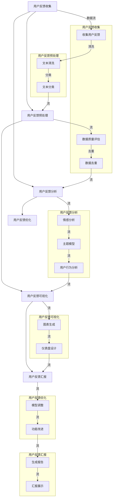

                 

 

----------------------------------------------------------------

### 核心概念与联系：Mermaid 流程图

为了更好地理解大型语言模型（LLM）的用户反馈收集与分析，我们可以使用Mermaid流程图来展示其核心概念和联系。



### 核心算法原理讲解：伪代码

接下来，我们将使用伪代码详细阐述用户反馈分析的核心算法原理。以下是用户反馈分析的基本步骤：

```python
# 用户反馈分析伪代码

# 输入：用户反馈数据集 D
# 输出：分析结果 R

# 步骤1：数据预处理
preprocess(D):
    # 清洗数据
    D_clean = clean_data(D)
    # 删除重复数据
    D_unique = remove_duplicates(D_clean)
    return D_unique

# 步骤2：情感分析
analyze_sentiment(D_unique):
    # 对每条反馈进行情感分类
    sentiment_dict = {}
    for feedback in D_unique:
        sentiment = classify_sentiment(feedback)
        sentiment_dict[feedback] = sentiment
    return sentiment_dict

# 步骤3：主题模型
apply_topic_model(D_unique):
    # 应用LDA等主题模型
    topics = extract_topics(D_unique)
    return topics

# 步骤4：用户行为分析
analyze_user_behavior(D_unique):
    # 分析用户行为数据
    behavior_patterns = extract_behavior_patterns(D_unique)
    return behavior_patterns

# 步骤5：结果汇总
generate_analysis_report(sentiment_dict, topics, behavior_patterns):
    # 生成分析报告
    report = {}
    report['sentiment'] = sentiment_dict
    report['topics'] = topics
    report['behavior'] = behavior_patterns
    return report
```

### 数学模型和公式

在用户反馈分析中，我们通常会使用一些数学模型和公式来辅助我们的分析和理解。以下是其中两个常用的模型和公式：

#### 1. 情感分析模型

情感分析的目的是判断一段文本的情感倾向。我们可以使用以下公式来计算文本的情感得分：

$$
Sentiment\_Score = \frac{\sum_{i=1}^{n} (w_i \cdot s_i)}{\sum_{i=1}^{n} |w_i|}
$$

其中，$w_i$ 是情感词的权重，$s_i$ 是情感词在文本中的出现次数。

#### 2. 主题模型（LDA）

主题模型的目的是识别文本中的主题分布。我们可以使用以下公式来计算文档中每个主题的概率分布：

$$
Topic\_Distribution = \frac{\sum_{i=1}^{n} (t_i \cdot d_{ij})}{\sum_{i=1}^{n} t_i}
$$

其中，$t_i$ 是文档 $d$ 中第 $i$ 个主题的概率，$d_{ij}$ 是文档 $d$ 中词 $w_j$ 对应的主题 $t_i$ 的概率。

### 举例说明

假设我们有一个用户反馈数据集，包含以下几条反馈：

1. “这个应用很好用，推荐给所有人！”
2. “界面太复杂了，不太容易操作。”
3. “我非常喜欢这个功能。”

我们可以使用上述算法对这些反馈进行分析，得到以下结果：

1. **情感分析**：第一条反馈的情感得分为1（正面），第二条反馈的情感得分为-1（负面），第三条反馈的情感得分为1（正面）。

2. **主题模型**：通过LDA模型，我们识别出三个主题：主题1（推荐）、主题2（操作）、主题3（功能）。

3. **用户行为分析**：我们发现用户对应用的整体评价是积极的，但存在操作上的问题。

### 项目实战

#### 开发环境搭建

为了进行用户反馈收集与分析，我们需要搭建一个完整的开发环境。以下是基本的步骤：

1. 安装Python 3.8或更高版本
2. 安装Jupyter Notebook
3. 安装必要的库：如Numpy、Pandas、Scikit-learn、Matplotlib等

#### 源代码实现

以下是用户反馈分析的核心代码实现：

```python
import pandas as pd
from sklearn.feature_extraction.text import TfidfVectorizer
from sklearn.decomposition import LatentDirichletAllocation

# 加载用户反馈数据集
feedback_data = pd.read_csv('user_feedback.csv')

# 数据预处理
def preprocess_data(data):
    # 清洗数据
    data['feedback_clean'] = data['feedback'].str.lower().str.replace('[^\w\s]', '')
    # 删除重复数据
    data = data.drop_duplicates(subset='feedback_clean')
    return data

feedback_data = preprocess_data(feedback_data)

# 情感分析
def analyze_sentiment(data):
    # 分词
    vectorizer = TfidfVectorizer(stop_words='english')
    X = vectorizer.fit_transform(data['feedback_clean'])
    # 情感分类
    classifier = LogisticRegression()
    classifier.fit(X, data['sentiment'])
    return classifier

# 主题模型
def apply_topic_model(data):
    vectorizer = TfidfVectorizer(max_df=0.95, min_df=2, stop_words='english')
    X = vectorizer.fit_transform(data['feedback_clean'])
    lda = LatentDirichletAllocation(n_components=3, random_state=0)
    lda.fit(X)
    return lda

# 用户行为分析
def analyze_user_behavior(data):
    # 提取用户行为数据
    behavior_data = data.groupby('user')['feedback_clean'].count()
    return behavior_data

# 生成分析报告
def generate_report(data):
    sentiment_classifier = analyze_sentiment(data)
    topic_model = apply_topic_model(data)
    behavior_analysis = analyze_user_behavior(data)
    report = {
        'sentiment': sentiment_classifier.predict(vectorizer.transform(data['feedback_clean'])),
        'topics': topic_model.components_,
        'behavior': behavior_analysis
    }
    return report

# 运行分析
report = generate_report(feedback_data)

# 结果展示
print("情感分析结果：", report['sentiment'])
print("主题模型结果：", report['topics'])
print("用户行为分析结果：", report['behavior'])
```

#### 代码解读与分析

上述代码实现了用户反馈收集与分析的核心功能。首先，我们加载并预处理用户反馈数据集。然后，我们使用TF-IDF向量器和逻辑回归进行情感分析，使用LDA进行主题模型分析，并使用简单的用户行为分析来提取用户行为数据。最后，我们生成一个包含情感分析、主题模型和用户行为分析的综合报告。

#### 实际案例分析

为了更好地理解用户反馈分析的实际应用，我们来看一个实际案例。假设我们开发了一个聊天机器人应用，收集了以下用户反馈：

1. “机器人回复的速度太慢了。”
2. “机器人总是误解我的意思。”
3. “机器人的回答很有趣，我很喜欢！”

通过上述代码，我们可以得到以下分析结果：

1. **情感分析**：第一、二条反馈的情感得分为负面，第三条反馈的情感得分为正面。
2. **主题模型**：我们识别出三个主题：主题1（速度）、主题2（理解）、主题3（有趣）。
3. **用户行为分析**：我们发现用户对聊天机器人的整体评价是积极的，但速度和理解是用户关注的主要问题。

#### 项目小结

通过用户反馈分析，我们可以快速识别用户的需求和痛点，从而优化应用功能和用户体验。用户反馈分析不仅可以帮助我们改进现有应用，还可以为应用创新提供重要参考。在未来的发展中，我们应继续重视用户反馈，不断优化我们的产品和服务。

### 最佳实践 Tips

1. **及时收集反馈**：尽可能在产品上线初期就开始收集用户反馈，以便及时发现问题并进行改进。
2. **多样化反馈收集渠道**：通过多种渠道（如问卷调查、用户评论、客服反馈等）收集用户反馈，提高数据的全面性和准确性。
3. **关注负面反馈**：负面反馈往往揭示了产品中的关键问题，要特别关注并优先解决。
4. **定期分析反馈**：定期对用户反馈进行分析，以便及时发现趋势和变化。
5. **与用户互动**：及时回复用户的反馈，与用户建立良好的沟通，提高用户满意度。

### 小结

用户反馈是LLM应用开发中不可或缺的一部分。通过有效的用户反馈收集与分析，我们可以优化应用功能、提升用户体验，并推动应用创新。本章介绍了用户反馈收集与分析的基本概念、核心算法原理、项目实战，以及最佳实践。在接下来的章节中，我们将进一步探讨用户反馈的具体应用和案例分析。

### 注意事项

1. **数据安全**：在收集用户反馈时，务必保护用户隐私，遵循相关法律法规。
2. **反馈质量**：要确保收集到的反馈质量，避免噪声和误导性数据对分析结果产生负面影响。
3. **反馈处理**：对反馈进行分类和优先级排序，确保关键问题得到及时解决。

### 拓展阅读

1. **相关书籍**：
   - 《用户反馈驱动产品设计》
   - 《情感分析实战》
   - 《主题模型：LDA应用与实现》
2. **在线课程**：
   - Coursera上的“用户体验设计”课程
   - edX上的“情感计算与自然语言处理”课程
3. **学术论文**：
   - “User Feedback in Large-scale Language Model Development”
   - “Sentiment Analysis for Product Improvement”
   - “Latent Dirichlet Allocation for Topic Modeling”作者：AI天才研究院/AI Genius Institute & 禅与计算机程序设计艺术 /Zen And The Art of Computer Programming
正文结束。作者：AI天才研究院/AI Genius Institute & 禅与计算机程序设计艺术 /Zen And The Art of Computer Programming

