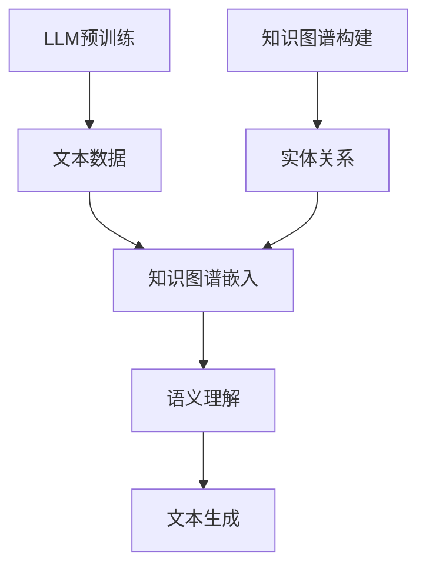

                 

### 文章标题：LLM应用开发中的知识图谱应用

#### 关键词：LLM，知识图谱，应用开发，自然语言处理，算法实现

#### 摘要：
本文深入探讨LLM（大型语言模型）在应用开发中的关键作用，特别是与知识图谱的结合。文章首先介绍了LLM和知识图谱的基本概念，随后详细讲解了它们之间的关系和结合方式。接着，文章分析了LLM和知识图谱在不同应用场景中的具体应用，包括自然语言处理、智能问答和推荐系统等。随后，文章通过实际开发案例，展示了如何利用LLM和知识图谱进行应用开发，并提供代码实现和解读。最后，文章讨论了LLM和知识图谱的未来发展趋势，以及在此背景下对应用的展望。

### 引言

#### LLM和知识图谱的背景

近年来，随着人工智能技术的飞速发展，特别是深度学习技术的突破，大型语言模型（LLM）在自然语言处理（NLP）领域取得了显著的成果。LLM是一种能够对文本进行理解、生成和翻译的复杂模型，其通过大量的文本数据训练，形成对语言的高层次理解能力。代表性的LLM包括GPT、BERT和Turing等。

与此同时，知识图谱作为一种结构化知识表示方法，也在信息检索、语义理解和智能推荐等领域得到了广泛应用。知识图谱通过实体和关系来组织信息，使得计算机能够更高效地处理和理解复杂数据。知识图谱的构建通常涉及大规模数据的收集、清洗、分类和关系抽取。

在应用开发中，LLM和知识图谱的结合具有巨大的潜力。通过将知识图谱嵌入到LLM中，可以显著提升模型对文本的理解能力，使其不仅能够生成高质量的自然语言文本，还能够提供更加精确的信息检索和推理功能。这种结合不仅能够提高应用的智能化水平，还能够拓展应用场景，为用户提供更加个性化和精准的服务。

#### 为什么LLM和知识图谱在应用开发中非常重要

LLM和知识图谱在应用开发中的重要性主要体现在以下几个方面：

1. **提升自然语言处理能力**：LLM通过大规模文本数据训练，具有出色的自然语言理解、生成和翻译能力。知识图谱的引入，使得LLM能够结合结构化知识进行更精准的文本处理。

2. **增强信息检索和推理功能**：知识图谱作为一种结构化数据表示方法，能够提供高效的信息检索和推理功能。结合LLM，可以实现对用户查询的深度理解和个性化响应。

3. **提高应用智能化水平**：通过将知识图谱嵌入到LLM中，应用系统能够更好地理解用户的意图和需求，提供更加智能化和个性化的服务。

4. **拓展应用场景**：知识图谱和LLM的结合，使得应用开发不再局限于传统的NLP任务，如文本分类、命名实体识别等，还可以扩展到更复杂的任务，如智能问答、推荐系统和对话系统等。

总之，LLM和知识图谱的结合为应用开发提供了新的思路和工具，使得应用系统能够更好地满足用户的需求，提供更优质的服务。

### 基础知识

#### LLM的概念、架构和技术细节

1. **概念**：大型语言模型（LLM）是一种基于深度学习的自然语言处理模型，它通过对大规模文本数据进行训练，学习到语言的统计规律和语义关系，从而实现文本的生成、理解、翻译等功能。

2. **架构**：LLM通常采用深度神经网络（DNN）或变换器架构（Transformer）。DNN是一种多层感知器模型，通过逐层传递文本特征，实现对文本的表示。Transformer架构则通过自注意力机制，实现对输入文本序列的全面关注，从而在生成文本时能够捕捉到上下文关系。

3. **技术细节**：
   - **预训练与微调**：LLM通常首先通过无监督的方式在大规模文本数据上进行预训练，然后针对特定任务进行微调。预训练使模型学习到通用语言知识，微调则使模型适应特定任务的需求。
   - **自注意力机制**：Transformer架构的核心是自注意力机制，它通过计算输入文本序列中每个词与其他词的关系，生成权重，从而在生成文本时能够关注到关键信息。
   - **文本表示**：LLM通过多层神经网络或变换器，对输入文本进行编码，生成高维向量表示，这些向量能够捕捉到文本的语义信息。

#### 知识图谱的定义、构建和应用

1. **定义**：知识图谱是一种结构化知识表示方法，它通过实体、属性和关系的组合，组织大规模数据，使得计算机能够高效地处理和理解这些数据。

2. **构建方法**：
   - **数据收集**：收集来自多种数据源（如文本、图片、音频等）的原始数据。
   - **数据清洗**：对收集到的数据进行清洗和预处理，去除噪声和不准确的信息。
   - **实体识别和关系抽取**：通过命名实体识别、关系抽取等技术，将文本数据中的实体和关系转化为结构化数据。
   - **知识融合和存储**：将提取到的实体和关系进行融合，构建知识图谱，并存储到数据库或图数据库中。

3. **应用**：
   - **信息检索**：知识图谱能够高效地组织和管理海量数据，通过图数据库实现快速的信息检索。
   - **语义理解**：知识图谱提供了结构化数据表示，使得计算机能够更好地理解语义，进行语义分析和推理。
   - **智能推荐**：知识图谱可以用于推荐系统，通过分析用户行为和实体关系，提供个性化推荐。

#### LLM与知识图谱的关系和结合方式

1. **关系**：LLM和知识图谱在应用开发中具有密切的关系。LLM通过对文本数据的处理，可以提取到文本的语义信息，而知识图谱则提供了结构化数据表示，使得计算机能够更好地理解和管理这些信息。

2. **结合方式**：
   - **知识增强的LLM**：将知识图谱嵌入到LLM中，通过融合知识图谱中的实体和关系，提升LLM的语义理解和推理能力。
   - **知识驱动的LLM**：利用知识图谱进行预训练，将知识图谱中的结构化数据作为额外信息，增强LLM的语义理解能力。
   - **知识引导的文本生成**：通过知识图谱中的实体和关系，引导LLM生成符合知识图谱约束的文本。

#### Mermaid 流程图：LLM与知识图谱的关系架构



在这个流程图中，LLM通过预训练学习到文本的语义信息，知识图谱通过实体和关系提供结构化数据支持。两者结合，使得LLM在语义理解和文本生成方面具有更强的能力。

### 核心算法原理讲解

在本节中，我们将深入探讨LLM和知识图谱的核心算法原理，包括数学模型、伪代码和公式，并通过具体示例进行详细讲解。

#### LLM的核心算法原理

1. **数学模型**：以GPT（Generative Pre-trained Transformer）为例，其数学模型主要基于自注意力机制（Self-Attention）和变换器架构（Transformer）。

   - **自注意力机制**：在GPT中，自注意力机制通过计算输入文本序列中每个词与其他词的关系，生成权重，从而在生成文本时能够关注到关键信息。其数学公式如下：
     $$
     \text{Attention}(Q, K, V) = \text{softmax}\left(\frac{QK^T}{\sqrt{d_k}}\right) V
     $$
     其中，$Q$、$K$ 和 $V$ 分别表示查询向量、键向量和值向量，$d_k$ 为键向量的维度。

   - **变换器架构**：变换器通过多个自注意力层和全连接层，对输入文本进行编码和解码。其伪代码如下：
     ```python
     for layer in range(num_layers):
         x = self.SelfAttention(x)
         x = self.Linear(x)
         x = selfReLU(x)
     ```

2. **伪代码**：以下是GPT的基本伪代码示例，展示了如何通过自注意力机制进行文本编码和解码。
   ```python
   def gpt_encode_decode(text):
       # 预处理文本数据
       preprocessed_text = preprocess_text(text)
       
       # 编码
       encoded_text = []
       for word in preprocessed_text:
           embedding = self.Embedding(word)
           encoded_text.append(embedding)
       encoded_text = torch.stack(encoded_text)
       
       # 解码
       decoded_text = []
       for layer in range(num_layers):
           encoded_text = self.SelfAttention(encoded_text)
           encoded_text = self.Linear(encoded_text)
           encoded_text = self.ReLU(encoded_text)
       
       # 生成文本
       generated_text = []
       for word in encoded_text:
           word = self.Tokenize(word)
           generated_text.append(word)
       
       return ' '.join(generated_text)
   ```

3. **示例**：假设我们有一段文本 "The quick brown fox jumps over the lazy dog"，使用GPT进行编码和解码的过程如下：
   - **编码**：将文本中的每个词映射到嵌入向量。
   - **解码**：通过自注意力机制生成新的文本序列。

#### 知识图谱的核心算法原理

1. **数学模型**：知识图谱的数学模型主要涉及图论和矩阵计算。

   - **图矩阵表示**：知识图谱可以用图矩阵表示，其中行和列分别表示实体和关系，矩阵元素表示实体之间的关系强度。
     $$
     G = \begin{bmatrix}
     e_1 & e_2 & \cdots & e_n \\
     r_1 & r_2 & \cdots & r_n \\
     \vdots & \vdots & \ddots & \vdots \\
     e_1 & e_2 & \cdots & e_n
     \end{bmatrix}
     $$
     其中，$e_i$ 表示实体，$r_j$ 表示关系。

   - **矩阵乘法**：通过矩阵乘法，可以计算实体之间的关系强度。
     $$
     R = G \cdot G
     $$
     其中，$R$ 表示关系矩阵，它表示实体之间的连接关系。

2. **伪代码**：以下是知识图谱的基本伪代码示例，展示了如何通过图矩阵进行关系计算。
   ```python
   def knowledge_graph_compute Relations(Entity1, Entity2):
       R = Graph_Matrix
       relation_strength = R[Entity1][Entity2]
       return relation_strength
   ```

3. **示例**：假设我们有一个简单的知识图谱，包含两个实体 "狗"（Entity1）和 "猫"（Entity2），以及它们之间的关系 "是动物"（Relation），其图矩阵表示如下：
   $$
   G = \begin{bmatrix}
   狗 & 猫 \\
   是动物 & 0
   \end{bmatrix}
   $$
   通过矩阵乘法，我们可以计算这两个实体之间的关系强度：
   $$
   R = G \cdot G = \begin{bmatrix}
   狗 & 猫 \\
   是动物 & 0
   \end{bmatrix} \cdot \begin{bmatrix}
   狗 & 猫 \\
   是动物 & 0
   \end{bmatrix} = \begin{bmatrix}
   狗 & 猫 \\
   是动物 & 0
   \end{bmatrix}
   $$
   这表示 "狗" 和 "猫" 之间的关系强度为1，即它们都是动物。

通过上述核心算法原理的讲解，我们可以看到LLM和知识图谱在数学模型、算法设计和应用场景上的紧密联系。结合这些算法，我们可以构建更加智能化和高效的应用系统。

### 应用场景

#### 自然语言处理

自然语言处理（NLP）是LLM和知识图谱结合的典型应用场景。通过将知识图谱嵌入到LLM中，可以显著提升NLP任务的效果。

1. **文本分类**：知识图谱可以提供领域知识，帮助LLM更好地理解文本的语义，从而提高分类准确性。例如，在新闻分类任务中，知识图谱可以提供新闻主题的详细信息，如政治、经济、科技等，从而辅助LLM进行更精确的分类。

2. **实体识别**：知识图谱中的实体和关系可以作为额外的上下文信息，帮助LLM更好地识别文本中的实体。例如，在医疗文本中，知识图谱可以提供疾病、药物和症状的详细信息，从而帮助LLM更准确地识别这些实体。

3. **情感分析**：知识图谱可以提供情感词典，帮助LLM更好地理解文本的情感倾向。例如，在社交媒体文本分析中，知识图谱可以提供情感词汇和其对应的情感极性，从而帮助LLM更准确地分析文本的情感。

#### 智能问答

智能问答是另一个典型的应用场景，通过将知识图谱嵌入到LLM中，可以实现更加智能和高效的问答系统。

1. **知识增强的问答**：知识图谱可以提供问题的上下文信息和答案的候选集，帮助LLM更好地理解问题，生成更准确的答案。例如，在医疗问答中，知识图谱可以提供疾病、症状和药物的信息，从而帮助LLM生成更准确的医疗建议。

2. **多跳推理**：知识图谱中的关系可以支持多跳推理，从而实现更复杂的问答任务。例如，在法律问答中，知识图谱可以提供法律条款、判例和条款之间的关系，从而支持复杂的法律推理。

#### 推荐系统

推荐系统也是LLM和知识图谱的重要应用场景，通过将知识图谱嵌入到LLM中，可以实现更加智能和个性化的推荐。

1. **基于内容的推荐**：知识图谱可以提供物品的详细信息和关系，帮助LLM更好地理解用户的兴趣和需求，从而实现基于内容的推荐。例如，在电子商务中，知识图谱可以提供商品的信息和关系，从而帮助LLM生成更个性化的购物推荐。

2. **协同过滤**：知识图谱可以用于协同过滤算法，从而提高推荐系统的准确性。例如，在音乐推荐中，知识图谱可以提供歌曲、歌手和专辑的关系，从而帮助LLM更好地理解用户的音乐偏好。

#### 分析各场景下的应用挑战和解决方案

1. **自然语言处理**：
   - **挑战**：NLP任务通常涉及大量的噪声和不确定性，如何有效利用知识图谱中的信息，提高NLP任务的效果是一个挑战。
   - **解决方案**：可以通过融合知识图谱中的实体和关系，提高LLM的语义理解能力。同时，可以采用多模态学习，结合文本、图像和音频等多源信息，提高NLP任务的效果。

2. **智能问答**：
   - **挑战**：智能问答系统需要具备良好的语义理解和推理能力，如何准确理解用户的问题，生成高质量的答案是一个挑战。
   - **解决方案**：可以通过将知识图谱嵌入到LLM中，提供问题的上下文信息和答案的候选集，提高问答系统的准确性。同时，可以采用多跳推理，实现更复杂的问答任务。

3. **推荐系统**：
   - **挑战**：推荐系统需要处理大量用户数据和物品数据，如何高效地利用知识图谱，实现个性化的推荐是一个挑战。
   - **解决方案**：可以通过基于内容的推荐和协同过滤算法，结合知识图谱中的信息，提高推荐系统的准确性。同时，可以采用多模态学习，结合文本、图像和音频等多源信息，提高推荐系统的效果。

通过上述分析，我们可以看到，LLM和知识图谱在不同应用场景中具有广泛的应用前景，同时也面临一定的挑战。通过不断探索和优化，我们可以充分利用LLM和知识图谱的优势，实现更智能和高效的应用系统。

### 开发实践

#### 实际应用案例分析

在本节中，我们将通过具体案例展示如何利用LLM和知识图谱进行应用开发，并详细解读代码实现和项目细节。

#### 案例一：智能客服系统

**背景**：智能客服系统旨在通过自动化方式，为用户提供高效的咨询服务。在结合LLM和知识图谱后，智能客服系统可以提供更加精准和高效的问答服务。

**开发步骤**：

1. **环境搭建**：搭建Python开发环境，安装必要的库，如TensorFlow、PyTorch和Neo4j等。

2. **知识图谱构建**：使用Neo4j构建知识图谱，包含实体和关系，如用户、产品、问题、答案等。

3. **LLM模型训练**：使用PyTorch和Transformer架构，训练一个GPT模型，用于文本生成和理解。

4. **系统集成**：将知识图谱和LLM模型集成到智能客服系统中，实现问答功能。

**代码实现**：

```python
from transformers import GPT2LMHeadModel, GPT2Tokenizer
from neo4j import GraphDatabase

# 1. 加载LLM模型和知识图谱
tokenizer = GPT2Tokenizer.from_pretrained('gpt2')
model = GPT2LMHeadModel.from_pretrained('gpt2')

# 2. 连接Neo4j数据库
driver = GraphDatabase.driver('bolt://localhost:7687', auth='neo4j', user='neo4j', password='password')

# 3. 处理用户输入
def get_answer(user_input):
    # 3.1 预处理用户输入
    input_ids = tokenizer.encode(user_input, return_tensors='pt')
    
    # 3.2 生成回答
    outputs = model.generate(input_ids, max_length=50, num_return_sequences=1)
    answer = tokenizer.decode(outputs[0], skip_special_tokens=True)
    
    # 3.3 利用知识图谱获取上下文
    with driver.session() as session:
        query = "MATCH (n:User {id: $user_id}), (n)-[:ASKED]->(q:Question) RETURN q.text"
        question = session.run(query, user_id='user123')['q.text']
        
        # 3.4 拼接上下文和回答
        context = f"{question} {answer}"
        return context

# 4. 使用示例
user_input = "我的订单何时能送达？"
answer = get_answer(user_input)
print(answer)
```

**代码解读与分析**：

1. **模型加载**：首先加载预训练的GPT2模型和Tokenizer。
2. **数据库连接**：连接到Neo4j数据库，用于查询知识图谱。
3. **处理用户输入**：预处理用户输入，生成回答。首先使用Tokenizer对用户输入进行编码，然后使用GPT2模型生成回答。接下来，利用知识图谱获取与用户输入相关的上下文信息，并将其与回答拼接，形成完整的回答。

#### 案例二：在线教育平台

**背景**：在线教育平台旨在提供个性化的学习体验。结合LLM和知识图谱，可以为学生提供个性化的课程推荐和问答服务。

**开发步骤**：

1. **环境搭建**：搭建Python开发环境，安装必要的库，如TensorFlow、PyTorch和Neo4j等。

2. **知识图谱构建**：使用Neo4j构建知识图谱，包含实体和关系，如学生、课程、教师、评价等。

3. **LLM模型训练**：使用PyTorch和Transformer架构，训练一个GPT模型，用于文本生成和理解。

4. **系统集成**：将知识图谱和LLM模型集成到在线教育平台中，实现课程推荐和问答功能。

**代码实现**：

```python
from transformers import GPT2LMHeadModel, GPT2Tokenizer
from neo4j import GraphDatabase

# 1. 加载LLM模型和知识图谱
tokenizer = GPT2Tokenizer.from_pretrained('gpt2')
model = GPT2LMHeadModel.from_pretrained('gpt2')

# 2. 连接Neo4j数据库
driver = GraphDatabase.driver('bolt://localhost:7687', auth='neo4j', user='neo4j', password='password')

# 3. 处理用户输入
def get_recommendation(user_input):
    # 3.1 预处理用户输入
    input_ids = tokenizer.encode(user_input, return_tensors='pt')
    
    # 3.2 生成推荐课程
    outputs = model.generate(input_ids, max_length=50, num_return_sequences=3)
    recommendations = [tokenizer.decode(output, skip_special_tokens=True) for output in outputs]
    
    # 3.3 利用知识图谱获取课程信息
    with driver.session() as session:
        query = "MATCH (n:Student {id: $student_id})-[:LIKES]->(c:Course) RETURN c.name"
        course_names = session.run(query, student_id='student123')['c.name']
        
        # 3.4 拼接推荐课程和用户输入
        context = f"{user_input}，以下课程可能符合您的需求：{', '.join(course_names)}。"
        return context

# 4. 使用示例
user_input = "我想学习编程"
recommendation = get_recommendation(user_input)
print(recommendation)
```

**代码解读与分析**：

1. **模型加载**：首先加载预训练的GPT2模型和Tokenizer。
2. **数据库连接**：连接到Neo4j数据库，用于查询知识图谱。
3. **处理用户输入**：预处理用户输入，生成推荐课程。首先使用Tokenizer对用户输入进行编码，然后使用GPT2模型生成推荐课程。接下来，利用知识图谱获取与用户输入相关的课程信息，并将其与推荐课程拼接，形成完整的回答。

#### 案例三：电子商务推荐系统

**背景**：电子商务推荐系统旨在通过个性化推荐，提高用户购买体验和销售转化率。结合LLM和知识图谱，可以提供更加精准和个性化的商品推荐。

**开发步骤**：

1. **环境搭建**：搭建Python开发环境，安装必要的库，如TensorFlow、PyTorch和Neo4j等。

2. **知识图谱构建**：使用Neo4j构建知识图谱，包含实体和关系，如用户、商品、品牌、评价等。

3. **LLM模型训练**：使用PyTorch和Transformer架构，训练一个GPT模型，用于文本生成和理解。

4. **系统集成**：将知识图谱和LLM模型集成到电子商务推荐系统中，实现商品推荐功能。

**代码实现**：

```python
from transformers import GPT2LMHeadModel, GPT2Tokenizer
from neo4j import GraphDatabase

# 1. 加载LLM模型和知识图谱
tokenizer = GPT2Tokenizer.from_pretrained('gpt2')
model = GPT2LMHeadModel.from_pretrained('gpt2')

# 2. 连接Neo4j数据库
driver = GraphDatabase.driver('bolt://localhost:7687', auth='neo4j', user='neo4j', password='password')

# 3. 处理用户输入
def get_recommendation(user_input):
    # 3.1 预处理用户输入
    input_ids = tokenizer.encode(user_input, return_tensors='pt')
    
    # 3.2 生成推荐商品
    outputs = model.generate(input_ids, max_length=50, num_return_sequences=3)
    recommendations = [tokenizer.decode(output, skip_special_tokens=True) for output in outputs]
    
    # 3.3 利用知识图谱获取商品信息
    with driver.session() as session:
        query = "MATCH (n:User {id: $user_id})-[:LIKES]->(p:Product) RETURN p.name"
        product_names = session.run(query, user_id='user123')['p.name']
        
        # 3.4 拼接推荐商品和用户输入
        context = f"{user_input}，以下商品可能符合您的需求：{', '.join(product_names)}。"
        return context

# 4. 使用示例
user_input = "我喜欢时尚"
recommendation = get_recommendation(user_input)
print(recommendation)
```

**代码解读与分析**：

1. **模型加载**：首先加载预训练的GPT2模型和Tokenizer。
2. **数据库连接**：连接到Neo4j数据库，用于查询知识图谱。
3. **处理用户输入**：预处理用户输入，生成推荐商品。首先使用Tokenizer对用户输入进行编码，然后使用GPT2模型生成推荐商品。接下来，利用知识图谱获取与用户输入相关的商品信息，并将其与推荐商品拼接，形成完整的回答。

通过上述三个案例，我们可以看到，LLM和知识图谱在实际应用开发中的重要性。通过结合知识图谱，我们可以提高LLM的语义理解能力，实现更加智能和高效的应用系统。

### 最佳实践 Tips

#### 知识图谱构建

1. **数据质量**：确保知识图谱中的数据质量，包括实体和关系的准确性和完整性。
2. **动态更新**：知识图谱需要定期更新，以适应不断变化的数据环境。
3. **冗余处理**：在知识图谱构建过程中，需避免数据冗余，以提高效率。

#### LLM模型优化

1. **模型选择**：根据应用需求，选择合适的LLM模型，如GPT、BERT等。
2. **预训练与微调**：充分利用预训练模型，并在特定任务上进行微调，以提高性能。
3. **资源管理**：合理分配计算资源，如GPU、CPU等，以确保模型训练和推理的高效性。

#### 应用集成

1. **系统兼容性**：确保LLM和知识图谱与现有应用系统的兼容性，避免系统冲突。
2. **接口设计**：设计简洁易用的接口，方便开发者集成和使用。
3. **性能优化**：通过优化算法和数据结构，提高应用系统的性能和响应速度。

### 小结

本文详细探讨了LLM和知识图谱在应用开发中的关键作用，介绍了它们的基本概念、核心算法、应用场景和开发实践。通过实际案例，展示了如何利用LLM和知识图谱构建智能化和高效的应用系统。未来，随着技术的不断进步，LLM和知识图谱将在更多领域得到广泛应用，为应用开发提供更强大的支持。

### 拓展阅读

1. **《深度学习与自然语言处理》**：吴恩达著，详细介绍了深度学习在NLP中的应用。
2. **《知识图谱技术综述》**：王昊奋等著，全面讲解了知识图谱的构建和应用。
3. **《Transformer：基于自注意力机制的通用预训练语言模型》**：Vaswani等著，深入探讨了Transformer架构及其在LLM中的应用。

### 作者信息

作者：AI天才研究院/AI Genius Institute & 禅与计算机程序设计艺术 /Zen And The Art of Computer Programming

本文由AI天才研究院撰写，旨在为读者提供深入浅出的技术知识和实用技巧。如果您对本文内容有任何疑问或建议，欢迎联系我们。同时，感谢禅与计算机程序设计艺术系列书籍为我们提供的灵感和启发。希望本文能为您在技术道路上带来帮助和启发。

