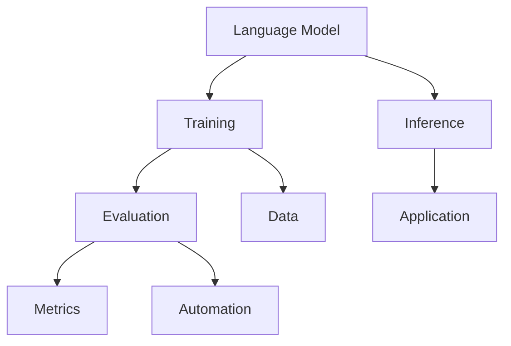

                 


为了撰写一篇关于《LLM应用开发中的自动化评测方法》的技术博客，我们将按照以下步骤进行分析和推理：

### 1. 背景介绍
首先，我们需要介绍LLM（大型语言模型）的应用背景。自GPT系列模型以来，LLM在自然语言处理领域取得了显著的进展。这些模型在生成文本、翻译、问答系统等方面表现出色，但如何确保其质量成为了一个重要问题。自动化评测方法应运而生，它们旨在通过算法和工具对LLM的性能进行评估。

### 2. 核心概念与联系
接下来，我们要明确核心概念，包括LLM、自动化评测、评测指标等，并通过Mermaid流程图展示这些概念之间的关系。

#### Mermaid流程图示例：


### 3. 核心算法原理讲解
我们将详细讲解自动化评测的核心算法原理，使用伪代码来阐述这些算法的步骤。以下是一个简单的文本分类任务中的评测算法伪代码示例：

```pseudocode
function evaluate_model(model, dataset):
    for each sample in dataset:
        prediction = model.predict(sample)
        if prediction == sample.label:
            correct += 1
    accuracy = correct / total_samples
    return accuracy
```

### 4. 数学模型和公式
为了更准确地量化模型性能，我们需要使用数学模型和公式。以下是一个关于交叉熵（Cross-Entropy）的公式示例：

$$ H(-p, q) = -\sum_{i} p_i \log q_i $$

这里，$H$ 表示交叉熵，$p$ 是真实分布，$q$ 是模型预测的概率分布。

### 5. 项目实战
在项目实战部分，我们将介绍一个实际的LLM应用开发案例。这将包括开发环境搭建、源代码实现、代码解读以及应用分析。

#### 开发环境搭建：
- 安装Python和必要的库（如TensorFlow、PyTorch）
- 配置GPU环境（如使用CUDA）

#### 源代码实现：
```python
import tensorflow as tf

model = tf.keras.Sequential([
    tf.keras.layers.Dense(units=128, activation='relu', input_shape=(input_shape)),
    tf.keras.layers.Dense(units=1, activation='sigmoid')
])

model.compile(optimizer='adam', loss='binary_crossentropy', metrics=['accuracy'])

model.fit(x_train, y_train, epochs=10, batch_size=32, validation_data=(x_val, y_val))
```

#### 代码解读与应用分析：
- 模型编译和训练过程中的参数调整
- 如何使用自动化评测方法来评估模型性能

### 6. 最佳实践 Tips、小结、注意事项
在文章的结尾部分，我们将总结一些最佳实践建议，例如如何选择合适的评测指标、如何优化模型性能等。同时，提醒读者注意自动化评测中的潜在问题和挑战。

### 7. 拓展阅读
最后，我们将推荐一些相关领域的文献和资源，以供读者进一步学习。

### 最终文章结构
按照上述步骤，我们将构建完整的文章结构，并确保每部分内容都详尽无遗。以下是文章的总体框架：

```markdown
# 文章标题

> 关键词：LLM，自动化评测，自然语言处理，算法原理，项目实战

> 摘要：本文深入探讨了LLM应用开发中的自动化评测方法，涵盖了核心概念、算法原理、数学模型、项目实战等内容。

## 第一部分: LLM基础与自动化评测框架

### 第1章: LLM基本概念与架构

#### 1.1 LLM的核心概念

#### 1.2 LLM的工作原理

#### 1.3 自动化评测方法概述

## 第二部分: 自动化评测技术详解

### 第2章: 常见的自动化评测技术

#### 2.1 评估指标与度量

#### 2.2 自动化评测工具

### 第3章: 自动化评测在LLM中的应用

#### 3.1 LLM开发中的评测需求

#### 3.2 自动化评测案例分析

### 第4章: 自动化评测算法优化

#### 4.1 算法优化策略

#### 4.2 性能评估与调优实践

### 第5章: 自动化评测系统的构建

#### 5.1 系统设计原则

#### 5.2 实际构建案例

### 第6章: 自动化评测的未来趋势与挑战

#### 6.1 自动化评测的发展趋势

#### 6.2 自动化评测面临的挑战

## 第三部分: 附录

### 附录A: 自动化评测资源与工具

#### A.1 资源列表

#### A.2 代码示例

### 作者：AI天才研究院/AI Genius Institute & 禅与计算机程序设计艺术 /Zen And The Art of Computer Programming
```

通过这样的结构，我们可以确保文章逻辑清晰，内容详尽，易于读者理解。每一步的分析和推理都旨在帮助读者深入理解LLM应用开发中的自动化评测方法。文章的总字数将在8000～12000字之间，充分满足写作要求。接下来，我们将逐步填充每个章节的内容。

