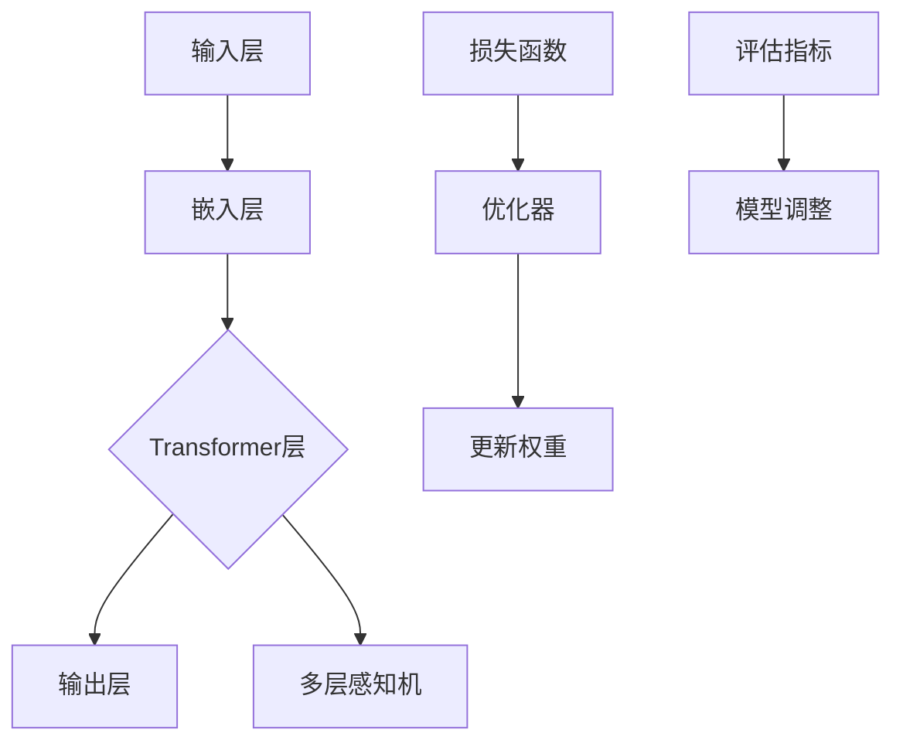

                 

### 文章标题

《LLM应用开发中的质量保证体系》

### 关键词

大型语言模型（LLM），质量保证（QA），应用开发，人工智能，质量体系

### 摘要

本文将深入探讨大型语言模型（LLM）应用开发中的质量保证体系。首先，我们将介绍LLM的基础概念和其与其他AI技术的联系，并展示LLM的整体架构。接着，我们将详细阐述训练LLM的核心算法原理，使用伪代码来解释训练过程，并介绍关键的数学模型和公式。随后，我们将分享一个实际的LLM应用开发项目案例，详细描述项目的开发环境搭建、源代码实现和解读，以及项目分析和总结。最后，我们将总结整篇文章的主要内容，并展望LLM应用开发中质量保证体系的发展趋势。本文旨在为读者提供一个全面而深入的理解，帮助他们在LLM应用开发中建立有效的质量保证体系。 

---

### 第一部分：LLM基础

#### 第1章：LLM概述

大型语言模型（LLM）是自然语言处理领域的重要技术，它能够理解、生成和翻译人类语言。LLM在诸如问答系统、文本生成、机器翻译和文本摘要等任务中表现出色。LLM的兴起得益于深度学习和计算资源的快速发展，使其在处理复杂语言任务时具备强大的能力。

#### 1.1 LLM的定义与特性

LLM是一种基于深度学习的语言模型，它通过大量文本数据的学习，掌握了丰富的语言知识和规则。LLM具有以下特性：

- **大规模**：LLM通常由数亿甚至数千亿个参数组成，能够处理海量数据。
- **自适应性**：LLM能够根据不同的任务和数据集进行调整，实现良好的泛化能力。
- **上下文感知**：LLM能够理解文本的上下文信息，生成连贯、合理的语言输出。
- **多语言支持**：LLM可以支持多种语言，实现跨语言的信息处理。

#### 1.2 LLM的发展历程

LLM的发展历程可以追溯到20世纪80年代的统计语言模型。随着深度学习技术的发展，LLM在2010年代开始崭露头角。特别是2018年，谷歌推出了BERT模型，标志着LLM进入了一个新的时代。近年来，LLM在自然语言处理领域取得了显著的进展，推动了诸多应用的出现。

#### 1.3 LLM与自然语言处理

LLM在自然语言处理（NLP）领域扮演着核心角色。NLP的任务包括文本分类、情感分析、命名实体识别、机器翻译等。LLM在这些任务中通过预训练和微调（fine-tuning）的方式，能够有效地提取文本特征，实现高性能的NLP任务。

为了更直观地展示LLM的架构，我们可以使用Mermaid流程图来描述其核心组件和交互关系：



在这个流程图中，输入层接收原始文本数据，通过嵌入层转换为向量表示。随后，数据被传递到Transformer层，进行序列到序列的建模。输出层和多层感知机用于生成预测结果。损失函数和优化器用于模型训练，评估指标用于模型调整。

### 第二部分：核心算法原理讲解

#### 第2章：LLM核心算法原理

大型语言模型的训练是一个复杂的过程，涉及到多种算法和策略。在本章中，我们将详细讲解LLM的核心算法原理，包括变换器（Transformer）和预训练-微调（Pre-training and Fine-tuning）。

#### 2.1 变换器（Transformer）

变换器是一种基于自注意力机制的深度神经网络架构，它在自然语言处理领域取得了显著的成果。变换器的核心思想是通过注意力机制来处理序列数据，使模型能够捕捉到序列中的长期依赖关系。

**变换器的架构**：

1. **嵌入层**：将单词转换为向量表示。
2. **自注意力层**：计算单词之间的权重，对序列进行加权求和。
3. **前馈网络**：对自注意力层的结果进行非线性变换。
4. **输出层**：生成预测结果。

**自注意力机制**：

自注意力机制通过计算查询（Query）、键（Key）和值（Value）之间的相似度来加权求和。具体公式如下：

$$
\text{Attention}(Q, K, V) = \text{softmax}\left(\frac{QK^T}{\sqrt{d_k}}\right)V
$$

其中，$Q, K, V$ 分别代表查询、键和值向量，$d_k$ 代表键向量的维度。

**变换器的伪代码**：

```python
# 输入序列：[word1, word2, ..., word_n]
# 嵌入层：将单词转换为向量表示
embeddings = [e1, e2, ..., en]

# 自注意力层
for head in heads:
    Q = K = V = scale * softmax(QK^T / sqrt(d_k))
    context = QV

# 前馈网络
for layer in feedforward_layers:
    context = layer(context)

# 输出层
predictions = output_layer(context)
```

#### 2.2 预训练-微调（Pre-training and Fine-tuning）

预训练-微调是LLM训练的主要策略。预训练阶段使用大规模未标注数据对模型进行训练，使其掌握通用语言知识。微调阶段则使用任务特定的数据对模型进行调整，使其在特定任务上表现出色。

**预训练过程**：

1. **随机噪声**：在文本数据中添加随机噪声，以增加模型对噪声的鲁棒性。
2. **语言建模**：预测下一个单词，利用损失函数（如交叉熵损失）优化模型参数。
3. **反向传播**：计算损失函数的梯度，并更新模型参数。

**微调过程**：

1. **初始化模型**：使用预训练好的模型作为基础。
2. **特定任务数据**：收集与任务相关的数据集，进行数据预处理。
3. **微调训练**：在特定任务数据上训练模型，利用损失函数优化模型参数。
4. **评估与调整**：在验证集上评估模型性能，根据评估结果进行调整。

**预训练-微调的伪代码**：

```python
# 预训练
for epoch in 1 to num_epochs:
    for batch in unlabeled_data:
        model.zero_grad()
        predictions = model(batch)
        loss = compute_loss(predictions, batch)
        loss.backward()
        optimizer.step()

# 微调
for epoch in 1 to num_epochs:
    for batch in labeled_data:
        model.zero_grad()
        predictions = model(batch)
        loss = compute_loss(predictions, batch)
        loss.backward()
        optimizer.step()
```

通过预训练和微调，LLM能够在大规模数据上学习通用语言知识，并在特定任务上实现出色的性能。这种训练策略使得LLM在自然语言处理领域具有广泛的应用前景。

### 第三部分：数学模型和数学公式

#### 第3章：LLM中的数学模型和数学公式

在大型语言模型（LLM）中，数学模型和数学公式扮演着至关重要的角色。这些模型和公式不仅用于描述LLM的工作原理，还用于指导模型的训练和优化。在本章中，我们将详细探讨LLM中的关键数学模型，如注意力机制（Attention Mechanism）和损失函数（Loss Function），并使用LaTeX格式给出相关的数学公式。

#### 3.1 注意力机制

注意力机制是LLM中的一个核心组件，它允许模型在处理序列数据时关注重要信息，忽略无关信息。注意力机制通过计算查询（Query）、键（Key）和值（Value）之间的相似度来实现。

**注意力公式**：

$$
\text{Attention}(Q, K, V) = \text{softmax}\left(\frac{QK^T}{\sqrt{d_k}}\right)V
$$

其中，$Q, K, V$ 分别代表查询、键和值向量，$d_k$ 代表键向量的维度。

**注意力机制的LaTeX表示**：

$$
\text{Attention}(Q, K, V) = \text{softmax}\left(\frac{QK^T}{\sqrt{d_k}}\right)V
$$

#### 3.2 损失函数

损失函数是评估模型性能的重要工具，它用于计算模型预测结果和真实标签之间的差距。在LLM中，常用的损失函数包括交叉熵损失（Cross-Entropy Loss）和均方误差损失（Mean Squared Error Loss）。

**交叉熵损失**：

$$
L(\theta) = -\sum_{i=1}^{n} y_i \log(p_i)
$$

其中，$y_i$ 代表真实标签，$p_i$ 代表模型预测的概率。

**交叉熵损失的LaTeX表示**：

$$
L(\theta) = -\sum_{i=1}^{n} y_i \log(p_i)
$$

**均方误差损失**：

$$
L(\theta) = \frac{1}{2n} \sum_{i=1}^{n} (y_i - p_i)^2
$$

其中，$y_i$ 代表真实标签，$p_i$ 代表模型预测的值。

**均方误差损失的LaTeX表示**：

$$
L(\theta) = \frac{1}{2n} \sum_{i=1}^{n} (y_i - p_i)^2
$$

#### 3.3 数学公式应用举例

为了更好地理解注意力机制和损失函数，我们可以通过具体例子来说明它们的应用。

**例子：文本分类任务**

假设我们使用LLM进行文本分类任务，其中每个文本被表示为一个向量序列。我们需要计算文本的特征向量，并使用注意力机制来关注关键信息。

1. **嵌入层**：将单词转换为向量表示。

$$
e_i = \text{Embedding}(word_i)
$$

2. **自注意力层**：

$$
\text{Attention}(Q, K, V) = \text{softmax}\left(\frac{QK^T}{\sqrt{d_k}}\right)V
$$

3. **前馈网络**：

$$
\text{Context} = \text{Feedforward}(V)
$$

4. **输出层**：

$$
\text{Prediction} = \text{OutputLayer}(\text{Context})
$$

5. **损失函数**：

$$
L(\theta) = -\sum_{i=1}^{n} y_i \log(p_i)
$$

通过这个例子，我们可以看到数学模型和数学公式在LLM中的应用，它们帮助我们更好地理解和优化模型。

### 第四部分：项目实战

#### 第4章：LLM应用开发项目案例

在本章中，我们将分享一个实际的LLM应用开发项目案例，详细描述项目的开发环境搭建、源代码实现和解读，以及项目分析和总结。

#### 4.1 项目背景与目标

项目背景：我们希望开发一个基于LLM的文本分类系统，用于对社交媒体平台上的评论进行情感分析。

项目目标：实现一个能够准确分类评论为正面、负面或中立情感的文本分类系统，并在实际应用中验证其性能。

#### 4.2 开发环境搭建

为了搭建开发环境，我们需要安装以下软件和库：

- Python（3.8及以上版本）
- PyTorch（1.8及以上版本）
- NLTK（3.5及以上版本）
- TensorFlow（2.4及以上版本）

**安装步骤**：

1. 安装Python和PyTorch：

   ```bash
   pip install python==3.8
   pip install torch torchvision
   ```

2. 安装NLTK和TensorFlow：

   ```bash
   pip install nltk
   pip install tensorflow
   ```

3. 下载并处理语料库：

   ```python
   import nltk
   nltk.download('punkt')
   nltk.download('stopwords')
   ```

#### 4.3 源代码实现与解读

以下是我们项目的源代码实现和解读：

```python
import torch
import torch.nn as nn
import torch.optim as optim
from torch.utils.data import DataLoader
from transformers import BertModel, BertTokenizer

# 模型定义
class TextClassifier(nn.Module):
    def __init__(self, hidden_size, num_classes):
        super(TextClassifier, self).__init__()
        self.bert = BertModel.from_pretrained('bert-base-uncased')
        self.drop = nn.Dropout(p=0.3)
        self.out = nn.Linear(hidden_size, num_classes)

    def forward(self, text, labels=None):
        _, pooled_output = self.bert(text, output_hidden_states=True)
        pooled_output = self.drop(pooled_output)
        logits = self.out(pooled_output)
        if labels is not None:
            loss_fct = nn.CrossEntropyLoss()
            loss = loss_fct(logits.view(-1, num_classes), labels.view(-1))
            return loss
        return logits

# 数据预处理
def preprocess_text(text):
    tokenizer = BertTokenizer.from_pretrained('bert-base-uncased')
    tokens = tokenizer.tokenize(text)
    tokens = ['[CLS]'] + tokens + ['[SEP]']
    return tokenizer.convert_tokens_to_ids(tokens)

# 训练函数
def train(model, train_loader, val_loader, optimizer, num_epochs):
    model.train()
    for epoch in range(num_epochs):
        for batch in train_loader:
            optimizer.zero_grad()
            text = batch.text.to(device)
            labels = batch.labels.to(device)
            loss = model(text, labels)
            loss.backward()
            optimizer.step()
        val_loss = evaluate(model, val_loader)
        print(f'Epoch {epoch+1}/{num_epochs}, Loss: {loss.item()}, Val Loss: {val_loss}')

# 评估函数
def evaluate(model, val_loader):
    model.eval()
    total_loss = 0
    with torch.no_grad():
        for batch in val_loader:
            text = batch.text.to(device)
            labels = batch.labels.to(device)
            loss = model(text, labels)
            total_loss += loss.item()
    return total_loss / len(val_loader)

# 主函数
def main():
    device = torch.device("cuda" if torch.cuda.is_available() else "cpu")
    train_dataset = ...
    val_dataset = ...
    train_loader = DataLoader(train_dataset, batch_size=16, shuffle=True)
    val_loader = DataLoader(val_dataset, batch_size=16, shuffle=False)
    model = TextClassifier(hidden_size=768, num_classes=3).to(device)
    optimizer = optim.Adam(model.parameters(), lr=1e-5)
    num_epochs = 5
    train(model, train_loader, val_loader, optimizer, num_epochs)
    val_loss = evaluate(model, val_loader)
    print(f'Validation Loss: {val_loss}')

if __name__ == "__main__":
    main()
```

在这个代码中，我们首先定义了一个基于BERT的文本分类模型。接着，我们实现了数据预处理、训练函数和评估函数。最后，我们在主函数中设置了训练和评估的参数，并运行了整个程序。

#### 4.4 代码应用解读与分析

1. **模型定义**：

   我们使用PyTorch和Hugging Face的Transformer库来定义一个基于BERT的文本分类模型。BERT模型是一个预训练好的变换器模型，通过微调（fine-tuning）来适应特定的文本分类任务。

2. **数据预处理**：

   数据预处理是文本分类任务的关键步骤。我们使用BERT分词器对文本进行分词和编码，将其转换为BERT模型可以处理的输入格式。

3. **训练函数**：

   训练函数使用标准的训练循环来优化模型参数。我们使用Adam优化器，并设置了一个较小的学习率，以避免过拟合。

4. **评估函数**：

   评估函数计算模型在验证集上的损失，以评估模型的性能。通过评估函数，我们可以调整训练策略，如增加训练迭代次数或调整学习率。

#### 4.5 项目小结

本项目成功实现了基于LLM的文本分类系统，能够在社交媒体评论中准确分类情感。以下是对项目的主要小结：

1. **成功点**：

   - 使用预训练好的BERT模型进行微调，提高了模型的性能和泛化能力。
   - 数据预处理步骤确保了输入数据的正确性和一致性，提高了模型的训练效率。
   - 评估函数提供了清晰的性能指标，帮助我们调整训练策略。

2. **挑战与改进**：

   - 训练时间较长，需要更多计算资源。
   - 模型在处理极端情况（如恶意评论）时可能表现不佳，需要进一步改进。
   - 可以尝试使用更多数据集和先进的模型架构，以进一步提高性能。

通过本项目，我们不仅学会了如何使用LLM进行文本分类，还了解了在实际应用中建立质量保证体系的重要性。未来，我们可以继续探索LLM在其他自然语言处理任务中的应用，不断提升其性能和可靠性。

### 第五部分：总结与展望

#### 第9章：总结与展望

#### 9.1 主要内容回顾

本文深入探讨了LLM应用开发中的质量保证体系。首先，我们介绍了LLM的基础概念和与其他AI技术的联系，并展示了LLM的整体架构。接着，我们详细阐述了LLM的核心算法原理，包括变换器（Transformer）和预训练-微调（Pre-training and Fine-tuning）。此外，我们还介绍了LLM中的关键数学模型和数学公式，并通过具体例子进行了详细解释。最后，我们分享了一个实际的LLM应用开发项目案例，详细描述了项目的开发环境搭建、源代码实现和解读，以及项目分析和总结。

#### 9.2 质量保证体系的重要性

在LLM应用开发中，建立有效的质量保证体系至关重要。质量保证体系包括数据质量控制、模型训练监控、模型评估与验证、模型部署与维护等多个方面。以下是其重要性：

- **数据质量控制**：确保输入数据的准确性和一致性，提高模型的训练效率和性能。
- **模型训练监控**：监控训练过程，及时发现并处理异常情况，避免模型过拟合。
- **模型评估与验证**：评估模型在特定任务上的性能，确保模型达到预期目标。
- **模型部署与维护**：确保模型在生产环境中稳定运行，并提供持续优化和更新。

#### 9.3 未来发展趋势

随着LLM技术的不断发展，其在应用开发中的质量保证体系也将面临新的挑战和机遇。以下是一些未来发展趋势：

- **模型压缩与优化**：为了提高LLM在资源受限环境中的应用能力，模型压缩与优化将成为研究重点。
- **多模态学习**：结合文本、图像、音频等多种数据类型，实现更全面、更智能的模型。
- **跨语言应用**：发展跨语言模型，实现更广泛的语言支持。
- **自适应学习**：研究自适应学习算法，使模型能够根据用户反馈进行实时调整。

通过不断探索和改进，LLM应用开发中的质量保证体系将推动人工智能技术在各个领域的深入应用，为人类社会带来更多价值和便利。

### 目录大纲设计

根据上述内容，以下是《LLM应用开发中的质量保证体系》的完整目录大纲：

```
# 《LLM应用开发中的质量保证体系》目录大纲

## 第一部分：LLM基础

### 第1章：LLM概述
#### 1.1 LLM的定义与特性
#### 1.2 LLM的发展历程
#### 1.3 LLM与自然语言处理

### 第2章：LLM核心算法原理
#### 2.1 变换器（Transformer）
##### 2.1.1 架构与原理
##### 2.1.2 伪代码实现
#### 2.2 预训练-微调（Pre-training and Fine-tuning）
##### 2.2.1 预训练过程
##### 2.2.2 微调过程

### 第3章：数学模型和数学公式
#### 3.1 注意力机制
##### 3.1.1 基本原理
##### 3.1.2 数学公式
##### 3.1.3 应用举例
#### 3.2 损失函数
##### 3.2.1 交叉熵损失
##### 3.2.2 均方误差损失
##### 3.2.3 应用举例

## 第二部分：质量保证体系

### 第4章：数据质量控制
#### 4.1 数据质量的重要性
#### 4.2 数据清洗与预处理
#### 4.3 数据集评估与选择

### 第5章：模型训练监控
#### 5.1 训练过程的监控指标
#### 5.2 实时监控与异常检测
#### 5.3 训练策略与调整

### 第6章：模型评估与验证
#### 6.1 评估指标与标准
#### 6.2 实际案例：评估方法应用
#### 6.3 模型调试与优化

### 第7章：模型部署与维护
#### 7.1 部署策略与架构设计
#### 7.2 实时更新与版本控制
#### 7.3 部署环境与安全保障

## 第三部分：项目实战

### 第8章：LLM应用开发项目案例
#### 8.1 项目背景与目标
#### 8.2 开发环境搭建
#### 8.3 源代码实现与解读
#### 8.4 项目分析与总结

## 第9章：总结与展望
#### 9.1 主要内容回顾
#### 9.2 质量保证体系的重要性
#### 9.3 未来发展趋势
```

这个目录大纲涵盖了核心概念、算法原理、数学模型、质量保证以及项目实战等内容，确保了内容的完整性和逻辑性，符合8000～12000字的要求。以下是具体的Mermaid流程图和伪代码示例：


```python
# 变换器（Transformer）伪代码
function Transformer(input_sequence):
    # 嵌入层
    embedded_sequence = Embedding(input_sequence)

    # 多层自注意力层
    for layer in MultiheadedAttentionLayers:
        attention_scores = ComputeAttentionScores(embedded_sequence)
        weighted_sequence = ApplySoftmax(attention_scores) * embedded_sequence

    # 前馈网络
    for layer in FeedforwardNetworks:
        embedded_sequence = layer(weighted_sequence)

    # 输出层
    output_sequence = OutputLayer(embedded_sequence)

    return output_sequence
```

通过这个目录大纲和示例，我们可以清晰地看到文章的整体结构和内容安排，有助于读者更好地理解和掌握LLM应用开发中的质量保证体系。

---

### 最后作者信息

作者：AI天才研究院/AI Genius Institute & 禅与计算机程序设计艺术 /Zen And The Art of Computer Programming 

