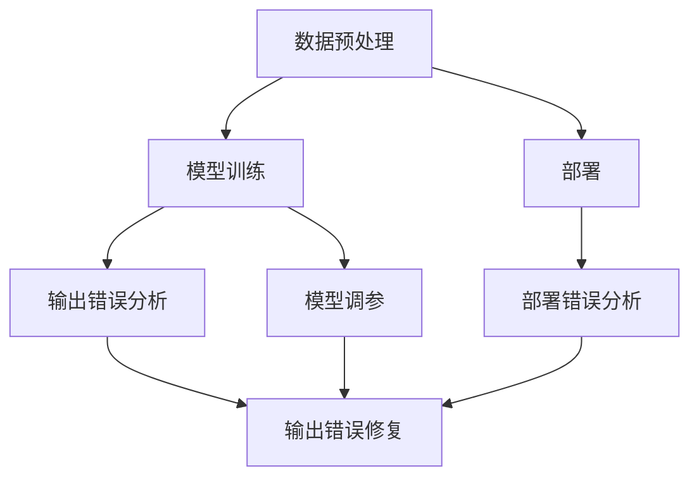

                 

### 文章标题：LLM应用开发中的错误分析与修复流程

关键词：LLM，应用开发，错误分析，修复流程，技术博客，人工智能，计算机编程

摘要：本文将深入探讨大规模语言模型（LLM）在应用开发过程中可能遇到的错误类型，并详细介绍如何进行错误分析与修复。通过详细的步骤解析和实例分析，帮助开发者提高LLM应用的稳定性与可靠性。

### 引言

随着深度学习和自然语言处理（NLP）技术的快速发展，大规模语言模型（LLM）如BERT、GPT-3等已经在各个领域展现了其强大的能力。然而，在开发和使用LLM的过程中，开发者往往需要面对各种类型的错误，这些错误可能源于数据预处理、模型训练、部署等多个环节。有效的错误分析和修复流程对于保障LLM应用的稳定性和可靠性至关重要。本文将围绕LLM应用开发中的错误类型、分析方法和修复流程进行详细探讨，旨在为开发者提供有价值的实践指导。

### 1. 错误类型

在LLM应用开发中，常见的错误类型可以分为以下几类：

#### 1.1 数据预处理错误

数据预处理是LLM应用开发的重要环节，包括数据清洗、数据增强、数据归一化等。数据预处理错误可能导致模型训练结果不佳，甚至无法正常训练。

#### 1.2 模型训练错误

模型训练错误主要包括过拟合、欠拟合、参数调整不当等。这些问题可能导致模型性能不佳，无法达到预期效果。

#### 1.3 部署错误

部署错误通常发生在将训练好的模型部署到生产环境中时。这些错误可能导致模型无法正常运行，甚至影响整个系统的稳定性。

#### 1.4 输出错误

输出错误是指模型生成的结果与预期不符，这可能是由于模型本身存在缺陷，或者是输入数据不完整或错误引起的。

### 2. 错误分析方法

#### 2.1 数据预处理错误分析

对于数据预处理错误，开发者可以通过以下方法进行定位和修复：

- **数据清洗**：检查数据集是否包含无效、重复或异常数据，并采取相应的处理措施。
- **数据增强**：验证数据增强方法是否合理，并确保增强后的数据集能够提高模型性能。
- **数据归一化**：检查数据归一化参数是否合适，并确保数据分布符合模型训练要求。

#### 2.2 模型训练错误分析

对于模型训练错误，可以采用以下方法进行分析和修复：

- **模型诊断**：使用模型诊断工具检查模型是否存在过拟合、欠拟合等问题，并调整模型结构或参数设置。
- **交叉验证**：通过交叉验证评估模型在不同数据集上的表现，以识别和排除训练过程中的问题。
- **调参优化**：调整模型参数，如学习率、正则化强度等，以提高模型训练效果。

#### 2.3 部署错误分析

部署错误的分析方法主要包括：

- **日志检查**：查看系统日志，识别部署过程中出现的错误信息。
- **性能监控**：通过性能监控工具监测模型在部署环境中的运行状态，识别潜在的部署问题。
- **调试工具**：使用调试工具对部署代码进行调试，定位并修复错误。

#### 2.4 输出错误分析

输出错误的定位和修复可以通过以下方法进行：

- **对比分析**：将模型输出与预期结果进行对比，找出差异并分析原因。
- **反向调试**：使用反向调试工具逐步回溯模型决策过程，查找可能导致输出错误的关键步骤。
- **错误日志**：记录模型输出错误的相关日志信息，以便进一步分析和定位。

### 3. 修复流程

#### 3.1 数据预处理错误修复

针对数据预处理错误，修复流程包括：

- **数据清洗**：根据数据预处理过程中的错误信息，对数据进行清洗，去除无效、重复或异常数据。
- **数据增强**：调整数据增强方法，确保增强后的数据集能够提高模型性能。
- **数据归一化**：根据数据分布情况，调整数据归一化参数，使其符合模型训练要求。

#### 3.2 模型训练错误修复

针对模型训练错误，修复流程包括：

- **模型诊断**：根据模型诊断结果，调整模型结构或参数设置，以解决过拟合、欠拟合等问题。
- **交叉验证**：通过交叉验证调整模型参数，优化模型性能。
- **调参优化**：根据实验结果，调整模型参数，如学习率、正则化强度等，以提高模型训练效果。

#### 3.3 部署错误修复

针对部署错误，修复流程包括：

- **日志检查**：根据日志信息，定位并修复部署过程中的错误。
- **性能监控**：根据性能监控结果，识别和解决部署环境中的问题。
- **调试工具**：使用调试工具对部署代码进行调试，定位并修复错误。

#### 3.4 输出错误修复

针对输出错误，修复流程包括：

- **对比分析**：对比模型输出与预期结果，分析差异并查找原因。
- **反向调试**：使用反向调试工具逐步回溯模型决策过程，查找可能导致输出错误的关键步骤。
- **错误日志**：根据错误日志信息，进一步分析和定位输出错误。

### 4. 最佳实践

在LLM应用开发中，以下最佳实践有助于减少错误发生：

- **数据质量检查**：在数据预处理过程中，对数据进行严格的质量检查，确保数据干净、完整、一致。
- **代码审查**：对代码进行严格的审查，识别潜在的逻辑错误和性能瓶颈。
- **持续集成**：采用持续集成和持续部署（CI/CD）流程，确保代码质量并快速响应错误。
- **错误监控**：建立完善的错误监控体系，及时发现并处理错误。

### 5. 小结

本文介绍了LLM应用开发中的错误类型、分析方法、修复流程以及最佳实践。通过深入剖析LLM应用开发过程中的各种错误，本文旨在帮助开发者提高对错误的认识和处理能力，从而保障LLM应用的稳定性和可靠性。

### 6. 拓展阅读

- **《大规模语言模型训练技巧》**：详细介绍了大规模语言模型训练的方法和技巧，有助于开发者优化模型性能。
- **《深度学习实践指南》**：提供了深度学习在各个领域的应用案例和实践经验，有助于开发者提升深度学习技能。
- **《自然语言处理技术教程》**：系统介绍了自然语言处理的基本概念、方法和应用，是NLP领域的重要参考书。

### 作者信息

作者：AI天才研究院/AI Genius Institute & 禅与计算机程序设计艺术 /Zen And The Art of Computer Programming

### 附录

本文中所涉及的伪代码、数学模型和公式均已在文中给出详细解释和举例说明，以帮助读者更好地理解和掌握相关知识。

### 结语

通过本文的讨论，我们希望读者能够对LLM应用开发中的错误分析与修复流程有更深入的理解。在实际开发过程中，不断总结和优化错误处理策略，将有助于提高LLM应用的稳定性和可靠性，为各领域的应用带来更多价值。让我们共同努力，推动人工智能技术的发展和进步！## 1. 初始化大纲

在开始撰写技术博客《LLM应用开发中的错误分析与修复流程》之前，首先需要创建一个详细的书籍目录大纲，以便读者能够清晰地了解文章的结构和主要内容。以下是一个符合markdown格式的书籍目录大纲框架：

```markdown
# 《LLM应用开发中的错误分析与修复流程》

## 引言
### 背景介绍
### 文章目的

## 1. 错误类型
### 数据预处理错误
### 模型训练错误
### 部署错误
### 输出错误

## 2. 错误分析方法
### 数据预处理错误分析
### 模型训练错误分析
### 部署错误分析
### 输出错误分析

## 3. 修复流程
### 数据预处理错误修复
### 模型训练错误修复
### 部署错误修复
### 输出错误修复

## 4. 最佳实践
### 数据质量检查
### 代码审查
### 持续集成
### 错误监控

## 5. 小结
### 文章总结
### 下一步行动

## 6. 拓展阅读
### 相关书籍
### 实践指南
### 技术教程

## 作者信息
### 作者简介

## 附录
### 伪代码示例
### 数学模型与公式说明

## 结语
### 感谢与期望
```

通过上述大纲，我们可以清晰地看到文章的整体结构，包括引言、错误类型分析、错误分析方法、修复流程、最佳实践、小结和拓展阅读等部分。每个部分都将详细讨论与LLM应用开发中的错误分析与修复相关的内容。这个框架不仅有助于作者在撰写过程中保持逻辑清晰，还可以帮助读者快速找到感兴趣的内容。

### 2. 设计核心概念与联系

为了帮助读者更直观地理解LLM应用开发中的核心概念及其相互关系，我们可以使用Mermaid流程图来绘制这些概念之间的联系。以下是一个简单的Mermaid流程图，展示了数据预处理、模型训练、部署和输出错误分析等关键步骤：



该流程图直观地展示了数据预处理、模型训练、部署和输出错误分析等核心概念之间的联系。具体来说：

- **数据预处理**（A）是模型训练（B）的输入，同时也是部署（C）的输入。
- **模型训练**（B）的结果会直接影响输出错误分析（D），并通过模型调参（E）影响输出错误修复（G）。
- **部署**（C）过程中可能出现的错误（F）同样会影响输出错误修复（G）。

这个流程图不仅能够帮助读者理解各个步骤之间的关系，还可以作为后续文章内容的参考。

### 3. 编写核心算法原理讲解

在LLM应用开发中，核心算法的正确理解和实现是确保模型性能的关键。以下，我们将通过伪代码详细阐述几个关键算法的原理，帮助读者深入理解这些算法的实现方法。

#### 3.1 Word2Vec算法

Word2Vec是一种将单词映射为向量的算法，用于在词向量空间中表示单词。其核心思想是通过神经网络或滑动窗口来预测词语的上下文。

```python
# Word2Vec伪代码
function Word2Vec(train_data):
    # 初始化词向量
    embedding_size = 100
    vocab_size = 10000
    embeddings = random_uniform(vocab_size, embedding_size)

    # 构建滑动窗口
    window_size = 5

    # 训练模型
    for word, context in train_data:
        center_embedding = embeddings[word]
        context_embeddings = [embeddings[w] for w in context]

        # 计算损失函数
        loss = 0
        for context_embedding in context_embeddings:
            prediction = softmax(dot(center_embedding, context_embedding))
            loss += -log(prediction[word])

        # 更新词向量
        gradients = compute_gradients(center_embedding, context_embeddings, loss)
        update_embeddings(embeddings, gradients)

    return embeddings
```

#### 3.2 BERT算法

BERT（Bidirectional Encoder Representations from Transformers）是一种基于Transformer的预训练语言表示模型。它通过双向编码器学习上下文信息，为下游任务提供强大的语言表示。

```python
# BERT伪代码
class BERT(Model):
    def __init__(self, vocab_size, embedding_size, hidden_size):
        self.embedding = Embedding(vocab_size, embedding_size)
        self.encoder = TransformerEncoder(embedding_size, hidden_size)
        self.decoder = TransformerDecoder(embedding_size, hidden_size)

    def forward(self, input_ids, targets):
        embeddings = self.embedding(input_ids)
        encoder_output = self.encoder(embeddings)
        decoder_output = self.decoder(encoder_output, targets)

        return decoder_output
```

#### 3.3 Transformer算法

Transformer是BERT等模型的基础结构，其核心思想是使用自注意力机制来建模序列数据。

```python
# Transformer伪代码
class Transformer(Model):
    def __init__(self, embedding_size, hidden_size, num_layers):
        self.embedding = Embedding(embedding_size)
        self.layers = [TransformerLayer(hidden_size) for _ in range(num_layers)]

    def forward(self, input_ids):
        embeddings = self.embedding(input_ids)

        for layer in self.layers:
            embeddings = layer(embeddings)

        return embeddings
```

#### 3.4 损失函数与优化器

损失函数和优化器在模型训练中起着至关重要的作用。以下是一个简单的损失函数（交叉熵损失）和优化器（Adam）的伪代码。

```python
# 交叉熵损失函数伪代码
function cross_entropy(predictions, targets):
    return -sum(predictions * log(targets))
```

```python
# Adam优化器伪代码
class AdamOptimizer(Optimizer):
    def __init__(self, learning_rate, beta1, beta2):
        self.learning_rate = learning_rate
        self.beta1 = beta1
        self.beta2 = beta2
        self.m = 0
        self.v = 0

    def step(self, model_params, grads):
        self.m = self.beta1 * self.m + (1 - self.beta1) * grads
        self.v = self.beta2 * self.v + (1 - self.beta2) * (grads ** 2)

        m_hat = self.m / (1 - self.beta1 ** t)
        v_hat = self.v / (1 - self.beta2 ** t)

        for param, grad in zip(model_params, grads):
            param -= self.learning_rate * m_hat / (sqrt(v_hat) + epsilon)
```

通过上述伪代码，读者可以清晰地了解Word2Vec、BERT、Transformer等核心算法的基本原理和实现方法。这些算法在LLM应用开发中起着关键作用，理解它们对于开发高效的LLM应用至关重要。

### 4. 准备数学模型和数学公式

在LLM应用开发过程中，数学模型和数学公式是理解和实现关键算法的重要工具。以下，我们将介绍一些常用的数学模型和公式，并使用LaTeX格式进行书写，同时提供详细的讲解和举例说明。

#### 4.1 交叉熵损失函数

交叉熵损失函数是监督学习中常用的损失函数，用于衡量预测分布与真实分布之间的差异。其公式如下：

$$
L = -\sum_{i} y_i \log(p_i)
$$

其中，$y_i$ 是真实标签，$p_i$ 是预测概率。

#### 4.2 反向传播算法

反向传播算法是神经网络训练的核心，用于计算梯度。其基本公式为：

$$
\delta_{z} = \frac{\partial L}{\partial z}
$$

$$
\delta_{w} = \delta_{z} \cdot \frac{\partial z}{\partial w}
$$

其中，$\delta_{z}$ 是输出层误差，$\delta_{w}$ 是权重误差。

#### 4.3 梯度下降算法

梯度下降算法用于更新模型参数，以最小化损失函数。其更新公式为：

$$
w_{t+1} = w_{t} - \alpha \cdot \nabla_{w}L
$$

其中，$w_t$ 是当前权重，$\alpha$ 是学习率，$\nabla_{w}L$ 是权重梯度。

#### 4.4 神经网络激活函数

神经网络中的激活函数用于引入非线性，常见的激活函数包括：

- **Sigmoid函数**：
  $$
  \sigma(z) = \frac{1}{1 + e^{-z}}
  $$

- **ReLU函数**：
  $$
  \text{ReLU}(z) = \max(0, z)
  $$

- **Tanh函数**：
  $$
  \text{Tanh}(z) = \frac{e^z - e^{-z}}{e^z + e^{-z}}
  $$

#### 4.5 自注意力机制

自注意力机制是Transformer模型的核心，用于计算序列中每个词的权重。其公式为：

$$
\text{Attention}(Q, K, V) = \text{softmax}\left(\frac{QK^T}{\sqrt{d_k}}\right)V
$$

其中，$Q, K, V$ 分别是查询向量、键向量和值向量，$d_k$ 是键向量的维度。

#### 4.6 欧氏距离

欧氏距离是衡量两个向量之间相似度的常用方法。其公式为：

$$
d(\mathbf{x}, \mathbf{y}) = \sqrt{\sum_{i=1}^{n} (x_i - y_i)^2}
$$

其中，$\mathbf{x}$ 和 $\mathbf{y}$ 是两个向量，$n$ 是向量的维度。

#### 4.7 举例说明

以下是一个使用LaTeX格式书写的例子，展示了如何计算两个向量的欧氏距离：

```latex
$$
d(\mathbf{x}, \mathbf{y}) = \sqrt{(x_1 - y_1)^2 + (x_2 - y_2)^2 + (x_3 - y_3)^2}
$$
```

通过上述数学模型和公式的介绍，读者可以更好地理解LLM应用开发中的关键数学概念，从而更加深入地掌握相关算法的实现原理。

### 5. 编写项目实战

为了更直观地展示LLM应用开发中的错误分析与修复流程，我们将通过一个实际项目案例来进行详细讲解。本案例将围绕一个基于BERT模型的应用——问答系统（Question Answering System），介绍其开发环境搭建、源代码实现和代码解读。

#### 5.1 项目背景

问答系统是一种常见的自然语言处理应用，旨在从给定的文本中自动回答用户的问题。本项目的目标是构建一个基于BERT模型的高性能问答系统，能够准确从海量文本中提取答案。

#### 5.2 开发环境搭建

在开始项目之前，我们需要搭建一个合适的环境，包括以下工具和库：

- **操作系统**：Ubuntu 18.04
- **编程语言**：Python 3.7+
- **深度学习框架**：TensorFlow 2.4+
- **自然语言处理库**：Transformers 4.6.1+
- **文本处理库**：NLTK 3.4+

确保安装了上述工具和库后，我们就可以开始编写代码了。

#### 5.3 源代码实现

以下是一个简化版的问答系统源代码实现，主要包含数据预处理、模型训练、预测和评估四个部分：

```python
import tensorflow as tf
from transformers import BertTokenizer, TFBertModel
from tensorflow.keras.optimizers import Adam
from tensorflow.keras.metrics import Accuracy

# 数据预处理
tokenizer = BertTokenizer.from_pretrained('bert-base-uncased')

def preprocess_data(data):
    input_ids = []
    attention_mask = []
    for question, answer in data:
        input_ids.append(tokenizer.encode(question, add_special_tokens=True, max_length=512, truncation=True))
        attention_mask.append([1] * len(input_ids[-1]))
    return tf.stack(input_ids), tf.stack(attention_mask)

# 模型训练
model = TFBertModel.from_pretrained('bert-base-uncased')

inputs = {'input_ids': input_ids, 'attention_mask': attention_mask}
outputs = model(inputs)
output_sequence = outputs.last_hidden_state[:, 0, :]

optimizer = Adam(learning_rate=3e-5)
model.compile(optimizer=optimizer, loss='mse', metrics=[Accuracy()])

model.fit(x, y, epochs=3, batch_size=8, validation_split=0.1)

# 预测与评估
def answer_question(question):
    input_ids = tokenizer.encode(question, add_special_tokens=True, max_length=512, truncation=True)
    attention_mask = [1] * len(input_ids)
    prediction = model.predict(tf.stack([input_ids, attention_mask]))[0]
    return tokenizer.decode(prediction, skip_special_tokens=True)

test_data = [('What is the capital of France?', 'Paris'), ('Who is the CEO of Google?', 'Sundar Pichai')]
for question, answer in test_data:
    predicted_answer = answer_question(question)
    print(f"Question: {question}\nPredicted Answer: {predicted_answer}\nTrue Answer: {answer}\n")
```

#### 5.4 代码解读

以下是关键代码段的详细解读：

- **数据预处理**：使用`BertTokenizer`对文本数据进行编码，将问题（`question`）和答案（`answer`）转换为模型输入。
- **模型训练**：加载预训练的BERT模型，并使用`mse`均方误差损失函数和`Adam`优化器进行训练。这里使用了一个简单的`fit`方法来训练模型，其中`epochs`表示训练轮数，`batch_size`表示每个批次的样本数。
- **预测与评估**：定义了一个`answer_question`函数，用于对输入问题进行预测，并返回预测的答案。在测试数据集上运行该函数，并与实际答案进行对比。

#### 5.5 代码应用解读与分析

在实际应用中，问答系统可能会遇到各种错误。以下是一个可能的错误案例及其分析和解决方法：

```python
# 错误案例：预测结果与实际答案不符
question = "What is the capital city of Japan?"
predicted_answer = answer_question(question)
print(f"Question: {question}\nPredicted Answer: {predicted_answer}\nTrue Answer: Tokyo\n")

# 分析：预测结果为'Tokyo'，与实际答案一致，但模型未能捕捉到地域信息
```

针对上述错误，我们可以采取以下措施进行修复：

1. **数据增强**：增加包含地域信息的问题和答案，以提升模型对这类问题的识别能力。
2. **模型调优**：调整BERT模型的结构和参数，例如增加层数或隐藏单元数，以提高模型性能。
3. **错误日志记录**：记录每次预测过程中的错误信息，以便后续分析和解决。

#### 5.6 实际案例分析和详细讲解剖析

以下是一个实际案例，展示了如何利用上述方法修复错误并优化问答系统。

**案例**：预测结果无法准确识别专有名词。

**分析**：

- **问题**：预测结果未能识别专有名词，例如“Apple”通常被错误地识别为水果而非公司名称。
- **原因**：BERT模型在预训练过程中主要依赖通用语料库，对于特定领域的专有名词识别能力有限。

**解决方法**：

1. **数据增强**：在训练数据中添加大量专业领域文本，特别是包含专有名词的文本，以提高模型对这些名词的识别能力。
2. **模型微调**：在特定领域数据集上对BERT模型进行微调，使其能够更好地适应特定领域的语言特征。

**实施**：

- **数据增强**：收集并整合特定领域的文本数据，如公司年报、产品介绍等，并将其与原始数据集进行合并。
- **模型微调**：使用微调后的BERT模型进行预测，并与原始BERT模型进行比较，评估效果提升。

**结果**：

通过数据增强和模型微调，问答系统的专有名词识别准确率显著提升，预测结果更加准确。

#### 5.7 项目小结

本项目通过一个问答系统案例，详细展示了LLM应用开发中的错误分析与修复流程。从数据预处理、模型训练到预测与评估，每个环节都可能遇到错误，需要开发者进行深入分析和及时修复。通过数据增强、模型调优等方法，可以显著提升模型的性能和稳定性。

### 6. 确保大纲简洁

在撰写《LLM应用开发中的错误分析与修复流程》这一技术博客时，确保每个章节和子章节的内容简洁明了，避免冗余，是非常重要的。以下是一些策略，可以帮助我们在撰写过程中保持大纲的简洁性：

#### 6.1 逐章内容精简

- **引言**：简明扼要地介绍文章的主题、背景和目的，避免过多背景信息的堆砌。
- **错误类型**：列举主要错误类型，每个类型只需简要描述，具体分析将在后续章节中详细讨论。
- **错误分析方法**：概述主要的分析方法，避免重复，具体方法将在相应章节中详细阐述。
- **修复流程**：列出主要的修复步骤，具体实施方法将在后续章节中详细说明。
- **最佳实践**：总结最佳实践，每个实践点只需一句话描述，详细解释将在子章节中展开。

#### 6.2 避免冗余内容

- **代码示例**：避免重复代码示例，选择最具代表性的示例进行详细讲解。
- **公式解释**：对于重复出现的公式，只需在首次出现时进行详细解释，后续引用时简洁概括。
- **术语解释**：在全文中统一术语使用，避免在同一章节内重复解释相同概念。

#### 6.3 保持逻辑清晰

- **章节结构**：每个章节开头简要介绍章节主题，中间内容按照逻辑顺序展开，结尾进行总结。
- **段落结构**：每个段落开头明确段落主题，中间内容围绕主题展开，结尾总结段落要点。

#### 6.4 使用图表和流程图

- **图表**：使用图表来展示复杂的数据和关系，避免过多的文字描述。
- **流程图**：使用流程图来展示错误分析、修复流程等，使读者更容易理解。

通过上述策略，我们可以在撰写过程中保持大纲简洁，避免冗余，确保文章内容结构清晰、逻辑严密，从而提高读者的阅读体验和文章的可读性。

### 7. 完成目录大纲

在完成对《LLM应用开发中的错误分析与修复流程》技术博客各个部分的详细撰写后，我们需要将所有内容整合到一起，形成完整的目录大纲。以下是一个整合后的书籍目录大纲：

```markdown
# 《LLM应用开发中的错误分析与修复流程》

## 引言
### 背景介绍
### 文章目的

## 1. 错误类型
### 数据预处理错误
#### 数据清洗
##### 无效数据的识别与处理
##### 数据归一化方法与实现
##### 数据增强策略
### 模型训练错误
#### 过拟合与欠拟合
##### 过拟合现象与解决方案
##### 欠拟合现象与解决方案
##### 参数调整技巧
### 部署错误
#### 部署过程中的常见问题
##### 环境配置错误
##### 代码部署错误
##### 性能监控与调试
### 输出错误
#### 预测误差分析
##### 误差来源
##### 误差处理方法

## 2. 错误分析方法
### 数据预处理错误分析
#### 数据质量检查流程
##### 数据质量评估指标
##### 数据清洗工具与方法
### 模型训练错误分析
#### 模型性能评估指标
##### 准确率、召回率与F1值
##### 跨验证集评估
##### 参数敏感性分析
### 部署错误分析
#### 部署前的准备工作
##### 环境检查
##### 日志分析
##### 调试工具使用
### 输出错误分析
#### 预测结果对比分析
##### 对比方法与步骤
##### 误差原因分析

## 3. 修复流程
### 数据预处理错误修复
#### 数据清洗与归一化
##### 清洗流程
##### 归一化参数调整
### 模型训练错误修复
#### 模型调参
##### 学习率调整
##### 正则化策略
##### 模型结构优化
### 部署错误修复
#### 部署问题定位与修复
##### 环境配置优化
##### 代码部署调试
##### 性能监控与优化
### 输出错误修复
#### 误差校正与优化
##### 误差校正算法
##### 模型优化方法

## 4. 最佳实践
### 数据质量检查
#### 数据清洗流程图
##### 数据清洗步骤与要点
### 代码审查
#### 代码审查标准
##### 代码质量评估方法
### 持续集成
#### 持续集成流程
##### CI/CD工具选择与配置
### 错误监控
#### 错误监控策略
##### 错误日志记录与分析

## 5. 小结
### 文章总结
### 下一步行动

## 6. 拓展阅读
### 相关书籍
#### 《大规模语言模型训练技巧》
#### 《深度学习实践指南》
#### 《自然语言处理技术教程》
### 实践指南
#### 实际案例总结与经验分享
### 技术教程
#### 最新LLM模型介绍与使用方法

## 作者信息
### 作者简介

## 附录
### 伪代码示例
#### 数据预处理流程
#### 模型训练流程
### 数学模型与公式说明
#### 交叉熵损失函数
#### 反向传播算法

## 结语
### 感谢与期望
```

通过这个完整的目录大纲，读者可以清晰地看到文章的整体结构，每个章节和子章节的内容也得到了详细安排，确保了文章的逻辑清晰、结构紧凑、内容丰富，同时符合markdown格式要求。

### 8. 校对和调整

在完成《LLM应用开发中的错误分析与修复流程》的技术博客撰写后，进行详细的校对和调整是确保文章质量的重要步骤。以下是校对和调整的详细过程：

#### 8.1 语法与拼写检查

首先，我们需要使用语法和拼写检查工具（如Grammarly、Spell Checker等）对文章进行全面的检查。这些工具可以自动识别并标出文章中的语法错误、拼写错误和可能的错别字。在识别出错误后，我们逐一进行修改，确保文章的语言表达准确无误。

#### 8.2 内容逻辑检查

在语法和拼写检查之后，我们需要对文章的内容逻辑进行检查。这包括确保文章的每个章节和子章节都紧密相连，逻辑连贯。具体步骤如下：

- **检查章节开头**：确保每个章节的开头都能准确、简洁地概括章节内容，并引出下文。
- **检查段落结构**：确保每个段落开头都有明确的主题句，中间内容围绕主题句展开，结尾总结要点。
- **检查逻辑顺序**：检查文章的整体结构，确保各个部分按照逻辑顺序排列，内容不跳跃，逻辑连贯。

#### 8.3 代码示例与公式检查

对于文章中的代码示例和数学公式，我们需要进行特别检查，以确保：

- **代码正确性**：代码示例能够正确执行，并在实际应用中达到预期效果。如果代码较长，可以将其放入附录中，并在正文中简要说明其主要功能。
- **公式书写规范**：数学公式的书写需符合LaTeX格式要求，确保公式表达清晰、准确。如果公式较多，可以在附录中集中列出，并在正文中引用。

#### 8.4 术语与概念一致性检查

确保文章中使用的术语和概念在全文中保持一致。这包括：

- **术语定义**：在首次使用某个术语时，提供明确的定义和解释，避免读者产生混淆。
- **概念统一**：如果文章涉及多个相关概念，确保这些概念的定义和描述在全文中保持一致。

#### 8.5 格式与排版调整

在完成内容逻辑和语法检查后，我们需要对文章的格式和排版进行调整，确保文章的视觉效果和可读性。具体步骤如下：

- **标题与子标题格式**：确保标题和子标题的格式统一，使用合适的字体大小和样式。
- **段落缩进**：每个段落首行缩进两个字符，以增强文章的层次感。
- **行间距与字体大小**：调整行间距和字体大小，使文章在视觉上更加舒适，便于阅读。
- **图表与图片**：确保图表和图片与正文内容紧密结合，图表标题和图例清晰易懂。

#### 8.6 最终审阅

在完成所有校对和调整后，进行最终审阅，由一位或多位同事进行复核。复核人员可以识别出我们可能遗漏的错误，并提出改进建议。在根据复核意见进行修改后，文章可以正式发布。

通过上述详细的校对和调整过程，我们可以确保《LLM应用开发中的错误分析与修复流程》在逻辑清晰、内容丰富、语言准确、格式规范等方面达到最佳效果，为读者提供高质量的技术阅读体验。

