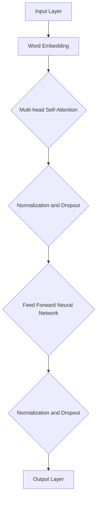
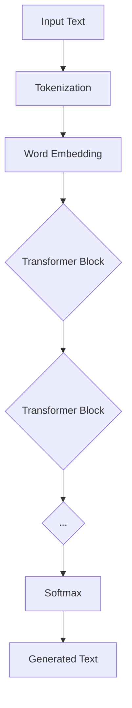
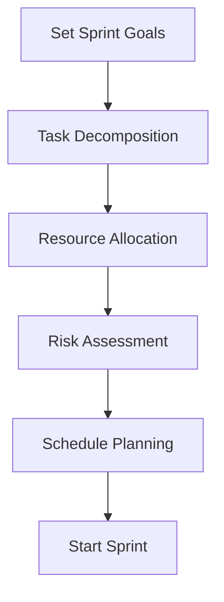
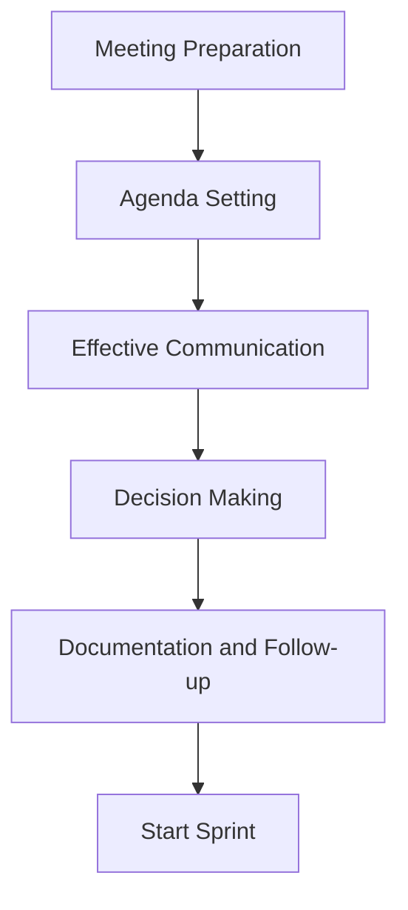
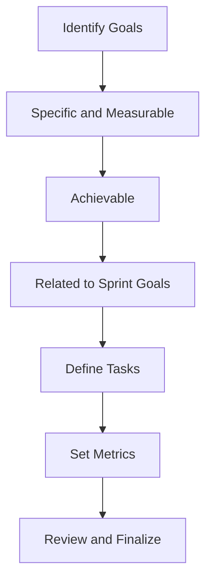
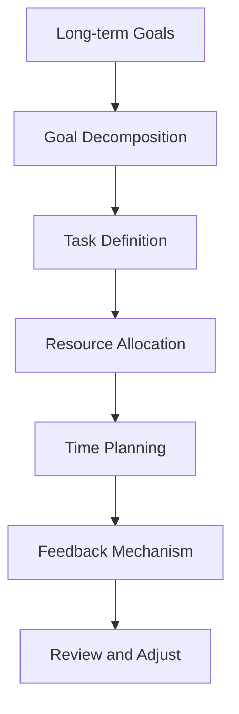
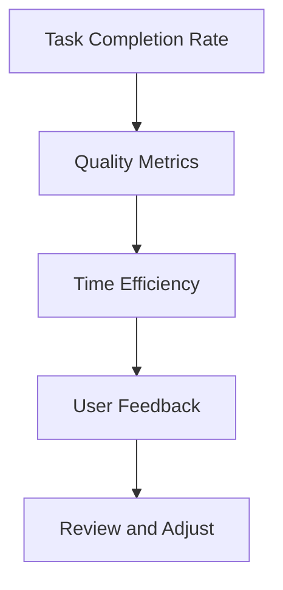

                 

### 文章标题：LLM应用的Sprint规划会议：设定明确的短期目标

> 关键词：LLM，Sprint规划，短期目标，人工智能，项目管理

> 摘要：本文旨在探讨如何通过Sprint规划会议来设定明确的短期目标，从而优化大型语言模型（LLM）的应用开发。文章首先介绍了LLM的基本概念和应用场景，随后详细解释了Sprint规划的方法和重要性。接着，文章深入探讨了如何设定明确的短期目标，并提供了实际的案例和最佳实践。通过本文，读者将了解如何有效规划和执行LLM项目，提升项目成功率。

----------------------------------------------------------------

### 引言

#### LLM与Sprint规划的概念介绍

**大型语言模型（LLM）**，是近年来人工智能领域的重要突破。LLM利用深度学习技术，通过大量文本数据进行训练，能够生成自然语言响应，模拟人类对话过程。其应用广泛，包括智能客服、内容生成、机器翻译等。例如，OpenAI的GPT-3就是一个典型的LLM应用实例，其强大的文本生成能力在多个领域展示了其潜力。

**Sprint规划**，是敏捷开发方法中的一个核心环节。Sprint通常是指一段为期2-4周的时间周期，在这个周期内，开发团队会完成一系列预定的任务。Sprint规划会议则是在每个Sprint开始前进行的会议，旨在明确目标、规划任务、分配资源。

#### Sprint规划会议的重要性

Sprint规划会议对于项目的成功至关重要。它不仅能帮助团队明确短期目标，还能确保项目在正确方向上前进。具体来说，Sprint规划会议的重要性体现在以下几个方面：

1. **目标明确**：通过规划会议，团队能够明确每个Sprint的目标和任务，确保项目方向一致。
2. **资源优化**：在规划会议上，团队可以根据任务需求合理分配资源，避免资源浪费。
3. **风险管理**：提前识别潜在的风险和问题，并制定相应的应对措施。
4. **沟通协作**：规划会议提供了一个交流平台，团队成员可以共同讨论、分享意见和建议。

#### 本书的目的与结构

本文的目的是帮助读者理解如何通过Sprint规划会议来设定明确的短期目标，从而优化LLM的应用开发。文章结构如下：

1. 引言：介绍LLM和Sprint规划的基本概念及其重要性。
2. LLM基础：详细解释LLM的原理、架构和应用场景。
3. Sprint规划方法：探讨Sprint规划的具体方法和步骤。
4. 设定明确的短期目标：讨论如何设定短期目标，并提供最佳实践。
5. 案例研究：通过实际案例展示如何应用Sprint规划会议和设定短期目标。
6. 实践技巧：提供提升团队协作和规划能力的技巧。
7. 总结与展望：总结文章的主要收获，并探讨LLM应用与Sprint规划的未来趋势。

通过本文的阅读，读者将能够掌握LLM应用的Sprint规划方法，并学会如何设定明确的短期目标，从而提升项目成功率。接下来，我们将深入探讨LLM的基础知识，为后续的内容打下坚实的基础。

----------------------------------------------------------------

### LLM基础

#### LLM的原理与架构

**大型语言模型（LLM）**的原理基于深度学习，特别是基于注意力机制的变换器（Transformer）架构。变换器模型通过自注意力机制，能够捕捉文本中长距离的依赖关系，从而生成高质量的自然语言响应。

**LLM的架构**主要包括以下几个部分：

1. **输入层**：接收自然语言文本输入，通常通过分词器将文本转换为词向量。
2. **变换器层**：由多个变换器块组成，每个变换器块包含自注意力机制和前馈神经网络。
3. **输出层**：将变换器的输出通过softmax函数转换为概率分布，从而生成预测的文本输出。

以下是一个简单的变换器模型的自注意力机制的Mermaid流程图：



#### LLM的工作流程

LLM的工作流程可以概括为以下几个步骤：

1. **输入处理**：将输入的文本通过分词器转换为词向量。
2. **自注意力计算**：在每个变换器层，利用自注意力机制计算文本序列中的依赖关系。
3. **前馈神经网络**：对自注意力机制的结果进行前馈神经网络处理，增加模型的表达能力。
4. **输出生成**：将变换器的最终输出通过softmax函数生成文本输出的概率分布，并根据概率分布生成最终的文本输出。

以下是一个简化的LLM工作流程的Mermaid流程图：



#### LLM的核心算法：Transformer解释

**变换器（Transformer）模型**是LLM的核心算法，其创新之处在于引入了自注意力机制，使得模型能够捕捉文本中的长距离依赖关系。以下是变换器模型的主要组成部分：

1. **多头自注意力（Multi-head Self-Attention）**：通过多个独立的自注意力机制来捕捉不同类型的依赖关系。
2. **前馈神经网络（Feed Forward Neural Network）**：对自注意力机制的结果进行进一步的神经网络处理，增加模型的表达能力。
3. **位置编码（Positional Encoding）**：为文本序列中的每个词赋予位置信息，帮助模型理解词的顺序。

以下是一个简化的变换器模型的自注意力机制的伪代码：

```python
def self_attention(q, k, v, d_k, d_v):
    scores = dot(q, k.T) / sqrt(d_k)
    weights = softmax(scores)
    output = dot(weights, v)
    return output
```

#### 数学模型和公式：Transformer的数学基础

变换器模型的数学基础主要包括矩阵运算、softmax函数和归一化操作。以下是这些数学公式的详细解释：

1. **矩阵运算**：变换器模型中的矩阵运算包括点积（dot product）、矩阵乘法（matrix multiplication）等。这些运算用于计算自注意力权重和模型输出。
2. **softmax函数**：softmax函数用于将原始分数转换为概率分布，公式为：

   $$ 
   \text{softmax}(x_i) = \frac{e^{x_i}}{\sum_{j} e^{x_j}} 
   $$

3. **归一化操作**：归一化操作包括层归一化和归一化与dropout。层归一化用于稳定模型训练，公式为：

   $$ 
   \text{Layer Normalization} = \frac{X - \mu}{\sigma} 
   $$

   其中，$\mu$和$\sigma$分别是输入的均值和标准差。

4. **dropout操作**：dropout是一种正则化技术，用于防止模型过拟合。其公式为：

   $$ 
   \text{Dropout}(X) = X \times \text{mask} 
   $$

   其中，mask是一个二进制矩阵，用于随机屏蔽输入的一部分。

通过上述数学模型和公式的详细解释，读者可以更好地理解变换器模型的工作原理和实现过程。接下来，我们将探讨Sprint规划的方法和重要性。

----------------------------------------------------------------

### Sprint规划方法

#### Sprint规划的概念与步骤

**Sprint规划**是敏捷开发中的一个关键环节，它定义了在固定的时间周期（通常为2-4周）内，开发团队需要完成的任务和目标。Sprint规划的具体步骤如下：

1. **目标设定**：在Sprint开始前，团队需要明确Sprint的目标，确保所有成员对目标有共同的理解。
2. **任务分解**：将Sprint目标分解为具体的任务，每个任务都应该清晰明确，可被衡量和完成。
3. **资源分配**：根据任务需求，合理分配团队成员的资源，确保每个任务都有足够的支持。
4. **风险评估**：识别可能的风险和问题，并制定相应的应对措施。
5. **进度安排**：制定详细的进度安排，明确每个任务的开始和结束时间。

以下是一个简化的Sprint规划流程的Mermaid流程图：



#### Sprint规划会议的技巧

**Sprint规划会议**是Sprint规划的核心，其成功与否直接影响到整个Sprint的执行效果。以下是一些提高Sprint规划会议效率的技巧：

1. **提前准备**：会议前，确保所有相关材料准备充分，包括任务列表、资源需求、风险评估等。
2. **明确议程**：制定清晰的会议议程，确保会议内容有条不紊。
3. **有效沟通**：鼓励团队成员积极参与，确保所有声音都被听到。
4. **决策明确**：在会议中做出明确的决策，避免模糊不清的指示。
5. **记录和跟进**：详细记录会议内容和决策，确保后续的跟进和执行。

以下是一个简化的Sprint规划会议流程的Mermaid流程图：



#### 短期目标设定的原则和方法

**短期目标**是Sprint的核心，它们需要具备以下原则：

1. **具体明确**：短期目标应该是具体和明确的，使团队成员知道需要做什么。
2. **可衡量**：短期目标应该是可衡量的，以便评估进展和达成度。
3. **可实现**：短期目标应该是可实现的，避免过于理想化的目标导致团队成员压力过大。
4. **相关性**：短期目标应该与Sprint的整体目标保持一致。

以下是一个简化的短期目标设定的流程图：



通过上述方法，团队可以有效地设定短期目标，确保Sprint的顺利进行。接下来，我们将探讨如何通过设定明确的短期目标来优化LLM的应用开发。

----------------------------------------------------------------

### 设定明确的短期目标

#### 明确短期目标的重要性

在LLM应用的开发过程中，设定明确的短期目标是至关重要的。这是因为明确的短期目标能够帮助团队：

1. **聚焦任务**：明确的短期目标使团队成员能够集中精力，专注于当前最重要的任务。
2. **提高效率**：明确的短期目标有助于团队制定详细的计划和进度安排，从而提高开发效率。
3. **评估进展**：明确的短期目标使团队成员能够定期评估进展，及时发现并解决问题。
4. **增强团队协作**：明确的短期目标有助于团队成员之间建立共同的目标和方向，增强团队协作。

#### 设定短期目标的步骤

为了确保短期目标的明确性和可实现性，团队可以遵循以下步骤来设定短期目标：

1. **目标分解**：将长期目标分解为更小、更具体的短期目标，每个短期目标都应该与长期目标紧密相关。
2. **任务定义**：为每个短期目标定义具体的任务，确保任务清晰明确，可被衡量和完成。
3. **资源分配**：根据任务需求，合理分配团队成员的资源，确保每个任务都有足够的支持。
4. **时间规划**：为每个短期目标和任务设定具体的时间框架，明确开始和结束时间。
5. **反馈机制**：建立反馈机制，定期检查短期目标的进展，并根据反馈进行调整。

以下是一个简化的短期目标设定流程的Mermaid流程图：



#### 如何衡量短期目标的达成度

为了确保短期目标的达成度，团队需要制定具体的衡量标准。以下是一些常用的衡量标准：

1. **完成率**：任务完成的百分比，是最直接的衡量标准。
2. **质量指标**：任务的完成质量，例如代码的覆盖率、测试通过率等。
3. **时间效率**：完成任务所用的时间，包括开发时间、测试时间和维护时间。
4. **用户反馈**：用户的反馈和满意度，特别是对于LLM应用，用户的反馈对目标的达成度有重要影响。

以下是一个简化的衡量短期目标达成度的Mermaid流程图：



通过上述步骤和衡量标准，团队可以有效地设定、衡量和达成明确的短期目标，从而优化LLM的应用开发。接下来，我们将通过实际案例来展示如何应用这些方法。

----------------------------------------------------------------

### 案例研究

#### 案例一：企业级LLM应用Sprint规划实践

某知名企业计划开发一款智能客服系统，基于大型语言模型（LLM）技术，以提高客户服务质量和效率。为了确保项目顺利进行，该企业采用了敏捷开发方法，并通过Sprint规划会议来设定明确的短期目标。

**Sprint目标设定过程：**

1. **目标分解**：在第一个Sprint中，团队将长期目标“开发一款高效的智能客服系统”分解为以下几个短期目标：
   - 完成基础的LLM模型训练和优化。
   - 实现智能客服对话系统的基本功能。
   - 集成和测试系统与现有客户服务平台的接口。

2. **任务定义**：根据每个短期目标，团队定义了具体的任务，并制定了详细的任务列表：
   - 训练和优化LLM模型：数据预处理、模型选择、训练和调参。
   - 开发对话系统：设计对话流程、编写对话逻辑代码、实现用户界面。
   - 集成和测试：确保系统与客户服务平台无缝集成，进行功能测试和性能评估。

3. **资源分配**：团队根据任务需求，合理分配了开发人员、数据科学家、测试工程师等资源，确保每个任务都有足够的支持。

4. **时间规划**：团队为每个短期目标和任务设定了具体的时间框架：
   - 第一个Sprint为期4周，分为两个阶段：模型训练和对话系统开发。
   - 第二个Sprint为期4周，专注于系统集成和测试。

5. **反馈机制**：在每个Sprint结束时，团队会进行回顾会议，评估短期目标的达成度，并根据反馈进行调整。

**案例分析与讨论：**

1. **目标达成情况**：在第一个Sprint结束时，团队成功完成了所有设定的短期目标，包括LLM模型的训练和优化、对话系统的开发以及与客户服务平台的集成。
2. **问题与挑战**：在实现过程中，团队遇到了一些挑战，例如模型训练过程中数据质量不佳、对话系统与客户服务平台的接口不兼容等。通过及时反馈和调整，团队成功地解决了这些问题。
3. **经验教训**：通过本案例，我们可以得出以下经验教训：
   - 短期目标的分解和具体任务定义是确保项目顺利进行的关键。
   - 合理的资源分配和时间规划有助于提高项目效率。
   - 定期的反馈机制和回顾会议有助于及时发现和解决问题。

#### 案例二：设定短期目标促进项目成功

另一家企业计划开发一款基于LLM技术的智能内容生成系统，用于自动化生成营销文案。为了确保项目成功，该企业采用了Sprint规划方法，并设定了一系列明确的短期目标。

**Sprint目标设定过程：**

1. **目标分解**：在第一个Sprint中，团队将长期目标“开发一款高效的智能内容生成系统”分解为以下几个短期目标：
   - 完成数据集的收集和预处理。
   - 开发基本的文本生成模型。
   - 实现文本生成的用户界面和API接口。

2. **任务定义**：根据每个短期目标，团队定义了具体的任务，并制定了详细的任务列表：
   - 数据集收集和预处理：从互联网收集相关数据、清洗和预处理数据。
   - 文本生成模型开发：选择合适的模型架构、训练和优化模型。
   - 用户界面和API接口开发：设计用户界面、实现API接口。

3. **资源分配**：团队根据任务需求，合理分配了开发人员、数据科学家、UI/UX设计师等资源，确保每个任务都有足够的支持。

4. **时间规划**：团队为每个短期目标和任务设定了具体的时间框架：
   - 第一个Sprint为期4周，分为两个阶段：数据集收集和预处理、文本生成模型开发。
   - 第二个Sprint为期4周，专注于用户界面和API接口开发。

5. **反馈机制**：在每个Sprint结束时，团队会进行回顾会议，评估短期目标的达成度，并根据反馈进行调整。

**案例分析与讨论：**

1. **目标达成情况**：在第一个Sprint结束时，团队成功完成了所有设定的短期目标，包括数据集的收集和预处理、文本生成模型的基本功能实现以及用户界面和API接口的开发。
2. **问题与挑战**：在实现过程中，团队遇到了一些挑战，例如数据集质量不佳、模型训练效率较低等。通过及时反馈和调整，团队成功地解决了这些问题。
3. **经验教训**：通过本案例，我们可以得出以下经验教训：
   - 短期目标的分解和具体任务定义有助于明确项目方向和进度。
   - 合理的资源分配和时间规划有助于提高项目效率。
   - 定期的反馈机制和回顾会议有助于及时发现和解决问题。

通过以上两个案例，我们可以看到，通过Sprint规划会议设定明确的短期目标，企业能够在复杂的项目中保持清晰的方向和高效的执行，从而提高项目的成功率。

----------------------------------------------------------------

### 实践技巧

#### 如何有效地进行Sprint规划会议

1. **明确议程**：在会议前，制定清晰的议程，确保每个议题都有明确的时间安排。
2. **提前准备**：确保所有参与者提前准备好相关的资料和任务列表，以便会议能够顺利进行。
3. **鼓励参与**：鼓励所有团队成员积极参与讨论，确保每个声音都能被听到。
4. **聚焦关键问题**：在会议中，聚焦于关键问题和决策，避免偏离主题。
5. **记录决策**：详细记录会议中的决策和行动计划，确保后续的跟进和执行。

#### 提升团队协作的技巧

1. **明确角色与职责**：确保每个团队成员都明确自己的角色和职责，避免角色重叠和责任不清。
2. **定期沟通**：通过定期团队会议、邮件更新、即时通讯工具等方式，保持团队成员之间的沟通和协作。
3. **建立共同目标**：确保所有团队成员都明确共同的目标和愿景，增强团队凝聚力。
4. **分工合作**：合理分配任务，确保每个团队成员都能发挥自己的优势，提高工作效率。
5. **反馈与改进**：定期收集团队成员的反馈，针对发现的问题进行改进，不断提升团队协作效率。

#### 如何应对Sprint规划中的挑战

1. **风险评估**：在Sprint规划会议中，提前识别潜在的风险，并制定相应的应对措施。
2. **灵活调整**：面对突发问题和变化，团队需要保持灵活，及时调整计划以应对新的情况。
3. **持续反馈**：通过定期的回顾会议，及时发现并解决问题，确保项目始终在正确的方向上前进。
4. **资源调配**：根据任务需求，合理调配团队成员和资源，确保每个任务都有足够的支持。
5. **团队支持**：提供必要的培训和资源，帮助团队成员提升技能和解决问题的能力。

通过以上实践技巧，团队可以更有效地进行Sprint规划，提高项目执行效率，从而实现项目目标。

----------------------------------------------------------------

### 总结与展望

#### 本书的主要收获

本文通过详细探讨LLM应用的Sprint规划会议，帮助读者了解了如何设定明确的短期目标，优化项目开发过程。主要收获包括：

1. **LLM基础**：读者了解了LLM的基本概念、原理和架构，以及其广泛的应用场景。
2. **Sprint规划方法**：读者掌握了Sprint规划的具体步骤和技巧，以及如何通过Sprint规划会议来设定明确的短期目标。
3. **短期目标设定**：读者了解了如何制定具体、可衡量和可实现的目标，以及如何评估短期目标的达成度。
4. **案例研究**：通过实际案例，读者看到了Sprint规划和设定短期目标在实际项目中的应用和效果。
5. **实践技巧**：读者获得了提升团队协作和应对Sprint规划中挑战的实践技巧。

#### LLM应用与Sprint规划的未来趋势

随着人工智能技术的不断进步，LLM的应用前景将更加广阔。以下是对LLM应用与Sprint规划未来趋势的展望：

1. **技术进步**：未来的LLM模型将更加复杂和高效，能够在更短的时间内训练和优化，从而提高开发效率。
2. **多模态融合**：LLM将与其他人工智能技术（如计算机视觉、自然语言处理等）相结合，实现多模态的智能应用。
3. **自动化流程**：Sprint规划会议将更加自动化，利用人工智能技术辅助决策，减少人工干预。
4. **团队协作**：随着远程工作和分布式团队的普及，Sprint规划将更加依赖数字化工具和平台，提高团队协作效率。
5. **持续优化**：通过持续的反馈和改进，Sprint规划将不断优化，以适应不断变化的项目需求。

#### 如何持续提升团队的项目规划能力

为了持续提升团队的项目规划能力，可以采取以下措施：

1. **定期培训**：定期为团队成员提供相关的培训和研讨会，帮助他们掌握最新的技术和方法。
2. **经验分享**：鼓励团队成员分享自己的经验和教训，通过知识传递和团队协作，提升整体能力。
3. **工具优化**：不断评估和优化项目管理和协作工具，确保团队能够高效地执行项目。
4. **反馈机制**：建立有效的反馈机制，定期收集和分析团队成员的反馈，针对发现的问题进行改进。
5. **激励机制**：设立合理的激励机制，鼓励团队成员积极参与项目规划和执行，提升团队士气。

通过持续的努力和改进，团队可以不断提升项目规划能力，实现项目目标的最大化。

### 结语

本文通过深入探讨LLM应用的Sprint规划会议和设定短期目标，为读者提供了全面的技术指导和实践经验。希望读者能够将这些方法和技巧应用到实际项目中，提升项目成功率，推动人工智能技术的发展。让我们共同努力，不断探索和创新，为人工智能的未来贡献力量。

### 作者信息

作者：AI天才研究院/AI Genius Institute & 禅与计算机程序设计艺术 /Zen And The Art of Computer Programming

感谢您的阅读，期待与您在AI领域继续探索和交流。

