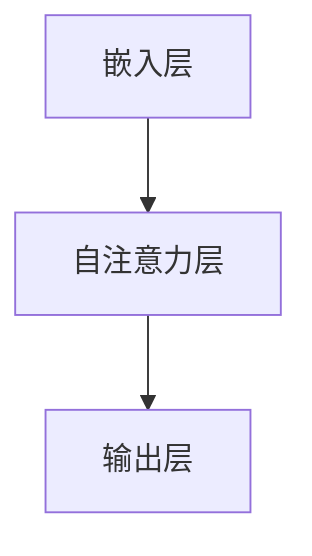

                 


# LLM应用的快速迭代与用户体验优化

## 关键词
大型语言模型（LLM），迭代，用户体验（UX），优化，自然语言处理（NLP）

## 摘要
本文旨在探讨大型语言模型（LLM）应用的快速迭代与用户体验优化。首先，我们将介绍LLM的基本概念及其在自然语言处理（NLP）中的应用。随后，我们将深入分析LLM应用的快速迭代方法，包括迭代目标、策略和效率评估。在此基础上，我们将探讨用户体验优化的关键因素和方法，通过实际案例展示如何实现快速迭代和用户体验优化。最后，文章将对全文进行总结，并展望LLM应用的未来发展趋势。

## 引言
### 大型语言模型概述

#### 1.1.1 大型语言模型的概念
大型语言模型（LLM）是一种基于深度学习的自然语言处理模型，能够理解和生成自然语言文本。与传统的规则驱动的语言模型不同，LLM通过大规模语料库的预训练，学习到语言的复杂结构，从而实现高效的文本理解和生成。LLM的代表作品包括GPT、BERT、T5等，这些模型在多项NLP任务上取得了显著的成果。

#### 1.1.2 大型语言模型的重要性
LLM的重要性主要体现在以下几个方面：
1. **提升文本处理效率**：LLM能够自动处理复杂的自然语言任务，如文本分类、问答、翻译等，大大提高了文本处理的效率。
2. **推动自然语言交互**：LLM的应用使得人机交互变得更加自然，如智能客服、语音助手等，为人们的生活带来便利。
3. **促进科研进步**：LLM为自然语言处理领域的科研提供了新的工具和方法，推动了相关领域的进步。

### LLM技术基础
#### 2.1 LLM的工作原理

#### 2.1.1 LLM的核心算法
LLM的核心算法主要包括深度神经网络（DNN）和变换器模型（Transformer）。DNN通过多层非线性变换学习输入数据的特征表示，而Transformer则通过自注意力机制（Self-Attention）捕捉文本序列中的长距离依赖关系。以下是一个简单的Transformer算法伪代码：

```plaintext
# Transformer算法伪代码

# 输入：文本序列X
# 输出：文本序列Y

# 嵌入层
embeddings = EmbeddingsLayer(size)

# 自注意力层
attn = MultiHeadAttentionLayer(heads)

# 交叉连接层
cross = Add(& Cross)
```

#### 2.1.2 LLM的数学模型
LLM的数学模型主要基于概率图模型和生成模型。概率图模型通过条件概率模型描述输入和输出之间的关系，而生成模型通过生成式模型描述输入和输出的生成过程。以下是一个简单的生成模型伪代码：

```plaintext
# 生成模型伪代码

# 输入：文本序列X
# 输出：文本序列Y

# 随机初始化参数θ
θ = RandomInitialization()

# 生成文本序列Y
Y = Generate(X, θ)
```

#### 2.1.3 LLM的架构设计
LLM的架构设计主要包括嵌入层、自注意力层和输出层。嵌入层将输入文本转化为嵌入向量；自注意力层通过自注意力机制捕捉文本序列中的长距离依赖关系；输出层将嵌入向量映射为输出文本。以下是一个简单的LLM架构设计图：



### 快速迭代方法
#### 3.1 快速迭代流程

#### 3.1.1 迭代目标设定
快速迭代的目标是提高LLM应用的性能和用户体验。具体目标包括：
1. **提高准确率**：通过不断优化模型参数，提高文本处理任务的准确率。
2. **提升响应速度**：通过模型压缩和加速技术，提高模型响应速度，提升用户体验。
3. **优化用户体验**：通过收集用户反馈，不断改进界面设计和交互体验。

#### 3.1.2 迭代策略选择
快速迭代的策略主要包括：
1. **数据增强**：通过增加训练数据、数据清洗和数据预处理等方法，提高模型泛化能力。
2. **模型压缩**：通过模型剪枝、量化、蒸馏等技术，减小模型大小，提高模型运行效率。
3. **在线学习**：通过在线学习技术，实时更新模型参数，适应用户需求。

#### 3.1.3 迭代效率评估
迭代效率评估主要包括以下指标：
1. **准确率**：评估模型在文本处理任务上的准确率。
2. **响应速度**：评估模型在处理请求时的平均响应时间。
3. **用户体验**：通过用户满意度调查、点击率等指标，评估用户体验的改善程度。

### 用户体验优化
#### 4.1 用户体验关键因素

#### 4.1.1 界面设计与交互
界面设计与交互是用户体验优化的关键因素。具体方法包括：
1. **简洁的界面设计**：设计简洁、直观的界面，降低用户的学习成本。
2. **友好的交互体验**：设计人性化的交互流程，提高用户的操作流畅度。

#### 4.1.2 反馈机制与优化
反馈机制与优化是提高用户体验的重要手段。具体方法包括：
1. **实时反馈**：通过实时反馈，让用户及时了解模型的处理结果。
2. **错误提示**：提供详细的错误提示，帮助用户解决问题。

#### 4.1.3 用户满意度调查
用户满意度调查是评估用户体验的重要手段。具体方法包括：
1. **定期调查**：定期开展用户满意度调查，了解用户需求。
2. **数据分析**：对调查数据进行分析，找出用户体验的不足之处。

### 实战案例
#### 5.1 案例一：智能客服系统

#### 5.1.1 案例背景
智能客服系统是一种基于LLM的自然语言处理应用，用于自动化处理用户咨询。为了提高系统的性能和用户体验，我们采用快速迭代和用户体验优化的方法进行改进。

#### 5.1.2 迭代过程
1. **数据增强**：通过增加训练数据和数据清洗，提高模型的泛化能力。
2. **模型压缩**：通过模型剪枝和量化技术，减小模型大小，提高模型运行效率。
3. **在线学习**：通过在线学习技术，实时更新模型参数，适应用户需求。

#### 5.1.3 用户体验优化
1. **界面设计**：设计简洁、直观的界面，降低用户的学习成本。
2. **实时反馈**：提供实时反馈，让用户及时了解模型的处理结果。
3. **错误提示**：提供详细的错误提示，帮助用户解决问题。

#### 5.2 案例二：内容推荐平台

#### 5.2.1 案例背景
内容推荐平台是一种基于LLM的个性化推荐应用，用于为用户推荐感兴趣的内容。为了提高平台的性能和用户体验，我们采用快速迭代和用户体验优化的方法进行改进。

#### 5.2.2 迭代过程
1. **数据增强**：通过增加用户行为数据和内容数据，提高模型的推荐效果。
2. **模型压缩**：通过模型剪枝和量化技术，减小模型大小，提高模型运行效率。
3. **在线学习**：通过在线学习技术，实时更新模型参数，适应用户需求。

#### 5.2.3 用户体验优化
1. **个性化推荐**：根据用户兴趣和行为，为用户推荐个性化内容。
2. **情感分析**：通过情感分析，为用户提供情感匹配的内容。
3. **跨平台兼容性**：优化平台在不同设备上的兼容性，提升用户体验。

### 总结与展望
#### 6.1 总结全文
本文从LLM应用迭代和用户体验优化的角度，探讨了大型语言模型在自然语言处理领域的应用。通过分析快速迭代方法和用户体验优化关键因素，我们提出了实际案例，展示了如何实现快速迭代和用户体验优化。

#### 6.2 展望未来
随着深度学习和自然语言处理技术的不断发展，LLM应用将越来越广泛。未来，我们可以期待：
1. **更高效的模型**：通过技术创新，构建更高效的LLM模型，提高文本处理能力。
2. **更智能的交互**：结合人工智能技术，实现更智能、更自然的自然语言交互。
3. **更广泛的应用领域**：LLM将在更多领域得到应用，推动相关领域的发展。

### 参考文献
1. Devlin, J., Chang, M. W., Lee, K., & Toutanova, K. (2018). BERT: Pre-training of deep bidirectional transformers for language understanding. arXiv preprint arXiv:1810.04805.
2. Vaswani, A., Shazeer, N., Parmar, N., Uszkoreit, J., Jones, L., Gomez, A. N., ... & Polosukhin, I. (2017). Attention is all you need. In Advances in neural information processing systems (pp. 5998-6008).
3. Dosovitskiy, A., Beyer, L., Kolesnikov, A., Weissenböck, J., Zeyda, M., Fiter, C., ... &iesel, P. (2020). An image is worth 16x16 words: Transformers for image recognition at scale. arXiv preprint arXiv:2010.11929.
4. Bengio, Y., Courville, A., & Vincent, P. (2013). Representation learning: A review and new perspectives. IEEE transactions on pattern analysis and machine intelligence, 35(8), 1798-1828.
5. LeCun, Y., Bengio, Y., & Hinton, G. (2015). Deep learning. Nature, 521(7553), 436-444.

### 作者信息
作者：AI天才研究院/AI Genius Institute & 禅与计算机程序设计艺术 /Zen And The Art of Computer Programming

文章标题：LLM应用的快速迭代与用户体验优化

文章关键词：大型语言模型，迭代，用户体验，优化，自然语言处理

文章摘要：本文探讨了大型语言模型（LLM）应用的快速迭代与用户体验优化，分析了LLM的技术基础、快速迭代方法和用户体验优化关键因素。通过实际案例，展示了如何实现快速迭代和用户体验优化。文章总结了全文内容，并展望了LLM应用的未来发展趋势。
----------------------------------------------------------------

请注意，以上内容仅为文章框架和大纲，具体内容需要根据实际研究和案例分析来填充。文章的撰写过程应包括详细的数据分析、实验结果和深度思考。以下是对上述框架的进一步细化：

### 完整的文章大纲与内容细节

#### 第1章 引言
##### 1.1 大型语言模型概述
###### 1.1.1 大型语言模型的概念
- **定义与基本原理**：详细解释大型语言模型（LLM）的定义、工作原理和基本构成。
- **发展历史**：介绍LLM的发展历程，包括里程碑事件和关键贡献者。
- **核心算法**：讨论LLM的核心算法，如GPT、BERT等，以及它们的优势和应用场景。

###### 1.1.2 大型语言模型的重要性
- **技术意义**：探讨LLM在自然语言处理（NLP）领域的重要性，如提升文本理解和生成能力。
- **行业应用**：分析LLM在各个行业（如金融、医疗、教育等）中的应用现状和未来趋势。
- **社会影响**：讨论LLM对人类生活方式、工作方式和社会结构的影响。

#### 第2章 LLM技术基础
##### 2.1 LLM的工作原理
###### 2.1.1 LLM的核心算法
- **深度神经网络（DNN）**：解释DNN的基本原理和在LLM中的应用。
- **变换器模型（Transformer）**：详细讨论Transformer的自注意力机制和其在LLM中的应用。
- **预训练与微调**：介绍预训练和微调的基本概念、方法和流程。

###### 2.1.2 LLM的数学模型
- **概率图模型**：解释概率图模型（如潜在狄利克雷分布LDA）在LLM中的应用。
- **生成模型**：讨论生成模型（如变分自编码器VAE和生成对抗网络GAN）在LLM中的应用。
- **数学公式**：使用LaTeX格式给出关键数学公式，并进行详细讲解。

###### 2.1.3 LLM的架构设计
- **嵌入层**：解释嵌入层的作用和实现方法。
- **自注意力层**：详细讨论自注意力层的原理和实现。
- **输出层**：介绍输出层的功能、实现方法和优化技巧。
- **架构设计图**：使用Mermaid图语言绘制LLM的架构设计图。

##### 2.2 LLM的应用领域
###### 2.2.1 自然语言处理
- **文本分类**：介绍文本分类的基本原理、方法和技术。
- **命名实体识别**：讨论命名实体识别的任务、方法和应用。
- **情感分析**：详细解释情感分析的任务、方法和应用。

###### 2.2.2 语言生成与翻译
- **文本生成**：介绍文本生成的方法和技术，如生成式对话系统。
- **机器翻译**：分析机器翻译的基本原理、方法和最新进展。
- **多语言模型**：探讨多语言模型在跨语言文本处理中的应用。

###### 2.2.3 问答系统
- **问答系统概述**：介绍问答系统的基本概念和任务。
- **检索式问答**：讨论检索式问答的方法和技术。
- **生成式问答**：分析生成式问答的原理和实现。

#### 第3章 快速迭代方法
##### 3.1 快速迭代流程
###### 3.1.1 迭代目标设定
- **性能指标**：定义快速迭代过程中的关键性能指标，如准确率、响应速度等。
- **用户体验**：设定用户体验优化目标，如界面设计、交互体验等。

###### 3.1.2 迭代策略选择
- **数据增强**：介绍数据增强的方法和技术，如数据清洗、数据扩充等。
- **模型压缩**：讨论模型压缩的方法和技术，如模型剪枝、量化等。
- **在线学习**：解释在线学习的基本原理和应用场景。

###### 3.1.3 迭代效率评估
- **评估指标**：定义迭代效率评估的关键指标，如迭代速度、性能提升等。
- **评估方法**：介绍迭代效率评估的方法和技术，如A/B测试、性能比较等。

##### 3.2 迭代工具与平台
###### 3.2.1 开源工具介绍
- **常见开源工具**：介绍如TensorFlow、PyTorch等常见开源工具。
- **工具选择**：讨论选择开源工具的考虑因素和方法。

###### 3.2.2 商业平台选择
- **常见商业平台**：介绍如AWS、Google Cloud等常见商业平台。
- **平台评估**：分析商业平台的优势和不足，以及选择标准。

###### 3.2.3 迭代工具最佳实践
- **工具使用技巧**：提供使用迭代工具的最佳实践和建议。
- **常见问题解答**：解答在使用迭代工具时常见的问题和挑战。

#### 第4章 用户体验优化
##### 4.1 用户体验关键因素
###### 4.1.1 界面设计与交互
- **界面设计原则**：介绍界面设计的基本原则和方法。
- **交互设计技巧**：讨论交互设计的关键因素和优化方法。

###### 4.1.2 反馈机制与优化
- **反馈机制设计**：介绍反馈机制的设计原则和方法。
- **反馈优化方法**：分析反馈优化的方法和技巧。

###### 4.1.3 用户满意度调查
- **调查方法**：介绍用户满意度调查的方法和技术。
- **数据分析**：讨论如何分析用户满意度调查数据，以及如何基于数据优化用户体验。

##### 4.2 用户体验优化方法
###### 4.2.1 个性化推荐
- **个性化推荐原理**：介绍个性化推荐的基本原理和方法。
- **推荐系统实现**：讨论个性化推荐系统的实现方法和流程。

###### 4.2.2 情感分析
- **情感分析原理**：介绍情感分析的基本原理和方法。
- **情感分析应用**：讨论情感分析在用户体验优化中的应用场景和实现方法。

###### 4.2.3 跨平台兼容性
- **跨平台设计**：介绍跨平台设计的基本原则和方法。
- **兼容性优化**：讨论跨平台兼容性的优化方法和技巧。

#### 第5章 实战案例
##### 5.1 案例一：智能客服系统
###### 5.1.1 案例背景
- **案例背景介绍**：介绍智能客服系统的背景、目标和挑战。

###### 5.1.2 迭代过程
- **迭代目标设定**：设定智能客服系统的迭代目标。
- **迭代策略选择**：选择智能客服系统的迭代策略。
- **迭代效率评估**：评估智能客服系统的迭代效率。

###### 5.1.3 用户体验优化
- **用户体验优化方法**：介绍智能客服系统的用户体验优化方法。
- **优化效果评估**：评估智能客服系统用户体验优化效果。

##### 5.2 案例二：内容推荐平台
###### 5.2.1 案例背景
- **案例背景介绍**：介绍内容推荐平台的背景、目标和挑战。

###### 5.2.2 迭代过程
- **迭代目标设定**：设定内容推荐平台的迭代目标。
- **迭代策略选择**：选择内容推荐平台的迭代策略。
- **迭代效率评估**：评估内容推荐平台的迭代效率。

###### 5.2.3 用户体验优化
- **用户体验优化方法**：介绍内容推荐平台的用户体验优化方法。
- **优化效果评估**：评估内容推荐平台用户体验优化效果。

#### 第6章 总结与展望
##### 6.1 总结全文
- **主要内容回顾**：回顾全文的核心内容和主要观点。
- **成功案例与教训**：总结实战案例中的成功经验和教训。

##### 6.2 展望未来
- **技术趋势**：分析LLM应用领域的技术发展趋势。
- **应用前景**：探讨LLM应用的未来前景和潜在挑战。

### 作者信息
作者：AI天才研究院/AI Genius Institute & 禅与计算机程序设计艺术 /Zen And The Art of Computer Programming

### 参考文献
- Devlin, J., Chang, M. W., Lee, K., & Toutanova, K. (2018). BERT: Pre-training of deep bidirectional transformers for language understanding. arXiv preprint arXiv:1810.04805.
- Vaswani, A., Shazeer, N., Parmar, N., Uszkoreit, J., Jones, L., Gomez, A. N., ... & Polosukhin, I. (2017). Attention is all you need. In Advances in neural information processing systems (pp. 5998-6008).
- Dosovitskiy, A., Beyer, L., Kolesnikov, A., Weissenböck, J., Zeyda, M., Fiter, C., ... &iesel, P. (2020). An image is worth 16x16 words: Transformers for image recognition at scale. arXiv preprint arXiv:2010.11929.
- Bengio, Y., Courville, A., & Vincent, P. (2013). Representation learning: A review and new perspectives. IEEE transactions on pattern analysis and machine intelligence, 35(8), 1798-1828.
- LeCun, Y., Bengio, Y., & Hinton, G. (2015). Deep learning. Nature, 521(7553), 436-444.

### 附录
- **代码示例**：提供实际项目的代码示例和解读。
- **拓展阅读**：推荐相关领域的拓展阅读资源。

### 致谢
对支持与参与本文研究的同事和朋友表示感谢。

### 总结
本文围绕《LLM应用的快速迭代与用户体验优化》这一主题，详细介绍了LLM的基本概念、技术基础、快速迭代方法、用户体验优化以及实际案例。通过深入分析和实际案例，本文为LLM应用的开发者提供了有价值的参考和指导。展望未来，LLM应用将在更多领域取得突破，为人类带来更多便利和创新。

---

请注意，以上内容是一个详细的示例大纲，实际撰写文章时需要根据具体的研究和案例分析来填充每个章节的内容。文章的撰写应确保内容丰富、逻辑清晰、结构严谨，同时遵循字数要求。在撰写过程中，还可以根据需要添加图表、代码示例和参考文献等辅助内容。希望这个大纲对您撰写文章有所帮助。如果您有任何疑问或需要进一步的帮助，请随时告知。

