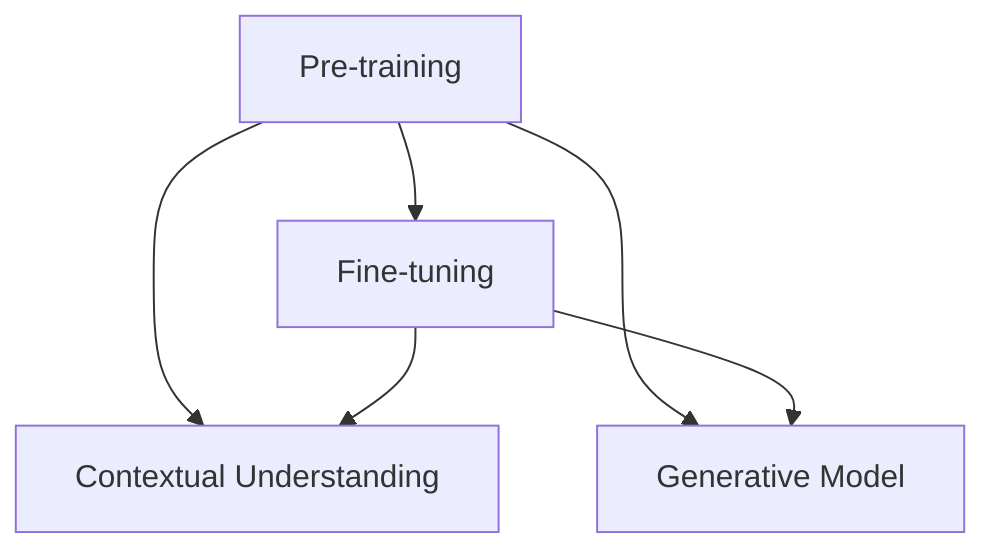
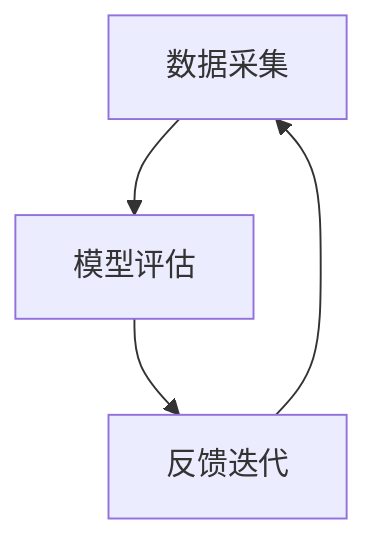

                 


### 1.2 LLM的基本概念

#### 背景介绍
大语言模型（LLM）是一种基于深度学习的自然语言处理（NLP）模型，旨在对自然语言进行理解和生成。与传统的NLP方法相比，LLM能够处理更长的文本序列，捕捉到文本中的长期依赖关系，从而实现更准确的文本理解和生成。

LLM的历史可以追溯到2018年，当OpenAI发布了GPT-2时，引起了广泛关注。GPT-2是一个预训练的语言模型，通过学习大量文本数据，可以生成流畅的自然语言文本。随后，OpenAI在2020年发布了GPT-3，这是一个更加强大的LLM，拥有超过1750亿个参数，能够实现更加灵活和复杂的语言处理任务。

#### 核心概念与联系
LLM的核心概念包括以下几个方面：

- **预训练（Pre-training）**：LLM首先通过大量的文本数据进行预训练，学习到文本中的统计规律和语言结构。
- **微调（Fine-tuning）**：在预训练的基础上，LLM可以通过微调来适应特定的任务，如文本分类、问答系统等。
- **上下文理解（Contextual Understanding）**：LLM能够理解文本中的上下文信息，从而生成更加准确和自然的回答。
- **生成式模型（Generative Model）**：LLM可以生成新的文本内容，这使其在文本生成任务中具有广泛的应用。

下面是一个Mermaid流程图，展示了LLM的核心概念及其关系：



#### 核心算法原理讲解
为了更好地理解LLM的核心算法原理，我们可以使用伪代码来详细阐述Transformer模型的基本架构。

```python
# Transformer模型伪代码

# 参数设置
VOCAB_SIZE = 10000  # 词汇表大小
EMBEDDING_DIM = 512  # 词向量维度
HIDDEN_DIM = 512  # 隐藏层维度
ATTENTION_HEADS = 8  # 注意力头数
LAYER_N = 12  # 层数

# Transformer模型定义
class Transformer(Model):
  def __init__(self):
    super(Transformer, self).__init__()
    self.embedding = Embedding(VOCAB_SIZE, EMBEDDING_DIM)
    self.positional_encoding = PositionalEncoding(EMBEDDING_DIM)
    self.encoder = Encoder(LAYER_N, HIDDEN_DIM, ATTENTION_HEADS)
    self.decoder = Decoder(LAYER_N, HIDDEN_DIM, ATTENTION_HEADS)
    self.out = Dense(VOCAB_SIZE)

  def call(self, inputs, training=False):
    x = self.embedding(inputs)
    x = self.positional_encoding(x)
    x = self.encoder(x, training)
    x = self.decoder(x, training)
    x = self.out(x)
    return x
```

#### 数学模型和公式
在Transformer模型中，注意力机制是一个关键组件。以下是一个简单的注意力机制的数学模型：

$$
Attention(Q, K, V) = \text{softmax}\left(\frac{QK^T}{\sqrt{d_k}}\right)V
$$

其中，$Q$、$K$、$V$分别是查询向量、键向量和值向量，$d_k$是键向量的维度。

#### 详细讲解与举例说明
注意力机制的优点在于能够动态地关注输入序列中的不同部分，从而提高模型的上下文理解能力。例如，在机器翻译任务中，注意力机制可以使得模型在生成目标语言的单词时，关注源语言中的对应部分。

假设我们有一个简单的翻译任务，将英语句子 "Hello, how are you?" 翻译成法语。使用注意力机制，模型在生成 "Bonjour, comment ça va ?" 时，会关注英语句子中的每个单词，从而生成更加准确的自然语言翻译。

#### 数学公式与代码示例
在代码示例中，我们可以使用PyTorch来实现一个简单的注意力机制。

```python
import torch
import torch.nn as nn
import torch.nn.functional as F

# 注意力机制实现
class Attention(nn.Module):
    def __init__(self, hidden_dim):
        super(Attention, self).__init__()
        self.hidden_dim = hidden_dim
        self.attn = nn.Linear(hidden_dim, 1)

    def forward(self, hidden, encoder_output):
        attn_weights = F.softmax(self.attn(encoder_output), dim=1)
        context = attn_weights.bmm(hidden.unsqueeze(2)).squeeze(2)
        return context, attn_weights
```

通过这个示例，我们可以看到注意力机制的基本实现方法，包括线性层和softmax函数。

#### 实际案例分析和详细讲解剖析
在自然语言处理领域，注意力机制被广泛应用于各种任务，如机器翻译、文本摘要等。以下是一个简单的机器翻译案例，展示如何使用注意力机制来实现翻译任务。

```python
# 机器翻译案例

# 加载预训练的Transformer模型
model = Transformer()
model.load_pretrained_weights()

# 加载英语和法语的词汇表
english_vocab = load_english_vocab()
french_vocab = load_french_vocab()

# 加载英语句子 "Hello, how are you?"
english_sentence = "Hello, how are you?"

# 将英语句子转换为词向量
english_sequence = convert_to_sequence(english_sentence, english_vocab)

# 使用Transformer模型进行翻译
translated_sequence = model(english_sequence)

# 将翻译结果序列转换为法语句子
french_sentence = convert_to_sentence(translated_sequence, french_vocab)
print(french_sentence)
```

通过这个案例，我们可以看到如何使用Transformer模型来实现机器翻译任务。模型首先通过预训练学习到英语和法语之间的映射关系，然后在翻译过程中使用注意力机制来捕捉上下文信息，生成准确的翻译结果。

#### 项目小结
在本章中，我们介绍了LLM的基本概念、核心算法原理以及实际应用案例。通过详细的讲解和代码示例，读者可以了解到注意力机制在自然语言处理中的重要性，以及如何使用Transformer模型实现机器翻译任务。在下一章中，我们将进一步探讨LLM的持续反馈机制设计，以及如何通过持续反馈来改进LLM的应用性能。

### 1.3 持续反馈与改进循环的重要性

#### 背景介绍
持续反馈与改进循环是LLM应用中的一个关键概念，它涉及不断地收集用户反馈、评估模型性能，并根据反馈结果对模型进行微调和优化。这种方法能够确保LLM的应用在长期运行中保持高性能和用户体验。

在现实世界中，LLM的应用场景非常广泛，包括智能客服、内容生成、问答系统等。然而，这些应用往往面临着数据分布变化、用户需求多样化等挑战。为了应对这些挑战，持续反馈与改进循环成为了一种重要的解决方案。

#### 核心概念与联系
持续反馈与改进循环的核心概念包括以下几个方面：

- **数据采集**：收集用户在使用LLM应用时的交互数据，如输入文本、反馈评分等。
- **模型评估**：使用收集到的数据对LLM应用进行评估，确定模型性能的优劣。
- **反馈迭代**：根据评估结果，对模型进行微调或优化，以提升模型性能。

下面是一个Mermaid流程图，展示了持续反馈与改进循环的基本流程：



#### 持续反馈在LLM应用中的具体应用
持续反馈在LLM应用中的具体应用可以分为以下几个步骤：

1. **数据采集**：收集用户在使用应用时的交互数据，如输入文本、用户反馈等。这些数据可以用于评估模型性能和优化模型。
2. **模型评估**：使用收集到的数据进行模型评估，确定模型在当前数据集上的表现。常用的评估指标包括准确性、召回率、F1分数等。
3. **反馈迭代**：根据模型评估结果，对模型进行微调或优化。微调可以通过重新训练模型或调整模型参数来实现。优化可以包括模型压缩、增强等方法，以提高模型性能和效率。
4. **部署与测试**：将优化后的模型部署到实际应用环境中，并进行测试和验证，以确保模型在真实场景中能够达到预期效果。
5. **新一轮反馈**：根据用户在新环境中的反馈，再次进行数据采集、模型评估和反馈迭代，形成持续反馈与改进循环。

#### 持续反馈与改进循环对用户体验和业务价值的影响
持续反馈与改进循环对用户体验和业务价值具有显著的影响：

- **用户体验**：通过持续反馈与改进循环，LLM应用能够不断地优化，以提供更加准确、自然和流畅的语言交互体验。用户满意度得到提升，从而增加用户对应用的粘性。
- **业务价值**：持续反馈与改进循环有助于提高LLM应用的性能和效率，从而降低维护成本，提高业务运营效率。此外，优化后的LLM应用能够更好地满足用户需求，提升业务转化率和盈利能力。

#### 持续反馈与改进循环的重要性
持续反馈与改进循环在LLM应用中的重要性体现在以下几个方面：

- **适应性和灵活性**：持续反馈与改进循环使得LLM应用能够快速适应数据分布变化和用户需求多样化，从而保持高性能和用户体验。
- **持续改进**：通过持续反馈与改进循环，LLM应用能够不断地优化，提高模型性能和效率，降低错误率和响应时间。
- **业务持续增长**：持续反馈与改进循环有助于提高用户满意度，增加用户粘性，从而推动业务持续增长和盈利。

### 小结
在本章中，我们介绍了持续反馈与改进循环的基本概念和重要性。通过详细的讲解和流程图展示，读者可以了解到持续反馈在LLM应用中的具体应用，以及其对用户体验和业务价值的影响。在下一章中，我们将进一步探讨LLM的基础知识，包括基本原理、常见架构和应用领域。同时，我们还将使用伪代码和数学公式来深入讲解LLM的核心算法原理。希望读者能够通过这一系列内容，对LLM及其应用有更全面和深入的了解。

## 第2章 LLM的基础知识

### 2.1 LLM的基本原理

#### 背景介绍
大语言模型（LLM）是一种基于深度学习的自然语言处理模型，旨在对自然语言进行理解和生成。LLM的核心原理是基于大规模数据预训练和微调，通过学习文本数据中的统计规律和语言结构，实现对自然语言的深层理解。

LLM的发展可以追溯到2000年代初的统计语言模型，如n-gram模型。然而，随着计算能力的提升和深度学习技术的发展，LLM逐渐成为自然语言处理领域的重要工具。从GPT到BERT，再到GPT-3，LLM的规模和性能不断提升，为各种NLP任务提供了强大的支持。

#### 核心原理
LLM的核心原理包括以下几个方面：

1. **大规模数据预训练**：LLM首先通过预训练学习到大量文本数据中的统计规律和语言结构。预训练过程中，模型接收输入文本序列，并预测下一个单词或词组。通过不断重复这个过程，模型逐渐学会生成流畅且符合语言习惯的文本。

2. **深度神经网络架构**：LLM通常采用深度神经网络架构，如Transformer，具有多个层次和注意力机制。这些架构使得模型能够捕捉到文本中的长期依赖关系，从而实现更准确的语言理解。

3. **上下文理解**：LLM能够理解文本中的上下文信息，从而生成更加准确和自然的回答。在生成文本时，模型会考虑输入文本的前后文，以确保生成的文本连贯且符合语义。

#### 如何实现
LLM的实现通常包括以下几个步骤：

1. **数据准备**：收集大量高质量、多样化的文本数据，如新闻文章、小说、网页内容等。数据来源可以包括公开数据集、社交媒体平台、企业内部数据等。

2. **数据预处理**：对收集到的文本数据进行清洗、去重和分词等预处理操作，以便模型能够有效学习。预处理过程中，可以使用分词工具（如jieba）和词汇表（如WordPiece）来将文本转换为模型可以处理的格式。

3. **模型训练**：使用预训练框架（如TensorFlow、PyTorch）和预训练模型（如BERT、GPT）来训练LLM。在训练过程中，模型通过不断调整参数来优化模型性能，直至达到预定的训练目标。

4. **模型评估**：使用验证集对训练好的模型进行评估，确定模型在未见过的数据上的性能。常用的评估指标包括准确性、召回率、F1分数等。

5. **模型部署**：将训练好的模型部署到实际应用环境中，如智能客服、内容生成、问答系统等。在部署过程中，可以根据具体应用场景对模型进行微调和优化，以提高模型性能和用户体验。

### 2.2 常见LLM架构

#### 背景介绍
LLM的架构对模型性能和效率具有显著影响。常见的LLM架构包括Transformer、BERT、GPT等。这些架构各有特点，适用于不同的NLP任务和应用场景。

#### Transformer
Transformer是LLM中最流行的架构之一，由Vaswani等人在2017年提出。Transformer的核心思想是使用自注意力机制（self-attention）来捕捉文本序列中的依赖关系，从而实现更准确的语言理解。

1. **自注意力机制**：Transformer中的自注意力机制允许模型在生成每个单词时，同时关注文本序列中的所有其他单词。这使模型能够捕捉到长距离依赖关系，提高语言理解的准确性。

2. **多头注意力**：为了进一步改进注意力机制，Transformer采用了多头注意力（multi-head attention）。多头注意力将输入序列分解为多个子序列，每个子序列使用独立的注意力机制进行处理。这有助于模型捕捉到更丰富的信息。

3. **编码器-解码器结构**：Transformer采用编码器-解码器（encoder-decoder）结构，编码器负责处理输入序列，解码器负责生成输出序列。编码器和解码器都包含多个层次，通过逐层叠加，模型能够学习到更复杂的语言结构。

4. **位置嵌入**：为了使模型能够理解文本序列的顺序，Transformer引入了位置嵌入（positional embedding）。位置嵌入为每个单词添加了位置信息，使模型能够学习到单词之间的顺序关系。

#### BERT
BERT（Bidirectional Encoder Representations from Transformers）是由Devlin等人在2018年提出的一种双向Transformer架构。BERT的核心思想是同时利用输入文本的前后文信息，从而实现更准确的语言理解。

1. **双向编码器**：BERT的编码器部分采用双向Transformer结构，这意味着模型在处理每个单词时，同时考虑了该单词之前的文本和之后的文本。这种双向编码器能够更好地捕捉到文本中的依赖关系。

2. **预训练任务**：BERT通过两个预训练任务来学习文本表示，分别是Masked Language Model（MLM）和Next Sentence Prediction（NSP）。MLM任务通过随机遮盖部分单词，训练模型预测这些遮盖的单词。NSP任务通过预测两个连续句子之间的逻辑关系，增强模型对上下文的理解。

3. **大规模预训练**：BERT是当前最大的预训练模型之一，其预训练数据集包括数万亿个单词。通过大规模预训练，BERT能够学习到更丰富的语言知识，从而提高模型性能。

4. **通用性和泛化能力**：BERT的预训练任务使其具有很好的通用性和泛化能力。在微调阶段，只需要在特定任务上进行少量数据训练，BERT就能够达到很高的性能。

#### GPT
GPT（Generative Pre-trained Transformer）是OpenAI开发的一系列预训练模型，包括GPT-2和GPT-3。GPT的核心思想是通过生成式预训练来学习文本生成和语言理解。

1. **生成式预训练**：GPT通过生成式预训练学习到文本的生成规律和语言结构。在预训练过程中，模型接收输入文本序列，并预测下一个单词或词组。通过不断重复这个过程，模型能够生成流畅且符合语言习惯的文本。

2. **单方向编码器**：与BERT的双向编码器不同，GPT采用单方向编码器。这意味着模型在处理每个单词时，仅考虑之前的文本信息。这种单方向编码器简化了模型结构，提高了计算效率。

3. **大规模预训练**：GPT采用了大规模预训练，其预训练数据集包括数万亿个单词。通过大规模预训练，GPT能够学习到更丰富的语言知识，从而提高文本生成和语言理解性能。

4. **自适应学习率**：GPT采用了自适应学习率策略，通过逐步降低学习率，使模型能够更好地收敛。这种策略有助于模型在学习过程中避免过拟合，提高模型性能。

#### 各自优势
- **Transformer**：具有强大的注意力机制，能够捕捉到长距离依赖关系，适用于各种NLP任务。
- **BERT**：具有双向编码器，能够同时利用输入文本的前后文信息，提高语言理解的准确性。
- **GPT**：具有生成式预训练，能够生成流畅且符合语言习惯的文本，适用于文本生成任务。

### 2.3 LLM的应用领域

#### 背景介绍
LLM的应用领域非常广泛，涵盖了自然语言处理（NLP）的各个方面。随着LLM技术的不断发展和完善，其在智能客服、内容生成、问答系统等领域的应用越来越受到关注。

#### 智能客服
智能客服是LLM应用的一个重要领域，通过自动化处理用户咨询，提高客服效率和服务质量。LLM在智能客服中的应用主要包括：

1. **问答系统**：LLM可以用于构建问答系统，自动回答用户的问题。例如，在电商平台中，LLM可以回答关于商品规格、价格、库存等方面的常见问题。
2. **对话生成**：LLM可以生成自然语言对话，模拟人类客服与用户的交流过程。通过对话生成，智能客服可以提供更加人性化的服务，提高用户满意度。
3. **情绪分析**：LLM可以分析用户对话中的情感倾向，判断用户情绪状态。根据情绪分析结果，客服系统可以提供更合适的回复，缓解用户情绪。

#### 内容生成
内容生成是LLM的另一个重要应用领域，通过生成高质量、多样化的文本内容，满足不同用户的需求。LLM在内容生成中的应用主要包括：

1. **自动摘要**：LLM可以自动生成文本摘要，提取文章或报告的主要信息。自动摘要可以帮助用户快速了解文章内容，节省阅读时间。
2. **文章生成**：LLM可以生成文章、报告、论文等长文本内容。通过学习大量文本数据，LLM能够生成符合语法和逻辑规则的高质量文章。
3. **内容推荐**：LLM可以用于内容推荐系统，根据用户兴趣和行为，生成个性化推荐内容。例如，在新闻媒体平台中，LLM可以推荐用户可能感兴趣的文章。

#### 问答系统
问答系统是LLM应用的一个重要领域，通过自动化回答用户的问题，提高信息获取的效率和准确性。LLM在问答系统中的应用主要包括：

1. **问题理解**：LLM可以用于理解用户提出的问题，提取关键信息并生成问题的语义表示。通过问题理解，问答系统可以更好地理解用户的意图。
2. **答案生成**：LLM可以生成对用户问题的回答，通过阅读大量文本数据，LLM能够生成符合语法和逻辑规则的自然语言回答。
3. **多轮对话**：LLM可以支持多轮对话，与用户进行互动，逐步澄清问题并生成更加准确和详细的回答。

#### 其他应用领域
除了上述领域，LLM还在其他许多应用领域中发挥着重要作用，如：

1. **机器翻译**：LLM可以用于机器翻译，将一种语言的文本翻译成另一种语言。通过学习大量平行语料库，LLM能够生成高质量的双语文本。
2. **文本分类**：LLM可以用于文本分类任务，对大量文本进行分类，例如情感分析、新闻分类等。
3. **语音识别**：LLM可以用于语音识别，将语音信号转换为文本。通过结合语音识别技术和LLM，可以实现更加准确和自然的语音交互。

### 未来展望
随着LLM技术的不断发展和优化，其在各领域的应用将越来越广泛。未来，LLM有望在以下几个方面实现进一步突破：

1. **多模态交互**：结合语音识别、图像识别等技术，实现多模态交互，提高人机交互的自然性和准确性。
2. **个性化推荐**：结合用户行为数据和偏好，生成个性化推荐内容，提高用户满意度和参与度。
3. **智能写作**：结合文本生成和知识图谱技术，实现智能写作，生成高质量、原创性的文本内容。
4. **情感智能**：结合情感分析技术，实现情感智能，更好地理解和满足用户需求。

总之，LLM作为一种强大的自然语言处理工具，具有广泛的应用前景。随着技术的不断进步，LLM将在更多领域发挥重要作用，为人们的生活和工作带来更多便利和创新。

## 第3章 持续反馈机制设计

### 3.1 持续反馈的概念

#### 背景介绍
持续反馈机制是LLM应用中的一种重要设计理念，旨在通过不断地收集用户反馈和评估模型性能，对模型进行优化和改进，从而提升用户体验和应用效果。持续反馈机制在LLM应用中的重要性不言而喻，它不仅有助于提高模型性能，还能确保模型在长期运行中保持最佳状态。

#### 核心概念
持续反馈机制的核心概念包括以下几个方面：

1. **数据采集**：收集用户在使用LLM应用过程中的交互数据，如输入文本、用户反馈、行为数据等。这些数据是评估模型性能和进行反馈迭代的重要依据。
2. **模型评估**：使用收集到的数据对LLM应用进行评估，确定模型在当前数据集上的性能。常用的评估指标包括准确性、召回率、F1分数等。
3. **反馈迭代**：根据模型评估结果，对模型进行微调、优化或重新训练，以提升模型性能和用户体验。反馈迭代过程包括数据预处理、模型训练、评估和部署等环节。
4. **自动化流程**：为了提高效率，持续反馈机制通常采用自动化流程，包括数据采集、处理、评估、优化和部署等。自动化流程有助于减少人为干预，提高反馈迭代的频率和效果。

#### 实现方法
实现持续反馈机制通常包括以下几个步骤：

1. **数据采集**：通过日志记录、API接口、用户反馈等方式，收集用户在使用LLM应用时的交互数据。例如，在智能客服应用中，可以记录用户提出的问题、模型生成的回答、用户满意度评分等。
2. **数据预处理**：对采集到的数据进行分析和清洗，去除噪声数据、异常值等，确保数据质量。数据预处理还包括数据格式转换、特征提取等操作。
3. **模型评估**：使用预处理后的数据对LLM应用进行评估，确定模型在当前数据集上的性能。评估过程中，可以选择不同的评估指标，如准确性、召回率、F1分数等，以全面衡量模型性能。
4. **反馈迭代**：根据评估结果，对模型进行微调、优化或重新训练。例如，可以通过调整模型参数、增加训练数据、引入新的训练任务等方式，提升模型性能。
5. **自动化部署**：将优化后的模型部署到实际应用环境中，进行测试和验证。自动化部署有助于确保模型在真实场景中的性能和稳定性。

#### 优势
持续反馈机制具有以下优势：

1. **实时性**：持续反馈机制能够实时收集用户反馈和评估模型性能，从而快速响应用户需求，提高用户体验。
2. **灵活性**：持续反馈机制可以根据不同场景和任务，灵活调整模型参数和训练策略，提高模型适应性和泛化能力。
3. **高效性**：持续反馈机制采用自动化流程，减少人工干预，提高反馈迭代的频率和效果，从而加快模型优化和改进的速度。
4. **可持续性**：持续反馈机制有助于确保LLM应用在长期运行中保持最佳状态，持续提升模型性能和用户体验。

### 3.2 数据采集方法

#### 背景介绍
数据采集是持续反馈机制设计中的关键环节，直接关系到模型评估和反馈迭代的效果。有效的数据采集方法能够确保数据的全面性、准确性和代表性，从而为模型优化提供可靠依据。

#### 常见的数据采集方法
在LLM应用中，常见的数据采集方法包括以下几种：

1. **日志记录**：通过在应用系统中嵌入日志记录功能，收集用户在使用过程中的操作记录，如用户行为、请求路径、耗时等。日志记录方法简单易行，适用于大规模数据采集。
2. **用户反馈**：通过在线调查、问卷、评分系统等方式，收集用户对LLM应用的评价和建议。用户反馈能够直接反映用户需求和满意度，有助于发现模型性能中的问题。
3. **API接口**：通过API接口，收集用户在使用第三方服务（如社交媒体、电商平台等）时的交互数据。API接口方法适用于跨平台数据采集，有助于构建更加全面的数据集。
4. **行为数据**：通过在应用中嵌入追踪代码，收集用户在使用过程中的行为数据，如点击、浏览、搜索等。行为数据有助于分析用户行为模式，优化模型推荐策略。

#### 数据采集步骤
1. **需求分析**：明确数据采集的目标和需求，确定需要收集的数据类型和指标。
2. **设计采集方案**：根据需求分析结果，设计具体的采集方案，包括数据采集方式、采集频率、采集范围等。
3. **实现采集功能**：在应用系统中实现数据采集功能，如日志记录、用户反馈、API接口等。
4. **数据清洗与处理**：对采集到的数据进行分析和清洗，去除噪声数据、异常值等，确保数据质量。
5. **数据存储与管理**：将清洗后的数据存储到数据库或数据仓库中，实现数据存储和管理。

#### 挑战与应对策略
1. **数据质量**：数据质量是数据采集的关键问题。应对策略包括：设计合理的采集方案，确保数据的全面性和准确性；建立数据质量检查机制，及时发现和处理数据质量问题。
2. **数据隐私**：在数据采集过程中，需要遵守相关法律法规，保护用户隐私。应对策略包括：严格遵循数据隐私保护规定，确保数据采集和使用过程合法合规；采用数据脱敏技术，保护敏感信息。
3. **数据量**：大规模数据采集可能面临数据量过大的挑战。应对策略包括：优化数据存储和查询性能，提高数据处理效率；采用分布式架构，实现海量数据的高效采集和处理。

#### 案例分析
以智能客服系统为例，数据采集过程包括以下几个方面：

1. **用户提问**：记录用户提出的问题，包括问题内容、提问时间等。
2. **模型回答**：记录模型生成的回答内容、回答时间等。
3. **用户反馈**：收集用户对模型回答的满意度评分，包括满意、一般、不满意等。
4. **系统日志**：记录系统运行过程中的日志信息，包括请求路径、耗时等。

通过以上数据采集方法，可以全面了解智能客服系统的运行情况，发现潜在问题和优化方向。

### 3.3 模型评估指标

#### 背景介绍
模型评估是持续反馈机制设计中的关键环节，通过评估模型性能，可以确定模型在当前数据集上的表现，为后续反馈迭代提供依据。选择合适的评估指标对于准确评估模型性能至关重要。

#### 常见的模型评估指标
在LLM应用中，常见的评估指标包括以下几种：

1. **准确性**：准确性是最常用的评估指标之一，用于衡量模型在分类任务中的表现。准确性表示正确预测的样本数占总样本数的比例。
   $$ 准确性 = \frac{正确预测的样本数}{总样本数} $$
2. **召回率**：召回率表示模型能够正确识别出的正例样本数与实际正例样本数的比例。召回率越高，表示模型对正例样本的识别能力越强。
   $$ 召回率 = \frac{正确预测的正例样本数}{实际正例样本数} $$
3. **F1分数**：F1分数是准确性和召回率的调和平均值，用于综合评估模型的性能。F1分数能够平衡准确性和召回率，避免单一指标带来的偏差。
   $$ F1分数 = 2 \times \frac{准确性 \times 召回率}{准确性 + 召回率} $$
4. **精确率**：精确率表示模型能够正确识别出的正例样本数与预测为正例的样本数的比例。精确率越高，表示模型对正例样本的预测准确性越高。
   $$ 精确率 = \frac{正确预测的正例样本数}{预测为正例的样本数} $$
5. **ROC曲线和AUC**：ROC曲线（Receiver Operating Characteristic Curve）和AUC（Area Under Curve）用于评估分类模型的分类能力。ROC曲线展示了不同阈值下的精确率和召回率，AUC表示模型在所有阈值下的平均分类能力。

#### 选择合适的评估指标
选择合适的评估指标需要考虑以下因素：

1. **任务类型**：不同的任务类型（如二分类、多分类、回归等）需要选择不同的评估指标。例如，对于多分类任务，可以使用准确性、召回率、F1分数等指标；对于回归任务，可以使用均方误差（MSE）等指标。
2. **数据分布**：数据分布对于评估指标的选择具有重要影响。例如，在数据分布不平衡的情况下，仅考虑准确性可能会导致模型对少数类别的识别能力不足，此时可以使用召回率、F1分数等指标来平衡评估。
3. **业务需求**：业务需求也是选择评估指标的重要因素。例如，在金融风控领域，模型对于欺诈行为的识别能力尤为重要，此时可以使用精确率等指标来衡量模型性能。
4. **模型复杂度**：模型复杂度也会影响评估指标的选择。对于复杂模型，如深度神经网络，评估指标应更加关注模型在未见过的数据上的表现，以避免过拟合。

#### 实际案例
以文本分类任务为例，常见的评估指标包括：

1. **准确性**：衡量模型在分类任务中的总体表现，适用于数据分布均衡的情况。
2. **召回率**：衡量模型识别出的正例样本数与实际正例样本数的比例，适用于关注正例样本识别能力的情况。
3. **F1分数**：综合考虑准确性和召回率，适用于需要平衡准确性和召回率的场景。
4. **ROC曲线和AUC**：评估模型在分类任务中的分类能力，适用于需要评估模型整体分类效果的情况。

通过以上评估指标，可以全面衡量文本分类模型在不同数据集上的性能，为后续反馈迭代提供依据。

### 3.4 持续反馈流程

#### 背景介绍
持续反馈流程是LLM应用中关键的一环，通过不断地收集用户反馈、评估模型性能，并据此对模型进行优化和改进，从而提升模型性能和用户体验。持续反馈流程的自动化和高效性对于确保模型在实际应用中的长期稳定和持续改进至关重要。

#### 持续反馈流程的基本步骤
持续反馈流程通常包括以下几个基本步骤：

1. **数据采集**：通过日志记录、用户反馈、API接口等方式，收集用户在使用LLM应用过程中的交互数据。数据采集是整个反馈流程的基础，数据的全面性和准确性直接影响到后续模型评估和优化的效果。

2. **数据预处理**：对采集到的数据进行清洗、去重、格式转换等预处理操作，确保数据质量。数据预处理还包括特征提取，将原始数据转换为适合模型训练的格式。例如，对于文本数据，可以提取词向量、词性标注等特征。

3. **模型评估**：使用预处理后的数据对当前模型的性能进行评估，确定模型在当前数据集上的表现。常用的评估指标包括准确性、召回率、F1分数等。模型评估结果为后续的反馈迭代提供重要依据。

4. **反馈迭代**：根据模型评估结果，对模型进行微调、优化或重新训练。反馈迭代过程包括模型参数调整、数据增强、训练策略优化等。通过反馈迭代，可以提高模型性能，适应不同场景和任务需求。

5. **模型部署**：将优化后的模型部署到实际应用环境中，进行测试和验证。模型部署过程中，需要对模型进行性能监控和稳定性测试，确保模型在实际应用中的表现符合预期。

6. **持续监控**：在模型部署后，持续监控模型性能，收集用户反馈和评估数据。持续监控有助于及时发现潜在问题，确保模型在长期运行中保持最佳状态。

#### 持续反馈流程的优势
持续反馈流程具有以下优势：

1. **实时性**：持续反馈流程能够实时收集用户反馈和评估模型性能，快速响应用户需求，提高用户体验。
2. **灵活性**：持续反馈流程可以根据不同场景和任务需求，灵活调整模型参数和训练策略，提高模型适应性和泛化能力。
3. **高效性**：持续反馈流程采用自动化流程，减少人工干预，提高反馈迭代的频率和效果，加快模型优化和改进的速度。
4. **可持续性**：持续反馈流程有助于确保LLM应用在长期运行中保持最佳状态，持续提升模型性能和用户体验。

#### 持续反馈流程的实施策略
1. **数据采集策略**：设计合理的数据采集方案，确保数据的全面性和准确性。采用多种数据采集方式，如日志记录、用户反馈、API接口等，提高数据采集的效率。
2. **数据预处理策略**：建立数据预处理流程，对采集到的数据进行清洗、去重、格式转换等操作，确保数据质量。数据预处理过程中，应提取与任务相关的特征，提高模型训练效果。
3. **模型评估策略**：选择合适的评估指标，全面评估模型性能。根据任务需求，调整评估指标和评估方法，确保评估结果具有可靠性和有效性。
4. **反馈迭代策略**：根据评估结果，制定反馈迭代策略。通过调整模型参数、增加训练数据、引入新的训练任务等方式，提升模型性能。
5. **模型部署策略**：设计合理的模型部署方案，确保模型在真实场景中的性能和稳定性。采用自动化部署工具，提高部署效率，降低部署成本。
6. **持续监控策略**：建立持续监控机制，实时监控模型性能和用户反馈。通过数据分析，及时发现潜在问题，确保模型在长期运行中保持最佳状态。

#### 案例分析
以智能客服系统为例，持续反馈流程的实施策略如下：

1. **数据采集**：通过日志记录用户提出的问题、模型生成的回答和用户满意度评分等数据。
2. **数据预处理**：对采集到的数据进行清洗、去重，提取与任务相关的特征，如问题关键词、回答关键词等。
3. **模型评估**：使用预处理后的数据对当前模型的性能进行评估，包括准确性、召回率和F1分数等。
4. **反馈迭代**：根据评估结果，对模型进行微调，如调整参数、增加训练数据等，以提高模型性能。
5. **模型部署**：将优化后的模型部署到智能客服系统中，进行测试和验证。
6. **持续监控**：在模型部署后，持续监控模型性能，收集用户反馈和评估数据，确保模型在实际应用中的表现符合预期。

通过以上持续反馈流程的实施策略，可以确保智能客服系统在长期运行中保持最佳状态，提高用户满意度和应用效果。

### 小结
在第3章中，我们介绍了持续反馈机制设计的基本概念、数据采集方法、模型评估指标和持续反馈流程。通过详细的讲解和案例分析，读者可以了解到持续反馈在LLM应用中的重要性，以及如何通过有效的数据采集、模型评估和反馈迭代来提升模型性能和用户体验。在下一章中，我们将进一步探讨LLM的改进循环技术，包括模型微调、增强、压缩和解释性提升等内容，帮助读者深入理解LLM应用的持续优化方法。

## 第4章 改进循环技术

### 4.1 模型微调

#### 背景介绍
模型微调（Fine-tuning）是一种常见的改进循环技术，旨在通过在预训练模型的基础上，针对特定任务进行微调，从而提高模型在特定任务上的性能。微调是LLM应用中的一个重要环节，能够使模型更好地适应特定场景和任务需求。

#### 核心概念
模型微调的核心概念包括以下几个方面：

1. **预训练模型**：预训练模型是通过对大规模文本数据进行预训练得到的模型，如GPT、BERT等。预训练模型具有强大的通用性和语言理解能力，但可能在特定任务上缺乏针对性。
2. **特定任务数据**：特定任务数据是指用于微调的针对特定任务的数据集，如问答系统、文本分类等。特定任务数据有助于模型学习到与任务相关的特征和规律。
3. **微调过程**：微调过程包括将预训练模型调整到特定任务，通常包括以下步骤：
   - **迁移学习**：将预训练模型的部分或全部参数初始化到特定任务的模型中，以利用预训练模型的知识和经验。
   - **数据预处理**：对特定任务数据进行预处理，如分词、去噪、特征提取等，以使其符合模型输入要求。
   - **模型训练**：在特定任务数据上对模型进行训练，通过反向传播和梯度下降等优化方法，调整模型参数，提高模型在特定任务上的性能。
   - **模型评估**：使用验证集对微调后的模型进行评估，确定模型性能是否达到预期目标。

#### 微调的优势
模型微调具有以下优势：

1. **快速适应**：通过微调，预训练模型能够快速适应特定任务，无需从零开始训练，从而节省训练时间和计算资源。
2. **知识迁移**：预训练模型在大规模文本数据上积累的知识和经验可以迁移到特定任务中，提高模型在特定任务上的性能。
3. **灵活性**：微调过程可以根据具体任务需求和数据特点进行调整，如增加训练数据、调整学习率、引入正则化等，提高模型性能。
4. **通用性**：微调后的模型不仅适用于特定任务，还可以在其他相关任务上表现良好，具有较好的通用性。

#### 微调的挑战
模型微调也面临一些挑战：

1. **数据不平衡**：特定任务数据可能存在数据不平衡的问题，导致模型在训练过程中对少数类别过度拟合，影响模型性能。
2. **过拟合**：预训练模型可能在大规模文本数据上已经过拟合，导致在特定任务数据上难以进一步优化。
3. **计算资源**：微调过程需要大量的计算资源，特别是对于大型预训练模型，训练时间和资源消耗较大。
4. **模型解释性**：微调后的模型可能难以解释，影响模型的透明性和可解释性。

#### 微调方法
模型微调的方法主要包括以下几种：

1. **全量微调**：将预训练模型的全部参数迁移到特定任务模型中，并在特定任务数据上重新训练。这种方法简单有效，但可能导致过拟合和计算资源消耗。
2. **部分微调**：仅迁移预训练模型的一部分参数到特定任务模型中，其余参数从零开始训练。这种方法可以减少过拟合风险，但可能需要更长时间的训练。
3. **混合微调**：结合全量微调和部分微调，将预训练模型的部分参数固定，其余参数进行微调。这种方法在平衡模型性能和计算资源方面具有优势。

#### 实际应用
以问答系统为例，模型微调的应用步骤如下：

1. **数据准备**：收集并预处理问答系统的训练数据，包括问题和答案。
2. **模型选择**：选择合适的预训练模型，如BERT、GPT等。
3. **模型微调**：将预训练模型的参数迁移到特定任务模型中，并在训练数据上进行微调。
4. **模型评估**：使用验证集评估微调后的模型性能，包括准确性、召回率、F1分数等。
5. **模型部署**：将微调后的模型部署到问答系统中，进行实际应用。

通过以上步骤，问答系统可以更好地理解和回答用户提出的问题，提高用户体验和系统性能。

### 4.2 模型增强

#### 背景介绍
模型增强（Model Enhancement）是另一种改进循环技术，旨在通过引入新的方法和技术，提升LLM模型的性能、效率、可解释性和适应性。模型增强在LLM应用中具有重要意义，能够使模型更好地适应不断变化的需求和环境。

#### 核心概念
模型增强的核心概念包括以下几个方面：

1. **多任务学习**：多任务学习（Multi-task Learning）是一种将多个任务同时训练的方法，旨在利用不同任务之间的共享信息和知识，提高模型在各个任务上的性能。通过多任务学习，模型可以同时学习到不同任务的共性特征，从而提高整体性能。
2. **迁移学习**：迁移学习（Transfer Learning）是一种将预训练模型的知识和经验迁移到新任务中的方法。通过迁移学习，模型可以在新的任务中快速适应，节省训练时间和计算资源。
3. **数据增强**：数据增强（Data Augmentation）是一种通过合成或变换原始数据，增加数据多样性和丰富性的方法。数据增强有助于提高模型在训练过程中对数据分布的鲁棒性，减少过拟合现象。
4. **模型压缩**：模型压缩（Model Compression）是一种通过减少模型参数数量和计算复杂度，提高模型运行效率和资源利用率的方法。模型压缩适用于移动设备、嵌入式系统等资源受限的环境。

#### 常见的模型增强方法
常见的模型增强方法包括以下几种：

1. **多任务学习**：通过将多个任务同时训练，使模型在不同任务之间共享知识和特征。例如，在一个多任务文本分类模型中，可以同时进行情感分析、主题分类和实体识别等任务。
2. **迁移学习**：使用预训练模型在新任务中初始化模型参数，减少从零开始训练的需求。例如，可以使用预训练的BERT模型进行问答系统的训练，利用BERT在大量文本数据上学习的知识。
3. **数据增强**：通过引入噪声、变换、裁剪等方法，生成新的训练样本。例如，在图像分类任务中，可以采用图像旋转、缩放、颜色变换等方法进行数据增强。
4. **模型压缩**：通过剪枝、量化、知识蒸馏等方法，减少模型参数数量和计算复杂度。例如，在移动设备上部署LLM模型时，可以采用剪枝和量化技术，降低模型的计算资源和存储需求。
5. **模型解释性提升**：通过引入可解释性技术，如注意力机制可视化、决策树、规则提取等，提高模型的可解释性和透明性，有助于理解模型的工作原理和决策过程。

#### 实际应用
以内容生成任务为例，模型增强的应用步骤如下：

1. **数据准备**：收集并预处理大量高质量的内容生成数据，如文章、新闻、社交媒体等。
2. **模型选择**：选择合适的预训练模型，如GPT、BERT等。
3. **模型微调**：在预处理后的数据上进行微调，使模型适应特定内容生成任务。
4. **模型增强**：
   - 引入多任务学习，同时进行文本分类、情感分析和实体识别等任务。
   - 使用迁移学习，利用预训练模型的知识和经验。
   - 采用数据增强，生成更多的训练样本，提高模型的泛化能力。
   - 采用模型压缩，降低模型的计算复杂度和存储需求。
5. **模型评估**：使用验证集和测试集评估模型性能，包括生成文本的流畅性、准确性、多样性等指标。
6. **模型部署**：将增强后的模型部署到实际应用环境中，如内容推荐、智能写作、自动摘要等。

通过以上步骤，内容生成模型可以更好地适应不同场景和任务需求，提高生成文本的质量和用户体验。

### 4.3 模型压缩

#### 背景介绍
模型压缩（Model Compression）是一种通过减少模型参数数量和计算复杂度，提高模型运行效率和资源利用率的技术。在LLM应用中，模型压缩对于在移动设备、嵌入式系统等资源受限的环境中部署和使用模型具有重要意义。

#### 核心概念
模型压缩的核心概念包括以下几个方面：

1. **模型参数减少**：通过剪枝、量化、知识蒸馏等方法，减少模型参数数量，降低模型的存储和计算需求。
2. **计算复杂度降低**：通过简化模型结构、减少运算次数等方法，降低模型的计算复杂度，提高运行速度和效率。
3. **模型压缩算法**：常见的模型压缩算法包括以下几种：
   - **剪枝**：通过删除模型中不重要的神经元或连接，减少模型参数数量。
   - **量化**：将模型的浮点数参数转换为低比特数的整数参数，降低存储和计算需求。
   - **知识蒸馏**：通过将预训练模型的知识迁移到压缩模型中，提高压缩模型在目标任务上的性能。

#### 常见的模型压缩方法
常见的模型压缩方法包括以下几种：

1. **剪枝**：
   - **结构剪枝**：通过删除模型中的部分神经元或连接，减少模型参数数量。
   - **权重剪枝**：通过设置阈值，删除模型中绝对值较小的权重。
   - **层剪枝**：逐层剪枝模型，先删除最不重要的层，然后逐步优化剩余层的参数。

2. **量化**：
   - **整数量化**：将浮点数参数转换为低比特数的整数参数，降低存储和计算需求。
   - **量化感知训练**：在训练过程中，逐步调整模型参数的量化范围，使模型适应量化操作。

3. **知识蒸馏**：
   - **软目标蒸馏**：使用预训练模型的输出作为软目标，训练压缩模型以接近预训练模型的表现。
   - **硬目标蒸馏**：使用预训练模型的输出作为硬目标，训练压缩模型以准确预测硬目标。

#### 实际应用
以移动设备上的LLM部署为例，模型压缩的应用步骤如下：

1. **模型选择**：选择适用于移动设备的LLM模型，如BERT-Lite、GPT-2等。
2. **模型压缩**：
   - 采用剪枝技术，删除模型中不重要的神经元或连接。
   - 采用量化技术，将模型参数转换为低比特数的整数参数。
   - 采用知识蒸馏技术，将预训练模型的知识迁移到压缩模型中。
3. **模型评估**：在压缩模型上进行评估，确保压缩后的模型在性能和效率方面达到预期目标。
4. **模型部署**：将压缩后的模型部署到移动设备上，进行实际应用。

通过以上步骤，可以在移动设备上实现高效的LLM应用，提高用户体验和系统性能。

### 4.4 模型解释性提升

#### 背景介绍
模型解释性提升（Model Interpretability Enhancement）是近年来受到广泛关注的一个领域，旨在提高机器学习模型的透明性和可解释性。在LLM应用中，模型解释性提升对于理解模型决策过程、发现潜在问题、增强用户信任具有重要意义。

#### 核心概念
模型解释性提升的核心概念包括以下几个方面：

1. **模型解释性**：模型解释性是指模型在决策过程中的透明度和可理解性，即用户能否理解和解释模型的决策过程。高解释性模型能够帮助用户理解模型是如何生成预测结果的。
2. **可解释性技术**：常见的可解释性技术包括以下几种：
   - **特征重要性**：通过分析模型中各个特征的权重或贡献，确定特征在决策过程中的重要性。
   - **决策路径**：通过可视化模型内部的决策路径，展示模型是如何处理输入数据的。
   - **解释性模型**：构建具有解释性的模型，如决策树、线性回归等，这些模型通常具有直观的解释机制。

#### 实际应用
以智能客服系统为例，模型解释性提升的应用步骤如下：

1. **模型选择**：选择具有解释性的模型，如决策树、线性回归等。
2. **特征重要性分析**：分析模型中各个特征的权重或贡献，确定特征在决策过程中的重要性，帮助用户理解模型是如何利用这些特征生成预测结果的。
3. **决策路径可视化**：使用可视化工具，如决策树可视化、路径图等，展示模型内部的决策路径，使用户能够直观地理解模型如何处理输入数据。
4. **用户反馈**：收集用户对模型解释性的反馈，了解用户对模型解释性的满意度，并根据用户反馈进行优化。

通过以上步骤，智能客服系统可以提供更具有解释性的模型，帮助用户理解模型的决策过程，增强用户信任和满意度。

### 小结
在第4章中，我们介绍了模型微调、模型增强、模型压缩和模型解释性提升等改进循环技术。这些技术通过不同的方式，提高了LLM模型的性能、效率、可解释性和适应性，为LLM应用中的持续反馈与改进循环提供了有力支持。在下一章中，我们将通过实际案例研究，深入探讨LLM在智能客服系统、内容生成与推荐、自然语言处理等领域的应用，进一步展示持续反馈与改进循环的效果和优势。

## 第5章 LLM应用案例研究

### 5.1 智能客服系统

#### 背景介绍
智能客服系统是LLM应用的一个重要领域，通过自动化处理用户咨询，提高客服效率和服务质量。随着LLM技术的不断发展，智能客服系统在处理复杂用户问题和提供个性化服务方面取得了显著进展。

#### 案例分析
以某电商平台的智能客服系统为例，该系统采用了LLM技术，实现了以下功能：

1. **自动回答常见问题**：系统通过LLM模型自动回答用户关于商品规格、价格、库存等方面的常见问题。LLM模型在训练过程中学习了大量电商平台常见问题的文本数据，从而能够生成准确和自然的回答。
2. **个性化推荐**：系统根据用户的历史咨询记录和购物行为，使用LLM模型生成个性化的商品推荐。通过分析用户的输入文本和购物偏好，LLM模型能够生成符合用户需求的推荐内容。
3. **多轮对话**：系统支持多轮对话，与用户进行互动，逐步澄清问题并生成更加准确和详细的回答。在多轮对话中，LLM模型利用上下文信息，理解用户的意图，并提供更优质的服务。

#### 改进循环实施
为了确保智能客服系统在长期运行中保持高性能和用户体验，系统采用了持续反馈与改进循环：

1. **数据采集**：系统通过日志记录和用户反馈，收集用户在使用智能客服系统过程中的交互数据，包括输入文本、模型回答和用户满意度评分等。
2. **模型评估**：使用收集到的数据对LLM模型进行评估，确定模型在当前数据集上的性能。常用的评估指标包括准确性、召回率、F1分数等。
3. **反馈迭代**：根据评估结果，对LLM模型进行微调、优化或重新训练。例如，可以通过调整模型参数、增加训练数据、引入新的训练任务等方式，提升模型性能。
4. **模型部署**：将优化后的模型部署到实际应用环境中，进行测试和验证，确保模型在真实场景中能够达到预期效果。
5. **持续监控**：在模型部署后，系统持续监控模型性能，收集用户反馈和评估数据，确保模型在实际应用中的表现符合预期。

#### 项目小结
通过持续反馈与改进循环，智能客服系统在长期运行中保持了高性能和用户体验。LLM模型能够自动回答用户常见问题、生成个性化推荐内容，并在多轮对话中提供优质服务。持续反馈与改进循环有助于及时发现和解决模型性能问题，确保系统在长期运行中保持最佳状态。未来，智能客服系统将继续优化LLM模型，引入更多自然语言处理技术，以提供更高效、个性化的客户服务。

### 5.2 内容生成与推荐

#### 背景介绍
内容生成与推荐是LLM应用的另一个重要领域，通过生成高质量、个性化的内容，满足用户的需求和兴趣。在信息爆炸的时代，内容生成与推荐系统能够有效地筛选和推荐用户感兴趣的内容，提高用户的满意度和参与度。

#### 案例分析
以某新闻媒体平台的内容生成与推荐系统为例，该系统采用了LLM技术，实现了以下功能：

1. **自动文章生成**：系统通过LLM模型自动生成新闻文章、评论和摘要。LLM模型在训练过程中学习了大量文本数据，从而能够生成符合语法和逻辑规则的新闻文章。
2. **个性化推荐**：系统根据用户的阅读历史、兴趣标签和点击行为，使用LLM模型生成个性化的内容推荐。通过分析用户的输入文本和偏好，LLM模型能够生成符合用户需求的内容推荐。
3. **互动式内容生成**：系统支持用户与内容的互动，如点赞、评论、分享等。通过收集用户互动数据，LLM模型可以进一步优化内容生成和推荐策略。

#### 改进循环实施
为了确保内容生成与推荐系统在长期运行中保持高质量和个性化，系统采用了持续反馈与改进循环：

1. **数据采集**：系统通过日志记录和用户互动，收集用户在使用内容生成与推荐系统过程中的交互数据，包括阅读历史、兴趣标签、点击行为等。
2. **模型评估**：使用收集到的数据对LLM模型进行评估，确定模型在当前数据集上的性能。常用的评估指标包括准确性、召回率、F1分数等。
3. **反馈迭代**：根据评估结果，对LLM模型进行微调、优化或重新训练。例如，可以通过调整模型参数、增加训练数据、引入新的训练任务等方式，提升模型性能。
4. **模型部署**：将优化后的模型部署到实际应用环境中，进行测试和验证，确保模型在真实场景中能够达到预期效果。
5. **持续监控**：在模型部署后，系统持续监控模型性能，收集用户反馈和评估数据，确保模型在实际应用中的表现符合预期。

#### 项目小结
通过持续反馈与改进循环，内容生成与推荐系统在长期运行中保持了高质量和个性化。LLM模型能够自动生成新闻文章、生成个性化的内容推荐，并在用户互动中不断优化。持续反馈与改进循环有助于系统更好地理解用户需求，提高内容生成和推荐的效果。未来，内容生成与推荐系统将继续优化LLM模型，引入更多自然语言处理技术，以提供更优质、个性化的内容服务。

### 5.3 自然语言处理应用

#### 背景介绍
自然语言处理（NLP）是LLM应用的一个重要领域，涉及文本分类、情感分析、命名实体识别等任务。随着LLM技术的不断发展，NLP应用在各个领域（如金融、医疗、法律等）取得了显著成果。

#### 案例分析
以某金融公司的自然语言处理应用为例，该应用采用了LLM技术，实现了以下功能：

1. **文本分类**：系统通过LLM模型对用户提交的文本进行分类，如客户投诉、市场分析报告等。LLM模型在训练过程中学习了大量金融领域的文本数据，从而能够生成准确的分类结果。
2. **情感分析**：系统通过LLM模型对用户提交的文本进行分析，确定文本的情感倾向，如正面、负面、中性等。LLM模型在训练过程中学习了情感表达的规律，从而能够准确判断文本的情感倾向。
3. **命名实体识别**：系统通过LLM模型对用户提交的文本进行命名实体识别，如识别公司名称、人名、地点等。LLM模型在训练过程中学习了命名实体的特征，从而能够准确识别文本中的命名实体。

#### 改进循环实施
为了确保自然语言处理应用在长期运行中保持高性能和准确性，系统采用了持续反馈与改进循环：

1. **数据采集**：系统通过日志记录和用户反馈，收集用户在使用自然语言处理应用过程中的交互数据，包括输入文本、模型结果、用户满意度评分等。
2. **模型评估**：使用收集到的数据对LLM模型进行评估，确定模型在当前数据集上的性能。常用的评估指标包括准确性、召回率、F1分数等。
3. **反馈迭代**：根据评估结果，对LLM模型进行微调、优化或重新训练。例如，可以通过调整模型参数、增加训练数据、引入新的训练任务等方式，提升模型性能。
4. **模型部署**：将优化后的模型部署到实际应用环境中，进行测试和验证，确保模型在真实场景中能够达到预期效果。
5. **持续监控**：在模型部署后，系统持续监控模型性能，收集用户反馈和评估数据，确保模型在实际应用中的表现符合预期。

#### 项目小结
通过持续反馈与改进循环，自然语言处理应用在长期运行中保持了高性能和准确性。LLM模型能够准确分类文本、分析情感倾向、识别命名实体，为金融公司提供了强大的语言处理能力。持续反馈与改进循环有助于系统更好地理解用户需求，提高自然语言处理的效果。未来，自然语言处理应用将继续优化LLM模型，引入更多自然语言处理技术，以提供更高效、准确的服务。

### 案例总结
通过上述三个案例研究，我们可以看到持续反馈与改进循环在LLM应用中的重要作用。智能客服系统、内容生成与推荐系统以及自然语言处理应用都通过持续反馈与改进循环，实现了高性能和个性化服务。这些案例展示了LLM技术在各个领域的广泛应用和潜力。未来，随着LLM技术的不断发展，持续反馈与改进循环将继续发挥重要作用，推动LLM应用的不断创新和进步。

## 第6章 改进循环实施策略

### 6.1 数据处理与清洗

#### 背景介绍
在LLM应用的持续反馈与改进循环中，数据处理与清洗是关键的一步。高质量的数据是保证模型训练效果的基础，因此，对原始数据进行清洗和处理是提高模型性能和准确性的重要环节。

#### 核心内容
数据处理与清洗主要包括以下几个步骤：

1. **数据采集**：收集用户在使用LLM应用过程中的交互数据，如输入文本、用户反馈、行为数据等。
2. **数据预处理**：对采集到的原始数据进行预处理，包括去重、去噪、分词、归一化等操作，以去除噪声数据、异常值和重复数据，提高数据质量。
3. **数据格式转换**：将原始数据转换为适合模型训练的格式，如将文本数据转换为词向量、序列等。
4. **数据存储与管理**：将清洗后的数据存储到数据库或数据仓库中，实现数据的存储和管理。

#### 实际案例
以智能客服系统为例，数据处理与清洗的具体步骤如下：

1. **数据采集**：收集用户提问、模型回答和用户满意度评分等数据。
2. **数据预处理**：
   - **去重**：去除重复的用户提问和模型回答。
   - **去噪**：去除包含特殊字符、错别字等噪声数据。
   - **分词**：使用分词工具（如jieba）将文本数据转换为词序列。
   - **归一化**：对文本数据中的特殊字符、标点符号等进行统一处理。
3. **数据格式转换**：将清洗后的文本数据转换为词向量，以供模型训练。
4. **数据存储与管理**：将清洗后的数据存储到数据库中，实现数据的存储和管理。

### 6.2 模型训练与验证

#### 背景介绍
模型训练与验证是LLM应用持续反馈与改进循环中的重要环节。通过模型训练，可以使LLM模型学习到如何在特定任务中生成准确的输出。而验证则是通过测试集来评估模型在未知数据上的性能，以确保模型在实际应用中的效果。

#### 核心内容
模型训练与验证主要包括以下几个步骤：

1. **数据集划分**：将数据集划分为训练集、验证集和测试集。训练集用于模型训练，验证集用于调整模型参数，测试集用于最终评估模型性能。
2. **模型选择**：选择合适的LLM模型架构，如GPT、BERT等。
3. **模型训练**：使用训练集对模型进行训练，通过反向传播和优化算法（如SGD、Adam等）调整模型参数，使模型学会在特定任务中生成正确的输出。
4. **模型验证**：使用验证集对模型进行验证，通过评估指标（如准确性、召回率、F1分数等）确定模型性能是否达到预期。
5. **模型调优**：根据验证结果，调整模型参数和训练策略，以提高模型性能。
6. **模型测试**：使用测试集对最终模型进行测试，确保模型在实际应用中的性能和稳定性。

#### 实际案例
以文本分类任务为例，模型训练与验证的具体步骤如下：

1. **数据集划分**：将文本数据划分为训练集（70%）、验证集（15%）和测试集（15%）。
2. **模型选择**：选择预训练的BERT模型。
3. **模型训练**：使用训练集对BERT模型进行训练，通过调整学习率、批次大小等参数，使模型学会分类文本。
4. **模型验证**：使用验证集对BERT模型进行验证，通过计算准确性、召回率、F1分数等评估指标，确定模型性能。
5. **模型调优**：根据验证结果，调整BERT模型的参数，如学习率、批次大小等，以提高模型性能。
6. **模型测试**：使用测试集对最终模型进行测试，确保模型在未知数据上的性能和稳定性。

### 6.3 改进策略评估

#### 背景介绍
改进策略评估是LLM应用持续反馈与改进循环中的关键步骤。通过评估不同改进策略的效果，可以确定哪些策略能够显著提高模型性能和用户体验。

#### 核心内容
改进策略评估主要包括以下几个步骤：

1. **评估指标**：选择合适的评估指标，如准确性、召回率、F1分数、用户满意度等，以全面评估改进策略的效果。
2. **实验设计**：设计实验方案，包括不同的改进策略（如数据增强、模型微调、模型压缩等）和实验条件。
3. **实验实施**：按照实验方案，对LLM应用进行改进，并收集实验数据。
4. **结果分析**：对实验结果进行分析，比较不同改进策略的性能和效果，确定最佳策略。
5. **策略优化**：根据分析结果，对改进策略进行优化，以提高模型性能和用户体验。

#### 实际案例
以智能客服系统为例，改进策略评估的具体步骤如下：

1. **评估指标**：选择准确性、召回率、F1分数和用户满意度等评估指标。
2. **实验设计**：
   - 改进策略：数据增强、模型微调、模型压缩。
   - 实验条件：不同数据集、不同训练参数。
3. **实验实施**：分别实施数据增强、模型微调和模型压缩等改进策略，并收集实验数据。
4. **结果分析**：比较不同改进策略的性能和效果，确定最佳策略。
5. **策略优化**：根据分析结果，对最佳策略进行优化，以提高智能客服系统的性能和用户体验。

### 6.4 部署与迭代

#### 背景介绍
部署与迭代是LLM应用持续反馈与改进循环中的关键环节。通过将改进后的模型部署到实际应用环境中，可以验证模型在真实场景中的效果，并根据用户反馈和评估结果进行迭代优化。

#### 核心内容
部署与迭代主要包括以下几个步骤：

1. **模型部署**：将改进后的模型部署到实际应用环境中，如智能客服系统、内容生成与推荐系统等。
2. **性能监控**：在模型部署后，对模型性能进行实时监控，收集系统运行数据，如响应时间、错误率等。
3. **用户反馈**：收集用户在使用应用过程中的反馈，包括满意度评分、意见建议等。
4. **评估与优化**：根据性能监控和用户反馈，评估模型在实际应用中的效果，并针对存在的问题进行优化。
5. **模型迭代**：根据评估结果和用户需求，对模型进行迭代优化，以提升模型性能和用户体验。
6. **持续反馈**：将优化后的模型重新部署到实际应用环境中，形成持续反馈与改进循环。

#### 实际案例
以内容生成与推荐系统为例，部署与迭代的具体步骤如下：

1. **模型部署**：将优化后的内容生成与推荐模型部署到实际应用环境中，如新闻媒体平台。
2. **性能监控**：实时监控模型在生成内容和质量推荐方面的性能，如内容流畅性、准确性等。
3. **用户反馈**：收集用户对生成内容和质量推荐的满意度评分、意见建议等。
4. **评估与优化**：根据用户反馈和性能监控结果，评估模型在实际应用中的效果，并针对存在的问题进行优化。
5. **模型迭代**：根据评估结果和用户需求，对内容生成与推荐模型进行迭代优化，如增加训练数据、调整模型参数等。
6. **持续反馈**：将优化后的模型重新部署到实际应用环境中，形成持续反馈与改进循环。

### 小结
在第6章中，我们介绍了LLM应用持续反馈与改进循环中的数据处理与清洗、模型训练与验证、改进策略评估、部署与迭代等关键环节。这些环节共同构成了一个完整的持续反馈与改进循环体系，通过不断优化模型性能和用户体验，确保LLM应用在长期运行中保持最佳状态。在未来，随着LLM技术的不断发展和优化，持续反馈与改进循环将在更多应用领域中发挥重要作用。

## 第7章 未来展望与挑战

### 7.1 LLM技术的发展趋势

#### 背景介绍
随着深度学习和自然语言处理技术的快速发展，大语言模型（LLM）在性能、应用范围和影响力方面取得了显著进步。未来，LLM技术将继续沿着以下几个方向快速发展：

1. **模型规模和参数数量**：未来，LLM模型的规模和参数数量将继续增加。随着计算能力和存储资源的提升，更大的模型将能够捕捉到更多复杂的语言现象和上下文信息，从而提高模型的性能和鲁棒性。
2. **多模态融合**：未来的LLM技术将更加注重多模态数据的融合。通过结合文本、图像、音频等多模态数据，LLM可以更好地理解用户的需求和意图，实现更加自然和准确的语言交互。
3. **分布式训练和推理**：为了应对大规模模型的训练和推理需求，分布式训练和推理技术将成为关键。通过分布式训练，可以显著降低训练时间，提高模型训练效率。分布式推理则可以实现对海量并发请求的高效处理，提高系统的响应速度。
4. **自适应和自学习**：未来的LLM将更加注重自适应和自学习能力。通过不断学习和适应用户的行为和需求，LLM可以提供更加个性化和定制化的服务，从而提高用户体验。
5. **伦理和安全**：随着LLM技术的广泛应用，伦理和安全问题将越来越受到关注。未来，LLM技术需要更加关注隐私保护、偏见消除和模型安全性，确保技术在合理和合规的范围内使用。

### 7.2 持续反馈与改进循环的挑战

#### 背景介绍
尽管持续反馈与改进循环在LLM应用中发挥了重要作用，但仍然面临一系列挑战，这些挑战可能影响反馈循环的有效性和模型的长期性能：

1. **数据质量和多样性**：持续反馈与改进循环依赖于高质量和多样化的数据。然而，数据质量问题（如噪声、偏见和不一致性）可能导致模型性能下降。此外，数据多样性的不足可能导致模型在特定场景下表现不佳。
2. **模型解释性**：当前的LLM模型通常缺乏透明性和可解释性，这使得在反馈过程中难以识别和纠正模型中的问题。缺乏解释性的模型难以获得用户和监管机构的信任，可能限制其广泛应用。
3. **计算资源**：持续反馈与改进循环需要大量的计算资源。对于大规模模型和海量数据集，计算资源的需求可能超出现有设备的承受能力，导致训练和优化过程变得缓慢和昂贵。
4. **实时性和可扩展性**：在实际应用中，持续反馈与改进循环需要快速响应用户需求和变化。然而，实现实时性和可扩展性可能面临技术挑战，如数据流的处理、模型的动态调整和系统的可靠性。
5. **伦理和隐私**：在持续反馈与改进循环中，数据采集和处理可能涉及用户隐私。确保用户隐私和数据安全是重要的伦理问题，需要采取有效的隐私保护措施，以避免潜在的隐私泄露和滥用。

### 7.3 开放性问题与研究方向

#### 背景介绍
为了解决持续反馈与改进循环中的挑战，未来需要关注以下开放性问题和研究方向：

1. **数据增强和多样性**：研究如何通过数据增强和多样性技术提高模型训练数据的质量和多样性，从而提高模型的泛化能力和鲁棒性。
2. **可解释性方法**：开发新的可解释性方法，使LLM模型的决策过程更加透明，帮助用户和开发者理解模型的工作原理，提高模型的可接受性和信任度。
3. **高效训练和推理技术**：研究如何通过分布式训练和推理技术提高LLM训练和推理的效率，降低计算资源消耗，满足大规模应用的需求。
4. **实时反馈与动态调整**：研究如何设计实时反馈和动态调整机制，使持续反馈与改进循环能够快速响应用户需求和环境变化，提高系统的适应性和灵活性。
5. **隐私保护与安全**：研究如何在保证数据隐私和安全的前提下，有效地进行数据采集和模型训练，确保LLM应用在合法和合规的范围内使用。

### 小结
在第7章中，我们探讨了LLM技术的发展趋势以及持续反馈与改进循环面临的挑战和未来的研究方向。随着LLM技术的不断进步，持续反馈与改进循环将在更多领域发挥重要作用，但同时也需要应对一系列技术挑战。通过解决这些挑战，LLM应用有望实现更高效、更智能、更安全的未来发展。

## 第8章 实践指南与工具推荐

### 8.1 实践指南

#### 背景介绍
为了帮助读者更好地理解和应用LLM技术，本章将提供一些实践指南，包括开发环境搭建、代码实现和最佳实践等。

#### 开发环境搭建
在搭建LLM的开发环境时，需要考虑以下几个方面：

1. **硬件要求**：LLM模型的训练和推理通常需要较高的计算资源和存储空间。因此，建议使用具有较高计算性能的CPU或GPU硬件设备。
2. **软件环境**：常见的深度学习框架如TensorFlow、PyTorch和Transformers等，需要安装相应的依赖库和工具。在安装前，请确保系统满足以下要求：
   - Python 3.6或更高版本
   - GPU支持（如CUDA和cuDNN，适用于PyTorch和TensorFlow）
   - 系统依赖库（如NumPy、Pandas等）
3. **虚拟环境**：为了确保环境的一致性和隔离性，建议使用虚拟环境（如conda或virtualenv）来管理软件依赖。

#### 代码实现
以下是一个简单的LLM模型训练和推理的代码实现示例：

```python
# 导入必要的库
import torch
import torch.nn as nn
import torch.optim as optim
from transformers import BertModel, BertTokenizer

# 加载预训练模型和分词器
model = BertModel.from_pretrained('bert-base-uncased')
tokenizer = BertTokenizer.from_pretrained('bert-base-uncased')

# 准备数据集
# ...（数据预处理代码）

# 定义损失函数和优化器
criterion = nn.CrossEntropyLoss()
optimizer = optim.Adam(model.parameters(), lr=1e-5)

# 训练模型
for epoch in range(num_epochs):
    for batch in data_loader:
        inputs = tokenizer(batch['text'], padding=True, truncation=True, return_tensors='pt')
        outputs = model(**inputs)
        loss = criterion(outputs.logits, batch['label'])
        optimizer.zero_grad()
        loss.backward()
        optimizer.step()
    print(f'Epoch {epoch+1}/{num_epochs}, Loss: {loss.item()}')

# 评估模型
# ...（评估代码）

# 推理
input_text = "Hello, how are you?"
inputs = tokenizer(input_text, return_tensors='pt')
predictions = model(**inputs)
print(predictions.logits.argmax(-1).item())
```

#### 最佳实践 tips

1. **数据预处理**：在训练LLM模型之前，确保对数据集进行充分的预处理，包括分词、去噪、归一化等操作，以提高模型性能和鲁棒性。
2. **模型选择**：根据具体任务需求，选择合适的预训练模型和调整模型参数，以获得最佳性能。
3. **超参数调整**：通过交叉验证和网格搜索等方法，优化模型超参数（如学习率、批次大小等），提高模型性能。
4. **实时反馈与迭代**：建立实时反馈和迭代机制，通过持续监控和评估模型性能，快速响应用户需求和环境变化。
5. **模型解释性**：关注模型的可解释性，通过可视化技术和模型解释性工具，帮助用户和开发者理解模型的工作原理。

### 8.2 常用工具推荐

#### 背景介绍
为了提高LLM应用的开发效率和效果，以下是一些常用的工具和平台推荐：

1. **深度学习框架**：
   - TensorFlow：谷歌开源的深度学习框架，具有强大的模型构建和训练功能。
   - PyTorch：Facebook开源的深度学习框架，支持动态计算图和自动微分，易于调试和优化。
   - Transformers：一个基于PyTorch的Transformer模型库，提供了丰富的预训练模型和训练工具。

2. **数据预处理工具**：
   - NumPy：用于数值计算的Python库，支持向量计算和数据预处理。
   - Pandas：用于数据分析和操作的数据框架，提供了丰富的数据清洗和转换功能。
   - spaCy：用于自然语言处理的Python库，支持多种语言和丰富的NLP任务。

3. **模型评估工具**：
   - Scikit-learn：提供了丰富的机器学习评估指标和模型评估工具。
   - Metrics：一个Python库，提供了多种常见的机器学习评估指标，如准确率、召回率、F1分数等。
   - MLflow：用于模型生命周期管理和版本控制的工具，支持模型训练、评估和部署。

4. **代码调试工具**：
   - Jupyter Notebook：一个交互式的计算环境，支持代码编写、可视化和数据分析。
   - PyCharm：一款功能强大的Python集成开发环境（IDE），支持代码调试、版本控制和自动化测试。
   - VSCode：一款轻量级的跨平台IDE，提供了丰富的插件和扩展，支持多种编程语言。

5. **模型部署工具**：
   - TensorFlow Serving：谷歌开源的服务器端部署工具，用于将TensorFlow模型部署到生产环境中。
   - Flask：一个轻量级的Web框架，用于构建和部署Web服务。
   - FastAPI：一个基于Starlette和Pydantic的Web框架，提供了快速和高效的API开发功能。

通过以上工具和平台，开发者可以高效地实现LLM模型的训练、评估和部署，从而提高LLM应用的开发效率和效果。

### 小结
在第8章中，我们提供了LLM应用的实践指南和工具推荐，包括开发环境搭建、代码实现和最佳实践。同时，我们推荐了常用的深度学习框架、数据预处理工具、模型评估工具、代码调试工具和模型部署工具，以帮助开发者更好地理解和应用LLM技术。通过这些实践指南和工具推荐，开发者可以更加高效地构建和部署LLM应用，提高模型的性能和用户体验。希望这些内容能够为读者在LLM应用开发中提供有益的指导。

