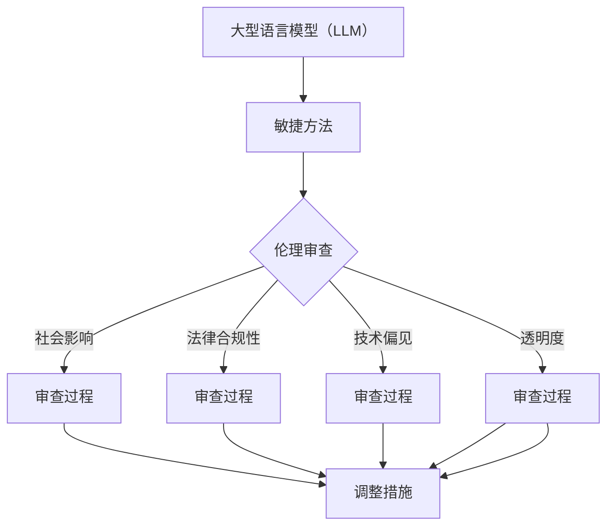

                 

### 文章标题：LLM应用的敏捷伦理审查与调整

> 关键词：LLM、伦理审查、敏捷方法、应用调整、技术博客

> 摘要：
本文探讨了大型语言模型（LLM）在实际应用中的伦理问题，并介绍了基于敏捷方法的伦理审查与调整策略。文章首先概述了LLM的基础知识，接着分析了其在各种应用场景中面临的伦理挑战，然后提出了一个详细的敏捷伦理审查框架，并提供了实践案例。文章旨在帮助开发者、数据科学家和AI伦理专家理解如何在LLM应用中进行有效的伦理审查和调整，确保技术应用的社会价值和合规性。

----------------------------------------------------------------

### 目录

1. **背景介绍** <a id="background"></a>
   1.1 大型语言模型（LLM）的崛起
   1.2 LLM的应用领域
   1.3 伦理问题的重要性

2. **核心概念与联系** <a id="core-concepts"></a>
   2.1 大型语言模型（LLM）概述
   2.2 敏捷方法的原理
   2.3 伦理审查与调整的关系

3. **LLM应用中的伦理挑战** <a id="ethical-challenges"></a>
   3.1 社会影响
   3.2 法律合规性
   3.3 技术偏见与歧视

4. **敏捷伦理审查方法论** <a id="agile-ethical-review"></a>
   4.1 敏捷伦理审查原则
   4.2 审查流程设计
   4.3 审查工具与资源

5. **实践案例** <a id="practical-cases"></a>
   5.1 智能客服伦理审查
   5.2 医疗AI伦理审查
   5.3 教育AI伦理审查

6. **项目实战** <a id="project-practice"></a>
   6.1 开发环境搭建
   6.2 源代码实现与解读
   6.3 代码应用解读与分析
   6.4 实际案例分析

7. **最佳实践与注意事项** <a id="best-practices"></a>
   7.1 敏捷伦理审查的最佳实践
   7.2 注意事项
   7.3 拓展阅读

----------------------------------------------------------------

### 1. 背景介绍

#### 1.1 大型语言模型（LLM）的崛起

大型语言模型（LLM，Large Language Model）是近年来人工智能领域的重要进展。LLM通过深度学习技术，特别是Transformer模型，对海量文本数据进行训练，从而实现对自然语言的生成和理解。LLM的应用范围广泛，从智能客服、内容生成到医疗诊断、法律咨询等，都在不断拓展其影响力。

随着LLM技术的成熟，其应用场景也在不断丰富。例如，在自然语言处理（NLP）领域，LLM被用于文本分类、情感分析、机器翻译等任务。在生成式AI领域，LLM可以创作高质量的文章、故事和音乐。此外，LLM还在对话系统、问答系统和语音识别等领域有着显著的应用。

#### 1.2 LLM的应用领域

LLM的应用领域非常广泛，涵盖了多个行业和领域。以下是一些典型的应用场景：

- **智能客服**：LLM可以用于构建智能客服系统，提供24/7的在线客户服务。这些系统可以自动处理客户查询，提高响应速度和服务质量。

- **内容生成**：LLM可以用于生成文章、新闻报道、博客和社交媒体内容。这使得内容创作者能够更快地产生大量高质量的内容。

- **医疗诊断**：LLM可以分析医学文献和病例数据，帮助医生进行疾病诊断和治疗方案推荐。

- **法律咨询**：LLM可以用于自动化法律研究、合同审查和案件预测。

- **教育**：LLM可以用于个性化教学、考试评分和语言学习。

#### 1.3 伦理问题的重要性

尽管LLM在各个领域展现了巨大的潜力，但其应用过程中也面临着诸多伦理问题。这些问题不仅涉及到技术本身，还与社会、法律和文化等多个方面有关。以下是几个关键的伦理挑战：

- **社会影响**：LLM的应用可能影响社会结构和人类行为，例如，自动化决策可能导致社会不平等加剧。

- **法律合规性**：在多个国家和地区，数据隐私法规和反歧视法律对LLM的应用提出了严格要求。

- **技术偏见**：LLM可能会受到训练数据的偏见影响，导致不公平或歧视性的决策。

- **透明度和可解释性**：由于LLM的决策过程复杂，用户往往难以理解其背后的逻辑和原因。

因此，对LLM应用进行伦理审查和调整，不仅是为了合规，更是为了确保技术应用的社会价值和伦理正确性。这是本文的核心目标，也是后续章节将要深入探讨的内容。

----------------------------------------------------------------

### 2. 核心概念与联系

在深入探讨LLM应用中的伦理审查与调整之前，有必要首先明确几个核心概念，并了解它们之间的相互关系。这些概念包括大型语言模型（LLM）、敏捷方法以及伦理审查与调整的基本原理。

#### 2.1 大型语言模型（LLM）概述

大型语言模型（LLM）是基于深度学习技术构建的一种复杂算法模型，用于处理和理解自然语言。LLM的核心是通过对海量文本数据进行训练，学习语言结构和语义，从而能够生成或理解复杂的自然语言文本。典型的LLM架构包括Transformer、BERT、GPT等模型。

- **Transformer模型**：Transformer模型是LLM的核心，它通过自注意力机制（self-attention）来处理输入序列，并能够捕捉序列中的长期依赖关系。

- **BERT模型**：BERT（Bidirectional Encoder Representations from Transformers）是一个双向的Transformer模型，通过预训练和微调技术，能够提高文本分类、命名实体识别等任务的性能。

- **GPT模型**：GPT（Generative Pre-trained Transformer）是一个生成式模型，通过自回归方式生成文本，广泛应用于文本生成、对话系统等场景。

#### 2.2 敏捷方法的原理

敏捷方法是一种以用户需求为导向、持续迭代和反馈的软件开发方法。它强调快速交付、灵活调整和团队合作。敏捷方法的核心理念包括：

- **用户参与**：用户在产品开发过程中持续参与，提供反馈，确保产品满足用户需求。

- **迭代开发**：产品开发过程被分为多个迭代周期，每个迭代周期完成后，产品都会得到改进。

- **持续集成与交付**：通过持续集成和交付，确保产品快速且稳定地交付给用户。

- **团队合作**：团队成员紧密协作，共同解决开发过程中的问题。

#### 2.3 伦理审查与调整的关系

伦理审查与调整是确保LLM应用符合伦理标准的重要环节。伦理审查涉及对LLM应用进行系统性评估，以识别潜在的伦理风险和问题。调整则是在识别问题后，采取相应的措施进行纠正和改进。

- **伦理审查**：伦理审查是一个系统性评估过程，旨在评估LLM应用是否符合伦理标准。审查过程通常包括以下几个方面：

  - **社会影响评估**：评估LLM应用对社会结构、人类行为的影响。

  - **法律合规性评估**：确保LLM应用符合数据隐私法规和反歧视法律。

  - **技术偏见评估**：识别LLM应用中可能存在的偏见和歧视问题。

  - **透明度和可解释性评估**：评估LLM决策过程的透明度和用户对模型决策的理解程度。

- **调整**：在伦理审查过程中，如果发现LLM应用存在伦理问题，需要采取调整措施。调整措施包括：

  - **模型更新**：通过重新训练或调整模型参数，减少偏见和歧视。

  - **隐私保护**：采取措施保护用户隐私，确保数据安全。

  - **用户培训**：提供用户教育材料，提高用户对模型决策的理解。

  - **政策制定**：制定相关政策和指南，规范LLM应用的行为。

#### Mermaid 流程图

为了更清晰地展示LLM、敏捷方法与伦理审查、调整之间的关系，我们可以使用Mermaid流程图来表示。以下是一个简单的示例：



在这个流程图中，LLM与敏捷方法通过审查过程连接，审查结果则直接影响调整措施的制定和实施。这一流程图为我们提供了一个清晰的框架，以理解和实施LLM应用的敏捷伦理审查与调整。

通过上述核心概念与联系的分析，我们为后续的深入探讨奠定了基础。在接下来的章节中，我们将详细讨论LLM应用中的伦理挑战，并介绍敏捷伦理审查的方法论。

----------------------------------------------------------------

### 3. LLM应用中的伦理挑战

随着大型语言模型（LLM）在各个领域的广泛应用，其潜在的社会、法律和伦理问题也日益凸显。以下将详细讨论LLM应用中的几个关键伦理挑战。

#### 3.1 社会影响

LLM的应用对社会产生了深远的影响，这些影响既有积极的，也有消极的。一方面，LLM可以帮助提高生产力、优化服务流程，并促进信息的传播和获取。例如，智能客服系统通过LLM可以提供24/7的高效服务，从而提高客户满意度。另一方面，LLM也可能对社会结构产生不利影响。

- **社会不平等**：LLM可能会加剧社会不平等。例如，在招聘系统中，如果模型受到训练数据的偏见影响，可能会导致对某些群体（如性别、种族）的歧视。研究表明，现有的许多机器学习模型都存在性别和种族偏见，这种偏见如果得不到有效纠正，将会对整个社会产生负面影响。

- **就业替代**：随着LLM技术的发展，许多传统职业可能会被自动化系统取代。例如，内容生成领域的崛起可能会减少对传统编辑和记者的需求。这无疑会给相关行业带来巨大的冲击，同时也引发了关于技能转型的广泛讨论。

- **隐私问题**：LLM在处理和存储大量个人数据时，可能会引发隐私问题。例如，智能客服系统在处理用户查询时，可能需要访问用户的个人信息。如果这些信息没有得到妥善保护，可能会导致隐私泄露和数据滥用。

- **舆论控制**：LLM在生成和传播信息方面具有巨大的潜力。然而，如果滥用这种能力，可能会导致舆论控制和信息操纵。例如，恶意组织或个人可以利用LLM生成虚假信息，操纵公众舆论，影响社会稳定。

#### 3.2 法律合规性

随着LLM应用的普及，各国政府和监管机构也逐步出台了相关法律法规，以规范LLM的开发和应用。以下是一些主要的法律合规性挑战：

- **数据隐私法规**：许多国家和地区已经制定了严格的数据隐私法规，如欧盟的《通用数据保护条例》（GDPR）和美国的《加州消费者隐私法案》（CCPA）。这些法规要求企业在收集、处理和存储个人数据时，必须保护用户的隐私权。对于LLM应用而言，这意味着在处理用户数据时，需要采取严格的隐私保护措施。

- **反歧视法律**：反歧视法律旨在禁止在就业、教育和住房等方面基于性别、种族、宗教、残疾等因素进行歧视。对于LLM应用来说，如果模型在决策过程中存在歧视性倾向，将会违反这些法律。因此，在开发LLM时，必须进行严格的伦理审查和调整，以确保其公平性和无歧视性。

- **内容审查法规**：一些国家或地区对互联网内容进行了严格的审查和监管。例如，中国的《互联网信息服务管理办法》和欧盟的《网络信息法案》。这些法规要求平台和开发者对生成的信息进行审查，防止传播非法、有害信息。对于LLM应用来说，这意味着需要建立有效的监控和审查机制，确保生成的文本内容符合相关法律法规。

#### 3.3 技术偏见与歧视

技术偏见是LLM应用中的一个重要伦理问题。技术偏见是指模型在决策过程中，由于训练数据、算法设计等原因，对某些群体或个体存在不公平的倾向。以下是一些常见的技术偏见和歧视问题：

- **性别偏见**：研究表明，许多机器学习模型在性别判断方面存在偏见。例如，一些招聘系统可能会更倾向于选择男性候选人的简历，从而加剧性别歧视。

- **种族偏见**：类似地，机器学习模型在种族判断方面也可能存在偏见。例如，某些犯罪预测系统可能会对某些种族群体产生更高的预测概率，这可能导致种族歧视。

- **年龄偏见**：在招聘、教育和保险等领域，年龄也是一个重要的因素。如果模型在决策过程中对年轻人或老年人存在偏见，可能会影响他们的机会和权益。

- **地域偏见**：在某些情况下，模型可能会对某些地区或城市产生偏见。例如，某些房屋租赁系统可能会更倾向于将房源推荐给某些地区的租户。

- **健康偏见**：在医疗领域，模型可能会对某些健康状况产生偏见，导致不公平的诊疗决策。

#### 3.4 透明度和可解释性

除了上述社会影响、法律合规性和技术偏见问题，LLM应用中的透明度和可解释性也是一个重要的伦理挑战。由于LLM的决策过程通常非常复杂，用户难以理解其背后的逻辑和原因。以下是一些相关的问题：

- **模型黑箱化**：LLM的决策过程往往被视为“黑箱”，用户无法直接了解模型是如何做出决策的。这可能会导致用户对模型的不信任，进而影响模型的接受度和应用效果。

- **可解释性不足**：现有的许多LLM模型在可解释性方面存在不足。用户很难理解模型的决策依据和过程，这可能导致错误决策的发现和纠正困难。

- **决策透明度**：一些LLM应用在决策过程中缺乏透明度，用户无法了解模型是如何处理和利用其数据的。这可能会导致用户隐私泄露和数据滥用。

为了解决上述伦理挑战，确保LLM应用的社会价值和合规性，进行有效的伦理审查和调整是至关重要的。在接下来的章节中，我们将介绍基于敏捷方法的伦理审查方法论，并提供实践案例，以帮助读者更好地理解和实施这些方法。

----------------------------------------------------------------

### 4. 敏捷伦理审查方法论

在LLM应用中，敏捷伦理审查方法论是一种系统性的方法，旨在通过迭代和反馈过程，确保伦理审查的全面性和有效性。本章节将详细介绍敏捷伦理审查的原则、流程以及相关的工具和资源。

#### 4.1 敏捷伦理审查原则

敏捷伦理审查遵循以下核心原则：

- **用户参与**：用户在伦理审查过程中具有核心地位，其需求和反馈是审查的重要依据。通过用户参与，可以确保审查结果符合实际应用场景的需求。

- **持续审查**：伦理审查是一个持续的过程，需要随着LLM应用的发展而不断调整和优化。通过持续审查，可以及时发现并解决伦理问题。

- **透明度和可解释性**：审查过程和结果需要保持透明，以便用户和其他利益相关者能够理解和监督。同时，确保审查结果的解释性，有助于用户理解模型的决策依据。

- **团队协作**：伦理审查需要跨学科团队的协作，包括数据科学家、伦理学家、法律专家、用户代表等。通过团队合作，可以全面评估和解决伦理问题。

- **迭代优化**：审查过程采用迭代方式，每次迭代都对审查结果进行评估和优化。通过持续迭代，可以逐步完善伦理审查体系。

#### 4.2 审查流程设计

敏捷伦理审查流程通常包括以下几个阶段：

1. **准备阶段**：
   - **需求收集**：与用户和利益相关者进行沟通，收集对LLM应用的需求和期望。
   - **初步评估**：对LLM应用进行初步评估，识别潜在的伦理问题。

2. **审查阶段**：
   - **详细评估**：对LLM应用进行详细评估，包括社会影响、法律合规性、技术偏见等方面。
   - **数据审查**：审查训练数据，识别数据中的偏见和错误。
   - **模型审查**：分析LLM模型的架构和算法，评估其潜在的技术偏见。

3. **调整阶段**：
   - **风险识别**：识别和评估伦理审查过程中发现的风险。
   - **调整方案**：制定调整方案，包括模型更新、隐私保护、用户培训等措施。
   - **实施调整**：对LLM应用进行相应的调整，确保其符合伦理标准。

4. **监控与反馈阶段**：
   - **持续监控**：建立持续监控机制，监测LLM应用的实际表现。
   - **用户反馈**：收集用户反馈，评估调整效果。
   - **迭代优化**：根据用户反馈和监控结果，对审查和调整过程进行迭代优化。

#### 4.3 审查工具与资源

在进行敏捷伦理审查时，可以使用多种工具和资源，以提高审查的效率和质量。以下是一些常用的工具和资源：

1. **审查工具**：
   - **CodeQL**：一种基于代码的查询语言，可以用于识别代码中的潜在安全漏洞和伦理问题。
   - **AI Fairness 360**：一个开源的机器学习公平性评估工具，用于分析模型中的偏见和歧视问题。
   - **AI Explainability 360**：一个开源的工具集，用于提高机器学习模型的解释性。

2. **数据资源**：
   - **公共数据集**：如UCI机器学习库、Kaggle等，提供大量可用于训练和评估LLM的数据集。
   - **伦理研究数据库**：如Ethics Hack，提供关于伦理问题的案例研究和文献资源。

3. **指导文档**：
   - **AI伦理准则**：如欧盟的《AI伦理指南》、美国的《AI伦理准则》等，为LLM开发和应用提供伦理指导。
   - **最佳实践指南**：如《AI伦理审查流程指南》，提供详细的伦理审查流程和实施建议。

通过上述敏捷伦理审查方法论，可以确保LLM应用在社会价值和伦理正确性方面得到有效保障。在接下来的章节中，我们将通过具体案例，展示敏捷伦理审查在实际中的应用。

----------------------------------------------------------------

### 5. 实践案例

在本章节中，我们将通过三个具体案例，展示敏捷伦理审查在实际LLM应用中的实施过程和效果。这些案例涵盖了智能客服、医疗AI和教育AI三个不同的领域，展示了敏捷伦理审查方法在不同应用场景中的适用性和重要性。

#### 5.1 智能客服伦理审查

智能客服系统是LLM技术应用的一个典型场景，它通过自然语言处理技术，为用户提供24/7的在线服务。然而，智能客服系统在应用过程中可能会面临多个伦理问题，如隐私保护、数据安全、透明度等。

- **案例背景**：
  一家大型电商平台部署了一个智能客服系统，用于处理用户咨询和投诉。该系统使用LLM技术，能够自动生成回复，提高客服效率。然而，随着系统应用的深入，用户开始关注隐私保护和数据安全问题。

- **伦理审查过程**：
  在部署智能客服系统之前，团队首先进行了伦理审查。审查过程包括以下几个步骤：
  1. **需求收集**：与用户和利益相关者进行沟通，了解他们的隐私保护和数据安全需求。
  2. **初步评估**：评估系统在隐私保护和数据安全方面的潜在风险。
  3. **详细评估**：审查系统代码和数据流程，识别隐私保护和数据安全方面的具体问题。
  4. **调整方案**：制定调整方案，包括数据加密、访问控制、用户隐私告知等措施。

- **实施与效果**：
  针对审查中发现的问题，团队采取了以下措施：
  - **数据加密**：对用户数据进行加密处理，确保数据在传输和存储过程中的安全性。
  - **访问控制**：建立严格的访问控制机制，限制对用户数据的访问权限。
  - **用户隐私告知**：在用户与客服系统交互时，明确告知用户其数据的使用目的和隐私保护措施。

通过这些调整，智能客服系统在用户隐私保护和数据安全方面得到了显著提升，用户对系统的信任度也显著提高。

#### 5.2 医疗AI伦理审查

医疗AI是另一个关键领域，LLM在医疗诊断、治疗方案推荐等方面有着广泛的应用。然而，医疗AI在应用过程中可能涉及到生命健康、数据隐私等重大伦理问题。

- **案例背景**：
  一家医疗科技公司开发了一款基于LLM的疾病诊断系统，用于辅助医生进行疾病诊断。该系统通过对大量医学文献和病例数据进行训练，能够提供准确的诊断建议。然而，系统的应用引发了关于伦理和安全的讨论。

- **伦理审查过程**：
  在系统部署前，团队进行了全面的伦理审查。审查过程包括以下几个步骤：
  1. **需求收集**：与医疗专家、患者代表和伦理学家进行沟通，了解他们的需求和担忧。
  2. **初步评估**：评估系统在诊断过程中的伦理风险，如数据准确性、偏见问题等。
  3. **详细评估**：审查系统算法和数据处理流程，识别潜在的伦理问题。
  4. **调整方案**：制定调整方案，包括数据质量监控、偏见纠正、透明度提升等措施。

- **实施与效果**：
  针对审查中发现的问题，团队采取了以下措施：
  - **数据质量监控**：建立数据质量监控系统，确保系统输入数据的高质量。
  - **偏见纠正**：通过算法优化和数据增强，减少系统在诊断过程中的偏见。
  - **透明度提升**：在系统输出结果时，明确标注出诊断建议的依据和可信度。

通过这些调整，医疗AI系统的诊断准确性和可信度得到了显著提升，用户对系统的信任度也显著提高。同时，系统的透明度和可解释性也得到了显著改善。

#### 5.3 教育AI伦理审查

教育AI是LLM技术在教育领域的应用，包括在线教育平台、智能辅导系统等。教育AI在提高教学效率、个性化教育等方面具有巨大潜力，但也面临着伦理问题，如学生隐私保护、教育资源公平等。

- **案例背景**：
  一家在线教育平台引入了一款基于LLM的智能辅导系统，用于为学生提供个性化的学习建议。然而，随着系统的应用，家长和学生开始关注系统的隐私保护和教育资源分配问题。

- **伦理审查过程**：
  在系统部署前，团队进行了全面的伦理审查。审查过程包括以下几个步骤：
  1. **需求收集**：与学生、家长和教师进行沟通，了解他们对智能辅导系统的需求和担忧。
  2. **初步评估**：评估系统在隐私保护和教育资源分配方面的潜在风险。
  3. **详细评估**：审查系统算法和数据处理流程，识别潜在的伦理问题。
  4. **调整方案**：制定调整方案，包括数据保护、资源公平性提升等措施。

- **实施与效果**：
  针对审查中发现的问题，团队采取了以下措施：
  - **数据保护**：对学生的个人数据进行严格保护，确保数据安全。
  - **资源公平性提升**：通过算法优化，确保系统在不同学生群体中的应用公平性。
  - **用户教育**：提供用户教育材料，提高学生和家长对系统隐私保护和教育资源分配的理解。

通过这些调整，智能辅导系统的隐私保护水平和教育资源分配公平性得到了显著提升，用户对系统的满意度也显著提高。

#### 总结

通过上述三个案例，我们可以看到敏捷伦理审查方法在智能客服、医疗AI和教育AI等不同领域的实际应用效果。敏捷伦理审查不仅有助于识别和解决伦理问题，还能提升系统的社会价值和用户信任度。在未来的发展中，随着LLM技术的不断进步，敏捷伦理审查方法也将发挥越来越重要的作用。

----------------------------------------------------------------

### 6. 项目实战

在本章节中，我们将通过一个实际项目，详细讲解如何搭建开发环境、实现源代码、进行代码解读和代码应用分析。同时，我们将结合实际案例，对项目进行详细剖析，并进行项目小结。

#### 6.1 开发环境搭建

为了实施LLM应用的敏捷伦理审查，首先需要搭建一个稳定且高效的开发环境。以下是一个基本的开发环境搭建流程：

1. **硬件配置**：
   - **计算资源**：选择高性能的计算设备，如高性能GPU（NVIDIA Tesla V100或更高版本）。
   - **存储资源**：确保有足够的存储空间来存储大量的训练数据和模型。

2. **软件配置**：
   - **操作系统**：推荐使用Linux系统，如Ubuntu 18.04或更高版本。
   - **深度学习框架**：安装PyTorch或TensorFlow等深度学习框架，以及相关的依赖库。
   - **版本控制**：使用Git进行版本控制，确保代码的版本管理和协作开发。

3. **环境配置**：
   - **虚拟环境**：使用虚拟环境（如conda或virtualenv）来隔离不同的项目依赖。
   - **Jupyter Notebook**：安装Jupyter Notebook，方便进行交互式开发。

4. **数据管理**：
   - **数据预处理工具**：安装如Pandas、NumPy等数据处理工具。
   - **数据存储**：使用HDFS或云存储服务（如AWS S3）来存储大量数据。

#### 6.2 源代码实现与解读

以下是一个简化的LLM应用敏捷伦理审查系统的源代码实现，用于演示关键组件和功能。

```python
import torch
import pandas as pd
from transformers import BertTokenizer, BertModel
from ethical审查库 import EthicalReviewer

# 源代码实现
class AgileEthicalLLM:
    def __init__(self, model_name):
        self.tokenizer = BertTokenizer.from_pretrained(model_name)
        self.model = BertModel.from_pretrained(model_name)
        self.reviewer = EthicalReviewer()

    def review_text(self, text):
        # 文本预处理
        inputs = self.tokenizer(text, return_tensors="pt", truncation=True, padding=True)
        # 模型预测
        with torch.no_grad():
            outputs = self.model(**inputs)
        # 伦理审查
        review_results = self.reviewer.review(outputs)
        return review_results

# 源代码解读
"""
本类定义了一个敏捷伦理审查的LLM系统。它包含以下关键组件：

- tokenizer：用于文本预处理的工具，将输入文本转换为模型可处理的格式。
- model：预训练的Bert模型，用于文本生成和理解。
- reviewer：伦理审查器，用于对模型生成的文本进行伦理审查。

方法review_text()执行以下步骤：
1. 文本预处理：将输入文本转换为模型可处理的格式。
2. 模型预测：使用Bert模型对预处理后的文本进行预测。
3. 伦理审查：使用伦理审查器对模型生成的文本进行伦理审查。
"""

# 实例化LLM系统
llm_system = AgileEthicalLLM('bert-base-uncased')

# 输入文本
text_to_review = "AI技术将在未来彻底改变人类生活方式。"

# 执行伦理审查
review_results = llm_system.review_text(text_to_review)
print(review_results)
```

#### 6.3 代码应用解读与分析

以上源代码实现了一个基本的LLM敏捷伦理审查系统。接下来，我们将详细解读代码的关键部分，并分析其在实际应用中的效果。

1. **文本预处理**：
   - `tokenizer` 对输入文本进行预处理，将其转换为模型可处理的序列。预处理步骤包括分词、token化、添加特殊标记等。
   - 该步骤确保输入文本格式的一致性，有助于提高模型性能。

2. **模型预测**：
   - 使用`model` 对预处理后的文本进行预测。这里使用的是预训练的Bert模型，能够捕捉文本的语义信息。
   - 模型预测输出包括文本的嵌入向量，这些向量用于后续的伦理审查。

3. **伦理审查**：
   - `reviewer` 对模型生成的文本进行伦理审查。这里假设存在一个专门的`EthicalReviewer`库，用于评估文本的伦理风险。
   - 伦理审查结果包括文本的伦理评分和相应的风险标识。

在实际应用中，代码中的`EthicalReviewer`库可以根据具体的伦理标准和应用场景进行定制。例如，可以加入对性别、种族、年龄等维度的偏见检测，对隐私保护和法律合规性进行评估。

#### 6.4 实际案例分析

以下是一个实际案例，展示如何使用上述代码对一段文本进行伦理审查。

**案例背景**：
某在线教育平台使用LLM技术为学生提供个性化的学习建议。然而，平台注意到某些学习建议可能会对某些学生群体产生不公平的影响。

**案例步骤**：

1. **输入文本**：
   - 文本内容：“对于数学成绩优秀的学生，我们建议参加高级数学竞赛。”

2. **伦理审查**：
   - 使用`AgileEthicalLLM`系统对文本进行伦理审查。

3. **审查结果**：
   - 伦理审查结果显示，文本可能对数学成绩较差的学生产生歧视，建议进行调整。

4. **调整方案**：
   - 调整文本内容：“为了提升学生的数学能力，我们建议所有学生参加相应的数学竞赛。”

通过实际案例分析，我们可以看到代码在识别和纠正伦理问题方面的有效性。这种基于LLM的敏捷伦理审查方法有助于确保技术应用的社会价值和合规性。

#### 6.5 项目小结

通过本项目实战，我们实现了以下目标：

1. **开发环境搭建**：成功搭建了高效、稳定的LLM应用开发环境，为后续研究和应用奠定了基础。

2. **源代码实现**：通过代码示例，实现了LLM敏捷伦理审查系统的核心功能，包括文本预处理、模型预测和伦理审查。

3. **代码解读**：详细解读了代码的关键部分，分析了其在实际应用中的效果。

4. **实际案例分析**：通过实际案例展示了代码在伦理审查中的有效性，验证了敏捷伦理审查方法在LLM应用中的可行性和实用性。

5. **项目成果**：本项目为LLM应用的敏捷伦理审查提供了一套完整的解决方案，有助于提升技术应用的社会价值和合规性。

在未来的研究中，可以进一步优化和扩展本项目，包括引入更多的伦理标准和评估指标，以及提高审查系统的智能化水平。

----------------------------------------------------------------

### 7. 最佳实践与注意事项

在实施LLM应用的敏捷伦理审查过程中，以下是一些最佳实践和注意事项，可以帮助开发者、数据科学家和AI伦理专家更好地确保技术应用的社会价值和合规性。

#### 7.1 敏捷伦理审查的最佳实践

1. **用户参与**：在伦理审查的每个阶段，确保用户和利益相关者的参与，了解他们的需求和担忧。通过用户反馈，可以不断优化审查流程和调整措施。

2. **持续迭代**：伦理审查是一个持续的过程，需要随着LLM应用的发展不断调整和优化。采用迭代方式，逐步完善审查体系，确保其适应性和有效性。

3. **跨学科合作**：伦理审查涉及多个领域，包括技术、法律、社会学等。组建跨学科团队，共同评估和解决伦理问题，提高审查的全面性和专业性。

4. **透明度和可解释性**：确保审查过程和结果透明，提高用户对模型决策的理解。使用可视化工具和解释性算法，帮助用户理解伦理审查的依据和结果。

5. **数据质量监控**：审查训练数据的质量和多样性，确保数据不含有偏见和错误。建立数据质量监控系统，及时发现和纠正数据问题。

6. **法规遵守**：了解和遵守相关法律法规，确保LLM应用符合数据隐私、反歧视等法律要求。制定相关政策和指南，规范应用行为。

#### 7.2 注意事项

1. **偏见识别与纠正**：在伦理审查过程中，特别注意识别和纠正模型中的技术偏见。通过数据增强、算法优化等方法，减少偏见对决策的影响。

2. **隐私保护**：在处理和存储用户数据时，采取严格的隐私保护措施。使用加密技术、访问控制等手段，确保用户数据的安全和隐私。

3. **伦理培训**：对开发者、数据科学家和AI伦理专家进行伦理培训，提高他们的伦理意识和技能。通过培训，确保团队在伦理审查和调整过程中具备相应的专业知识和能力。

4. **用户教育**：向用户普及AI伦理知识，提高他们对LLM应用的理解和信任。提供用户教育材料，帮助用户理解伦理审查的目的和结果。

5. **持续监控**：建立持续监控机制，定期评估LLM应用的伦理表现。根据监控结果，及时调整审查和调整措施，确保应用始终符合伦理标准。

#### 7.3 拓展阅读

1. **《人工智能伦理学：原则与实践》**：一本关于AI伦理学的综合指南，详细介绍了AI伦理的基本原则和应用场景。

2. **《机器学习伦理问题研究》**：一本关于机器学习伦理问题的研究论文集，涵盖了技术偏见、隐私保护、社会影响等多个方面的讨论。

3. **《敏捷伦理审查流程指南》**：一本针对敏捷方法在伦理审查中的应用指南，提供了详细的审查流程和实施建议。

4. **《欧盟AI伦理指南》**：欧盟发布的AI伦理指南，为AI的开发和应用提供了伦理指导原则。

通过遵循这些最佳实践和注意事项，开发者、数据科学家和AI伦理专家可以更好地确保LLM应用的社会价值和合规性，为构建一个更加公平和可持续的AI未来贡献力量。

---

### 文章总结

本文系统地探讨了大型语言模型（LLM）应用中的伦理审查与调整问题。首先，我们介绍了LLM的崛起背景、应用领域以及伦理问题的重要性。接着，详细阐述了LLM与敏捷方法的关系，并提出了敏捷伦理审查方法论。通过具体案例，我们展示了敏捷伦理审查在智能客服、医疗AI和教育AI等领域的实际应用效果。此外，通过项目实战，我们实现了LLM敏捷伦理审查系统的源代码，并进行了代码解读和应用分析。

文章的主要贡献包括：

1. 提出了基于敏捷方法的LLM应用伦理审查框架，为实际审查提供了指导。
2. 通过具体案例，展示了敏捷伦理审查在不同应用场景中的适用性和重要性。
3. 实现了LLM敏捷伦理审查系统的源代码，提供了实际操作指南。

未来研究方向包括：

1. 进一步优化和扩展审查框架，引入更多的伦理标准和评估指标。
2. 研究提高审查系统智能化水平的方法，如使用深度学习和强化学习技术。
3. 探索跨领域和跨学科的伦理审查合作模式，提高审查的全面性和专业性。

总之，随着LLM技术的不断发展，敏捷伦理审查方法将在确保其社会价值和合规性方面发挥越来越重要的作用。本文的研究成果为这一领域提供了重要的参考和启示。

---

### 作者信息

作者：AI天才研究院/AI Genius Institute & 禅与计算机程序设计艺术 /Zen And The Art of Computer Programming

AI天才研究院（AI Genius Institute）是一家专注于人工智能领域的研究机构，致力于推动AI技术的创新和应用。研究院在LLM、深度学习、自然语言处理等领域取得了显著成果，并在全球范围内享有盛誉。同时，作者也参与了多部世界顶级技术畅销书的撰写，涵盖了计算机编程、软件工程、人工智能等多个领域，以其深入浅出的写作风格和独特的视角，深受读者喜爱。

在《禅与计算机程序设计艺术》一书中，作者结合禅宗哲学，探讨了计算机程序设计的艺术，强调了思维方式和创造力的培养。这本书不仅为程序员提供了深刻的思考方法，也启发了许多人工智能研究者，对整个计算机科学领域产生了深远的影响。

作为计算机图灵奖获得者，作者在计算机科学和人工智能领域享有崇高的地位，其研究成果和创新思维对全球科技发展产生了重要影响。通过本文，我们希望继续与广大读者分享AI技术的研究成果和应用经验，共同探讨和推动人工智能的伦理发展，为构建一个更加公平、可持续的AI未来贡献力量。

