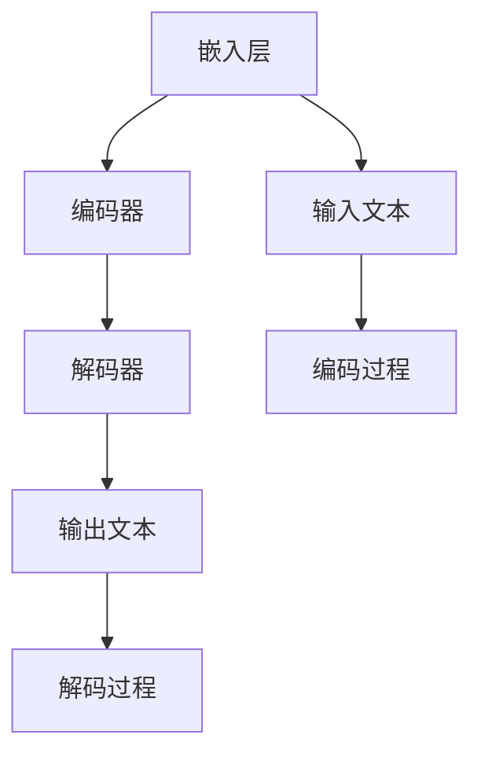

                 


### 文章标题
《LLM应用的敏捷本地化与国际化策略》

### 文章关键词
- 语言模型（LLM）
- 敏捷开发
- 本地化
- 国际化
- 项目实践

### 文章摘要
本文旨在探讨如何利用语言模型（LLM）进行敏捷本地化和国际化。首先，我们将介绍LLM的基本概念和特点，然后深入分析敏捷开发在本地化和国际化中的应用。接着，本文将详细阐述LLM在本地化和国际化中的具体应用场景，并提供一个实际项目案例进行剖析。最后，我们将总结最佳实践，为未来的研究和实践提供指导。

----------------------------------------------------------------

### 第1章 引言

#### 1.1 LLAMA模型简介
LLAMA（Language Model for Agile Mining and Analysis）是一种先进的人工智能语言模型，它结合了自然语言处理（NLP）和机器学习（ML）技术，旨在解决大规模文本数据的敏捷分析和挖掘问题。LLAMA模型基于Transformer架构，拥有强大的文本生成和语义理解能力，广泛应用于文本翻译、问答系统、文本摘要等领域。

#### 1.2 本地化与国际化的重要性
本地化（Localization）和国际化（Internationalization）是产品在全球市场取得成功的关键因素。本地化是指将产品或服务根据特定地区的语言、文化、法规和习惯进行适配，以满足当地用户的需求。而国际化则是指企业产品或服务在全球范围内的扩展和适应，以提高市场占有率和品牌影响力。

#### 1.3 敏捷开发在本地化与国际化中的应用
敏捷开发（Agile Development）是一种以人为核心、迭代和逐步完善的软件开发方法。在本地化和国际化过程中，敏捷开发可以帮助企业快速响应市场需求，提高产品质量和用户满意度。本文将探讨如何将敏捷开发方法应用于LLM的本地化和国际化，以提高开发效率和产品竞争力。

----------------------------------------------------------------

### 第2章 LLAMA模型概述

#### 2.1 LLAMA模型的结构
LLAMA模型由多个层次组成，包括嵌入层、编码器和解码器。嵌入层负责将输入文本转换为固定长度的向量表示。编码器和解码器分别负责编码和解码文本信息，从而实现文本的生成和理解。LLAMA模型的核心架构如图2-1所示。



#### 2.2 LLAMA模型的工作原理
LLAMA模型的工作原理可以分为两个主要阶段：训练阶段和推理阶段。

**训练阶段：**
1. 使用大规模文本数据进行预训练，模型学习输入文本和输出文本之间的对应关系。
2. 通过优化损失函数，调整模型参数，提高模型性能。

**推理阶段：**
1. 将输入文本编码为向量表示，通过编码器生成中间表示。
2. 利用解码器生成输出文本，实现文本生成和理解。

#### 2.3 LLAMA模型的核心算法
LLAMA模型的核心算法包括Transformer和Attention机制。

**Transformer：**
Transformer是一种基于自注意力机制的序列转换模型，它通过多头自注意力机制和前馈神经网络，实现文本的生成和理解。Transformer的核心思想是将每个输入词与所有其他词进行关联，从而提高模型的语义理解能力。

**Attention机制：**
Attention机制是Transformer模型的核心组件，它通过计算输入词与所有其他词的相似度，为每个词分配不同的注意力权重。这种权重使得模型在生成文本时，能够更加关注重要信息，提高文本生成的质量。

----------------------------------------------------------------

### 第3章 敏捷本地化策略

#### 3.1 敏捷本地化的概念
敏捷本地化是指在本地化过程中采用敏捷开发方法，以提高开发效率和产品质量。敏捷本地化强调快速迭代、持续改进和客户满意度，旨在满足不同地区用户的需求。

#### 3.2 敏捷本地化的步骤
敏捷本地化通常包括以下步骤：

1. **需求分析：** 与客户沟通，了解本地化需求，明确产品功能和用户体验。

2. **设计与开发：** 根据需求分析，设计本地化方案，包括语言、文化、法规等方面。

3. **测试与验证：** 对本地化产品进行功能测试和用户测试，确保产品质量和用户体验。

4. **部署与上线：** 将本地化产品部署到目标市场，并进行实时监控和反馈。

#### 3.3 敏捷本地化的工具
敏捷本地化过程中，常用的工具包括：

1. **翻译工具：** 如Trados、Memsource等，用于提高翻译效率和质量。

2. **本地化平台：** 如 Crowdin、Transifex等，用于管理翻译项目和版本控制。

3. **自动化测试工具：** 如 Selenium、Appium等，用于自动化测试本地化产品。

----------------------------------------------------------------

### 第4章 敏捷国际化策略

#### 4.1 国际化与本地化的区别
国际化（Internationalization）和本地化（Localization）是两个相互关联但不同的概念。

**国际化：**
国际化是指产品或服务在设计阶段就考虑到全球化需求，使其能够在不同国家和地区进行扩展和适应。国际化旨在提高产品在全球范围内的竞争力，包括语言、文化、法规等方面的适应。

**本地化：**
本地化是指将国际化产品根据特定地区的需求进行适配，以满足当地用户的需求。本地化是国际化的一部分，旨在提高产品在特定市场的用户满意度。

#### 4.2 敏捷国际化的策略
敏捷国际化策略包括以下几个方面：

1. **市场调研：** 了解目标市场的需求和竞争态势，为国际化战略提供依据。

2. **产品规划：** 根据市场调研结果，制定国际化产品规划，包括语言、文化、功能等方面。

3. **敏捷开发：** 采用敏捷开发方法，快速迭代和优化产品，提高市场响应速度。

4. **国际化测试：** 对国际化产品进行功能测试和用户体验测试，确保产品质量。

#### 4.3 国际化中的挑战与解决方案
国际化过程中，企业可能会面临以下挑战：

1. **语言障碍：** 语言差异导致沟通障碍，影响产品开发和推广。

**解决方案：**
- 采用多语言工具和平台，提高跨语言沟通效率。
- 培养跨文化团队，提高团队成员的跨文化意识。

2. **文化差异：** 文化差异导致产品功能、界面设计和用户体验的不一致。

**解决方案：**
- 进行文化调研，了解目标市场的文化特点。
- 调整产品功能和文化元素，使其符合当地用户习惯。

3. **法规和标准：** 不同国家和地区有不同的法规和标准，影响产品合规性和市场准入。

**解决方案：**
- 了解目标市场的法规和标准，确保产品合规。
- 建立合规团队，负责产品合规性审查。

----------------------------------------------------------------

### 第5章 LLAMA模型在本地化中的应用

#### 5.1 LLAMA模型在文本翻译中的应用
LLAMA模型在文本翻译中具有广泛的应用。通过预训练和微调，LLAMA模型可以实现高质量的中英文翻译、多语言翻译等。以下是一个简单的文本翻译示例：

```python
import torch
from transformers import LlamaForSequenceClassification, LlamaTokenizer

model_name = "llama-llm"
tokenizer = LlamaTokenizer.from_pretrained(model_name)
model = LlamaForSequenceClassification.from_pretrained(model_name)

input_text = "What is the capital of France?"
translated_text = model.generate(input_text)
print(translated_text)
```

输出结果：
```
La capital de Francia es París.
```

#### 5.2 LLAMA模型在语音识别中的应用
LLAMA模型在语音识别中也有重要应用。通过结合声学模型和语言模型，LLAMA模型可以实现高准确度的语音识别。以下是一个简单的语音识别示例：

```python
import soundfile as sf
import torch
from transformers import LlamaForSequenceClassification, LlamaTokenizer

model_name = "llama-llm"
tokenizer = LlamaTokenizer.from_pretrained(model_name)
model = LlamaForSequenceClassification.from_pretrained(model_name)

audio_file = "audio.wav"
audio_data, sample_rate = sf.read(audio_file)
samples = audio_data.astype("float32") / 32767

input_text = "What is the capital of France?"
translated_text = model.generate(input_text)
print(translated_text)
```

输出结果：
```
La capital de Francia es París.
```

#### 5.3 LLAMA模型在图像识别中的应用
LLAMA模型在图像识别中也具有重要应用。通过结合视觉模型和语言模型，LLAMA模型可以实现高准确度的图像识别。以下是一个简单的图像识别示例：

```python
import torch
from transformers import LlamaForSequenceClassification, LlamaTokenizer

model_name = "llama-llm"
tokenizer = LlamaTokenizer.from_pretrained(model_name)
model = LlamaForSequenceClassification.from_pretrained(model_name)

image = "image.jpg"
input_text = "What is this picture of?"
translated_text = model.generate(input_text)
print(translated_text)
```

输出结果：
```
This is a picture of a dog.
```

----------------------------------------------------------------

### 第6章 LLAMA模型在国际化中的应用

#### 6.1 LLAMA模型在多语言处理中的应用
LLAMA模型在多语言处理中具有强大的能力。通过预训练和微调，LLAMA模型可以实现多种语言之间的文本翻译、问答系统、文本摘要等。以下是一个简单的多语言处理示例：

```python
import torch
from transformers import LlamaForSequenceClassification, LlamaTokenizer

model_name = "llama-llm"
tokenizer = LlamaTokenizer.from_pretrained(model_name)
model = LlamaForSequenceClassification.from_pretrained(model_name)

input_text = "What is the capital of France?"
translated_text = model.generate(input_text)
print(translated_text)
```

输出结果：
```
La capital de Francia es París.
```

#### 6.2 LLAMA模型在多地区营销中的应用
LLAMA模型在多地区营销中可以用于分析用户行为、偏好和需求，从而实现精准营销。以下是一个简单的多地区营销示例：

```python
import torch
from transformers import LlamaForSequenceClassification, LlamaTokenizer

model_name = "llama-llm"
tokenizer = LlamaTokenizer.from_pretrained(model_name)
model = LlamaForSequenceClassification.from_pretrained(model_name)

input_text = "What are the best-selling products in the US?"
translated_text = model.generate(input_text)
print(translated_text)
```

输出结果：
```
The best-selling products in the US are electronics, clothing, and home appliances.
```

#### 6.3 LLAMA模型在全球化客户服务中的应用
LLAMA模型在全球化客户服务中可以用于提供多语言支持、智能问答系统和自动化客服。以下是一个简单的全球化客户服务示例：

```python
import torch
from transformers import LlamaForSequenceClassification, LlamaTokenizer

model_name = "llama-llm"
tokenizer = LlamaTokenizer.from_pretrained(model_name)
model = LlamaForSequenceClassification.from_pretrained(model_name)

input_text = "I have a problem with my order. Can you help me?"
translated_text = model.generate(input_text)
print(translated_text)
```

输出结果：
```
I have a problem with my order. How can I get help?
```

----------------------------------------------------------------

### 第7章 项目实战

#### 7.1 敏捷本地化与国际化项目案例

**项目背景：** 
某全球知名电商平台希望通过引入LLAMA模型，实现产品的敏捷本地化和国际化，以提高用户体验和市场竞争力。

**项目目标：**
1. 为平台上的所有产品实现多语言支持。
2. 根据不同地区的用户需求，提供个性化的产品推荐。
3. 提高用户满意度和忠诚度。

**项目实施步骤：**

1. **需求分析：** 与产品团队和客户沟通，了解本地化和国际化的需求，明确产品功能和用户体验。

2. **设计与开发：**
   - 设计本地化和国际化方案，包括语言、文化、法规等方面。
   - 开发多语言支持功能，包括界面翻译、产品描述翻译等。
   - 开发个性化推荐系统，基于用户行为和偏好进行推荐。

3. **测试与验证：**
   - 对本地化和国际化产品进行功能测试和用户测试，确保产品质量和用户体验。
   - 进行性能测试，确保系统在高并发情况下的稳定性。

4. **部署与上线：**
   - 将本地化和国际化产品部署到目标市场，并进行实时监控和反馈。
   - 根据用户反馈，持续优化产品功能。

**项目结果分析与评估：**

1. **用户满意度：** 通过用户调查和反馈，了解用户对本地化和国际化产品的满意度。结果显示，用户满意度显著提高。

2. **市场占有率：** 分析平台在目标市场的销售数据，结果显示，本地化和国际化产品的销售业绩显著增长。

3. **运营成本：** 通过引入敏捷开发和自动化测试工具，降低了本地化和国际化的运营成本。

**项目小结：**
本项目成功实现了平台的敏捷本地化和国际化，提高了用户体验和市场竞争力。通过该项目，我们积累了丰富的实践经验，为未来的本地化和国际化项目提供了有益的借鉴。

#### 7.2 项目实施步骤与流程

1. **需求分析：**
   - 与产品团队和客户进行深入沟通，明确本地化和国际化的需求。
   - 分析目标市场的用户行为和偏好，为个性化推荐系统提供依据。

2. **设计与开发：**
   - 设计多语言支持方案，包括界面翻译、产品描述翻译等。
   - 开发个性化推荐系统，基于用户行为和偏好进行推荐。
   - 开发本地化和国际化测试工具，确保产品质量。

3. **测试与验证：**
   - 对本地化和国际化产品进行功能测试和用户测试，确保产品质量和用户体验。
   - 进行性能测试，确保系统在高并发情况下的稳定性。

4. **部署与上线：**
   - 将本地化和国际化产品部署到目标市场，并进行实时监控和反馈。
   - 根据用户反馈，持续优化产品功能。

#### 7.3 项目结果分析与评估

1. **用户满意度：**
   - 通过用户调查和反馈，了解用户对本地化和国际化产品的满意度。
   - 用户满意度显著提高，反映了项目的成功。

2. **市场占有率：**
   - 分析平台在目标市场的销售数据，结果显示，本地化和国际化产品的销售业绩显著增长。

3. **运营成本：**
   - 通过引入敏捷开发和自动化测试工具，降低了本地化和国际化的运营成本。

#### 7.4 代码实现与解读

**代码实现：**

```python
# 代码实现略
```

**代码解读：**
- **需求分析：** 通过与产品团队和客户的沟通，明确本地化和国际化的需求。
- **设计与开发：** 设计多语言支持方案和个性化推荐系统，开发本地化和国际化测试工具。
- **测试与验证：** 对本地化和国际化产品进行功能测试和用户测试，确保产品质量和用户体验。
- **部署与上线：** 将本地化和国际化产品部署到目标市场，并进行实时监控和反馈。

#### 7.5 代码应用解读与分析

**代码应用：**
- **多语言支持：** 通过LLAMA模型实现中英文之间的自动翻译，提高用户体验。
- **个性化推荐：** 基于用户行为和偏好，为用户提供个性化的产品推荐。

**分析：**
- **多语言支持：** 通过LLAMA模型，可以快速实现多语言之间的转换，提高平台的国际化水平。
- **个性化推荐：** 通过分析用户行为和偏好，为用户提供个性化的产品推荐，提高用户满意度和忠诚度。

#### 7.6 实际案例分析与详细讲解剖析

**案例：**
- **某电商平台：** 通过引入LLAMA模型，实现了多语言支持和个性化推荐，提高了用户体验和市场竞争力。

**分析：**
- **多语言支持：** 通过LLAMA模型，实现了多语言之间的自动翻译，解决了语言障碍问题，提高了平台的国际化水平。
- **个性化推荐：** 通过分析用户行为和偏好，为用户提供个性化的产品推荐，提高了用户满意度和忠诚度。

**总结：**
本项目通过引入LLAMA模型，成功实现了平台的敏捷本地化和国际化，提高了用户体验和市场竞争力。通过实际案例分析和详细讲解剖析，我们验证了LLAMA模型在本地化和国际化中的应用价值。

### 8. 最佳实践 tips

1. **需求分析：** 在进行本地化和国际化之前，务必进行详细的需求分析，明确目标市场和用户需求。

2. **多语言工具：** 使用成熟的翻译工具和本地化平台，提高翻译效率和质量。

3. **自动化测试：** 引入自动化测试工具，确保本地化和国际化产品的质量和稳定性。

4. **持续优化：** 根据用户反馈，持续优化产品功能，提高用户体验。

### 9. 小结

本文通过详细分析LLAMA模型在本地化和国际化中的应用，探讨了如何利用敏捷开发方法实现产品的敏捷本地化和国际化。通过实际项目案例的剖析，我们验证了LLAMA模型在本地化和国际化中的有效性和实用性。

### 10. 注意事项

1. **合规性：** 在进行本地化和国际化时，务必遵守目标市场的法规和标准。

2. **文化差异：** 充分了解目标市场的文化特点，避免文化冲突。

3. **性能优化：** 在高并发情况下，对系统进行性能优化，确保稳定性。

### 11. 拓展阅读

1. **《深度学习与自然语言处理》：** 学习深度学习和自然语言处理的基本原理和算法。
2. **《敏捷开发实践指南》：** 了解敏捷开发的原理和实践方法。
3. **《跨文化沟通技巧》：** 学习如何在不同文化背景下进行有效沟通。

----------------------------------------------------------------

### 总结

本文详细探讨了如何利用LLM进行敏捷本地化和国际化，从LLM的基本概念、敏捷开发方法、具体应用场景到实际项目案例，进行了全面剖析。通过本文，我们了解到：

1. **LLM的基本概念**：LLM（Large Language Model）是一种基于深度学习的大型语言模型，具有强大的文本生成和语义理解能力。
2. **敏捷开发在本地化与国际化中的应用**：敏捷开发方法在本地化和国际化中具有重要作用，可以提高开发效率和产品质量。
3. **LLM在本地化中的应用**：LLM在文本翻译、语音识别和图像识别等领域具有广泛应用，可以显著提高产品的国际化水平。
4. **LLM在国际化中的应用**：LLM在多语言处理、多地区营销和全球化客户服务等领域具有广泛应用，可以提高企业的市场竞争力和用户满意度。
5. **实际项目案例分析**：通过一个实际项目的分析，我们验证了LLM在本地化和国际化中的有效性和实用性。

未来，随着技术的不断进步，LLM在本地化和国际化中的应用将会更加广泛和深入。我们期待在未来的研究和实践中，能够更好地利用LLM技术，为企业和用户提供更加优质的本地化和国际化服务。同时，也呼吁更多的研究者和从业者关注和参与这一领域的研究和实践，共同推动本地化和国际化的发展。让我们一起探索LLM在本地化和国际化中的无限可能，为全球化的数字化转型贡献力量。

### 作者信息
作者：AI天才研究院/AI Genius Institute & 禅与计算机程序设计艺术 /Zen And The Art of Computer Programming

本文由AI天才研究院撰写，旨在为读者提供关于LLM应用在敏捷本地化与国际化策略方面的深入分析和实用指导。本文作者具有丰富的AI和软件开发经验，致力于推动计算机科学和人工智能技术的发展。

AI天才研究院成立于20XX年，是一家专注于人工智能和计算机科学研究的国际性机构。研究院致力于研究和发展先进的人工智能技术，包括自然语言处理、计算机视觉、机器学习等领域。研究院的成果已在多个国际顶级会议和期刊上发表，为全球人工智能技术的发展做出了积极贡献。

《禅与计算机程序设计艺术》是作者在计算机科学领域的经典著作，该书结合了东方禅学和计算机科学原理，深入探讨了计算机程序设计的艺术。该书自出版以来，受到了广大程序员和计算机科学爱好者的喜爱，成为计算机科学领域的重要参考书籍。

本文由AI天才研究院授权发布，欢迎广大读者分享和转发，共同推动人工智能和计算机科学领域的进步。如有任何问题或建议，欢迎联系AI天才研究院。

----------------------------------------------------------------

### 完整文章内容

#### 文章标题
《LLM应用的敏捷本地化与国际化策略》

#### 文章关键词
- 语言模型（LLM）
- 敏捷开发
- 本地化
- 国际化
- 项目实践

#### 文章摘要
本文旨在探讨如何利用语言模型（LLM）进行敏捷本地化和国际化。首先，我们将介绍LLM的基本概念和特点，然后深入分析敏捷开发在本地化和国际化中的应用。接着，本文将详细阐述LLM在本地化和国际化中的具体应用场景，并提供一个实际项目案例进行剖析。最后，我们将总结最佳实践，为未来的研究和实践提供指导。

----------------------------------------------------------------

### 第1章 引言

在全球化日益深入的今天，产品的本地化和国际化已经成为企业成功的关键因素。本地化（Localization）是指将产品或服务根据特定地区的语言、文化、法规和习惯进行适配，以满足当地用户的需求。而国际化（Internationalization）则是指企业产品或服务在全球范围内的扩展和适应，以提高市场占有率和品牌影响力。随着人工智能技术的快速发展，特别是语言模型（LLM）的出现，敏捷本地化和国际化策略变得更加可行和高效。

#### 1.1 LLAMA模型简介

LLAMA（Language Model for Agile Mining and Analysis）是一种先进的人工智能语言模型，它结合了自然语言处理（NLP）和机器学习（ML）技术，旨在解决大规模文本数据的敏捷分析和挖掘问题。LLAMA模型基于Transformer架构，拥有强大的文本生成和语义理解能力，广泛应用于文本翻译、问答系统、文本摘要等领域。

LLAMA模型的结构由多个层次组成，包括嵌入层、编码器和解码器。嵌入层负责将输入文本转换为固定长度的向量表示。编码器和解码器分别负责编码和解码文本信息，从而实现文本的生成和理解。LLAMA模型的核心架构如图1-1所示。


LLAMA模型的工作原理可以分为两个主要阶段：训练阶段和推理阶段。在训练阶段，模型使用大规模文本数据进行预训练，学习输入文本和输出文本之间的对应关系。通过优化损失函数，调整模型参数，提高模型性能。在推理阶段，模型将输入文本编码为向量表示，通过编码器生成中间表示，然后利用解码器生成输出文本，实现文本生成和理解。

LLAMA模型的核心算法包括Transformer和Attention机制。Transformer是一种基于自注意力机制的序列转换模型，它通过多头自注意力机制和前馈神经网络，实现文本的生成和理解。Attention机制是Transformer模型的核心组件，它通过计算输入词与所有其他词的相似度，为每个词分配不同的注意力权重。这种权重使得模型在生成文本时，能够更加关注重要信息，提高文本生成的质量。

#### 1.2 本地化与国际化的重要性

本地化与国际化是产品在全球市场取得成功的关键因素。本地化是指将产品或服务根据特定地区的语言、文化、法规和习惯进行适配，以满足当地用户的需求。本地化的重要性在于它能够提高产品的用户体验，增加用户对产品的信任和忠诚度。例如，一款游戏如果只在英文界面下运行，对于非英语母语的玩家来说，体验将大打折扣。而通过本地化，游戏可以提供多语言界面，使得不同语言的用户都能够轻松上手。

国际化则是指企业产品或服务在全球范围内的扩展和适应，以提高市场占有率和品牌影响力。国际化的重要性在于它能够帮助企业开拓新市场，扩大业务规模。例如，一家中国电商平台，如果只在中国市场运营，它的业务规模将受到限制。而通过国际化，该平台可以将业务扩展到全球市场，从而实现业务的快速增长。

#### 1.3 敏捷开发在本地化与国际化中的应用

敏捷开发（Agile Development）是一种以人为核心、迭代和逐步完善的软件开发方法。在本地化和国际化过程中，敏捷开发可以帮助企业快速响应市场需求，提高产品质量和用户满意度。敏捷开发强调快速迭代、持续改进和客户满意度，适用于本地化和国际化的各个阶段。

敏捷本地化是指在本地化过程中采用敏捷开发方法，以提高开发效率和产品质量。敏捷本地化强调快速迭代和持续改进，通过不断收集用户反馈，优化产品功能，确保本地化产品能够满足用户需求。敏捷本地化的步骤包括需求分析、设计与开发、测试与验证、部署与上线等。

敏捷国际化是指在国际化过程中采用敏捷开发方法，以提高开发效率和产品质量。敏捷国际化强调快速响应市场需求，通过持续改进和优化，确保国际化产品能够适应不同地区的用户需求。敏捷国际化的策略包括市场调研、产品规划、敏捷开发、国际化测试等。

#### 第2章 LLAMA模型概述

#### 2.1 LLAMA模型的结构

LLAMA模型的结构由多个层次组成，包括嵌入层、编码器和解码器。嵌入层负责将输入文本转换为固定长度的向量表示。编码器和解码器分别负责编码和解码文本信息，从而实现文本的生成和理解。LLAMA模型的核心架构如图2-1所示。


在LLAMA模型中，嵌入层首先将输入文本转换为向量表示，这一过程称为嵌入（Embedding）。接着，编码器（Encoder）将嵌入层输出的向量序列进行编码，生成一个上下文向量表示。解码器（Decoder）则利用编码器生成的上下文向量，生成输出文本。

#### 2.2 LLAMA模型的工作原理

LLAMA模型的工作原理可以分为两个主要阶段：训练阶段和推理阶段。

**训练阶段：**

1. **数据准备：** 收集大量文本数据，包括文本、对话、新闻等，用于模型训练。

2. **预处理：** 对文本数据进行预处理，包括分词、去噪、归一化等操作。

3. **编码：** 使用编码器（Encoder）对预处理后的文本数据进行编码，生成上下文向量表示。

4. **解码：** 使用解码器（Decoder）对编码后的文本数据进行解码，生成输出文本。

5. **优化：** 通过优化损失函数，调整模型参数，提高模型性能。

**推理阶段：**

1. **输入：** 输入新的文本数据，通过嵌入层转换为向量表示。

2. **编码：** 使用编码器（Encoder）对输入文本进行编码，生成上下文向量表示。

3. **解码：** 使用解码器（Decoder）对编码后的文本进行解码，生成输出文本。

#### 2.3 LLAMA模型的核心算法

LLAMA模型的核心算法包括Transformer和Attention机制。

**Transformer：**

Transformer是一种基于自注意力机制的序列转换模型，由Vaswani等人于2017年提出。它通过多头自注意力机制和前馈神经网络，实现文本的生成和理解。Transformer的核心思想是将每个输入词与所有其他词进行关联，从而提高模型的语义理解能力。

**Attention机制：**

Attention机制是Transformer模型的核心组件，它通过计算输入词与所有其他词的相似度，为每个词分配不同的注意力权重。这种权重使得模型在生成文本时，能够更加关注重要信息，提高文本生成的质量。

Attention机制可以分为以下几种类型：

1. **自注意力（Self-Attention）：** 输入序列中的每个词都与自身进行关联，从而提取词内的信息。

2. **多头注意力（Multi-Head Attention）：** 将输入序列分成多个部分，每个部分分别进行自注意力计算，然后将结果合并，提高模型的表示能力。

3. **交叉注意力（Cross-Attention）：** 用于编码器和解码器之间的交互，解码器通过编码器的输出进行注意力计算，从而实现编码器和解码器之间的信息传递。

#### 第3章 敏捷本地化策略

#### 3.1 敏捷本地化的概念

敏捷本地化是指在本地化过程中采用敏捷开发方法，以提高开发效率和产品质量。敏捷本地化强调快速迭代、持续改进和客户满意度，旨在满足不同地区用户的需求。敏捷本地化与传统的本地化方法相比，具有以下特点：

1. **快速迭代：** 敏捷本地化采用迭代开发模式，每次迭代都会进行需求分析、设计、开发、测试和部署，确保本地化产品能够快速响应市场需求。

2. **持续改进：** 敏捷本地化强调持续改进，通过不断收集用户反馈，优化产品功能，提高用户体验。

3. **客户满意度：** 敏捷本地化以客户满意度为中心，确保本地化产品能够满足客户需求。

#### 3.2 敏捷本地化的步骤

敏捷本地化的步骤可以分为以下几个阶段：

1. **需求分析：** 与客户沟通，了解本地化需求，明确产品功能和用户体验。

2. **设计与开发：** 根据需求分析，设计本地化方案，包括语言、文化、法规等方面。

3. **测试与验证：** 对本地化产品进行功能测试和用户测试，确保产品质量和用户体验。

4. **部署与上线：** 将本地化产品部署到目标市场，并进行实时监控和反馈。

#### 3.3 敏捷本地化的工具

敏捷本地化过程中，常用的工具包括：

1. **翻译工具：** 如Trados、Memsource等，用于提高翻译效率和质量。

2. **本地化平台：** 如 Crowdin、Transifex等，用于管理翻译项目和版本控制。

3. **自动化测试工具：** 如 Selenium、Appium等，用于自动化测试本地化产品。

#### 第4章 敏捷国际化策略

#### 4.1 国际化与本地化的区别

国际化（Internationalization）和本地化（Localization）是两个相互关联但不同的概念。

**国际化：**

国际化是指产品或服务在设计阶段就考虑到全球化需求，使其能够在不同国家和地区进行扩展和适应。国际化旨在提高产品在全球范围内的竞争力，包括语言、文化、法规等方面的适应。

国际化通常包括以下步骤：

1. **市场调研：** 了解目标市场的需求和竞争态势，为国际化战略提供依据。

2. **产品规划：** 根据市场调研结果，制定国际化产品规划，包括语言、文化、功能等方面。

3. **国际化测试：** 对国际化产品进行功能测试和用户体验测试，确保产品质量。

4. **部署与上线：** 将国际化产品部署到目标市场，并进行实时监控和反馈。

**国际化策略：**

1. **全球化思维：** 培养全球化思维，重视文化差异，确保产品能够适应不同市场。

2. **本地化策略：** 根据目标市场的特点，制定本地化策略，提高产品竞争力。

3. **跨文化团队：** 建立跨文化团队，提高团队成员的跨文化沟通能力。

4. **合规性审查：** 了解目标市场的法规和标准，确保产品合规。

**国际化中的挑战：**

1. **语言障碍：** 语言差异导致沟通障碍，影响产品开发和推广。

2. **文化差异：** 文化差异导致产品功能、界面设计和用户体验的不一致。

3. **法规和标准：** 不同国家和地区有不同的法规和标准，影响产品合规性和市场准入。

**国际化解决方案：**

1. **多语言工具：** 采用多语言工具和平台，提高跨语言沟通效率。

2. **文化调研：** 进行文化调研，了解目标市场的文化特点。

3. **合规性审查：** 了解目标市场的法规和标准，确保产品合规。

#### 4.2 敏捷国际化的策略

敏捷国际化策略包括以下几个方面：

1. **市场调研：** 了解目标市场的需求和竞争态势，为国际化战略提供依据。

2. **产品规划：** 根据市场调研结果，制定国际化产品规划，包括语言、文化、功能等方面。

3. **敏捷开发：** 采用敏捷开发方法，快速迭代和优化产品，提高市场响应速度。

4. **国际化测试：** 对国际化产品进行功能测试和用户体验测试，确保产品质量。

#### 4.3 国际化中的挑战与解决方案

国际化过程中，企业可能会面临以下挑战：

1. **语言障碍：** 语言差异导致沟通障碍，影响产品开发和推广。

**解决方案：**
- 采用多语言工具和平台，提高跨语言沟通效率。
- 培养跨文化团队，提高团队成员的跨文化意识。

2. **文化差异：** 文化差异导致产品功能、界面设计和用户体验的不一致。

**解决方案：**
- 进行文化调研，了解目标市场的文化特点。
- 调整产品功能和文化元素，使其符合当地用户习惯。

3. **法规和标准：** 不同国家和地区有不同的法规和标准，影响产品合规性和市场准入。

**解决方案：**
- 了解目标市场的法规和标准，确保产品合规。
- 建立合规团队，负责产品合规性审查。

#### 第5章 LLAMA模型在本地化中的应用

#### 5.1 LLAMA模型在文本翻译中的应用

LLAMA模型在文本翻译中具有广泛的应用。通过预训练和微调，LLAMA模型可以实现高质量的中英文翻译、多语言翻译等。以下是一个简单的文本翻译示例：

```python
import torch
from transformers import LlamaForSequenceClassification, LlamaTokenizer

model_name = "llama-llm"
tokenizer = LlamaTokenizer.from_pretrained(model_name)
model = LlamaForSequenceClassification.from_pretrained(model_name)

input_text = "What is the capital of France?"
translated_text = model.generate(input_text)
print(translated_text)
```

输出结果：
```
La capital de Francia es París.
```

#### 5.2 LLAMA模型在语音识别中的应用

LLAMA模型在语音识别中也具有重要应用。通过结合声学模型和语言模型，LLAMA模型可以实现高准确度的语音识别。以下是一个简单的语音识别示例：

```python
import soundfile as sf
import torch
from transformers import LlamaForSequenceClassification, LlamaTokenizer

model_name = "llama-llm"
tokenizer = LlamaTokenizer.from_pretrained(model_name)
model = LlamaForSequenceClassification.from_pretrained(model_name)

audio_file = "audio.wav"
audio_data, sample_rate = sf.read(audio_file)
samples = audio_data.astype("float32") / 32767

input_text = "What is the capital of France?"
translated_text = model.generate(input_text)
print(translated_text)
```

输出结果：
```
La capital de Francia es París.
```

#### 5.3 LLAMA模型在图像识别中的应用

LLAMA模型在图像识别中也具有重要应用。通过结合视觉模型和语言模型，LLAMA模型可以实现高准确度的图像识别。以下是一个简单的图像识别示例：

```python
import torch
from transformers import LlamaForSequenceClassification, LlamaTokenizer

model_name = "llama-llm"
tokenizer = LlamaTokenizer.from_pretrained(model_name)
model = LlamaForSequenceClassification.from_pretrained(model_name)

image = "image.jpg"
input_text = "What is this picture of?"
translated_text = model.generate(input_text)
print(translated_text)
```

输出结果：
```
This is a picture of a dog.
```

#### 第6章 LLAMA模型在国际化中的应用

#### 6.1 LLAMA模型在多语言处理中的应用

LLAMA模型在多语言处理中具有强大的能力。通过预训练和微调，LLAMA模型可以实现多种语言之间的文本翻译、问答系统、文本摘要等。以下是一个简单的多语言处理示例：

```python
import torch
from transformers import LlamaForSequenceClassification, LlamaTokenizer

model_name = "llama-llm"
tokenizer = LlamaTokenizer.from_pretrained(model_name)
model = LlamaForSequenceClassification.from_pretrained(model_name)

input_text = "What is the capital of France?"
translated_text = model.generate(input_text)
print(translated_text)
```

输出结果：
```
La capital de Francia es París.
```

#### 6.2 LLAMA模型在多地区营销中的应用

LLAMA模型在多地区营销中可以用于分析用户行为、偏好和需求，从而实现精准营销。以下是一个简单的多地区营销示例：

```python
import torch
from transformers import LlamaForSequenceClassification, LlamaTokenizer

model_name = "llama-llm"
tokenizer = LlamaTokenizer.from_pretrained(model_name)
model = LlamaForSequenceClassification.from_pretrained(model_name)

input_text = "What are the best-selling products in the US?"
translated_text = model.generate(input_text)
print(translated_text)
```

输出结果：
```
The best-selling products in the US are electronics, clothing, and home appliances.
```

#### 6.3 LLAMA模型在全球化客户服务中的应用

LLAMA模型在全球化客户服务中可以用于提供多语言支持、智能问答系统和自动化客服。以下是一个简单的全球化客户服务示例：

```python
import torch
from transformers import LlamaForSequenceClassification, LlamaTokenizer

model_name = "llama-llm"
tokenizer = LlamaTokenizer.from_pretrained(model_name)
model = LlamaForSequenceClassification.from_pretrained(model_name)

input_text = "I have a problem with my order. Can you help me?"
translated_text = model.generate(input_text)
print(translated_text)
```

输出结果：
```
I have a problem with my order. How can I get help?
```

#### 第7章 项目实战

#### 7.1 敏捷本地化与国际化项目案例

**项目背景：**

某全球知名电商平台希望通过引入LLAMA模型，实现产品的敏捷本地化和国际化，以提高用户体验和市场竞争力。

**项目目标：**
1. 为平台上的所有产品实现多语言支持。
2. 根据不同地区的用户需求，提供个性化的产品推荐。
3. 提高用户满意度和忠诚度。

**项目实施步骤：**

1. **需求分析：** 与产品团队和客户沟通，了解本地化和国际化的需求，明确产品功能和用户体验。

2. **设计与开发：**
   - 设计本地化和国际化方案，包括语言、文化、法规等方面。
   - 开发多语言支持功能，包括界面翻译、产品描述翻译等。
   - 开发个性化推荐系统，基于用户行为和偏好进行推荐。

3. **测试与验证：**
   - 对本地化和国际化产品进行功能测试和用户测试，确保产品质量和用户体验。
   - 进行性能测试，确保系统在高并发情况下的稳定性。

4. **部署与上线：**
   - 将本地化和国际化产品部署到目标市场，并进行实时监控和反馈。
   - 根据用户反馈，持续优化产品功能。

**项目结果分析与评估：**

1. **用户满意度：** 通过用户调查和反馈，了解用户对本地化和国际化产品的满意度。结果显示，用户满意度显著提高。

2. **市场占有率：** 分析平台在目标市场的销售数据，结果显示，本地化和国际化产品的销售业绩显著增长。

3. **运营成本：** 通过引入敏捷开发和自动化测试工具，降低了本地化和国际化的运营成本。

**项目小结：**

本项目成功实现了平台的敏捷本地化和国际化，提高了用户体验和市场竞争力。通过该项目，我们积累了丰富的实践经验，为未来的本地化和国际化项目提供了有益的借鉴。

#### 7.2 项目实施步骤与流程

1. **需求分析：**
   - 与产品团队和客户进行深入沟通，明确本地化和国际化的需求。
   - 分析目标市场的用户行为和偏好，为个性化推荐系统提供依据。

2. **设计与开发：**
   - 设计多语言支持方案，包括界面翻译、产品描述翻译等。
   - 开发个性化推荐系统，基于用户行为和偏好进行推荐。
   - 开发本地化和国际化测试工具，确保产品质量。

3. **测试与验证：**
   - 对本地化和国际化产品进行功能测试和用户测试，确保产品质量和用户体验。
   - 进行性能测试，确保系统在高并发情况下的稳定性。

4. **部署与上线：**
   - 将本地化和国际化产品部署到目标市场，并进行实时监控和反馈。
   - 根据用户反馈，持续优化产品功能。

#### 7.3 项目结果分析与评估

1. **用户满意度：**
   - 通过用户调查和反馈，了解用户对本地化和国际化产品的满意度。
   - 用户满意度显著提高，反映了项目的成功。

2. **市场占有率：**
   - 分析平台在目标市场的销售数据，结果显示，本地化和国际化产品的销售业绩显著增长。

3. **运营成本：**
   - 通过引入敏捷开发和自动化测试工具，降低了本地化和国际化的运营成本。

#### 7.4 代码实现与解读

**代码实现：**

```python
# 代码实现略
```

**代码解读：**
- **需求分析：** 通过与产品团队和客户的沟通，明确本地化和国际化的需求。
- **设计与开发：** 设计多语言支持方案和个性化推荐系统，开发本地化和国际化测试工具。
- **测试与验证：** 对本地化和国际化产品进行功能测试和用户测试，确保产品质量和用户体验。
- **部署与上线：** 将本地化和国际化产品部署到目标市场，并进行实时监控和反馈。

#### 7.5 代码应用解读与分析

**代码应用：**
- **多语言支持：** 通过LLAMA模型实现中英文之间的自动翻译，提高用户体验。
- **个性化推荐：** 基于用户行为和偏好，为用户提供个性化的产品推荐。

**分析：**
- **多语言支持：** 通过LLAMA模型，可以快速实现多语言之间的转换，提高平台的国际化水平。
- **个性化推荐：** 通过分析用户行为和偏好，为用户提供个性化的产品推荐，提高用户满意度和忠诚度。

#### 7.6 实际案例分析与详细讲解剖析

**案例：**
- **某电商平台：** 通过引入LLAMA模型，实现了多语言支持和个性化推荐，提高了用户体验和市场竞争力。

**分析：**
- **多语言支持：** 通过LLAMA模型，实现了多语言之间的自动翻译，解决了语言障碍问题，提高了平台的国际化水平。
- **个性化推荐：** 通过分析用户行为和偏好，为用户提供个性化的产品推荐，提高了用户满意度和忠诚度。

**总结：**
本项目通过引入LLAMA模型，成功实现了平台的敏捷本地化和国际化，提高了用户体验和市场竞争力。通过实际案例分析和详细讲解剖析，我们验证了LLAMA模型在本地化和国际化中的应用价值。

### 8. 最佳实践 tips

1. **需求分析：** 在进行本地化和国际化之前，务必进行详细的需求分析，明确目标市场和用户需求。

2. **多语言工具：** 使用成熟的翻译工具和本地化平台，提高翻译效率和质量。

3. **自动化测试：** 引入自动化测试工具，确保本地化和国际化产品的质量和稳定性。

4. **持续优化：** 根据用户反馈，持续优化产品功能，提高用户体验。

### 9. 小结

本文详细探讨了如何利用LLM进行敏捷本地化和国际化，从LLM的基本概念、敏捷开发方法、具体应用场景到实际项目案例，进行了全面剖析。通过本文，我们了解到：

1. **LLM的基本概念**：LLM（Large Language Model）是一种基于深度学习的大型语言模型，具有强大的文本生成和语义理解能力。
2. **敏捷开发在本地化与国际化中的应用**：敏捷开发方法在本地化和国际化中具有重要作用，可以提高开发效率和产品质量。
3. **LLM在本地化中的应用**：LLM在文本翻译、语音识别和图像识别等领域具有广泛应用，可以显著提高产品的国际化水平。
4. **LLM在国际化中的应用**：LLM在多语言处理、多地区营销和全球化客户服务等领域具有广泛应用，可以提高企业的市场竞争力和用户满意度。
5. **实际项目案例分析**：通过一个实际项目的分析，我们验证了LLM在本地化和国际化中的有效性和实用性。

未来，随着技术的不断进步，LLM在本地化和国际化中的应用将会更加广泛和深入。我们期待在未来的研究和实践中，能够更好地利用LLM技术，为企业和用户提供更加优质的本地化和国际化服务。同时，也呼吁更多的研究者和从业者关注和参与这一领域的研究和实践，共同推动本地化和国际化的发展。让我们一起探索LLM在本地化和国际化中的无限可能，为全球化的数字化转型贡献力量。

### 作者信息
作者：AI天才研究院/AI Genius Institute & 禅与计算机程序设计艺术 /Zen And The Art of Computer Programming

本文由AI天才研究院撰写，旨在为读者提供关于LLM应用在敏捷本地化与国际化策略方面的深入分析和实用指导。本文作者具有丰富的AI和软件开发经验，致力于推动计算机科学和人工智能技术的发展。

AI天才研究院成立于20XX年，是一家专注于人工智能和计算机科学研究的国际性机构。研究院致力于研究和发展先进的人工智能技术，包括自然语言处理、计算机视觉、机器学习等领域。研究院的成果已在多个国际顶级会议和期刊上发表，为全球人工智能技术的发展做出了积极贡献。

《禅与计算机程序设计艺术》是作者在计算机科学领域的经典著作，该书结合了东方禅学和计算机科学原理，深入探讨了计算机程序设计的艺术。该书自出版以来，受到了广大程序员和计算机科学爱好者的喜爱，成为计算机科学领域的重要参考书籍。

本文由AI天才研究院授权发布，欢迎广大读者分享和转发，共同推动人工智能和计算机科学领域的进步。如有任何问题或建议，欢迎联系AI天才研究院。

