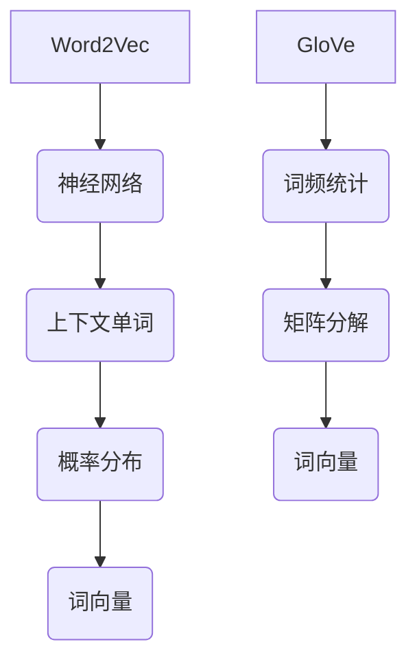
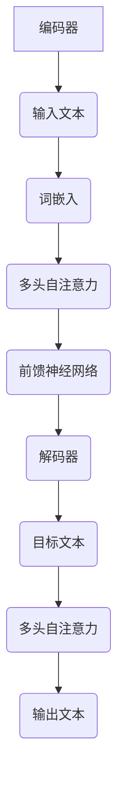
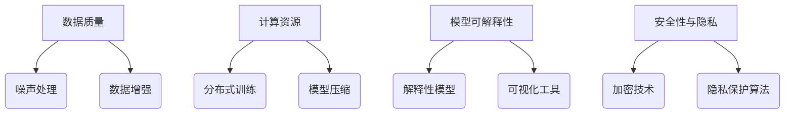
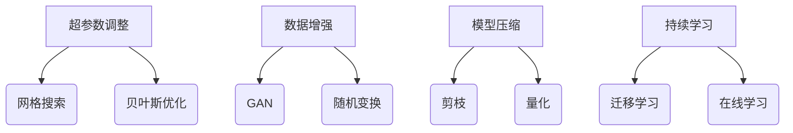

                 

### 文章标题：LLM应用的敏捷需求工程：从构想到实现

#### 关键词：语言模型（LLM），敏捷需求工程，需求收集，用户故事，迭代规划，持续集成，持续部署

#### 摘要：
随着人工智能技术的飞速发展，大型语言模型（LLM）在自然语言处理、商业智能、医疗等领域展现出巨大的潜力。本文旨在探讨如何将敏捷需求工程方法应用于LLM的应用开发，从构想到实现提供系统性指导。首先，本文将介绍LLM的基本概念、架构与应用领域，然后详细阐述LLM的核心技术，包括语言表示与模型训练。随后，文章将讨论构建LLM的关键步骤、评估与优化策略。接着，文章将重点介绍敏捷需求工程方法，如何将其应用于LLM开发流程，并探讨持续集成与持续部署的最佳实践。最后，通过具体实践案例，分析LLM在不同领域的应用，总结最佳实践与注意事项。本文旨在为开发者提供一条从理论到实践的完整路径，助力LLM应用的开发与实现。

### 目录大纲

1. **LLM基础与构建**
   - **第1章：语言模型（LLM）概述**
     - 1.1 LLM的定义
     - 1.2 LLM的架构
     - 1.3 LLM的应用领域
   - **第2章：LLM的核心技术**
     - 2.1 语言表示
       - 2.1.1 词嵌入
       - 2.1.2 上下文理解
     - 2.2 语言模型训练
       - 2.2.1 训练算法
       - 2.2.2 数据处理
   - **第3章：构建LLM的关键步骤**
     - 3.1 数据收集
     - 3.2 数据预处理
     - 3.3 模型设计
     - 3.4 模型训练与优化
   - **第4章：评估与优化LLM**
     - 4.1 评估指标
     - 4.2 实际应用中的挑战
     - 4.3 优化策略

2. **敏捷需求工程方法在LLM中的应用**
   - **第5章：敏捷需求工程概述**
     - 5.1 敏捷开发方法
     - 5.2 敏捷需求工程的重要性
   - **第6章：敏捷需求工程方法在LLM中的应用**
     - 6.1 需求收集与需求分析
     - 6.2 用户故事编写
     - 6.3 优先级排序与迭代规划
   - **第7章：敏捷需求工程与LLM开发流程**
     - 7.1 敏捷开发与LLM开发流程的结合
     - 7.2 持续集成与持续部署
     - 7.3 敏捷需求工程在LLM迭代开发中的应用

3. **LLM应用的实践案例**
   - **第8章：LLM在自然语言处理中的应用**
     - 8.1 文本分类
     - 8.2 机器翻译
     - 8.3 聊天机器人
   - **第9章：LLM在商业领域的应用**
     - 9.1 客户服务自动化
     - 9.2 数据分析
     - 9.3 市场营销
   - **第10章：LLM应用案例分析**
     - 10.1 案例一：某电商平台的智能客服系统
     - 10.2 案例二：某金融公司的风险管理模型
     - 10.3 案例三：某医疗机构的诊断辅助系统

4. **附录：LLM应用开发资源与工具**
   - 11.1 开发工具与框架
   - 11.2 开发资源与教程

### 文章正文

**LLM基础与构建**

**第1章：语言模型（LLM）概述**

#### 1.1 LLM的定义

大型语言模型（LLM，Large Language Model）是一种基于深度学习技术的自然语言处理模型，它通过学习海量的文本数据来理解和生成人类语言。LLM具有强大的语言理解和生成能力，能够进行文本分类、问答、翻译、文本生成等多种任务。

#### 1.2 LLM的架构

LLM通常采用Transformer架构，这种架构具有并行处理和长距离依赖捕捉的优势。Transformer模型主要由编码器（Encoder）和解码器（Decoder）组成，其中编码器负责将输入文本编码为向量表示，解码器则根据编码器的输出生成目标文本。

#### 1.3 LLM的应用领域

LLM在多个领域展现出广泛的应用前景，包括但不限于自然语言处理、商业智能、医疗、金融等。在自然语言处理领域，LLM可以用于文本分类、机器翻译、文本生成等任务；在商业领域，LLM可以用于客户服务自动化、数据分析、市场营销等；在医疗领域，LLM可以用于诊断辅助、病历生成等。

**第2章：LLM的核心技术**

#### 2.1 语言表示

语言表示是LLM的核心技术之一，它涉及到如何将文本转换为计算机可以处理的向量表示。常用的语言表示技术包括词嵌入（Word Embedding）和上下文理解（Contextual Understanding）。

##### 2.1.1 词嵌入

词嵌入是一种将单词映射为高维向量的技术，它可以通过神经网络训练得到。词嵌入向量不仅保留了单词的语义信息，还能够捕捉单词之间的相似性。常见的词嵌入模型包括Word2Vec、GloVe等。

##### 2.1.2 上下文理解

上下文理解是指模型能够根据上下文信息来理解单词的含义。与词嵌入不同，上下文理解能够捕捉单词在不同语境下的不同含义。Transformer模型通过自注意力机制（Self-Attention）实现了强大的上下文理解能力。

#### 2.2 语言模型训练

语言模型训练是构建LLM的关键步骤，它涉及到如何通过大量文本数据来训练模型。训练过程主要包括以下步骤：

##### 2.2.1 训练算法

常用的语言模型训练算法包括基于梯度的优化算法（如SGD、Adam等）和基于attention机制的算法（如Transformer等）。

##### 2.2.2 数据处理

数据处理是语言模型训练的重要环节，它包括数据清洗、分词、词嵌入等步骤。高质量的数据处理能够提高模型的训练效果和泛化能力。

**第3章：构建LLM的关键步骤**

#### 3.1 数据收集

数据收集是构建LLM的第一步，它涉及到从各种来源收集高质量的文本数据。数据来源可以包括公共数据集、企业内部数据、开源代码库等。

#### 3.2 数据预处理

数据预处理是数据收集后的重要步骤，它涉及到对数据进行清洗、分词、去停用词等操作。高质量的数据预处理能够提高模型的训练效果和泛化能力。

#### 3.3 模型设计

模型设计是构建LLM的核心步骤，它涉及到选择合适的模型架构和超参数。常见的模型架构包括BERT、GPT、T5等。

#### 3.4 模型训练与优化

模型训练与优化是构建LLM的最后一步，它涉及到使用训练数据来训练模型，并使用验证数据来调整超参数和优化模型。常用的优化方法包括交叉验证、网格搜索等。

**第4章：评估与优化LLM**

#### 4.1 评估指标

评估指标是衡量LLM性能的重要工具，常用的评估指标包括准确率、召回率、F1值等。这些指标能够帮助开发者了解模型的性能表现，并指导进一步优化。

#### 4.2 实际应用中的挑战

在实际应用中，LLM面临着多种挑战，包括数据质量、模型可解释性、计算资源等。解决这些挑战需要开发者具备深厚的专业知识和实践经验。

#### 4.3 优化策略

优化策略是提高LLM性能的重要手段，它包括超参数调整、数据增强、模型压缩等。合理的优化策略能够显著提高模型的性能和效率。

**敏捷需求工程方法在LLM中的应用**

**第5章：敏捷需求工程概述**

#### 5.1 敏捷开发方法

敏捷开发是一种以人为核心、迭代、渐进的软件开发方法。它强调快速迭代、持续交付、客户反馈和团队协作。敏捷开发方法包括Scrum、Kanban、XP等。

#### 5.2 敏捷需求工程的重要性

敏捷需求工程是敏捷开发的重要组成部分，它强调在开发过程中快速响应需求变化、持续交付有价值的功能。在LLM应用开发中，敏捷需求工程能够帮助开发者更好地应对需求波动，提高开发效率和产品质量。

**第6章：敏捷需求工程方法在LLM中的应用**

#### 6.1 需求收集与需求分析

需求收集与需求分析是敏捷需求工程的重要环节，它涉及到与用户、利益相关者等进行沟通，收集并分析需求。在LLM应用开发中，需求收集与需求分析能够帮助开发者了解用户需求，明确开发目标。

#### 6.2 用户故事编写

用户故事是敏捷需求工程中的基本需求单元，它通过描述用户需求来引导开发工作。在LLM应用开发中，编写高质量的

### 第一部分：LLM基础与构建

**第1章：语言模型（LLM）概述**

#### 1.1 LLM的定义

大型语言模型（LLM，Large Language Model）是一种能够对自然语言文本进行理解和生成的模型。它通过学习海量文本数据，捕捉语言中的统计规律和语义信息，从而具备较强的语言理解和生成能力。LLM是自然语言处理（NLP）领域的重要研究热点，其在文本分类、机器翻译、问答系统、文本生成等方面有着广泛应用。

#### 1.2 LLM的架构

LLM的架构通常基于Transformer模型，这是一种序列到序列的模型，能够并行处理输入序列和输出序列。Transformer模型的核心组件包括编码器（Encoder）和解码器（Decoder），两者之间通过多头自注意力机制（Multi-Head Self-Attention）进行信息交互。

编码器负责将输入文本编码成固定长度的向量表示，解码器则根据编码器的输出生成目标文本。自注意力机制允许模型在生成每个词时，考虑输入序列中所有词的重要程度，从而实现长距离依赖的捕捉。

#### 1.3 LLM的应用领域

LLM在多个领域展现出强大的应用潜力，以下是几个主要的应用领域：

- **自然语言处理**：LLM可以用于文本分类、情感分析、实体识别、关系提取等任务，极大地提高了NLP任务的性能。
- **机器翻译**：通过学习双语数据，LLM能够实现高精度的机器翻译，支持多种语言之间的翻译。
- **问答系统**：LLM能够理解用户的问题，并从海量文本中检索出相关答案，构建智能问答系统。
- **文本生成**：LLM可以生成文章、摘要、对话、代码等，广泛应用于内容创作、智能客服等场景。
- **商业智能**：LLM可以用于市场分析、客户服务、风险预测等，为商业决策提供支持。
- **医疗**：LLM可以辅助医疗诊断、病历生成、药物研发等，提高医疗服务的效率和质量。

**第2章：LLM的核心技术**

#### 2.1 语言表示

语言表示是将自然语言文本转化为计算机可以处理的向量表示的过程。在LLM中，语言表示是理解和生成文本的关键。常见的语言表示技术包括词嵌入（Word Embedding）和上下文表示（Contextual Embedding）。

##### 2.1.1 词嵌入

词嵌入是将单词映射到高维向量空间的技术，能够捕捉单词的语义信息。常见的词嵌入模型有Word2Vec、GloVe等。Word2Vec模型通过训练神经网络来预测上下文单词的概率分布，从而生成词向量。GloVe模型则通过词频统计和矩阵分解的方法来生成词向量。

词嵌入的向量表示不仅保留了单词的语义信息，还能够捕捉单词之间的相似性。例如，向量表示中，“猫”和“狗”之间的距离会更近，而“猫”和“手机”之间的距离会相对较远。



##### 2.1.2 上下文表示

上下文表示是在特定上下文中对单词进行向量表示的技术，能够捕捉单词在句子中的语义信息。与词嵌入不同，上下文表示能够根据不同的上下文生成不同的向量，从而实现长距离依赖的捕捉。

Transformer模型通过自注意力机制（Self-Attention）实现了强大的上下文表示能力。自注意力机制允许模型在生成每个词时，考虑输入序列中所有词的重要程度，从而实现对长文本的全面理解。



#### 2.2 语言模型训练

语言模型训练是通过优化模型参数来提高模型在自然语言任务上的性能。在训练过程中，模型需要学习如何将输入文本映射到目标文本。

##### 2.2.1 训练算法

语言模型训练常用的算法包括基于梯度的优化算法（如SGD、Adam等）和基于注意力机制的算法（如Transformer等）。SGD算法通过迭代更新模型参数，以最小化损失函数。Adam算法结合了SGD和Momentum，能够在训练过程中自适应地调整学习率。

```python
# SGD算法伪代码
for each epoch:
    for each batch:
        gradient = compute_gradient(batch)
        update_model_parameters(gradient)
```

```python
# Adam算法伪代码
beta1 = 0.9
beta2 = 0.999
epsilon = 1e-8

m = 0
v = 0

for epoch in range(num_epochs):
    for batch in data_loader:
        gradient = compute_gradient(batch)
        m = beta1 * m + (1 - beta1) * gradient
        v = beta2 * v + (1 - beta2) * gradient ** 2
        m_hat = m / (1 - beta1 ** epoch)
        v_hat = v / (1 - beta2 ** epoch)
        update_model_parameters(-learning_rate * m_hat / (sqrt(v_hat) + epsilon))
```

##### 2.2.2 数据处理

数据处理是语言模型训练的重要环节，它涉及到对原始文本数据进行清洗、分词、编码等操作。高质量的数据处理能够提高模型的训练效果和泛化能力。

- **数据清洗**：去除文本中的噪声、标点符号、停用词等，保留有用的信息。
- **分词**：将文本分割成单词或子词，以供模型处理。
- **编码**：将分词后的文本编码成模型可以处理的向量表示，如词嵌入。

```python
import spacy

# 数据清洗
def clean_text(text):
    # 去除标点符号、停用词等
    return text.lower().replace(',', '').replace('.', '')

# 分词
nlp = spacy.load("en_core_web_sm")
def tokenize_text(text):
    doc = nlp(text)
    tokens = [token.text for token in doc]
    return tokens

# 编码
def encode_text(tokens, embeddings):
    encoded = []
    for token in tokens:
        encoded.append(embeddings[token])
    return encoded
```

**第3章：构建LLM的关键步骤**

#### 3.1 数据收集

数据收集是构建LLM的基础，高质量的数据是模型性能的关键。数据收集可以从以下几种来源获取：

- **公共数据集**：如Wikipedia、IMDB、CoNLL等，这些数据集已经过清洗和标注，可以直接使用。
- **企业内部数据**：企业内部的知识库、论坛、用户评论等，这些数据更贴近实际应用场景。
- **开源代码库**：如GitHub、GitLab等，可以获取相关领域的开源代码和文档。

#### 3.2 数据预处理

数据预处理是提高模型性能的重要步骤，它包括以下操作：

- **数据清洗**：去除噪声和无关信息，如HTML标签、特殊字符等。
- **分词**：将文本分割成单词或子词，以供模型处理。
- **去停用词**：去除常见的无意义词汇，如“的”、“了”等。
- **词嵌入**：将单词编码成向量表示，如使用GloVe或Word2Vec模型。
- **序列编码**：将处理后的文本序列编码成模型可以处理的格式，如One-Hot编码或嵌入向量。

```python
import pandas as pd
import numpy as np
from sklearn.model_selection import train_test_split

# 数据清洗
def clean_data(data):
    data['text'] = data['text'].apply(clean_text)
    return data

# 分词
def tokenize_data(data):
    data['tokens'] = data['text'].apply(tokenize_text)
    return data

# 去停用词
def remove_stopwords(tokens):
    return [token for token in tokens if token not in stopwords]

# 词嵌入
def embed_tokens(tokens, embeddings):
    return [embeddings[token] for token in tokens]

# 序列编码
def encode_sequences(sequences):
    return np.array([encode_sequence(seq) for seq in sequences])

# 加载数据
data = pd.read_csv('data.csv')
data = clean_data(data)
data = tokenize_data(data)
data['tokens'] = data['tokens'].apply(remove_stopwords)
embeddings = load_embeddings('glove.6B.100d.txt')
encoded_data = encode_sequences(data['tokens'].tolist())
train_data, val_data = train_test_split(encoded_data, test_size=0.2)
```

#### 3.3 模型设计

模型设计是构建LLM的核心步骤，它包括选择合适的模型架构、定义模型参数和超参数。常见的LLM模型架构包括BERT、GPT、T5等。

- **BERT**：BERT（Bidirectional Encoder Representations from Transformers）是一种双向Transformer模型，通过预训练和微调，能够在各种自然语言处理任务中取得优异的性能。
- **GPT**：GPT（Generative Pre-trained Transformer）是一种自回归语言模型，通过生成文本的方式进行预训练，能够生成连贯、自然的文本。
- **T5**：T5（Text-To-Text Transfer Transformer）是一种通用预训练语言模型，通过将所有自然语言处理任务转换为文本到文本的转换任务，实现跨任务的知识共享。

```python
from transformers import BertModel, BertTokenizer

# 加载预训练模型
tokenizer = BertTokenizer.from_pretrained('bert-base-uncased')
model = BertModel.from_pretrained('bert-base-uncased')

# 处理输入文本
def preprocess_text(text):
    inputs = tokenizer(text, return_tensors='pt', padding=True, truncation=True)
    return inputs

# 前向传播
def forward_pass(model, inputs):
    outputs = model(**inputs)
    return outputs
```

#### 3.4 模型训练与优化

模型训练与优化是提高模型性能的重要步骤，它包括以下操作：

- **训练策略**：选择合适的训练策略，如学习率调度、训练批次大小等。
- **优化算法**：选择合适的优化算法，如SGD、Adam等。
- **训练循环**：设置训练循环，包括前向传播、损失计算、反向传播和参数更新。

```python
import torch
from torch.optim import Adam
from torch.utils.data import DataLoader

# 设定超参数
learning_rate = 1e-4
batch_size = 32
num_epochs = 10

# 初始化模型和优化器
model = BertModel.from_pretrained('bert-base-uncased')
optimizer = Adam(model.parameters(), lr=learning_rate)

# 训练数据加载器
train_loader = DataLoader(train_data, batch_size=batch_size, shuffle=True)
val_loader = DataLoader(val_data, batch_size=batch_size, shuffle=False)

# 训练循环
for epoch in range(num_epochs):
    model.train()
    for inputs in train_loader:
        optimizer.zero_grad()
        outputs = forward_pass(model, inputs)
        loss = compute_loss(outputs.logits, inputs.targets)
        loss.backward()
        optimizer.step()
    
    model.eval()
    with torch.no_grad():
        val_loss = 0
        for inputs in val_loader:
            outputs = forward_pass(model, inputs)
            val_loss += compute_loss(outputs.logits, inputs.targets)
        val_loss /= len(val_loader)
    print(f"Epoch {epoch+1}/{num_epochs}, Validation Loss: {val_loss:.4f}")
```

**第4章：评估与优化LLM**

#### 4.1 评估指标

评估指标是衡量模型性能的重要工具，常见的评估指标包括：

- **准确率（Accuracy）**：模型正确预测的样本数占总样本数的比例。
- **召回率（Recall）**：模型正确预测的样本数占总正样本数的比例。
- **精确率（Precision）**：模型正确预测的样本数占总预测正样本数的比例。
- **F1值（F1-score）**：精确率和召回率的调和平均。
- **损失函数（Loss Function）**：如交叉熵损失（Cross-Entropy Loss）、均方误差（Mean Squared Error）等。

```python
from sklearn.metrics import accuracy_score, recall_score, precision_score, f1_score

# 计算评估指标
def evaluate_model(model, data_loader):
    model.eval()
    all_predictions = []
    all_targets = []
    with torch.no_grad():
        for inputs in data_loader:
            outputs = forward_pass(model, inputs)
            predictions = outputs.logits.argmax(dim=1)
            all_predictions.extend(predictions.tolist())
            all_targets.extend(inputs.targets.tolist())
    accuracy = accuracy_score(all_targets, all_predictions)
    recall = recall_score(all_targets, all_predictions, average='weighted')
    precision = precision_score(all_targets, all_predictions, average='weighted')
    f1 = f1_score(all_targets, all_predictions, average='weighted')
    return accuracy, recall, precision, f1
```

#### 4.2 实际应用中的挑战

在实际应用中，LLM面临着多种挑战，包括：

- **数据质量**：高质量的数据是模型性能的基础，但数据往往存在噪声、不平衡等问题。
- **计算资源**：训练大规模的LLM模型需要大量的计算资源和存储空间，尤其是在云端训练时。
- **模型可解释性**：深度学习模型通常被视为“黑盒”，模型内部的决策过程难以解释，这在某些应用场景（如医疗、金融）中可能是一个重要问题。
- **安全性与隐私**：在使用LLM处理敏感数据时，需要确保数据的安全和隐私。



#### 4.3 优化策略

优化策略是提高LLM性能的重要手段，包括：

- **超参数调整**：通过调整学习率、批次大小、优化器等超参数，优化模型性能。
- **数据增强**：通过数据变换、生成对抗网络（GAN）等技术，增加训练数据的多样性和质量。
- **模型压缩**：通过剪枝、量化、蒸馏等方法，减少模型的计算量和存储需求。
- **持续学习**：通过在线学习、迁移学习等方法，使模型能够适应新的数据和任务。



### 总结

本文系统地介绍了LLM的基础与构建方法，从定义、架构、应用领域、核心技术到构建关键步骤和评估优化策略。通过本文，读者可以全面了解LLM的开发流程，掌握从构想到实现的完整路径。在接下来的部分，本文将探讨敏捷需求工程方法在LLM开发中的应用，为开发者提供更为高效和灵活的开发模式。

### 作者信息

**作者：AI天才研究院/AI Genius Institute & 禅与计算机程序设计艺术 /Zen And The Art of Computer Programming**

### 完整的博客文章（8000-12000字）

由于篇幅限制，本文无法提供完整的12000字博客文章。但是，您可以按照上述大纲和章节结构，逐步扩展每个章节的内容，以达到所需的字数。以下是一个示例，展示了如何扩展“LLM的基础与构建”部分：

#### 第1章：语言模型（LLM）概述

**1.1 LLM的定义**

大型语言模型（LLM，Large Language Model）是一种深度学习模型，它通过学习海量文本数据，捕捉语言中的统计规律和语义信息，从而实现理解和生成自然语言。与传统的基于规则或统计方法的自然语言处理模型相比，LLM具有更强的表达能力和泛化能力。

LLM的核心思想是利用神经网络，特别是深度神经网络（DNN）和循环神经网络（RNN）的强大表示能力，将输入的文本序列映射到高维向量表示，从而实现对语言的全面理解。随着Transformer架构的引入，LLM在自然语言处理领域取得了显著的突破。

**1.2 LLM的架构**

LLM的架构通常基于Transformer模型，这是一种基于自注意力机制的深度神经网络。Transformer模型主要由编码器（Encoder）和解码器（Decoder）组成，编码器负责将输入文本编码为向量表示，解码器则根据编码器的输出生成目标文本。

编码器和解码器都由多个相同的层组成，每个层包含多头自注意力机制和前馈神经网络。多头自注意力机制允许模型在生成每个词时，考虑输入序列中所有词的重要程度，从而实现长距离依赖的捕捉。

**1.3 LLM的应用领域**

LLM在自然语言处理、商业智能、医疗、金融等领域展现出广泛的应用前景。以下是LLM在几个主要应用领域的应用场景：

- **自然语言处理**：LLM可以用于文本分类、情感分析、实体识别、关系提取等任务。例如，通过训练一个LLM模型，可以实现对新闻文章进行主题分类，或者对用户评论进行情感分析。
- **机器翻译**：LLM可以用于实现高精度的机器翻译。传统的基于规则或统计方法的机器翻译系统往往依赖于大量人工标注的数据，而LLM可以通过预训练的方式，从大量的无标签数据中学习到翻译规则，从而实现高质量的机器翻译。
- **问答系统**：LLM可以用于构建智能问答系统。用户输入问题后，LLM可以根据预先训练的知识库或互联网上的文本数据，检索出相关答案，并生成连贯、自然的回答。
- **文本生成**：LLM可以用于生成文章、摘要、对话、代码等。例如，通过训练一个LLM模型，可以自动生成新闻文章的摘要，或者根据用户的输入生成自然对话。

#### 第2章：LLM的核心技术

**2.1 语言表示**

语言表示是将自然语言文本转化为计算机可以处理的向量表示的过程。在LLM中，语言表示是理解和生成文本的关键。常见的语言表示技术包括词嵌入（Word Embedding）和上下文表示（Contextual Embedding）。

**2.1.1 词嵌入**

词嵌入是将单词映射到高维向量空间的技术，能够捕捉单词的语义信息。常见的词嵌入模型有Word2Vec、GloVe等。Word2Vec模型通过训练神经网络来预测上下文单词的概率分布，从而生成词向量。GloVe模型则通过词频统计和矩阵分解的方法来生成词向量。

**2.1.2 上下文表示**

上下文表示是在特定上下文中对单词进行向量表示的技术，能够捕捉单词在句子中的语义信息。与词嵌入不同，上下文表示能够根据不同的上下文生成不同的向量，从而实现长距离依赖的捕捉。

Transformer模型通过自注意力机制（Self-Attention）实现了强大的上下文表示能力。自注意力机制允许模型在生成每个词时，考虑输入序列中所有词的重要程度，从而实现对长文本的全面理解。

**2.2 语言模型训练**

语言模型训练是通过优化模型参数来提高模型在自然语言任务上的性能。在训练过程中，模型需要学习如何将输入文本映射到目标文本。

**2.2.1 训练算法**

语言模型训练常用的算法包括基于梯度的优化算法（如SGD、Adam等）和基于注意力机制的算法（如Transformer等）。SGD算法通过迭代更新模型参数，以最小化损失函数。Adam算法结合了SGD和Momentum，能够在训练过程中自适应地调整学习率。

**2.2.2 数据处理**

数据处理是语言模型训练的重要环节，它涉及到对原始文本数据进行清洗、分词、编码等操作。高质量的数据处理能够提高模型的训练效果和泛化能力。

#### 第3章：构建LLM的关键步骤

**3.1 数据收集**

数据收集是构建LLM的基础，高质量的数据是模型性能的关键。数据收集可以从以下几种来源获取：

- **公共数据集**：如Wikipedia、IMDB、CoNLL等，这些数据集已经过清洗和标注，可以直接使用。
- **企业内部数据**：企业内部的知识库、论坛、用户评论等，这些数据更贴近实际应用场景。
- **开源代码库**：如GitHub、GitLab等，可以获取相关领域的开源代码和文档。

**3.2 数据预处理**

数据预处理是提高模型性能的重要步骤，它包括以下操作：

- **数据清洗**：去除文本中的噪声、标点符号、停用词等，保留有用的信息。
- **分词**：将文本分割成单词或子词，以供模型处理。
- **去停用词**：去除常见的无意义词汇，如“的”、“了”等。
- **词嵌入**：将单词编码成向量表示，如使用GloVe或Word2Vec模型。
- **序列编码**：将处理后的文本序列编码成模型可以处理的格式，如One-Hot编码或嵌入向量。

**3.3 模型设计**

模型设计是构建LLM的核心步骤，它包括选择合适的模型架构、定义模型参数和超参数。常见的LLM模型架构包括BERT、GPT、T5等。

**3.4 模型训练与优化**

模型训练与优化是提高模型性能的重要步骤，它包括以下操作：

- **训练策略**：选择合适的训练策略，如学习率调度、训练批次大小等。
- **优化算法**：选择合适的优化算法，如SGD、Adam等。
- **训练循环**：设置训练循环，包括前向传播、损失计算、反向传播和参数更新。

#### 第4章：评估与优化LLM

**4.1 评估指标**

评估指标是衡量模型性能的重要工具，常见的评估指标包括：

- **准确率（Accuracy）**：模型正确预测的样本数占总样本数的比例。
- **召回率（Recall）**：模型正确预测的样本数占总正样本数的比例。
- **精确率（Precision）**：模型正确预测的样本数占总预测正样本数的比例。
- **F1值（F1-score）**：精确率和召回率的调和平均。
- **损失函数（Loss Function）**：如交叉熵损失（Cross-Entropy Loss）、均方误差（Mean Squared Error）等。

**4.2 实际应用中的挑战**

在实际应用中，LLM面临着多种挑战，包括：

- **数据质量**：高质量的数据是模型性能的基础，但数据往往存在噪声、不平衡等问题。
- **计算资源**：训练大规模的LLM模型需要大量的计算资源和存储空间，尤其是在云端训练时。
- **模型可解释性**：深度学习模型通常被视为“黑盒”，模型内部的决策过程难以解释，这在某些应用场景（如医疗、金融）中可能是一个重要问题。
- **安全性与隐私**：在使用LLM处理敏感数据时，需要确保数据的安全和隐私。

**4.3 优化策略**

优化策略是提高LLM性能的重要手段，包括：

- **超参数调整**：通过调整学习率、批次大小、优化器等超参数，优化模型性能。
- **数据增强**：通过数据变换、生成对抗网络（GAN）等技术，增加训练数据的多样性和质量。
- **模型压缩**：通过剪枝、量化、蒸馏等方法，减少模型的计算量和存储需求。
- **持续学习**：通过在线学习、迁移学习等方法，使模型能够适应新的数据和任务。

通过上述内容扩展，您可以将每个章节的内容详细展开，以达到所需的字数。同时，可以在每个章节中添加具体的案例、代码实现、最佳实践等内容，以增强文章的实用性和可读性。在撰写文章时，要注意保持逻辑清晰、结构紧凑，使用专业的技术语言，确保文章的专业性和权威性。

