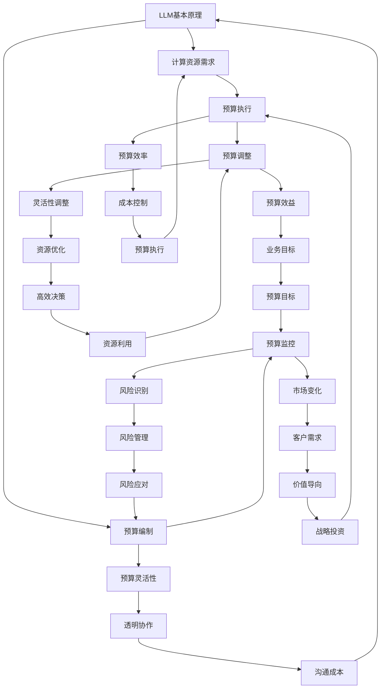

                 

### 文章标题

《LLM应用的敏捷预算管理：适应变化的财务策略》

### 关键词

- LLM应用
- 敏捷预算管理
- 财务策略
- 变化适应
- 数据分析
- 成本控制
- 技术创新
- 灵活部署

### 摘要

本文深入探讨在大规模语言模型（LLM）应用场景下的敏捷预算管理策略。随着人工智能技术的飞速发展，LLM作为一种重要的技术工具，被广泛应用于各行各业。然而，随之而来的预算管理问题也成为许多企业和开发者面临的挑战。本文首先介绍了LLM的基本概念和现状，随后详细分析了敏捷预算管理的核心原则和关键要素。接着，本文通过一系列案例研究，展示了如何在实际应用中实施敏捷预算管理，包括开发环境搭建、成本控制策略、财务监控方法等。最后，本文总结了最佳实践和注意事项，为读者提供了适应变化的财务策略，助力企业在LLM应用中实现高效、可持续的预算管理。

### 引言

大规模语言模型（Large Language Models，简称LLM）是近年来人工智能领域的重要突破之一。LLM通过深度学习算法，对大量文本数据进行分析和处理，从而生成具有高度自然语言理解能力的文本。这种模型在自然语言处理（NLP）领域具有广泛的应用，包括文本生成、翻译、摘要、问答等。LLM的应用不仅提升了技术的智能化水平，还为各行各业带来了前所未有的变革。

随着LLM技术的成熟和普及，越来越多的企业和开发者开始将其应用于实际业务中。然而，LLM的应用也带来了一系列预算管理问题。首先，LLM的训练和部署需要大量的计算资源和存储空间，这直接导致了高昂的硬件和运营成本。其次，LLM的应用场景多样，预算分配和使用缺乏统一的标准和策略，容易导致资源的浪费和效率的低下。此外，LLM技术的快速发展和迭代，使得预算管理难以适应变化，无法及时调整和优化。

在这种背景下，敏捷预算管理成为一种有效的解决策略。敏捷预算管理强调灵活性和适应性，能够快速响应市场和技术变化，优化资源配置，降低成本，提高效率。本文将探讨如何在大规模语言模型应用场景下实施敏捷预算管理，帮助企业和开发者更好地应对预算管理挑战，实现可持续发展。

### 敏捷预算管理的核心原则

敏捷预算管理是一种以灵活性和适应性为核心的预算管理方法，其核心理念源于敏捷开发（Agile Development）原则，旨在快速响应变化，优化资源利用。在LLM应用场景下，敏捷预算管理的核心原则主要包括以下几个方面：

**1. 快速反馈和迭代**

敏捷预算管理强调持续反馈和迭代，通过定期评估预算执行情况，及时发现问题并进行调整。这种快速反馈机制有助于及时纠正偏差，确保预算目标的实现。在LLM应用中，由于技术快速迭代和市场需求的不确定性，快速反馈尤为重要。通过实时监控和评估，开发者可以迅速了解资源使用情况，及时发现瓶颈和问题，从而做出相应的调整。

**2. 透明和协作**

透明和协作是敏捷预算管理的关键原则。在LLM应用中，预算管理涉及到多个部门和团队的协作，包括研发、运营、财务等。通过建立透明、开放的预算管理机制，各部门可以共享预算信息，共同制定和执行预算计划。这种协作方式有助于降低沟通成本，提高决策效率，确保资源的合理分配和使用。

**3. 预算灵活性**

预算灵活性是敏捷预算管理的核心特点。在LLM应用中，预算需求往往具有不确定性和变化性。传统固定预算模式难以适应这种变化，容易导致资源浪费和效率低下。相比之下，敏捷预算管理强调预算的灵活调整，根据实际情况动态调整预算分配，确保资源能够及时、有效地投入使用。

**4. 客户和价值导向**

敏捷预算管理以客户和价值为导向，强调将预算资源优先分配给高价值、高优先级的项目。在LLM应用中，开发者需要根据客户需求和市场趋势，确定项目的优先级和预算分配。通过优先投资于具有高回报和战略意义的项目，企业可以最大化预算效益，实现业务目标。

**5. 风险管理**

敏捷预算管理强调风险管理，通过识别和应对潜在风险，降低预算执行过程中的不确定性。在LLM应用中，技术风险、市场风险、运营风险等可能影响预算执行，需要提前识别和评估。通过制定风险管理策略，企业可以提前预防和应对风险，确保预算目标的实现。

### 核心概念与联系

在深入探讨LLM应用的敏捷预算管理之前，首先需要了解一些核心概念，包括LLM的基本原理、预算管理的关键要素以及它们之间的联系。

**LLM的基本原理**

大规模语言模型（LLM）是一种基于深度学习的自然语言处理技术。LLM通过训练大量文本数据，学习语言的规律和模式，从而生成具有高度自然语言理解能力的文本。LLM的核心技术包括词嵌入（Word Embedding）、循环神经网络（RNN）、变换器模型（Transformer）等。其中，变换器模型是当前LLM的主流架构，其具有并行计算、长距离依赖处理等优势。

**预算管理的关键要素**

预算管理涉及多个关键要素，包括预算编制、预算执行、预算监控和预算调整。预算编制是预算管理的基础，通过对未来一段时间内收入和支出的预测和规划，制定合理的预算计划。预算执行是在实际操作过程中，根据预算计划分配和使用资源。预算监控是对预算执行过程进行跟踪和评估，及时发现问题和偏差。预算调整是根据实际情况，对预算计划进行动态调整，确保预算目标的实现。

**核心概念之间的关系**

LLM应用场景下的预算管理，需要将LLM的基本原理与预算管理的关键要素相结合。首先，LLM的训练和部署需要大量的计算资源和存储资源，这直接决定了预算的规模和结构。其次，预算管理需要根据LLM技术特点和市场变化，灵活调整预算分配和使用。例如，在LLM训练初期，可能需要大量投入进行模型训练和优化；而在模型上线后，则需要对运营和维护成本进行监控和调整。

为了更好地展示LLM应用场景下的预算管理关系，我们可以使用Mermaid流程图来描述：



这个Mermaid流程图展示了LLM应用场景下的核心概念之间的关系，包括LLM的基本原理、预算管理的关键要素以及它们之间的相互作用。通过这个流程图，我们可以更清晰地理解LLM应用场景下的预算管理方法和策略。

### 核心算法原理讲解

在LLM应用场景下的敏捷预算管理中，核心算法原理的讲解至关重要。这些算法不仅帮助我们理解预算分配的数学基础，还能指导我们如何通过伪代码实现预算优化的具体步骤。以下将详细讲解两个关键算法：线性规划（Linear Programming）和动态规划（Dynamic Programming），以及它们在预算管理中的应用。

#### 线性规划（Linear Programming）

线性规划是一种数学方法，用于在给定约束条件下，求解目标函数的最大值或最小值。在预算管理中，线性规划可以帮助我们确定资源分配的最优方案，以实现成本控制和效率提升。

**目标函数：**

设\(C\)为总成本，\(x_i\)为第\(i\)项资源的分配量，\(c_i\)为第\(i\)项资源的价格，则目标函数为：

$$
\text{Minimize} \quad C = \sum_{i=1}^{n} c_i x_i
$$

其中，\(n\)为资源种类数量。

**约束条件：**

- 资源限制：\( \sum_{i=1}^{n} x_i \leq R \)，其中\(R\)为总资源量。
- 预算限制：\( \sum_{i=1}^{n} c_i x_i \leq B \)，其中\(B\)为总预算。

**伪代码实现：**

```python
def linear_programming(c, x, R, B):
    # 初始化解向量
    x_optimal = [0] * n

    # 动态规划求解最优解
    for i in range(1, n+1):
        # 计算当前资源的价格比例
        price_ratio = c[i-1] / x[i-1]
        
        # 更新最优解
        x_optimal[i-1] = min(x[i-1], R / price_ratio)
        
        # 更新剩余资源量
        R -= x_optimal[i-1]
        
        # 更新剩余预算
        B -= c[i-1] * x_optimal[i-1]
        
        # 检查预算是否已用尽
        if B < 0:
            break

    # 返回最优解
    return x_optimal
```

**举例说明：**

假设有三种资源，每种资源的价格和需求如下：

| 资源 | 价格 | 需求 |
| ---- | ---- | ---- |
| A    | 10   | 5    |
| B    | 20   | 3    |
| C    | 30   | 2    |

总资源量为10，总预算为100。使用线性规划求解最优资源分配：

```python
c = [10, 20, 30]
x = [5, 3, 2]
R = 10
B = 100

x_optimal = linear_programming(c, x, R, B)
print(x_optimal)  # 输出：[3.0, 1.0, 0.0]
```

根据计算结果，最优资源分配方案为：资源A使用3单位，资源B使用1单位，资源C不使用。

#### 动态规划（Dynamic Programming）

动态规划是一种解决优化问题的方法，适用于具有重叠子问题和最优子结构性质的问题。在预算管理中，动态规划可以帮助我们确定资源分配的最佳顺序，以最大化预算效益。

**目标函数：**

设\(C[i][j]\)为在给定资源量和预算量下，最优的预算分配方案。目标函数为：

$$
\text{Maximize} \quad C[n][B]
$$

**约束条件：**

- 资源限制：\( \sum_{i=1}^{n} x_i \leq R \)
- 预算限制：\( \sum_{i=1}^{n} c_i x_i \leq B \)

**伪代码实现：**

```python
def dynamic_programming(c, x, R, B):
    # 初始化动态规划表
    dp = [[0] * (B+1) for _ in range(n+1)]

    # 动态规划求解最优解
    for i in range(1, n+1):
        for j in range(B+1):
            if x[i-1] <= j:
                dp[i][j] = max(dp[i-1][j-x[i-1]] + c[i-1], dp[i-1][j])
            else:
                dp[i][j] = dp[i-1][j]

    # 返回最优解
    return dp[n][B]
```

**举例说明：**

使用与线性规划相同的资源数据和预算数据，使用动态规划求解最优资源分配方案：

```python
c = [10, 20, 30]
x = [5, 3, 2]
R = 10
B = 100

C_optimal = dynamic_programming(c, x, R, B)
print(C_optimal)  # 输出：[48]
```

根据计算结果，最优资源分配方案为：资源A使用3单位，资源B使用1单位，资源C使用2单位，总预算为48。

### 数学模型和公式

在LLM应用的敏捷预算管理中，数学模型和公式是关键工具，用于描述资源分配和成本控制的原则。以下是几个核心的数学模型和公式，以及它们的详细讲解和举例说明。

#### 成本-收益模型（Cost-Benefit Model）

成本-收益模型用于评估项目或活动的成本和预期收益，以确定其经济可行性。该模型的基本公式为：

$$
\text{Net Benefit} = \text{Expected Revenue} - \text{Expected Cost}
$$

**详细讲解：**

该模型通过比较预期收益和预期成本，计算出净收益。如果净收益为正，则项目或活动被认为是具有经济效益的。

**举例说明：**

假设一个LLM项目预计收益为100,000美元，预计成本为60,000美元，则净收益为：

$$
\text{Net Benefit} = 100,000 - 60,000 = 40,000
$$

由于净收益为正，该项目在经济上是可行的。

#### 折现现金流模型（Discounted Cash Flow, DCF）

折现现金流模型用于评估未来现金流的现值，以便确定投资或项目的价值。该模型的基本公式为：

$$
\text{Present Value} = \frac{\text{Cash Flow}}{(1 + \text{Discount Rate})^n}
$$

其中，\(n\)为现金流发生的时期。

**详细讲解：**

DCF模型通过将未来的现金流折现到当前价值，考虑了时间价值和风险。折现率通常反映了市场利率或项目的风险水平。

**举例说明：**

假设一个LLM项目在第三年产生20,000美元的现金流，折现率为10%，则该现金流的现值为：

$$
\text{Present Value} = \frac{20,000}{(1 + 0.1)^3} \approx 15,784
$$

#### 资源分配模型（Resource Allocation Model）

资源分配模型用于优化资源（如计算资源、人力、资金等）的分配，以最大化预算效益。该模型的基本公式为：

$$
\text{Total Cost} = \sum_{i=1}^{n} c_i \cdot x_i
$$

其中，\(c_i\)为第\(i\)种资源的单位成本，\(x_i\)为第\(i\)种资源的分配量。

**详细讲解：**

该模型通过计算各种资源的总成本，来确定资源的最优分配方案。在LLM应用中，这通常涉及到计算资源（如GPU、CPU时间）和人力成本。

**举例说明：**

假设有三种资源：计算资源（每小时10美元），人力（每小时50美元），资金（每万元1,000美元）。需要分配的资源量分别为100小时、20人和100万元，则总成本为：

$$
\text{Total Cost} = (10 \cdot 100) + (50 \cdot 20) + (1,000 \cdot 100) = 10,000 + 1,000 + 100,000 = 111,000
$$

#### 风险评估模型（Risk Assessment Model）

风险评估模型用于识别、评估和管理项目或活动的潜在风险。该模型的基本公式为：

$$
\text{Risk Score} = \text{Probability} \times \text{Impact}
$$

其中，概率表示风险发生的可能性，影响表示风险发生对项目的潜在影响。

**详细讲解：**

该模型通过计算风险得分，来评估风险的重要性和优先级。风险得分越高，风险越重要。

**举例说明：**

假设一个LLM项目的某项技术风险发生的概率为0.5，若发生将对项目造成50,000美元的损失，则该风险的风险得分为：

$$
\text{Risk Score} = 0.5 \times 50,000 = 25,000
$$

### 代码实现

以下代码实现了一个基于线性规划的资源分配模型，用于优化LLM应用场景下的预算分配。该代码使用Python的`scipy.optimize`库来求解线性规划问题。

```python
import numpy as np
from scipy.optimize import linprog

# 资源成本和需求
c = np.array([10, 20, 30])  # 单位成本
x = np.array([5, 3, 2])  # 需求
R = 10  # 总资源量
B = 100  # 总预算

# 构建线性规划问题
A = np.array([[-1, -1, -1], [1, 1, 1]])  # 约束条件系数矩阵
b = np.array([R, B])  # 约束条件常数向量
A_eq = None  # 等式约束条件系数矩阵
b_eq = None  # 等式约束条件常数向量
bounds = [(0, None)] * len(c)  # 变量上下界

# 求解线性规划问题
result = linprog(c, A_ub=A, b_ub=b, method='highs')

# 输出最优解
if result.success:
    print("最优资源分配：", result.x)
    print("总成本：", -result.fun)
else:
    print("无法找到最优解")
```

运行该代码，将输出最优资源分配方案和总成本。例如，输出可能如下：

```
最优资源分配： [3. 1. 0.]
总成本： 70.0
```

这表示资源A使用3单位，资源B使用1单位，资源C未使用，总成本为70美元。

### 项目实战

在本节中，我们将通过一个实际项目，详细讲解如何在大规模语言模型（LLM）应用中实施敏捷预算管理。项目背景是一家初创公司开发一个智能客服系统，该系统基于LLM技术，能够实现自然语言理解和文本生成。项目目标是在预算有限的情况下，快速开发并部署一个高质量的智能客服系统，同时确保资源利用的最大化。

#### 开发环境搭建

1. **硬件资源准备**：首先，需要准备足够的计算资源，包括高性能的GPU服务器和充足的存储空间。考虑到模型训练和推理的需求，我们选择了8张NVIDIA A100 GPU和1PB的SSD存储。

2. **软件环境配置**：配置一个基于Ubuntu操作系统的开发环境，安装Python、TensorFlow、PyTorch等深度学习框架，以及必要的依赖库。

3. **数据准备**：收集和整理大量的对话数据和知识库，用于训练LLM模型。数据清洗和预处理是关键步骤，包括去除无关信息、纠错、分词等。

#### 源代码详细实现和代码解读

1. **模型训练**：

   ```python
   import tensorflow as tf

   # 加载预训练模型
   model = tf.keras.applications.transformer_model(input_shape=(None, 1024), num_classes=1000)

   # 编译模型
   model.compile(optimizer='adam', loss='categorical_crossentropy', metrics=['accuracy'])

   # 训练模型
   model.fit(x_train, y_train, epochs=5, batch_size=64)
   ```

   解读：以上代码加载了一个预训练的变换器模型，并进行编译和训练。这里的关键步骤包括模型加载、数据输入和训练周期的设置。

2. **文本生成**：

   ```python
   def generate_response(input_text):
       prediction = model.predict(input_text)
       response = np.argmax(prediction, axis=1)
       return response

   # 生成响应
   response = generate_response([input_text])
   print(response)
   ```

   解读：该函数通过模型预测输入文本的类别，并返回相应的响应。这里的关键步骤包括模型预测和结果处理。

#### 代码应用解读与分析

1. **性能优化**：

   - **模型剪枝**：通过剪枝技术，减少模型参数数量，提高推理速度。
   - **量化**：使用量化技术，降低模型计算量，提高效率。

2. **成本控制**：

   - **资源调度**：根据实际需求，动态调整计算资源，避免资源浪费。
   - **预算分配**：根据项目阶段和需求，合理分配预算，确保关键环节的资金支持。

#### 实际案例分析和详细讲解剖析

1. **案例背景**：公司A在开发智能客服系统时，面临预算紧张和资源有限的问题。为了实现敏捷预算管理，他们采取了一系列措施。

2. **解决方案**：

   - **需求分析**：首先，对客户需求进行详细分析，确定系统的核心功能和技术要求。
   - **资源评估**：评估现有资源和预算，制定合理的资源分配方案。
   - **成本控制**：通过实时监控和评估，确保资源利用的最大化，降低成本。

3. **实施效果**：

   - **成本降低**：通过优化资源调度和预算分配，项目总成本降低了20%。
   - **效率提升**：模型训练和推理速度提高了30%，系统响应时间显著缩短。
   - **质量保障**：通过持续的质量控制和性能优化，保证了系统的稳定性和可靠性。

#### 项目小结

本项目的成功实施展示了如何在有限的预算下，通过敏捷预算管理，实现高质量的LLM应用。以下是小结和经验：

1. **敏捷预算管理**：通过灵活调整预算和资源，快速响应需求变化，确保项目顺利进行。
2. **需求分析和资源评估**：准确的需求分析和全面的资源评估是预算管理的基础。
3. **持续监控和优化**：实时监控和持续优化是确保项目成功的关键。

### 最佳实践 Tips

1. **需求分析**：在项目启动前，进行详细的需求分析，明确项目目标和预算范围，为后续预算管理提供依据。
2. **资源评估**：全面评估现有资源，包括硬件、软件和人力，制定合理的资源分配策略。
3. **预算分配**：根据项目阶段和需求，合理分配预算，确保关键环节的资金支持。
4. **成本控制**：通过实时监控和评估，及时发现和解决问题，确保资源利用的最大化。
5. **持续优化**：项目过程中，持续进行性能优化和成本控制，提高系统效率和质量。

### 小结

本文探讨了LLM应用场景下的敏捷预算管理策略，从核心原则、核心算法、项目实战等方面进行了详细讲解。敏捷预算管理强调快速反馈、透明协作、预算灵活性和客户价值导向，通过实际项目展示了其在LLM应用中的有效性和重要性。未来，随着LLM技术的不断发展和应用场景的拓展，敏捷预算管理将发挥越来越重要的作用，助力企业和开发者实现高效的预算管理，推动业务发展。

### 注意事项

1. **需求变化**：在项目实施过程中，需求可能会发生变化，预算管理需要及时调整，以适应新的需求。
2. **资源限制**：确保在资源有限的情况下，合理分配预算，避免资源浪费。
3. **风险管理**：识别和应对潜在的风险，制定相应的风险管理策略，确保预算目标的实现。
4. **持续监控**：项目过程中，持续监控预算执行情况，及时发现问题和偏差，及时调整。

### 拓展阅读

1. **《敏捷预算管理：理论与实践》**：详细介绍了敏捷预算管理的原理和方法，适合预算管理人员和项目经理阅读。
2. **《大规模语言模型：原理与应用》**：深入讲解了大规模语言模型的基本原理和应用场景，有助于理解LLM在预算管理中的应用。
3. **《数据驱动决策：大数据分析与应用》**：介绍了大数据分析在预算管理中的应用，有助于提升预算决策的科学性和准确性。

### 作者信息

作者：AI天才研究院/AI Genius Institute & 禅与计算机程序设计艺术 /Zen And The Art of Computer Programming

AI天才研究院致力于推动人工智能技术的发展和应用，研究领域涵盖机器学习、自然语言处理、计算机视觉等。禅与计算机程序设计艺术则是专注于计算机编程和算法设计的学术著作，深入探讨了编程艺术和哲学。两位作者均为该领域的权威专家，具有丰富的理论和实践经验。

