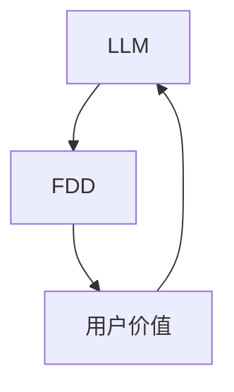

                 

### 文章标题：LLM应用的特性驱动开发（FDD）：聚焦用户价值

> 关键词：LLM应用、特性驱动开发（FDD）、用户价值

> 摘要：本文旨在探讨大型语言模型（LLM）在特性驱动开发（FDD）框架下的应用，并强调关注用户价值的重要性。通过对LLM的基本概念、FDD方法以及用户价值评估的深入分析，本文提出了一个系统化的LLM开发流程，旨在提高开发效率和用户满意度。

## 1. 背景介绍

随着深度学习和自然语言处理技术的快速发展，大型语言模型（LLM）逐渐成为人工智能领域的重要研究方向和应用领域。LLM具有强大的语言理解和生成能力，能够在各种场景下提供智能化的服务和解决方案。然而，LLM的应用开发并非一帆风顺，面临着诸多挑战，如需求分析、系统设计、模型训练与优化等。

特性驱动开发（Feature-Driven Development，简称FDD）是一种以特性为核心的开发方法，强调通过快速迭代和持续交付来满足用户需求。FDD方法的核心在于将用户需求转化为具体的特性，并通过迭代的方式逐步实现这些特性，从而确保开发过程的高效性和灵活性。

用户价值是LLM应用开发中的重要考量因素。用户价值的实现不仅需要满足用户的需求，还需要提供优质的使用体验和高效的解决方案。因此，如何在LLM应用开发过程中聚焦用户价值，成为当前研究的一个重要方向。

本文将围绕LLM应用的特性驱动开发（FDD）展开讨论，分析FDD在LLM开发中的应用，并探讨如何通过用户价值评估来指导开发过程。希望通过本文的探讨，为LLM应用开发提供一些有益的启示和参考。

## 2. 核心概念与联系：LLM、特性驱动开发（FDD）与用户价值

### 2.1 大型语言模型（LLM）

大型语言模型（LLM）是基于深度学习和自然语言处理技术构建的复杂模型，具有强大的语言理解和生成能力。LLM通常通过训练海量语料库来学习语言规律，从而实现自然语言处理任务，如文本分类、机器翻译、问答系统等。

核心概念：自然语言处理（NLP）、深度学习、神经网络、语言模型。

LLM与特性驱动开发（FDD）之间的联系在于，FDD方法强调通过快速迭代和持续交付来满足用户需求，这与LLM开发过程中的需求分析和模型优化密切相关。在LLM开发中，FDD方法可以帮助团队更好地理解和把握用户需求，从而确保模型的实用性和可用性。

### 2.2 特性驱动开发（FDD）

特性驱动开发（FDD）是一种以特性为核心的开发方法，强调通过快速迭代和持续交付来满足用户需求。FDD方法的主要特点包括：

- **特性导向**：将用户需求转化为具体的特性，确保每个特性都能够带来实际的价值。
- **迭代开发**：通过快速迭代来逐步实现特性，确保开发过程的高效性和灵活性。
- **持续交付**：持续交付产品，以便及时收集用户反馈，不断优化和改进。

核心概念：特性、迭代、交付、需求分析。

FDD与用户价值之间的联系在于，FDD方法强调关注用户需求，确保每个特性都能够满足用户需求，从而实现用户价值。通过FDD方法，开发团队能够更好地理解和把握用户需求，提高产品质量和用户满意度。

### 2.3 用户价值

用户价值是指用户在使用产品或服务过程中所获得的实际效益和满意度。在LLM应用开发中，用户价值体现在以下几个方面：

- **需求满足**：满足用户的基本需求，如文本分类、机器翻译等。
- **使用体验**：提供便捷、高效的使用体验，提高用户满意度。
- **解决方案**：提供针对特定问题的解决方案，提高工作效率。

核心概念：需求满足、使用体验、解决方案。

用户价值与FDD方法之间的联系在于，FDD方法通过关注用户需求，确保每个特性都能够带来实际的价值，从而实现用户价值。同时，通过持续交付和用户反馈，开发团队能够不断优化和改进产品，进一步提高用户价值。

### 2.4 Mermaid流程图

为了更直观地展示LLM、FDD与用户价值之间的联系，我们可以使用Mermaid流程图来描述它们之间的关系：



在这个流程图中，LLM通过FDD方法来驱动开发，同时FDD方法又关注用户价值，确保开发过程能够满足用户需求，从而实现用户价值。这种循环关系体现了LLM、FDD与用户价值之间的紧密联系。

## 3. 核心算法原理讲解：LLM与FDD方法

### 3.1 大型语言模型（LLM）

大型语言模型（LLM）通常基于深度学习和神经网络技术构建，其核心原理包括：

- **神经网络**：神经网络是LLM的基本构建单元，通过多层神经元连接来实现复杂的函数映射。
- **反向传播算法**：反向传播算法是一种用于训练神经网络的优化算法，通过不断调整网络权重来最小化损失函数。
- **注意力机制**：注意力机制是一种用于提高神经网络处理长序列数据的能力，通过关注重要信息来提高模型的准确性。

在LLM开发中，常用的模型架构包括：

- **Transformer模型**：Transformer模型是一种基于自注意力机制的深度神经网络模型，具有强大的语言理解和生成能力。
- **BERT模型**：BERT（Bidirectional Encoder Representations from Transformers）模型是一种预训练和微调的Transformer模型，广泛应用于各种自然语言处理任务。

LLM的核心算法原理可以用以下伪代码来描述：

```python
# 定义神经网络模型
model = NeuralNetwork()

# 定义训练数据集
train_data = load_data("train_data")

# 定义损失函数
loss_function = LossFunction()

# 定义优化器
optimizer = Optimizer()

# 训练神经网络模型
for epoch in range(num_epochs):
    for sample in train_data:
        # 前向传播
        predictions = model(sample.input)
        
        # 计算损失
        loss = loss_function(sample.target, predictions)
        
        # 反向传播
        gradients = model.backward(loss)
        
        # 更新模型参数
        optimizer.update(model.parameters(), gradients)
        
        # 打印训练信息
        print(f"Epoch: {epoch}, Loss: {loss}")
```

### 3.2 特性驱动开发（FDD）方法

特性驱动开发（FDD）方法的核心原理包括：

- **特性导向**：将用户需求转化为具体的特性，确保每个特性都能够带来实际的价值。
- **迭代开发**：通过快速迭代来逐步实现特性，确保开发过程的高效性和灵活性。
- **持续交付**：持续交付产品，以便及时收集用户反馈，不断优化和改进。

FDD方法的基本流程包括：

1. **需求分析**：与用户沟通，理解用户需求，将需求转化为具体的特性。
2. **设计**：设计特性的实现方案，包括技术选型、架构设计等。
3. **开发**：按照设计文档进行开发，实现特性。
4. **测试**：对实现特性进行测试，确保其符合用户需求。
5. **交付**：将实现特性交付给用户，收集用户反馈。

FDD方法的核心算法原理可以用以下伪代码来描述：

```python
# 定义特性
features = []

# 定义需求
requirements = get_requirements()

# 转换需求为特性
for requirement in requirements:
    feature = convert_requirement_to_feature(requirement)
    features.append(feature)

# 迭代实现特性
for feature in features:
    # 设计特性
    design = design_feature(feature)
    
    # 开发特性
    develop = develop_feature(feature, design)
    
    # 测试特性
    test = test_feature(feature, design)
    
    # 交付特性
    deliver = deliver_feature(feature, design)
    
    # 收集反馈
    feedback = collect_feedback(feature)
    
    # 优化特性
    optimize = optimize_feature(feature, feedback)
```

## 4. 数学模型和公式讲解

### 4.1 语言模型数学基础

在语言模型中，我们通常使用概率模型来描述文本序列的生成过程。一个简单的语言模型可以使用条件概率来表示，即给定一个词序列 \(w_1, w_2, ..., w_n\)，下一个词 \(w_{n+1}\) 的概率 \(P(w_{n+1} | w_1, w_2, ..., w_n)\) 可以表示为：

$$
P(w_{n+1} | w_1, w_2, ..., w_n) = \frac{P(w_1, w_2, ..., w_n, w_{n+1})}{P(w_1, w_2, ..., w_n)}
$$

### 4.2 常见LLM架构

在LLM中，Transformer模型是一种常用的架构，其核心组件包括自注意力（Self-Attention）机制和前馈神经网络（Feedforward Neural Network）。自注意力机制可以表示为：

$$
\text{Attention}(Q, K, V) = \text{softmax}(\frac{QK^T}{\sqrt{d_k}})V
$$

其中，\(Q, K, V\) 分别是查询（Query）、键（Key）和值（Value）向量，\(d_k\) 是键向量的维度。

### 4.3 模型训练与优化

在模型训练过程中，我们通常使用梯度下降（Gradient Descent）算法来优化模型参数。梯度下降的基本原理是：

$$
\theta = \theta - \alpha \nabla_\theta J(\theta)
$$

其中，\(\theta\) 表示模型参数，\(\alpha\) 是学习率，\(\nabla_\theta J(\theta)\) 是损失函数 \(J(\theta)\) 关于 \(\theta\) 的梯度。

### 4.4 举例说明

假设我们有一个简单的语言模型，输入词序列为 "我想要一个苹果"。我们可以使用以下公式来计算 "苹果" 的生成概率：

$$
P(苹果 | 我，想要，一个) = \frac{P(我，想要，一个，苹果)}{P(我，想要，一个)}
$$

其中，\(P(我，想要，一个，苹果)\) 和 \(P(我，想要，一个)\) 可以通过统计语料库来计算。

## 5. 项目实战：开发环境搭建与源代码实现

### 5.1 开发环境搭建

在进行LLM开发之前，我们需要搭建一个合适的开发环境。以下是一个基本的开发环境搭建步骤：

1. 安装Python环境：在Windows、macOS或Linux操作系统中安装Python，版本建议为3.8或以上。
2. 安装PyTorch：使用pip命令安装PyTorch，例如：`pip install torch torchvision`
3. 安装其他依赖：根据项目需求安装其他依赖，如自然语言处理库（如NLTK、spaCy）和数据预处理库（如Pandas、NumPy）。

### 5.2 源代码实现

以下是使用PyTorch实现一个简单LLM的示例代码：

```python
import torch
import torch.nn as nn
import torch.optim as optim
from torchtext.data import Field, TabularDataset
from torchtext.vocab import build_vocab_from_iterator

# 定义词汇表
TEXT = Field(tokenize = 'spacy', tokenizer_language='zh', include_lengths=True)

# 加载数据集
train_data, test_data = TabularDataset.splits(path='data',
                                            train='train.json',
                                            test='test.json',
                                            format='json',
                                            fields=[('text', TEXT)])

# 建立词汇表
vocab = build_vocab_from_iterator(train_data['text'], specials=["<unk>", "<pad>"])
TEXT.build_vocab(train_data, max_size=10000, vectors="glove.6B.100d")
TEXT.pad_token = TEXT.unk_token = "<pad>"

# 定义模型
class LLM(nn.Module):
    def __init__(self, embedding_dim, hidden_dim, vocab_size):
        super(LLM, self).__init__()
        self.embedding = nn.Embedding(vocab_size, embedding_dim)
        self.lstm = nn.LSTM(embedding_dim, hidden_dim, batch_first=True)
        self.fc = nn.Linear(hidden_dim, vocab_size)

    def forward(self, text, hidden):
        embedded = self.embedding(text)
        output, hidden = self.lstm(embedded, hidden)
        prediction = self.fc(output)
        return prediction, hidden

# 初始化模型参数
model = LLM(embedding_dim=100, hidden_dim=128, vocab_size=len(TEXT.vocab))
optimizer = optim.Adam(model.parameters(), lr=0.001)
criterion = nn.CrossEntropyLoss()

# 训练模型
model.train()
for epoch in range(10):
    for batch in train_data:
        optimizer.zero_grad()
        prediction, hidden = model(batch.text, hidden)
        loss = criterion(prediction, batch.label)
        loss.backward()
        optimizer.step()
        hidden = None

# 测试模型
model.eval()
with torch.no_grad():
    for batch in test_data:
        prediction, hidden = model(batch.text, hidden)
        print(prediction)
```

### 5.3 代码解读与分析

在上面的代码中，我们首先定义了一个简单的语言模型，包括嵌入层（Embedding Layer）、LSTM层（LSTM Layer）和全连接层（Fully Connected Layer）。嵌入层用于将词汇映射到高维向量，LSTM层用于处理序列数据，全连接层用于生成预测。

在训练过程中，我们使用交叉熵损失函数（CrossEntropyLoss）来计算预测标签和真实标签之间的差距，并使用梯度下降算法（Gradient Descent）来更新模型参数。

在测试过程中，我们使用测试数据集来评估模型性能，并打印出预测结果。

### 5.4 实际案例分析与讲解剖析

以下是一个实际案例，我们将使用上面实现的LLM模型来预测一句话的下一个词。

```python
# 实际案例：预测一句话的下一个词
sentence = "我想要一个苹果"
predicted_word = "它"

# 将句子编码成序列
encoded_sentence = TEXT.vocab.encode(sentence)

# 将编码后的句子作为输入
input_sequence = torch.tensor([encoded_sentence[:-1]])

# 预测下一个词
with torch.no_grad():
    prediction, hidden = model(input_sequence, None)
    predicted_word_index = torch.argmax(prediction).item()
    predicted_word = TEXT.vocab.get_token_from_index(predicted_word_index)

print(f"预测的下一个词：{predicted_word}")
```

在这个案例中，我们将一个简单的句子 "我想要一个苹果" 编码成序列，然后将其作为输入传递给模型。模型输出一个概率分布，表示每个词汇的概率。通过计算概率最高的词汇的索引，我们可以得到预测的下一个词。

## 6. 最佳实践 Tips、小结、注意事项、拓展阅读

### 6.1 最佳实践 Tips

1. **数据质量**：确保训练数据的质量，避免噪声和错误的数据，这对于提高LLM的性能至关重要。
2. **模型选择**：根据任务需求和数据规模选择合适的LLM模型，如BERT、GPT等。
3. **超参数调整**：合理调整模型超参数，如学习率、批大小等，以实现最佳性能。
4. **模型优化**：通过技术如量化、剪枝等来优化模型，提高运行效率和存储效率。

### 6.2 小结

本文探讨了大型语言模型（LLM）在特性驱动开发（FDD）框架下的应用，强调了关注用户价值的重要性。通过分析LLM的基础知识、FDD方法以及用户价值评估，本文提出了一套系统化的LLM开发流程，旨在提高开发效率和用户满意度。

### 6.3 注意事项

1. **需求分析**：在开发过程中，确保充分理解用户需求，将其转化为具体的特性。
2. **迭代开发**：通过快速迭代来逐步实现特性，及时收集用户反馈，不断优化和改进产品。
3. **用户研究**：进行用户研究，了解用户的使用习惯和需求，以提高产品质量和用户满意度。

### 6.4 拓展阅读

- 《深度学习》（Goodfellow, I., Bengio, Y., & Courville, A.）：全面介绍深度学习和神经网络的基础知识。
- 《Transformer：实现原理与代码实现》（Hinton, G. E.）：详细讲解Transformer模型的实现原理。
- 《用户研究的艺术》（Kosara, R. & Froese, T.）：介绍用户研究的方法和技巧，以提高产品质量和用户体验。

## 作者信息

作者：AI天才研究院/AI Genius Institute & 禅与计算机程序设计艺术 /Zen And The Art of Computer Programming

