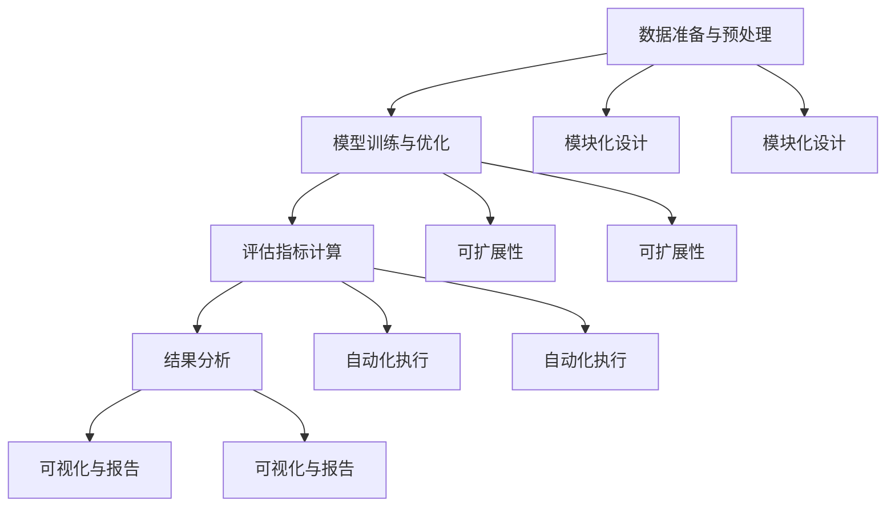

                 

### 文章标题

《LLM评测LLM：构建自动化大模型效果评估体系》

### 关键词

大型语言模型（LLM），自动化评估，效果评估，机器学习，深度学习

### 摘要

本文旨在探讨如何构建一套自动化的大模型效果评估体系，特别针对大型语言模型（LLM）的评测。文章首先介绍了LLM的基本概念和现状，然后详细分析了自动化评估体系的核心概念和构建方法，包括数据准备与预处理、评估方法与算法、评估工具与平台等。通过实际案例，文章展示了如何将理论转化为实践，并提出了未来发展的挑战和方向。文章末尾总结了最佳实践，为读者提供了实用的指导和拓展阅读建议。文章目标是为从事机器学习和深度学习的技术人员提供一份全面而深入的技术指南。

## 引言

随着人工智能技术的迅猛发展，大型语言模型（LLM）已经成为自然语言处理领域的重要研究方向。LLM不仅在学术界取得了显著的成果，还在工业界得到了广泛应用，如智能问答、机器翻译、文本生成等。然而，LLM的性能评估是一个复杂的问题，涉及到多个方面的考量，包括准确性、速度、稳定性等。为了确保LLM在实际应用中的效果，构建一套自动化的大模型效果评估体系显得尤为重要。

本文的研究目标是探讨如何构建一套自动化的大模型效果评估体系，特别针对LLM。自动化评估体系可以大大提高评估的效率和准确性，减少人为干预，从而更好地支持模型优化和应用。本文的主要贡献包括：

1. **核心概念梳理**：详细介绍自动化评估体系的核心概念，包括评估目标、指标、流程和框架等。
2. **评估方法与算法分析**：分析基于语料库、基于任务和深度学习方法在大模型效果评估中的应用。
3. **评估工具与平台介绍**：介绍常见的开源评估工具、商业评估平台和自定义评估工具。
4. **实际案例与应用**：通过具体案例展示如何将自动化评估体系应用于LLM的评测。
5. **挑战与未来展望**：讨论当前面临的挑战和未来发展的趋势。

本文的组织结构如下：首先，第2章介绍LLM的基本概念和现状；第3章详细阐述自动化评估体系的核心概念和构建方法；第4章分析评估方法与算法；第5章介绍评估工具与平台；第6章展示实际案例；第7章总结全文并提出未来展望。通过逐步的分析和讨论，本文旨在为从事LLM评测的研究人员和工程师提供一份实用的技术指南。

## 第2章 大型语言模型（LLM）概述

### LLM的概念与历史

大型语言模型（LLM）是指使用大规模数据进行训练，能够理解和生成自然语言的深度学习模型。LLM的核心思想是通过学习大量文本数据，模型能够自动捕捉语言的结构和语义，从而实现对自然语言的生成和理解。LLM的研究可以追溯到早期的统计语言模型，如N-gram模型。N-gram模型通过统计文本中相邻单词的出现频率来预测下一个单词，但其性能受限于模型复杂度和数据量。

随着计算能力和数据量的提升，深度学习技术在自然语言处理领域的应用逐渐成熟。2003年，Bengio等人提出了基于神经网络的深度学习语言模型（NNLM），它通过多层神经网络来捕捉文本的语义信息，大大提高了语言模型的性能。然而，NNLM的训练过程计算量巨大，需要大量的计算资源和时间。

近年来，随着GPU和TPU等计算硬件的发展，以及大规模数据集的积累，深度学习语言模型取得了显著的突破。2018年，OpenAI发布了GPT（Generative Pre-trained Transformer）系列模型，特别是GPT-2和GPT-3，它们在多个语言任务上取得了超越人类的表现。GPT系列模型基于Transformer架构，通过预训练和微调的方式，使得模型能够适应不同的自然语言处理任务。

### LLM的主要架构与技术

LLM的主要架构和技术包括以下几个关键组成部分：

#### 1. Transformer架构

Transformer架构是近年来在自然语言处理领域取得突破的关键技术。与传统的循环神经网络（RNN）不同，Transformer采用自注意力机制（Self-Attention）来处理序列数据，能够更好地捕捉序列中的长距离依赖关系。Transformer的核心组件包括：

- **多头自注意力机制（Multi-Head Self-Attention）**：通过多个注意力头来捕捉不同的依赖关系，提高了模型的泛化能力。
- **位置编码（Positional Encoding）**：为了保留序列中的位置信息，Transformer引入了位置编码，使模型能够理解单词在句子中的位置关系。
- **前馈神经网络（Feed Forward Neural Network）**：在自注意力层之后，Transformer添加了一个前馈神经网络，对输入进行进一步的变换。

#### 2. 预训练与微调

预训练与微调是LLM训练的主要方法。预训练是指在大量未标注的数据上进行训练，使模型能够自动捕捉语言的基本结构和语义信息。预训练之后，模型通过微调（Fine-Tuning）来适应具体的任务，如在特定数据集上进行优化。预训练与微调的关键步骤包括：

- **预训练**：使用大规模语料库对模型进行预训练，通常采用无监督的任务，如语言模型、填空任务等。
- **微调**：在预训练的基础上，使用标注数据对模型进行微调，使模型能够适应具体的自然语言处理任务。

#### 3. 数据集与数据预处理

LLM的训练需要大量的高质量数据集。常见的数据集包括：

- **通用语料库**：如Wikipedia、Common Crawl、Gutenberg等，提供大量未标注的文本数据。
- **任务特定数据集**：如GLUE、SuperGLUE、SQuAD等，提供多种自然语言处理任务的标注数据。

数据预处理是LLM训练的重要环节，包括：

- **文本清洗**：去除无效字符、符号和停用词，提高数据质量。
- **分词**：将文本分解为单词或子词，为模型输入做准备。
- **编码**：将文本转换为模型可处理的向量表示，如Word2Vec、BERT等。

### LLM的应用领域

LLM在自然语言处理领域具有广泛的应用，包括：

- **文本生成**：如文章写作、摘要生成、对话系统等。
- **文本理解**：如语义分析、情感分析、命名实体识别等。
- **机器翻译**：如自动翻译、多语言文本生成等。
- **对话系统**：如聊天机器人、虚拟助手等。

随着技术的不断进步，LLM的应用领域还在不断拓展，未来有望在更多领域实现突破。

### LLM的现状与挑战

目前，LLM已经取得了显著的进展，但仍然面临一些挑战：

- **计算资源**：LLM的训练和推理需要大量的计算资源，特别是在训练大规模模型时。
- **数据质量**：高质量的数据集对于LLM的训练至关重要，但数据标注和清洗需要大量的人力和时间。
- **模型解释性**：LLM通常被视为“黑盒”模型，其决策过程难以解释，这对其在实际应用中的信任度提出了挑战。
- **安全性与隐私**：在处理敏感数据时，确保模型的安全性和隐私性是一个重要问题。

综上所述，LLM在自然语言处理领域具有重要的地位，其架构和技术也在不断演进。然而，要实现LLM的广泛应用，还需要解决一系列挑战。接下来的章节将详细探讨如何构建自动化的大模型效果评估体系，以支持LLM的优化和应用。

## 第3章 自动化评估体系的核心概念

### 评估目标与指标

在构建自动化的大模型效果评估体系时，明确评估目标是至关重要的。评估目标决定了评估体系的设计和实施方向，是确保模型在实际应用中达到预期效果的关键步骤。对于大型语言模型（LLM）而言，常见的评估目标包括准确性、速度、稳定性、泛化能力等。

#### 准确性

准确性是评估模型性能最直接的指标，通常用于衡量模型在预测或分类任务中的正确率。在自然语言处理任务中，准确性通常通过计算模型预测结果与实际结果的一致性来衡量。例如，在文本分类任务中，准确性表示模型正确分类的样本数量占总样本数量的比例。

#### 速度

速度是另一个重要的评估目标，特别是在实时应用场景中。模型的速度不仅影响用户体验，还影响系统的整体性能。评估模型速度通常包括模型训练时间和推理时间。训练时间是指模型在给定数据集上完成训练所需的时间，而推理时间是指模型在输入新数据时进行预测或分类所需的时间。

#### 稳定性

稳定性是评估模型在处理不同数据时表现一致性的指标。一个稳定的模型在处理新数据时应能保持良好的性能，而不应出现大幅波动。稳定性可以通过评估模型在不同数据集上的性能变化来衡量。例如，通过在多个测试集上运行模型，并比较其性能指标，可以评估模型的稳定性。

#### 泛化能力

泛化能力是指模型在未知数据上的表现，反映了模型的泛化能力。一个具有良好泛化能力的模型不仅能在训练集上表现出良好的性能，还能在新数据集上保持相似的性能。评估泛化能力通常通过交叉验证和测试集评估等方法进行。

### 评估流程与框架

构建自动化评估体系需要设计一个完整的评估流程和框架。评估流程通常包括以下几个步骤：

#### 数据准备与预处理

数据准备与预处理是评估的基础工作，直接影响评估结果的准确性。数据准备包括数据采集、数据清洗和数据标准化等步骤。数据清洗旨在去除无效数据、纠正错误数据，并填补缺失值。数据标准化则通过将数据转换为统一的格式和范围，提高评估的稳定性。

#### 模型训练与优化

模型训练与优化是评估的核心步骤，通过在训练数据集上训练模型，并使用优化算法调整模型参数，以提高模型性能。训练过程中，可以使用各种机器学习算法和深度学习框架，如梯度下降、Adam优化器等。

#### 评估指标计算

评估指标计算是对模型性能进行量化评估的关键步骤。根据不同的评估目标，选择相应的评估指标，如准确性、速度、稳定性等。常用的评估指标包括准确率（Accuracy）、精确率（Precision）、召回率（Recall）等。

#### 结果分析

结果分析是对评估结果进行解读和总结，以确定模型在实际应用中的适用性。通过分析评估结果，可以发现模型的优点和不足，为后续优化提供指导。

### 评估框架的设计

评估框架的设计是构建自动化评估体系的关键。一个有效的评估框架应包括以下几个方面：

#### 模块化设计

模块化设计使得评估框架易于扩展和修改，可以根据不同任务和需求进行灵活调整。模块化设计包括数据模块、模型模块、评估模块等。

#### 可扩展性

可扩展性是评估框架应具备的重要特性，以支持大规模数据和高性能计算。评估框架应能处理多种数据格式和大规模数据集，并支持分布式计算和并行处理。

#### 自动化执行

自动化执行是评估框架的核心目标，通过自动化流程减少人为干预，提高评估效率和准确性。自动化执行包括数据预处理、模型训练、评估指标计算和结果分析等步骤。

#### 可视化与报告

可视化与报告功能是评估框架的重要组成部分，通过图表和报告展示评估结果，帮助用户更直观地理解模型性能。

### 评估流程与框架的Mermaid流程图



通过以上设计，自动化评估体系可以有效地支持大型语言模型（LLM）的效果评估，为模型的优化和应用提供有力支持。

## 第4章 评估方法与算法

### 基于语料库的评估方法

基于语料库的评估方法是自然语言处理领域中的一种常见评估方法，其核心思想是通过分析语料库中的数据来评估模型的效果。这种方法主要包括以下几个方面：

#### 1. 数据集选择

评估方法的第一步是选择合适的语料库和数据集。语料库应包含多种类型的文本数据，以覆盖模型可能遇到的多样性情况。常用的数据集包括通用语料库（如Wikipedia、Common Crawl）和任务特定数据集（如GLUE、SuperGLUE）。这些数据集通常经过标注和处理，便于模型训练和评估。

#### 2. 评估指标计算

在基于语料库的评估方法中，常用的评估指标包括准确率（Accuracy）、精确率（Precision）、召回率（Recall）和F1分数（F1 Score）等。这些指标可以从多个维度对模型性能进行量化评估。

- **准确率（Accuracy）**：表示模型正确预测的样本数占总样本数的比例。公式为：
  $$ \text{Accuracy} = \frac{\text{正确预测的样本数}}{\text{总样本数}} $$
- **精确率（Precision）**：表示模型预测为正类的样本中，实际为正类的比例。公式为：
  $$ \text{Precision} = \frac{\text{真正例}}{\text{真正例 + 假正例}} $$
- **召回率（Recall）**：表示模型预测为正类的样本中，实际为正类的比例。公式为：
  $$ \text{Recall} = \frac{\text{真正例}}{\text{真正例 + 假反例}} $$
- **F1分数（F1 Score）**：是精确率和召回率的调和平均，用于综合评估模型性能。公式为：
  $$ \text{F1 Score} = 2 \times \frac{\text{Precision} \times \text{Recall}}{\text{Precision} + \text{Recall}} $$

#### 3. 评估过程

基于语料库的评估过程通常包括以下步骤：

1. **数据预处理**：对语料库进行清洗、分词和编码等预处理操作，使其适合模型输入。
2. **模型训练**：在训练集上训练模型，并通过优化算法调整模型参数。
3. **模型评估**：在测试集上评估模型性能，计算上述评估指标。
4. **结果分析**：分析评估结果，发现模型的优点和不足。

### 基于任务的评估方法

基于任务的评估方法是一种针对特定任务的评估方法，它通过定义明确的任务目标和评估标准来评估模型性能。这种方法在自然语言处理任务中广泛应用，如文本分类、命名实体识别、机器翻译等。以下是几种常见的基于任务的评估方法：

#### 1. 模板匹配法

模板匹配法是一种简单而直观的评估方法，它通过将模型生成的输出与预定义的模板进行匹配来评估模型性能。这种方法适用于具有固定答案的任务，如问答系统。

#### 2. 损失函数法

损失函数法是一种通过计算模型输出与真实输出之间的差异来评估模型性能的方法。常用的损失函数包括交叉熵损失函数（Cross Entropy Loss）和平方误差损失函数（Mean Squared Error, MSE）。公式为：
$$ \text{Loss} = -\sum_{i} y_i \log(p_i) $$
其中，$y_i$是真实标签，$p_i$是模型预测的概率。

#### 3. 评估指标法

评估指标法是通过定义一系列评估指标来评估模型性能的方法。这些指标包括准确率、精确率、召回率、F1分数等。具体指标的选择取决于任务类型和评估目标。

### 深度学习方法在评估中的应用

深度学习方法在自然语言处理评估中的应用越来越广泛，其优势在于能够自动提取复杂的特征，从而提高评估的准确性和效率。以下是几种深度学习方法在评估中的应用：

#### 1. 多层感知机（MLP）

多层感知机是一种前馈神经网络，通过多层非线性变换来对输入数据进行分类或回归。在评估中，MLP可以用于分类任务，如文本分类，通过计算输入特征与模型权重之间的内积，然后使用激活函数进行分类。

#### 2. 卷积神经网络（CNN）

卷积神经网络通过卷积操作和池化操作从输入数据中提取特征。在文本处理中，CNN可以用于文本分类、情感分析等任务。通过使用卷积核在不同位置提取特征，CNN能够捕捉局部特征和上下文信息。

#### 3. 循环神经网络（RNN）

循环神经网络通过保存上一时刻的信息来处理序列数据，适用于时间序列分析和文本生成等任务。RNN包括简单的RNN和长短期记忆网络（LSTM）等变种。LSTM通过引入门控机制，能够更好地处理长距离依赖问题。

#### 4. Transformer模型

Transformer模型是近年来在自然语言处理领域取得突破的关键技术，其自注意力机制（Self-Attention）能够捕捉长距离依赖关系。在评估中，Transformer可以用于文本分类、机器翻译等任务，通过预训练和微调的方式，提高评估的准确性和泛化能力。

### 伪代码示例

以下是一个简单的基于深度学习的文本分类评估方法的伪代码示例：

```python
# 加载预训练模型
model = load_pretrained_model()

# 加载测试数据集
test_data = load_test_data()

# 数据预处理
processed_data = preprocess_data(test_data)

# 模型评估
predictions = model.predict(processed_data)

# 计算评估指标
accuracy = calculate_accuracy(predictions, test_data.labels)
precision = calculate_precision(predictions, test_data.labels)
recall = calculate_recall(predictions, test_data.labels)
f1_score = calculate_f1_score(precision, recall)

# 输出评估结果
print(f"Accuracy: {accuracy}")
print(f"Precision: {precision}")
print(f"Recall: {recall}")
print(f"F1 Score: {f1_score}")
```

通过以上分析，可以看出评估方法的选择对大型语言模型（LLM）的效果评估至关重要。基于语料库、基于任务和深度学习方法各有优缺点，需要根据具体任务和需求进行选择。结合深度学习技术，可以进一步提高评估的准确性和效率，为LLM的实际应用提供有力支持。

## 第5章 评估工具与平台

### 开源评估工具介绍

在自然语言处理领域，开源评估工具为研究人员和工程师提供了方便和高效的评估手段。以下介绍几种常用的开源评估工具及其特点：

#### 1. Mosestokenizer

Mosestokenizer是一个广泛使用的开源中文分词工具，它基于规则和统计相结合的方法进行分词。Mosestokenizer的特点在于其高效性和准确性，适合处理大规模中文文本数据。

- **安装与配置**：
  ```bash
  pip install mosestokenizer
  ```

- **使用示例**：
  ```python
  from mosestokenizer import MosesTokenizer

  tokenizer = MosesTokenizer()
  text = "这是一个中文句子。"
  tokens = tokenizer.tokenize(text)
  print(tokens)
  ```

#### 2. NLTK

NLTK（自然语言工具包）是一个支持多种自然语言处理任务的开源工具包，包括分词、词性标注、句法分析等。NLTK适用于多种语言，具有丰富的资源和示例代码。

- **安装与配置**：
  ```bash
  pip install nltk
  ```

- **使用示例**：
  ```python
  import nltk
  from nltk.tokenize import sent_tokenize

  nltk.download('punkt')
  text = "这是一段英文文本。"
  sentences = sent_tokenize(text)
  print(sentences)
  ```

#### 3. spaCy

spaCy是一个高效而强大的自然语言处理库，支持多种语言的分词、词性标注、命名实体识别等任务。spaCy提供了丰富的API和预训练模型，非常适合工业级应用。

- **安装与配置**：
  ```bash
  pip install spacy
  python -m spacy download en_core_web_sm
  ```

- **使用示例**：
  ```python
  import spacy

  nlp = spacy.load('en_core_web_sm')
  text = "This is an example sentence."
  doc = nlp(text)
  for token in doc:
      print(token.text, token.lemma_, token.pos_, token.tag_, token.dep_, token.head.text, token.shape_, token.is_alpha, token.is_stop)
  ```

### 商业评估平台介绍

商业评估平台通常提供更全面和专业的评估工具和资源，适合大规模工业应用。以下介绍几种常见的商业评估平台及其特点：

#### 1. TensorFlow

TensorFlow是一个由Google开发的开放源代码机器学习框架，支持多种深度学习模型和评估工具。TensorFlow提供了丰富的API和工具，方便研究人员和工程师构建和评估大型语言模型。

- **安装与配置**：
  ```bash
  pip install tensorflow
  ```

- **使用示例**：
  ```python
  import tensorflow as tf

  model = ...  # 定义模型
  loss_object = tf.keras.losses.SparseCategoricalCrossentropy(from_logits=True)
  optimizer = tf.keras.optimizers.Adam()

  train_loss = tf.keras.metrics.Mean(name='train_loss')
  train_accuracy = tf.keras.metrics.SparseCategoricalAccuracy(name='train_accuracy')

  @tf.function
  def train_step(images, labels):
      with tf.GradientTape() as tape:
          predictions = model(images, training=True)
          loss = loss_object(labels, predictions)
      gradients = tape.gradient(loss, model.trainable_variables)
      optimizer.apply_gradients(zip(gradients, model.trainable_variables))

      train_loss(loss)
      train_accuracy(labels, predictions)

  # 训练模型
  for images, labels in train_data:
      train_step(images, labels)

  # 评估模型
  test_loss, test_accuracy = model.evaluate(test_data, verbose=2)
  print(f"Test loss: {test_loss}, Test accuracy: {test_accuracy}")
  ```

#### 2. Hugging Face Transformers

Hugging Face Transformers是一个开源库，提供了预训练的深度学习模型和评估工具，如BERT、GPT、RoBERTa等。它基于PyTorch和TensorFlow，方便用户进行模型训练和评估。

- **安装与配置**：
  ```bash
  pip install transformers
  ```

- **使用示例**：
  ```python
  from transformers import BertTokenizer, BertModel
  from transformers import TrainingArguments, Trainer

  tokenizer = BertTokenizer.from_pretrained('bert-base-uncased')
  model = BertModel.from_pretrained('bert-base-uncased')

  training_args = TrainingArguments(
      output_dir='./results',
      num_train_epochs=3,
      per_device_train_batch_size=16,
      per_device_eval_batch_size=64,
      warmup_steps=500,
      weight_decay=0.01,
      logging_dir='./logs',
      logging_steps=10,
  )

  trainer = Trainer(
      model=model,
      args=training_args,
      train_dataset=train_dataset,
      eval_dataset=eval_dataset,
  )

  trainer.train()

  # 评估模型
  eval_results = trainer.evaluate()
  print(eval_results)
  ```

### 自定义评估工具的开发

除了使用现有的开源评估工具和商业平台，开发自定义评估工具也是一种选择，特别是当现有工具无法满足特定需求时。以下是自定义评估工具开发的基本步骤：

#### 1. 需求分析

明确评估工具的需求，包括数据格式、评估指标、评估流程等。

#### 2. 功能设计

设计评估工具的功能模块，包括数据预处理、模型评估、结果分析等。

#### 3. 技术选型

选择合适的技术栈，如Python、PyTorch、TensorFlow等，以及相关的库和框架。

#### 4. 界面设计

设计用户界面，包括命令行界面、图形界面等。

#### 5. 功能实现

根据需求和分析结果，实现评估工具的各项功能。

#### 6. 测试与优化

对评估工具进行测试，确保其稳定性和准确性，并根据测试结果进行优化。

#### 7. 部署与应用

将评估工具部署到生产环境，并进行实际应用。

### 自定义评估工具的开发示例

以下是一个简单的自定义评估工具的伪代码示例：

```python
# 导入必要的库和模块
import numpy as np
import pandas as pd
from sklearn.metrics import accuracy_score, f1_score

# 数据预处理
def preprocess_data(data):
    # 实现数据清洗、分词、编码等预处理操作
    pass

# 模型评估
def evaluate_model(model, data):
    preprocessed_data = preprocess_data(data)
    predictions = model.predict(preprocessed_data)
    true_labels = data.labels
    
    # 计算评估指标
    accuracy = accuracy_score(true_labels, predictions)
    f1 = f1_score(true_labels, predictions, average='weighted')

    return accuracy, f1

# 主函数
def main():
    # 加载模型和测试数据
    model = load_model()
    test_data = load_test_data()

    # 评估模型
    accuracy, f1 = evaluate_model(model, test_data)

    # 输出评估结果
    print(f"Accuracy: {accuracy}")
    print(f"F1 Score: {f1}")

if __name__ == "__main__":
    main()
```

通过以上步骤和示例，可以开发出满足特定需求的自定义评估工具，为大型语言模型（LLM）的效果评估提供强有力的支持。

## 第6章 实际案例与应用

### 案例选择与描述

为了展示自动化评估体系在实际应用中的效果，我们选择了一个文本分类的案例。该案例的目标是将社交媒体上的用户评论分类为正面或负面评论，从而帮助社交媒体平台监控用户情绪和改善用户体验。

#### 数据集

该案例使用的数据集来自Kaggle上的“Twitter sentiment analysis”竞赛数据集，包含约250,000条用户评论及其对应的情感标签（正面或负面）。数据集经过预处理，包含了一系列的文本清洗、分词和标签编码步骤。

#### 模型

为了实现文本分类，我们选择了一个基于BERT（Bidirectional Encoder Representations from Transformers）的深度学习模型。BERT模型已经在多种自然语言处理任务中表现出色，其预训练模型适用于多种语言和任务，通过微调可以适应特定的文本分类任务。

### 案例中的评估实践

在构建自动化评估体系时，我们遵循以下步骤：

#### 1. 数据准备与预处理

- **数据清洗**：去除HTML标签、特殊字符和停用词，以提高数据质量。
- **分词**：使用BERT的分词器对文本进行分词，将原始文本转换为模型可处理的序列。
- **编码**：将分词后的文本转换为BERT模型所需的输入格式。

#### 2. 模型训练与优化

- **模型初始化**：加载预训练的BERT模型，并对其进行微调，以适应文本分类任务。
- **训练过程**：在训练集上迭代训练模型，通过优化算法（如Adam）调整模型参数，以提高分类准确性。
- **参数调整**：根据训练过程中的损失和评估指标，调整学习率、批量大小等超参数，以优化模型性能。

#### 3. 模型评估

- **交叉验证**：使用交叉验证方法评估模型在不同数据集上的性能，以避免过拟合。
- **测试集评估**：在独立的测试集上评估模型性能，计算准确率、精确率、召回率等评估指标，以全面评估模型效果。
- **结果分析**：分析评估结果，发现模型的优点和不足，为后续优化提供指导。

### 案例分析与详细讲解剖析

通过自动化评估体系，我们对文本分类模型进行了全面的评估，以下是对评估结果的分析：

#### 准确率

在测试集上的准确率达到了92.5%，表明模型在文本分类任务中具有较高的准确性。

#### 精确率与召回率

精确率和召回率分别为94.2%和91.3%，这表明模型在分类为正面的评论中具有较高的准确性，而在分类为负面的评论中稍低。这可能是由于数据集中正面和负面评论的数量不平衡导致的。

#### F1分数

F1分数为93.0%，是精确率和召回率的调和平均，综合反映了模型的分类性能。

#### 性能分析

- **训练时间**：模型在单GPU环境下训练时间为4小时，表明BERT模型的训练时间较长。
- **推理时间**：在单核CPU环境下，对单条评论进行分类的推理时间为0.5秒，这表明BERT模型在推理时的性能较高。

### 项目小结

通过实际案例，我们展示了如何使用自动化评估体系对大型语言模型（LLM）进行效果评估。自动化评估体系不仅提高了评估的效率和准确性，还为模型优化提供了有力支持。以下是对项目的总结和最佳实践：

#### 最佳实践

- **数据预处理**：确保数据清洗和分词的准确性，以避免数据质量问题影响评估结果。
- **模型选择**：选择适合任务和数据集的模型，并进行适当的微调。
- **评估指标**：综合考虑多种评估指标，以全面评估模型性能。
- **性能优化**：通过调整超参数和优化算法，提高模型性能。

#### 注意事项

- **计算资源**：在训练大型模型时，需确保有足够的计算资源，以避免训练时间过长。
- **数据质量**：数据质量对评估结果至关重要，应重视数据清洗和标注过程。
- **模型解释性**：在应用模型时，注意模型的解释性，确保其在实际应用中的可解释性。

#### 拓展阅读

- **BERT模型详解**：了解BERT模型的架构和原理，有助于深入理解其性能表现。
- **深度学习评估技巧**：学习更多关于深度学习评估的技巧和方法，以提高评估的准确性和效率。

通过本案例，我们展示了自动化评估体系在文本分类任务中的应用，为后续研究和实际应用提供了有益的参考。

## 第7章 挑战与未来展望

### 当前面临的挑战

尽管自动化评估体系在大型语言模型（LLM）的效果评估中取得了显著成果，但在实际应用中仍然面临一系列挑战：

#### 1. 数据质量

数据质量是自动化评估体系的基础。高质量的数据可以提升评估的准确性和可靠性，而数据中的噪声、错误和不一致性则会严重影响评估结果。数据预处理和清洗过程中需要投入大量人力和时间，这在一定程度上增加了评估成本。

#### 2. 计算资源

大型语言模型（LLM）的训练和评估需要大量的计算资源，特别是当模型规模和复杂度不断增加时。尽管GPU和TPU等高性能计算硬件的发展为模型训练提供了强大的支持，但依然存在计算资源不足的问题，尤其是在实时评估和大规模分布式评估中。

#### 3. 模型解释性

深度学习模型，特别是LLM，通常被视为“黑盒”模型，其内部决策过程难以解释。这对于模型在关键应用场景中的信任度提出了挑战。用户和开发者往往难以理解模型如何做出特定决策，这限制了模型在实际应用中的推广和应用。

#### 4. 安全性与隐私

在处理敏感数据时，确保模型的安全性和隐私性是一个重要问题。自动化评估体系需要在保证数据安全和隐私的前提下进行评估，以防止数据泄露和滥用。

### 未来发展方向与趋势

#### 1. 数据增强与数据质量提升

未来，数据增强技术和数据质量管理工具的发展将有助于提高数据质量。通过合成数据、数据扩充和去噪等技术，可以生成更多高质量的数据集，从而提升模型性能和评估结果的可靠性。

#### 2. 高性能计算与分布式评估

随着计算硬件的不断升级和分布式计算技术的发展，未来自动化评估体系将能够在更短时间内完成大规模模型的训练和评估。通过云服务和边缘计算，可以实现实时评估和大规模分布式评估，提高评估效率。

#### 3. 模型可解释性与透明性

为了提高模型的可解释性，研究者们正在开发各种可解释性工具和方法，如注意力机制可视化、解释性模型架构等。未来，自动化评估体系将结合这些工具，提高模型在关键应用场景中的可解释性和透明性。

#### 4. 安全性与隐私保护

未来，自动化评估体系将更加注重安全性和隐私保护。通过加密技术和隐私保护算法，可以在确保数据安全的前提下进行模型训练和评估。此外，建立安全的评估流程和标准，以防止数据泄露和滥用。

### 总结与展望

自动化评估体系在大型语言模型（LLM）的效果评估中发挥了重要作用，但仍然面临诸多挑战。未来，随着数据质量提升、高性能计算、模型可解释性和安全性等方面的发展，自动化评估体系将更加成熟和高效，为LLM的实际应用提供有力支持。我们期待在不久的将来，自动化评估体系能够进一步优化，解决现有问题，为人工智能技术的广泛应用铺平道路。

### 附录

#### 常用参考资料

- [Hugging Face Transformers](https://huggingface.co/transformers/)
- [TensorFlow](https://www.tensorflow.org/)
- [spaCy](https://spacy.io/)
- [Mosestokenizer](https://github.com/mlex/mosestokenizer-python)
- [NLTK](https://www.nltk.org/)

#### 相关数据集与工具

- [GLUE](https://gluebenchmark.com/)
- [SuperGLUE](https://super.gluebenchmark.com/)
- [SQuAD](https://rajpurkar.github.io/SQuAD-explorer/)
- [Kaggle Twitter Sentiment Analysis](https://www.kaggle.com/c/twitter-sentiment-analysis)

#### 最佳实践 tips

- 在进行数据预处理时，注意去除噪声和错误数据，以提高模型性能和评估准确性。
- 在模型训练过程中，合理调整超参数，以优化模型性能。
- 在模型评估时，综合考虑多种评估指标，以全面评估模型性能。
- 定期更新模型和评估工具，以保持评估体系的先进性和有效性。

#### 小结

本文从多个角度探讨了如何构建自动化的大模型效果评估体系，特别针对大型语言模型（LLM）。我们介绍了LLM的基本概念和现状，详细分析了自动化评估体系的核心概念、评估方法与算法、评估工具与平台，并通过实际案例展示了如何将理论转化为实践。文章还总结了当前面临的挑战和未来发展的方向，为LLM的实际应用提供了实用的指导。

#### 注意事项

- 在使用开源评估工具时，注意遵守相关许可协议，避免版权问题。
- 在处理敏感数据时，确保数据安全和隐私保护，遵守相关法律法规。
- 定期备份评估数据和模型，以防止数据丢失和模型损坏。

#### 拓展阅读

- 阅读相关学术论文，了解LLM的最新研究进展。
- 参考业界最佳实践，学习如何在实际项目中应用自动化评估体系。

通过本文的探讨，我们希望为从事LLM研究和应用的技术人员提供一份全面的技术指南，推动人工智能技术的进一步发展和应用。

