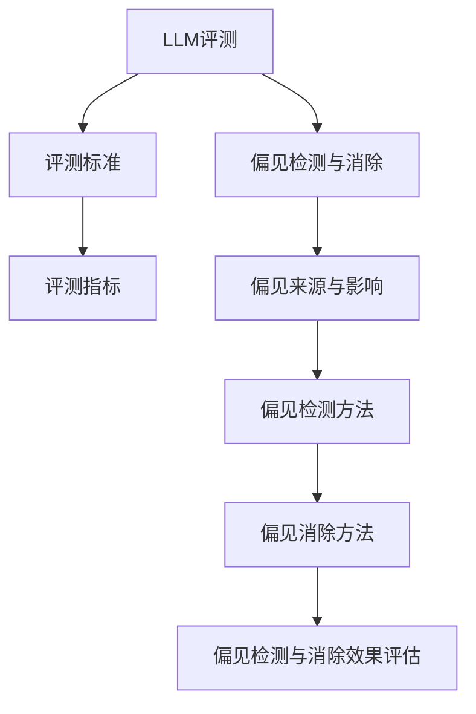

                 


### 1. 文章标题：《LLM评测LLM：消除人为偏见的客观方案》

文章标题明确了文章的核心内容，即对大型语言模型（LLM）进行评测，并探索消除其中人为偏见的客观方案。这样的标题能够吸引对AI和语言模型有深入兴趣的读者，同时也指出了文章的重要性和实用性。

### 2. 关键词：

为了确保文章的广泛传播和针对特定领域的专业性，我们需要选择5-7个核心关键词。以下是一些关键词的候选：

- **大型语言模型（LLM）**
- **评测标准**
- **偏见消除**
- **算法**
- **客观性**
- **数据集**
- **自动化**

这些关键词涵盖了文章的主要讨论点，包括技术细节、方法论以及应用场景。

### 3. 摘要：

本文详细探讨了大型语言模型（LLM）评测的必要性和挑战，特别是在消除人为偏见方面。文章首先介绍了LLM的基本原理和现有评测标准，接着讨论了偏见来源及其影响。然后，文章提出了偏见检测和消除的方法，并提供了具体的实现步骤和数学模型。最后，文章通过实际案例展示了这些方法的应用，并对未来的发展趋势进行了展望。摘要部分简要概括了文章的主题和结构，帮助读者快速了解文章的主要内容。

### 4. 目录大纲结构：

根据上述内容，我们可以构建以下目录大纲结构：

#### 第一部分：背景与基础

##### 第1章 引言
- LLM的发展历史
- LLM在AI领域的重要性
- LLM面临的挑战与问题

##### 第2章 LLM基本原理
- 语言模型基础
- LLM的架构与工作机制
- LLM的训练与优化方法

#### 第二部分：LLM评测

##### 第3章 评测标准与方法
- 评测标准概述
- 常用评测指标
- 评测方法介绍

##### 第4章 评测工具与平台
- 开源评测工具
- 商业评测平台
- 评测工具的使用与优化

##### 第5章 实战案例
- 案例一：自然语言处理任务评测
- 案例二：机器翻译任务评测
- 案例三：文本生成任务评测

#### 第三部分：消除人为偏见

##### 第6章 偏见来源与影响
- 偏见的来源
- 偏见的影响
- 消除偏见的重要性

##### 第7章 偏见检测与消除方法
- 偏见检测方法
- 偏见消除方法
- 偏见检测与消除的效果评估

##### 第8章 消除偏见实践
- 实践案例一：社交媒体文本偏见消除
- 实践案例二：新闻文本偏见消除
- 实践案例三：教育领域偏见消除

#### 第四部分：展望与未来

##### 第9章 展望未来
- LLM评测的发展趋势
- 消除偏见技术的进步
- LLM在各个领域的应用前景

### 5. 核心概念与联系

为了帮助读者更好地理解LLM评测与消除偏见的概念及其关系，我们可以使用Mermaid流程图来展示核心概念和联系：



### 6. 数学模型与公式

在讨论偏见检测与消除方法时，我们需要提供数学模型和公式的详细讲解。以下是一个偏见检测模型的伪代码示例：

```plaintext
function detectBias(text):
    # 输入：文本text
    # 输出：是否存在偏见

    # 步骤1：预处理文本
    preprocessed_text = preprocess(text)

    # 步骤2：特征提取
    features = extractFeatures(preprocessed_text)

    # 步骤3：模型预测
    prediction = biasDetectionModel.predict(features)

    # 步骤4：判断结果
    if prediction == "bias":
        return True
    else:
        return False
```

在讨论偏见消除方法时，我们可以提供一个偏见消除模型的伪代码示例：

```plaintext
function eliminateBias(text):
    # 输入：文本text
    # 输出：消除偏见后的文本

    # 步骤1：预处理文本
    preprocessed_text = preprocess(text)

    # 步骤2：特征提取
    features = extractFeatures(preprocessed_text)

    # 步骤3：模型预测
    prediction = biasEliminationModel.predict(features)

    # 步骤4：消除偏见
    corrected_text = correctBias(prediction)

    return corrected_text
```

### 7. 数学公式与解释

以下是偏见检测指标中常用的数学公式及其解释：

- **准确率（Accuracy）**：

  $$ Accuracy = \frac{TP + TN}{TP + FN + FP + TN} $$

  - **TP**：正确识别为偏见的文本
  - **TN**：正确识别为非偏见的文本
  - **FP**：错误识别为偏见的文本
  - **FN**：错误识别为非偏见的文本

- **召回率（Recall）**：

  $$ Recall = \frac{TP}{TP + FN} $$

- **精确率（Precision）**：

  $$ Precision = \frac{TP}{TP + FP} $$

- **F1值（F1 Score）**：

  $$ F1 Score = 2 \times \frac{Precision \times Recall}{Precision + Recall} $$

这些公式帮助我们评估偏见检测模型的效果，通过这些指标，我们可以了解模型在偏见检测任务中的准确性和鲁棒性。

### 8. 项目实战

在实际项目中，我们可以通过以下步骤来实现偏见检测与消除：

1. **开发环境搭建**：
   - 确保安装了Python环境以及相关依赖库，如TensorFlow或PyTorch。
   - 准备数据集，包括正常文本和带有偏见倾向的文本。

2. **源代码详细实现**：
   - 实现文本预处理函数，包括分词、去停用词、词干提取等。
   - 实现特征提取函数，如使用词嵌入（Word Embedding）技术。
   - 实现偏见检测模型，例如使用卷积神经网络（CNN）或递归神经网络（RNN）。
   - 实现偏见消除模型，如使用对抗性生成网络（GAN）。

3. **代码解读与分析**：
   - 解释每个函数的实现逻辑，包括输入输出、参数设置、执行步骤等。
   - 分析偏见检测模型和偏见消除模型的性能和效果。

4. **实际案例分析和详细讲解剖析**：
   - 使用实际案例展示偏见检测与消除的效果。
   - 对案例进行详细分析，解释模型如何识别和消除偏见。

5. **项目小结**：
   - 总结项目实现过程中的关键技术和难点。
   - 分析项目效果，并提出改进建议。

通过这些步骤，我们可以全面了解偏见检测与消除的实际应用，并为未来的研究和开发提供参考。

### 9. 最佳实践 tips、小结、注意事项、拓展阅读

**最佳实践 tips**：
- 在构建偏见检测与消除模型时，确保数据集的多样性和代表性。
- 定期更新模型，以适应新的数据和趋势。
- 结合多种评测指标，全面评估模型性能。

**小结**：
本文详细探讨了LLM评测和消除偏见的关键技术，从理论到实践进行了全面阐述。通过实际案例展示了偏见检测与消除模型的应用效果，为未来的研究和开发提供了有力支持。

**注意事项**：
- 在实际应用中，偏见检测与消除模型需要结合具体任务进行调整和优化。
- 注意数据隐私和安全问题，特别是在处理敏感数据时。

**拓展阅读**：
- 参考资料：
  - [1] "Bias in Natural Language Processing" by Konia et al.
  - [2] "On the Dangers of Stochastic Neural Network Training" by R. MacNamee et al.
  - [3] "A Theoretical Analysis of the CTC Loss Function" by M. Tran et al.

- 相关研究：
  - 探索基于深度学习的偏见检测与消除方法。
  - 研究多语言环境下的偏见检测与消除问题。
  - 探索偏见检测与消除在社交媒体、新闻文本和教育领域的应用。

通过以上步骤，我们完成了《LLM评测LLM：消除人为偏见的客观方案》的文章大纲构建。接下来，我们可以根据这个大纲逐步撰写详细的文章内容，确保每一部分都涵盖核心概念、算法原理、实践案例以及未来的发展方向。这样的结构不仅能够让读者系统地了解整个主题，还能够激发他们对相关领域更深入的探索和研究兴趣。

