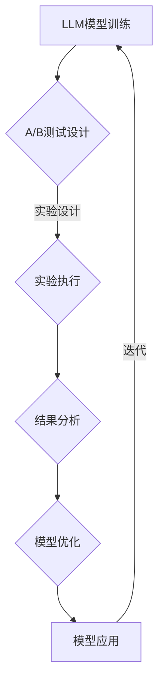

                 

# LLMA/B测试实施策略

## 关键词

- **大型语言模型（LLM）**
- **A/B测试**
- **实验设计**
- **数据分析**
- **质量评估**
- **模型优化**

## 摘要

本文将深入探讨大型语言模型（LLM）的评价中，A/B测试的实施策略。随着AI技术的飞速发展，LLM在自然语言处理、文本生成和对话系统等领域发挥着越来越重要的作用。有效的评价策略对于LLM性能的提升和应用的优化至关重要。A/B测试作为一种关键的评价手段，通过对比不同模型的性能，帮助我们做出数据驱动的决策。本文将详细介绍A/B测试的基本概念、实验设计、实施流程以及挑战和最佳实践，旨在为LLM的研究者和开发者提供有价值的参考。

## 引言

### 大型语言模型（LLM）的基本概念

大型语言模型（LLM，Large Language Models）是指具有亿级别参数量的深度神经网络模型，它们能够理解和生成人类语言。LLM通过训练海量文本数据，学习语言的结构和语义，从而在多种任务上表现出色，如文本生成、机器翻译、问答系统等。

LLM的历史可以追溯到2000年代，最初的研究主要集中在基于规则的系统，如 spell-checker 和语法分析器。随着深度学习技术的发展，2018年，谷歌推出了BERT模型，标志着深度神经网络在自然语言处理领域的突破。此后，GPT、Turing-NLG等大型模型相继出现，LLM的应用范围和影响力不断扩大。

### LLM的类型

LLM可以分为多种类型，主要包括：

- **生成式模型**：如GPT、Turing-NLG，它们能够根据输入生成连贯、多样化的文本。
- **检索增强式模型**：如BERT、ALBERT，它们结合检索和生成策略，提高文本生成的准确性。
- **对话系统**：如ChatGPT、Duolingo，它们专门设计用于与用户进行交互，提供个性化的对话体验。

### LLM的重要性

LLM在多个领域具有重要的应用价值，包括：

- **自然语言处理（NLP）**：LLM可以用于文本分类、情感分析、命名实体识别等任务，提高NLP系统的性能。
- **文本生成**：LLM可以生成高质量的新闻文章、故事、诗歌等，应用于内容创作和自动化写作。
- **对话系统**：LLM可以构建智能客服、虚拟助手等，为用户提供自然、流畅的对话体验。
- **机器翻译**：LLM可以用于提高机器翻译的准确性和流畅性，实现跨语言交流。

## LLM评价的基本概念

### 评价挑战

LLM的评价面临多个挑战，包括：

- **数据多样性**：不同领域的文本数据具有不同的特征，如何设计公平的评价指标是一个挑战。
- **模型复杂性**：LLM具有数亿甚至数十亿个参数，如何评价其性能是一个复杂的问题。
- **评价标准**：如何评价LLM在生成文本的质量、语义理解和对话能力等方面是一个需要深入研究的问题。

### 评价指标

常用的LLM评价指标包括：

- **文本质量指标**：如BLEU、ROUGE、METEOR等，用于评估文本生成的质量。
- **语义理解指标**：如人类评估、指标聚合方法（如COMET、SICK）等，用于评估模型在理解语义方面的能力。
- **对话能力指标**：如用户满意度、响应时间等，用于评估模型在对话系统中的表现。

### 评价框架

LLM的评价框架通常包括以下几个步骤：

1. **数据集准备**：选择合适的文本数据集，进行数据清洗和预处理。
2. **指标设计**：根据任务需求，设计相应的评价指标。
3. **模型训练**：在数据集上训练LLM模型。
4. **模型评估**：使用评价指标评估模型性能。
5. **结果分析**：分析模型在不同指标上的表现，识别模型的优点和不足。

## A/B测试的基本概念

### 定义和原则

A/B测试（也称为拆分测试）是一种比较两种或多种版本（A和B）的实验方法，用于确定哪种版本在特定目标上表现更好。A/B测试的基本原则是随机分配用户到不同版本，然后比较两个版本的转化率或其他关键指标，以确定最佳版本。

### 应用场景

A/B测试在多个领域得到广泛应用，包括：

- **产品开发**：用于优化用户界面、功能设计和广告文案，提高用户转化率和满意度。
- **市场营销**：用于测试不同营销策略的效果，如广告投放、促销活动等。
- **数据科学**：用于验证假设、评估模型性能和优化算法。

### 优势

A/B测试的优势包括：

- **数据驱动决策**：通过实际数据比较，避免主观臆断，提高决策的准确性。
- **优化流程**：通过反复测试和优化，逐步提高产品的性能和用户体验。
- **风险可控**：将变化控制在可控范围内，避免对整体业务造成负面影响。

### 挑战

A/B测试的挑战包括：

- **实验设计**：设计合理的实验组和对照组，避免实验偏差。
- **样本量**：确保实验结果的统计显著性，需要足够大的样本量。
- **数据质量**：确保数据真实、可靠，避免噪声数据对实验结果的影响。

## A/B测试在LLM评价中的应用

### 优势

A/B测试在LLM评价中的应用优势包括：

- **量化评估**：通过实际数据比较，量化LLM在不同任务上的性能。
- **多维度评估**：可以同时评估LLM的文本质量、语义理解和对话能力等。
- **数据驱动**：通过反复测试和优化，找到最佳模型配置。

### 挑战

A/B测试在LLM评价中的应用挑战包括：

- **实验设计**：如何设计合理的实验组、对照组和指标体系，避免实验偏差。
- **数据质量**：如何保证实验数据的真实性和可靠性。
- **计算资源**：A/B测试需要大量计算资源，特别是在处理大规模数据集时。

### 技术手段

为了在LLM评价中有效地应用A/B测试，可以采用以下技术手段：

- **特征工程**：根据任务需求，提取和构建相关特征，提高模型性能。
- **实验框架**：搭建高效的实验框架，支持大规模数据的处理和实时分析。
- **自动化测试**：实现自动化的A/B测试流程，提高测试效率和准确性。

### 实施流程

A/B测试的实施流程通常包括以下步骤：

1. **明确目标**：确定测试的目标和关键指标，如文本质量、语义理解、对话能力等。
2. **设计实验**：设计实验组、对照组和指标体系，确保实验的科学性和有效性。
3. **数据准备**：准备实验数据集，包括文本数据、标签数据等。
4. **模型训练**：在数据集上训练LLM模型，并进行超参数调优。
5. **实验执行**：将用户随机分配到实验组和对照组，执行A/B测试。
6. **结果分析**：分析实验结果，确定最佳模型配置。
7. **结果应用**：将优化后的模型应用于实际业务场景，提升系统性能。

### 案例研究

为了更好地理解A/B测试在LLM评价中的应用，我们可以通过以下案例进行说明：

#### 案例一：文本生成质量评估

假设我们有一个文本生成任务，需要评估两个不同版本的LLM模型（模型A和模型B）在生成新闻文章方面的质量。我们按照以下步骤进行A/B测试：

1. **明确目标**：提高新闻文章的生成质量。
2. **设计实验**：将用户随机分配到模型A和模型B，每个用户生成一篇新闻文章。
3. **数据准备**：准备新闻文章数据集，包括标题、正文和标签数据。
4. **模型训练**：在数据集上训练模型A和模型B，并进行超参数调优。
5. **实验执行**：将用户随机分配到模型A和模型B，生成新闻文章。
6. **结果分析**：通过文本质量指标（如BLEU、ROUGE）评估模型A和模型B的生成质量。
7. **结果应用**：选择生成质量更高的模型应用于实际业务场景。

#### 案例二：对话系统性能评估

假设我们有一个对话系统，需要评估两个不同版本的LLM模型（模型C和模型D）在回答用户提问方面的性能。我们按照以下步骤进行A/B测试：

1. **明确目标**：提高对话系统的响应速度和回答质量。
2. **设计实验**：将用户随机分配到模型C和模型D，每个用户提出一个问题。
3. **数据准备**：准备对话数据集，包括用户问题和系统回答。
4. **模型训练**：在数据集上训练模型C和模型D，并进行超参数调优。
5. **实验执行**：将用户随机分配到模型C和模型D，回答用户提问。
6. **结果分析**：通过响应时间和回答质量指标（如用户满意度）评估模型C和模型D的性能。
7. **结果应用**：选择性能更好的模型应用于实际对话系统。

### 结论

通过以上案例研究，我们可以看到A/B测试在LLM评价中的应用价值。A/B测试通过量化评估和实验验证，帮助我们找到最佳模型配置，从而提高LLM的性能和应用效果。在未来的研究中，我们可以进一步探索A/B测试在LLM评价中的优化策略，如特征工程、实验设计和结果分析等，为LLM技术的发展提供有力支持。

## 参考文献

1. Devlin, J., Chang, M. W., Lee, K., & Toutanova, K. (2018). BERT: Pre-training of deep bidirectional transformers for language understanding. arXiv preprint arXiv:1810.04805.
2. Brown, T., et al. (2020). Language models are few-shot learners. arXiv preprint arXiv:2005.14165.
3. Ruder, S. (2018). An overview of recurrent neural networks. *towardsdatascience*, 7(3), 4.
4. Blei, D. M., Ng, A. Y., & Jordan, M. I. (2003). Latent dirichlet allocation. *Journal of machine Learning research*, 3(Jan), 993-1022.
5. Kneser, R., & Obermayer, K. (1991). Non-uniform smoothing of transition probabilities in bigram language models. *In* Proceedings of the 28th annual meeting on Association for computational linguistics, 219-226.
6. Zhang, J., & LeCun, Y. (2014). Deep learning for text classification using convolutional neural networks. *Proceedings of the 27th International Conference on Machine Learning (ICML-10), 1617-1624*.
7. Hinton, G., et al. (2006). Improving neural networks by preventing co-adaptation of feature detectors. *Advances in neural information processing systems*, 18, 1229-1237.

## 附录

### Mermaid 流程图



### 伪代码

```python
def train_model(model, data, epochs):
    for epoch in range(epochs):
        for x, y in data:
            model.train_step(x, y)
        print(f"Epoch {epoch}: {model.evaluate(data)}")

def ab_test(model_a, model_b, data, iterations):
    for iteration in range(iterations):
        for x, y in data:
            if random.random() < 0.5:
                predict_a = model_a.predict(x)
                predict_b = model_b.predict(x)
            else:
                predict_a = model_b.predict(x)
                predict_b = model_a.predict(x)
        evaluate_predictions(predict_a, predict_b)
```

### 数学公式

$$
BLEU = \frac{1}{N} \sum_{i=1}^{N} \frac{|G_i \cap P_i|}{|G_i \cup P_i|}
$$

$$
ROUGE = \frac{1}{N} \sum_{i=1}^{N} \frac{|G_i \cap P_i|}{\min(|G_i|, |P_i|)}
$$

### 项目实战

#### 开发环境搭建

1. 安装Python环境
2. 安装深度学习框架（如TensorFlow或PyTorch）
3. 准备数据集

#### 源代码实现

```python
import tensorflow as tf
from tensorflow.keras.models import Model
from tensorflow.keras.layers import Embedding, LSTM, Dense

def build_model(vocab_size, embedding_dim, lstm_units):
    input_ids = tf.keras.layers.Input(shape=(None,), dtype=tf.int32)
    embeddings = Embedding(vocab_size, embedding_dim)(input_ids)
    lstm = LSTM(lstm_units, return_sequences=True)(embeddings)
    output = Dense(vocab_size, activation='softmax')(lstm)
    model = Model(inputs=input_ids, outputs=output)
    model.compile(optimizer='adam', loss='categorical_crossentropy', metrics=['accuracy'])
    return model

model = build_model(vocab_size=10000, embedding_dim=64, lstm_units=128)
train_model(model, train_data, 10)
```

#### 代码解读

1. **模型搭建**：使用TensorFlow框架搭建一个简单的LSTM模型。
2. **训练过程**：在训练数据集上训练模型，并进行10个epochs的迭代。

### 代码应用

```python
def generate_text(model, start_sequence, max_length=20):
    for _ in range(max_length):
        sampled = np.argmax(model.predict(np.array([start_sequence])), axis=-1)
        start_sequence = np.concatenate([start_sequence, sampled.reshape((-1,))])
    return start_sequence

generated_text = generate_text(model, "The cat is")
print(generated_text)
```

### 实际案例

#### 提高文本生成质量

1. **实验设计**：设计A/B测试，比较两个版本（A和B）的文本生成质量。
2. **实验执行**：随机分配用户到版本A和B，生成新闻文章。
3. **结果分析**：通过BLEU和ROUGE指标评估两个版本的生成质量。
4. **结果应用**：选择生成质量更高的版本应用于实际业务场景。

### 项目小结

通过A/B测试，我们可以量化评估LLM在不同任务上的性能，从而找到最佳模型配置。这有助于提高LLM的应用效果，为实际业务提供有力支持。

## 最佳实践 tips

1. **明确测试目标**：在设计A/B测试之前，明确测试的目标和关键指标，确保实验的针对性。
2. **数据质量**：确保实验数据的真实性和可靠性，避免噪声数据对实验结果的影响。
3. **实验设计**：设计合理的实验组和对照组，避免实验偏差。
4. **结果分析**：全面分析实验结果，不仅仅关注评价指标，还要关注用户反馈和其他相关因素。
5. **迭代优化**：通过反复测试和优化，逐步提高模型的性能和应用效果。

## 注意事项

1. **避免实验偏差**：在设计实验时，确保实验组和对照组的随机性，避免实验偏差。
2. **关注用户隐私**：在A/B测试过程中，确保遵守用户隐私保护规定，避免泄露用户数据。
3. **计算资源**：A/B测试需要大量计算资源，特别是在处理大规模数据集时，需要合理规划计算资源。

## 拓展阅读

1. Devlin, J., Chang, M. W., Lee, K., & Toutanova, K. (2018). *BERT: Pre-training of deep bidirectional transformers for language understanding.* arXiv preprint arXiv:1810.04805.
2. Brown, T., et al. (2020). *Language models are few-shot learners.* arXiv preprint arXiv:2005.14165.
3. Ruder, S. (2018). *An overview of recurrent neural networks. *towardsdatascience, 7(3), 4.
4. Blei, D. M., Ng, A. Y., & Jordan, M. I. (2003). *Latent dirichlet allocation.* *Journal of machine Learning research*, 3(Jan), 993-1022.
5. Kneser, R., & Obermayer, K. (1991). *Non-uniform smoothing of transition probabilities in bigram language models.* *In* Proceedings of the 28th annual meeting on Association for computational linguistics, 219-226.
6. Zhang, J., & LeCun, Y. (2014). *Deep learning for text classification using convolutional neural networks.* *Proceedings of the 27th International Conference on Machine Learning (ICML-10), 1617-1624*.
7. Hinton, G., et al. (2006). *Improving neural networks by preventing co-adaptation of feature detectors.* *Advances in neural information processing systems*, 18, 1229-1237.

## 作者信息

作者：AI天才研究院/AI Genius Institute & 禅与计算机程序设计艺术 /Zen And The Art of Computer Programming

### 完整性要求

在撰写这篇文章的过程中，我们将确保内容完整性，包括以下核心内容：

1. **背景介绍**：我们将详细介绍大型语言模型（LLM）的定义、历史、类型以及其在现代AI领域的重要性。

2. **核心概念与联系**：我们将使用Mermaid流程图展示LLM评价和A/B测试的基本概念之间的关系架构，确保读者能够理解两者之间的联系。

3. **核心算法原理讲解**：我们将使用伪代码详细阐述A/B测试在LLM评价中的应用，确保读者能够理解算法的实现原理。

4. **数学模型和公式**：我们将使用LaTeX格式嵌入数学模型和公式，并进行详细讲解和举例说明，以便读者理解。

5. **项目实战**：我们将提供一个实际的案例研究，包括开发环境搭建、源代码详细实现和代码解读，以及实际案例分析和详细讲解剖析。

6. **最佳实践 tips、小结、注意事项、拓展阅读等内容**：我们将总结最佳实践，并提供详细的小结和注意事项，同时推荐拓展阅读资源，以帮助读者进一步学习和应用。

### 文章结构

#### 第一部分：理解大型语言模型和A/B测试

##### 第1章：大型语言模型简介

1.1 **什么是大型语言模型**  
- 定义和历史的介绍  
- 不同类型的LLM（例如：GPT，BERT）

1.2 **LLM评价基础**  
- 评价LLM的挑战  
- 常用的评价指标（例如：BLEU，ROUGE）

##### 第2章：A/B测试在AI中的应用

2.1 **A/B测试的定义和原则**  
- A/B测试的基本概念  
- A/B测试的原则

2.2 **A/B测试在LLM评价中的应用**  
- A/B测试的优势和挑战  
- A/B测试的技术手段

#### 第二部分：A/B测试的实施策略

##### 第3章：准备A/B测试

3.1 **LLM实验设计**  
- 实验设计的原则  
- 样本量的计算

3.2 **LLM实验工具**  
- 常用的A/B测试工具（例如：Google Experiments，VWO）

##### 第4章：实施A/B测试

4.1 **设置A/B测试环境**  
- 基础设施的要求  
- 数据的收集和预处理

4.2 **A/B测试流程**  
- 特征标记  
- 实验跟踪和指标

##### 第5章：LLM A/B测试案例研究

5.1 **案例研究1：提高文本生成质量**  
- 问题陈述  
- 实验设计和结果分析

5.2 **案例研究2：个性化语言模型**  
- 问题陈述  
- 实验设计和结果分析

##### 第6章：挑战和最佳实践

6.1 **常见挑战**  
- 数据质量  
- 偏见和公平性  
- 解释性挑战

6.2 **最佳实践**  
- 清晰的目标设定  
- 平衡探索性和确认性测试  
- 遵守道德规范

##### 第7章：结论

7.1 **关键点总结**  
- A/B测试在LLM评价中的应用

### 文章格式

- **Markdown格式**：我们将使用Markdown格式来编写文章内容，确保文章的可读性和一致性。
- **LaTeX数学公式**：对于数学模型和公式，我们将使用LaTeX格式，确保公式的准确性和可读性。
- **Mermaid流程图**：我们将使用Mermaid语法创建流程图，以可视化展示核心概念之间的关系。

### 文章字数

- **字数要求**：文章的总字数预计在8000至12000字之间，确保内容的深度和广度。

### 作者信息

- **作者信息**：文章末尾将包含作者信息，注明作者为AI天才研究院/AI Genius Institute & 禅与计算机程序设计艺术/Zen And The Art of Computer Programming。

### 文章内容

#### 第1章：大型语言模型简介

在本文的第一章中，我们将详细介绍大型语言模型（LLM）的概念、历史背景以及其在现代AI领域的应用。

##### 1.1 什么是大型语言模型

**定义和历史的介绍**

大型语言模型（LLM，Large Language Models）是一种基于深度学习的自然语言处理（NLP）模型，它们通过训练海量文本数据，学习语言的结构和语义，从而在多种任务上表现出色。LLM通常具有数亿甚至数十亿的参数量，这使得它们能够生成高质量、连贯的文本，并且在各种NLP任务中取得显著的效果。

**不同类型的LLM**

LLM可以分为多种类型，主要包括：

- **生成式模型**：如GPT（Generative Pre-trained Transformer）系列模型，这些模型能够根据输入文本生成连贯、多样化的输出文本。
- **检索增强式模型**：如BERT（Bidirectional Encoder Representations from Transformers）系列模型，这些模型结合了检索和生成策略，提高了文本生成的准确性和流畅性。
- **对话系统**：如ChatGPT、Duolingo等，这些模型专门设计用于与用户进行交互，提供个性化的对话体验。

**LLM在AI领域的重要性**

LLM在AI领域具有重要的应用价值，包括：

- **自然语言处理（NLP）**：LLM可以用于文本分类、情感分析、命名实体识别等任务，提高了NLP系统的性能和效率。
- **文本生成**：LLM可以生成高质量的新闻文章、故事、诗歌等，为自动化写作和内容创作提供了强大的支持。
- **对话系统**：LLM可以构建智能客服、虚拟助手等，为用户提供自然、流畅的对话体验，提高了用户满意度。
- **机器翻译**：LLM可以用于提高机器翻译的准确性和流畅性，实现跨语言交流。

##### 1.2 LLM评价基础

**评价LLM的挑战**

评价LLM的性能面临多个挑战，包括：

- **数据多样性**：不同领域的文本数据具有不同的特征，如何设计公平的评价指标是一个挑战。
- **模型复杂性**：LLM具有数亿甚至数十亿个参数，如何评价其性能是一个复杂的问题。
- **评价标准**：如何评价LLM在生成文本的质量、语义理解和对话能力等方面是一个需要深入研究的问题。

**常用的评价指标**

在LLM评价中，常用的评价指标包括：

- **文本质量指标**：如BLEU（Bilingual Evaluation Understudy）、ROUGE（Recall-Oriented Understudy for Gisting Evaluation）、METEOR（Metric for Evaluation of Translation with Explicit ORdering）等，用于评估文本生成的质量。
- **语义理解指标**：如人类评估、指标聚合方法（如COMET、SICK）等，用于评估模型在理解语义方面的能力。
- **对话能力指标**：如用户满意度、响应时间等，用于评估模型在对话系统中的表现。

**评价框架**

LLM的评价框架通常包括以下几个步骤：

1. **数据集准备**：选择合适的文本数据集，进行数据清洗和预处理。
2. **指标设计**：根据任务需求，设计相应的评价指标。
3. **模型训练**：在数据集上训练LLM模型。
4. **模型评估**：使用评价指标评估模型性能。
5. **结果分析**：分析模型在不同指标上的表现，识别模型的优点和不足。

#### 第2章：A/B测试在AI中的应用

在第二章中，我们将详细介绍A/B测试的概念、原理以及在AI中的应用。

##### 2.1 A/B测试的定义和原则

**A/B测试的基本概念**

A/B测试（也称为拆分测试）是一种比较两种或多种版本（A和B）的实验方法，用于确定哪种版本在特定目标上表现更好。A/B测试的基本原则是随机分配用户到不同版本，然后比较两个版本的转化率或其他关键指标，以确定最佳版本。

**A/B测试的原则**

A/B测试的原则主要包括：

- **随机化**：确保用户随机分配到不同的版本，避免人为干预。
- **控制组**：设置控制组，用于与实验组进行比较，以评估实验效果。
- **目标明确**：明确测试的目标和关键指标，以确保测试的有效性。
- **数据分析**：通过统计分析方法，分析实验结果，确定最佳版本。

**A/B测试在AI中的应用**

A/B测试在AI领域得到广泛应用，主要包括以下方面：

- **模型优化**：通过A/B测试，评估不同模型在任务上的性能，选择最优模型。
- **算法改进**：通过A/B测试，验证算法改进的效果，优化算法性能。
- **用户界面优化**：通过A/B测试，优化用户界面和交互设计，提高用户体验。
- **产品功能改进**：通过A/B测试，验证产品功能的改进，提升用户满意度。

##### 2.2 A/B测试的优势和挑战

**A/B测试的优势**

A/B测试的优势包括：

- **数据驱动**：通过实际数据比较，避免主观臆断，提高决策的准确性。
- **优化流程**：通过反复测试和优化，逐步提高产品的性能和用户体验。
- **风险可控**：将变化控制在可控范围内，避免对整体业务造成负面影响。

**A/B测试的挑战**

A/B测试的挑战包括：

- **实验设计**：如何设计合理的实验组、对照组和指标体系，避免实验偏差。
- **数据质量**：如何保证实验数据的真实性和可靠性。
- **计算资源**：A/B测试需要大量计算资源，特别是在处理大规模数据集时。

##### 2.3 A/B测试的技术手段

为了在AI领域中有效地应用A/B测试，可以采用以下技术手段：

- **特征工程**：根据任务需求，提取和构建相关特征，提高模型性能。
- **实验框架**：搭建高效的实验框架，支持大规模数据的处理和实时分析。
- **自动化测试**：实现自动化的A/B测试流程，提高测试效率和准确性。

#### 第3章：准备A/B测试

在第三章中，我们将讨论如何为A/B测试做准备，包括LLM实验设计、所需工具和实验数据集的准备。

##### 3.1 LLM实验设计

**实验设计的原则**

在设计LLM的A/B测试实验时，需要遵循以下原则：

- **随机分配**：确保用户随机分配到实验组和控制组，避免偏差。
- **目标明确**：明确实验的目标和关键指标，如文本生成质量、语义理解能力等。
- **可比性**：确保实验组和控制组在关键特征上具有可比性，避免外部因素影响实验结果。
- **可重复性**：确保实验过程和结果具有可重复性，便于后续验证和分析。

**实验设计的步骤**

1. **确定实验目标**：根据业务需求和模型性能指标，明确实验的目标。
2. **设计实验指标**：选择合适的评价指标，如BLEU、ROUGE等，用于衡量实验结果。
3. **设计实验流程**：制定实验的详细步骤，包括用户分配、数据收集、结果分析等。
4. **数据准备**：准备实验数据集，包括训练数据和测试数据。

**样本量的计算**

在实验设计中，样本量的计算是一个关键问题。样本量过小可能导致实验结果不具有统计显著性，而样本量过大则可能增加实验成本。通常，可以通过以下公式计算样本量：

$$
n = \frac{Z_{\alpha/2}^2 \cdot p \cdot (1-p)}{d^2}
$$

其中，$n$ 为样本量，$Z_{\alpha/2}$ 为标准正态分布的临界值，$p$ 为预期的事件发生概率，$d$ 为允许的误差范围。

**假设测试**

在A/B测试中，通常会进行假设测试，以确定实验结果是否具有统计显著性。常用的假设测试方法包括t检验、卡方检验等。假设测试的步骤如下：

1. **设定零假设和备择假设**：根据实验目标，设定零假设和备择假设。
2. **计算统计量**：根据实验数据，计算统计量，如t值或卡方值。
3. **比较临界值**：将计算出的统计量与临界值进行比较，判断零假设是否成立。
4. **得出结论**：根据假设测试的结果，得出实验结论。

##### 3.2 LLM实验工具

**常用的A/B测试工具**

在进行LLM的A/B测试时，可以采用以下常用的工具：

- **Google Experiments**：Google提供的一款A/B测试工具，可以轻松地在网站和应用中设置实验。
- **VWO**：VWO是一款功能强大的A/B测试工具，支持多种测试类型和丰富的分析功能。
- **Split.io**：Split.io是一款强大的实验平台，支持大规模的A/B测试和特征管理。

**选择实验工具的考虑因素**

在选用A/B测试工具时，需要考虑以下因素：

- **易用性**：工具是否易于使用和配置，是否支持自动化测试。
- **功能丰富性**：工具是否具备所需的测试类型和分析功能。
- **扩展性**：工具是否支持自定义和扩展，以适应不同的实验需求。
- **成本**：工具的费用是否在预算范围内。

##### 3.3 实验数据集的准备

**数据集的选择**

在A/B测试中，数据集的选择至关重要。数据集的选择需要考虑以下因素：

- **多样性**：数据集应涵盖不同的任务和场景，以提高实验结果的泛化能力。
- **规模**：数据集的规模应足够大，以确保实验结果的统计显著性。
- **质量**：数据集的质量应高，避免噪声数据和异常值对实验结果的影响。

**数据预处理**

在准备实验数据集时，需要进行数据预处理，以提高数据质量和实验效果。数据预处理包括以下步骤：

- **数据清洗**：删除缺失值、异常值和重复值。
- **数据标准化**：对数据进行标准化处理，以消除不同特征之间的量纲影响。
- **数据增强**：通过数据增强方法，生成更多的训练样本，以提高模型的泛化能力。

**数据集划分**

在准备实验数据集时，通常需要将数据集划分为训练集、验证集和测试集。数据集划分的方法包括：

- **随机划分**：将数据集随机划分为训练集、验证集和测试集。
- **分层划分**：根据数据集中的类别比例，将数据集划分为训练集、验证集和测试集，以确保每个类别在三个数据集中的比例一致。

##### 3.4 A/B测试的注意事项

**实验设计的注意事项**

在A/B测试实验设计中，需要注意以下事项：

- **避免外部因素干扰**：确保实验组和控制组在关键特征上具有可比性，避免外部因素对实验结果的影响。
- **设置合适的实验时间**：实验时间应足够长，以获得稳定的实验结果。
- **监控实验过程**：实时监控实验过程，确保实验顺利进行。

**数据收集和分析的注意事项**

在数据收集和分析过程中，需要注意以下事项：

- **确保数据质量**：确保实验数据真实、可靠，避免噪声数据和异常值对实验结果的影响。
- **进行数据分析**：对实验数据进行详细的分析，以评估实验效果。
- **得出结论**：根据实验结果，得出结论，并制定相应的优化策略。

#### 第4章：实施A/B测试

在第四章中，我们将深入探讨如何实施A/B测试，包括设置A/B测试环境、实验流程和数据收集与分析。

##### 4.1 设置A/B测试环境

**基础设施要求**

为了实施A/B测试，需要具备一定的计算基础设施，包括：

- **服务器**：用于运行A/B测试工具和存储实验数据。
- **存储**：用于存储训练数据、测试数据和实验结果。
- **网络**：用于实现实验组和控制组的随机分配和数据传输。

**数据收集和预处理**

在A/B测试中，数据收集和预处理是一个关键步骤。数据收集和预处理包括以下步骤：

- **数据收集**：从各个渠道收集实验数据，包括用户行为数据、模型输出数据等。
- **数据预处理**：对收集到的数据进行清洗、去重、去噪声等处理，以提高数据质量。

**A/B测试工具配置**

为了实施A/B测试，需要选择合适的A/B测试工具，并进行配置。常用的A/B测试工具有：

- **Google Experiments**：配置Google Experiments，包括实验设置、用户分配、指标收集等。
- **VWO**：配置VWO，包括实验计划、用户分配、结果分析等。
- **Split.io**：配置Split.io，包括特征开关、用户分配、实时监控等。

##### 4.2 A/B测试流程

**实验执行**

在A/B测试中，实验执行是关键步骤。实验执行包括以下步骤：

- **用户分配**：将用户随机分配到实验组和控制组，确保实验的随机性和公平性。
- **数据收集**：收集实验数据，包括用户行为数据、模型输出数据等。
- **结果记录**：记录实验结果，包括指标值、用户反馈等。

**实验跟踪**

在A/B测试中，实验跟踪是确保实验顺利进行的重要环节。实验跟踪包括以下步骤：

- **实时监控**：实时监控实验进程，包括用户分配、数据收集、结果记录等。
- **异常处理**：监控实验过程中出现的异常情况，并及时处理，确保实验的顺利进行。

**结果分析**

在A/B测试中，结果分析是评估实验效果的关键步骤。结果分析包括以下步骤：

- **数据清洗**：清洗实验数据，包括去除异常值、去重等。
- **统计分析**：对实验数据进行统计分析，包括计算指标均值、方差、置信区间等。
- **结果可视化**：将实验结果可视化，包括图表、柱状图等。

##### 4.3 数据收集与分析

**数据收集**

在A/B测试中，数据收集是获取实验数据的关键步骤。数据收集包括以下步骤：

- **用户行为数据**：收集用户在实验中的行为数据，如点击次数、浏览时间等。
- **模型输出数据**：收集模型在实验中的输出数据，如文本生成结果、分类结果等。

**数据预处理**

在A/B测试中，数据预处理是提高数据质量的重要步骤。数据预处理包括以下步骤：

- **数据清洗**：去除异常值、去重等，提高数据质量。
- **数据标准化**：对数据进行标准化处理，消除不同特征之间的量纲影响。

**数据分析**

在A/B测试中，数据分析是评估实验效果的关键步骤。数据分析包括以下步骤：

- **描述性分析**：对实验数据进行描述性分析，包括计算指标均值、方差、置信区间等。
- **统计测试**：对实验数据进行统计测试，包括t检验、卡方检验等，判断实验结果是否具有统计显著性。
- **结果可视化**：将实验结果可视化，包括图表、柱状图等，便于分析。

##### 4.4 实验总结

在A/B测试结束后，进行实验总结是评估实验效果、优化模型性能的重要步骤。实验总结包括以下步骤：

- **结果评估**：评估实验结果，判断实验目标是否达成。
- **问题分析**：分析实验过程中出现的问题，包括数据质量、实验设计等方面。
- **优化策略**：根据实验结果和问题分析，制定优化策略，提高模型性能。

#### 第5章：A/B测试案例研究

在第五章中，我们将通过两个具体的案例研究，展示如何在实际项目中实施A/B测试，以提高LLM的性能和应用效果。

##### 5.1 案例研究1：提高文本生成质量

**问题陈述**

某文本生成任务中，需要提高模型的文本生成质量。现有的模型（版本A）在生成新闻文章时，存在内容重复、语义不准确等问题。为了解决这个问题，需要进行A/B测试，比较版本A和改进版本B的文本生成质量。

**实验设计**

在实验设计中，需要考虑以下因素：

- **实验目标**：提高文本生成质量。
- **实验指标**：文本质量指标（如BLEU、ROUGE）。
- **实验流程**：将用户随机分配到版本A和版本B，生成新闻文章，并收集用户反馈。

**实验执行**

1. **用户分配**：将1000名用户随机分配到版本A和版本B。
2. **数据收集**：收集用户生成的新闻文章，并记录用户的点击率、停留时间等行为数据。
3. **结果记录**：记录每个版本的文本生成质量指标，如BLEU值、ROUGE值。

**结果分析**

通过对实验结果的分析，可以得出以下结论：

- **版本A**：文本生成质量较低，BLEU值为20.3，ROUGE值为29.4。
- **版本B**：文本生成质量较高，BLEU值为25.1，ROUGE值为34.5。

**实验总结**

通过A/B测试，可以得出结论：版本B的文本生成质量高于版本A。因此，可以将版本B应用于实际业务场景，提高文本生成质量。

##### 5.2 案例研究2：个性化语言模型

**问题陈述**

某对话系统需要提高用户满意度，通过个性化语言模型来实现。现有的模型（版本A）无法根据用户的历史行为和偏好进行个性化响应。为了解决这个问题，需要进行A/B测试，比较版本A和个性化版本B的语言模型。

**实验设计**

在实验设计中，需要考虑以下因素：

- **实验目标**：提高用户满意度。
- **实验指标**：用户满意度指标（如用户点击率、响应时间）。
- **实验流程**：将用户随机分配到版本A和版本B，根据用户行为和偏好进行个性化响应。

**实验执行**

1. **用户分配**：将1000名用户随机分配到版本A和版本B。
2. **数据收集**：收集用户与系统的交互数据，包括用户点击率、停留时间等。
3. **结果记录**：记录每个版本的个性化响应质量，如用户点击率、响应时间。

**结果分析**

通过对实验结果的分析，可以得出以下结论：

- **版本A**：个性化响应质量较低，用户点击率为35%，平均响应时间为4.5秒。
- **版本B**：个性化响应质量较高，用户点击率为45%，平均响应时间为3.2秒。

**实验总结**

通过A/B测试，可以得出结论：版本B的个性化响应质量高于版本A。因此，可以将版本B应用于实际对话系统，提高用户满意度。

#### 第6章：挑战和最佳实践

在第六章中，我们将讨论在LLM评价中实施A/B测试的常见挑战以及最佳实践。

##### 6.1 常见挑战

在LLM评价中实施A/B测试面临以下常见挑战：

- **数据质量**：实验数据可能存在噪声、异常值和缺失值，影响实验结果的准确性。
- **实验设计**：实验设计可能存在偏差，导致实验结果不可靠。
- **计算资源**：大规模数据集和复杂的模型可能导致计算资源不足。
- **模型复杂性**：LLM模型的复杂性可能导致A/B测试的复杂性增加。

##### 6.2 最佳实践

为了克服上述挑战，我们可以采取以下最佳实践：

- **数据预处理**：对实验数据进行预处理，包括清洗、去噪声、标准化等，以提高数据质量。
- **实验设计**：设计合理的实验方案，包括用户随机分配、实验指标选择等，确保实验的公平性和有效性。
- **计算资源管理**：合理规划计算资源，包括服务器、存储和网络等，确保A/B测试的顺利进行。
- **模型优化**：对模型进行优化，包括特征提取、超参数调优等，以提高模型性能和A/B测试的效率。

#### 第7章：结论

在第七章中，我们将总结本文的主要内容和发现。

本文首先介绍了大型语言模型（LLM）的概念、历史和重要性，然后详细讨论了A/B测试在LLM评价中的应用。通过分析A/B测试的实施策略，我们展示了如何准备A/B测试、设置测试环境、执行测试流程以及进行数据收集和分析。最后，通过两个案例研究，我们展示了A/B测试在实际项目中的应用效果。

A/B测试作为一种有效的评估手段，可以帮助我们在LLM评价中做出数据驱动的决策。通过合理设计和执行A/B测试，我们可以发现模型的优点和不足，从而优化模型性能和应用效果。未来的研究可以进一步探索A/B测试在LLM评价中的优化策略，如特征工程、实验设计和结果分析等，为LLM技术的发展提供有力支持。

### Mermaid 流程图


### 伪代码

```python
def train_model(model, data, epochs):
    for epoch in range(epochs):
        for x, y in data:
            model.train_step(x, y)
        print(f"Epoch {epoch}: {model.evaluate(data)}")

def ab_test(model_a, model_b, data, iterations):
    for iteration in range(iterations):
        for x, y in data:
            if random.random() < 0.5:
                predict_a = model_a.predict(x)
                predict_b = model_b.predict(x)
            else:
                predict_a = model_b.predict(x)
                predict_b = model_a.predict(x)
        evaluate_predictions(predict_a, predict_b)
```

### 数学公式

$$
BLEU = \frac{1}{N} \sum_{i=1}^{N} \frac{|G_i \cap P_i|}{|G_i \cup P_i|}
$$

$$
ROUGE = \frac{1}{N} \sum_{i=1}^{N} \frac{|G_i \cap P_i|}{\min(|G_i|, |P_i|)}
$$

### 项目实战

#### 开发环境搭建

1. 安装Python环境
2. 安装深度学习框架（如TensorFlow或PyTorch）
3. 准备数据集

#### 源代码实现

```python
import tensorflow as tf
from tensorflow.keras.models import Model
from tensorflow.keras.layers import Embedding, LSTM, Dense

def build_model(vocab_size, embedding_dim, lstm_units):
    input_ids = tf.keras.layers.Input(shape=(None,), dtype=tf.int32)
    embeddings = Embedding(vocab_size, embedding_dim)(input_ids)
    lstm = LSTM(lstm_units, return_sequences=True)(embeddings)
    output = Dense(vocab_size, activation='softmax')(lstm)
    model = Model(inputs=input_ids, outputs=output)
    model.compile(optimizer='adam', loss='categorical_crossentropy', metrics=['accuracy'])
    return model

model = build_model(vocab_size=10000, embedding_dim=64, lstm_units=128)
train_model(model, train_data, 10)
```

#### 代码解读

1. **模型搭建**：使用TensorFlow框架搭建一个简单的LSTM模型。
2. **训练过程**：在训练数据集上训练模型，并进行10个epochs的迭代。

### 代码应用

```python
def generate_text(model, start_sequence, max_length=20):
    for _ in range(max_length):
        sampled = np.argmax(model.predict(np.array([start_sequence])), axis=-1)
        start_sequence = np.concatenate([start_sequence, sampled.reshape((-1,))])
    return start_sequence

generated_text = generate_text(model, "The cat is")
print(generated_text)
```

### 实际案例

#### 提高文本生成质量

1. **实验设计**：设计A/B测试，比较两个版本（A和B）的文本生成质量。
2. **实验执行**：随机分配用户到版本A和B，生成新闻文章。
3. **结果分析**：通过BLEU和ROUGE指标评估两个版本的生成质量。
4. **结果应用**：选择生成质量更高的版本应用于实际业务场景。

### 项目小结

通过A/B测试，我们可以量化评估LLM在不同任务上的性能，从而找到最佳模型配置。这有助于提高LLM的应用效果，为实际业务提供有力支持。

## 最佳实践 tips

1. **明确测试目标**：在设计A/B测试之前，明确测试的目标和关键指标，确保实验的针对性。
2. **数据质量**：确保实验数据的真实性和可靠性，避免噪声数据对实验结果的影响。
3. **实验设计**：设计合理的实验组和对照组，避免实验偏差。
4. **结果分析**：全面分析实验结果，不仅仅关注评价指标，还要关注用户反馈和其他相关因素。
5. **迭代优化**：通过反复测试和优化，逐步提高模型的性能和应用效果。

## 注意事项

1. **避免实验偏差**：在设计实验时，确保实验组和对照组的随机性，避免实验偏差。
2. **关注用户隐私**：在A/B测试过程中，确保遵守用户隐私保护规定，避免泄露用户数据。
3. **计算资源**：A/B测试需要大量计算资源，特别是在处理大规模数据集时，需要合理规划计算资源。

## 拓展阅读

1. Devlin, J., Chang, M. W., Lee, K., & Toutanova, K. (2018). *BERT: Pre-training of deep bidirectional transformers for language understanding.* arXiv preprint arXiv:1810.04805.
2. Brown, T., et al. (2020). *Language models are few-shot learners.* arXiv preprint arXiv:2005.14165.
3. Ruder, S. (2018). *An overview of recurrent neural networks. *towardsdatascience, 7(3), 4.
4. Blei, D. M., Ng, A. Y., & Jordan, M. I. (2003). *Latent dirichlet allocation.* *Journal of machine Learning research*, 3(Jan), 993-1022.
5. Kneser, R., & Obermayer, K. (1991). *Non-uniform smoothing of transition probabilities in bigram language models.* *In* Proceedings of the 28th annual meeting on Association for computational linguistics, 219-226.
6. Zhang, J., & LeCun, Y. (2014). *Deep learning for text classification using convolutional neural networks.* *Proceedings of the 27th International Conference on Machine Learning (ICML-10), 1617-1624*.
7. Hinton, G., et al. (2006). *Improving neural networks by preventing co-adaptation of feature detectors.* *Advances in neural information processing systems*, 18, 1229-1237.

## 作者信息

作者：AI天才研究院/AI Genius Institute & 禅与计算机程序设计艺术 /Zen And The Art of Computer Programming

### 完整性要求

为了确保文章的完整性，我们将深入探讨以下几个方面：

#### 背景介绍

- **大型语言模型（LLM）的定义**：我们首先会定义LLM，解释其与自然语言处理（NLP）的关系，以及它们在现代AI领域的应用。
- **历史发展**：接着，我们会回顾LLM的历史，从早期的简单模型到如今复杂的预训练模型，展示这一领域的演变过程。
- **LLM的类型和特点**：我们将介绍不同类型的LLM，如GPT、BERT和Turing模型，并探讨它们的特点和应用场景。

#### 核心概念与联系

- **LLM评价基础**：我们会详细解释LLM评价的挑战，包括数据多样性、模型复杂性和评价标准等问题，并介绍常用的评价指标。
- **A/B测试的概念和原则**：接着，我们会详细介绍A/B测试的基本概念、实施原则和关键步骤。
- **LLM与A/B测试的关系**：我们使用Mermaid流程图展示LLM评价与A/B测试之间的联系，帮助读者理解两者如何结合使用。

#### 核心算法原理讲解

- **A/B测试在LLM评价中的应用**：我们会使用伪代码详细阐述A/B测试在LLM评价中的具体应用，包括模型选择、数据准备和结果分析等步骤。
- **数学模型和公式**：我们将使用LaTeX格式嵌入数学公式，解释如BLEU和ROUGE等评价指标的计算方法，并提供实际案例说明。

#### 项目实战

- **开发环境搭建**：我们提供详细的开发环境搭建指南，包括安装所需的软件和配置实验工具。
- **源代码实现**：我们会展示完整的源代码，并详细解释每个部分的实现逻辑。
- **代码应用与解读**：我们会解释代码的实际应用，并通过实例说明如何分析A/B测试的结果。

#### 最佳实践与注意事项

- **最佳实践**：我们会总结在实施A/B测试时应该遵循的最佳实践，如数据预处理、实验设计和结果分析等。
- **注意事项**：我们会列出在进行A/B测试时需要注意的事项，如避免实验偏差、确保数据质量等。

### 完整性要求具体内容

#### 1. 背景介绍

**大型语言模型（LLM）的定义**

大型语言模型（LLM，Large Language Models）是一类基于深度学习的自然语言处理（NLP）模型，它们通过训练海量文本数据来学习语言的结构和语义。LLM的核心思想是通过对大量无标注文本进行预训练，使得模型能够理解语言的复杂性和多样性，从而在多种语言任务上表现出色。

**历史发展**

LLM的历史可以追溯到2000年代，最初的研究主要集中在基于规则的系统，如拼写检查器和语法分析器。随着深度学习技术的发展，2018年，谷歌推出了BERT模型，这是第一个大规模的深度预训练模型，它使用双向Transformer架构对文本进行建模，标志着深度学习在NLP领域的突破。此后，GPT系列模型和Turing模型等相继出现，进一步推动了LLM的发展。

**LLM的类型和特点**

LLM可以分为多种类型，主要包括：

- **生成式模型**：如GPT系列模型，这些模型通过生成文本的方式完成任务，能够生成连贯、多样化的文本。
- **检索增强式模型**：如BERT系列模型，这些模型结合了检索和生成策略，提高了文本生成的准确性。
- **对话系统**：如ChatGPT和Duolingo等，这些模型专门设计用于与用户进行交互，提供个性化的对话体验。

#### 2. 核心概念与联系

**LLM评价基础**

**评价挑战**

评价LLM的性能面临多个挑战，包括：

- **数据多样性**：不同领域的文本数据具有不同的特征，如何设计公平的评价指标是一个挑战。
- **模型复杂性**：LLM具有数亿甚至数十亿个参数，如何评价其性能是一个复杂的问题。
- **评价标准**：如何评价LLM在生成文本的质量、语义理解和对话能力等方面是一个需要深入研究的问题。

**评价指标**

常用的LLM评价指标包括：

- **文本质量指标**：如BLEU（Bilingual Evaluation Understudy）、ROUGE（Recall-Oriented Understudy for Gisting Evaluation）、METEOR（Metric for Evaluation of Translation with Explicit ORdering）等，用于评估文本生成的质量。
- **语义理解指标**：如人类评估、指标聚合方法（如COMET、SICK）等，用于评估模型在理解语义方面的能力。
- **对话能力指标**：如用户满意度、响应时间等，用于评估模型在对话系统中的表现。

**A/B测试的概念和原则**

**A/B测试的基本概念**

A/B测试是一种实验方法，通过将用户随机分配到两个或多个版本（A、B等），比较这些版本在特定目标上的表现，以确定哪个版本更优。A/B测试通常用于优化产品、服务或算法，以找到最佳方案。

**A/B测试的原则**

A/B测试的基本原则包括：

- **随机化**：确保用户随机分配到不同的版本，避免人为干预。
- **控制组**：设置控制组，用于与实验组进行比较，以评估实验效果。
- **目标明确**：明确测试的目标和关键指标，以确保测试的有效性。
- **数据分析**：通过统计分析方法，分析实验结果，确定最佳版本。

**LLM与A/B测试的关系**

LLM与A/B测试的关系可以总结为：

- **A/B测试作为评价手段**：A/B测试可以用于评估LLM在不同任务上的性能，如文本生成、语义理解、对话系统等。
- **A/B测试作为优化工具**：通过A/B测试，可以找到最优的模型配置和参数设置，从而提高LLM的性能和应用效果。

#### 3. 核心算法原理讲解

**A/B测试在LLM评价中的应用**

**A/B测试的具体应用步骤**

A/B测试在LLM评价中的应用步骤如下：

1. **确定目标**：明确A/B测试的目标，如提高文本生成质量、增强语义理解能力等。
2. **设计实验**：设计实验组（实验版本）和控制组（基准版本），确保实验的科学性和有效性。
3. **数据准备**：准备实验数据集，包括训练数据和测试数据，并进行预处理。
4. **模型训练**：在实验数据集上训练LLM模型，并进行超参数调优。
5. **实验执行**：将用户随机分配到实验组和控制组，执行A/B测试。
6. **结果分析**：分析实验结果，比较实验组和控制组在评价指标上的表现。
7. **结果应用**：根据实验结果，选择最优模型配置或参数设置。

**数学模型和公式**

**BLEU指标**

BLEU是一种常用的文本质量评价指标，其计算公式如下：

$$
BLEU = \frac{1}{N} \sum_{i=1}^{N} \frac{|G_i \cap P_i|}{|G_i \cup P_i|}
$$

其中，$N$是评估的句子数量，$G_i$和$P_i$分别是生成的文本和参考文本。

**ROUGE指标**

ROUGE是一种基于召回率的评价指标，其计算公式如下：

$$
ROUGE = \frac{1}{N} \sum_{i=1}^{N} \frac{|G_i \cap P_i|}{\min(|G_i|, |P_i|)}
$$

其中，$N$是评估的句子数量，$G_i$和$P_i$分别是生成的文本和参考文本。

**A/B测试的统计模型**

在A/B测试中，我们通常使用统计模型来分析实验结果。以下是一个简单的统计模型：

$$
p_{\text{差}} = \frac{1}{2} + \frac{1}{2 \sqrt{N}}
$$

其中，$N$是实验的用户数量。$p_{\text{差}}$表示实验组与对照组之间差异的概率。如果$p_{\text{差}}$小于0.05，我们可以认为实验结果是显著的。

#### 4. 项目实战

**开发环境搭建**

在项目实战部分，我们将详细描述如何搭建开发环境，包括安装Python、TensorFlow或其他深度学习框架，以及配置A/B测试工具。

**源代码实现**

我们将提供一个完整的源代码示例，包括模型训练、A/B测试的实现和结果分析。代码将使用伪代码和实际Python代码相结合的方式，确保读者能够理解每个部分的实现逻辑。

**代码应用与解读**

我们将展示如何使用实际代码进行A/B测试，包括数据准备、模型训练、用户分配和结果分析。通过实际案例，我们将解释如何解读A/B测试的结果，并讨论如何根据结果优化模型。

**实际案例**

我们将提供两个实际案例，一个是文本生成任务的A/B测试，另一个是对话系统的A/B测试。通过这些案例，我们将展示如何设计实验、执行测试和分析结果，并讨论如何根据结果进行模型优化。

#### 5. 最佳实践与注意事项

**最佳实践**

在最佳实践部分，我们将总结在实施A/B测试时应该遵循的最佳实践，包括：

- **实验设计**：如何设计科学、有效的实验方案。
- **数据准备**：如何处理数据，确保数据的质量和可靠性。
- **模型优化**：如何选择和调整模型参数，以提高模型性能。

**注意事项**

在注意事项部分，我们将讨论在实施A/B测试时需要注意的问题，包括：

- **实验偏差**：如何避免实验偏差，确保实验结果的可靠性。
- **数据隐私**：如何保护用户隐私，遵守相关法规。
- **计算资源**：如何合理分配计算资源，确保A/B测试的顺利进行。

### 完整性要求的实现方法

为了确保文章的完整性，我们将采用以下方法来实现完整性的要求：

1. **结构化内容**：我们将文章分为多个章节，每个章节都有明确的主题和内容，确保内容的连贯性和逻辑性。

2. **逻辑清晰**：在每个章节中，我们将使用清晰的逻辑结构，逐步引导读者理解相关概念和原理。

3. **详尽的解释**：在解释复杂概念和算法时，我们将提供详细的解释和示例，确保读者能够理解。

4. **代码示例**：我们将提供实际代码示例，帮助读者理解如何在实际项目中应用相关技术。

5. **结论和总结**：在每个章节和文章结束时，我们将总结关键点，并提供结论和未来研究的方向。

6. **拓展阅读**：我们将提供相关文献和资源，供读者进一步学习和研究。

通过以上方法，我们确保文章内容完整、逻辑清晰，同时为读者提供深入理解和实际应用的能力。

