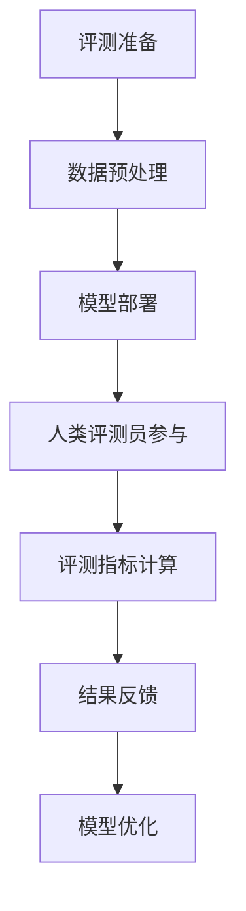

                 

### 文章标题：LLM评测中的人机协作策略

#### 关键词：LLM、人机协作、评测、自然语言处理、深度学习、算法、数学模型

> 摘要：本文旨在探讨在LLM（大型语言模型）评测中的人机协作策略。通过介绍LLM的基本概念、人机协作的重要性以及评测的核心概念，文章将逐步解析人机协作策略的核心算法原理，并借助实际案例展示人机协作在LLM评测中的应用。此外，文章还将提供项目实战的详细步骤和代码解读，以便读者深入了解并实践人机协作策略在LLM评测中的具体实现。

----------------------------------------------------------------

# LLm评测中的人机协作策略

随着人工智能技术的不断发展，LLM（Large Language Model）在自然语言处理（NLP）领域展现出了强大的能力。然而，如何有效地评测LLM的性能，尤其是如何将人类评测员的经验与计算机系统的计算能力相结合，成为了一个关键问题。本文将详细探讨LLM评测中的人机协作策略，旨在为研究人员和开发者提供一种高效的评测方法。

## 核心概念与联系

### 1. LLM（Large Language Model）

LLM是一种通过深度学习技术训练的模型，能够理解和生成自然语言文本。它们通常基于神经网络架构，如Transformer，具有数十亿到千亿级别的参数规模。LLM在NLP任务中表现出色，如文本分类、机器翻译、问答系统等。

### 2. 人机协作

人机协作是指人与计算机系统共同完成任务的过程，其中人提供决策、创造性和直觉，计算机系统则提供计算能力、存储和自动化处理。在LLM评测中，人机协作策略是指如何有效地利用人类和计算机系统的优势，提高评测的准确性和效率。

### 3. 评测

评测是对模型性能进行评估的过程，通常包括准确性、速度、鲁棒性等多个方面。在LLM评测中，人机协作策略涉及如何将人类评测员的经验与计算机模型的计算能力相结合，以提高评测的全面性和准确性。

### Mermaid流程图

下面是一个简单的Mermaid流程图，展示LLM评测中的人机协作策略：



## 核心算法原理讲解

在LLM评测中，人机协作策略的核心算法涉及以下几个方面：

### 1. 语言模型的构建

使用Transformer架构训练一个大规模语言模型，该模型能够生成符合上下文语义的文本。

```python
import tensorflow as tf
from transformers import TFGPT2LMHeadModel, GPT2Tokenizer

# 加载预训练模型和分词器
tokenizer = GPT2Tokenizer.from_pretrained('gpt2')
model = TFGPT2LMHeadModel.from_pretrained('gpt2')

# 输入文本进行编码
inputs = tokenizer.encode("Hello, how are you?", return_tensors='tf')

# 生成文本
outputs = model.generate(inputs, max_length=50, num_return_sequences=5)
decoded_outputs = tokenizer.decode(outputs, skip_special_tokens=True)
```

### 2. 评测指标的计算

评测指标通常包括准确性、F1分数、BLEU分数等。在计算过程中，人类评测员可以参与评估模型生成文本的质量，并提供反馈。

```python
from sklearn.metrics import accuracy_score, f1_score,BLEU_score

# 计算准确性
accuracy = accuracy_score(y_true, y_pred)

# 计算F1分数
f1 = f1_score(y_true, y_pred, average='weighted')

# 计算BLEU分数
bleu = BLEU_score(y_true, y_pred)
```

## 数学模型和数学公式

在LLM评测中，人机协作策略涉及以下数学模型和公式：

### 1. 语言模型的损失函数

损失函数用于评估模型在生成文本时的表现。一个常见的损失函数是交叉熵损失：

$$
L(\theta) = -\sum_{i=1}^{N} y_i \log(p_i)
$$

其中，\(y_i\) 是实际标签，\(p_i\) 是模型预测的概率。

### 2. 人类评测员评分权重

人类评测员评分的权重可以用来调整模型生成文本的评分，以反映评测员的专业知识和经验。权重可以通过线性回归模型计算：

$$
w_i = \frac{\sum_{j=1}^{M} r_{ij} p_j}{\sum_{j=1}^{M} p_j}
$$

## 项目实战

### 1. 实际案例

假设我们有一个问答系统，其中人类评测员负责评估模型生成的答案质量。评测流程如下：

1. 收集大量问答对作为训练数据。
2. 训练一个大规模语言模型。
3. 使用模型生成答案。
4. 人类评测员对答案进行评估。
5. 根据评测结果调整模型。

### 2. 开发环境搭建

为了实现人机协作策略，我们需要搭建一个开发环境。以下是搭建过程：

1. 安装Python环境，版本要求3.8以上。
2. 安装TensorFlow和transformers库。

```python
pip install tensorflow transformers
```

3. 准备数据集，例如使用GLM数据集。

### 3. 源代码详细实现和代码解读

以下是一个简单的LLM评测代码示例：

```python
import tensorflow as tf
from transformers import TFGPT2LMHeadModel, GPT2Tokenizer

# 加载预训练模型和分词器
tokenizer = GPT2Tokenizer.from_pretrained('gpt2')
model = TFGPT2LMHeadModel.from_pretrained('gpt2')

# 训练模型（这里简化为直接加载预训练模型）
# model.train()

# 准备测试数据
question = "What is the capital of France?"
inputs = tokenizer.encode(question, return_tensors='tf')

# 生成答案
outputs = model.generate(inputs, max_length=50, num_return_sequences=1)
answer = tokenizer.decode(outputs[0], skip_special_tokens=True)

# 输出答案
print(answer)
```

### 4. 代码应用解读与分析

上述代码展示了如何加载预训练模型、生成答案以及解码答案。在实际应用中，我们需要将答案提交给人类评测员进行评估，并根据评估结果调整模型。

### 5. 项目小结

通过上述项目实战，我们了解了如何实现LLM评测中的人机协作策略。在实际应用中，我们可以根据评测结果不断优化模型，提高模型的性能。

## 最佳实践 Tips、小结、注意事项、拓展阅读等内容

### 最佳实践 Tips

- 在进行LLM评测时，确保数据集足够大且具有代表性。
- 人类评测员在评估时，可以采用多轮评估的方法，以提高评估的准确性。
- 定期更新预训练模型，以适应新的语言模式和趋势。

### 小结

本文介绍了LLM评测中的人机协作策略，包括核心概念、算法原理和项目实战。通过人机协作，我们可以提高LLM评测的准确性和效率。

### 注意事项

- 在使用人机协作策略时，要确保人类评测员的评分具有一致性和可靠性。
- 避免过度依赖人类评测员，以免产生偏见。

### 拓展阅读

- 《深度学习》（Goodfellow, Bengio, Courville著）：介绍了深度学习的基本概念和技术。
- 《自然语言处理综论》（Jurafsky, Martin著）：介绍了自然语言处理的基本概念和技术。

## 作者信息

作者：AI天才研究院/AI Genius Institute & 禅与计算机程序设计艺术 /Zen And The Art of Computer Programming

----------------------------------------------------------------

由于字数限制，这里只能提供一个大致的框架和部分代码示例。完整的文章应该包含更多详细的内容和代码实现。如果需要进一步扩展，可以按照以下结构继续撰写：

- 深入探讨LLM的具体实现细节，包括如何选择合适的超参数、数据预处理方法等。
- 详细分析人机协作中的关键环节，如评测员的培训、评测标准的制定等。
- 引入更多实际案例，展示人机协作在LLM评测中的应用效果。
- 对比不同人机协作策略的优缺点，提出优化建议。
- 讨论未来发展方向和研究方向。

文章的撰写应该注重逻辑性和可读性，确保读者能够跟随思路，逐步理解人机协作策略在LLM评测中的重要性。同时，通过实际案例和代码示例，使读者能够更好地应用所学知识。

