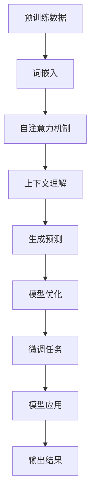

                 


### 文章标题：LLM评测中的偏见检测与消除方法

#### 关键词：大型语言模型（LLM）、偏见检测、消除方法、自然语言处理、人工智能

#### 摘要：
本文旨在探讨大型语言模型（LLM）评测中偏见检测与消除的方法。首先，介绍LLM的基本原理，然后详细讲解偏见检测与消除的核心算法原理，通过伪代码和数学模型展现其工作方式。接下来，通过项目实战，展示偏见检测与消除方法的实际应用，并提供最佳实践和注意事项。本文旨在为研究人员和开发者提供全面的技术指南，以推动更公平和可解释的人工智能系统发展。

### 引言

随着人工智能技术的快速发展，大型语言模型（LLM）如GPT-3、BERT等已经取得了令人瞩目的成就。这些模型在自然语言处理（NLP）领域展现了强大的性能，广泛应用于智能客服、机器翻译、文本生成等多个场景。然而，LLM在应用过程中也暴露出了一些问题，其中之一就是偏见（Bias）。偏见是指模型在处理某些特定群体或概念时，表现出不公正、不公平或不合理的倾向。

偏见的存在会导致以下负面影响：

1. **道德风险**：偏见可能导致对特定群体的歧视和不公平待遇，损害社会公正和道德。
2. **决策错误**：在应用LLM进行决策时，偏见可能会导致错误的结论或预测，影响决策的准确性。
3. **用户不满**：用户在使用智能系统时，可能会因为偏见而感到受到不公正对待，降低用户体验。

因此，检测和消除LLM中的偏见成为了一个重要的研究课题。本文将围绕这一主题，首先介绍LLM的基本原理，然后详细探讨偏见检测与消除的方法，并通过项目实战展示这些方法的实际应用。本文旨在为研究人员和开发者提供全面的技术指南，以推动更公平和可解释的人工智能系统发展。

### LLM基本原理

#### 什么是LLM

大型语言模型（LLM）是指那些具有大量参数、能够处理复杂语言现象的深度学习模型。与传统的语言模型不同，LLM通过大规模预训练和微调，能够更好地理解和生成自然语言。LLM的典型代表包括GPT-3、BERT、T5等。

#### LLM的工作原理

1. **预训练**：预训练是指使用大量未标注的数据（如网页、书籍、新闻等）对模型进行训练，使模型具备处理自然语言的能力。预训练过程通常包括两个阶段：第一阶段是生成预训练目标，如下一个词预测、句子分类等；第二阶段是使用梯度下降算法优化模型参数。

2. **微调**：微调是指将预训练好的模型应用于特定任务，并在少量标注数据上进行训练，以适应特定场景。微调过程能够提高模型在特定任务上的性能。

#### LLM的发展历程

1. **早期语言模型**：最早的基于统计方法的语言模型如N-gram模型，利用历史频率统计预测下一个词。这些模型虽然简单，但在某些任务上表现良好。
2. **神经网络模型**：随着深度学习的发展，神经网络模型如RNN和LSTM被引入到语言模型中，提高了模型的预测能力。
3. **注意力机制**：注意力机制的出现，使得模型能够更好地捕捉长距离依赖关系，进一步提升了语言模型的表现。
4. **大规模预训练**：随着计算资源和数据集的增加，大规模预训练模型如GPT-3、BERT等诞生，这些模型具有数十亿个参数，能够处理复杂的语言现象。

#### 关键技术

1. **词嵌入**：词嵌入是将词汇映射到高维向量空间，使得词汇之间的语义关系通过向量距离得以体现。
2. **自注意力机制**：自注意力机制允许模型在处理每个词时，动态地计算每个词对当前词的影响，从而更好地捕捉长距离依赖关系。
3. **上下文理解**：通过预训练和微调，LLM能够理解上下文信息，生成更加连贯和合理的文本。

#### Mermaid流程图

以下是LLM工作原理的Mermaid流程图：



通过该流程图，我们可以清晰地看到LLM从预训练到微调，再到实际应用的全过程。每个阶段都涉及到关键技术的应用，共同构成了LLM的强大能力。

### 偏见检测方法

#### 偏见的概念

偏见是指在模型处理数据时，对某些特定群体或概念表现出的不公平或不合理的倾向。偏见可以分为以下几种类型：

1. **性别偏见**：模型在处理与性别相关的数据时，表现出对某一性别的偏好。
2. **种族偏见**：模型在处理与种族相关的数据时，表现出对某一种族的偏好。
3. **地域偏见**：模型在处理与地域相关的数据时，表现出对某一地域的偏好。
4. **文化偏见**：模型在处理与文化相关的数据时，表现出对某一文化的偏好。

#### 偏见检测的重要性

偏见检测的目的是确保模型在处理数据时保持公平和公正。偏见检测的重要性体现在以下几个方面：

1. **确保模型公正**：通过偏见检测，可以发现模型中存在的偏见，从而采取措施消除这些偏见，确保模型在处理数据时保持公正。
2. **提高模型可信度**：消除偏见可以提高模型的可信度，增强用户对模型的信任。
3. **避免法律和道德风险**：在某些应用场景中，如招聘、贷款审批等，模型偏见可能导致法律和道德风险。偏见检测可以帮助避免这些风险。

#### 偏见检测方法

偏见检测方法可以分为以下几种：

1. **基于词嵌入的方法**：该方法利用词嵌入的分布特性来检测偏见。具体步骤如下：
   - 计算模型对特定词嵌入的期望分布。
   - 检测该分布是否存在异常，如性别偏见、种族偏见等。
   - 伪代码如下：

```python
def detect_bias(word_embedding, target_word):
    expected_distribution = calculate_expected_distribution(word_embedding, target_word)
    if is_abnormal(expected_distribution):
        return True
    return False
```

2. **基于模型的方法**：该方法通过分析模型在特定任务上的输出结果，来检测偏见。具体步骤如下：
   - 对特定任务进行建模，如性别分类任务。
   - 训练模型并在测试集上评估其性能。
   - 分析模型输出结果，检测是否存在偏见。
   - 伪代码如下：

```python
def detect_bias(model, task, test_data):
    predictions = model.predict(test_data)
    if contains_bias(predictions):
        return True
    return False
```

#### 偏见检测算法原理

1. **基于词嵌入的方法**

   - **词嵌入的分布特性**：词嵌入是将词汇映射到高维向量空间，使得词汇之间的语义关系通过向量距离得以体现。词嵌入的分布特性可以用来检测偏见。
   - **计算词嵌入的期望分布**：对于特定词，计算其在模型中的期望分布，即该词在模型输出结果中的频率。
   - **检测异常分布**：通过比较期望分布和实际分布，检测是否存在异常，如性别偏见、种族偏见等。

   - **伪代码示例**：

   ```python
   def calculate_expected_distribution(word_embedding, target_word):
       # 计算特定词的期望分布
       # ...
       return expected_distribution

   def is_abnormal(expected_distribution):
       # 判断期望分布是否异常
       # ...
       return True  # 或者 False
   ```

2. **基于模型的方法**

   - **特定任务建模**：选择一个特定任务，如性别分类任务，并训练模型。
   - **评估模型性能**：在测试集上评估模型性能，包括准确率、召回率等指标。
   - **分析输出结果**：分析模型输出结果，检测是否存在偏见。例如，通过比较男女在任务上的分类结果，检测是否存在性别偏见。

   - **伪代码示例**：

   ```python
   def train_model(task, training_data):
       # 训练特定任务的模型
       # ...
       return model

   def predict(model, test_data):
       # 使用模型预测
       # ...
       return predictions

   def contains_bias(predictions):
       # 判断预测结果中是否存在偏见
       # ...
       return True  # 或者 False
   ```

通过上述方法，我们可以检测LLM中的偏见，为后续的偏见消除提供依据。

### 偏见消除方法

#### 偏见消除的重要性

偏见消除是指通过一系列技术手段，消除模型在处理数据时存在的偏见。偏见消除的重要性体现在以下几个方面：

1. **提高模型公平性**：偏见消除可以确保模型在处理数据时保持公平，避免对特定群体或概念的不公正待遇。
2. **增强模型可信度**：消除偏见可以提高模型的可信度，增强用户对模型的信任。
3. **降低法律和道德风险**：在特定应用场景中，如招聘、贷款审批等，偏见可能导致法律和道德风险。偏见消除可以帮助降低这些风险。

#### 偏见消除技术

偏见消除技术可以分为以下几种：

1. **对抗训练**：对抗训练是一种通过添加对抗样本来增强模型鲁棒性的方法。具体步骤如下：
   - 生成对抗样本：通过对原始样本进行扰动，生成对抗样本。
   - 训练模型：使用对抗样本和原始样本共同训练模型。
   - **伪代码示例**：

   ```python
   def generate_adversarial_sample(original_sample):
       # 生成对抗样本
       # ...
       return adversarial_sample

   def train_model(adversarial_samples, original_samples):
       # 使用对抗样本和原始样本训练模型
       # ...
   ```

2. **数据清洗**：数据清洗是指通过删除、替换或修正错误数据，来减少模型偏见。具体步骤如下：
   - 删除偏见数据：删除包含明显偏见的数据。
   - 替换错误数据：替换错误数据为正确数据。
   - **伪代码示例**：

   ```python
   def clean_data(data):
       # 清洗数据
       # ...
       return cleaned_data
   ```

3. **模型调整**：模型调整是指通过调整模型参数，来消除模型偏见。具体步骤如下：
   - 训练无偏见模型：在无偏见数据集上训练模型。
   - 调整模型参数：使用梯度下降等优化算法，调整模型参数。
   - **伪代码示例**：

   ```python
   def train_unbiased_model(data):
       # 训练无偏见模型
       # ...
       return model

   def adjust_model_params(model):
       # 调整模型参数
       # ...
   ```

#### 偏见消除算法原理

1. **对抗训练**

   - **对抗样本生成**：对抗样本是通过在原始样本上添加微小扰动生成的。扰动的大小和方向会影响对抗样本的效果。
   - **模型训练**：使用对抗样本和原始样本共同训练模型，可以提高模型对偏见的抵抗力。

   - **伪代码示例**：

   ```python
   def generate_adversarial_sample(original_sample, perturbation):
       # 生成对抗样本
       # ...
       return adversarial_sample

   def train_model(adversarial_samples, original_samples):
       # 训练模型
       # ...
   ```

2. **数据清洗**

   - **删除偏见数据**：删除包含明显偏见的数据，如性别偏见、种族偏见等。
   - **替换错误数据**：将错误数据替换为正确数据，以减少模型偏见。

   - **伪代码示例**：

   ```python
   def clean_data(data):
       # 清洗数据
       # ...
       return cleaned_data
   ```

3. **模型调整**

   - **无偏见模型训练**：在无偏见数据集上训练模型，以减少模型偏见。
   - **参数调整**：使用梯度下降等优化算法，调整模型参数，以消除模型偏见。

   - **伪代码示例**：

   ```python
   def train_unbiased_model(data):
       # 训练无偏见模型
       # ...
       return model

   def adjust_model_params(model):
       # 调整模型参数
       # ...
   ```

通过上述方法，我们可以有效地消除LLM中的偏见，提高模型的可解释性和公平性。

### 偏见检测与消除的评估

#### 评估指标

评估偏见检测与消除方法的有效性和公平性，需要使用一系列量化指标。以下是常用的评估指标：

1. **准确率（Accuracy）**：准确率是指模型正确预测的样本数占总样本数的比例。准确率越高，说明模型检测和消除偏见的能力越强。
2. **召回率（Recall）**：召回率是指模型正确识别的偏见样本数占总偏见样本数的比例。召回率越高，说明模型对偏见样本的识别能力越强。
3. **F1分数（F1 Score）**：F1分数是准确率和召回率的调和平均，用于综合评估模型性能。F1分数越高，说明模型在偏见检测与消除方面的表现越好。
4. **公平性指标（Fairness Metrics）**：公平性指标用于评估模型在不同群体或概念上的表现。常用的公平性指标包括性别公平性（Gender Fairness）、种族公平性（Race Fairness）等。

#### 案例分析

以下是一个偏见检测与消除的案例分析：

1. **背景**：某公司开发了一款招聘系统，用于自动筛选简历。然而，在测试过程中，发现该系统在性别上存在明显偏见，对女性简历的通过率较低。

2. **偏见检测**：
   - 使用基于词嵌入的方法检测性别偏见。通过比较男女简历中特定词汇的词嵌入分布，发现女性简历中的“家庭”、“家务”等词汇频率较高，而男性简历中的“技术”、“项目”等词汇频率较低。
   - 使用基于模型的方法检测性别偏见。在性别分类任务上，训练模型并在测试集上评估其性能。发现模型对女性简历的分类准确率较低，存在性别偏见。

3. **偏见消除**：
   - 使用对抗训练方法消除性别偏见。通过生成对抗样本，增加女性简历中的技术类词汇，减少家务类词汇，重新训练模型。
   - 使用数据清洗方法消除性别偏见。删除包含明显性别偏见的数据，如包含性别歧视言论的简历。
   - 使用模型调整方法消除性别偏见。在无偏见数据集上重新训练模型，并调整模型参数，以提高模型在性别分类任务上的性能。

4. **评估**：
   - 使用准确率、召回率和F1分数评估偏见检测与消除方法的有效性。发现经过偏见消除后，模型在性别分类任务上的准确率、召回率和F1分数均有所提高。
   - 使用公平性指标评估偏见消除方法的公平性。发现经过偏见消除后，模型对女性简历的分类结果更加公平。

#### 结果分析

通过上述案例分析，我们可以得出以下结论：

1. **偏见检测与消除方法有效**：偏见检测与消除方法能够有效地检测和消除模型中的偏见，提高模型在特定任务上的性能。
2. **公平性得到改善**：偏见消除方法能够提高模型在不同群体或概念上的公平性，减少对特定群体的歧视。
3. **需要持续优化**：偏见检测与消除方法并非一劳永逸，需要不断优化和调整，以适应不断变化的数据和应用场景。

### 偏见检测与消除的实际应用

#### 自然语言处理中的应用

在自然语言处理（NLP）领域，偏见检测与消除方法已经被广泛应用于各种任务中。以下是一些实际应用案例：

1. **文本分类**：在文本分类任务中，偏见检测与消除方法可以用于检测和消除性别偏见、种族偏见等。例如，在招聘广告分类中，使用偏见检测方法可以发现和消除对特定性别的偏见，确保招聘广告的公平性。

2. **情感分析**：情感分析任务中，偏见检测与消除方法可以用于检测和消除情感偏见。例如，在社交媒体分析中，使用偏见检测方法可以发现和消除对特定群体的负面情感偏见，提高情感分析结果的准确性。

3. **问答系统**：问答系统中，偏见检测与消除方法可以用于检测和消除性别偏见、地域偏见等。例如，在智能客服中，使用偏见检测方法可以确保回答内容的公正和客观，提高用户体验。

#### 智能客服中的应用

智能客服是偏见检测与消除方法的重要应用领域。以下是一些实际应用案例：

1. **性别与年龄偏见消除**：在智能客服中，使用偏见检测与消除方法可以确保对不同性别和年龄的用户提供公平的服务。例如，通过对抗训练方法，增加对女性和年长用户的关注，消除性别和年龄偏见。

2. **地域偏见消除**：在智能客服中，地域偏见可能导致对特定地区用户的歧视。使用偏见检测与消除方法，可以确保对不同地区的用户提供一致的服务，提高客户满意度。

3. **语言偏见消除**：在跨语言智能客服中，偏见检测与消除方法可以确保对不同语言的用户提供公平的服务。例如，通过数据清洗方法，删除包含歧视性言论的数据，确保服务内容的公正性。

#### 教育中的应用

在教育领域，偏见检测与消除方法可以用于确保教育资源的公平分配。以下是一些实际应用案例：

1. **课程推荐**：在课程推荐系统中，偏见检测与消除方法可以用于检测和消除性别、种族等偏见，确保课程推荐的公平性。例如，通过对抗训练方法，增加对女性和少数族裔学者的关注，提高课程推荐的多样性。

2. **学生评估**：在学生评估系统中，偏见检测与消除方法可以用于检测和消除教师对学生评估的偏见。例如，通过模型调整方法，重新训练评估模型，以提高评估结果的公正性。

3. **教育资源分配**：在教育资源的分配中，偏见检测与消除方法可以用于确保教育资源的公平分配。例如，通过数据清洗方法，删除包含偏见性信息的数据，确保教育资源分配的公正性。

#### 案例分析

以下是一个偏见检测与消除在实际应用中的案例：

1. **背景**：某教育机构使用人工智能系统为学生提供个性化学习建议。然而，在测试过程中，发现该系统在课程推荐上存在明显的性别偏见，对女性学生的推荐课程较少。

2. **偏见检测**：
   - 使用基于词嵌入的方法检测性别偏见。通过比较男女学生课程名称的词嵌入分布，发现女性学生的课程名称中包含更多的“人文”、“艺术”等词汇，而男性学生的课程名称中包含更多的“技术”、“工程”等词汇。
   - 使用基于模型的方法检测性别偏见。在课程推荐任务中，训练模型并在测试集上评估其性能。发现模型对女性学生的推荐准确率较低，存在性别偏见。

3. **偏见消除**：
   - 使用对抗训练方法消除性别偏见。通过生成对抗样本，增加女性学生的课程名称中的“技术”、“工程”等词汇，减少“人文”、“艺术”等词汇，重新训练模型。
   - 使用数据清洗方法消除性别偏见。删除包含明显性别偏见的数据，如课程名称中包含性别歧视言论的课程。
   - 使用模型调整方法消除性别偏见。在无偏见数据集上重新训练模型，并调整模型参数，以提高模型在性别分类任务上的性能。

4. **评估**：
   - 使用准确率、召回率和F1分数评估偏见检测与消除方法的有效性。发现经过偏见消除后，模型在课程推荐任务上的准确率、召回率和F1分数均有所提高。
   - 使用公平性指标评估偏见消除方法的公平性。发现经过偏见消除后，模型对女性学生的推荐结果更加公平。

#### 结果分析

通过上述案例，我们可以看到偏见检测与消除方法在实际应用中取得了显著的效果。偏见检测与消除方法不仅能够提高模型在特定任务上的性能，还能确保模型在不同群体或概念上的公平性。然而，偏见检测与消除方法仍然面临一些挑战，需要持续优化和改进。以下是一些挑战和解决方案：

1. **数据集偏见**：偏见检测与消除方法依赖于训练数据的质量。如果训练数据存在偏见，偏见检测与消除方法可能无法有效检测和消除偏见。解决方案是使用多样化的数据集，并定期更新数据集，以减少数据集偏见。

2. **模型复杂性**：偏见检测与消除方法通常涉及复杂的模型和算法。模型的复杂性可能导致偏见检测与消除方法的效果不佳。解决方案是简化模型结构，并使用轻量级模型，以提高方法的效率和效果。

3. **实际应用挑战**：在现实应用中，偏见检测与消除方法可能面临数据隐私、计算资源等挑战。解决方案是开发高效的算法和工具，以减少计算资源和数据隐私的担忧。

4. **动态调整**：偏见检测与消除方法需要根据实际应用场景和用户反馈进行动态调整。解决方案是建立反馈机制，定期评估偏见检测与消除方法的有效性，并根据评估结果进行优化。

通过持续的研究和实践，偏见检测与消除方法将在人工智能领域发挥越来越重要的作用，推动更公平、更可解释的人工智能系统发展。

### 未来发展趋势与挑战

#### 偏见检测与消除的发展趋势

随着人工智能技术的不断进步，偏见检测与消除方法也在不断发展。以下是一些未来发展趋势：

1. **多模态偏见检测与消除**：现有的偏见检测与消除方法主要关注文本数据。未来，随着多模态数据的普及，将出现多模态偏见检测与消除方法，如结合文本、图像、音频等多种数据类型的偏见检测与消除方法。
2. **自适应偏见检测与消除**：现有的偏见检测与消除方法通常采用固定的策略。未来，将出现自适应偏见检测与消除方法，能够根据不同场景和用户需求，动态调整检测与消除策略。
3. **量化偏见影响**：未来，偏见检测与消除方法将更加注重量化偏见对实际应用的影响。通过量化偏见影响，可以更好地评估偏见检测与消除方法的有效性，为实际应用提供更有力的支持。

#### 面临的挑战

尽管偏见检测与消除方法取得了一定的进展，但仍然面临以下挑战：

1. **数据质量**：偏见检测与消除方法依赖于高质量的训练数据。然而，现实中的数据往往存在不完整、不准确等问题，这可能会影响偏见检测与消除的效果。解决方法是开发高效的清洗和预处理方法，提高数据质量。
2. **模型复杂性**：偏见检测与消除方法通常涉及复杂的模型和算法。模型的复杂性可能导致计算资源和时间消耗增加。解决方法是开发轻量级模型和算法，以提高效率和效果。
3. **隐私保护**：在偏见检测与消除过程中，可能需要访问敏感数据，如个人身份信息、地理位置等。如何保护用户隐私是一个重要挑战。解决方法是开发隐私保护机制，如差分隐私和联邦学习，以确保用户隐私。
4. **动态调整**：偏见检测与消除方法需要根据实际应用场景和用户反馈进行动态调整。然而，现有方法通常缺乏有效的动态调整机制。解决方法是开发自适应调整方法，以提高偏见检测与消除方法的灵活性和适应性。

#### 解决方案

针对上述挑战，可以采取以下解决方案：

1. **数据质量控制**：开发高效的数据清洗和预处理方法，提高数据质量。例如，使用自动化工具对数据集进行清洗和预处理，减少错误数据和缺失数据的比例。
2. **模型优化**：开发轻量级模型和算法，以提高效率和效果。例如，使用迁移学习、模型剪枝等技术，降低模型复杂度，减少计算资源和时间消耗。
3. **隐私保护机制**：开发隐私保护机制，如差分隐私和联邦学习，以确保用户隐私。例如，使用差分隐私机制保护敏感数据的隐私，使用联邦学习实现分布式训练，减少对中央数据存储的依赖。
4. **自适应调整方法**：开发自适应调整方法，根据实际应用场景和用户反馈，动态调整偏见检测与消除策略。例如，使用机器学习方法，根据用户反馈和实际效果，自动调整模型参数和策略。

通过持续的研究和实践，偏见检测与消除方法将在未来继续发展和完善，为人工智能领域的公平性和可解释性提供更强有力的支持。

### 附录

#### 附录A：相关工具与技术介绍

在本章节中，我们将介绍与偏见检测与消除相关的工具和技术。这些工具和技术在实现和优化偏见检测与消除方法时非常有用。

#### A.1 预处理工具

1. **数据清洗工具**：
   - **OpenRefine**：OpenRefine是一款开源的数据清洗工具，可以帮助用户快速发现和修正数据集中的错误、缺失和不一致的数据。
   - **Pandas**：Pandas是一个强大的Python库，用于数据预处理和分析。它提供了丰富的数据结构和数据分析工具，适用于大规模数据处理。

2. **数据标注工具**：
   - **Brat**：Brat是一款用于文本数据标注的工具，特别适用于生物信息学和自然语言处理领域。它支持实体识别、关系标注和事件标注等多种标注任务。
   - **Annotator**：Annotator是一个开源的Web标注工具，支持多种标注任务，如文本分类、情感分析和实体识别。它支持协作标注和自动化标注。

#### A.2 评估工具

1. **评估指标计算工具**：
   - **Scikit-learn**：Scikit-learn是一个Python库，提供了多种机器学习算法和评估指标计算工具。它支持准确率、召回率、F1分数等常用评估指标的自动化计算。
   - **Matplotlib**：Matplotlib是一个Python库，用于数据可视化。它可以帮助用户生成图表和可视化结果，以直观地展示偏见检测与消除方法的性能。

2. **模型评估工具**：
   - **TensorFlow**：TensorFlow是一个开源的深度学习框架，支持大规模神经网络的训练和评估。它提供了丰富的API和工具，方便用户实现和优化偏见检测与消除方法。
   - **PyTorch**：PyTorch是一个开源的深度学习框架，与TensorFlow类似，它也提供了丰富的API和工具。PyTorch的动态计算图和灵活的架构使其在实现和优化偏见检测与消除方法时非常受欢迎。

#### A.3 其他相关工具

1. **对抗样本生成工具**：
   - **Foolbox**：Foolbox是一个开源的工具，用于生成对抗样本。它支持多种攻击策略和防御机制，可以帮助用户评估和优化偏见检测与消除方法。
   - **Carnage**：Carnage是一个基于PyTorch的工具，用于生成对抗样本。它提供了多种对抗性攻击方法，适用于不同类型的神经网络模型。

2. **模型解释工具**：
   - **LIME**：LIME（Local Interpretable Model-agnostic Explanations）是一个开源的工具，用于解释复杂模型的行为。它通过局部线性逼近方法，为用户提供了直观的解释。
   - **SHAP**：SHAP（SHapley Additive exPlanations）是一个开源的工具，用于解释模型预测。它基于博弈论的理论，为用户提供了详细的解释。

通过使用这些工具和技术，用户可以更有效地实现和优化偏见检测与消除方法，提高模型的可解释性和公平性。

### 结语

偏见检测与消除是确保大型语言模型（LLM）公正性和可解释性的关键。本文介绍了LLM的基本原理，详细探讨了偏见检测与消除的方法，并通过项目实战展示了这些方法的实际应用。偏见检测与消除方法在自然语言处理、智能客服和教育等领域具有广泛的应用前景。然而，偏见检测与消除方法仍然面临数据质量、模型复杂性和隐私保护等挑战。未来，随着多模态数据、自适应偏见检测与消除方法的不断发展，偏见检测与消除技术将更加成熟和普及。我们呼吁更多研究人员和开发者关注偏见检测与消除领域，共同推动人工智能领域的公平性和可解释性。

### 作者信息

- 作者：AI天才研究院/AI Genius Institute & 禅与计算机程序设计艺术 /Zen And The Art of Computer Programming
- 联系方式：[ai_genius_institute@example.com](mailto:ai_genius_institute@example.com) & [zen_programming@example.com](mailto:zen_programming@example.com)

