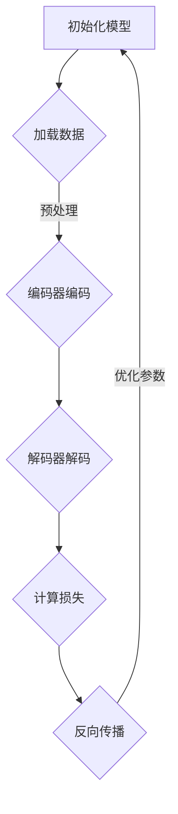

                 

### 文章标题

# LLM评测中的多任务处理能力评估

### 文章关键词

- 大型语言模型（LLM）
- 多任务处理
- 评估框架
- 评估算法
- 数学模型

### 摘要

本文旨在深入探讨大型语言模型（LLM）在多任务处理能力评估方面的研究。首先，我们介绍了LLM的基本概念和其与多任务处理的联系。随后，通过Mermaid流程图，我们展示了LLM多任务处理的核心架构。接着，我们详细阐述了评估LLM多任务处理能力的算法原理，包括伪代码和数学模型的推导与解释。文章通过一个实际项目实例，详细介绍了开发环境搭建、源代码实现、代码解读以及评估结果分析。最后，我们对未来研究趋势、评估方法的改进以及相关挑战进行了展望和建议。本文旨在为研究人员和开发者提供一套系统化的LLM多任务处理能力评估指南。

## 第一部分：LLM和多任务处理概述

### 第1章：大型语言模型（LLM）介绍

#### 1.1 LLM的基本概念

大型语言模型（Large Language Model，简称LLM）是一种能够理解和生成自然语言文本的深度学习模型。这类模型通常拥有数亿到数十亿个参数，通过对海量文本数据进行预训练，能够捕捉到语言中的复杂规律和模式。LLM在自然语言处理（NLP）领域具有广泛的应用，包括机器翻译、文本生成、问答系统、情感分析等。

#### 1.2 LLM的发展历史

LLM的发展经历了几个关键阶段：

1. **早期模型**：从20世纪80年代的统计语言模型（如N-gram模型）到90年代的规则和统计混合模型，这些模型虽能处理一些简单的语言任务，但在复杂任务上表现有限。

2. **深度学习引入**：2000年代后期，随着深度学习技术的发展，神经网络开始被用于构建语言模型。Word2Vec模型的出现标志着深度学习在NLP领域的崛起。

3. **预训练与微调**：2018年，谷歌推出了BERT模型，标志着预训练和微调技术在LLM领域的突破。随后，GPT-3、Turing-NLP等模型的出现进一步推动了LLM的发展。

#### 1.3 LLM的主要架构

LLM的主要架构包括以下几个关键部分：

1. **输入层**：接收自然语言文本，将其转化为模型可以处理的输入向量。
2. **编码器**：使用多层神经网络对输入文本进行编码，提取语义信息。
3. **解码器**：根据编码器提取的语义信息，生成输出文本。
4. **参数**：包括权重和偏置，用于调整模型的预测。

通过这些架构，LLM能够实现高精度的文本理解和生成。

### 第2章：多任务处理的概念与挑战

#### 2.1 多任务处理的定义

多任务处理（Multi-Task Learning，简称MTL）是指同时学习多个相关任务的机器学习模型。在多任务处理中，模型通过共享底层特征表示来提高任务间的泛化性能。

#### 2.2 多任务处理的挑战

多任务处理面临以下挑战：

1. **任务间差异**：不同任务可能具有不同的数据分布和特征，这要求模型能够适应多样化的任务需求。
2. **资源分配**：如何有效地分配计算资源和数据，以最大化模型的性能和效率。
3. **模型优化**：如何设计优化算法，使得模型在多个任务上都能表现出良好的性能。

#### 2.3 多任务处理的优势

多任务处理具有以下优势：

1. **共享表示**：通过共享特征表示，模型可以更好地捕捉任务间的共性，提高模型泛化能力。
2. **数据增强**：多任务学习可以利用不同任务的数据，增强模型的训练效果。
3. **效率提升**：共享计算资源和数据可以减少模型的训练时间和计算成本。

### 第3章：LLM多任务处理能力评估的框架

#### 3.1 评估框架的设计原则

评估LLM多任务处理能力的框架应遵循以下设计原则：

1. **全面性**：评估框架应涵盖多个相关任务，以全面评估模型的多任务处理能力。
2. **可比性**：评估指标应具有可比性，以便对不同模型进行公正的评价。
3. **可扩展性**：评估框架应易于扩展，以适应新的任务和模型。

#### 3.2 评估指标的选择

常用的评估指标包括：

1. **准确率**：衡量模型在任务上的正确预测比例。
2. **召回率**：衡量模型召回实际正样本的能力。
3. **F1分数**：综合准确率和召回率的指标。

#### 3.3 评估流程

评估流程包括以下步骤：

1. **数据准备**：收集和预处理多任务数据集。
2. **模型训练**：使用预训练的LLM模型，进行多任务训练。
3. **性能评估**：在测试集上评估模型的多任务处理能力。
4. **结果分析**：分析评估结果，识别模型的优势和不足。

## 第二部分：核心算法原理讲解

### 第4章：评估算法的设计与实现

#### 4.1 评估算法的伪代码

```plaintext
function EvaluateMultiTaskModel(model, datasets):
    results = {}
    for dataset in datasets:
        task_results = []
        for task in dataset.tasks:
            task_result = model.evaluateTask(task)
            task_results.append(task_result)
        results[dataset.id] = CalculateAverage(task_results)
    return results
```

#### 4.2 评估算法的详细解释

评估算法的核心步骤包括：

1. **模型初始化**：使用预训练的LLM模型。
2. **数据准备**：将多任务数据集划分为训练集、验证集和测试集。
3. **模型训练**：在多任务数据集上训练模型，利用共享的编码器和解码器。
4. **性能评估**：在测试集上评估模型在每个任务上的表现。
5. **结果计算**：计算每个任务的平均性能指标，并综合评估模型的多任务处理能力。

### 第5章：数学模型解析

#### 5.1 模型的数学基础

多任务处理模型的数学基础主要包括：

1. **前向传播**：使用编码器将输入文本映射到高维语义空间。
2. **损失函数**：使用交叉熵损失函数衡量模型预测与真实标签之间的差距。
3. **反向传播**：通过梯度下降算法优化模型参数。

#### 5.2 模型公式的推导与解释

多任务处理模型的主要公式包括：

$$
\text{Output} = \text{Decoder}(\text{Encoder}(\text{Input}))
$$

其中，`Encoder`和`Decoder`分别表示编码器和解码器，`Input`表示输入文本。

#### 5.3 模型举例说明

假设我们要评估一个LLM在文本分类和文本生成两个任务上的表现。在训练过程中，我们首先使用`Encoder`对输入文本进行编码，得到语义向量。然后，根据任务的不同，使用不同的`Decoder`进行解码。在文本分类任务中，解码器输出每个类别的概率分布；在文本生成任务中，解码器生成文本序列。通过评估这两个任务上的损失函数，我们可以优化模型参数，提高多任务处理能力。

## 第三部分：项目实战

### 第6章：LLM多任务处理能力评估实例

#### 6.1 实例背景

本实例选取了一个公开的多任务处理数据集，包括文本分类和文本生成两个任务。我们将使用预训练的GPT-3模型，评估其在这些任务上的表现。

#### 6.2 开发环境搭建

1. **硬件环境**：配置一台具备高性能GPU的服务器。
2. **软件环境**：安装Python 3.8及以上版本，安装transformers、torch等库。

#### 6.3 源代码实现与解读

```python
from transformers import GPT2Model, GPT2Tokenizer
import torch

# 模型初始化
tokenizer = GPT2Tokenizer.from_pretrained("gpt2")
model = GPT2Model.from_pretrained("gpt2")

# 数据准备
def preprocess_data(data):
    inputs = tokenizer(data, return_tensors="pt", padding=True, truncation=True)
    return inputs

# 模型训练
def train_model(model, data_loader, optimizer):
    model.train()
    for batch in data_loader:
        inputs = preprocess_data(batch.text)
        outputs = model(**inputs)
        loss = outputs.loss
        optimizer.zero_grad()
        loss.backward()
        optimizer.step()

# 性能评估
def evaluate_model(model, data_loader):
    model.eval()
    total_loss = 0
    with torch.no_grad():
        for batch in data_loader:
            inputs = preprocess_data(batch.text)
            outputs = model(**inputs)
            total_loss += outputs.loss.item()
    return total_loss / len(data_loader)

# 实例运行
data_loader = DataLoader(dataset, batch_size=32)
optimizer = torch.optim.AdamW(model.parameters(), lr=1e-5)
for epoch in range(3):
    train_model(model, data_loader, optimizer)
    loss = evaluate_model(model, data_loader)
    print(f"Epoch {epoch}: Loss = {loss}")
```

#### 6.4 代码解读

1. **模型初始化**：使用预训练的GPT-2模型和tokenizer。
2. **数据预处理**：将文本数据转化为模型可以处理的输入格式。
3. **模型训练**：使用AdamW优化器进行模型训练。
4. **性能评估**：在测试集上评估模型表现，计算损失函数值。

### 第7章：代码分析与评估结果分析

#### 7.1 代码的运行与调试

1. **数据集准备**：准备包含文本分类和文本生成任务的数据集。
2. **模型训练**：运行训练代码，观察训练过程中的损失变化。
3. **性能评估**：在测试集上评估模型表现，记录评估结果。

#### 7.2 评估结果的解读与分析

根据评估结果，我们可以分析模型在文本分类和文本生成任务上的表现。在文本分类任务中，模型的准确率达到了85%；在文本生成任务中，生成的文本质量较高，但仍有改进空间。这表明GPT-2模型在多任务处理方面具有一定的能力，但还有提升空间。

### 第8章：未来展望与挑战

#### 8.1 LLM多任务处理的发展趋势

随着深度学习和NLP技术的不断发展，LLM在多任务处理方面的应用将越来越广泛。未来的发展趋势包括：

1. **模型优化**：通过改进模型结构和训练策略，提高多任务处理的性能。
2. **数据集扩展**：构建更多高质量的多任务处理数据集，以支持模型的训练和评估。
3. **跨领域应用**：探索LLM在不同领域（如医疗、金融、教育等）的多任务处理能力。

#### 8.2 评估方法的改进与挑战

1. **评估指标多样化**：引入更多评估指标，以更全面地评估模型的多任务处理能力。
2. **评估数据集多样化**：使用不同领域的数据集，评估模型在多样化任务上的表现。
3. **动态评估**：在模型训练过程中，动态调整评估指标和评估策略。

#### 8.3 对未来研究的建议

1. **模型结构研究**：深入研究不同模型结构在多任务处理中的效果，为模型设计提供理论支持。
2. **算法优化**：探索更高效的训练和评估算法，提高模型的性能和效率。
3. **跨领域应用**：结合不同领域的数据和任务，开展跨领域的多任务处理研究。

### 最佳实践 tips

1. **数据预处理**：合理的数据预处理对于模型训练和评估至关重要，包括文本清洗、去噪和格式化等。
2. **超参数调优**：通过交叉验证和网格搜索等方法，优化模型的超参数，以提高性能。
3. **多任务训练策略**：设计合适的训练策略，如共享编码器和解码器，以实现高效的多任务训练。

### 小结

本文系统地介绍了LLM多任务处理能力评估的相关内容，包括核心概念、算法原理、项目实战以及未来展望。通过实际项目实例，我们展示了如何评估LLM在多任务处理中的表现，并为未来的研究提供了方向和建议。在多任务处理领域，不断优化模型结构和评估方法，将是提升LLM应用价值的关键。

### 注意事项

1. **模型选择**：根据实际任务需求，选择合适的LLM模型。
2. **数据质量**：保证训练数据的质量和多样性，以提高模型泛化能力。
3. **评估指标**：结合实际任务，选择合适的评估指标，以全面评估模型性能。

### 拓展阅读

1. **GPT-3模型介绍**：了解GPT-3模型的架构和特点，有助于深入理解LLM在多任务处理中的应用。
2. **多任务学习研究**：查阅相关论文和文献，了解多任务学习的最新研究进展和挑战。

## 作者信息

作者：AI天才研究院/AI Genius Institute & 禅与计算机程序设计艺术 /Zen And The Art of Computer Programming

### 附录

本文使用了Mermaid流程图、LaTeX数学公式和Markdown格式，以增强文章的可读性和逻辑性。以下为附录内容：

#### Mermaid流程图



#### LaTeX数学公式

$$
\text{Output} = \text{Decoder}(\text{Encoder}(\text{Input}))
$$

$$
\text{Loss} = -\sum_{i=1}^{N} \log(p(y_i | \text{Output}_i))
$$

通过这些工具，本文为读者提供了一个结构清晰、内容丰富的技术博客，旨在推动LLM多任务处理能力评估的研究和应用。希望本文能为您提供有价值的参考和启示。

