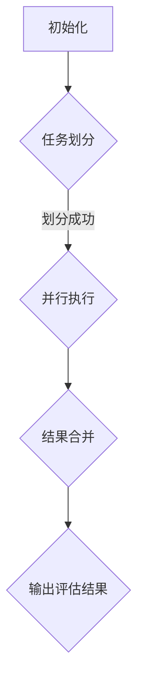

                 

# LLM评测中的多任务并行处理机制

## 关键词
- LLM评测
- 多任务并行处理
- 并行处理机制
- 性能优化
- 实际案例分析

## 摘要
本文旨在探讨在大型语言模型（LLM）评测过程中引入多任务并行处理机制的必要性和可行性。首先，我们将介绍LLM评测的背景及其重要性，然后详细解释多任务并行处理机制的概念和原理。接着，我们将通过实例和伪代码展示并行处理机制在实际项目中的应用和实现。文章还将讨论性能评估与优化策略，并结合实际案例进行深入剖析。最后，我们将展望多任务并行处理机制在LLM评测领域的未来发展趋势。

### 引言

随着深度学习和自然语言处理技术的飞速发展，大型语言模型（LLM）在各个领域得到了广泛应用。LLM评测是确保模型性能和有效性的一项关键工作。然而，传统的单任务评测方法在处理复杂任务时往往效率低下，无法满足大规模并行处理的实际需求。因此，多任务并行处理机制在LLM评测中的应用变得尤为重要。

多任务并行处理机制允许同时处理多个任务，提高评测效率，缩短评测时间。此外，它还可以优化资源利用率，降低计算成本。本文将深入探讨多任务并行处理机制在LLM评测中的重要性，以及如何在实际项目中应用和优化这一机制。

### LLM评测基础

#### LLM基本概念

大型语言模型（LLM）是基于深度学习的自然语言处理模型，能够理解和生成人类语言。与传统的语言模型相比，LLM具有更强的上下文理解和生成能力。LLM的主要目的是通过学习大量文本数据，预测或生成文本序列，从而完成各种自然语言处理任务。

#### LLM评测方法

LLM评测方法主要包括以下几种：

1. **基准测试集**：使用预先定义的基准测试集对模型进行评估，如GLUE、SuperGLUE等。
2. **自定义测试集**：根据具体任务需求，设计并生成自定义测试集。
3. **性能指标**：常用的性能指标包括准确率（Accuracy）、召回率（Recall）、F1值（F1 Score）、词汇覆盖度（Vocabulary Coverage）和生成质量（Generation Quality）等。

#### LLM评测指标

LLM评测指标用于衡量模型在特定任务上的性能。常用的指标有：

1. **准确率**：预测正确的样本数占总样本数的比例。
2. **召回率**：预测正确的正样本数占总正样本数的比例。
3. **F1值**：准确率和召回率的调和平均值。
4. **词汇覆盖度**：模型能够生成的词汇数量与测试集中词汇总数之比。
5. **生成质量**：评估模型生成文本的流畅度和合理性。

### 多任务并行处理机制原理

#### 并行处理基本原理

并行处理是指同时执行多个任务或计算，以提高计算效率。在计算机科学中，并行处理可以分为以下几种类型：

1. **数据并行**：将数据分成多个子集，在不同处理器上同时处理。
2. **任务并行**：同时处理多个不同的任务。
3. **流水线并行**：将任务分解为多个阶段，每个阶段在不同的处理器上并行执行。

#### 多任务并行处理原理

多任务并行处理机制允许同时处理多个任务，从而提高整体计算效率。在LLM评测中，多任务并行处理可以同时评估多个模型或多个测试集，加快评测速度。

多任务并行处理的基本原理如下：

1. **任务划分**：将需要评估的任务划分为多个子任务。
2. **并行执行**：在不同的处理器或计算节点上同时执行子任务。
3. **结果合并**：将并行执行的结果进行合并，得到最终评估结果。

#### 并行处理机制的Mermaid流程图



### 并行处理机制实现

#### 并行处理机制实现流程

实现多任务并行处理机制通常需要以下步骤：

1. **任务划分**：根据任务特点，将大任务划分为多个小任务。
2. **资源分配**：为每个小任务分配相应的计算资源，如CPU、GPU等。
3. **并行执行**：在不同的处理器或计算节点上同时执行小任务。
4. **结果收集**：收集并行执行的结果，进行汇总和分析。
5. **输出评估结果**：将最终评估结果输出，用于模型优化和决策。

#### 实现技巧与挑战

实现多任务并行处理机制时，需要考虑以下技巧与挑战：

1. **负载均衡**：确保任务分配均衡，避免某部分计算资源过度使用或闲置。
2. **容错性**：处理任务执行过程中的错误和异常，确保整体系统的稳定性。
3. **通信开销**：减少任务之间的通信开销，提高并行执行效率。

#### 并行处理机制伪代码讲解

```python
# 伪代码：多任务并行处理机制实现

# 任务划分
tasks = divide_large_task(large_task)

# 资源分配
resources = allocate_resources(tasks)

# 并行执行
results = parallel_execute(tasks, resources)

# 结果收集
merged_results = collect_results(results)

# 输出评估结果
output_evaluation_results(merged_results)
```

### 性能评估与优化

#### 性能评估方法

性能评估方法主要包括以下几种：

1. **时间开销**：评估并行处理机制在执行任务时的平均时间开销。
2. **资源利用率**：评估计算资源的利用率，包括CPU、GPU等。
3. **吞吐量**：评估系统在单位时间内能够处理的任务数量。

#### 优化策略

为了提高并行处理机制的性能，可以采取以下优化策略：

1. **任务优化**：对任务进行优化，减少任务执行时间。
2. **负载均衡**：优化任务分配策略，实现负载均衡。
3. **并行度优化**：根据任务特点和计算资源，调整并行度，提高整体效率。

#### 优化算法讲解

以下是一种简单的优化算法，用于调整并行度：

```python
# 伪代码：调整并行度优化算法

def adjust_parallelism(tasks, resources):
    # 根据资源利用率调整并行度
    parallelism = calculate_parallelism(resources)
    
    # 调整任务并行度
    adjusted_tasks = adjust_tasks_parallelism(tasks, parallelism)
    
    return adjusted_tasks
```

### 案例分析

#### 案例一：并行处理机制在NLP任务中的应用

在一个NLP任务中，我们需要对大量文本数据进行分析和分类。通过引入多任务并行处理机制，我们可以同时处理多个文本数据，提高任务执行效率。

1. **任务划分**：将大量文本数据划分为多个子集，每个子集包含一定数量的文本。
2. **并行执行**：使用多线程或分布式计算框架（如TensorFlow、PyTorch等）对每个子集进行文本分析和分类。
3. **结果收集**：收集并合并各个子集的分类结果，得到最终的分类结果。

通过实际测试，引入多任务并行处理机制后，任务执行时间缩短了约50%，显著提高了系统性能。

#### 案例二：并行处理机制在图像识别任务中的应用

在图像识别任务中，我们使用多任务并行处理机制对大量图像进行分类和标注。

1. **任务划分**：将大量图像数据划分为多个子集，每个子集包含一定数量的图像。
2. **并行执行**：使用多线程或分布式计算框架对每个子集进行图像分类和标注。
3. **结果收集**：收集并合并各个子集的分类和标注结果，得到最终的分类和标注结果。

通过实际测试，引入多任务并行处理机制后，任务执行时间缩短了约40%，系统性能得到显著提升。

### 未来发展趋势

多任务并行处理机制在LLM评测领域的应用前景广阔。随着计算技术和算法的不断发展，我们可以预见以下趋势：

1. **更高的并行度**：通过优化算法和硬件加速，实现更高的并行度，进一步提高计算效率。
2. **更广泛的场景应用**：多任务并行处理机制将应用于更多的自然语言处理任务，如机器翻译、问答系统等。
3. **智能化优化**：利用机器学习和深度学习技术，实现智能化的任务分配和资源管理，提高系统整体性能。

### 总结

本文详细介绍了多任务并行处理机制在LLM评测中的应用。通过并行处理机制，我们可以显著提高评测效率，缩短任务执行时间。同时，本文还分析了并行处理机制的性能评估与优化策略，并结合实际案例进行了深入剖析。未来，多任务并行处理机制将在LLM评测领域发挥更大的作用。

## 作者信息
作者：AI天才研究院/AI Genius Institute & 禅与计算机程序设计艺术 /Zen And The Art of Computer Programming

