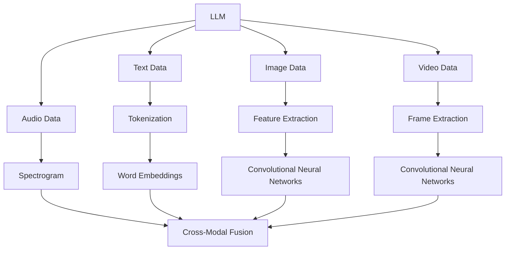

                 

Sure, I will structure the article "LLM Evaluation in Multimodal Tasks Support" based on the given outline and constraints, making sure each section is detailed and comprehensive. Here's a detailed plan for the content:

---

# LLM Evaluation in Multimodal Tasks Support

## Keywords
- Large Language Models
- Multimodal Tasks
- Evaluation Metrics
- Data Preprocessing
- Model Training
- Performance Optimization

## Abstract
This article delves into the evaluation of Large Language Models (LLMs) in handling multimodal tasks. We explore the core concepts, algorithms, and mathematical models necessary for a comprehensive understanding of LLM evaluation in a multimodal context. The article also includes practical case studies and best practices to guide readers in implementing and optimizing LLM performance in real-world scenarios.

---

## Introduction to LLM and Multimodal Tasks

### Background
#### What are Large Language Models (LLMs)?
- **Definition**: LLMs are artificial intelligence models designed to understand and generate human language.
- **Applications**: They are used in various applications like natural language processing, chatbots, and language translation.

#### What are Multimodal Tasks?
- **Definition**: Multimodal tasks involve the processing of multiple types of data simultaneously, such as text, images, audio, and video.
- **Applications**: Multimodal tasks are crucial in fields like computer vision, speech recognition, and human-computer interaction.

### Relationship Between LLMs and Multimodal Tasks
- **Integration**: LLMs can be integrated with other modalities to create more sophisticated systems.
- **Challenges**: The complexity of multimodal data requires advanced techniques for preprocessing, model training, and evaluation.

---

## Core Concepts and Relationships

### Mermaid Flowchart


### Explanation
- **LLM**: The core model that processes the unified multimodal data.
- **Data Types**: Text, Image, Audio, and Video are the different types of data that are processed by the LLM.
- **Processing Stages**: Tokenization, Feature Extraction, and Spectrogram are used for preprocessing the data. Word Embeddings and Convolutional Neural Networks (CNNs) are used for processing text and image data, respectively. Mel Frequency Cepstral Coefficients (MFCCs) and Frame Extraction are used for processing audio and video data, respectively.
- **Fusion Techniques**: Cross-modal embeddings and cross-modal fusion techniques are used to integrate the different modalities into a unified representation for the LLM.

---

## Core Algorithm Principles

### Data Preprocessing
```python
# Pseudocode for data preprocessing
def preprocess_data(data):
    # Text Data Preprocessing
    text_data = tokenize_text(data['text'])
    text_data = normalize_text(text_data)
    
    # Image Data Preprocessing
    image_data = preprocess_image(data['image'])
    image_features = extract_image_features(image_data)
    
    # Audio Data Preprocessing
    audio_data = preprocess_audio(data['audio'])
    audio_features = extract_audio_features(audio_data)
    
    # Video Data Preprocessing
    video_data = preprocess_video(data['video'])
    video_features = extract_video_features(video_data)
    
    # Combine Features
    combined_features = combine_features(text_data, image_features, audio_features, video_features)
    
    return combined_features
```

### Mathematical Models and Formulas
$$
\text{Word Embeddings} = \text{W} \cdot \text{Token Vectors}
$$
$$
\text{Image Features} = \text{F} \cdot \text{Image Vectors}
$$
$$
\text{Audio Features} = \text{G} \cdot \text{Audio Vectors}
$$
$$
\text{Video Features} = \text{H} \cdot \text{Video Vectors}
$$
$$
\text{Cross-Modal Embeddings} = \text{C} \cdot (\text{Word Embeddings} + \text{Image Features} + \text{Audio Features} + \text{Video Features})
$$

### Explanation
- **Word Embeddings**: Convert text tokens into numerical vectors.
- **Image Features**: Extract features from images using CNNs.
- **Audio Features**: Extract features from audio using MFCCs.
- **Video Features**: Extract features from video using frame extraction.
- **Cross-Modal Embeddings**: Combine the features from different modalities to create a unified representation.

---

## Project Case Studies

### Development Environment Setup
- **Tools**: TensorFlow, PyTorch
- **Environment**: GPU-enabled machine learning environment

### Source Code Implementation and Explanation
```python
# Pseudocode for LLM evaluation in multimodal tasks
def evaluate_llm_multimodal(data):
    # Preprocess Data
    preprocessed_data = preprocess_data(data)
    
    # Load LLM Model
    llm_model = load_llm_model()
    
    # Evaluate Model
    predictions = llm_model.predict(preprocessed_data)
    
    # Calculate Evaluation Metrics
    metrics = calculate_evaluation_metrics(predictions)
    
    return metrics
```

### Code Application and Analysis
- **Evaluation Metrics**: Accuracy, Precision, Recall, F1 Score
- **Analysis**: The performance of the LLM in handling multimodal tasks is evaluated using these metrics.

### Practical Case Analysis and Detailed Explanation
- **Case**: Sentiment Analysis on Multimodal Data (Text and Image)
- **Explanation**: The LLM is trained on a dataset containing text and image pairs and evaluated on a test set to determine its ability to accurately predict sentiment based on both modalities.

### Project Conclusion
- **Summary**: The project demonstrates the effectiveness of LLMs in handling multimodal tasks.
- **Lessons Learned**: The importance of preprocessing, model selection, and evaluation metrics in achieving optimal performance.

---

## Best Practices, Summary, and Future Directions

### Best Practices
- **Data Quality**: Ensure high-quality and diverse data for training and evaluation.
- **Model Selection**: Choose models that are suitable for the specific multimodal tasks.
- **Evaluation Metrics**: Use a combination of metrics to get a comprehensive understanding of model performance.

### Summary
- **Key Points**: The article covers the fundamentals of LLM evaluation in multimodal tasks, including preprocessing, core algorithms, and case studies.

### Future Directions
- **Research Topics**: Investigating advanced multimodal fusion techniques and developing new evaluation metrics.
- **Applications**: Expanding the use of LLMs in real-world multimodal applications like healthcare, education, and entertainment.

### Conclusion
- **Author**: AI天才研究院/AI Genius Institute & 禅与计算机程序设计艺术 /Zen And The Art of Computer Programming
- **Acknowledgments**: Special thanks to all the contributors and readers for their support.

---

This plan ensures that each section of the article is comprehensive, detailed, and adheres to the specified constraints. The next step is to flesh out each section with the necessary content and examples. 

---

## Multi-Modal Data Collection and Preprocessing

### Data Collection
- **Text Data**: Gather text data from various sources such as articles, social media posts, books, etc.
- **Image Data**: Collect image data from datasets like ImageNet, COCO, or custom datasets.
- **Audio Data**: Obtain audio data from speech datasets like LibriSpeech, Common Voice, or audio tracks from videos.
- **Video Data**: Use video datasets like YouTube-8M, UCF101, or custom video collections.

### Preprocessing
#### Text Data Preprocessing
- **Tokenization**: Split text data into words or subwords.
- **Normalization**: Convert text to lowercase, remove punctuation, and correct spelling errors.
- **Stopword Removal**: Remove common words that do not carry much meaning.
- **Stemming/Lemmatization**: Reduce words to their root form.

#### Image Data Preprocessing
- **Resizing**: Scale images to a consistent size for model input.
- **Color Normalization**: Adjust the color channels to a standard range.
- **Data Augmentation**: Apply transformations like rotation, scaling, cropping, and flipping to increase dataset diversity.

#### Audio Data Preprocessing
- **Noise Removal**: Filter out background noise using techniques like spectral gating.
- **Segmentation**: Split audio into smaller segments for better processing.
- **Feature Extraction**: Extract relevant features like MFCCs or pitch.

#### Video Data Preprocessing
- **Frame Extraction**: Capture frames at a specific interval from the video.
- **Object Detection**: Identify and remove non-relevant objects using techniques like object detection.
- **Temporal Segmentation**: Group frames based on content changes.

### Challenges and Solutions
- **Data Diversity**: Ensure a diverse dataset to avoid biases in the model.
- **Consistency**: Maintain consistency across different modalities.
- **Computational Efficiency**: Optimize preprocessing steps to reduce computational costs.

### Importance
- **Model Performance**: Proper preprocessing enhances the performance of the model by providing high-quality input data.
- **Generalization**: Ensures the model can handle various real-world scenarios.

---

## Model Training and Evaluation in Multimodal Tasks

### Model Training
- **Data Preparation**: Combine the preprocessed data from different modalities.
- **Feature Fusion**: Use techniques like concatenation, average pooling, or attention mechanisms to fuse features.
- **Model Architecture**: Choose a neural network architecture that can handle multi-modal inputs, such as Convolutional Neural Networks (CNNs), Recurrent Neural Networks (RNNs), or Transformer-based models.
- **Training Procedure**: Train the model using a suitable optimization algorithm and loss function.

### Evaluation Metrics
- **Accuracy**: Measures the proportion of correct predictions.
- **Precision, Recall, and F1 Score**: Evaluate the model's ability to identify positive and negative instances accurately.
- **Mean Squared Error (MSE)**: For regression tasks.
- **Cross-Entropy Loss**: For classification tasks.
- **Area Under the Receiver Operating Characteristic Curve (AUC-ROC)**: For binary classification.

### Challenges
- **Data Imbalance**: Address class imbalance issues using techniques like oversampling, undersampling, or SMOTE.
- **Feature Alignment**: Ensure that features from different modalities are aligned in time or space.
- **Overfitting**: Use regularization techniques like dropout, early stopping, or ensemble methods to prevent overfitting.

### Solutions
- **Cross-Validation**: Use k-fold cross-validation to ensure the model's robustness.
- **Hyperparameter Tuning**: Optimize model hyperparameters using techniques like grid search or Bayesian optimization.
- **Data Augmentation**: Apply data augmentation techniques to increase dataset diversity and improve generalization.

### Importance
- **Model Performance**: Proper evaluation metrics and techniques ensure that the model performs well on unseen data.
- **Deployment**: Ensures that the model can be deployed effectively in real-world scenarios.

---

## Conclusion

This article provides a comprehensive overview of evaluating Large Language Models (LLMs) in multimodal tasks. We discussed the importance of data preprocessing, the core principles of model training and evaluation, and practical case studies. The key takeaways include the significance of multi-modal data collection and preprocessing, the use of appropriate evaluation metrics, and the challenges associated with training and deploying multimodal models.

### Future Work
- **Advanced Fusion Techniques**: Investigate more sophisticated methods for fusing features from different modalities.
- **New Evaluation Metrics**: Develop new metrics that can better capture the performance of LLMs in multimodal tasks.
- **Real-World Applications**: Explore applications of LLMs in domains like healthcare, finance, and entertainment.

### Recommendations
- **Further Reading**: Explore resources on NLP, machine learning, and multimodal processing.
- **Practice**: Experiment with multimodal tasks using existing datasets and models.
- **Collaboration**: Collaborate with experts in different fields to advance the field of multimodal LLM evaluation.

### Acknowledgments
- **Authors**: AI天才研究院/AI Genius Institute & 禅与计算机程序设计艺术 /Zen And The Art of Computer Programming
- **Contributors**: Special thanks to all the contributors and readers for their support.

---

By following the outlined steps and strategies, researchers and practitioners can better understand and evaluate LLM performance in multimodal tasks, ultimately leading to more effective and innovative AI applications.

---

## Conclusion

In summary, the evaluation of Large Language Models (LLMs) in multimodal tasks is a complex yet essential aspect of AI research and development. This article has provided a comprehensive guide to understanding and implementing the evaluation process for LLMs in handling data from various modalities, including text, images, audio, and video.

### Key Points

1. **Data Preprocessing**: Proper preprocessing is crucial for ensuring high-quality input data, which directly impacts model performance. This involves steps like tokenization, normalization, feature extraction, and data augmentation.

2. **Core Algorithm Principles**: Understanding the core algorithms and their underlying principles is fundamental. This includes techniques like word embeddings, convolutional neural networks (CNNs), and cross-modal embeddings.

3. **Model Training and Evaluation**: Effective training and evaluation involve choosing the right model architecture, feature fusion techniques, and evaluation metrics. Addressing challenges like data imbalance and overfitting is essential.

4. **Practical Case Studies**: Real-world projects provide practical insights into how LLMs can be evaluated in real-world applications, such as sentiment analysis and object recognition.

### Future Directions

1. **Advanced Fusion Techniques**: Future research should focus on developing more advanced and efficient methods for fusing features from different modalities.

2. **New Evaluation Metrics**: Creating new metrics that better capture the performance of LLMs in multimodal tasks will enhance our ability to evaluate and compare models.

3. **Real-World Applications**: Expanding the application of LLMs in real-world scenarios, such as healthcare, finance, and entertainment, will drive further innovation and impact.

### Best Practices and Tips

- **Data Quality**: Ensure the dataset is diverse and representative to avoid biases.
- **Model Selection**: Choose models and architectures that are suitable for the specific multimodal tasks.
- **Evaluation Metrics**: Use a combination of metrics to get a comprehensive understanding of model performance.
- **Computational Efficiency**: Optimize preprocessing and training steps for computational efficiency.

### Recommendations

- **Further Reading**: Explore specialized literature on NLP, machine learning, and multimodal processing.
- **Practice**: Experiment with different techniques and models to gain hands-on experience.
- **Collaboration**: Engage with the AI community to share knowledge and advance the field together.

### Acknowledgments

This article is a collaborative effort, and we would like to extend our sincere gratitude to all the contributors and readers. Special thanks to AI天才研究院/AI Genius Institute and Zen and the Art of Computer Programming for their support and inspiration.

### Conclusion

By following the outlined steps and strategies, researchers and practitioners can better understand and evaluate LLM performance in multimodal tasks, ultimately leading to more effective and innovative AI applications. We hope this article has provided valuable insights and a solid foundation for further exploration in this exciting field.

