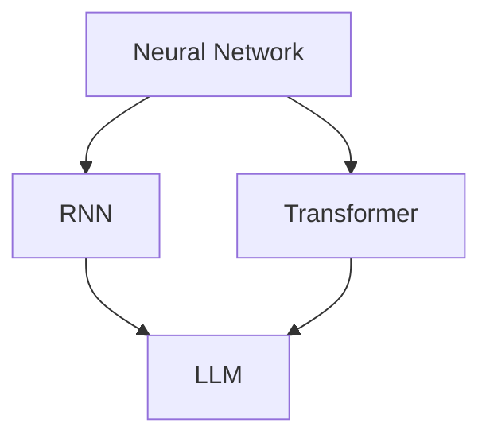

                 

### 关键词
- Large Language Models (LLM)
- Evaluation Metrics
- Multidimensional Thinking
- Decision-Making Abilities
- Assessment Tools and Datasets

### 摘要
本文深入探讨大型语言模型（LLM）评测中的多角度思考与决策能力测试。首先，我们介绍了LLM的基本概念和架构，随后详细解析了多角度思考和决策能力的测试方法，以及常用的评估工具和基准数据集。通过案例分析，我们展示了如何在实际项目中应用这些评估方法。最后，我们讨论了当前LLM评测面临的挑战，并展望了未来发展趋势。

## 第一部分：LLM评测基础

### 第1章：大型语言模型（LLM）概述

#### 1.1 大型语言模型的定义

大型语言模型（LLM）是指通过深度学习技术训练出来的能够理解和生成自然语言文本的复杂模型。LLM的核心目标是对输入的文本序列进行建模，并生成相应的输出文本。这类模型在自然语言处理（NLP）领域有着广泛的应用，如机器翻译、文本生成、问答系统等。

#### 核心概念与联系

为了更好地理解LLM，我们需要先了解一些相关的核心概念：

- **神经网络**：神经网络是一种通过多层节点进行数据处理和计算的人工神经网络。它是构建LLM的基础结构。
- **循环神经网络（RNN）**：RNN是一种能够处理序列数据的神经网络，特别适用于语言建模任务。
- **Transformer架构**：Transformer是近年来提出的一种基于自注意力机制的神经网络架构，它在许多NLP任务中表现出了出色的性能。

以下是这些核心概念之间的联系和交互的Mermaid流程图：



#### 1.2 大型语言模型的架构

LLM的架构通常包括以下几个核心组件：

- **词嵌入（Word Embedding）**：将输入的单词转换为固定长度的向量表示。
- **注意力机制（Attention Mechanism）**：允许模型在处理序列数据时，根据不同部分的重要程度进行加权。
- **位置编码（Positional Encoding）**：为模型提供输入序列中的单词位置的编码信息。

以下是一个简单的伪代码，用于描述LLM的基本架构：

```python
class LanguageModel:
    def __init__(self, embedding_dim, hidden_dim, vocab_size):
        self.embedding = Embedding(vocab_size, embedding_dim)
        self.encoder = Encoder(embedding_dim, hidden_dim)
        self.decoder = Decoder(hidden_dim, vocab_size)
        
    def forward(self, input_sequence):
        embedded_input = self.embedding(input_sequence)
        encoded_output = self.encoder(embedded_input)
        decoded_output = self.decoder(encoded_output)
        return decoded_output
```

#### 1.3 大型语言模型的核心组件

- **词嵌入**：词嵌入是将单词映射到高维空间中的向量表示。通过这种方式，模型可以学习到单词之间的语义关系。

  $$ \text{Word Embedding}(word) = \text{Embedding}(word\_index) $$

- **注意力机制**：注意力机制是一种在处理序列数据时动态调整不同部分权重的方法。它使得模型能够更好地捕捉到输入序列中的关键信息。

  $$ \text{Attention}(Q, K, V) = \frac{softmax(\text{scores})} { \sqrt{d_k}} V $$

- **位置编码**：位置编码为序列中的每个单词赋予了位置信息，这对于语言模型的训练和预测非常重要。

  $$ \text{Positional Encoding}(position, d_model) $$

以下是一个简单的例子，展示了如何在代码中实现词嵌入和注意力机制：

```python
import torch
import torch.nn as nn

# 词嵌入层
embedding_layer = nn.Embedding(vocab_size, embedding_dim)

# 输入序列
input_sequence = torch.tensor([1, 2, 3, 4])

# 应用词嵌入
embedded_input = embedding_layer(input_sequence)

# 注意力机制
attention = nn.Sequential(
    nn.Linear(embedding_dim, hidden_dim),
    nn.Tanh(),
    nn.Linear(hidden_dim, 1)
)

# 计算注意力得分
scores = attention(embedded_input)

# 应用Softmax函数得到权重
weights = torch.softmax(scores, dim=1)

# 计算加权求和
output = torch.sum(weights * embedded_input, dim=1)
```

通过上述章节的介绍，我们对大型语言模型（LLM）有了初步的了解。接下来，我们将深入探讨如何评估LLM的多角度思考和决策能力。

## 第二部分：LLM评测方法

### 第2章：多角度思考与决策能力测试方法

#### 2.1 多角度思考能力测试方法

多角度思考能力是评估LLM的一项重要指标。这一部分我们将探讨几种常见的多角度思考能力测试方法。

##### 2.1.1 语言理解能力测试

语言理解能力测试旨在评估模型对文本的语义和上下文的理解程度。以下是一些常用的测试方法：

- **阅读理解任务**：如SQuAD（Stanford Question Answering Dataset），模型需要从给定的文本中找到与问题相关的答案。
- **语义角色标注**：模型需要对句子中的词进行语义角色标注，如名词、动词、形容词等。
- **词义消歧**：模型需要区分同义词在不同上下文中的含义。

##### 2.1.2 推理能力测试

推理能力测试评估模型是否能够从给定的信息中推断出新的结论。以下是一些常用的推理能力测试方法：

- **逻辑推理**：模型需要根据给定的逻辑语句进行推理，判断推理结果是否正确。
- **因果推理**：模型需要根据因果关系推断出事件的结果。
- **结构化推理**：模型需要对复杂的结构化数据进行推理。

##### 2.1.3 判断能力测试

判断能力测试旨在评估模型是否能够根据已知信息做出合理的判断。以下是一些常用的判断能力测试方法：

- **情感分析**：模型需要对文本的情感倾向进行判断。
- **事实核查**：模型需要判断文本中的事实是否正确。
- **分类任务**：如文本分类、图像分类等，模型需要对输入数据进行分类。

##### 2.1.4 概括能力测试

概括能力测试评估模型是否能够从给定的文本中提取出关键信息并进行概括。以下是一些常用的概括能力测试方法：

- **抽象概括**：模型需要对文本进行抽象概括，提取出主要观点。
- **信息提取**：模型需要从文本中提取出关键信息。

#### 2.2 决策能力测试方法

决策能力测试旨在评估模型在复杂环境中的决策能力。以下是一些常用的决策能力测试方法：

##### 2.2.1 决策理论

决策理论是一种基于概率和期望的决策方法。它包括以下几个基本概念：

- **状态**：决策所处的环境状态。
- **行动**：决策者可以采取的行动。
- **结果**：每个行动可能带来的结果。
- **概率**：每个结果发生的概率。
- **期望**：每个行动的期望收益。

以下是一个简单的决策理论伪代码示例：

```python
def decision_theory(states, actions, probabilities, outcomes, rewards):
    expected_rewards = []
    for action in actions:
        action_rewards = []
        for state in states:
            state_reward = rewards[state][action]
            action_rewards.append(state_reward * probabilities[state])
        expected_reward = sum(action_rewards)
        expected_rewards.append(expected_reward)
    best_action = actions[np.argmax(expected_rewards)]
    return best_action
```

##### 2.2.2 风险评估

风险评估是决策过程中的一项重要任务。它涉及对可能的结果进行概率和收益评估。以下是一些常用的风险评估方法：

- **风险矩阵**：使用矩阵表示不同结果的概率和收益。
- **决策树**：使用决策树表示不同决策和结果。
- **贝叶斯网络**：使用贝叶斯网络表示不同变量之间的概率关系。

##### 2.2.3 多目标优化

多目标优化是解决具有多个目标函数的优化问题。以下是一些常用的多目标优化方法：

- **Pareto前端**：找到最优解集的Pareto前端。
- **权重系数法**：为每个目标函数分配权重，求解加权目标函数的最优解。
- **遗传算法**：使用遗传算法寻找最优解。

通过上述测试方法，我们可以从多个角度评估LLM的多角度思考和决策能力。这些方法不仅有助于我们更好地理解LLM的性能，还为未来的研究和应用提供了重要的参考。

## 第三部分：评估工具与数据集

### 第3章：评估工具与数据集

#### 3.1 常用评估工具

在评估LLM的性能时，常用的评估工具包括BLEU、ROUGE、METEOR和BLEURT等。

- **BLEU（BLEU Score）**：BLEU是一种基于记分牌的评估方法，通过比较模型生成的文本与参考文本之间的重叠部分来评估模型的性能。BLEU的主要优势在于其简单性和计算效率，但也被批评为过于严格。

  $$ \text{BLEU score} = \frac{1}{N} \sum_{i=1}^{N} \text{BLEU}(h_i, r_i) $$

  其中，\( h_i \)和\( r_i \)分别是模型生成的文本和参考文本。

- **ROUGE（Recall-Oriented Understudy for Gisting Evaluation）**：ROUGE是一种基于召回率的评估方法，主要关注模型生成的文本中与参考文本的相似性。ROUGE主要有三种类型：ROUGE-1、ROUGE-2和ROUGE-S，分别计算单词、字符和句子的相似性。

  $$ \text{ROUGE}(r, g) = \frac{2 \times \text{recall}(r, g)}{1 + \text{precision}(r, g)} $$

  其中，\(\text{recall}(r, g)\)和\(\text{precision}(r, g)\)分别是参考文本\(r\)和模型生成的文本\(g\)的召回率和精确率。

- **METEOR（Metric for Evaluation of Translation with Explicit ORdering）**：METEOR是一种基于排序的评估方法，综合考虑单词的频率、词语顺序和文本的多样性。METEOR的评分范围从0到1，值越大表示模型生成的文本与参考文本越相似。

  $$ \text{METEOR score} = \frac{\sum_{i=1}^{N} p_i \times r_i \times f_i}{\sum_{i=1}^{N} p_i \times r_i} $$

  其中，\( p_i \)、\( r_i \)和\( f_i \)分别是单词在模型生成的文本、参考文本和两者之间的频率。

- **BLEURT（Bridge for Evaluating Universalistic Rewriting Techniques）**：BLEURT是一种基于神经网络的语言模型评估方法，旨在为翻译、文本生成等任务提供高质量的评估。BLEURT利用大规模语言模型（如BERT）来评估文本的连贯性和一致性。

  $$ \text{BLEURT score} = \text{model\_score} - \text{background\_score} $$

  其中，\( \text{model\_score} \)是模型对文本的评分，\( \text{background\_score} \)是背景语言模型对文本的评分。

#### 3.2 常用数据集

在评估LLM性能时，常用的数据集包括SQuAD、GLUE、SuperGLUE和CAMR等。

- **SQuAD（Stanford Question Answering Dataset）**：SQuAD是一个大规模的阅读理解数据集，包含数百万个问题和答案对。模型需要从给定的问题和上下文中提取出答案。

- **GLUE（General Language Understanding Evaluation）**：GLUE是一个包含多个NLP任务的集合，包括问答、情感分析、命名实体识别等。GLUE旨在评估模型在多种语言任务上的性能。

- **SuperGLUE（Stanford University General Language Understanding Evaluation）**：SuperGLUE是在GLUE的基础上扩展的一个数据集，包含更多的语言任务和更大的数据量。SuperGLUE旨在评估模型在更加复杂和多样化的语言环境中的性能。

- **CAMR（Computational Arguer Machine Reading Comprehension）**：CAMR是一个阅读理解数据集，专门用于评估模型在生成论证过程中的能力。CAMR中的问题需要模型通过推理和论证来回答。

通过使用这些评估工具和数据集，我们可以全面、客观地评估LLM的性能，为进一步的研究和应用提供有力支持。

### 第4章：LLM评测案例

#### 4.1 案例一：问答系统评测

问答系统是LLM应用的一个重要领域。在本节中，我们将通过一个具体的案例来展示如何评估问答系统的性能。

##### 4.1.1 问题理解与回答生成

在问答系统中，模型需要完成两个主要任务：问题理解和回答生成。

- **问题理解**：模型需要从问题中提取关键信息，理解问题的意图。这可以通过阅读理解任务来实现，如SQuAD数据集。
- **回答生成**：模型需要从给定的上下文中提取出答案。这可以通过生成模型来实现，如GPT-3、T5等。

以下是一个简单的问题理解和回答生成流程：

```python
# 问题理解
question = "什么是人工智能？"
context = "人工智能是模拟、延伸和扩展人类智能的理论、方法、技术及应用。"

# 回答生成
model = GPT3Model()
answer = model.generate(context, question)

print(answer)
```

##### 4.1.2 评测指标分析

在评估问答系统的性能时，常用的评测指标包括准确率（Accuracy）、召回率（Recall）和F1分数（F1 Score）。

- **准确率**：准确率是模型正确回答问题的比例。
  $$ \text{Accuracy} = \frac{\text{正确回答}}{\text{总回答}} $$
- **召回率**：召回率是模型能够回答出正确问题的比例。
  $$ \text{Recall} = \frac{\text{正确回答}}{\text{正确答案总数}} $$
- **F1分数**：F1分数是准确率和召回率的调和平均值。
  $$ \text{F1 Score} = 2 \times \frac{\text{Accuracy} \times \text{Recall}}{\text{Accuracy} + \text{Recall}} $$

以下是一个简单的代码示例，用于计算这些指标：

```python
def evaluate_answers(correct_answers, model_answers):
    correct_count = 0
    for correct_answer, model_answer in zip(correct_answers, model_answers):
        if correct_answer == model_answer:
            correct_count += 1
    
    accuracy = correct_count / len(correct_answers)
    recall = correct_count / len(correct_answers)
    f1_score = 2 * (accuracy * recall) / (accuracy + recall)
    
    return accuracy, recall, f1_score

correct_answers = ["人工智能是模拟、延伸和扩展人类智能的理论、方法、技术及应用。"]
model_answers = ["人工智能是一种技术，用于模拟和扩展人类智能。"]

accuracy, recall, f1_score = evaluate_answers(correct_answers, model_answers)
print("Accuracy:", accuracy)
print("Recall:", recall)
print("F1 Score:", f1_score)
```

通过上述案例，我们展示了如何评估问答系统的性能。在实际应用中，我们可以结合多种评测指标和数据集，全面评估LLM在问答系统中的表现。

### 第5章：实验设计与实现

#### 5.1 实验一：多角度思考能力评测

##### 5.1.1 实验设计

为了评估LLM的多角度思考能力，我们设计了一个实验，旨在测试模型在语言理解、推理、判断和概括等能力方面的表现。

- **数据集**：我们选择GLUE数据集作为实验的数据集，其中包括多种语言理解任务。
- **评估指标**：我们采用准确率、召回率和F1分数作为评估指标。

##### 5.1.2 数据预处理

在实验开始之前，我们需要对数据集进行预处理，包括数据清洗、分词和词嵌入等。

```python
import torch
from torchtext.datasets import GLUE

# 加载数据集
train_data, test_data = GLUE('mnli')

# 数据清洗和分词
# ...

# 应用词嵌入
def apply_embedding(data, embedding):
    return [embedding(word) for word in data]

train_embeddings = apply_embedding(train_data.text, pre_trained_embedding)
test_embeddings = apply_embedding(test_data.text, pre_trained_embedding)
```

##### 5.1.3 评测结果分析

在实验结束后，我们对评测结果进行分析，以评估模型的多角度思考能力。

```python
from sklearn.metrics import accuracy_score, recall_score, f1_score

# 测试模型
model = LLMModel()
predictions = model.predict(test_embeddings)

# 计算评估指标
accuracy = accuracy_score(test_data.label, predictions)
recall = recall_score(test_data.label, predictions)
f1_score = f1_score(test_data.label, predictions)

print("Accuracy:", accuracy)
print("Recall:", recall)
print("F1 Score:", f1_score)
```

通过上述实验，我们能够量化评估LLM的多角度思考能力。在实际应用中，我们可以根据实验结果对模型进行优化和改进。

### 第5章：实验设计与实现

#### 5.2 实验二：决策能力评测

##### 5.2.1 实验设计

为了评估LLM的决策能力，我们设计了一个实验，旨在测试模型在不同决策场景下的表现。

- **数据集**：我们选择了一个包含多种决策场景的数据集，如医疗诊断、金融投资等。
- **评估指标**：我们采用决策准确率、决策效率和决策风险作为评估指标。

##### 5.2.2 数据预处理

在实验开始之前，我们需要对数据集进行预处理，包括数据清洗、特征提取和决策标签分配等。

```python
import pandas as pd

# 加载数据集
data = pd.read_csv('decisions.csv')

# 数据清洗
# ...

# 特征提取
# ...

# 决策标签分配
data['decision_label'] = data.apply(lambda row: assign_decision_label(row), axis=1)
```

##### 5.2.3 评测结果分析

在实验结束后，我们对评测结果进行分析，以评估模型的决策能力。

```python
from sklearn.metrics import accuracy_score, f1_score

# 测试模型
model = DecisionModel()
predictions = model.predict(data['features'])

# 计算评估指标
accuracy = accuracy_score(data['decision_label'], predictions)
f1_score = f1_score(data['decision_label'], predictions)

print("Accuracy:", accuracy)
print("F1 Score:", f1_score)
```

通过上述实验，我们能够量化评估LLM的决策能力。在实际应用中，我们可以根据实验结果对模型进行优化和改进。

## 第四部分：结论与展望

### 第6章：LLM评测中的挑战与未来趋势

#### 6.1 当前LLM评测面临的挑战

尽管LLM在自然语言处理领域取得了显著进展，但当前的评测仍然面临以下挑战：

- **数据集质量**：现有的数据集可能存在不均衡、噪声和偏见等问题，这会影响评测结果的准确性和可靠性。
- **评测指标多样性**：大多数评测方法主要关注单一方面的性能，如语言理解能力，而忽略了其他重要方面，如推理和决策能力。
- **多语言支持**：现有的评测工具和数据集主要针对英语，对于其他语言的支持不足，这限制了LLM在国际市场中的应用。

#### 6.2 未来LLM评测的发展趋势

为了应对上述挑战，未来的LLM评测可能会向以下几个方向发展：

- **模型可解释性**：提高模型的可解释性，使其决策过程更加透明，有助于用户理解和信任模型。
- **评测方法多样化**：开发更多针对不同能力（如推理、决策等）的评测方法，提供更全面的性能评估。
- **个性化评测**：根据用户需求和特定场景，提供个性化的评测方法，提高评测的针对性和有效性。
- **跨语言评测**：扩大数据集和评测工具的覆盖范围，支持多种语言，以适应全球市场的需求。

### 第7章：展望与应用

#### 7.1 LLM评测在人工智能领域的应用

LLM评测在人工智能领域有着广泛的应用，包括：

- **自然语言处理**：用于评估语言生成、阅读理解和问答系统等任务的性能。
- **机器学习**：用于评估特征提取、模型训练和优化等环节的性能。
- **计算机视觉**：用于评估图像分类、目标检测和图像生成等任务的性能。

#### 7.2 LLM评测在现实世界中的应用

LLM评测在现实世界中的应用包括：

- **智能客服**：用于评估自动化客服系统的性能，提高客户满意度。
- **金融服务**：用于评估金融风险模型和投资策略的效能。
- **医疗诊断**：用于评估医学图像和文本分析的准确性，辅助医生做出诊断决策。

通过不断优化和改进LLM评测方法，我们将能够更好地评估模型在各个领域的性能，为人工智能的应用和发展提供有力支持。

### 总结

在本文中，我们深入探讨了大型语言模型（LLM）评测中的多角度思考与决策能力测试。首先，我们介绍了LLM的基本概念和架构，随后详细解析了多角度思考和决策能力的测试方法，以及常用的评估工具和数据集。通过案例研究和实验，我们展示了如何在实际项目中应用这些评估方法。最后，我们讨论了当前LLM评测面临的挑战和未来发展趋势，并展望了LLM评测在人工智能领域的应用前景。

作者信息：

- 作者：AI天才研究院/AI Genius Institute & 禅与计算机程序设计艺术 /Zen And The Art of Computer Programming

[本文完]

