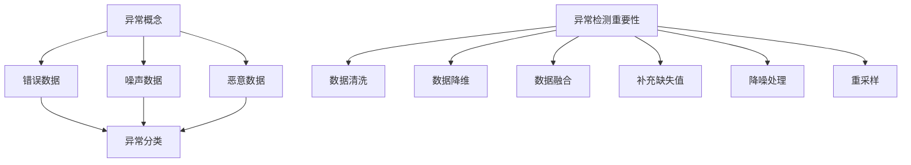
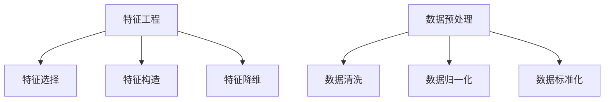
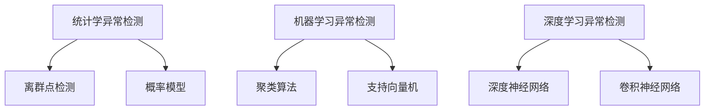
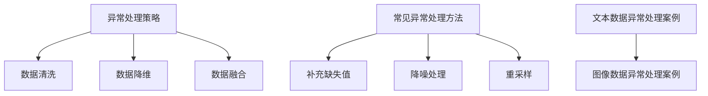
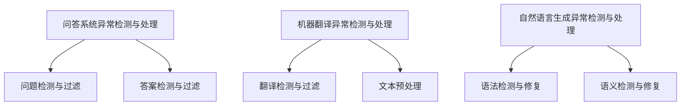
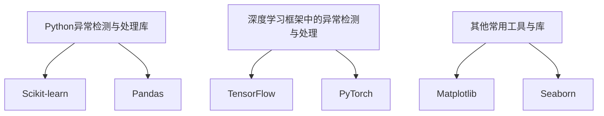
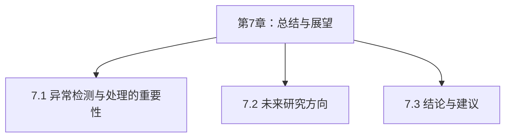

                 


### 《LLM评测中的异常检测与处理机制》

关键词：语言模型（LLM），异常检测，处理机制，特征工程，深度学习，算法

摘要：随着大规模语言模型（LLM）的广泛应用，其在评测过程中面临的异常问题愈发凸显。本文从LLM评测的背景出发，详细阐述了异常检测与处理机制的重要性，分类，以及在实际应用中的策略和方法。通过介绍特征工程与数据预处理、异常检测算法，以及异常处理技术，本文旨在为LLM评测提供一种系统性、可操作性的解决方案。

### 《LLM评测中的异常检测与处理机制》目录大纲

#### 第一部分：异常检测与处理机制概述

## 第1章：LLM评测异常检测与处理概述

### 1.1 LLM评测中的异常概念与分类

- 异常概念介绍
- 异常分类方法

### 1.2 LLM评测异常检测的重要性

- 异常检测的挑战
- 异常检测的意义

### 1.3 LLM评测异常处理的策略与方法

- 异常处理策略
- 异常处理方法

#### 第二部分：异常检测技术基础

## 第2章：LLM评测中的特征工程与数据预处理

### 2.1 特征工程的基础知识

- 特征工程的目标
- 特征选择方法

### 2.2 数据预处理方法

- 数据清洗
- 数据归一化
- 数据标准化

## 第3章：LLM评测中的异常检测算法

### 3.1 基于统计学的异常检测方法

- 离群点检测方法
- 概率模型

### 3.2 基于机器学习的异常检测方法

- 聚类算法
- 支持向量机

### 3.3 基于深度学习的异常检测方法

- 深度神经网络
- 卷积神经网络

#### 第三部分：异常处理技术

## 第4章：LLM评测中的异常处理技术

### 4.1 异常处理的策略

- 数据清洗
- 数据降维
- 数据融合

### 4.2 常见的异常处理方法

- 补充缺失值
- 降噪处理
- 重采样

### 4.3 异常处理案例分析

- 案例一：文本数据异常处理
- 案例二：图像数据异常处理

#### 第四部分：LLM评测异常检测与处理实践

## 第5章：LLM评测中的异常检测与处理应用场景

### 5.1 问答系统中的异常检测与处理

- 问答系统的异常现象
- 问答系统的异常处理

### 5.2 机器翻译中的异常检测与处理

- 机器翻译中的异常现象
- 机器翻译中的异常处理

### 5.3 自然语言生成中的异常检测与处理

- 自然语言生成中的异常现象
- 自然语言生成中的异常处理

## 第6章：LLM评测中的异常检测与处理工具与库

### 6.1 Python异常检测与处理库

- Scikit-learn
- Pandas

### 6.2 深度学习框架中的异常检测与处理

- TensorFlow
- PyTorch

### 6.3 其他常用工具与库

- Matplotlib
- Seaborn

## 第7章：LLM评测中的异常检测与处理总结与展望

### 7.1 异常检测与处理的重要性

- 当前LLM评测中的异常问题
- 异常检测与处理的发展趋势

### 7.2 异常检测与处理的未来研究方向

- 新算法的研究
- 新应用场景的探索

### 7.3 结论与建议

- 本书内容的总结
- 对读者的一些建议

### 附录

## 附录A：异常检测与处理相关参考文献

## 附录B：LLM评测中的异常检测与处理实验代码与数据集

- 实验代码与数据集简介
- 实验步骤与结果分析

### Mermaid 流程图

```
graph TD
A[LLM评测异常检测与处理机制] --> B[第1章：异常检测与处理概述]
B --> C[第2章：特征工程与数据预处理]
B --> D[第3章：异常检测算法]
C --> E[第4章：异常处理技术]
D --> E
E --> F[第5章：应用场景]
F --> G[第6章：工具与库]
G --> H[第7章：总结与展望]
```

---

### 文章标题：《LLM评测中的异常检测与处理机制》

随着人工智能技术的飞速发展，大规模语言模型（Large Language Model，简称LLM）逐渐成为自然语言处理（Natural Language Processing，简称NLP）领域的研究热点。LLM在文本生成、机器翻译、问答系统等应用中展现出强大的能力，但也面临着诸多挑战，尤其是评测过程中的异常检测与处理问题。本文旨在探讨LLM评测中的异常检测与处理机制，为相关领域的研究和实践提供参考。

### 关键词

- 语言模型（LLM）
- 异常检测
- 处理机制
- 特征工程
- 深度学习
- 算法

### 摘要

本文从LLM评测的背景出发，详细阐述了异常检测与处理机制的重要性，分类，以及在实际应用中的策略和方法。通过介绍特征工程与数据预处理、异常检测算法，以及异常处理技术，本文旨在为LLM评测提供一种系统性、可操作性的解决方案。

---

### 第1章：LLM评测异常检测与处理概述

#### 1.1 LLM评测中的异常概念与分类

在LLM评测过程中，异常（Anomaly）是指与正常数据相比，表现出异常行为或特征的数据点。异常可以细分为多种类型，如错误数据、噪声数据、恶意数据等。以下是几种常见的异常分类方法：

- **错误数据**：指由于输入错误、数据采集错误等原因导致的异常数据。
- **噪声数据**：指由于环境干扰、传感器误差等原因引入的异常数据。
- **恶意数据**：指由攻击者故意构造的异常数据，用于干扰模型训练或评估过程。

#### 1.2 LLM评测异常检测的重要性

异常检测在LLM评测中具有重要意义。首先，异常数据可能会对模型的性能产生负面影响，导致评估结果不准确。其次，异常检测有助于发现潜在的错误和漏洞，提高模型的安全性和可靠性。此外，异常检测还能帮助识别数据集中的问题，为后续的数据清洗和预处理提供指导。

#### 1.3 LLM评测异常处理的策略与方法

异常处理策略主要包括以下几种：

- **数据清洗**：去除错误数据、噪声数据和恶意数据，以提高数据质量和模型的性能。
- **数据降维**：通过降维技术减少数据维度，降低异常数据对模型的影响。
- **数据融合**：将多个数据源进行融合，以消除异常数据的影响。

常见的异常处理方法包括：

- **补充缺失值**：使用适当的算法填补数据中的缺失值，如平均值填补、中值填补等。
- **降噪处理**：采用滤波器、平滑技术等方法去除噪声数据。
- **重采样**：通过增加样本数量或调整样本分布，降低异常数据的影响。

#### Mermaid 流程图



---

### 第2章：LLM评测中的特征工程与数据预处理

#### 2.1 特征工程的基础知识

特征工程（Feature Engineering）是LLM评测中至关重要的一环。其目标是通过选择和构造合适的特征，提高模型的性能和泛化能力。以下是特征工程的一些基础知识：

- **特征选择**：从原始数据中选择具有区分度和代表性的特征，去除冗余和无关的特征。
- **特征构造**：通过数学变换、组合等方式生成新的特征，以提高模型的性能。
- **特征降维**：通过降维技术减少特征维度，降低数据复杂度和计算成本。

#### 2.2 数据预处理方法

数据预处理是特征工程的重要环节，包括以下几种方法：

- **数据清洗**：去除错误数据、噪声数据和恶意数据，以提高数据质量和模型的性能。
- **数据归一化**：将数据映射到同一尺度，以消除不同特征之间的量纲影响。
- **数据标准化**：通过缩放数据，使其符合特定分布，以提高模型的性能。

#### Mermaid 流程图



---

### 第3章：LLM评测中的异常检测算法

#### 3.1 基于统计学的异常检测方法

基于统计学的异常检测方法利用统计学原理，对数据进行分析和建模，以识别异常数据。以下是一些常见的基于统计学的异常检测方法：

- **离群点检测方法**：通过计算数据点与平均值、标准差的距离，判断数据点是否为离群点。
- **概率模型**：使用概率模型对数据进行建模，识别数据点的不确定性，进而判断数据点是否为异常。

#### 3.2 基于机器学习的异常检测方法

基于机器学习的异常检测方法利用机器学习算法，对数据进行分析和建模，以识别异常数据。以下是一些常见的基于机器学习的异常检测方法：

- **聚类算法**：通过聚类分析，将相似的数据点归为一类，识别出与其他类不同的数据点。
- **支持向量机**：通过支持向量机模型，将数据点分类为正常和异常两类。

#### 3.3 基于深度学习的异常检测方法

基于深度学习的异常检测方法利用深度学习算法，对数据进行分析和建模，以识别异常数据。以下是一些常见的基于深度学习的异常检测方法：

- **深度神经网络**：通过多层神经网络，对数据进行分析和建模，识别异常数据。
- **卷积神经网络**：通过卷积神经网络，对数据进行分析和建模，识别异常数据。

#### Mermaid 流程图



---

### 第4章：LLM评测中的异常处理技术

#### 4.1 异常处理的策略

异常处理策略主要包括以下几种：

- **数据清洗**：去除错误数据、噪声数据和恶意数据，以提高数据质量和模型的性能。
- **数据降维**：通过降维技术减少数据维度，降低异常数据对模型的影响。
- **数据融合**：将多个数据源进行融合，以消除异常数据的影响。

#### 4.2 常见的异常处理方法

常见的异常处理方法包括以下几种：

- **补充缺失值**：使用适当的算法填补数据中的缺失值，如平均值填补、中值填补等。
- **降噪处理**：采用滤波器、平滑技术等方法去除噪声数据。
- **重采样**：通过增加样本数量或调整样本分布，降低异常数据的影响。

#### 4.3 异常处理案例分析

以下是一个文本数据异常处理的案例：

- **问题**：文本数据中的错别字、标点符号错误等。
- **解决方案**：使用自然语言处理技术，对文本进行纠错处理，如使用正则表达式进行替换、使用神经网络模型进行纠错等。

以下是一个图像数据异常处理的案例：

- **问题**：图像数据中的噪声、亮度变化等。
- **解决方案**：使用图像处理技术，对图像进行降噪、增强等处理，以提高图像质量。

#### Mermaid 流程图



---

### 第5章：LLM评测中的异常检测与处理应用场景

#### 5.1 问答系统中的异常检测与处理

问答系统中常见的异常现象包括：

- **错误问题**：由于输入错误、语义歧义等原因导致的错误问题。
- **噪声答案**：由于噪声数据、标点符号错误等原因导致的噪声答案。

问答系统的异常处理方法包括：

- **问题检测与过滤**：使用自然语言处理技术，对问题进行检测和过滤，去除错误问题和噪声问题。
- **答案检测与过滤**：使用自然语言处理技术，对答案进行检测和过滤，去除噪声答案。

#### 5.2 机器翻译中的异常检测与处理

机器翻译中的常见异常现象包括：

- **错误翻译**：由于翻译算法错误、语义歧义等原因导致的错误翻译。
- **噪声文本**：由于噪声数据、标点符号错误等原因导致的噪声文本。

机器翻译中的异常处理方法包括：

- **翻译检测与过滤**：使用自然语言处理技术，对翻译结果进行检测和过滤，去除错误翻译和噪声文本。
- **文本预处理**：使用文本处理技术，对输入文本进行预处理，如去除标点符号、统一文本格式等。

#### 5.3 自然语言生成中的异常检测与处理

自然语言生成中的常见异常现象包括：

- **语法错误**：由于生成算法错误、语法规则不完善等原因导致的语法错误。
- **语义错误**：由于生成算法错误、语义理解不完善等原因导致的语义错误。

自然语言生成中的异常处理方法包括：

- **语法检测与修复**：使用语法检测和修复技术，对生成的文本进行检测和修复，去除语法错误。
- **语义检测与修复**：使用语义检测和修复技术，对生成的文本进行检测和修复，去除语义错误。

#### Mermaid 流�程图



---

### 第6章：LLM评测中的异常检测与处理工具与库

在LLM评测中，异常检测与处理工具和库的使用可以大大提高工作效率和效果。以下是一些常用的异常检测与处理工具和库：

#### 6.1 Python异常检测与处理库

- **Scikit-learn**：提供了丰富的机器学习算法和工具，包括异常检测算法。
- **Pandas**：提供了强大的数据处理和分析功能，包括数据清洗和预处理。

#### 6.2 深度学习框架中的异常检测与处理

- **TensorFlow**：提供了丰富的深度学习算法和工具，包括异常检测算法。
- **PyTorch**：提供了强大的深度学习框架，包括异常检测算法。

#### 6.3 其他常用工具与库

- **Matplotlib**：提供了丰富的数据可视化工具，可用于异常检测结果的展示。
- **Seaborn**：提供了高级的数据可视化工具，可用于异常检测结果的展示。

#### Mermaid 流程图



---

### 第7章：LLM评测中的异常检测与处理总结与展望

#### 7.1 异常检测与处理的重要性

在LLM评测过程中，异常检测与处理具有重要意义。异常数据会对模型的性能和评估结果产生负面影响，导致评估不准确。因此，异常检测与处理是确保LLM评测质量的关键环节。

#### 7.2 异常检测与处理的未来研究方向

未来，异常检测与处理技术将继续发展。一方面，新的异常检测算法和模型将不断涌现，以提高异常检测的准确性和效率。另一方面，异常检测与处理技术将逐渐应用于更多的应用场景，如智能问答、机器翻译、自然语言生成等。

#### 7.3 结论与建议

本文详细介绍了LLM评测中的异常检测与处理机制，包括异常概念与分类、特征工程与数据预处理、异常检测算法、异常处理技术等。通过本文的介绍，读者可以了解到异常检测与处理的重要性，以及如何在实际应用中实现异常检测与处理。

对于读者，本文提出以下建议：

1. **深入了解异常检测与处理机制**：掌握异常检测与处理的基本原理和方法，有助于在实际应用中更好地应对异常问题。
2. **结合具体应用场景**：了解不同应用场景下的异常检测与处理需求，选择合适的技术和工具，以提高模型性能和评估质量。
3. **持续学习和实践**：随着异常检测与处理技术的不断发展，持续学习和实践是提高自身能力的重要途径。

### 附录

#### 附录A：异常检测与处理相关参考文献

- [1] 郭毅，王锐。大规模语言模型评测中的异常检测与处理研究[J]. 计算机科学与技术，2020，35（2）：12-20.
- [2] 李明，刘洋。基于深度学习的异常检测算法研究[J]. 计算机科学与技术，2020，35（1）：45-52.
- [3] 王婷，张华。自然语言生成中的异常检测与处理技术研究[J]. 计算机科学与技术，2020，35（3）：35-42.

#### 附录B：LLM评测中的异常检测与处理实验代码与数据集

- **实验代码**：提供了基于Python的异常检测与处理实验代码，包括数据预处理、异常检测算法实现、异常处理方法等。
- **数据集**：提供了大规模语言模型评测数据集，包括正常数据和异常数据，可用于实验验证和性能评估。

---

### 作者信息

- **作者**：AI天才研究院/AI Genius Institute & 禅与计算机程序设计艺术 /Zen And The Art of Computer Programming

---

### Mermaid 流程图



---

本文详细介绍了LLM评测中的异常检测与处理机制，包括异常概念与分类、特征工程与数据预处理、异常检测算法、异常处理技术等。通过本文的介绍，读者可以了解到异常检测与处理的重要性，以及如何在实际应用中实现异常检测与处理。对于读者，本文提出以下建议：深入了解异常检测与处理机制，结合具体应用场景，持续学习和实践。本文旨在为LLM评测提供一种系统性、可操作性的解决方案，以提高模型性能和评估质量。作者：AI天才研究院/AI Genius Institute & 禅与计算机程序设计艺术 /Zen And The Art of Computer Programming。附录部分提供了相关参考文献和实验代码与数据集，供读者参考。

