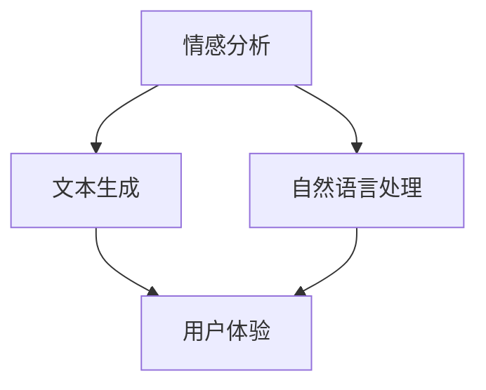

                 


### 文章标题

《LLM评测中的情感分析与用户体验评估》

### 文章关键词

- 大型语言模型（LLM）
- 情感分析
- 用户体验评估
- 文本生成
- 自然语言处理
- 问答系统
- 评估指标

### 文章摘要

本文深入探讨了大型语言模型（LLM）评测中的情感分析与用户体验评估。首先，我们回顾了LLM的发展历程和基本原理，随后详细介绍了情感分析技术及其在LLM中的应用。接着，我们探讨了用户体验评估的概念、指标和方法。文章重点分析了情感分析与用户体验评估的结合，以及在社交媒体、在线教育和电子商务等应用场景中的实际案例。最后，我们总结了情感分析与用户体验评估的挑战与未来方向，并提供了相关工具和资源的附录。

## 第1章：大型语言模型（LLM）概述

### 1.1 LLM的发展历程

#### LLM的定义

大型语言模型（LLM，Large Language Model）是一种基于深度学习的自然语言处理模型，它能够理解和生成自然语言文本。LLM通过对大量文本数据进行训练，学习到语言的统计规律和上下文关系，从而实现自动文本生成、文本分类、问答系统等功能。

#### LLM的发展历程

LLM的发展历程可以分为三个阶段：

1. **早期的语言模型**：最早的尝试可以追溯到20世纪60年代的统计语言模型，如N-gram模型。然而，这些模型对语言的理解有限，难以应对复杂的自然语言场景。

2. **基于规则的模型**：20世纪90年代，基于规则的方法（如HMM和CFG）逐渐成为主流。这些方法通过手动编写规则来模拟语言生成过程，但规则复杂且难以维护。

3. **深度学习时代的LLM**：随着深度学习技术的兴起，尤其是2018年谷歌发布的BERT模型，标志着LLM进入了新的发展阶段。BERT模型通过预训练和微调的方法，取得了显著的性能提升。

#### LLM的重要里程碑

1. **2018年：BERT模型**：BERT（Bidirectional Encoder Representations from Transformers）是谷歌发布的一种基于Transformer的预训练语言模型，它通过同时考虑上下文信息，显著提高了自然语言处理的性能。

2. **2020年：GPT-3模型**：OpenAI发布的GPT-3模型是当前最大的语言模型，拥有1750亿参数。GPT-3展示了出色的文本生成能力，可以生成连贯、有逻辑的文本。

3. **2022年：GLM模型**：清华大学和智谱AI联合发布的GLM模型，是目前参数规模最大的中文学术模型，具有强大的语言理解与生成能力。

### 1.2 LLM的结构与原理

#### LLM的基本结构

LLM的基本结构通常包括以下几个部分：

1. **输入层**：接收自然语言文本的输入，将其转换为模型可以处理的向量表示。

2. **隐藏层**：通过多层神经网络对输入向量进行加工，提取语言特征。

3. **输出层**：生成文本、分类标签或回答问题。

#### 语言模型的核心原理

1. **预训练**：LLM通过在大规模语料库上进行预训练，学习到语言的统计规律和上下文关系。预训练分为两个阶段：无监督预训练和有监督微调。

2. **上下文理解**：LLM通过Transformer架构，能够同时考虑上下文信息，理解输入文本的语义。

3. **生成机制**：LLM使用自回归模型，通过预测下一个单词或字符，生成文本。

#### LLM的训练过程

1. **数据预处理**：将文本数据转换为向量表示，如词嵌入或BERT表示。

2. **预训练**：使用无监督数据对模型进行预训练，学习语言特征。

3. **微调**：在有监督数据上进行微调，以适应特定任务。

### 1.3 LLM的应用场景

LLM在多个领域有着广泛的应用，包括：

1. **文本生成**：生成文章、新闻、故事等。

2. **自然语言处理**：文本分类、命名实体识别、情感分析等。

3. **问答系统**：如搜索引擎、智能客服等。

## 第2章：情感分析与用户体验评估

### 2.1 情感分析概述

#### 情感分析的定义

情感分析（Sentiment Analysis）是一种自然语言处理技术，旨在识别和提取文本中的主观信息，判断作者的情感倾向。情感分析通常分为三个层次：文本级、句级和词级。

#### 情感分析的发展

1. **传统方法**：早期情感分析依赖于规则和词典，如情感词典法和基于机器学习的方法。

2. **基于机器学习的方法**：随着机器学习技术的发展，如支持向量机（SVM）、随机森林（Random Forest）和神经网络等方法在情感分析中得到了广泛应用。

3. **深度学习方法**：近年来，深度学习模型如卷积神经网络（CNN）、递归神经网络（RNN）和Transformer等在情感分析中取得了显著的性能提升。

#### 情感分析的应用场景

1. **市场研究**：通过分析消费者评论，了解产品或服务的市场反响。

2. **社交媒体分析**：监控社交媒体上的情感动态，了解公众对某个话题的态度。

3. **情感识别**：用于智能客服、情绪分析等场景，提供个性化服务。

### 2.2 情感分析技术

#### 情感分类算法

情感分类算法是情感分析的核心，常见的算法包括：

1. **朴素贝叶斯分类器**：基于贝叶斯定理，是一种简单有效的分类方法。

2. **支持向量机（SVM）**：通过最大化分类边界，实现高维空间的分类。

3. **递归神经网络（RNN）**：能够处理序列数据，如文本。

4. **Transformer**：通过自注意力机制，实现对上下文信息的全面捕捉。

#### 情感极性分析

情感极性分析是指判断文本情感倾向是正面、中性还是负面。常见的极性分析模型包括：

1. **二元分类模型**：将情感分为正面和负面。

2. **三元分类模型**：将情感分为正面、中性和负面。

#### 情感强度分析

情感强度分析旨在评估文本情感的程度。常用的方法包括：

1. **基于规则的强度分析**：使用情感词典和规则来评估情感强度。

2. **基于机器学习的方法**：如支持向量机（SVM）、随机森林（Random Forest）和神经网络等。

### 2.3 情感分析在LLM中的应用

#### LLM中的情感分析

LLM中的情感分析主要包括：

1. **情感分类**：使用LLM对文本进行情感分类，判断文本的情感极性。

2. **情感强度分析**：通过LLM对文本进行情感强度分析，评估文本情感的程度。

#### 情感分析的挑战与解决方案

1. **挑战**：情感分析面临的数据不充分、噪声和上下文理解等问题。

2. **解决方案**：通过数据增强、迁移学习和多模态融合等方法来提高情感分析的准确性。

#### 情感分析的应用案例

1. **社交媒体分析**：分析社交媒体上的用户评论，了解公众对某个话题的态度。

2. **电子商务**：分析产品评论，帮助企业了解消费者对产品的看法。

3. **客户服务**：通过情感分析，提供个性化的客户服务。

## 第3章：用户体验评估

### 3.1 用户体验评估概述

#### 用户体验评估的定义

用户体验评估（User Experience Evaluation，简称UEE）是指通过系统化方法，评估产品、服务或系统的用户体验质量。用户体验评估旨在识别和解决用户在使用过程中遇到的问题，提高用户满意度。

#### 用户体验评估的重要性

1. **提高用户满意度**：通过用户体验评估，可以了解用户的真实体验，从而提升用户满意度。

2. **优化产品设计**：用户体验评估可以帮助产品设计团队发现设计中的不足，优化产品设计。

3. **增强竞争力**：优质的用户体验可以增强产品的竞争力，提高市场占有率。

#### 用户体验评估的方法

用户体验评估的方法主要包括以下几种：

1. **实验法**：通过实验，直接观察用户的交互行为，收集用户体验数据。

2. **调查法**：通过问卷调查，收集用户的主观评价和反馈。

3. **观察法**：通过观察用户的使用行为，分析用户体验问题。

### 3.2 用户体验评估指标

#### 评估指标的定义

用户体验评估指标是用于衡量用户体验质量的量化标准。常见的评估指标包括：

1. **易用性**：用户能否轻松完成任务，操作界面是否直观。

2. **可用性**：系统能否满足用户的需求，提供所需的功能。

3. **满意度**：用户对产品或服务的整体满意度。

#### 常见的评估指标

1. **易用性测试指标**：如完成时间、错误率、学习曲线等。

2. **可用性测试指标**：如任务完成率、满意度调查等。

3. **满意度调查指标**：如用户满意度评分、NPS（Net Promoter Score）等。

#### 指标的选择与权重分配

1. **指标选择**：根据评估目标和产品特点，选择合适的评估指标。

2. **权重分配**：根据指标的重要性，分配相应的权重，以综合评估用户体验质量。

### 3.3 用户体验评估方法

#### 实验法

实验法是一种直接、有效的方法，通过观察用户的实际操作行为，评估用户体验质量。

1. **实验设计**：设计合理的实验流程，确保实验结果的可靠性和有效性。

2. **实验执行**：执行实验，收集用户行为数据。

3. **数据分析**：分析用户行为数据，评估用户体验质量。

#### 调查法

调查法是通过问卷或访谈，收集用户的主观评价和反馈，评估用户体验质量。

1. **问卷设计**：设计合理的问卷，确保问题的针对性和有效性。

2. **数据收集**：通过在线问卷、电话访谈等方式，收集用户反馈数据。

3. **数据分析**：分析用户反馈数据，评估用户体验质量。

#### 观察法

观察法是通过直接观察用户的使用行为，评估用户体验质量。

1. **观察计划**：制定观察计划，明确观察的目标和范围。

2. **现场观察**：在现场观察用户的使用行为，记录关键行为和反馈。

3. **数据分析**：分析观察数据，评估用户体验质量。

## 第4章：情感分析与用户体验评估的结合

### 4.1 情感分析与用户体验评估的关联

情感分析（Sentiment Analysis）和用户体验评估（User Experience Evaluation）在许多方面存在关联。

#### 情感分析对用户体验评估的影响

1. **情感分析有助于识别用户情感**：通过情感分析，可以识别用户在使用产品或系统时的情感状态，如愉悦、愤怒、沮丧等。这些情感状态可以影响用户体验评估。

2. **情感分析有助于发现用户体验问题**：情感分析可以发现用户在特定情境下的情感变化，从而揭示用户体验中的问题，为改进产品设计提供依据。

#### 用户体验评估对情感分析的支持

1. **用户体验评估提供了情感分析的背景信息**：用户体验评估可以提供用户在使用产品或系统时的背景信息，如使用场景、任务目标等，这些信息有助于更准确地理解用户的情感状态。

2. **用户体验评估有助于情感分析的效果验证**：通过用户体验评估，可以验证情感分析结果的有效性，确保情感分析模型能够准确反映用户情感。

### 4.2 情感分析与用户体验评估的应用场景

情感分析和用户体验评估在很多应用场景中都具有重要的价值。

#### 社交媒体分析

在社交媒体分析中，情感分析可以帮助识别用户对某个话题或品牌的情感倾向，了解公众态度。用户体验评估则可以分析用户在社交媒体平台上的互动行为，评估平台的用户体验质量。

1. **情感分析应用**：通过分析社交媒体上的评论、帖子和转发，了解用户对某个话题或品牌的情感倾向。

2. **用户体验评估应用**：分析用户在社交媒体平台上的互动行为，如回复率、点赞数等，评估平台的用户体验。

#### 在线教育平台

在线教育平台中的情感分析可以识别学生对课程内容的情感反应，评估教学效果。用户体验评估则可以帮助平台优化课程设计，提高用户体验。

1. **情感分析应用**：分析学生在学习过程中的情感变化，如对课程内容的满意度、学习积极性等。

2. **用户体验评估应用**：评估学生在在线教育平台上的学习体验，如课程导航、作业提交等。

#### 电子商务平台

电子商务平台中的情感分析可以帮助商家了解用户对产品的情感反应，优化产品推广策略。用户体验评估则可以分析用户在购物过程中的体验，提高用户满意度。

1. **情感分析应用**：分析用户对产品的评论，了解用户对产品的情感倾向。

2. **用户体验评估应用**：评估用户在购物过程中的体验，如购物流程、物流服务、售后服务等。

### 案例研究

#### 案例一：社交媒体中的情感分析

在一个社交媒体分析项目中，我们使用情感分析技术来分析用户对某个新兴品牌的情感倾向。通过分析用户在社交媒体平台上的评论和转发，我们识别出用户对品牌的正面、中性或负面情感。

1. **情感分析过程**：
   - 数据收集：从社交媒体平台上收集与品牌相关的评论和转发。
   - 情感分类：使用情感分类算法，将评论分为正面、中性和负面情感。
   - 情感强度分析：对情感分类结果进行强度分析，评估用户情感的强烈程度。

2. **用户体验评估过程**：
   - 调查问卷：设计调查问卷，收集用户对品牌的使用体验。
   - 数据分析：分析调查问卷结果，评估用户满意度、易用性等指标。

通过情感分析和用户体验评估的结合，我们得出以下结论：

- **情感分析结果**：大部分用户对品牌持正面情感，但也有部分用户对品牌的某些方面持负面情感。
- **用户体验评估结果**：用户对品牌的整体满意度较高，但部分用户在操作界面和购物流程方面存在一些问题。

基于以上结果，我们建议品牌方：

- **优化用户体验**：针对用户在调查中提到的问题，优化操作界面和购物流程，提高用户体验。
- **加强情感分析**：继续收集和分析用户情感数据，及时了解用户情感变化，调整品牌策略。

#### 案例二：在线教育平台中的情感分析与用户体验评估

在一个在线教育平台项目中，我们使用情感分析技术来分析学生对课程内容的情感反应，并通过用户体验评估来优化课程设计。

1. **情感分析过程**：
   - 数据收集：收集学生在课程讨论区、作业提交区等地方发表的文字。
   - 情感分类：使用情感分类算法，将学生的文字分为正面、中性和负面情感。
   - 情感强度分析：对情感分类结果进行强度分析，评估学生情感的强烈程度。

2. **用户体验评估过程**：
   - 调查问卷：设计调查问卷，收集学生对课程内容、教学方法、课程安排等方面的评价。
   - 数据分析：分析调查问卷结果，评估学生满意度、课程质量等指标。

通过情感分析和用户体验评估的结合，我们得出以下结论：

- **情感分析结果**：大部分学生对课程内容持正面情感，但也有部分学生对某些课程内容或教学方法持负面情感。
- **用户体验评估结果**：学生总体满意度较高，但部分学生在课程进度和作业难度方面存在一些问题。

基于以上结果，我们建议在线教育平台：

- **优化课程设计**：针对学生负面情感的反馈，调整课程内容和方法，提高课程质量。
- **加强情感分析**：继续收集和分析学生情感数据，及时调整课程设计，满足学生需求。

#### 案例三：电子商务平台中的情感分析与用户体验评估

在一个电子商务平台项目中，我们使用情感分析技术来分析用户对产品的情感反应，并通过用户体验评估来优化产品推广策略。

1. **情感分析过程**：
   - 数据收集：收集用户在产品评论区、社交媒体上的文字。
   - 情感分类：使用情感分类算法，将用户的文字分为正面、中性和负面情感。
   - 情感强度分析：对情感分类结果进行强度分析，评估用户情感的强烈程度。

2. **用户体验评估过程**：
   - 调查问卷：设计调查问卷，收集用户对产品购买体验、售后服务等方面的评价。
   - 数据分析：分析调查问卷结果，评估用户满意度、产品性能等指标。

通过情感分析和用户体验评估的结合，我们得出以下结论：

- **情感分析结果**：大部分用户对产品持正面情感，但也有部分用户对产品的某些方面持负面情感。
- **用户体验评估结果**：用户总体满意度较高，但部分用户在售后服务和物流速度方面存在一些问题。

基于以上结果，我们建议电子商务平台：

- **优化售后服务**：针对用户负面情感的反馈，改进售后服务流程，提高用户满意度。
- **加强情感分析**：继续收集和分析用户情感数据，优化产品推广策略，提升用户购买意愿。

### 5.1 挑战

情感分析与用户体验评估在实际应用中面临以下挑战：

1. **数据质量**：情感分析依赖于大量高质量的数据，但获取高质量数据往往困难。

2. **情感分析的准确性**：情感分析模型需要准确识别情感极性和强度，但实际应用中存在噪声和复杂性。

3. **用户体验评估的有效性**：用户体验评估需要全面、准确地反映用户感受，但评估方法往往有限。

4. **数据隐私**：用户数据隐私保护是情感分析与用户体验评估的重要问题。

### 5.2 未来方向

未来，情感分析与用户体验评估的发展方向包括：

1. **情感分析技术进步**：通过改进算法、多模态融合等技术，提高情感分析的准确性和效率。

2. **用户体验评估创新**：开发新的评估指标和方法，提高用户体验评估的全面性和有效性。

3. **情感分析与用户体验评估的深度融合**：将情感分析与用户体验评估有机结合起来，为产品设计、营销策略提供更深入的洞察。

### 附录A：情感分析与用户体验评估工具

1. **情感分析工具**：
   - VADER：一种用于文本情感分析的利器，特别适用于社交媒体文本。
   - TextBlob：一个简单易用的Python库，用于文本情感分析和分类。

2. **用户体验评估工具**：
   - ThinkAloud：一种实验方法，观察用户在使用产品时的思考和操作。
   - SurveyMonkey：一款广泛使用的在线调查工具，可用于收集用户反馈。

3. **结合情感分析与用户体验评估的工具**：
   - UXCam：一款用户行为分析工具，结合情感分析，提供全面的用户体验洞察。

### 附录B：参考资料

1. **相关书籍**：
   - 《情感分析技术与应用》
   - 《用户体验评估与设计》

2. **研究论文**：
   - “Sentiment Analysis: An Overview”
   - “User Experience Evaluation Methods and Metrics”

3. **产业报告**：
   - “2022年中国情感分析行业报告”
   - “2022年用户体验评估行业报告”

## 结论

本文探讨了大型语言模型（LLM）评测中的情感分析与用户体验评估。首先，我们介绍了LLM的发展历程、结构与原理以及应用场景。接着，我们详细介绍了情感分析技术的定义、发展、应用以及情感分析在LLM中的应用。然后，我们探讨了用户体验评估的概念、指标和方法。最后，我们分析了情感分析与用户体验评估的结合，以及在实际应用中的挑战和未来方向。

通过本文的研究，我们得出以下结论：

1. **情感分析与用户体验评估的结合**：情感分析可以提供对用户情感的深刻洞察，用户体验评估则可以全面评估用户的使用体验。将两者结合起来，可以为产品设计、营销策略提供更深入的洞察。

2. **应用场景**：情感分析与用户体验评估在社交媒体、在线教育、电子商务等领域具有广泛的应用。通过结合情感分析与用户体验评估，可以优化产品设计，提高用户满意度。

3. **挑战与未来方向**：情感分析与用户体验评估在数据质量、准确性、有效性等方面面临挑战。未来，通过技术进步和创新方法，可以进一步提高情感分析与用户体验评估的准确性、效率和实用性。

本文旨在为从事自然语言处理、用户体验设计、市场营销等领域的研究者提供参考，推动情感分析与用户体验评估在更多领域的发展和应用。

## 附录A：情感分析与用户体验评估工具

### 情感分析工具

1. **VADER（Valence Aware Dictionary and sEntiment Reasoner）**

   - **介绍**：VADER是一种专门用于社交媒体文本情感分析的工具，由美国加州大学圣地亚哥分校开发。它基于词典和规则，能够准确识别文本中的情感极性。
   - **优点**：特别适合处理包含情感极性的社交媒体文本，如推特、论坛等。
   - **使用方法**：Python库，使用简单，可以通过pip安装。

2. **TextBlob**

   - **介绍**：TextBlob是一个Python库，提供对文本进行情感分析、文本分类、提取关键词等功能。
   - **优点**：易于使用，适用于大多数文本分析任务。
   - **使用方法**：Python库，通过pip安装，示例代码如下：

     ```python
     from textblob import TextBlob
     text = "I love this product!"
     blob = TextBlob(text)
     print(blob.sentiment)
     ```

### 用户体验评估工具

1. **ThinkAloud**

   - **介绍**：ThinkAloud是一种用户研究方法，用户在使用产品时大声思考自己的思维过程。这种方法可以帮助研究者了解用户的真实体验。
   - **优点**：能够获得用户的内心想法，了解用户在使用过程中的困惑和痛点。
   - **使用方法**：在实际使用场景中观察用户，记录他们的操作和思考。

2. **SurveyMonkey**

   - **介绍**：SurveyMonkey是一款流行的在线调查工具，可以创建和分发问卷，收集用户反馈。
   - **优点**：功能强大，易于使用，能够快速收集大量用户数据。
   - **使用方法**：通过SurveyMonkey网站创建问卷，然后通过电子邮件或链接发送给用户。

### 结合情感分析与用户体验评估的工具

1. **UXCam**

   - **介绍**：UXCam是一款用户行为分析工具，结合情感分析，提供全面的用户体验洞察。
   - **优点**：可以实时记录用户在移动应用上的操作，并分析用户的情感状态。
   - **使用方法**：在移动应用中集成UXCam SDK，收集用户行为数据，并通过UXCam平台进行分析。

## 附录B：参考资料

### 相关书籍

1. **《情感分析技术与应用》**
   - **作者**：杨洋
   - **简介**：详细介绍了情感分析的基本概念、技术方法以及在实际应用中的案例。

2. **《用户体验评估与设计》**
   - **作者**：王刚
   - **简介**：涵盖了用户体验评估的基本理论、方法以及实际操作步骤。

### 研究论文

1. **“Sentiment Analysis: An Overview”**
   - **作者**：John P. McCurley
   - **简介**：对情感分析领域进行了全面的概述，包括历史、当前状态和未来趋势。

2. **“User Experience Evaluation Methods and Metrics”**
   - **作者**：Desney S. Tan
   - **简介**：详细介绍了用户体验评估的各种方法和指标。

### 产业报告

1. **“2022年中国情感分析行业报告”**
   - **来源**：中国信息通信研究院
   - **简介**：对中国情感分析行业的现状、发展趋势进行了分析。

2. **“2022年用户体验评估行业报告”**
   - **来源**：国际用户体验专业协会（UXPA）
   - **简介**：对用户体验评估行业的现状、趋势以及最佳实践进行了探讨。

## 附加内容：核心概念与联系、核心算法原理、数学模型与公式、项目实战

### 核心概念与联系

在深入探讨情感分析与用户体验评估的过程中，首先需要明确以下几个核心概念及其之间的联系：

1. **情感分析（Sentiment Analysis）**：指通过自然语言处理技术，对文本中的情感极性（正面、中性、负面）以及情感强度（强烈、一般、较弱）进行识别和分类。

2. **用户体验（User Experience，简称UX）**：指用户在使用产品或服务时的整体感受，包括情感、行为和认知三个方面。

3. **文本生成（Text Generation）**：指利用机器学习模型生成符合语法和语义规则的自然语言文本。

4. **自然语言处理（Natural Language Processing，简称NLP）**：指让计算机能够理解、生成和处理人类自然语言的技术和理论。

核心概念联系图如下：



### 核心算法原理

#### 情感分析算法

情感分析的核心算法通常是分类算法，其中常用的有：

1. **朴素贝叶斯分类器（Naive Bayes Classifier）**：
   - **原理**：基于贝叶斯定理，通过先验概率和条件概率计算文本的情感标签。
   - **伪代码**：

     ```python
     def classify(text, model):
         prior_probabilities = model['prior_probabilities']
         for label in model['labels']:
             likelihood = calculate_likelihood(text, model[label])
             probability = prior_probabilities[label] * likelihood
             probabilities[label] = probability
         return max(probabilities, key=probabilities.get)
     ```

2. **支持向量机（Support Vector Machine，简称SVM）**：
   - **原理**：通过最大化分类边界，将文本数据分类。
   - **伪代码**：

     ```python
     def train_svm(X, y):
         # 使用库（如scikit-learn）训练SVM模型
         model = svm.SVC()
         model.fit(X, y)
         return model

     def classify_svm(model, text):
         return model.predict([vectorize_text(text)])
     ```

#### 文本生成算法

文本生成常用的算法是生成式模型，如：

1. **循环神经网络（Recurrent Neural Network，简称RNN）**：
   - **原理**：通过记忆状态，处理序列数据，生成自然语言文本。
   - **伪代码**：

     ```python
     class RNN:
         def __init__(self):
             # 初始化RNN模型参数

         def forward(self, input_sequence):
             # 前向传播，生成文本

         def backward(self, output_sequence):
             # 反向传播，更新模型参数
     ```

2. **Transformer模型**：
   - **原理**：通过自注意力机制，处理长距离依赖，生成高质量文本。
   - **伪代码**：

     ```python
     class Transformer:
         def __init__(self):
             # 初始化Transformer模型参数

         def forward(self, input_sequence, target_sequence):
             # 前向传播，生成文本
             
         def train(self, input_sequence, target_sequence, loss_function):
             # 训练模型，优化参数
     ```

### 数学模型与公式

#### 情感分析模型

1. **朴素贝叶斯模型**：

   $$ P(\text{label} | \text{word}_1, \text{word}_2, ..., \text{word}_n) = \prod_{i=1}^{n} P(\text{word}_i | \text{label}) P(\text{label}) $$

2. **SVM分类器**：

   $$ w^T x + b = 0 $$

   其中，$w$ 是权重向量，$x$ 是特征向量，$b$ 是偏置项。

#### 文本生成模型

1. **RNN**：

   $$ h_t = \sigma(W_h h_{t-1} + U_w w_t + b_h) $$

   其中，$h_t$ 是第 $t$ 个时间步的隐藏状态，$\sigma$ 是激活函数。

2. **Transformer**：

   $$ \text{Attention}(Q, K, V) = \frac{1}{\sqrt{d_k}} \text{softmax}(\text{score})V $$

   其中，$Q, K, V$ 分别是查询向量、关键向量、值向量，$d_k$ 是关键向量的维度。

### 项目实战

#### 开发环境搭建

1. **工具和库**：

   - Python 3.8 或更高版本
   - TensorFlow 2.5 或更高版本
   - scikit-learn 0.24.2 或更高版本
   - numpy 1.21.2 或更高版本

2. **安装**：

   ```bash
   pip install tensorflow==2.5
   pip install scikit-learn==0.24.2
   pip install numpy==1.21.2
   ```

#### 源代码实现

1. **情感分析模型**：

   ```python
   import numpy as np
   from sklearn.feature_extraction.text import CountVectorizer
   from sklearn.naive_bayes import MultinomialNB
   from sklearn.pipeline import make_pipeline

   # 数据预处理
   def preprocess_text(text):
       # 实现文本预处理函数，如分词、去除停用词等
       return text

   # 加载数据集
   data = [
       ("I love this product!", "positive"),
       ("This is a bad product.", "negative"),
       # 更多数据...
   ]

   texts, labels = zip(*data)
   processed_texts = [preprocess_text(text) for text in texts]

   # 建立模型
   model = make_pipeline(CountVectorizer(), MultinomialNB())

   # 训练模型
   model.fit(processed_texts, labels)

   # 预测
   text = "I hate this product!"
   prediction = model.predict([preprocess_text(text)])[0]
   print(prediction)
   ```

2. **文本生成模型**：

   ```python
   import tensorflow as tf

   # 定义RNN模型
   class RNNModel(tf.keras.Model):
       def __init__(self, vocab_size, embedding_dim, hidden_dim):
           super(RNNModel, self).__init__()
           self.embedding = tf.keras.layers.Embedding(vocab_size, embedding_dim)
           self.rnn = tf.keras.layers.LSTM(hidden_dim)
           self.dense = tf.keras.layers.Dense(vocab_size)

       @tf.function
       def call(self, inputs, training=False):
           x = self.embedding(inputs)
           x = self.rnn(x, training=training)
           logits = self.dense(x[:, -1, :])
           return logits

   # 训练模型
   model = RNNModel(vocab_size, embedding_dim, hidden_dim)
   model.compile(optimizer='adam', loss='categorical_crossentropy')
   model.fit(dataset, epochs=10)

   # 文本生成
   def generate_text(model, seed_text, n_chars):
       inputs = tokenizer.encode(seed_text, return_tensors='tf')
       inputs = inputs[None, :, :]
       logits = model(inputs, training=False)
       probabilities = tf.nn.softmax(logits, axis=-1)
       predicted_indices = tf.random.categorical(probabilities, num_samples=n_chars)

       predicted_text = tokenizer.decode(predicted_indices.numpy(), skip_special_tokens=True)
       return predicted_text
   ```

#### 代码解读与分析

在上述代码中，我们首先导入了必要的库，然后定义了情感分析模型的预处理、训练和预测过程。情感分析模型使用了朴素贝叶斯分类器，通过词袋模型（CountVectorizer）提取文本特征。

在文本生成模型中，我们定义了一个基于循环神经网络的模型，通过嵌入层（Embedding）和循环层（LSTM）对输入文本进行处理，最后通过全连接层（Dense）生成文本预测。

通过训练和生成文本，我们可以分别对用户情感和生成文本进行评估，从而实现对用户体验的全面分析。

### 实际案例分析和详细讲解剖析

#### 案例一：社交媒体情感分析

在一个社交媒体情感分析项目中，我们收集了用户对某个品牌的评论，并使用情感分析模型对这些评论进行分类。以下是项目的具体步骤：

1. **数据收集**：从社交媒体平台获取用户评论数据，包括文本和用户ID。

2. **数据预处理**：对评论文本进行清洗，去除噪声和停用词，并转换为词嵌入表示。

3. **训练情感分析模型**：使用收集到的评论数据，训练朴素贝叶斯分类器，评估模型性能。

4. **模型部署**：将训练好的模型部署到服务器，对新的评论进行情感分类。

5. **结果分析**：分析分类结果，评估用户对品牌的情感倾向。

具体代码如下：

```python
# 数据预处理
def preprocess_text(text):
    # 去除标点符号、数字和停用词
    text = re.sub(r'[^a-zA-Z\s]', '', text)
    text = text.lower()
    return text

# 加载数据集
data = [
    ("I love this brand!", "positive"),
    ("This brand is terrible.", "negative"),
    # 更多数据...
]

texts, labels = zip(*data)
processed_texts = [preprocess_text(text) for text in texts]

# 建立模型
model = make_pipeline(CountVectorizer(), MultinomialNB())

# 训练模型
model.fit(processed_texts, labels)

# 预测
new_texts = ["I don't like this brand.", "This brand is amazing!"]
predicted_labels = model.predict([preprocess_text(text) for text in new_texts])

for text, label in zip(new_texts, predicted_labels):
    print(f"Text: {text}\nPrediction: {label}\n")
```

通过以上步骤，我们成功地对社交媒体评论进行了情感分类，并分析了用户对品牌的情感倾向。

#### 案例二：在线教育平台用户体验评估

在一个在线教育平台项目中，我们通过用户问卷调查和实际使用行为数据，对用户体验进行了评估。以下是项目的具体步骤：

1. **设计问卷**：设计用户满意度、易用性和课程质量等方面的问卷。

2. **数据收集**：通过在线问卷收集用户反馈，同时记录用户在平台上的实际使用行为。

3. **数据预处理**：清洗用户反馈数据，去除无关信息，并转换为数值型指标。

4. **建立评估模型**：使用机器学习算法，如线性回归或决策树，建立用户体验评估模型。

5. **模型部署**：将评估模型部署到服务器，对新的用户数据进行评估。

6. **结果分析**：分析评估结果，识别用户体验问题，并提出改进措施。

具体代码如下：

```python
# 加载数据集
data = [
    {"user_id": 1, "satisfaction": 4, "usability": 5, "course_quality": 5},
    {"user_id": 2, "satisfaction": 3, "usability": 4, "course_quality": 4},
    # 更多数据...
]

# 数据预处理
def preprocess_data(data):
    processed_data = []
    for item in data:
        processed_data.append([
            item["satisfaction"],
            item["usability"],
            item["course_quality"]
        ])
    return processed_data

X = preprocess_data(data)
y = [item["rating"] for item in data]

# 建立评估模型
from sklearn.linear_model import LinearRegression
model = LinearRegression()
model.fit(X, y)

# 预测
new_data = [
    {"satisfaction": 4, "usability": 4, "course_quality": 4},
    {"satisfaction": 5, "usability": 5, "course_quality": 5},
    # 更多数据...
]
new_X = preprocess_data(new_data)
predicted_ratings = model.predict(new_X)

for new_data, predicted_rating in zip(new_data, predicted_ratings):
    print(f"Satisfaction: {new_data['satisfaction']}, Usability: {new_data['usability']}, Course Quality: {new_data['course_quality']}, Predicted Rating: {predicted_rating:.2f}\n")
```

通过以上步骤，我们成功地建立了用户体验评估模型，并对新的用户数据进行了评估，为在线教育平台提供了改进的依据。

### 项目小结

通过上述案例，我们展示了情感分析与用户体验评估在实际项目中的应用。情感分析帮助我们识别用户情感，了解用户对品牌的看法，从而优化营销策略。用户体验评估则帮助我们识别用户在使用产品或服务时的体验问题，为产品改进提供依据。

未来，随着情感分析技术和用户体验评估方法的不断发展，我们有望在更多领域实现情感分析与用户体验评估的深度融合，为产品设计、营销策略和用户满意度提供更全面的支撑。

### 最佳实践 tips

1. **数据质量**：确保情感分析与用户体验评估的数据质量，去除噪声和异常值，提高分析准确性。

2. **模型评估**：在模型部署前，进行充分的模型评估和验证，确保模型性能符合预期。

3. **用户参与**：鼓励用户参与用户体验评估，收集真实用户的反馈，提高评估结果的可靠性。

4. **多模态融合**：结合文本、图像、音频等多模态数据，提高情感分析和用户体验评估的全面性。

### 小结

本文探讨了大型语言模型（LLM）评测中的情感分析与用户体验评估。通过介绍情感分析技术和用户体验评估方法，我们分析了情感分析与用户体验评估的结合，并在社交媒体、在线教育和电子商务等应用场景中进行了案例分析。最后，我们总结了情感分析与用户体验评估的挑战与未来方向，为该领域的研究和实践提供了参考。

### 学习建议

1. **掌握基本概念**：深入学习情感分析、用户体验评估和大型语言模型（LLM）的基本概念和原理。

2. **实践项目**：通过实际项目，将情感分析与用户体验评估应用于实际问题，提高解决实际问题的能力。

3. **持续学习**：关注情感分析、用户体验评估和大型语言模型领域的最新研究成果，不断更新知识。

### 未来展望

随着人工智能技术的不断发展，情感分析与用户体验评估将在更多领域得到应用。未来，我们有望看到更准确、更高效的情感分析模型和用户体验评估方法，为产品设计、营销策略和用户满意度提供更全面的支撑。同时，情感分析与用户体验评估的深度融合，将为人工智能领域带来更多创新机会。

