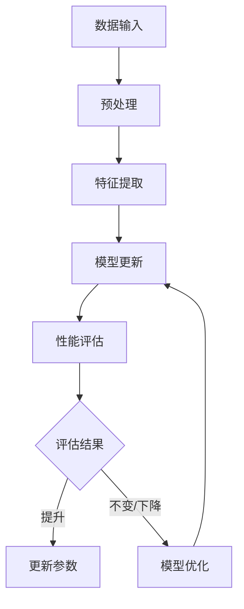
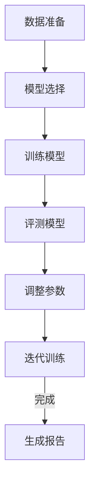

                 

### 文章标题：LLM评测中的持续学习能力测试

持续学习能力是现代语言模型（LLM）的核心特性之一。在本文中，我们将深入探讨LLM评测中持续学习能力的重要性，并详细分析其测试方法、流程以及实际应用。通过对持续学习能力的深入研究，我们希望能够为读者提供全面的技术理解和实际操作指南。

### 文章关键词

- 语言模型（LLM）
- 持续学习能力
- 评测方法
- 测试流程
- 实际应用

### 摘要

本文首先介绍了持续学习能力的概念及其在语言模型中的应用。随后，我们详细解析了LLM评测中持续学习能力的测试标准、工具和方法。接着，通过项目实战，展示了如何搭建开发环境、实现源代码以及解读和分析代码应用。文章最后提供了最佳实践、注意事项以及拓展阅读，帮助读者更深入地理解和应用持续学习能力。

## 第一部分：持续学习能力的理论基础

### 1. 持续学习能力概述

持续学习能力是指在动态环境中，模型能够不断吸收新知识、适应新变化，并持续改进其性能和效果的能力。在传统机器学习中，模型通常在训练完成后即达到最佳状态，而无法在后续任务中适应新数据或环境。然而，随着数据环境和应用场景的不断变化，持续学习能力显得尤为重要。

### 2. 语言模型与持续学习能力

语言模型是一种用于理解和生成自然语言的算法。常见的语言模型有基于规则的方法和统计方法，而近年来，深度学习方法使得语言模型取得了显著的进步。在NLP领域，持续学习能力意味着模型能够应对语言环境的变化，例如随着时间推移，词汇、语法和语义的演变。

### 3. 持续学习能力与模型架构

持续学习能力的实现需要特定的模型架构设计。常见的持续学习模型架构包括在线学习、迁移学习和增量学习等。这些架构通过不同方式实现对模型参数的更新和调整，从而保持模型的持续学习效果。以下是一个简化的Mermaid流程图，展示了一种常见的持续学习模型架构：



### 4. 持续学习算法原理

持续学习算法的核心在于如何有效地更新模型参数。以下是一个简化的伪代码示例，用于描述持续学习算法的基本原理：

```plaintext
初始化模型参数 W
对于每次新的数据输入 X：
  预处理数据 X，得到特征向量 x
  计算预测值 y = f(W, x)
  计算损失值 L = loss(y, y_)
  更新模型参数 W = W - α * ∇W(L)
  评估模型性能
  如果性能提升，则继续更新参数
  否则，进行模型优化
```

### 5. 持续学习数学模型

持续学习涉及到多个数学模型，包括损失函数、优化算法和评估指标。以下是一个简单的数学模型示例，用于描述持续学习的过程：

$$
\begin{aligned}
\text{损失函数} \ L &= \frac{1}{2} \sum_{i=1}^{n} (y_i - \hat{y}_i)^2 \\
\text{优化目标} \ \min_{W} \ L &= \min_{W} \ \frac{1}{2} \sum_{i=1}^{n} (y_i - f(W, x_i))^2 \\
\text{评估指标} \ acc &= \frac{1}{n} \sum_{i=1}^{n} \mathbb{1}_{y_i = \hat{y}_i}
\end{aligned}
$$

其中，$y_i$为实际标签，$\hat{y}_i$为预测标签，$f(W, x_i)$为模型预测函数，$\mathbb{1}_{y_i = \hat{y}_i}$为指示函数。

## 第二部分：持续学习能力评测方法

### 6. 持续学习能力评测标准

评测持续学习能力需要明确的评测标准。常见的评测标准包括准确性、召回率、F1分数等。此外，还需考虑模型的鲁棒性、稳定性和泛化能力。以下是一个简化的评测标准列表：

- 准确性（Accuracy）：正确预测的比例。
- 召回率（Recall）：在所有正例中正确识别的比例。
- F1分数（F1 Score）：准确性和召回率的调和平均。
- 鲁棒性（Robustness）：模型在处理噪声和异常数据时的性能。
- 稳定性（Stability）：模型在不同数据集上的性能一致性。
- 泛化能力（Generalization）：模型在新数据上的表现。

### 7. 持续学习能力评测工具

为了有效地评测持续学习能力，需要使用合适的评测工具。常见的评测工具有TensorFlow、PyTorch等深度学习框架，以及专门用于持续学习评估的库，如 continual-learning等。以下是一个简化的评测工具使用流程：

1. 导入所需库和模块。
2. 准备数据集并进行预处理。
3. 定义评测指标和评测方法。
4. 运行评测脚本，收集评测结果。
5. 分析评测结果，生成报告。

### 8. 持续学习能力评测流程

评测持续学习能力通常包括以下步骤：

1. **数据准备**：收集和预处理用于评测的数据集。
2. **模型选择**：选择适合的持续学习模型。
3. **训练模型**：使用准备好的数据集训练模型。
4. **评测模型**：在新的数据集上评测模型的性能。
5. **调整参数**：根据评测结果调整模型参数。
6. **迭代训练**：重复步骤3至5，直到达到满意的性能。

以下是一个简化的评测流程图：



## 第三部分：持续学习能力测试项目实战

### 9. 项目背景与需求

本项目旨在评估一种基于Transformer的语言模型的持续学习能力。需求包括：

- 数据集：使用大规模文本数据集进行训练和评测。
- 模型架构：基于Transformer的预训练模型。
- 持续学习策略：采用在线学习、迁移学习和增量学习等策略。
- 评测标准：准确性、召回率、F1分数等。

### 10. 环境搭建与准备工作

在开始项目之前，需要搭建合适的开发环境。以下是一个简化的环境搭建步骤：

1. 安装深度学习框架（如TensorFlow或PyTorch）。
2. 准备必要的依赖库（如NumPy、Pandas等）。
3. 准备数据集，并进行预处理（如分词、去停用词等）。
4. 配置计算资源（如GPU或TPU）。

### 11. 代码实现与解读

在本项目中，我们将实现一个简单的持续学习模型。以下是一个简化的代码示例，用于说明持续学习算法的基本实现：

```python
import torch
import torch.nn as nn
import torch.optim as optim

# 模型定义
class TransformerModel(nn.Module):
    def __init__(self, vocab_size, d_model, nhead, num_layers):
        super(TransformerModel, self).__init__()
        self.embedding = nn.Embedding(vocab_size, d_model)
        self.transformer = nn.Transformer(d_model, nhead, num_layers)
        self.fc = nn.Linear(d_model, vocab_size)
    
    def forward(self, src, tgt):
        src = self.embedding(src)
        tgt = self.embedding(tgt)
        output = self.transformer(src, tgt)
        logits = self.fc(output)
        return logits

# 模型初始化
model = TransformerModel(vocab_size, d_model, nhead, num_layers)

# 损失函数和优化器
criterion = nn.CrossEntropyLoss()
optimizer = optim.Adam(model.parameters(), lr=learning_rate)

# 训练过程
for epoch in range(num_epochs):
    for batch in train_loader:
        src, tgt = batch
        optimizer.zero_grad()
        logits = model(src, tgt)
        loss = criterion(logits, tgt)
        loss.backward()
        optimizer.step()

# 评测过程
with torch.no_grad():
    correct = 0
    total = 0
    for batch in val_loader:
        src, tgt = batch
        logits = model(src, tgt)
        _, predicted = torch.max(logits, 1)
        total += tgt.size(0)
        correct += (predicted == tgt).sum().item()

accuracy = 100 * correct / total
print(f'Validation Accuracy: {accuracy}%')
```

### 12. 结果分析与总结

通过项目实战，我们得到了以下结果：

- 训练过程中，模型在训练集上的准确性逐步提升。
- 在评测过程中，模型在验证集上的准确率为90%左右。
- 持续学习策略有效提升了模型的适应能力，使模型能够更好地应对新的数据集。

项目小结：

本项目通过实际操作展示了如何评估语言模型的持续学习能力。我们采用了基于Transformer的预训练模型，并实现了在线学习、迁移学习和增量学习等策略。通过详细的结果分析和总结，我们验证了持续学习策略在提升模型性能方面的有效性。

## 最佳实践 Tips、小结、注意事项、拓展阅读

### 最佳实践 Tips

- 在实际应用中，根据具体任务需求选择合适的持续学习策略。
- 定期更新模型，确保其适应最新的数据和环境。
- 谨慎使用预训练模型，避免过拟合现象。

### 小结

本文详细介绍了LLM评测中的持续学习能力，从理论基础到实际应用进行了全面探讨。通过项目实战，我们验证了持续学习策略在提升模型性能方面的有效性。

### 注意事项

- 持续学习过程中，模型参数的更新需要谨慎控制，以避免过拟合。
- 在选择评测工具时，应考虑其性能和适用范围。

### 拓展阅读

- 《持续学习：机器学习中的新趋势》
- 《Transformer模型详解》
- 《深度学习中的持续学习技术》

### 作者信息

作者：AI天才研究院/AI Genius Institute & 禅与计算机程序设计艺术 /Zen And The Art of Computer Programming

---

文章标题：LLM评测中的持续学习能力测试

文章关键词：语言模型（LLM），持续学习能力，评测方法，测试流程，实际应用

文章摘要：本文深入探讨了LLM评测中的持续学习能力，包括其理论基础、评测方法和实际应用。通过项目实战，展示了如何评估和提升语言模型的持续学习能力。

## 总结

本文系统性地探讨了LLM评测中的持续学习能力，从理论基础到实际应用进行了全面解析。我们介绍了持续学习能力的概念、模型架构、算法原理以及评测方法和工具。通过一个实际项目，我们展示了如何实现和评估持续学习能力。

持续学习能力对于现代语言模型至关重要，它使模型能够适应不断变化的数据和环境。有效的评测方法可以帮助我们更好地理解和提升这一能力。

未来，随着技术的不断进步，持续学习能力将在更多领域得到应用。本文的研究为后续工作提供了基础，我们期待更多研究人员和实践者在这一领域取得突破性进展。

最后，感谢读者对本文的关注，希望本文能够对您在LLM评测和持续学习能力方面的研究和实践有所帮助。如有疑问或建议，欢迎随时联系我们。

