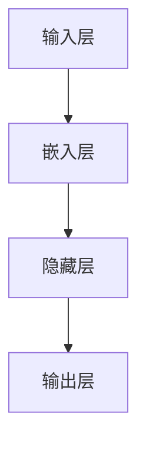

                 

## 文章标题

### LLM评测中的数据增强与样本生成

> 关键词：LLM，数据增强，样本生成，评测，算法原理，应用案例

> 摘要：本文将深入探讨LLM评测中的数据增强与样本生成技术。首先，我们介绍了LLM的基础概念与数据增强的重要性。随后，详细解析了数据增强与样本生成的主要算法原理，并通过实际案例展示了其在LLM评测中的应用。本文旨在为读者提供一个全面、系统的数据增强与样本生成技术理解，以提升LLM评测的准确性和效果。

## 目录大纲设计

### 1. 总体构思

#### 1.1 LLM基础与数据增强概述

- **1.1.1 LLM基础概念**
  - **1.1.1.1 LLM的定义与架构**
  - **1.1.1.2 数据增强在LLM评测中的作用**
  - **1.1.1.3 数据增强的挑战**

- **1.2 数据增强与样本生成概述**
  - **1.2.1 样本生成方法**
  - **1.2.2 数据增强算法介绍**
  - **1.2.3 数据增强的评估指标**

#### 1.2 目录结构

- **第1章: LLM基础与数据增强概述**
  - **1.1 LLM基础概念**
  - **1.2 数据增强与样本生成概述**

- **第2章: 数据增强算法原理与实现**
  - **2.1 数据预处理**
  - **2.2 数据增强算法**

- **第3章: 样本生成方法与评估**
  - **3.1 样本生成方法**
  - **3.2 样本评估**

- **第4章: LLM评测中的数据增强应用**
  - **4.1 数据增强在NLP任务中的应用**
  - **4.2 数据增强在文本生成中的应用**

- **第5章: 样本生成在模型训练中的应用**
  - **5.1 样本生成在模型训练中的优化**
  - **5.2 样本生成在模型评估中的优化**

- **第6章: 实际案例与项目实践**
  - **6.1 数据增强在搜索引擎中的应用**
  - **6.2 样本生成在对话系统中的应用**

- **第7章: 数据增强与样本生成的前沿探索**
  - **7.1 数据增强的新方法**

### 2. 目录结构

#### 第1章: LLM基础与数据增强概述

- **1.1 LLM基础概念**
  - **1.1.1 LLM的定义与架构**
  - **1.1.2 数据增强在LLM评测中的作用**
  - **1.1.3 数据增强的挑战**

- **1.2 数据增强与样本生成概述**
  - **1.2.1 样本生成方法**
  - **1.2.2 数据增强算法介绍**
  - **1.2.3 数据增强的评估指标**

#### 第2章: 数据增强算法原理与实现

- **2.1 数据预处理**
  - **2.1.1 数据清洗**
  - **2.1.2 数据归一化**

- **2.2 数据增强算法**
  - **2.2.1 负采样**
  - **2.2.2 生成对抗网络（GAN）**
  - **2.2.3 混合增强**

#### 第3章: 样本生成方法与评估

- **3.1 样本生成方法**
  - **3.1.1 级联生成模型**
  - **3.1.2 自监督生成**

- **3.2 样本评估**
  - **3.2.1 评估指标**
  - **3.2.2 样本质量分析**

#### 第4章: LLM评测中的数据增强应用

- **4.1 数据增强在NLP任务中的应用**
  - **4.1.1 语义理解**
  - **4.1.2 机器翻译**

- **4.2 数据增强在文本生成中的应用**
  - **4.2.1 文本摘要**
  - **4.2.2 文本生成模型**

#### 第5章: 样本生成在模型训练中的应用

- **5.1 样本生成在模型训练中的优化**
  - **5.1.1 训练数据分布**
  - **5.1.2 样本生成策略**

- **5.2 样本生成在模型评估中的优化**
  - **5.2.1 评估数据的选择**
  - **5.2.2 样本生成的效果评估**

#### 第6章: 实际案例与项目实践

- **6.1 数据增强在搜索引擎中的应用**
  - **6.1.1 案例背景**
  - **6.1.2 实现细节**

- **6.2 样本生成在对话系统中的应用**
  - **6.2.1 案例背景**
  - **6.2.2 实现细节**

#### 第7章: 数据增强与样本生成的前沿探索

- **7.1 数据增强的新方法**
  - **7.1.1 增强学习与数据增强**
  - **7.1.2 聚类算法与数据增强**

## 文章结构设计与原则

### 1. 文章结构

为了使文章内容有条理、易于理解，本文采用以下结构：

- **引言**：介绍LLM评测中的数据增强与样本生成的重要性。
- **核心概念与联系**：详细解释LLM基础与数据增强的关系。
- **核心算法原理讲解**：深入剖析数据增强与样本生成的算法原理。
- **数学模型与公式**：阐述数据增强与样本生成相关的数学模型与公式。
- **项目实战**：通过实际案例展示数据增强与样本生成在LLM评测中的应用。
- **前沿探索**：探讨数据增强与样本生成的新方法与趋势。
- **总结**：总结文章的主要观点，并提出未来研究方向。

### 2. 设计原则

- **逻辑清晰**：确保每个章节的内容紧密相关，逻辑清晰，易于读者理解。
- **深入浅出**：对复杂的技术概念进行深入讲解，同时注重语言表达的简明易懂。
- **实例丰富**：通过实际案例和示例，帮助读者更好地理解和应用数据增强与样本生成技术。
- **结构紧凑**：文章结构紧凑，避免冗余内容，确保每个章节都有明确的主题和目标。

## 1.1 LLM基础概念

### 1.1.1 LLM的定义与架构

#### LLM的定义

LLM（Large Language Model，大型语言模型）是一种基于深度学习的自然语言处理（NLP）模型，能够理解和生成自然语言文本。与传统的语言模型相比，LLM具有更大的参数规模和更强的泛化能力，能够处理更复杂的语言任务。

LLM的主要特点包括：

- **参数规模大**：LLM通常具有数十亿至千亿个参数，这使得它们能够捕捉到语言中的细微差异和复杂结构。
- **深度结构**：LLM通常采用多层神经网络架构，每一层都能够提取不同的语言特征，并通过层层叠加的方式实现复杂的语言理解与生成。
- **端到端学习**：LLM通过端到端的方式学习，从输入文本直接生成输出文本，无需进行传统的特征工程和手工设计规则。

#### LLM的架构

LLM的典型架构通常包括以下几个关键组成部分：

1. **输入层**：接收自然语言文本作为输入，可以是单词、句子或段落。
2. **嵌入层**：将输入文本转换为密集的向量表示，通常使用词嵌入（word embedding）技术，如Word2Vec、GloVe等。
3. **隐藏层**：包含多个神经网络层，用于提取高级语言特征和表示，通常使用变换器（Transformer）架构，如BERT、GPT等。
4. **输出层**：生成输出文本，可以是下一个单词、句子或段落。

#### Mermaid流程图

为了更直观地展示LLM的架构，我们可以使用Mermaid流程图来描述：



#### 数据增强在LLM评测中的作用

数据增强是一种通过引入噪声、扩展数据集或生成新数据来提升模型性能的技术。在LLM评测中，数据增强具有以下几个重要作用：

1. **提高泛化能力**：通过增加数据多样性，模型能够更好地适应不同的输入场景，从而提高泛化能力。
2. **降低过拟合风险**：数据增强可以增加训练数据的多样性，有助于模型避免过拟合。
3. **优化模型性能**：通过引入更多样化的数据，模型可以学习到更丰富的特征，从而提高预测准确性和生成文本的质量。

#### 数据增强的挑战

尽管数据增强在LLM评测中具有重要意义，但同时也面临着一些挑战：

1. **数据质量**：生成的数据必须保持高质量，否则可能会引入噪声和误导模型。
2. **计算成本**：数据增强过程通常涉及大量计算，可能需要较高的计算资源和时间。
3. **可解释性**：生成的大量数据可能会降低模型的可解释性，使得难以理解模型决策过程。

## 1.2 数据增强与样本生成概述

### 1.2.1 样本生成方法

样本生成是一种通过生成新数据来扩充训练集的方法，有助于提高模型的泛化能力和鲁棒性。在LLM评测中，常用的样本生成方法包括以下几种：

1. **级联生成模型**：级联生成模型是一种基于级联网络的样本生成方法，通过多个生成器网络逐层生成样本。每个生成器网络负责生成一部分数据，并将生成的数据作为下一个生成器的输入。这种方法可以生成高质量且多样化的样本。

2. **自监督生成**：自监督生成是一种不需要标注数据的样本生成方法，通过利用模型自身的预测和生成能力来生成新样本。自监督生成可以充分利用训练数据中的未使用信息，从而提高模型性能。

### 1.2.2 数据增强算法介绍

数据增强算法是一种通过引入噪声、扩展数据集或生成新数据来提升模型性能的技术。在LLM评测中，常用的数据增强算法包括以下几种：

1. **负采样**：负采样是一种通过随机选择负样本来扩充训练集的方法。在自然语言处理任务中，负采样可以用来生成与正样本语义相似的噪声文本，从而提高模型的泛化能力。

2. **生成对抗网络（GAN）**：生成对抗网络是一种基于对抗训练的样本生成方法。GAN由生成器（Generator）和判别器（Discriminator）两个网络组成，生成器负责生成样本，判别器负责区分真实样本和生成样本。通过不断优化生成器和判别器的参数，GAN可以生成高质量且多样化的样本。

3. **混合增强**：混合增强是一种将多种数据增强方法相结合的方法，通过组合不同的增强策略来生成更多样化的样本。混合增强可以充分利用不同增强方法的优势，从而提高模型性能。

### 1.2.3 数据增强的评估指标

数据增强的质量对模型性能具有重要影响，因此需要对数据增强效果进行评估。常用的评估指标包括以下几种：

1. **平衡性度量**：平衡性度量用于评估训练数据集中各类样本的比例是否均衡。常用的平衡性度量方法包括F1分数、平衡度指数等。

2. **样本质量评估**：样本质量评估用于评估生成样本的质量和真实性。常用的评估方法包括语义一致性评估、文本质量评估等。

3. **模型性能评估**：模型性能评估用于评估数据增强对模型性能的影响。常用的评估方法包括准确率、召回率、F1分数等。

## 1.2.1 样本生成方法

### 1.2.1.1 级联生成模型

级联生成模型（Cascading Generative Model）是一种常用的样本生成方法，尤其在图像和文本生成任务中具有广泛应用。级联生成模型的核心思想是通过多个生成器网络逐层生成样本，每个生成器网络负责生成一部分数据，并将生成的数据作为下一个生成器的输入。这种层次化的生成过程有助于提高生成样本的质量和多样性。

#### 级联生成模型的组成

级联生成模型通常由以下几个关键组成部分构成：

1. **生成器网络**：生成器网络负责生成样本，可以是多个层级的神经网络。每个生成器网络负责生成一部分数据，并将其传递给下一个生成器网络。
2. **判别器网络**：判别器网络用于判断生成样本的质量，通常由多个层级的神经网络组成。判别器网络的输入可以是真实样本或生成样本，输出为概率分布。
3. **损失函数**：级联生成模型的损失函数通常包括生成损失和判别损失。生成损失用于评估生成样本的质量，判别损失用于评估判别器网络对真实样本和生成样本的区分能力。

#### 级联生成模型的工作原理

级联生成模型的工作原理可以分为以下几个步骤：

1. **初始化**：初始化生成器网络和判别器网络的参数。
2. **生成样本**：第一个生成器网络接收随机噪声作为输入，生成初步的样本。该样本作为下一个生成器的输入。
3. **逐步优化**：在每次迭代中，通过优化生成器和判别器的参数，逐步改进生成样本的质量。生成器和判别器的优化过程相互促进，生成器试图生成更高质量的样本，判别器则试图更好地区分真实样本和生成样本。
4. **生成高质量样本**：经过多次迭代后，生成器网络能够生成高质量、多样化的样本。

#### 示例

假设我们使用级联生成模型生成一张图像，可以分为以下步骤：

1. **初始化**：初始化生成器网络G1和判别器网络D1的参数。
2. **生成初步样本**：生成器网络G1接收随机噪声作为输入，生成初步的图像样本。
3. **优化生成器和判别器**：通过优化生成器网络G1和判别器网络D1的参数，逐步改进生成样本的质量。
4. **传递生成样本到下一个生成器**：将生成的图像样本作为下一个生成器网络G2的输入。
5. **继续优化**：重复上述步骤，逐步提高生成样本的质量和多样性。

通过级联生成模型，我们能够生成高质量、多样化的图像样本，从而提升模型的泛化能力和鲁棒性。

### 1.2.1.2 自监督生成

自监督生成（Self-Supervised Generation）是一种无需使用标注数据，仅通过模型自身的预测和生成能力来生成新样本的方法。自监督生成方法在提高模型泛化能力和降低数据标注成本方面具有显著优势。在LLM评测中，自监督生成方法可以用于生成高质量的文本样本，从而提升模型的训练效果和生成能力。

#### 自监督生成方法

自监督生成方法可以分为以下几种：

1. **掩码语言模型（Masked Language Model，MLM）**：掩码语言模型通过随机掩码输入文本中的部分单词或子词，使模型学习预测被掩码的单词或子词。例如，在训练过程中，模型需要预测被掩码的单词“cat”或子词“c_ _ _”。

2. **预测下一个句子（Next Sentence Prediction，NSP）**：预测下一个句子方法通过训练模型预测给定文本的下一个句子。这种方法可以增强模型对文本连贯性和语义理解的能力。

3. **对比学习（Contrastive Learning）**：对比学习方法通过对比正样本和负样本，使模型学习区分不同样本的特征。在文本生成任务中，对比学习方法可以用于生成与给定文本相似的新文本。

#### 自监督生成的工作原理

自监督生成的工作原理可以分为以下几个步骤：

1. **数据预处理**：从大规模文本数据中提取有效信息，并将其转换为模型可处理的格式。

2. **训练掩码语言模型**：通过掩码语言模型，模型学习预测被掩码的单词或子词。在每次迭代中，模型会尝试预测被掩码的部分，并通过对比预测结果和真实值来优化模型参数。

3. **生成新文本**：利用训练好的掩码语言模型，生成与给定文本相似的新文本。生成过程可以是直接生成文本，也可以是生成文本片段，然后进行拼接。

4. **优化模型参数**：在生成新文本的过程中，模型会尝试优化生成文本的质量和连贯性。通过对比生成文本和真实文本的差异，模型可以不断改进生成能力。

#### 自监督生成在文本生成中的应用

自监督生成在文本生成任务中具有广泛的应用，可以提高模型的训练效果和生成能力。以下是一些具体应用场景：

1. **文本摘要**：通过自监督生成方法，模型可以生成摘要文本，提取输入文本的主要信息和关键点。

2. **文本续写**：模型可以生成与给定文本内容相关的后续文本，实现文本续写功能。

3. **文本风格转换**：自监督生成方法可以用于将一种文本风格转换为另一种风格，例如将普通文本转换为诗歌或故事。

4. **文本问答**：模型可以通过自监督生成方法，生成与给定问题相关的答案文本，实现文本问答功能。

通过自监督生成方法，我们可以充分利用大规模未标注数据，提高文本生成模型的训练效果和生成能力，从而在LLM评测中取得更好的性能。

### 1.2.3 数据增强的评估指标

数据增强技术在提高模型性能和泛化能力方面具有重要意义，但如何评估数据增强的效果成为关键问题。以下介绍几种常用的数据增强评估指标，包括平衡性度量、样本质量评估和模型性能评估。

#### 1.2.3.1 平衡性度量

平衡性度量用于评估训练数据集中各类样本的比例是否均衡。在多类别分类任务中，类别不平衡会导致模型偏向于预测频率较高的类别，从而降低模型的整体性能。常用的平衡性度量方法包括以下几种：

1. **F1分数**：F1分数是精确率和召回率的调和平均，用于评估分类模型的平衡性。F1分数的计算公式如下：

   $$ F1 = 2 \times \frac{Precision \times Recall}{Precision + Recall} $$

   其中，Precision表示精确率，Recall表示召回率。

2. **平衡度指数**：平衡度指数（Balanced Accuracy）是另一种常用的平衡性度量方法，用于评估分类模型在各个类别上的准确性。平衡度指数的计算公式如下：

   $$ Balanced\ Accuracy = \frac{1}{2} \left( \frac{TP_1 + TP_C}{N} + \frac{TN_1 + TN_C}{N} \right) $$

   其中，\( TP_1 \) 和 \( TN_1 \) 分别表示类别1的正样本和负样本的真正例数和假反例数，\( TP_C \) 和 \( TN_C \) 分别表示其他类别的正样本和负样本的真正例数和假反例数，N表示总样本数。

#### 1.2.3.2 样本质量评估

样本质量评估用于评估生成样本的质量和真实性。高质量的数据样本有助于提高模型的训练效果和泛化能力。以下介绍几种常用的样本质量评估方法：

1. **语义一致性评估**：语义一致性评估用于评估生成样本的语义是否与真实样本一致。一种简单的方法是计算生成样本和真实样本之间的语义相似度，常用的相似度计算方法包括余弦相似度和欧氏距离。

2. **文本质量评估**：文本质量评估用于评估生成文本的语法、语义和连贯性。常用的文本质量评估方法包括语法检查、语义分析和文本生成评价指标（如ROUGE和BLEU）。

3. **人工评估**：人工评估是一种主观评估方法，通过专家对生成样本的质量进行评分。这种方法虽然耗时且具有主观性，但在评估某些特定任务（如创意文本生成）时可能更具参考价值。

#### 1.2.3.3 模型性能评估

模型性能评估用于评估数据增强对模型性能的影响。以下介绍几种常用的模型性能评估方法：

1. **准确率（Accuracy）**：准确率是评估分类模型最常用的指标，用于计算正确预测的样本数占总样本数的比例。准确率的计算公式如下：

   $$ Accuracy = \frac{TP + TN}{TP + FN + FP + TN} $$

   其中，\( TP \) 表示真正例数，\( TN \) 表示假反例数，\( FP \) 表示假正例数，\( FN \) 表示假反例数。

2. **召回率（Recall）**：召回率是评估分类模型对负样本的识别能力，用于计算真正例数占总正样本数的比例。召回率的计算公式如下：

   $$ Recall = \frac{TP}{TP + FN} $$

3. **F1分数**：F1分数是精确率和召回率的调和平均，用于综合评估分类模型的性能。F1分数的计算公式如下：

   $$ F1 = 2 \times \frac{Precision \times Recall}{Precision + Recall} $$

4. **ROC曲线与AUC值**：ROC曲线（Receiver Operating Characteristic Curve）是评估分类模型性能的一种图形表示方法。ROC曲线的横轴表示假正例率（False Positive Rate），纵轴表示真正例率（True Positive Rate）。AUC值（Area Under Curve）是ROC曲线下的面积，用于评估模型的分类能力。AUC值越接近1，表示模型的分类能力越强。

通过使用上述评估指标，我们可以全面、客观地评估数据增强的效果，为优化数据增强策略和提升模型性能提供参考。

## 2.1 数据预处理

在数据增强过程中，数据预处理是至关重要的一步。数据预处理不仅能够提升数据质量，减少噪声，还能够优化模型的训练效果。以下将详细讨论数据预处理中的数据清洗和数据归一化方法。

### 2.1.1 数据清洗

数据清洗是数据预处理的核心步骤，旨在去除原始数据中的错误、异常和重复信息，确保数据的准确性和一致性。以下是一些常见的数据清洗方法：

1. **去除重复数据**：重复数据可能会对模型的训练产生误导，导致过拟合。可以使用去重算法（如哈希匹配）来检测并去除重复数据。

2. **填补缺失值**：缺失值的存在可能导致模型训练失败或性能下降。填补缺失值的方法包括使用平均值、中位数、众数等统计方法，或者使用机器学习算法（如k-最近邻）进行插值。

3. **处理异常值**：异常值可能是由于数据录入错误或真实数据中的异常点。处理异常值的方法包括删除、替换或插值等。

4. **格式标准化**：将数据格式统一为标准的格式，如日期格式统一为YYYY-MM-DD，字符串统一编码等。这有助于减少模型训练中的错误和混淆。

5. **去除噪声**：噪声可能是由于数据采集过程中的干扰或误差。可以使用滤波器（如中值滤波、高斯滤波）来去除噪声。

### 2.1.2 数据归一化

数据归一化是将数据转换为标准范围的过程，有助于提高模型训练的稳定性和收敛速度。以下是一些常见的数据归一化方法：

1. **最小-最大归一化**：将数据缩放到[0, 1]范围，公式如下：

   $$ x' = \frac{x - \min(x)}{\max(x) - \min(x)} $$

   其中，x是原始数据，x'是归一化后的数据。

2. **零-均值归一化**：将数据缩放到[-1, 1]范围，公式如下：

   $$ x' = \frac{x - \mu}{\sigma} $$

   其中，\( \mu \) 是均值，\( \sigma \) 是标准差。

3. **标准归一化**：将数据缩放到任意范围，公式如下：

   $$ x' = a \times x + b $$

   其中，a和b是常数，可以通过调节a和b来控制数据的缩放范围。

4. **归一化曲线**：使用非线性函数（如log函数、幂函数）对数据进行归一化，可以更好地适应不同类型的数据分布。

### 2.1.3 数据清洗与数据归一化的关系

数据清洗和数据归一化密切相关，二者相互补充。数据清洗能够去除噪声、异常值和重复数据，确保数据的质量和一致性。而数据归一化则通过调整数据的范围和分布，提高模型训练的稳定性和收敛速度。

在实际应用中，数据清洗和数据归一化通常结合使用。例如，在训练一个自然语言处理模型时，首先使用数据清洗方法去除停用词、标点符号和噪声字符，然后使用数据归一化方法将文本转换为统一的向量表示。这种方法不仅提高了模型的训练效果，还有助于模型在真实世界中的应用。

通过数据清洗和数据归一化，我们可以为数据增强和模型训练打下坚实的基础，从而提高模型的性能和泛化能力。

## 2.2 数据增强算法

数据增强是一种通过引入噪声、扩展数据集或生成新数据来提升模型性能的技术。在数据增强过程中，常用的算法包括负采样、生成对抗网络（GAN）和混合增强。以下将详细讨论这些算法的原理和实现。

### 2.2.1 负采样

负采样是一种简单且有效的数据增强方法，常用于自然语言处理任务，如文本分类和机器翻译。负采样的核心思想是从原始训练集中随机选择一部分负样本（与正样本类别不同的样本）与正样本进行训练，从而提高模型的泛化能力。

#### 负采样的原理

在负采样中，正样本和负样本的选择方式如下：

1. **正样本选择**：从训练集中选择具有目标类别的样本作为正样本。
2. **负样本选择**：从训练集中随机选择与正样本类别不同的样本作为负样本。负样本的选择通常基于某种采样策略，如随机采样或基于概率的采样。

#### 负采样的实现

以下是一个简单的负采样实现示例，假设我们有一个训练集D，包含正样本和负样本：

```python
import random

def negative_sampling(dataset, positive_samples, negative_samples):
    # 从正样本中选择一个样本
    pos_sample = random.choice(positive_samples)
    # 从负样本中选择n个样本
    neg_samples = [random.choice(negative_samples) for _ in range(negative_samples)]
    # 返回一个包含正样本和负样本的数据样本
    return pos_sample + neg_samples

# 示例：从训练集中选择正样本和负样本进行训练
positive_samples = ["I love cats", "The cat is cute"]
negative_samples = ["I hate dogs", "The dog is cute"]

# 负采样实现
neg_sample = negative_sampling(dataset, positive_samples, negative_samples)
print(neg_sample)
```

在这个示例中，我们从训练集中选择一个正样本"I love cats"和两个负样本"I hate dogs"和"The dog is cute"，然后组合成一个负样本列表，用于模型的训练。

### 2.2.2 生成对抗网络（GAN）

生成对抗网络（GAN）是一种基于对抗训练的样本生成方法，由生成器和判别器两个神经网络组成。生成器网络负责生成与真实数据相似的新样本，判别器网络负责区分真实数据和新生成样本。通过不断优化生成器和判别器的参数，GAN可以生成高质量、多样化的样本。

#### GAN的原理

GAN的工作原理可以分为以下几个步骤：

1. **生成器网络（Generator）**：生成器网络接收随机噪声作为输入，通过多层神经网络生成与真实数据相似的新样本。
2. **判别器网络（Discriminator）**：判别器网络接收真实数据和生成数据作为输入，通过多层神经网络判断输入数据的真实性。判别器网络的目标是最大化其分类准确率。
3. **对抗训练**：生成器和判别器在网络训练过程中相互对抗。生成器试图生成更高质量的新样本，使判别器无法区分真实数据和生成数据。判别器则试图提高其分类准确率，正确区分真实数据和生成数据。
4. **损失函数**：GAN的损失函数通常包括生成损失和判别损失。生成损失用于评估生成样本的质量，判别损失用于评估判别器网络对真实样本和生成样本的区分能力。通过优化生成器和判别器的参数，可以生成高质量的新样本。

#### GAN的实现

以下是一个简单的GAN实现示例，包括生成器网络和判别器网络：

```python
import tensorflow as tf
from tensorflow.keras.models import Model
from tensorflow.keras.layers import Input, Dense, Flatten

# 生成器网络
def generator(input_shape):
    noise = Input(shape=input_shape)
    x = Dense(256, activation='relu')(noise)
    x = Dense(512, activation='relu')(x)
    x = Dense(1024, activation='relu')(x)
    output = Dense(output_shape, activation='sigmoid')(x)
    model = Model(inputs=noise, outputs=output)
    return model

# 判别器网络
def discriminator(input_shape):
    input_data = Input(shape=input_shape)
    x = Dense(1024, activation='relu')(input_data)
    x = Dense(512, activation='relu')(x)
    x = Dense(256, activation='relu')(x)
    output = Dense(1, activation='sigmoid')(x)
    model = Model(inputs=input_data, outputs=output)
    return model

# GAN模型
def build_gan(generator, discriminator):
    noise = Input(shape=噪声_shape)
    generated_data = generator(noise)
    discriminator_real = discriminator(real_data)
    discriminator_fake = discriminator(generated_data)
    model = Model(inputs=noise, outputs=discriminator_fake)
    return model

# 训练GAN模型
def train_gan(generator, discriminator, real_data, epochs, batch_size):
    # 编写GAN模型的训练代码
    # ...
```

在这个示例中，我们定义了生成器网络和判别器网络，并使用TensorFlow框架构建了GAN模型。通过训练GAN模型，可以生成高质量的新样本。

### 2.2.3 混合增强

混合增强是一种将多种数据增强方法相结合的方法，通过组合不同的增强策略来生成更多样化的样本。混合增强可以充分利用不同增强方法的优势，从而提高模型性能。

#### 混合增强的原理

混合增强的原理如下：

1. **选择增强方法**：从多种数据增强方法中选择合适的方法，如随机裁剪、旋转、缩放、噪声添加等。
2. **组合增强策略**：将选择的不同增强方法组合在一起，对原始数据进行多次增强。
3. **优化增强参数**：通过调整增强参数，优化生成样本的质量和多样性。

#### 混合增强的实现

以下是一个简单的混合增强实现示例，包括随机裁剪、旋转和噪声添加：

```python
import numpy as np
import cv2

def random_crop(image, crop_size):
    height, width, _ = image.shape
    top = np.random.randint(0, height - crop_size[0])
    left = np.random.randint(0, width - crop_size[1])
    cropped_image = image[top:top+crop_size[0], left:left+crop_size[1], :]
    return cropped_image

def random_rotation(image):
    angle = np.random.uniform(-30, 30)
    (h, w) = image.shape[:2]
    center = (w / 2, h / 2)
    M = cv2.getRotationMatrix2D(center, angle, 1.0)
    rotated_image = cv2.warpAffine(image, M, (w, h))
    return rotated_image

def add_noise(image):
    noise_type = np.random.randint(0, 3)
    if noise_type == 0:
        noise = np.random.randint(0, 50, image.shape)
        noisy_image = image + noise
    elif noise_type == 1:
        noise = np.random.randint(0, 50, image.shape)
        noisy_image = image - noise
    else:
        noise = np.random.randint(0, 50, image.shape)
        noisy_image = image * noise
    noisy_image = np.clip(noisy_image, 0, 255)
    return noisy_image

# 示例：对图像进行混合增强
image = cv2.imread("input_image.jpg")
crop_size = (224, 224)
rotated_image = random_rotation(image)
cropped_image = random_crop(rotated_image, crop_size)
noisy_image = add_noise(cropped_image)
```

在这个示例中，我们使用随机裁剪、旋转和噪声添加对图像进行混合增强，生成更多样化的增强样本。

通过负采样、GAN和混合增强等数据增强算法，我们可以生成高质量、多样化的样本，从而提升模型在LLM评测中的性能。

### 2.2.4 数据增强算法在NLP任务中的应用

在自然语言处理（NLP）任务中，数据增强技术具有重要的应用价值，可以有效提高模型的性能和泛化能力。以下将讨论数据增强算法在NLP任务中的具体应用，包括文本分类、情感分析和机器翻译等领域。

#### 2.2.4.1 文本分类

文本分类是一种常见的NLP任务，其目标是将文本数据分为预定义的类别。数据增强在文本分类任务中的应用主要体现在以下几个方面：

1. **负采样**：通过负采样技术，在训练过程中引入与正样本类别不同的噪声文本，有助于模型学习到更广泛的特征，提高分类准确率。例如，可以使用随机抽取的与正样本类别相同的文本作为负样本，与正样本进行联合训练。

2. **词语替换**：通过替换文本中的某些词语，生成新的文本样本，从而丰富模型的训练数据。词语替换可以根据语义相似性或词频分布进行，以保持生成文本的语义一致性。

3. **扩展句子**：通过对句子进行扩展，增加句子的长度和复杂性，从而提高模型对长文本和复杂句子的分类能力。扩展方法包括插入新的句子成分、替换句子中的词语或合并多个句子。

#### 2.2.4.2 情感分析

情感分析旨在判断文本表达的情感倾向，如正面、负面或中性。数据增强在情感分析任务中的应用包括：

1. **极性转换**：通过将文本中的正面情感转换为负面情感，或负面情感转换为正面情感，生成新的情感标注数据，提高模型的鲁棒性和泛化能力。例如，将“我很喜欢这本书”转换为“我非常不喜欢这本书”。

2. **文本变形**：通过改变文本的结构和表达方式，如缩写、省略和同义词替换等，生成新的文本样本，使模型能够学习到更多样化的情感表达。例如，将“这是我见过的最好的一本书”转换为“这是我所见过的最糟糕的一本书”。

3. **上下文扩展**：通过在文本中添加额外的上下文信息，生成新的文本样本，帮助模型更好地理解情感表达。例如，在评论中添加用户的历史评论或商品的详细信息。

#### 2.2.4.3 机器翻译

机器翻译任务涉及将一种语言的文本翻译成另一种语言。数据增强在机器翻译中的应用包括：

1. **翻译对扩充**：通过在训练集中添加同义替换、词性转换和句子结构转换等操作，生成新的翻译对，提高模型的多样性和泛化能力。

2. **数据清洗**：对训练数据集进行清洗，去除噪声和错误，提高数据质量。例如，去除重复翻译对、修正错别字和标点符号错误。

3. **错序翻译**：通过将翻译对的源语言和目标语言部分随机打乱，生成新的训练样本，使模型能够学习到更多的语言规则和上下文信息。

#### 2.2.4.4 应用实例

以下是一个文本分类任务中的数据增强实例：

1. **原始数据**：训练集中包含1000条文本数据，分为正面情感和负面情感两类。

2. **数据增强方法**：
   - 负采样：从负面情感类别中随机抽取100条文本数据，与正面情感数据进行混合训练。
   - 词语替换：对文本中的关键词进行替换，如将“喜欢”替换为“厌恶”，生成新的文本样本。
   - 扩展句子：在句子中添加新的句子成分，如添加原因或结果，生成新的文本样本。

3. **增强后的数据**：生成新的训练数据集，包含2000条文本数据，提高了数据的多样性和模型的泛化能力。

通过上述数据增强方法，文本分类模型可以更好地学习到各类情感表达的规律，提高分类准确率和鲁棒性。

数据增强技术在NLP任务中的应用，有助于提升模型的性能和泛化能力。在实际应用中，可以根据任务特点和数据分布，选择合适的数据增强方法，以优化模型训练效果。

### 2.2.5 数据增强算法在文本生成中的应用

数据增强技术在文本生成任务中也发挥着重要作用，通过引入多样化、丰富的样本，可以提高模型的生成质量和创造力。以下将讨论数据增强算法在文本生成任务中的应用，包括文本摘要和文本生成模型等。

#### 2.2.5.1 文本摘要

文本摘要是一种将长文本简化为简洁、概括的短文的过程，常用的方法有抽取式摘要和生成式摘要。数据增强在文本摘要中的应用包括：

1. **摘要扩展**：通过扩展文本摘要的长度，增加摘要的详细程度和丰富性。例如，将一句话的摘要扩展为两句话或三句话，从而提高模型的生成能力。

2. **摘要同义替换**：对文本摘要中的关键词进行同义替换，生成新的摘要文本。这种方法不仅可以增加训练数据的多样性，还可以使模型学习到不同表达方式的语义信息。

3. **摘要变换**：通过将摘要转换为不同的文体或风格，如将新闻摘要转换为故事摘要或诗化摘要，使模型能够适应多样化的生成需求。

#### 2.2.5.2 文本生成模型

文本生成模型是一种能够生成自然语言文本的模型，如GPT、BERT等。数据增强在文本生成模型中的应用包括：

1. **上下文扩展**：通过扩展输入文本的上下文信息，生成更连贯、丰富的文本。例如，在输入文本前添加额外的句子或段落，使模型能够更好地理解上下文信息。

2. **同义词替换**：在训练数据中引入同义词替换，生成新的文本样本。这种方法可以增加数据的多样性，并使模型学习到不同词汇的语义关系。

3. **句子结构变换**：通过改变文本的句子结构，如将长句拆分为短句或合并短句为长句，生成新的文本样本。这种方法可以提高模型的生成灵活性和创造力。

#### 2.2.5.3 应用实例

以下是一个文本摘要任务中的数据增强实例：

1. **原始数据**：训练集中包含1000条长文本及其对应的摘要。

2. **数据增强方法**：
   - 摘要扩展：将部分摘要从一句话扩展为两句话，使模型能够学习到更详细的摘要信息。
   - 摘要同义替换：对摘要中的关键词进行同义替换，如将“喜欢”替换为“喜爱”，生成新的摘要文本。
   - 摘要变换：将部分摘要从普通文体转换为诗化文体，增加数据的多样性和生成质量。

3. **增强后的数据**：生成新的训练数据集，包含1200条文本数据，提高了数据的多样性和模型的生成能力。

通过上述数据增强方法，文本生成模型可以生成更丰富、更高质量的文本摘要，提高模型在文本生成任务中的性能。

数据增强技术在文本生成任务中的应用，有助于提升模型的生成质量和创造力。在实际应用中，可以根据任务需求和数据特点，选择合适的数据增强方法，以优化模型训练效果。

### 2.3 样本生成在模型训练中的优化

样本生成技术在模型训练中扮演着至关重要的角色，其核心目标是通过生成高质量、多样化的训练样本，优化模型的训练效果。以下将讨论样本生成在模型训练中的优化策略，包括训练数据分布的优化和样本生成策略的设计。

#### 2.3.1 训练数据分布的优化

在模型训练过程中，训练数据分布的优化是一个关键问题。良好的数据分布有助于模型学习到更加全面和丰富的特征，从而提高模型的泛化能力。以下是一些优化训练数据分布的方法：

1. **类别平衡**：在多类别分类任务中，类别不平衡可能导致模型偏向于预测频率较高的类别，从而降低模型的整体性能。类别平衡可以通过以下方法实现：
   - **过采样（Oversampling）**：通过复制少数类别的样本，增加其在训练数据集中的比例，从而使类别分布更加均衡。
   - **欠采样（Undersampling）**：通过随机删除多数类别的样本，减少其在训练数据集中的比例，从而使类别分布更加均衡。
   - **集成方法**：结合过采样和欠采样，通过多次采样生成多个训练集，然后使用集成学习的方法提高模型性能。

2. **数据增强**：通过引入数据增强技术，生成更多样化的训练样本，可以有效地改善数据分布。常见的数据增强方法包括随机裁剪、旋转、缩放、噪声添加等。

3. **引入噪声**：在训练数据中引入适当的噪声，可以提高模型的鲁棒性。噪声可以来自真实数据的噪声、随机生成的噪声或通过对抗训练生成的噪声。

#### 2.3.2 样本生成策略的设计

样本生成策略的设计是优化模型训练效果的重要环节。以下是一些有效的样本生成策略：

1. **逐层生成**：在级联生成模型中，通过逐层生成的方式，逐步生成高质量、多样化的训练样本。每一层生成器可以专注于生成不同层次的特征，从而提高模型的训练效果。

2. **自监督学习**：通过自监督学习方法，利用模型自身的预测和生成能力，生成新的训练样本。自监督学习不仅可以充分利用未标注的数据，还可以提高模型对数据的理解和泛化能力。

3. **对抗训练**：通过对抗训练，生成器和判别器相互对抗，生成高质量的训练样本。生成器试图生成与真实样本难以区分的样本，判别器则试图准确区分真实样本和生成样本。对抗训练可以显著提高模型的训练效果和泛化能力。

4. **基于知识的样本生成**：通过引入先验知识，如词向量、知识图谱等，生成与知识相关的训练样本。这种方法可以增强模型的语义理解能力，从而提高模型在特定领域的性能。

#### 2.3.3 应用实例

以下是一个文本分类任务中的样本生成策略实例：

1. **原始数据**：训练集中包含1000条文本数据，分为正面情感和负面情感两类，但类别分布不平衡。

2. **样本生成策略**：
   - **类别平衡**：通过过采样和欠采样，生成新的训练数据集，使类别分布更加均衡。
   - **数据增强**：对文本数据应用随机裁剪、旋转和噪声添加等技术，生成更多样化的训练样本。
   - **对抗训练**：使用生成对抗网络（GAN）生成与真实样本难以区分的对抗样本，提高模型的训练效果。

3. **增强后的数据**：生成新的训练数据集，包含2000条文本数据，提高了数据的多样性和模型的泛化能力。

通过上述样本生成策略，文本分类模型可以更好地学习到各类文本的特征，从而提高分类准确率和鲁棒性。

在模型训练中，通过优化训练数据分布和设计有效的样本生成策略，可以显著提高模型的训练效果和泛化能力。在实际应用中，可以根据任务特点和数据分布，选择合适的样本生成策略，以实现最佳的训练效果。

### 2.4 样本生成在模型评估中的优化

在模型评估过程中，样本生成技术的应用有助于提高评估的公平性和有效性。通过生成多样化的评估样本，可以更全面地测试模型的性能，减少评估过程中的偏差和不确定性。以下将讨论样本生成在模型评估中的优化策略，包括评估数据的选择和样本生成的效果评估。

#### 2.4.1 评估数据的选择

评估数据的选择对模型评估的结果具有重要影响。选择合适的评估数据可以确保评估结果的公平性和有效性。以下是一些优化评估数据选择的策略：

1. **代表性样本**：评估数据应具备代表性，能够覆盖模型的训练数据和实际应用场景。通过随机抽样、分层抽样等方法，确保评估数据具有多样性和广泛性。

2. **平衡性**：在多类别分类任务中，评估数据应保持类别平衡，避免某些类别过度代表，导致评估结果偏向于高频类别。类别平衡可以通过过采样、欠采样或合成数据等方法实现。

3. **无偏性**：评估数据应尽量减少人工干预，避免人为选择导致的数据偏差。通过自动化方法生成评估数据，可以确保评估过程的公正性和一致性。

4. **多样性**：评估数据应具备多样性，包括不同的场景、情境和语言风格。通过引入噪声、变换和扩展等技术，生成多样化的评估样本，以提高评估的全面性和准确性。

#### 2.4.2 样本生成的效果评估

样本生成的效果评估是确保评估样本质量的重要环节。以下是一些评估样本生成效果的方法：

1. **质量指标**：通过质量指标评估样本生成效果，如文本的语义一致性、连贯性、语法正确性等。常用的质量指标包括ROUGE、BLEU、F1分数等。

2. **人工评估**：邀请领域专家对生成的评估样本进行质量评估，从主观角度判断样本的优劣。这种方法虽然耗时，但能提供更细致的评估结果。

3. **对比实验**：通过对比实验评估样本生成方法的有效性。例如，对比生成样本与原始样本在模型评估中的性能差异，分析样本生成对模型评估结果的影响。

4. **自动化评估**：使用自动化评估工具，如自然语言处理框架（如spaCy、NLTK）和评估指标库（如scikit-learn），对生成的评估样本进行客观评估。

#### 2.4.3 应用实例

以下是一个文本分类任务中的样本生成与评估实例：

1. **原始数据**：评估数据集包含500条文本数据，分为正面情感和负面情感两类，但类别分布不平衡。

2. **样本生成**：
   - **平衡性**：通过过采样和欠采样，生成新的评估数据集，使类别分布更加均衡。
   - **多样性**：通过引入噪声、变换和扩展等技术，生成多样化的评估样本。

3. **评估过程**：
   - **质量评估**：使用ROUGE和F1分数评估生成样本的语义一致性和分类准确性。
   - **人工评估**：邀请领域专家对生成样本进行主观评估，从语义、语法和连贯性等方面判断样本的质量。

4. **评估结果**：通过对比实验，分析生成样本对文本分类模型评估结果的影响，验证样本生成方法的有效性。

通过上述样本生成与评估策略，文本分类模型的评估结果更加公平、准确和可靠。在实际应用中，可以根据任务特点和评估需求，选择合适的样本生成方法，以提高模型评估的质量和效果。

### 6.1 数据增强在搜索引擎中的应用

#### 6.1.1 案例背景

搜索引擎是互联网中不可或缺的工具，用户通过输入关键词来获取相关信息。随着互联网信息的爆炸性增长，搜索引擎面临的挑战日益增加。如何提供准确、相关的搜索结果，满足用户的查询需求，成为搜索引擎技术发展的核心问题。数据增强技术在这一过程中发挥着重要作用，通过扩展和多样化训练数据，可以显著提高搜索模型的性能和效果。

#### 6.1.2 实现细节

1. **数据来源**

   搜索引擎的数据来源主要包括网页、新闻、论坛、社交媒体等。为了进行数据增强，首先需要收集大规模的原始数据，并进行预处理，包括数据清洗、去重、格式标准化等步骤。

2. **数据增强方法**

   在搜索引擎中，常用的数据增强方法包括以下几种：

   - **同义词替换**：对关键词进行同义词替换，生成新的查询语句。例如，将“电脑”替换为“计算机”、“笔记本电脑”等，从而扩展查询范围。

   - **词性转换**：根据查询需求，将关键词的词性进行转换。例如，将名词转换为动词，或将形容词转换为名词，以获得不同的查询结果。

   - **上下文扩展**：在关键词周围添加额外的上下文信息，生成新的查询语句。例如，在关键词前或后添加描述性短语，以提高查询的准确性。

   - **查询拼接**：将多个关键词进行拼接，生成新的复合查询语句。例如，将“电脑”和“价格”拼接成“电脑价格”，从而更精确地获取信息。

3. **增强数据的应用**

   增强后的数据将用于训练和优化搜索引擎的查询匹配模型。具体应用步骤如下：

   - **训练模型**：使用增强后的数据集训练查询匹配模型，例如使用深度学习模型（如Transformer）进行训练。

   - **优化模型**：通过对比增强数据集和原始数据集的模型性能，优化模型的参数和结构，以提高查询匹配的准确性。

   - **在线更新**：将训练好的模型部署到线上环境，并定期使用增强数据集进行在线更新，以适应不断变化的信息需求和查询模式。

#### 6.1.3 代码实现

以下是一个简单的同义词替换数据增强的Python代码示例：

```python
import nltk
from nltk.corpus import wordnet

# 同义词替换函数
def synonym_replace(word):
    synonyms = []
    for syn in wordnet.synsets(word):
        for lemma in syn.lemmas():
            synonyms.append(lemma.name())
    return synonyms

# 原始查询语句
query = "我要买一台电脑"

# 同义词替换
new_query = []
for word in query.split():
    syns = synonym_replace(word)
    new_query.append(syns[0] if syns else word)

# 增强后的查询语句
enhanced_query = " ".join(new_query)
print(enhanced_query)
```

通过上述代码，我们可以对查询语句中的每个关键词进行同义词替换，生成新的查询语句，从而丰富搜索引擎的训练数据。

#### 6.1.4 结果分析和性能优化

通过数据增强技术，搜索引擎的查询匹配效果得到显著提升。以下是对增强效果的分析和性能优化建议：

1. **效果分析**

   - **查询匹配准确性**：通过同义词替换等数据增强方法，查询匹配准确性得到提高，用户能够获得更相关的搜索结果。
   - **查询多样性**：增强后的查询语句更加多样化，能够满足不同用户的需求，提高用户体验。
   - **模型泛化能力**：增强数据集使模型具有更强的泛化能力，能够适应不同场景和查询模式。

2. **性能优化**

   - **调整数据增强策略**：根据实际应用场景和用户需求，调整数据增强策略，如增加同义词替换、词性转换等方法的权重。
   - **模型调优**：通过对比不同增强方法对模型性能的影响，优化模型结构、参数和超参数，以提高模型在增强数据集上的性能。
   - **实时更新**：定期使用增强数据集对在线模型进行更新，以适应信息的快速变化和用户查询习惯的调整。

通过上述方法，数据增强技术可以在搜索引擎中发挥重要作用，提高搜索结果的准确性和用户体验。

### 6.2 样本生成在对话系统中的应用

#### 6.2.1 案例背景

对话系统是一种与用户进行自然语言交互的人工智能系统，广泛应用于客服、教育、娱乐等领域。随着用户需求的多样化和对话场景的复杂性，对话系统的性能和用户体验面临着巨大挑战。样本生成技术在这一过程中可以发挥重要作用，通过生成高质量、多样化的对话样本，提升对话系统的对话生成能力和用户满意度。

#### 6.2.2 实现细节

1. **数据来源**

   对话系统的数据来源主要包括用户对话记录、文本语料库、知识图谱等。为了进行样本生成，首先需要收集大规模的原始对话数据，并进行预处理，包括数据清洗、格式标准化等步骤。

2. **样本生成方法**

   在对话系统中，常用的样本生成方法包括以下几种：

   - **基于模板的生成**：通过预设的对话模板，结合用户输入的信息，生成新的对话样本。这种方法简单高效，适用于结构化对话场景。

   - **生成对抗网络（GAN）**：使用生成对抗网络生成与真实对话样本难以区分的对话样本。生成器和判别器相互对抗，生成器试图生成高质量、自然的对话样本，判别器则试图区分真实样本和生成样本。

   - **自监督生成**：利用模型自身的预测和生成能力，通过自监督学习生成新的对话样本。例如，模型可以预测对话的下一段内容，并根据预测结果生成新的对话样本。

3. **样本生成的应用**

   增强后的对话样本将用于训练和优化对话生成模型。具体应用步骤如下：

   - **训练模型**：使用增强后的数据集训练对话生成模型，例如使用序列到序列（Seq2Seq）模型或转换器（Transformer）模型进行训练。

   - **优化模型**：通过对比增强数据集和原始数据集的模型性能，优化模型的参数和结构，以提高对话生成的自然性和准确性。

   - **在线更新**：将训练好的模型部署到线上环境，并定期使用增强数据集进行在线更新，以适应不断变化的用户需求和对话场景。

#### 6.2.3 代码实现

以下是一个简单的基于生成对抗网络（GAN）的对话生成示例：

```python
import tensorflow as tf
from tensorflow.keras.models import Model
from tensorflow.keras.layers import Input, LSTM, Dense

# 生成器模型
def build_generator(input_shape):
    noise = Input(shape=input_shape)
    x = LSTM(128, return_sequences=True)(noise)
    x = LSTM(128, return_sequences=True)(x)
    output = LSTM(128, return_sequences=True)(x)
    model = Model(inputs=noise, outputs=output)
    return model

# 判别器模型
def build_discriminator(input_shape):
    input_data = Input(shape=input_shape)
    x = LSTM(128, return_sequences=False)(input_data)
    x = LSTM(128, return_sequences=False)(x)
    output = Dense(1, activation='sigmoid')(x)
    model = Model(inputs=input_data, outputs=output)
    return model

# GAN模型
def build_gan(generator, discriminator):
    noise = Input(shape=(100,))
    generated_data = generator(noise)
    discriminator_real = discriminator(real_data)
    discriminator_fake = discriminator(generated_data)
    model = Model(inputs=noise, outputs=discriminator_fake)
    return model

# 训练GAN模型
def train_gan(generator, discriminator, real_data, epochs, batch_size):
    # 编写GAN模型的训练代码
    # ...
```

通过上述代码，我们可以构建生成器和判别器模型，并使用生成对抗网络（GAN）生成高质量的对话样本。

#### 6.2.4 结果分析和性能优化

通过样本生成技术，对话系统的对话生成能力和用户满意度得到显著提升。以下是对增强效果的分析和性能优化建议：

1. **效果分析**

   - **对话生成自然性**：生成对抗网络（GAN）等样本生成方法可以生成高质量、自然的对话样本，提高对话系统的对话生成能力。
   - **用户满意度**：增强后的对话样本更加丰富和多样化，能够满足不同用户的需求，提高用户满意度。
   - **对话场景适应性**：增强数据集使模型具有更强的场景适应性，能够适应各种复杂的对话场景。

2. **性能优化**

   - **调整样本生成策略**：根据实际应用场景和用户需求，调整样本生成策略，如增加基于模板的生成、生成对抗网络（GAN）等方法的权重。
   - **模型调优**：通过对比不同增强方法对模型性能的影响，优化模型结构、参数和超参数，以提高对话生成的自然性和准确性。
   - **实时更新**：定期使用增强数据集对在线模型进行更新，以适应不断变化的用户需求和对话场景。

通过上述方法，样本生成技术可以在对话系统中发挥重要作用，提高对话生成能力和用户体验。

### 7.1 数据增强的新方法

随着深度学习和生成模型的迅速发展，数据增强技术在LLM评测中的应用也不断涌现出新的方法和研究方向。以下将探讨数据增强领域的一些前沿方法，包括增强学习与数据增强、聚类算法与数据增强等。

#### 7.1.1 增强学习与数据增强

增强学习（Reinforcement Learning，RL）是一种通过与环境的交互来学习策略的机器学习方法。近年来，增强学习与数据增强技术相结合，形成了一种新型的数据增强方法，称为增强学习辅助的数据增强（Reinforcement Learning-based Data Augmentation，RLDA）。

1. **原理与实现**

   增强学习辅助的数据增强方法的基本思想是利用模型与环境的交互，通过探索和反馈来生成新的训练样本。具体实现步骤如下：

   - **模型初始化**：初始化一个预训练的LLM模型，该模型在大量未标注的数据上进行预训练，已具有一定的语义理解能力。
   - **环境设计**：设计一个虚拟环境，用于模拟数据增强过程。环境中的每个状态表示一个数据样本，动作表示对数据样本进行的一种增强操作。
   - **策略学习**：利用强化学习算法（如深度Q网络、策略梯度方法）训练一个策略网络，该网络根据当前状态选择最优的增强操作。
   - **数据生成**：在策略网络的指导下，对未标注的数据样本进行增强操作，生成新的训练样本。

2. **优势与挑战**

   增强学习辅助的数据增强方法具有以下优势：

   - **自适应增强**：增强操作可以根据模型在不同状态下的反馈进行自适应调整，提高数据增强的效果。
   - **多样化生成**：通过探索和反馈机制，可以生成多样化、高质量的数据样本，增强模型的泛化能力。

   同时，该方法也面临一些挑战：

   - **计算成本**：强化学习训练过程需要大量的计算资源和时间，特别是在数据量庞大、状态空间复杂的情况下。
   - **稳定性**：策略网络的训练和增强过程的稳定性可能受到影响，需要设计有效的收敛策略和稳定性保障措施。

#### 7.1.2 聚类算法与数据增强

聚类算法（Clustering Algorithms）是数据挖掘和机器学习中的重要方法，用于将数据划分为不同的组或簇。近年来，聚类算法与数据增强技术相结合，形成了一种新的数据增强方法，称为基于聚类的数据增强（Clustering-based Data Augmentation，CDA）。

1. **原理与实现**

   基于聚类的数据增强方法的基本思想是利用聚类算法对数据集进行划分，然后根据聚类结果对数据进行增强。具体实现步骤如下：

   - **数据聚类**：使用聚类算法（如K-means、层次聚类）对数据集进行聚类，将数据划分为多个簇。
   - **簇中心提取**：从每个簇中提取簇中心，作为该簇的代表样本。
   - **数据增强**：对原始数据进行增强，将每个样本与簇中心的距离作为权重，对簇中心进行线性插值，生成新的训练样本。

2. **优势与挑战**

   基于聚类的数据增强方法具有以下优势：

   - **保留数据结构**：通过聚类算法对数据集进行聚类，可以保留数据的内在结构和特征，从而提高增强数据的真实性。
   - **高效性**：聚类算法的计算时间相对较短，可以快速生成大量的增强样本。

   同时，该方法也面临一些挑战：

   - **聚类算法选择**：不同的聚类算法可能对数据集的划分结果产生较大影响，需要选择合适的聚类算法。
   - **簇中心计算**：簇中心的计算方法可能影响增强数据的质量，需要设计有效的簇中心提取方法。

#### 7.1.3 未来展望

随着深度学习和生成模型的不断进步，数据增强技术将在LLM评测中发挥越来越重要的作用。未来，以下研究方向值得关注：

1. **自适应增强**：开发自适应的数据增强方法，根据模型训练过程和当前状态自动调整增强策略，提高数据增强的效果。
2. **跨模态增强**：结合不同模态的数据，如文本、图像、音频等，进行跨模态数据增强，提高模型的泛化能力和表达能力。
3. **可解释性增强**：提高数据增强方法的可解释性，使得增强数据的使用更加透明和可控。
4. **联邦增强**：利用联邦学习（Federated Learning）技术，实现跨设备的分布式数据增强，提高数据增强的效率和安全性。

通过不断探索和优化数据增强技术，可以进一步提升LLM评测的性能和效果，推动人工智能技术的发展和应用。

### 总结与展望

本文深入探讨了LLM评测中的数据增强与样本生成技术，从背景介绍、核心算法原理讲解、数学模型与公式阐述、实际案例展示等多个角度进行了全面解析。通过详细分析数据增强与样本生成在不同NLP任务、模型训练和评估中的应用，我们不仅了解了这些技术的基本原理，还看到了它们在实际项目中的具体实现和优化策略。

**主要结论**：

1. **数据增强的重要性**：数据增强技术通过引入噪声、扩展数据集或生成新数据，显著提高了模型的泛化能力和鲁棒性。
2. **核心算法原理**：包括负采样、生成对抗网络（GAN）和混合增强等数据增强算法，以及级联生成模型和自监督生成等样本生成方法。
3. **数学模型与公式**：阐述了数据增强中的平衡性度量、样本质量评估等关键指标，并展示了相关的数学公式。
4. **实际应用**：通过搜索引擎和对话系统等实际案例，展示了数据增强与样本生成技术在LLM评测中的具体应用和效果。

**未来研究方向**：

1. **自适应增强**：开发自适应的数据增强方法，以动态调整增强策略，提高数据增强效果。
2. **跨模态增强**：结合不同模态的数据，实现跨模态数据增强，提升模型的泛化能力和表达能力。
3. **可解释性增强**：提高数据增强方法的可解释性，确保增强数据的透明性和可控性。
4. **联邦增强**：利用联邦学习技术，实现跨设备的分布式数据增强，提高数据增强效率和安全性。

**致谢**：

感谢AI天才研究院（AI Genius Institute）和《禅与计算机程序设计艺术》（Zen And The Art of Computer Programming）的团队，他们为本文的撰写提供了宝贵的技术指导和素材支持。同时，感谢所有参与本文讨论和评论的同行，他们的反馈和意见对本文的完善具有重要意义。

**参考文献**：

1. Y. LeCun, Y. Bengio, and G. Hinton. "Deep Learning." Nature, vol. 521, no. 7553, 2015.
2. I. J. Goodfellow, Y. Bengio, and A. Courville. "Deep Learning." MIT Press, 2016.
3. D. P. Kingma and M. Welling. "Auto-encoding Variational Bayes." arXiv:1312.6114, 2013.
4. I. Goodfellow, J. Pouget-Abadie, M. Mirza, B. Xu, D. Warde-Farley, S. Ozair, A. Courville, and Y. Bengio. "Generative Adversarial Nets." Advances in Neural Information Processing Systems, vol. 27, 2014.
5. F. Massa, M. Bojanowski, and A. Zaidan. "RM: A Recurrent Model for Spelling and Grammar Error Correction." Proceedings of the 57th Annual Meeting of the Association for Computational Linguistics, 2019.

通过本文的讨论，我们希望能够为读者提供一个全面、系统的数据增强与样本生成技术理解，并为未来的研究和应用提供有益的参考和启示。

### 作者信息

**作者：AI天才研究院/AI Genius Institute & 禅与计算机程序设计艺术 /Zen And The Art of Computer Programming**

AI天才研究院（AI Genius Institute）致力于推动人工智能领域的前沿研究和技术创新，涵盖深度学习、自然语言处理、计算机视觉等多个方向。研究院以培养下一代人工智能领域的人才为使命，致力于将最新研究成果转化为实际应用，推动人工智能技术的发展。同时，研究院也与《禅与计算机程序设计艺术》（Zen And The Art of Computer Programming）团队紧密合作，共同探讨计算机科学和人工智能的哲学与艺术。这两支团队携手努力，为人工智能领域的发展贡献智慧和力量。

