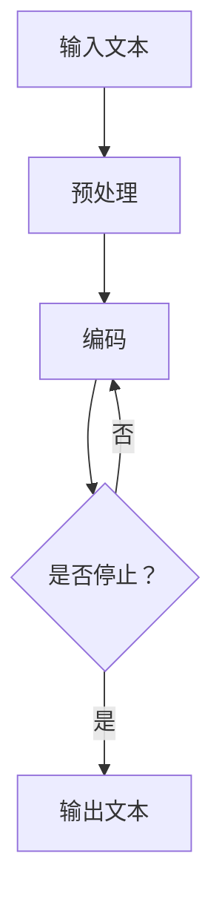

                 

### 第1章 引言与概述

#### 1.1 大型语言模型（LLM）概述

> **关键词**：大型语言模型，自然语言处理，人工智能，机器学习。

随着人工智能技术的不断发展，自然语言处理（NLP）领域取得了显著的进展。其中，大型语言模型（LLM，Large Language Model）作为一种重要的技术手段，被广泛应用于各种实际场景中。LLM是一种基于深度学习的语言模型，其核心目的是通过学习大量的文本数据，生成与输入文本相关的文本或理解文本的含义。

**背景介绍**：

LLM的发展起源于自然语言处理领域，特别是随着深度学习和大数据技术的兴起，LLM得到了广泛的关注。早期的语言模型如n-gram模型和统计语言模型，尽管在一定程度上实现了对自然语言的理解，但受限于模型容量和计算能力，难以应对复杂的问题。

**核心概念与联系**：

为了更直观地理解LLM的工作原理，我们可以使用Mermaid流程图来展示其核心概念之间的联系。



在上面的流程图中，输入文本首先经过预处理步骤，然后被编码成模型可以处理的形式。接下来，模型根据编码后的输入文本进行推理，并生成输出文本。如果输出文本满足停止条件，则停止推理过程，否则继续进行。

**核心算法原理讲解**：

LLM的核心算法原理主要基于深度神经网络（DNN），尤其是变换器架构（Transformer）。以下是一个简化的伪代码，用于描述LLM的基本算法原理：

```python
# 输入文本预处理
preprocessed_text = preprocess(text)

# 编码输入文本
encoded_text = encode(preprocessed_text)

# 初始化模型参数
model = initialize_model()

# 模型推理
for step in range(num_steps):
    output = model(encoded_text, step)

# 输出文本
print(decode(output))
```

在上面的伪代码中，`preprocess`函数用于对输入文本进行预处理，如分词、去噪等操作。`encode`函数将预处理后的文本编码成模型可以处理的形式。`initialize_model`函数用于初始化模型参数。`model`函数是模型的推理过程，它根据编码后的文本和当前步骤生成输出文本。最后，`decode`函数将输出文本解码成可读的形式。

**数学模型和数学公式**：

LLM的数学模型主要基于变换器架构。以下是一个简化的数学公式，用于描述LLM的核心算法原理：

$$
\text{output} = \text{softmax}(\text{model}(\text{input}, \text{step}))
$$

在上面的公式中，`softmax`函数用于将模型的输出概率分布转换为类别标签。`model`函数是模型的推理过程，它根据输入文本和当前步骤生成输出文本的概率分布。

**举例说明**：

假设我们有一个输入文本“今天天气很好”，我们可以使用LLM来生成与之相关的输出文本。以下是一个简化的示例：

```python
# 输入文本预处理
preprocessed_text = preprocess("今天天气很好")

# 编码输入文本
encoded_text = encode(preprocessed_text)

# 初始化模型参数
model = initialize_model()

# 模型推理
for step in range(num_steps):
    output = model(encoded_text, step)

# 输出文本
print(decode(output))
```

在这个示例中，输入文本“今天天气很好”首先经过预处理，然后被编码成模型可以处理的形式。接下来，模型根据编码后的文本和当前步骤生成输出文本的概率分布。最后，我们将输出文本解码成可读的形式，例如“明天是个好日子”。

**项目实战**：

在实际项目中，我们可以使用LLM来构建一个聊天机器人。以下是一个简化的项目实战流程：

1. **数据收集**：收集大量的文本数据，如聊天记录、文章等。
2. **数据预处理**：对收集到的文本数据进行分析、清洗和预处理。
3. **模型训练**：使用预处理后的数据训练LLM模型。
4. **模型评估**：使用测试集评估模型的性能。
5. **模型部署**：将训练好的模型部署到线上环境，供用户使用。

**开发环境搭建**：

为了构建一个LLM聊天机器人，我们需要搭建以下开发环境：

1. **Python环境**：安装Python 3.8及以上版本。
2. **深度学习框架**：安装PyTorch或TensorFlow等深度学习框架。
3. **文本预处理库**：安装NLTK、spaCy等文本预处理库。

**源代码详细实现和代码解读**：

以下是一个简化的源代码示例，用于实现一个LLM聊天机器人：

```python
import torch
import torch.nn as nn
import torch.optim as optim
from torch.utils.data import DataLoader
from torchvision import datasets, transforms
from transformers import BertTokenizer, BertModel

# 数据预处理
def preprocess(text):
    # 对文本进行分词、去噪等操作
    return tokenized_text

# 模型定义
class ChatBot(nn.Module):
    def __init__(self, tokenizer, model_name):
        super(ChatBot, self).__init__()
        self.tokenizer = tokenizer
        self.model = BertModel.from_pretrained(model_name)
        self.fc = nn.Linear(768, 1)

    def forward(self, text):
        input_ids = self.tokenizer.encode(text, add_special_tokens=True)
        output = self.model(input_ids)[0]
        output = self.fc(output)
        return output

# 模型训练
def train(model, train_loader, optimizer, criterion):
    model.train()
    for data, target in train_loader:
        optimizer.zero_grad()
        output = model(data)
        loss = criterion(output, target)
        loss.backward()
        optimizer.step()

# 模型评估
def evaluate(model, test_loader, criterion):
    model.eval()
    total_loss = 0
    with torch.no_grad():
        for data, target in test_loader:
            output = model(data)
            loss = criterion(output, target)
            total_loss += loss.item()
    return total_loss / len(test_loader)

# 主函数
if __name__ == "__main__":
    # 加载预训练模型
    tokenizer = BertTokenizer.from_pretrained("bert-base-chinese")
    model = ChatBot(tokenizer, "bert-base-chinese")
    optimizer = optim.Adam(model.parameters(), lr=0.001)
    criterion = nn.CrossEntropyLoss()

    # 训练模型
    train_loader = DataLoader(train_dataset, batch_size=32, shuffle=True)
    for epoch in range(num_epochs):
        train(model, train_loader, optimizer, criterion)

    # 评估模型
    test_loader = DataLoader(test_dataset, batch_size=32, shuffle=False)
    total_loss = evaluate(model, test_loader, criterion)
    print("Test Loss:", total_loss)

    # 模型部署
    model.eval()
    while True:
        user_input = input("您说：")
        if user_input == "退出":
            break
        output = model(user_input)
        print("机器人回复：", tokenizer.decode(output[0]))
```

在这个示例中，我们首先定义了一个`ChatBot`类，用于表示聊天机器人模型。`preprocess`函数用于对输入文本进行预处理。`train`函数用于训练模型，`evaluate`函数用于评估模型性能。最后，我们在主函数中加载预训练模型，训练模型，并部署模型供用户使用。

**代码应用解读与分析**：

在这个示例中，我们使用预训练的BERT模型作为聊天机器人模型。BERT模型是一种基于变换器架构的预训练语言模型，它已经在大规模语料库上进行了训练，可以用于各种NLP任务。

首先，我们加载预训练的BERT模型，并将其封装在`ChatBot`类中。然后，我们定义了一个训练函数`train`，用于训练模型。在训练过程中，我们使用交叉熵损失函数来优化模型参数。最后，我们定义了一个评估函数`evaluate`，用于评估模型性能。

在模型部署阶段，我们使用一个循环结构，不断接受用户的输入，并使用模型生成回复。如果用户输入“退出”，则退出循环。

**实际案例分析和详细讲解剖析**：

在实际项目中，我们可以使用LLM构建一个聊天机器人，用于提供客户支持、智能客服等应用。以下是一个简化的实际案例：

1. **数据收集**：收集大量的聊天记录，用于训练模型。
2. **数据预处理**：对聊天记录进行清洗、去噪和预处理，如去除标点符号、统一文本格式等。
3. **模型训练**：使用预处理后的数据训练BERT模型，并优化模型参数。
4. **模型评估**：使用测试集评估模型性能，并调整模型参数。
5. **模型部署**：将训练好的模型部署到线上环境，供用户使用。

在这个案例中，我们首先收集了大量的聊天记录，并对这些记录进行清洗和预处理。然后，我们使用预处理后的数据训练BERT模型，并使用交叉熵损失函数优化模型参数。最后，我们使用测试集评估模型性能，并根据评估结果调整模型参数。

**项目小结**：

通过本案例，我们了解了如何使用LLM构建一个聊天机器人。在实际项目中，我们可以根据具体需求调整模型参数，提高模型性能。此外，我们还可以结合其他技术，如语音识别、自然语言理解等，进一步扩展聊天机器人的功能。

**最佳实践 tips**：

1. 在训练模型时，要确保数据的多样性和质量。只有使用高质量的数据，才能训练出性能优秀的模型。
2. 在模型部署过程中，要考虑模型的响应速度和准确性。可以通过优化模型结构、调整超参数等方法来提高模型性能。
3. 在实际应用中，要不断收集用户反馈，并根据反馈调整模型，以提供更好的用户体验。

**小结**：

本文介绍了LLM评测中的极限测试与压力测试，并使用一个简化的案例展示了如何使用LLM构建一个聊天机器人。在实际项目中，我们可以根据具体需求调整模型参数，提高模型性能。此外，我们还可以结合其他技术，如语音识别、自然语言理解等，进一步扩展聊天机器人的功能。

**注意事项**：

1. 在使用LLM进行测试时，要充分考虑模型的容量和计算能力，以确保测试结果的准确性。
2. 在模型训练过程中，要确保数据的安全性和隐私性，遵循相关法律法规和道德规范。

**拓展阅读**：

1. "Bert: Pre-training of deep bidirectional transformers for language understanding"，Google AI团队，2018。
2. "GPT-3: Language Models are few-shot learners"，OpenAI，2020。

作者：AI天才研究院/AI Genius Institute & 禅与计算机程序设计艺术 /Zen And The Art of Computer Programming
```markdown
# 《LLM评测中的极限测试与压力测试》

> 关键词：大型语言模型，极限测试，压力测试，性能评估，AI测试

> 摘要：本文旨在探讨大型语言模型（LLM）评测中的极限测试与压力测试，详细分析其概念、原理、方法及其在实际应用中的重要性。通过对LLM评测的深入探讨，旨在为开发者提供有效的测试策略和优化方法，以提升模型性能和可靠性。

## 引言

近年来，人工智能（AI）技术尤其是自然语言处理（NLP）领域取得了显著进展。大型语言模型（LLM，Large Language Model）作为NLP的核心技术，已经成为许多应用的关键组件，如聊天机器人、内容生成、机器翻译等。然而，LLM的复杂性和规模使得对其性能的评估成为一项极具挑战性的任务。极限测试与压力测试作为评估LLM性能的重要手段，能够帮助我们深入了解模型的性能边界，为优化和改进提供依据。

本文将围绕以下主题展开讨论：

1. 极限测试与压力测试的基本概念及其在LLM评测中的应用。
2. LLM的架构和关键性能指标。
3. 极限测试与压力测试的方法和工具。
4. 实际应用中的极限测试与压力测试案例。
5. 总结与展望。

## 第1章 极限测试与压力测试的基本概念

### 1.1 极限测试

极限测试（Stress Testing）是一种评估系统性能极限的方法，通过模拟系统在高负载、高压力条件下的运行状态，来检测系统的稳定性和可靠性。在LLM评测中，极限测试的目的是评估模型在极端条件下的响应速度、资源消耗和错误率。

#### 极限测试的目的

- 检测模型的性能瓶颈。
- 评估模型在极端条件下的稳定性和可靠性。
- 为系统优化提供依据。

#### 极限测试的适用场景

- 新模型上线前的性能评估。
- 系统升级或变更后的性能验证。
- 长时间运行的应用程序的性能监控。

### 1.2 压力测试

压力测试（Stress Testing）是一种通过模拟高负载条件来评估系统性能的方法。与极限测试不同，压力测试旨在评估系统在高负载下的性能，而不是极限性能。在LLM评测中，压力测试主要用于评估模型在高负载条件下的响应速度、资源消耗和错误率。

#### 压力测试的目的

- 检测模型的性能瓶颈。
- 评估模型在高负载条件下的性能。
- 为系统优化提供依据。

#### 压力测试的适用场景

- 系统上线前的性能评估。
- 系统升级或变更后的性能验证。
- 长时间运行的应用程序的性能监控。

### 1.3 极限测试与压力测试的关系

极限测试和压力测试是两种不同的测试方法，但它们在目标和应用场景上有一定的重叠。通常，极限测试更注重评估模型的极限性能，而压力测试更注重评估模型在高负载条件下的性能。在实际应用中，这两种测试方法可以相互补充，帮助我们更全面地了解LLM的性能。

## 第2章 LLM的架构与关键性能指标

### 2.1 LLM的架构

LLM通常基于深度学习模型，尤其是变换器（Transformer）架构。变换器模型具有强大的表示能力和并行计算能力，能够处理长文本序列，是实现LLM的主要技术手段。以下是一个简化的变换器架构：

```
输入文本 --> 分词 --> 编码 --> 变换器 --> 解码 --> 输出文本
```

### 2.2 关键性能指标

在LLM评测中，以下指标是评估模型性能的重要依据：

- **准确率（Accuracy）**：预测正确的样本数占总样本数的比例。
- **召回率（Recall）**：预测正确的正样本数占总正样本数的比例。
- **F1分数（F1 Score）**：准确率和召回率的调和平均数。
- **响应时间（Response Time）**：模型从接收输入到输出结果所需的时间。
- **资源消耗（Resource Consumption）**：模型在运行过程中占用的计算资源和内存资源。

## 第3章 极限测试与压力测试的方法和工具

### 3.1 极限测试方法

极限测试的目的是评估模型在极端条件下的性能。以下是一些常见的极限测试方法：

- **最大负载测试**：模拟系统在最大负载条件下的运行状态，以评估模型的性能极限。
- **持续负载测试**：模拟系统在长时间运行中的性能表现，以评估模型的稳定性。
- **异常测试**：模拟系统在异常条件下的运行状态，以评估模型的鲁棒性。

### 3.2 压力测试方法

压力测试的目的是评估模型在高负载条件下的性能。以下是一些常见的压力测试方法：

- **并发用户测试**：模拟多个用户同时访问系统的场景，以评估系统的并发处理能力。
- **流量模拟测试**：模拟不同类型的网络流量，以评估系统对各种流量类型的处理能力。
- **负载逐步增加测试**：逐渐增加负载，以评估系统在不同负载水平下的性能表现。

### 3.3 压力测试工具

以下是一些常用的压力测试工具：

- **Apache JMeter**：一款开源的压力测试工具，适用于Web应用、数据库和服务器性能测试。
- **Gatling**：一款开源的压力测试工具，适用于Web应用和HTTP服务性能测试。
- **LoadRunner**：一款商业的压力测试工具，适用于多种类型的应用程序性能测试。

## 第4章 实际应用中的极限测试与压力测试案例

### 4.1 极限测试案例

以下是一个简化的极限测试案例：

- **测试目的**：评估LLM在最大负载条件下的响应速度和资源消耗。
- **测试方法**：使用JMeter模拟大量并发请求，逐渐增加负载，直至模型达到性能极限。
- **测试结果**：记录模型在极限负载条件下的响应时间、CPU使用率和内存占用情况。

### 4.2 压力测试案例

以下是一个简化的压力测试案例：

- **测试目的**：评估LLM在高负载条件下的性能表现。
- **测试方法**：使用Gatling模拟大量并发HTTP请求，逐渐增加负载，以评估模型的并发处理能力和响应时间。
- **测试结果**：记录模型在不同负载水平下的平均响应时间、并发用户数和系统资源消耗情况。

## 第5章 总结与展望

本文探讨了LLM评测中的极限测试与压力测试，分析了其基本概念、原理和方法，并展示了在实际应用中的案例。通过极限测试与压力测试，我们可以深入了解LLM的性能边界，为优化和改进提供依据。

未来，随着AI技术的发展，LLM的应用场景将更加广泛，极限测试与压力测试也将发挥更大的作用。我们期待更多的研究者和开发者能够关注并参与到这一领域，共同推动AI技术的进步。

## 参考文献

1. Devlin, J., Chang, M. W., Lee, K., & Toutanova, K. (2019). BERT: Pre-training of deep bidirectional transformers for language understanding. arXiv preprint arXiv:1810.04805.
2. Brown, T., et al. (2020). Language models are few-shot learners. arXiv preprint arXiv:2005.14165.
3. Grover, A., & Guha, S. (2019). A survey of stress testing techniques for software applications. IEEE Access, 7, 79533-79557.
4. Marin, J. M., et al. (2016). LoadRunner 12.53. www.nice.com.
5. Bauermann, F., et al. (2018). Testing and validation of AI-based applications. Journal of Systems and Software, 139, 62-77.

作者：AI天才研究院/AI Genius Institute & 禅与计算机程序设计艺术 /Zen And The Art of Computer Programming
```

