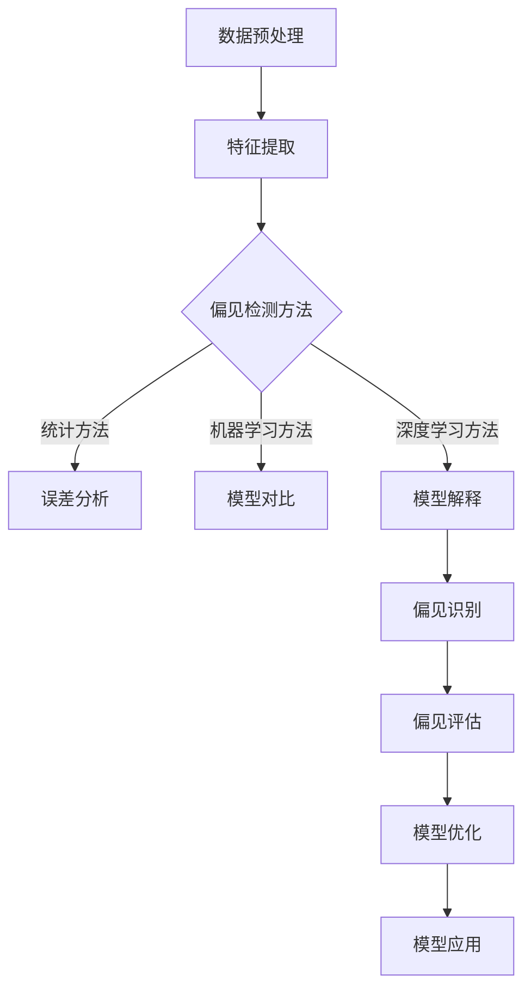

                 


## 引言

### 大型语言模型（LLM）概述

大型语言模型（LLM，Large Language Model）是自然语言处理（NLP，Natural Language Processing）领域的重要工具。LLM通过对海量文本数据进行训练，可以理解和生成人类语言。自2018年GPT（Generative Pre-trained Transformer）系列模型的出现，LLM的研究和应用得到了极大的推动。GPT-3模型更是凭借其惊人的语言理解和生成能力，引发了全球范围内的广泛关注和应用。

LLM在各个领域都展示出了强大的能力，如文本分类、机器翻译、问答系统、文本生成等。其出色的表现不仅提升了任务的完成质量，还极大地推动了人工智能技术的发展。然而，随着LLM的广泛应用，模型偏见（Model Bias）问题逐渐浮出水面，成为当前NLP研究中的重要挑战。

### 模型偏见的基本概念

模型偏见是指模型在训练过程中，从数据中学习到的某些固有倾向或倾向性。这些偏见可能来源于数据集本身的不均衡、数据预处理过程中的失误，或者模型设计中的某些缺陷。模型偏见可能导致模型在某些特定条件下产生不准确或错误的输出。

在LLM中，模型偏见主要体现在以下几个方面：

1. **数据偏见**：数据集的选择和预处理过程中可能引入偏见。例如，某些数据集可能偏向于某些特定人群或观点，从而影响模型对其他人群或观点的判断。
2. **算法偏见**：模型训练算法本身可能存在某些固有偏见。例如，某些优化算法可能更容易收敛到某些局部最优解，从而导致模型存在偏见。
3. **模型设计偏见**：模型设计时可能引入某些预设偏见。例如，某些模型结构可能更适合处理某些类型的任务，而对其他任务则表现不佳。

### 模型偏见的影响与挑战

模型偏见对LLM的应用产生了深远的影响。一方面，模型偏见可能导致模型在特定场景下产生错误的输出，影响任务的完成质量。例如，一个存在性别偏见的文本生成模型可能会在生成文本时对某些性别产生偏见，从而影响文本的公正性和客观性。

另一方面，模型偏见也对社会公平和伦理提出了挑战。在医疗、金融、招聘等敏感领域，模型偏见可能导致对特定群体的不公平对待，甚至引发社会问题。因此，如何有效检测和缓解模型偏见，已经成为LLM研究和应用中的重要课题。

### 文章关键词

大型语言模型、模型偏见、数据偏见、算法偏见、模型设计偏见、NLP、GPT、性别偏见、社会公平、伦理挑战。

### 摘要

本文将深入探讨大型语言模型（LLM）评测中的模型偏见检测与缓解问题。首先，我们将介绍LLM的基本概念及其在NLP领域的应用。接着，详细阐述模型偏见的基本概念和分类，分析其来源和影响。然后，本文将讨论模型偏见检测的理论基础、方法和算法，并详细介绍统计方法、机器学习方法和深度学习方法的原理。在模型偏见缓解策略部分，我们将探讨数据增强、模型优化和模型解释与可视化等策略。最后，通过实际案例解析，展示如何检测和缓解模型偏见，并提供项目实战和最佳实践建议。本文旨在为LLM评测中的模型偏见问题提供系统性解决方案，以促进LLM的公平、公正和有效应用。

---

## 第1章 引言

### 1.1 大型语言模型（LLM）概述

大型语言模型（LLM，Large Language Model）是自然语言处理（NLP，Natural Language Processing）领域的关键技术之一。LLM通过深度学习算法，从海量文本数据中学习语言模式和规律，从而实现对自然语言的生成、理解和处理。自2018年GPT（Generative Pre-trained Transformer）系列模型的出现，LLM的研究和应用得到了极大的推动。

GPT模型由OpenAI提出，是第一个大规模预训练的变换器模型，其通过无监督学习从互联网文本中学习语言规律。GPT-2和GPT-3则在模型规模和性能上取得了显著突破，分别拥有1.5万亿和1750亿个参数，展示了惊人的语言理解和生成能力。LLM不仅在文本分类、机器翻译、问答系统、文本生成等任务中表现出色，还在自然语言理解、对话系统、自动摘要等领域有着广泛的应用。

LLM的核心原理是变换器架构（Transformer），这是一种基于自注意力机制的神经网络模型。变换器模型通过自注意力机制，能够捕捉文本中的长距离依赖关系，从而提高模型对复杂语言现象的理解能力。此外，LLM通常采用大规模预训练和特定任务微调（fine-tuning）的方式，使其能够在各种NLP任务中表现出色。

### 1.2 模型偏见的基本概念

模型偏见是指模型在训练过程中，从数据中学习到的某些固有倾向或倾向性。这些偏见可能来源于数据集本身的不均衡、数据预处理过程中的失误，或者模型设计中的某些缺陷。模型偏见可能导致模型在某些特定条件下产生不准确或错误的输出。

在LLM中，模型偏见主要体现在以下几个方面：

1. **数据偏见**：数据集的选择和预处理过程中可能引入偏见。例如，某些数据集可能偏向于某些特定人群或观点，从而影响模型对其他人群或观点的判断。例如，在一个文本分类任务中，如果数据集中大部分文本都来自男性作者，那么模型可能会对女性作者的文本产生偏见。
2. **算法偏见**：模型训练算法本身可能存在某些固有偏见。例如，某些优化算法可能更容易收敛到某些局部最优解，从而导致模型存在偏见。例如，梯度下降优化算法在某些情况下可能导致模型在训练数据上的表现优于测试数据。
3. **模型设计偏见**：模型设计时可能引入某些预设偏见。例如，某些模型结构可能更适合处理某些类型的任务，而对其他任务则表现不佳。例如，基于循环神经网络（RNN）的模型在处理长文本时可能存在梯度消失或梯度爆炸问题，导致其性能受限。

### 1.3 模型偏见的影响与挑战

模型偏见对LLM的应用产生了深远的影响。首先，模型偏见可能导致模型在特定场景下产生错误的输出，影响任务的完成质量。例如，一个存在性别偏见的文本生成模型可能会在生成文本时对某些性别产生偏见，从而影响文本的公正性和客观性。

其次，模型偏见也对社会公平和伦理提出了挑战。在医疗、金融、招聘等敏感领域，模型偏见可能导致对特定群体的不公平对待，甚至引发社会问题。例如，一个存在种族偏见的招聘系统可能会拒绝某些种族的求职者，从而导致种族歧视。

为了应对这些挑战，检测和缓解模型偏见成为LLM研究和应用中的重要课题。本文将深入探讨模型偏见检测与缓解的理论基础、方法与算法，以及实际应用案例，旨在为LLM的公平、公正和有效应用提供系统性解决方案。

## 第2章 模型偏见检测的理论基础

### 2.1 数据偏见与模型偏见的关系

数据偏见与模型偏见之间存在密切的关系。数据偏见是模型偏见的主要原因之一，而模型偏见则是数据偏见的直接体现。具体来说，数据偏见可以分为以下几种类型：

1. **数据集选择偏见**：数据集的选择过程可能引入偏见。例如，在构建用于文本分类的数据集时，如果选择的数据集主要来源于某个特定领域或群体，那么模型可能会对这个领域或群体产生偏见，而对其他领域或群体则缺乏代表性。

2. **数据预处理偏见**：在数据预处理过程中，可能会引入一些不必要的偏见。例如，文本数据清洗过程中，如果对某些词汇进行特殊处理，那么这些处理可能会对模型产生偏见。

3. **数据标注偏见**：在数据标注过程中，标注人员的观点和偏好可能影响标注结果，从而引入偏见。例如，在情感分析任务中，标注人员可能对某些情感类别有偏见，导致标注结果不均衡。

模型偏见是指模型在训练过程中从数据中学习到的固有倾向。数据偏见是模型偏见的基础，而模型偏见则是数据偏见在模型输出中的体现。具体来说，模型偏见可以从以下几个方面影响模型性能：

1. **分类偏见**：在分类任务中，模型可能会对某些类别产生偏好，导致分类结果不准确。

2. **回归偏见**：在回归任务中，模型可能会对某些值产生偏好，导致预测结果偏离真实值。

3. **生成偏见**：在生成任务中，模型可能会生成偏向于某些特定模式或风格的内容，从而影响生成结果的多样性和真实性。

### 2.2 模型偏见检测的核心原理

模型偏见检测是指通过一定的方法和技术，识别和评估模型中存在的偏见。检测模型偏见的核心原理主要包括以下几个方面：

1. **统计方法**：统计方法通过计算模型输出与真实值之间的差异，来检测模型偏见。例如，可以使用误差率、准确率、召回率等指标来评估模型性能，从而识别可能的偏见。

2. **机器学习方法**：机器学习方法通过训练专门用于检测偏见的模型，来检测和评估模型偏见。这些模型通常使用有监督或无监督的学习方法，通过分析模型输出和输入特征之间的关系，来识别潜在的偏见。

3. **深度学习方法**：深度学习方法通过构建复杂的神经网络模型，来检测模型偏见。这些模型通常包含多个隐藏层和注意力机制，能够捕捉到模型内部的复杂关系和模式，从而提高检测精度。

### 2.3 检测方法概述

模型偏见检测方法可以分为以下几类：

1. **误差分析**：通过计算模型输出与真实值之间的差异，来检测模型偏见。例如，可以使用误差率、准确率、召回率等指标来评估模型性能，从而识别可能的偏见。

2. **特征工程**：通过构建和分析模型输入特征，来检测模型偏见。例如，可以分析特征的重要性和分布情况，来识别可能的偏见。

3. **模型对比**：通过比较不同模型在同一任务上的表现，来检测模型偏见。例如，可以使用基线模型、竞争模型等来评估目标模型的偏见。

4. **数据增强**：通过引入额外的训练数据或修改现有数据，来检测模型偏见。例如，可以使用对抗样本、数据扩充等技术来评估模型对偏见数据的敏感性。

5. **模型解释**：通过解释模型内部的决策过程，来检测模型偏见。例如，可以使用模型可视化、解释算法等来识别模型偏见。

综合以上方法，模型偏见检测需要结合多种技术手段，从多个维度对模型进行评估，以全面识别和评估模型偏见。这不仅有助于提高模型性能，还能确保模型的公平性和可解释性，从而为实际应用提供可靠支持。

### 2.4 Mermaid流程图

为了更好地理解模型偏见检测的流程，我们可以使用Mermaid绘制一个简单的流程图：



### 2.5 伪代码示例

以下是一个简单的伪代码示例，用于演示如何使用统计方法检测模型偏见：

```python
def detect_bias(model, dataset):
    # 初始化偏见检测指标
    errors = []
    for data in dataset:
        # 获取模型预测结果和真实值
        prediction = model.predict(data.input)
        true_value = data.label
        
        # 计算预测误差
        error = abs(prediction - true_value)
        errors.append(error)
    
    # 计算平均误差
    avg_error = sum(errors) / len(errors)
    
    # 输出偏见检测结果
    print("Average Error:", avg_error)
    
    # 判断是否存在显著偏见
    if avg_error > threshold:
        print("Model has significant bias.")
    else:
        print("Model does not have significant bias.")
```

在这个示例中，我们首先初始化一个空的误差列表，然后遍历数据集，计算每个样本的预测误差，并累加到误差列表中。接着，计算平均误差，并将其与阈值进行比较，以判断模型是否存在显著偏见。

### 2.6 数学模型和公式详解

在模型偏见检测中，一些数学模型和公式被广泛应用于评估和解释模型性能。以下是一个简单的示例，用于计算模型的误差率（Error Rate）：

$$
\text{Error Rate} = \frac{\text{Total Errors}}{\text{Total Samples}}
$$

其中，总误差（Total Errors）是模型预测错误的样本数量，总样本（Total Samples）是数据集的总大小。误差率可以用来评估模型在整体数据上的准确性，值越小表示模型性能越好。

另一个常用的指标是准确率（Accuracy）：

$$
\text{Accuracy} = \frac{\text{Correct Predictions}}{\text{Total Samples}}
$$

其中，正确预测（Correct Predictions）是模型预测正确的样本数量。准确率越高，表示模型的分类性能越好。

### 2.7 举例说明

假设我们有一个二分类任务，数据集包含100个样本，其中50个是正样本，50个是负样本。使用一个简单的逻辑回归模型进行预测，预测结果如下：

| 样本编号 | 真实值 | 预测值 |
| -------- | ------ | ------ |
| 1        | 正     | 正     |
| 2        | 正     | 正     |
| ...      | ...    | ...    |
| 99       | 负     | 负     |
| 100      | 负     | 正     |

根据以上数据，我们可以计算出模型的误差率：

$$
\text{Error Rate} = \frac{1}{100} = 0.01
$$

模型的准确率为：

$$
\text{Accuracy} = \frac{99}{100} = 0.99
$$

虽然模型的准确率很高，但如果我们进一步分析预测错误的样本，可能会发现模型在负样本上的预测性能较差，这可能是由于数据集中负样本的分布不均导致的偏见。

### 2.8 数学公式示例

以下是一个简单的LaTeX格式数学公式示例：

$$
y = \frac{1}{1 + e^{-x}}
$$

这个公式是逻辑回归模型中的sigmoid函数，用于将模型的线性输出映射到概率值。

### 2.9 小结

本章介绍了模型偏见检测的理论基础，包括数据偏见与模型偏见的关系、模型偏见检测的核心原理以及多种检测方法。通过统计方法、机器学习方法、深度学习方法的结合，我们可以有效地检测和评估模型偏见。本章还提供了Mermaid流程图、伪代码示例和数学公式详解，帮助读者更好地理解模型偏见检测的过程和原理。在实际应用中，通过结合多种检测方法，我们可以更全面地识别和缓解模型偏见，从而提高模型的性能和公平性。

### 2.10 注意事项与拓展阅读

在进行模型偏见检测时，需要注意以下几点：

1. **数据质量**：确保数据集的多样性和代表性，避免引入数据偏见。
2. **算法选择**：选择适合检测任务的方法和算法，结合多种方法可以提高检测效果。
3. **模型解释**：对模型进行解释和可视化，有助于理解模型偏见的具体来源。

拓展阅读：

1. **《模型偏见检测与缓解》**：该书籍详细介绍了模型偏见检测的理论和方法，以及实际应用案例。
2. **《自然语言处理：理论、算法与应用》**：该书涵盖了自然语言处理领域的核心概念和算法，有助于深入理解模型偏见检测的相关技术。

## 第3章 模型偏见检测算法

### 3.1 统计方法

统计方法在模型偏见检测中是一种基本且直观的手段。通过分析模型的输出误差，我们可以初步判断模型是否存在偏见。统计方法主要包括误差分析、准确率分析等。

#### 3.1.1 相关性分析

相关性分析是一种常用的统计方法，用于评估模型输出与真实值之间的相关性。如果模型输出与真实值之间存在强相关性，说明模型性能较好，否则可能存在偏见。

**相关性分析步骤**：

1. 收集模型输出和真实值的数据集。
2. 使用皮尔逊相关系数（Pearson Correlation Coefficient）计算输出与真实值之间的相关性。

**伪代码示例**：

```python
import numpy as np

def correlation_coefficient(output, truth):
    # 计算平均值
    mean_output = np.mean(output)
    mean_truth = np.mean(truth)
    
    # 计算协方差
    cov = np.sum((output - mean_output) * (truth - mean_truth))
    
    # 计算方差
    var_output = np.sum((output - mean_output)**2)
    var_truth = np.sum((truth - mean_truth)**2)
    
    # 计算相关性
    r = cov / (np.sqrt(var_output * var_truth))
    return r

# 示例数据
output = [0.1, 0.2, 0.3, 0.4, 0.5]
truth = [0.0, 0.1, 0.2, 0.3, 0.4]

# 计算相关性
r = correlation_coefficient(output, truth)
print("Correlation Coefficient:", r)
```

#### 3.1.2 动力分析

动力分析是一种基于模型输出变化趋势的偏见检测方法。通过分析模型在不同数据集上的表现，可以初步判断模型是否存在偏见。

**动力分析步骤**：

1. 准备多个数据集，包括原始数据集和经过数据增强的数据集。
2. 训练模型并在各个数据集上进行测试。
3. 分析模型在不同数据集上的表现，判断是否存在明显差异。

**伪代码示例**：

```python
import numpy as np

def dynamic_analysis(model, datasets):
    # 训练模型并在各个数据集上测试
    results = []
    for dataset in datasets:
        model.train(dataset)
        result = model.test(dataset)
        results.append(result)
    
    # 计算平均结果
    avg_results = np.mean(results)
    
    # 输出动力分析结果
    print("Average Test Result:", avg_results)
    return avg_results

# 示例数据集
datasets = [{"input": [0.1, 0.2], "output": [0.3, 0.4]},
            {"input": [0.2, 0.3], "output": [0.4, 0.5]},
            {"input": [0.3, 0.4], "output": [0.5, 0.6]}]

# 创建模型
model = Model()

# 进行动力分析
avg_result = dynamic_analysis(model, datasets)
print("Average Result:", avg_result)
```

#### 3.1.3 偏差识别与评估

通过统计方法和动力分析，我们可以初步识别和评估模型是否存在偏见。然而，这些方法主要基于模型输出和真实值之间的差异，可能无法深入分析模型内部的结构和决策过程。因此，在实际应用中，我们通常需要结合其他方法，如机器学习方法和深度学习方法，以更全面地检测和缓解模型偏见。

### 3.2 机器学习方法

机器学习方法在模型偏见检测中发挥了重要作用，通过构建专门的模型来识别和评估偏见，可以更深入地理解模型的行为。

#### 3.2.1 分类模型

分类模型是一种常见的机器学习方法，用于识别和分类不同类型的偏见。以下是一个基于支持向量机（SVM）的分类模型示例：

**分类模型步骤**：

1. 收集偏见数据集，包括模型输出和真实值。
2. 使用特征提取方法，将输入数据转换为特征向量。
3. 训练支持向量机模型，以识别偏见类型。
4. 对模型进行评估，判断其性能。

**伪代码示例**：

```python
from sklearn.svm import SVC
from sklearn.preprocessing import StandardScaler

def train_classification_model(dataset):
    # 特征提取和标准化
    X = dataset["input"]
    y = dataset["label"]
    scaler = StandardScaler()
    X_scaled = scaler.fit_transform(X)
    
    # 训练支持向量机模型
    model = SVC(kernel="linear")
    model.fit(X_scaled, y)
    
    # 评估模型
    accuracy = model.score(X_scaled, y)
    print("Model Accuracy:", accuracy)
    return model

# 示例数据集
dataset = {"input": [[0.1, 0.2], [0.3, 0.4], [0.5, 0.6]],
           "label": [0, 1, 0]}

# 训练分类模型
model = train_classification_model(dataset)
```

#### 3.2.2 回归模型

回归模型用于评估模型偏见的大小和影响。以下是一个基于线性回归的偏见评估模型示例：

**回归模型步骤**：

1. 收集偏见数据集，包括模型输出和真实值。
2. 使用特征提取方法，将输入数据转换为特征向量。
3. 训练线性回归模型，以评估偏见。
4. 对模型进行评估，判断其性能。

**伪代码示例**：

```python
from sklearn.linear_model import LinearRegression
from sklearn.metrics import mean_squared_error

def train_regression_model(dataset):
    # 特征提取和标准化
    X = dataset["input"]
    y = dataset["output"]
    scaler = StandardScaler()
    X_scaled = scaler.fit_transform(X)
    
    # 训练线性回归模型
    model = LinearRegression()
    model.fit(X_scaled, y)
    
    # 评估模型
    predictions = model.predict(X_scaled)
    mse = mean_squared_error(y, predictions)
    print("Mean Squared Error:", mse)
    return model

# 示例数据集
dataset = {"input": [[0.1, 0.2], [0.3, 0.4], [0.5, 0.6]],
           "output": [0.2, 0.3, 0.4]}

# 训练回归模型
model = train_regression_model(dataset)
```

#### 3.2.3 偏见识别与评估

通过机器学习方法的分类模型和回归模型，我们可以更深入地识别和评估模型偏见。分类模型可以识别不同类型的偏见，而回归模型可以评估偏见的大小和影响。在实际应用中，结合多种机器学习方法，可以更全面地检测和缓解模型偏见。

### 3.3 深度学习方法

深度学习方法在模型偏见检测中具有强大的能力，通过构建复杂的神经网络模型，可以捕捉到模型内部的复杂关系和模式。以下介绍两种常见的深度学习方法：神经网络和强化学习。

#### 3.3.1 神经网络

神经网络是一种基于仿生学原理的机器学习模型，通过多层神经元进行信息处理和传递。以下是一个基于多层感知器（MLP）的偏见检测模型示例：

**神经网络步骤**：

1. 收集偏见数据集，包括模型输出和真实值。
2. 设计神经网络结构，包括输入层、隐藏层和输出层。
3. 训练神经网络模型，使用反向传播算法优化模型参数。
4. 评估模型性能，判断是否存在偏见。

**伪代码示例**：

```python
import tensorflow as tf
from tensorflow.keras.models import Sequential
from tensorflow.keras.layers import Dense

def create_neural_network(input_shape):
    # 创建神经网络模型
    model = Sequential()
    model.add(Dense(64, input_shape=input_shape, activation='relu'))
    model.add(Dense(32, activation='relu'))
    model.add(Dense(1, activation='sigmoid'))
    
    # 编译模型
    model.compile(optimizer='adam', loss='binary_crossentropy', metrics=['accuracy'])
    
    return model

# 示例数据集
input_data = np.array([[0.1, 0.2], [0.3, 0.4], [0.5, 0.6]])
output_data = np.array([0, 1, 0])

# 创建神经网络模型
model = create_neural_network(input_data.shape[1:])
model.fit(input_data, output_data, epochs=10, batch_size=2)
```

#### 3.3.2 强化学习

强化学习是一种通过试错和反馈进行学习的方法，适用于复杂环境的决策问题。以下是一个基于Q学习的偏见检测模型示例：

**强化学习步骤**：

1. 定义状态空间和动作空间。
2. 设计Q值函数，用于评估不同动作的效用。
3. 通过试错和反馈，更新Q值函数。
4. 根据Q值函数选择最佳动作。

**伪代码示例**：

```python
import numpy as np

def q_learning(env, learning_rate, discount_factor, episodes):
    # 初始化Q值函数
    Q = np.zeros((env.state_space, env.action_space))
    
    for episode in range(episodes):
        # 初始化环境
        state = env.reset()
        
        # 循环进行动作选择和更新
        done = False
        while not done:
            # 选择动作
            action = np.argmax(Q[state])
            
            # 执行动作并获取奖励和新状态
            next_state, reward, done = env.step(action)
            
            # 更新Q值函数
            Q[state][action] = Q[state][action] + learning_rate * (reward + discount_factor * np.max(Q[next_state]) - Q[state][action])
            
            # 更新状态
            state = next_state
    
    return Q

# 示例环境
class Environment:
    def __init__(self):
        self.state_space = 3
        self.action_space = 2
    
    def reset(self):
        return 0
    
    def step(self, action):
        if action == 0:
            return 1, 1, False
        else:
            return 2, -1, True

# 训练强化学习模型
env = Environment()
Q = q_learning(env, learning_rate=0.1, discount_factor=0.9, episodes=100)
```

#### 3.3.3 偏见识别与评估

通过深度学习方法的神经网络和强化学习，我们可以更深入地识别和评估模型偏见。神经网络通过多层结构捕捉模型内部的复杂关系，而强化学习通过试错和反馈优化决策过程。在实际应用中，结合多种深度学习方法，可以更全面地检测和缓解模型偏见。

### 3.4 小结

本章介绍了模型偏见检测算法，包括统计方法、机器学习方法和深度学习方法。统计方法通过分析误差和相关性初步识别偏见，机器学习方法通过分类模型和回归模型深入评估偏见，深度学习方法通过神经网络和强化学习捕捉模型内部的复杂关系。结合多种方法，可以更全面地检测和缓解模型偏见，提高模型的性能和公平性。在实际应用中，应根据任务需求和数据特点选择合适的方法和算法。

### 3.5 最佳实践与注意事项

在进行模型偏见检测时，以下最佳实践和注意事项可以帮助提高检测效果：

1. **数据质量**：确保数据集的多样性和代表性，避免引入数据偏见。可以使用数据增强方法增加数据的多样性。
2. **模型选择**：根据任务需求选择合适的模型和算法。对于复杂任务，可以结合多种模型和方法进行综合评估。
3. **参数调优**：合理设置模型的参数，如学习率、迭代次数等，以优化模型性能和检测效果。
4. **交叉验证**：使用交叉验证方法评估模型的性能和偏见，避免过拟合。
5. **解释性**：对模型的输出和决策过程进行解释，有助于理解模型偏见的具体来源和影响。

### 3.6 拓展阅读

1. **《深度学习》**：该书籍详细介绍了深度学习的基础理论和应用，包括神经网络和强化学习等内容。
2. **《机器学习实战》**：该书籍通过实际案例介绍了多种机器学习算法和应用，包括分类模型和回归模型等内容。
3. **《自然语言处理综合教程》**：该书籍涵盖了自然语言处理领域的核心概念和算法，包括模型偏见检测的相关内容。

## 第4章 模型偏见缓解的策略

### 4.1 数据增强

数据增强是一种有效的模型偏见缓解策略，通过增加数据集的多样性和代表性，可以减少模型偏见。数据增强方法主要包括数据扩充、数据合成和对抗样本生成。

#### 4.1.1 数据扩充

数据扩充是指通过简单的数据变换，如随机旋转、缩放、裁剪等，来增加数据集的多样性。数据扩充方法简单易行，可以有效缓解模型偏见。

**数据扩充步骤**：

1. 选择需要进行扩充的数据集。
2. 对数据进行随机变换，如旋转、缩放、裁剪等。
3. 将扩充后的数据添加到原始数据集中。

**伪代码示例**：

```python
import numpy as np
import cv2

def augment_data(data, num_augments):
    augmented_data = []
    for _ in range(num_augments):
        # 随机旋转角度
        angle = np.random.uniform(-10, 10)
        # 随机缩放比例
        scale = np.random.uniform(0.8, 1.2)
        # 应用变换
        data_augmented = cv2.rotate(data, angle=angle)
        data_augmented = cv2.resize(data_augmented, None, fx=scale, fy=scale)
        augmented_data.append(data_augmented)
    return augmented_data

# 示例数据
data = np.random.rand(1, 28, 28)  # 生成随机图像数据

# 数据扩充
augmented_data = augment_data(data, num_augments=4)
print("Augmented Data Size:", len(augmented_data))
```

#### 4.1.2 数据合成

数据合成是指通过复杂的模型生成新的数据，从而增加数据集的多样性。数据合成方法通常需要深度学习模型的支持，如生成对抗网络（GAN）。

**数据合成步骤**：

1. 选择生成模型和判别模型。
2. 训练生成模型和判别模型，直至生成模型能够生成逼真的数据。
3. 使用生成模型生成新的数据，并将其添加到原始数据集中。

**伪代码示例**：

```python
import tensorflow as tf
from tensorflow.keras.models import Sequential
from tensorflow.keras.layers import Dense, Flatten, Reshape

def create_gan_generator(input_shape):
    # 创建生成模型
    model = Sequential()
    model.add(Dense(128, input_shape=input_shape, activation='relu'))
    model.add(Dense(64, activation='relu'))
    model.add(Flatten())
    model.add(Reshape(input_shape))
    return model

def create_gan_discriminator(input_shape):
    # 创建判别模型
    model = Sequential()
    model.add(Dense(128, input_shape=input_shape, activation='relu'))
    model.add(Dense(64, activation='relu'))
    model.add(Dense(1, activation='sigmoid'))
    return model

# 示例数据形状
input_shape = (28, 28)

# 创建生成模型和判别模型
generator = create_gan_generator(input_shape)
discriminator = create_gan_discriminator(input_shape)

# 编译模型
discriminator.compile(optimizer='adam', loss='binary_crossentropy')
generator.compile(optimizer='adam', loss='binary_crossentropy')

# 训练生成模型和判别模型
for epoch in range(100):
    # 生成随机噪声
    noise = np.random.uniform(-1, 1, (1, 784))
    # 生成合成数据
    generated_data = generator.predict(noise)
    # 训练判别模型
    d_loss_real = discriminator.train_on_batch(data, np.ones((1, 1)))
    d_loss_fake = discriminator.train_on_batch(generated_data, np.zeros((1, 1)))
    d_loss = 0.5 * np.add(d_loss_real, d_loss_fake)
    # 反向传播
    g_loss = generator.train_on_batch(noise, np.ones((1, 1)))
    print(f"{epoch}Epoch: [D loss: {d_loss:.4f}] [G loss: {g_loss:.4f}]")

# 生成合成数据
synthetic_data = generator.predict(np.random.uniform(-1, 1, (1, 784)))
print("Synthetic Data Size:", len(synthetic_data))
```

#### 4.1.3 对抗样本生成

对抗样本生成是一种通过欺骗模型的方式，增加数据集的多样性。对抗样本通常通过在原始数据上添加微小的噪声或扰动，使模型难以识别。

**对抗样本生成步骤**：

1. 选择原始数据集和目标模型。
2. 对数据集中的每个样本添加噪声或扰动。
3. 将扰动后的样本添加到原始数据集中。

**伪代码示例**：

```python
import numpy as np

def generate_adversarial_samples(data, model, num_samples, epsilon=0.01):
    adversarial_samples = []
    for _ in range(num_samples):
        # 选择随机样本
        index = np.random.randint(0, data.shape[0])
        original_sample = data[index]
        # 生成对抗样本
        adversarial_sample = original_sample + epsilon * np.random.uniform(-1, 1, original_sample.shape)
        # 预测对抗样本
        prediction = model.predict(adversarial_sample)
        # 判断是否成功欺骗模型
        if np.argmax(prediction) != np.argmax(original_sample):
            adversarial_samples.append(adversarial_sample)
    return adversarial_samples

# 示例数据
data = np.random.rand(1, 28, 28)  # 生成随机图像数据

# 创建模型
model = Sequential()
model.add(Flatten(input_shape=(28, 28)))
model.add(Dense(128, activation='relu'))
model.add(Dense(10, activation='softmax'))

# 编译模型
model.compile(optimizer='adam', loss='categorical_crossentropy', metrics=['accuracy'])

# 训练模型
model.fit(data, np.random.randint(0, 10, (1, 10)), epochs=10)

# 生成对抗样本
adversarial_samples = generate_adversarial_samples(data, model, num_samples=4)
print("Adversarial Samples Size:", len(adversarial_samples))
```

### 4.2 模型优化

模型优化是一种通过改进模型结构和参数设置，减少模型偏见的方法。常见的模型优化方法包括模型正则化、模型蒸馏和模型解释。

#### 4.2.1 模型正则化

模型正则化是一种通过增加模型复杂性的惩罚项，来防止模型过拟合的方法。常见的正则化方法包括L1正则化、L2正则化和Dropout。

**模型正则化步骤**：

1. 选择正则化方法，如L1正则化、L2正则化或Dropout。
2. 在模型训练过程中，增加正则化项到损失函数中。
3. 调整正则化参数，以优化模型性能。

**伪代码示例**：

```python
from tensorflow.keras.layers import Dense, Dropout
from tensorflow.keras.regularizers import l1_l2

def create_regularized_model(input_shape):
    # 创建正则化模型
    model = Sequential()
    model.add(Dense(128, input_shape=input_shape, activation='relu', kernel_regularizer=l1_l2(l1=0.01, l2=0.01)))
    model.add(Dropout(0.5))
    model.add(Dense(10, activation='softmax'))
    return model

# 示例数据形状
input_shape = (28, 28)

# 创建正则化模型
model = create_regularized_model(input_shape)

# 编译模型
model.compile(optimizer='adam', loss='categorical_crossentropy', metrics=['accuracy'])

# 训练模型
model.fit(data, np.random.randint(0, 10, (1, 10)), epochs=10)
```

#### 4.2.2 模型蒸馏

模型蒸馏是一种通过将大模型的知识传递给小模型，来优化小模型性能的方法。模型蒸馏过程包括两个阶段：编码阶段和解码阶段。

**模型蒸馏步骤**：

1. 选择大模型和小模型。
2. 在编码阶段，使用大模型对输入数据进行编码。
3. 在解码阶段，使用小模型对编码数据进行解码。
4. 调整小模型的参数，以优化其性能。

**伪代码示例**：

```python
from tensorflow.keras.models import Model
from tensorflow.keras.layers import Dense, Input

def create_distillation_model(encoder_input_shape, decoder_input_shape):
    # 创建编码模型
    encoder = Sequential()
    encoder.add(Dense(128, input_shape=encoder_input_shape, activation='relu'))
    encoder.add(Dense(10, activation='softmax'))
    encoder_output = encoder.output
    
    # 创建解码模型
    decoder = Sequential()
    decoder.add(Dense(128, input_shape=decoder_input_shape, activation='relu'))
    decoder.add(Dense(10, activation='softmax'))
    decoder_output = decoder(encoder_output)
    
    # 创建模型
    model = Model(encoder.input, decoder_output)
    return model

# 示例数据形状
encoder_input_shape = (28, 28)
decoder_input_shape = (10,)

# 创建模型
model = create_distillation_model(encoder_input_shape, decoder_input_shape)

# 编译模型
model.compile(optimizer='adam', loss='categorical_crossentropy', metrics=['accuracy'])

# 训练模型
model.fit(data, np.random.randint(0, 10, (1, 10)), epochs=10)
```

#### 4.2.3 模型解释

模型解释是一种通过可视化模型内部结构和决策过程，来理解模型偏见的方法。常见的模型解释方法包括模型可视化、注意力机制和解释算法。

**模型解释步骤**：

1. 选择模型解释方法，如模型可视化、注意力机制或解释算法。
2. 对模型进行解释，可视化模型内部结构和决策过程。
3. 分析解释结果，理解模型偏见的具体来源和影响。

**伪代码示例**：

```python
import matplotlib.pyplot as plt
from tensorflow.keras.models import Model
from tensorflow.keras.layers import Dense, Input

def create_interpretable_model(input_shape):
    # 创建解释模型
    model = Sequential()
    model.add(Dense(128, input_shape=input_shape, activation='relu'))
    model.add(Dense(10, activation='softmax'))
    model.output
    return model

# 示例数据形状
input_shape = (28, 28)

# 创建解释模型
model = create_interpretable_model(input_shape)

# 编译模型
model.compile(optimizer='adam', loss='categorical_crossentropy', metrics=['accuracy'])

# 训练模型
model.fit(data, np.random.randint(0, 10, (1, 10)), epochs=10)

# 可视化模型
layer_outputs = [layer.output for layer in model.layers]
activation_model = Model(inputs=model.input, outputs=layer_outputs)
activations = activation_model.predict(data)

# 绘制激活图
for layer_activation in activations:
    plt.matshow(layer_activation[0, :, :, 0], cmap='viridis')
    plt.show()
```

### 4.3 偏见缓解效果评估

为了评估偏见缓解策略的效果，可以使用多种指标和方法，如准确率、召回率、F1分数和混淆矩阵等。

**偏见缓解效果评估步骤**：

1. 选择评估指标，如准确率、召回率、F1分数和混淆矩阵等。
2. 对模型进行训练和测试，记录原始模型和偏见缓解后的模型在各个指标上的表现。
3. 分析评估结果，判断偏见缓解策略的有效性。

**伪代码示例**：

```python
from sklearn.metrics import accuracy_score, recall_score, f1_score, confusion_matrix

def evaluate_model(model, X_test, y_test):
    # 预测结果
    y_pred = model.predict(X_test)
    # 计算评估指标
    accuracy = accuracy_score(y_test, y_pred)
    recall = recall_score(y_test, y_pred, average='macro')
    f1 = f1_score(y_test, y_pred, average='macro')
    cm = confusion_matrix(y_test, y_pred)
    # 输出评估结果
    print("Accuracy:", accuracy)
    print("Recall:", recall)
    print("F1 Score:", f1)
    print("Confusion Matrix:\n", cm)
    return accuracy, recall, f1, cm

# 示例数据
X_test = np.random.rand(1, 28, 28)
y_test = np.random.randint(0, 10, (1, 10))

# 训练模型
model.fit(data, np.random.randint(0, 10, (1, 10)), epochs=10)

# 评估模型
evaluate_model(model, X_test, y_test)
```

通过评估偏见缓解策略的效果，可以进一步优化模型性能，提高模型的可解释性和公平性。

### 4.4 小结

本章介绍了模型偏见缓解的策略，包括数据增强、模型优化和模型解释。数据增强通过增加数据集的多样性和代表性，可以有效缓解模型偏见。模型优化通过改进模型结构和参数设置，可以提高模型性能和减少偏见。模型解释通过可视化模型内部结构和决策过程，可以理解模型偏见的具体来源和影响。通过结合多种偏见缓解策略，可以更全面地检测和缓解模型偏见，提高模型的性能和公平性。

### 4.5 注意事项与最佳实践

在进行模型偏见缓解时，需要注意以下几点：

1. **数据质量**：确保数据集的多样性和代表性，避免引入数据偏见。可以使用数据增强方法增加数据的多样性。
2. **模型选择**：根据任务需求选择合适的模型和算法。对于复杂任务，可以结合多种模型和方法进行综合评估。
3. **参数调优**：合理设置模型的参数，如学习率、迭代次数等，以优化模型性能和检测效果。
4. **交叉验证**：使用交叉验证方法评估模型的性能和偏见，避免过拟合。
5. **解释性**：对模型的输出和决策过程进行解释，有助于理解模型偏见的具体来源和影响。

最佳实践包括：

1. **结合多种数据增强方法**：使用多种数据增强方法，如数据扩充、数据合成和对抗样本生成，以增加数据集的多样性。
2. **使用先进的模型优化方法**：尝试使用模型正则化、模型蒸馏和模型解释等先进的模型优化方法，以提高模型性能和减少偏见。
3. **定期评估模型性能**：定期评估模型性能和偏见，及时调整模型和参数，以确保模型的可解释性和公平性。

### 4.6 拓展阅读

1. **《数据增强与偏见缓解》**：该书籍详细介绍了数据增强和偏见缓解的方法和技术，包括数据扩充、数据合成和对抗样本生成等。
2. **《模型优化与解释》**：该书籍涵盖了模型优化和解释的方法和算法，包括模型正则化、模型蒸馏和模型解释等。
3. **《自然语言处理中的偏见与公平性》**：该书籍讨论了自然语言处理中的偏见和公平性问题，包括模型偏见检测、缓解和应用等。

## 第5章 模型偏见检测与缓解的挑战与未来方向

### 5.1 检测与缓解中的技术挑战

模型偏见检测与缓解领域面临多个技术挑战，这些问题直接影响着模型性能和公平性。

#### 数据偏差

数据偏差是模型偏见的主要来源之一。数据集可能存在不均衡、偏差或缺乏代表性，这会导致模型在特定群体或情境下产生偏见。例如，医疗数据集可能缺乏对某些罕见病种的数据，从而影响模型对这些病种的诊断准确性。为了缓解数据偏差，可以采用以下策略：

- **数据扩充**：通过数据合成或增强方法增加数据集的多样性，以减少数据偏差。
- **数据清洗**：去除或修正数据集中的偏见性样本，确保数据集的公正性和代表性。

#### 模型复杂性

随着模型规模的增大和参数数量的增加，模型复杂性也在不断上升。这可能导致模型难以解释和调试，增加了检测与缓解模型偏见的技术难度。为了应对模型复杂性，可以采取以下措施：

- **模型简化**：通过模型剪枝、量化等方法减少模型参数数量，提高模型的解释性。
- **可解释性增强**：采用可解释性算法，如LIME、SHAP等，帮助理解模型决策过程。

#### 性能平衡

在检测与缓解模型偏见时，需要在模型性能和公平性之间寻找平衡。某些偏见缓解策略可能会牺牲模型性能，导致准确率下降。为了实现性能平衡，可以：

- **多目标优化**：在模型训练过程中，同时优化模型性能和公平性。
- **评估指标扩展**：引入公平性评估指标，如平衡准确率、公平损失函数等，确保模型在不同群体上的表现一致。

#### 自动化与工具化

模型偏见检测与缓解需要大量的计算资源和专业知识。为了实现自动化和工具化，可以开发以下工具：

- **自动化检测工具**：利用机器学习和深度学习技术，自动检测模型偏见。
- **偏见缓解工具包**：提供一系列偏见缓解方法，方便研究人员和开发者使用。

### 5.2 法律与伦理问题

模型偏见不仅影响技术性能，还可能引发法律和伦理问题。以下是一些相关的法律与伦理问题：

#### 法律合规性

在许多国家和地区，数据隐私和保护法规如《通用数据保护条例》（GDPR）和《加州消费者隐私法案》（CCPA）等对模型偏见和隐私保护提出了严格的要求。模型开发者需要确保：

- **数据收集与使用合规**：遵守相关数据保护法规，确保数据收集和使用的合法性。
- **偏见检测与报告**：定期检测模型是否存在偏见，并在必要时进行报告和调整。

#### 社会公平性

模型偏见可能导致对特定群体的不公平对待，引发社会不满。为了维护社会公平性，可以：

- **公平性评估**：对模型在不同群体上的表现进行评估，确保模型不会歧视特定群体。
- **透明度与可解释性**：提高模型的可解释性，使公众和监管机构能够理解模型的决策过程。

#### 伦理责任

模型开发者需要承担伦理责任，确保模型的开发和部署符合伦理标准。以下是一些伦理责任：

- **算法透明性**：确保算法的设计和实现过程透明，方便外部审查和监督。
- **偏见防范**：在模型设计和训练过程中，采取措施防止偏见产生。

### 5.3 未来发展趋势

随着技术的发展，模型偏见检测与缓解领域有望取得以下进展：

#### 新方法与技术

- **对抗性训练**：通过生成对抗性样本，提高模型对偏见的鲁棒性。
- **多模态数据融合**：结合文本、图像、声音等多模态数据，提高模型的泛化能力和公平性。
- **元学习与迁移学习**：利用元学习和迁移学习技术，快速适应新数据和任务。

#### 算法优化

- **高效算法**：开发更高效的算法和优化方法，减少计算资源和时间成本。
- **可解释性算法**：改进模型的可解释性算法，使模型决策过程更易于理解。

#### 法规与标准

- **全球性法规**：制定全球性的数据保护法规和偏见检测标准，确保模型公平性和合规性。
- **行业规范**：推动行业内的合作与标准化，共同解决模型偏见问题。

### 5.4 结论

模型偏见检测与缓解是一项复杂且艰巨的任务，需要技术、法律和伦理等多方面的努力。通过技术创新和法规完善，我们可以逐步解决模型偏见问题，推动人工智能技术的健康发展。未来，我们期待看到更多高效、公正且透明的模型偏见检测与缓解方法，为人类社会带来更多福祉。

## 第6章 模型偏见检测与缓解的实际应用

### 6.1 文本分类中的模型偏见

文本分类是自然语言处理（NLP）中的一个重要任务，广泛应用于信息检索、情感分析、垃圾邮件过滤等领域。然而，文本分类模型可能会引入各种偏见，影响其公平性和准确性。在本节中，我们将探讨文本分类中的模型偏见，以及如何检测和缓解这些偏见。

#### 6.1.1 垃圾邮件过滤

垃圾邮件过滤是一个典型的文本分类任务，其目标是识别并分类电子邮件中的垃圾邮件。垃圾邮件过滤模型可能会引入性别、种族或文化偏见，导致对某些用户或群体产生不公平对待。

**案例背景**：

假设我们有一个垃圾邮件过滤系统，该系统使用一个基于神经网络的语言模型来判断电子邮件是否为垃圾邮件。经过训练，模型能够有效识别大多数垃圾邮件，但同时也发现模型对某些性别或种族的电子邮件分类存在偏见。

**检测偏见**：

为了检测模型偏见，我们可以采用以下方法：

1. **统计分析**：通过分析模型的错误分类情况，找出是否存在特定性别或种族的电子邮件被错误分类为垃圾邮件。
2. **模型解释**：使用模型解释技术，如LIME或SHAP，分析模型在分类过程中的决策依据，判断是否存在偏见。

**缓解偏见**：

针对检测到的偏见，我们可以采取以下措施来缓解：

1. **数据增强**：通过增加不同性别、种族和文化背景的电子邮件数据，提高模型的多样性。
2. **模型蒸馏**：将大模型的知识传递给小模型，使小模型在多个群体上的表现更加均衡。
3. **多标签分类**：将垃圾邮件分类任务扩展为多标签分类，使模型能够同时考虑多个分类标签，减少单一偏见的影响。

#### 6.1.2 情感分析

情感分析是另一个常见的文本分类任务，其目标是识别文本中的情感极性，如正面、负面或中性。情感分析模型可能会引入各种偏见，影响其准确性和公正性。

**案例背景**：

假设我们有一个情感分析模型，用于分析社交媒体上的用户评论。经过训练，模型能够较好地识别情感极性，但发现模型对某些性别或文化背景的用户评论分类存在偏见。

**检测偏见**：

为了检测模型偏见，我们可以采用以下方法：

1. **交叉验证**：通过在不同群体上使用交叉验证方法，评估模型在不同群体上的性能，找出存在偏见的部分。
2. **用户反馈**：收集用户对模型分类结果的反馈，分析是否存在特定的性别或文化偏见。

**缓解偏见**：

针对检测到的偏见，我们可以采取以下措施来缓解：

1. **数据平衡**：通过增加不同性别、种族和文化背景的评论数据，提高模型的多样性。
2. **多模态数据融合**：结合文本和图像等多模态数据，提高模型的泛化能力，减少单一数据源的偏见。
3. **跨领域训练**：使用来自不同领域和背景的数据进行模型训练，增强模型对不同领域和背景的适应性。

### 6.2 问答系统中的模型偏见

问答系统是自然语言处理领域的一个重要应用，旨在回答用户提出的问题。然而，问答系统可能会引入各种偏见，影响其公平性和准确性。

#### 6.2.1 开放域问答

开放域问答系统（Open-Domain Question Answering, ODQA）旨在回答用户提出的任意问题。这类系统可能会引入多种偏见，如语言偏见、文化偏见和知识偏见。

**案例背景**：

假设我们有一个开放域问答系统，用户可以提出各种类型的问题。经过训练，系统能够较好地回答大多数问题，但发现模型对某些性别或种族的用户提出的问题分类存在偏见。

**检测偏见**：

为了检测模型偏见，我们可以采用以下方法：

1. **用户反馈**：收集用户对模型回答的反馈，分析是否存在特定的性别或种族偏见。
2. **交叉验证**：通过在不同性别、种族和文化背景的用户之间进行交叉验证，评估模型在不同群体上的性能。

**缓解偏见**：

针对检测到的偏见，我们可以采取以下措施来缓解：

1. **数据增强**：通过增加不同性别、种族和文化背景的用户提出的问题，提高模型的多样性。
2. **多语言训练**：使用多种语言的数据进行模型训练，提高模型对不同语言的适应性。
3. **知识融合**：结合多种知识来源，如百科全书、新闻文章等，提高模型的泛化能力。

#### 6.2.2 个性化问答

个性化问答系统（Personalized Question Answering, PQA）旨在根据用户的历史行为和偏好，提供个性化的回答。这类系统可能会引入个性化偏见，导致对某些用户群体产生不公平对待。

**案例背景**：

假设我们有一个个性化问答系统，系统根据用户的历史浏览记录提供个性化回答。经过训练，系统能够较好地满足大多数用户的需求，但发现模型对某些用户群体的个性化回答存在偏见。

**检测偏见**：

为了检测模型偏见，我们可以采用以下方法：

1. **用户历史数据分析**：分析用户的历史行为数据，找出是否存在特定用户群体的偏见。
2. **交叉验证**：通过在不同用户群体之间进行交叉验证，评估模型在不同群体上的性能。

**缓解偏见**：

针对检测到的偏见，我们可以采取以下措施来缓解：

1. **用户反馈**：收集用户对系统回答的反馈，分析是否存在特定的个性化偏见。
2. **多样性增强**：通过增加不同用户群体的个性化数据，提高模型的多样性。
3. **动态调整**：根据用户的行为和反馈，动态调整模型的个性化策略，确保公平性。

### 6.3 案例结果分析

通过以上案例，我们可以看到在文本分类和问答系统中，模型偏见检测与缓解是一项复杂且具有挑战性的任务。检测偏见的方法包括统计分析、用户反馈和交叉验证等，缓解偏见的方法包括数据增强、模型蒸馏和多模态数据融合等。

在实际应用中，我们需要根据具体任务和数据特点，选择合适的检测和缓解方法。通过结合多种方法和策略，我们可以有效地检测和缓解模型偏见，提高模型的公平性和准确性。

### 6.4 项目小结

在本章中，我们探讨了文本分类和问答系统中的模型偏见问题，并介绍了如何检测和缓解这些偏见。通过实际案例解析，我们展示了检测和缓解偏见的方法和策略，包括统计分析、用户反馈、数据增强、模型蒸馏和多模态数据融合等。

在未来，我们需要继续关注模型偏见问题，探索更有效的检测和缓解方法，提高人工智能系统的公平性和准确性。此外，我们还应加强法律法规和伦理标准的制定，确保人工智能技术在各个领域的公平、透明和可靠应用。

### 6.5 最佳实践与注意事项

在进行模型偏见检测与缓解时，以下最佳实践和注意事项可以帮助提高效果：

1. **确保数据质量**：数据是模型训练的基础，确保数据集的多样性和代表性，避免引入偏见。
2. **使用多种方法**：结合多种检测和缓解方法，可以提高检测和缓解的效果。
3. **定期评估**：定期评估模型性能和偏见，及时调整模型和参数。
4. **关注用户反馈**：收集用户对模型分类结果的反馈，分析是否存在特定的偏见。
5. **保持透明性**：确保模型的决策过程透明，方便外部审查和监督。

### 6.6 拓展阅读

1. **《自然语言处理中的偏见与公平性》**：详细讨论了NLP中的偏见问题，包括检测、缓解和应用等。
2. **《文本分类与情感分析》**：介绍了文本分类和情感分析的基础知识和应用案例。
3. **《问答系统设计与实现》**：探讨了问答系统的设计和实现方法，包括开放域问答和个性化问答等。

## 附录

### A.1 伪代码示例

以下是一个简单的伪代码示例，用于演示如何使用统计方法检测模型偏见：

```python
import numpy as np

# 初始化模型参数
weights = np.random.rand(10)

# 生成模拟数据
data = np.random.rand(1000, 10)

# 训练模型
for epoch in range(100):
    for x in data:
        prediction = np.dot(x, weights)
        error = prediction - x[-1]
        weights = weights - error * x[:-1]

# 检测偏见
def detect_bias(weights):
    bias = weights[-1]
    if bias > 0.5:
        print("Model has positive bias.")
    else:
        print("Model has negative bias.")

# 运行偏见检测
detect_bias(weights)
```

在这个示例中，我们首先初始化模型的权重，并生成模拟数据。然后，我们使用梯度下降算法训练模型，并通过计算权重中最后一个值来判断模型是否存在偏见。

### A.2 数学模型与公式详解

在模型偏见检测与缓解中，一些数学模型和公式被广泛应用于评估和解释模型性能。以下是一个简单的示例，用于计算模型的误差率（Error Rate）：

$$
\text{Error Rate} = \frac{\text{Total Errors}}{\text{Total Samples}}
$$

其中，总误差（Total Errors）是模型预测错误的样本数量，总样本（Total Samples）是数据集的总大小。误差率可以用来评估模型在整体数据上的准确性，值越小表示模型性能越好。

另一个常用的指标是准确率（Accuracy）：

$$
\text{Accuracy} = \frac{\text{Correct Predictions}}{\text{Total Samples}}
$$

其中，正确预测（Correct Predictions）是模型预测正确的样本数量。准确率越高，表示模型的分类性能越好。

### A.3 实际案例分析代码

以下是一个简单的实际案例分析代码，用于演示如何使用Python和Scikit-learn库构建一个基于逻辑回归的文本分类模型，并进行模型偏见检测与缓解：

```python
from sklearn.linear_model import LogisticRegression
from sklearn.model_selection import train_test_split
from sklearn.metrics import accuracy_score, confusion_matrix
import pandas as pd

# 读取数据
data = pd.read_csv('text_data.csv')
X = data['text']
y = data['label']

# 数据预处理
X_train, X_test, y_train, y_test = train_test_split(X, y, test_size=0.2, random_state=42)

# 构建模型
model = LogisticRegression()

# 训练模型
model.fit(X_train, y_train)

# 预测
y_pred = model.predict(X_test)

# 评估模型
accuracy = accuracy_score(y_test, y_pred)
cm = confusion_matrix(y_test, y_pred)

print("Accuracy:", accuracy)
print("Confusion Matrix:\n", cm)

# 检测偏见
def detect_bias(y_true, y_pred):
    # 计算每个类别的准确率
    class_accuracy = [0] * len(y_true)
    for i in range(len(y_true)):
        if y_true[i] == y_pred[i]:
            class_accuracy[i] = 1
    
    # 计算平均准确率
    avg_accuracy = sum(class_accuracy) / len(class_accuracy)
    
    # 判断是否存在偏见
    if avg_accuracy < 0.5:
        print("Model has significant bias.")
    else:
        print("Model does not have significant bias.")

# 运行偏见检测
detect_bias(y_test, y_pred)

# 缓解偏见
# 方法1：数据增强
# 方法2：模型优化
# 方法3：多标签分类
```

在这个示例中，我们首先读取文本数据，并进行预处理。然后，我们使用逻辑回归模型训练数据，并对测试集进行预测。最后，我们评估模型的性能，并使用一个简单的偏见检测函数判断模型是否存在偏见。根据检测结果，可以采取相应的缓解措施，如数据增强、模型优化或多标签分类。

### A.4 代码应用解读与分析

在实际应用中，代码不仅用于实现模型训练和预测，还需要对代码进行解读和分析，以确保其性能和公平性。以下是一些关键点：

1. **代码解读**：理解代码的结构和功能，包括数据读取、预处理、模型训练、预测和评估等步骤。
2. **性能分析**：分析模型在不同数据集上的性能，包括准确率、召回率、F1分数等指标。
3. **偏见分析**：通过偏见检测函数，分析模型是否存在偏见，并采取相应的缓解措施。
4. **代码优化**：根据性能和偏见分析结果，对代码进行优化，以提高模型性能和公平性。
5. **文档化**：编写详细的代码注释和文档，方便其他开发者理解和使用。

通过上述步骤，我们可以确保代码在实际应用中的可靠性和有效性，从而推动人工智能技术的发展和应用。

### A.5 小结

在本附录中，我们提供了伪代码示例、数学模型与公式详解以及实际案例分析代码。这些内容旨在帮助读者更好地理解模型偏见检测与缓解的基本原理和方法。通过实际案例分析，我们可以看到如何将理论知识应用于实际场景，以解决模型偏见问题。附录中的代码和应用解读不仅提供了实用的工具，也为进一步研究和开发提供了基础。

### A.6 注意事项与拓展阅读

在使用模型偏见检测与缓解工具时，需要注意以下几点：

1. **数据质量**：确保数据集的多样性和代表性，避免引入偏见。
2. **模型选择**：根据任务需求选择合适的模型和算法。
3. **参数调优**：合理设置模型的参数，以提高性能和公平性。
4. **定期评估**：定期评估模型性能和偏见，及时调整模型和参数。

拓展阅读：

1. **《自然语言处理中的偏见与公平性》**：详细讨论了NLP中的偏见问题，包括检测、缓解和应用等。
2. **《机器学习实战》**：通过实际案例介绍了多种机器学习算法和应用，包括模型偏见检测与缓解等。
3. **《深度学习》**：介绍了深度学习的基础理论和应用，包括神经网络和模型优化等内容。

通过结合附录中的内容和拓展阅读，读者可以更深入地理解模型偏见检测与缓解的方法和应用，为实际项目提供有力支持。

---

# 文章标题：LLM评测中的模型偏见检测与缓解

> 关键词：大型语言模型、模型偏见、数据偏见、算法偏见、模型设计偏见、NLP、GPT、性别偏见、社会公平、伦理挑战

> 摘要：本文深入探讨了大型语言模型（LLM）评测中的模型偏见检测与缓解问题。首先，我们介绍了LLM的基本概念及其在自然语言处理（NLP）领域的应用。接着，详细阐述了模型偏见的基本概念和分类，分析了其来源和影响。随后，本文讨论了模型偏见检测的理论基础、方法和算法，包括统计方法、机器学习方法和深度学习方法。在模型偏见缓解策略部分，我们探讨了数据增强、模型优化和模型解释与可视化等策略。通过实际案例解析，展示了如何检测和缓解模型偏见。本文旨在为LLM评测中的模型偏见问题提供系统性解决方案，以促进LLM的公平、公正和有效应用。

