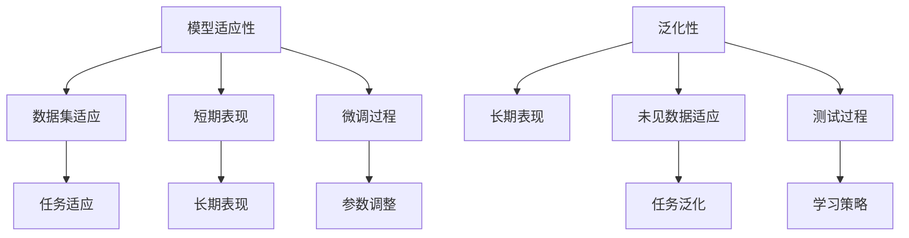

                 

### 文章标题

《LLM评测中的模型适应性与泛化性测试》

### 关键词

- 语言模型
- 模型适应性
- 泛化性
- 评测方法
- 实际应用

### 摘要

本文深入探讨了在语言模型（LLM）评测中，模型适应性与泛化性的重要性及其评估方法。通过对LLM的基本概念、架构和核心算法的介绍，我们详细阐述了模型适应性与泛化性的定义及其在LLM评测中的应用。文章进一步通过实例分析，展示了如何在实际项目中评估和优化模型的适应性及泛化性。本文旨在为研究者与实践者提供全面的指南，以促进LLM在实际应用中的有效性和稳定性。

### 引言

随着人工智能技术的迅猛发展，语言模型（LLM）在自然语言处理（NLP）领域取得了显著的成果。从最初的简单规则模型，到基于神经网络的复杂模型，LLM已经广泛应用于机器翻译、文本生成、问答系统等众多场景。然而，LLM的性能不仅依赖于模型本身的复杂度和参数规模，还与模型的适应性和泛化性密切相关。

**模型适应性**指的是模型在特定任务或数据集上的表现能力，即模型能否有效适应新的数据环境。适应性较差的模型在面对新的任务或数据时，可能无法达到预期的性能，甚至会出现性能退步。而**泛化性**则是指模型在未见过的数据上的表现能力，即模型能否从训练数据中提取出通用规律，从而在新数据上依然保持良好的性能。

LLM评测中的模型适应性与泛化性测试至关重要，它不仅能够帮助研究者了解模型在实际应用中的表现，还能指导模型优化和改进。本文将系统地介绍LLM的基础知识，深入探讨模型适应性与泛化性的定义、评估方法及其在实际项目中的应用，旨在为读者提供一份全面而深入的指南。

### LLM的基础知识

要深入探讨模型适应性与泛化性，我们首先需要了解LLM的基础知识，包括其定义、历史发展、架构和核心算法。

#### 定义

语言模型（Language Model，简称LLM）是一种基于统计模型或神经网络的方法，用于预测自然语言序列中的下一个单词或字符。LLM的核心任务是在给定前文序列的情况下，预测下一个可能的单词或字符序列。这一能力使得LLM在许多自然语言处理任务中具有重要应用，如机器翻译、文本生成、问答系统等。

#### 历史发展

语言模型的发展可以追溯到20世纪50年代，当时的早期模型主要是基于规则的方法。这些模型通过编写一系列规则来预测单词序列，但这种方法在处理复杂语言现象时效果有限。随着计算机性能的提升和统计方法的进步，20世纪80年代和90年代，基于N-gram的统计模型逐渐成为主流。N-gram模型通过计算单词序列的概率来预测下一个单词，其在某些任务上表现优异，但依然存在一些局限性。

21世纪初，随着深度学习技术的发展，神经网络语言模型（Neural Network Language Model，简称NNLM）开始兴起。NNLM通过多层神经网络对输入序列进行建模，可以捕捉到更复杂的语言规律。2003年，Bengio等提出了基于递归神经网络（RNN）的语言模型，显著提升了模型的性能。2018年，基于Transformer架构的BERT模型（Bidirectional Encoder Representations from Transformers）的出现，将语言模型推向了新的高度。BERT通过双向Transformer网络，同时考虑了输入序列的前后信息，使得模型在多个自然语言处理任务上取得了突破性成果。

#### 架构

LLM的架构可以分为两类：基于统计的方法和基于神经网络的方法。

1. **基于统计的方法**：这类方法以N-gram模型为代表，通过计算单词序列的概率来预测下一个单词。N-gram模型的架构相对简单，主要包含一个计分器，用于计算单词序列的概率。其基本原理是：给定前文序列，计算每个可能单词的生成概率，选择概率最大的单词作为预测结果。

2. **基于神经网络的方法**：这类方法以NNLM和Transformer为代表，通过多层神经网络对输入序列进行建模。NNLM通常采用RNN或LSTM（长短期记忆网络）作为基础架构，能够捕捉到序列的长期依赖关系。而Transformer则采用了自注意力机制（Self-Attention），通过全局关注输入序列的所有信息，从而提升模型的性能。

Transformer架构主要包括编码器（Encoder）和解码器（Decoder）两部分。编码器负责将输入序列编码为固定长度的向量表示，而解码器则利用这些向量表示生成输出序列。Transformer通过多头自注意力机制和多层神经网络，能够有效地捕捉到序列中的长距离依赖关系，从而提升模型的性能。

#### 核心算法

LLM的核心算法主要包括两部分：概率计算和序列生成。

1. **概率计算**：在LLM中，给定一个前文序列，模型需要计算每个可能单词的生成概率。对于基于统计的方法，如N-gram模型，生成概率可以通过计算单词序列的历史出现频率来估计。而对于基于神经网络的方法，如NNLM和Transformer，生成概率通常通过神经网络模型计算得到。

2. **序列生成**：在计算了每个可能单词的生成概率后，模型需要选择概率最大的单词作为预测结果。这一过程可以采用贪心算法，即在每个时间步选择概率最大的单词。此外，还可以采用概率采样方法，即在每个时间步从所有可能单词中随机选择一个概率较高的单词，从而引入一定的随机性。

Transformer模型中的序列生成过程采用了自注意力机制。具体来说，给定一个输入序列 \(x_1, x_2, ..., x_n\)，模型首先将每个输入 \(x_i\) 编码为一个固定长度的向量 \(e_i\)。在生成序列的过程中，模型会计算每个时间步的输出向量 \(y_i\)。具体计算过程如下：

$$
y_i = \text{softmax}(W_y \cdot \text{Attention}(W_q \cdot e_i, W_k \cdot e_i, W_v \cdot e_i))
$$

其中，\(W_q, W_k, W_v\) 分别为查询（Query）、键（Key）和值（Value）权重矩阵，\(\text{Attention}\) 为自注意力机制，\(\text{softmax}\) 为概率分布函数。自注意力机制的计算过程如下：

$$
\text{Attention}(Q, K, V) = \text{softmax}(\frac{QK^T}{\sqrt{d_k}})V
$$

其中，\(Q, K, V\) 分别为查询、键和值向量，\(d_k\) 为键向量的维度。

通过自注意力机制，模型可以同时关注输入序列的所有信息，从而提高序列生成的准确性和多样性。

#### 总结

LLM作为一种强大的自然语言处理工具，经历了从基于统计的方法到基于神经网络的方法的发展过程。其核心算法包括概率计算和序列生成，通过自注意力机制等先进技术，能够有效地捕捉到序列中的长距离依赖关系。了解LLM的基础知识，是深入探讨模型适应性与泛化性的基础。

### 模型适应性的定义与评估方法

模型适应性（Model Adaptability）是指模型在不同任务和数据集上表现的能力。一个适应性强的模型能够在新的任务或数据集上迅速调整并达到预期的性能，而适应性较差的模型则可能需要大量的重新训练或者调整才能适应新环境。在语言模型（LLM）的评测中，模型适应性是一个至关重要的指标，它决定了模型在现实世界中的广泛应用能力。

#### 定义

模型适应性可以定义为模型在遇到新的任务或数据集时的调整能力。这种调整不仅包括对模型参数的调整，还可能涉及模型结构或学习策略的改变。模型适应性好的模型能够快速适应新环境，从而在新的任务或数据集上表现出较高的性能。

#### 评估方法

评估模型适应性的方法可以分为两类：静态评估和动态评估。

1. **静态评估**：

   静态评估方法主要关注模型在特定任务或数据集上的表现，而不考虑模型是否经过调整。这种方法主要包括以下几种：

   - **交叉验证**：通过将数据集划分为训练集和验证集，多次训练和验证模型，评估模型在验证集上的平均性能。交叉验证能够有效地评估模型在未见数据上的表现能力，但无法直接反映模型的适应能力。

   - **数据集对比**：在多个不同的数据集上评估模型的性能，对比模型在不同数据集上的表现。这种方法可以初步判断模型在不同数据集上的适应能力，但数据集的选择和分布对评估结果有较大影响。

   - **超参数调整**：通过调整模型的超参数，如学习率、批次大小等，评估模型在不同超参数设置下的性能。超参数调整可以一定程度上提高模型的适应性，但无法全面评估模型的适应能力。

2. **动态评估**：

   动态评估方法主要关注模型在动态环境下的适应能力，即模型在遇到新的任务或数据时，是否能够迅速调整并达到良好的性能。这种方法主要包括以下几种：

   - **在线学习**：在线学习（Online Learning）是指在模型遇到新的数据时，能够实时调整模型参数，从而提高模型在新数据上的性能。在线学习能够较好地模拟现实世界中的动态环境，但实现难度较大，且可能带来计算和存储资源的高消耗。

   - **迁移学习**：迁移学习（Transfer Learning）是指利用已有的模型或知识，在新任务或数据集上进行快速适应。迁移学习可以通过预训练模型，然后在新数据上进行微调，从而提高模型的适应性。迁移学习在实际应用中具有广泛的应用，如预训练模型BERT在多个NLP任务中的表现。

   - **自适应优化**：自适应优化（Adaptive Optimization）是指通过动态调整模型的学习策略，如自适应调整学习率、批量大小等，提高模型的适应能力。自适应优化可以通过多种优化算法实现，如Adagrad、Adam等。

#### 实例：模型适应性评估实战

为了更直观地理解模型适应性的评估方法，以下是一个基于迁移学习的模型适应性评估实例。

**案例背景**：假设我们有一个预训练的BERT模型，它已经在多个自然语言处理任务上进行了训练。现在，我们需要评估该模型在新的问答系统任务上的适应性。

**评估步骤**：

1. **数据集划分**：将新的问答系统数据集划分为训练集和验证集。训练集用于模型微调，验证集用于评估模型性能。

2. **模型微调**：在训练集上对BERT模型进行微调，调整模型的参数以适应新的问答系统任务。具体步骤如下：

   - **输入处理**：对问答系统的输入数据进行预处理，如分词、嵌入等，使其与BERT模型输入格式一致。

   - **模型配置**：配置BERT模型的超参数，如学习率、批量大小等，以确保微调过程的有效性。

   - **训练过程**：使用训练集对BERT模型进行微调，通过反向传播和梯度下降算法调整模型参数。

3. **模型评估**：在验证集上评估微调后的BERT模型性能，计算模型的准确率、召回率等指标。

4. **结果分析**：分析微调后的模型在验证集上的表现，评估模型的适应能力。

**代码示例**：

以下是一个简化的Python代码示例，展示了如何使用迁移学习对BERT模型进行微调：

```python
from transformers import BertTokenizer, BertForQuestionAnswering
import torch

# 初始化BERT模型和tokenizer
tokenizer = BertTokenizer.from_pretrained('bert-base-uncased')
model = BertForQuestionAnswering.from_pretrained('bert-base-uncased')

# 数据预处理
def preprocess(data):
    inputs = tokenizer.encode_plus(
        data['question'], data['context'], 
        add_special_tokens=True, return_tensors='pt'
    )
    return inputs

# 模型微调
def fine_tune(model, train_data, val_data, epochs=3):
    model.train()
    optimizer = torch.optim.Adam(model.parameters(), lr=1e-5)
    criterion = torch.nn.CrossEntropyLoss()

    for epoch in range(epochs):
        for batch in train_data:
            inputs = preprocess(batch)
            outputs = model(**inputs)
            loss = criterion(outputs.logits.view(-1, 2), batch['label'])
            optimizer.zero_grad()
            loss.backward()
            optimizer.step()
        
        # 在验证集上评估模型性能
        model.eval()
        with torch.no_grad():
            correct = 0
            total = 0
            for batch in val_data:
                inputs = preprocess(batch)
                outputs = model(**inputs)
                _, predicted = torch.max(outputs.logits, 1)
                total += batch['label'].size(0)
                correct += (predicted == batch['label']).sum().item()
            print(f'Validation Accuracy: {100 * correct / total}%')

# 加载数据集
train_data = load_data('train_data.json')
val_data = load_data('val_data.json')

# 微调和评估模型
fine_tune(model, train_data, val_data, epochs=3)
```

通过上述实例，我们可以看到如何使用迁移学习来评估和优化LLM的适应性。在实际应用中，还可以结合多种评估方法，如静态评估和动态评估，以更全面地评估模型的适应性。

### 泛化性的定义与评估方法

泛化性（Generalization）是机器学习领域中的一个核心概念，它指的是模型在训练数据之外的未知数据上表现良好的一种能力。一个泛化性强的模型能够在不同的场景和任务中保持一致的性能，而泛化性较差的模型则可能仅在特定数据集或任务上表现出色。在语言模型（LLM）的评测中，泛化性是衡量模型优劣的重要指标之一。

#### 定义

泛化性可以定义为模型在未知数据上的表现能力，即模型能否将训练数据中学到的规律应用到新的数据中。具体来说，一个具有良好泛化性的模型应该能够在以下三个方面表现出色：

1. **数据多样性**：模型能够在不同的数据集上保持一致的性能，而不仅仅是特定数据集上的表现。
2. **任务多样性**：模型能够在不同的任务中表现出良好的适应性，而不仅仅是特定任务上的表现。
3. **场景多样性**：模型能够在不同的应用场景中保持稳定的表现，而不仅仅是特定场景下的表现。

#### 评估方法

评估LLM的泛化性通常有以下几种方法：

1. **交叉验证**：

   交叉验证是一种经典的评估泛化性的方法。通过将数据集划分为多个子集（如K折交叉验证），模型在每个子集上进行训练和验证，然后计算模型在所有子集上的平均性能。这种方法能够有效地避免模型在特定子集上过拟合，从而更准确地评估模型的泛化能力。

2. **数据集对比**：

   在多个不同的数据集上评估模型的性能也是一种有效的泛化性评估方法。通过比较模型在不同数据集上的表现，可以初步判断模型的泛化能力。然而，这种方法需要多个具有代表性的数据集，且数据集的选择和分布对评估结果有较大影响。

3. **零样本学习**：

   零样本学习（Zero-Shot Learning，简称ZSL）是一种评估模型泛化性的前沿方法。在ZSL中，模型需要在没有训练过的类别上做出预测。这种方法通过学习类别之间的语义关系，使得模型能够泛化到未见过的类别上。ZSL的评估通常使用零样本学习基准（如CUB-200-2011、ImageNet等）进行。

4. **模型蒸馏**：

   模型蒸馏（Model Distillation）是一种将大模型的知识传递给小模型的方法。通过在大模型上训练，然后在小模型上进行蒸馏，可以将大模型的泛化能力传递给小模型。这种方法可以用来评估大模型的泛化能力，同时也可以优化小模型的性能。

#### 实例：泛化性评估实战

为了更直观地理解泛化性的评估方法，以下是一个基于零样本学习评估LLM泛化性的实例。

**案例背景**：假设我们有一个预训练的BERT模型，它已经在多个自然语言处理任务上进行了训练。现在，我们需要评估该模型在新的、未见过的自然语言处理任务上的泛化能力。

**评估步骤**：

1. **数据集准备**：

   - **训练数据集**：使用预训练模型时使用的训练数据集。
   - **验证数据集**：用于评估模型在训练数据集之外的未知数据上的表现。
   - **零样本学习数据集**：包含未见过的类别和标签，用于评估模型的零样本学习性能。

2. **模型评估**：

   - **在验证数据集上的评估**：使用验证数据集评估模型的性能，计算模型的准确率、召回率等指标。
   - **在零样本学习数据集上的评估**：使用零样本学习数据集评估模型的性能，计算模型在未见过的类别上的准确率。

3. **结果分析**：

   - **验证数据集结果**：分析模型在验证数据集上的表现，评估模型的泛化能力。
   - **零样本学习结果**：分析模型在零样本学习数据集上的表现，评估模型的零样本学习性能。

**代码示例**：

以下是一个简化的Python代码示例，展示了如何使用BERT模型进行泛化性评估：

```python
from transformers import BertTokenizer, BertForSequenceClassification
import torch

# 初始化BERT模型和tokenizer
tokenizer = BertTokenizer.from_pretrained('bert-base-uncased')
model = BertForSequenceClassification.from_pretrained('bert-base-uncased')

# 数据预处理
def preprocess(data):
    inputs = tokenizer.encode_plus(
        data['text'], add_special_tokens=True, return_tensors='pt'
    )
    return inputs

# 模型评估
def evaluate(model, data, mode='validation'):
    if mode == 'validation':
        dataset = ValidationDataset(data)
    elif mode == 'zero_shot':
        dataset = ZeroShotDataset(data)
    dataloader = torch.utils.data.DataLoader(dataset, batch_size=16)
    
    model.eval()
    with torch.no_grad():
        correct = 0
        total = 0
        for batch in dataloader:
            inputs = preprocess(batch)
            outputs = model(**inputs)
            _, predicted = torch.max(outputs.logits, 1)
            total += batch['label'].size(0)
            correct += (predicted == batch['label']).sum().item()
        print(f'{mode} Accuracy: {100 * correct / total}%')

# 加载数据集
train_data = load_data('train_data.json')
val_data = load_data('val_data.json')
zero_shot_data = load_data('zero_shot_data.json')

# 在验证数据集上评估模型
evaluate(model, val_data, mode='validation')

# 在零样本学习数据集上评估模型
evaluate(model, zero_shot_data, mode='zero_shot')
```

通过上述实例，我们可以看到如何使用零样本学习来评估LLM的泛化能力。在实际应用中，还可以结合其他评估方法，如交叉验证和数据集对比，以更全面地评估模型的泛化性。

### 模型适应性与泛化性的关系

在LLM的评测中，模型适应性与泛化性是两个相互关联但又有区别的重要指标。模型适应性指的是模型在不同任务或数据集上的表现能力，而泛化性则是指模型在未见过的数据上的表现能力。两者之间存在紧密的联系和相互作用，以下是对两者关系的深入探讨。

#### 联系

1. **数据集依赖**：模型适应性和泛化性都依赖于数据集。适应性强的模型能够在特定的数据集上表现出良好的性能，而泛化性强的模型则能够在多个数据集上保持一致的性能。因此，数据集的选择和分布对两者的评估结果有重要影响。

2. **任务相关性**：模型适应性和泛化性都与任务的性质密切相关。一个在特定任务上适应能力强的模型，可能无法在另一个不同任务上表现出相同的适应性。同样，一个在特定任务上泛化性强的模型，可能在其他任务上无法保持良好的泛化性能。

3. **训练过程**：模型适应性和泛化性的评估都涉及到模型的训练过程。适应性的评估通常需要在不同的任务或数据集上进行微调，而泛化性的评估则需要在未见过的数据上进行测试。两者都需要通过调整模型参数和学习策略来达到最佳性能。

#### 差异

1. **评估对象**：模型适应性主要评估模型在特定任务或数据集上的表现，关注的是模型能否快速适应新的环境。而泛化性则评估模型在未见过的数据上的表现，关注的是模型能否将学到的知识应用到新的任务或数据集上。

2. **时间维度**：模型适应性关注的是模型在特定时间点上的表现，而泛化性则关注的是模型在长期时间维度上的表现。一个模型可能在短期内有很强的适应性，但随着时间的推移，其适应性可能会下降。

3. **影响因素**：模型适应性的影响因素包括数据集的分布、任务的特征、模型的微调过程等。而泛化性的影响因素则包括数据集的多样性、任务的多样性、模型的泛化能力等。

#### 关系架构

为了更清晰地理解模型适应性与泛化性的关系，我们可以通过Mermaid流程图来展示它们之间的相互作用。



通过这个流程图，我们可以看到模型适应性通过微调过程与泛化性相连接，而泛化性则通过测试过程与长期表现相连接。这个关系架构展示了模型适应性与泛化性在评估过程中的相互作用和影响。

#### 总结

模型适应性与泛化性在LLM评测中具有紧密的联系，但又有区别。适应性强的模型能够在特定任务或数据集上迅速适应，而泛化性强的模型则能够在未见过的数据上保持一致的表现。两者之间的相互作用和关系为我们提供了评估和优化LLM性能的重要视角。通过深入理解两者之间的关系，我们可以更好地设计实验和优化模型，以实现更高的模型性能。

### 核心算法原理讲解

在深入探讨模型适应性与泛化性之前，我们需要了解LLM的核心算法原理，这包括神经网络语言模型（NNLM）和Transformer模型的基本工作原理。以下将使用伪代码详细阐述这些模型的核心算法，并通过数学模型和公式进行解释。

#### 神经网络语言模型（NNLM）

NNLM是一种基于神经网络的统计语言模型，主要用于预测自然语言序列中的下一个单词。NNLM的核心算法基于递归神经网络（RNN）或长短期记忆网络（LSTM），其基本原理是通过前一时刻的输入状态生成当前时刻的输出状态。

**伪代码**：

```python
# 定义RNN模型
class RNNModel(nn.Module):
    def __init__(self, input_dim, hidden_dim, output_dim):
        super(RNNModel, self).__init__()
        self.hidden_dim = hidden_dim
        self.rnn = nn.RNN(input_dim, hidden_dim)
        self.fc = nn.Linear(hidden_dim, output_dim)

    def forward(self, x, hidden):
        output, hidden = self.rnn(x, hidden)
        output = self.fc(output[-1, :, :])
        return output, hidden

# 训练过程
def train_rnn(model, data_loader, criterion, optimizer, epochs):
    for epoch in range(epochs):
        for inputs, targets in data_loader:
            hidden = torch.zeros(1, 1, model.hidden_dim)
            outputs, hidden = model(inputs, hidden)
            loss = criterion(outputs, targets)
            optimizer.zero_grad()
            loss.backward()
            optimizer.step()
        print(f'Epoch {epoch+1}/{epochs}, Loss: {loss.item()}')
```

**数学模型和公式**：

NNLM的输入是单词的嵌入向量 \( x_t \)，输出是单词的概率分布 \( p(y_t | x_1, x_2, ..., x_{t-1}) \)。通过递归神经网络，我们可以将前一个时间步的隐藏状态 \( h_{t-1} \) 和当前输入 \( x_t \) 结合，生成当前时间步的隐藏状态 \( h_t \)。

$$
h_t = \text{RNN}(h_{t-1}, x_t)
$$

其中，\( \text{RNN} \) 表示递归神经网络。

接下来，我们将隐藏状态通过全连接层 \( \text{FC} \) 转换为输出概率分布：

$$
p(y_t | x_1, x_2, ..., x_{t-1}) = \text{softmax}(\text{FC}(h_t))
$$

#### Transformer模型

Transformer模型是一种基于自注意力机制的神经网络语言模型，其核心算法通过自注意力机制 \( \text{Attention} \) 来同时考虑输入序列的所有信息。Transformer模型主要由编码器（Encoder）和解码器（Decoder）两部分组成。

**伪代码**：

```python
# 定义Transformer模型
class TransformerModel(nn.Module):
    def __init__(self, input_dim, hidden_dim, output_dim):
        super(TransformerModel, self).__init__()
        self.encoder = Encoder(input_dim, hidden_dim)
        self.decoder = Decoder(hidden_dim, output_dim)

    def forward(self, x, y):
        encoder_output = self.encoder(x)
        decoder_output = self.decoder(y, encoder_output)
        return decoder_output

# 编码器
class Encoder(nn.Module):
    def __init__(self, input_dim, hidden_dim):
        super(Encoder, self).__init__()
        self.layers = nn.ModuleList([
            EncoderLayer(input_dim, hidden_dim) for _ in range(num_layers)
        ])

    def forward(self, x):
        for layer in self.layers:
            x = layer(x)
        return x

# 解码器
class Decoder(nn.Module):
    def __init__(self, input_dim, hidden_dim):
        super(Decoder, self).__init__()
        self.layers = nn.ModuleList([
            DecoderLayer(input_dim, hidden_dim) for _ in range(num_layers)
        ])

    def forward(self, y, encoder_output):
        for layer in self.layers:
            y = layer(y, encoder_output)
        return y

# 自注意力机制
class SelfAttention(nn.Module):
    def __init__(self, hidden_dim):
        super(SelfAttention, self).__init__()
        self.query_linear = nn.Linear(hidden_dim, hidden_dim)
        self.key_linear = nn.Linear(hidden_dim, hidden_dim)
        self.value_linear = nn.Linear(hidden_dim, hidden_dim)

    def forward(self, x):
        query = self.query_linear(x)
        key = self.key_linear(x)
        value = self.value_linear(x)
        attention = torch.softmax(torch.matmul(query, key.T) / sqrt(hidden_dim), dim=1)
        output = torch.matmul(attention, value)
        return output
```

**数学模型和公式**：

Transformer模型中的自注意力机制 \( \text{Self-Attention} \) 通过计算查询（Query）、键（Key）和值（Value）之间的相似性，生成加权输出。

$$
\text{Attention}(Q, K, V) = \text{softmax}(\frac{QK^T}{\sqrt{d_k}})V
$$

其中，\( Q, K, V \) 分别为查询、键和值向量，\( d_k \) 为键向量的维度。

编码器和解码器通过多个自注意力层和全连接层（Feed Forward Layer）进行信息处理。编码器将输入序列编码为固定长度的向量表示，而解码器利用这些向量表示生成输出序列。

$$
\text{Encoder}(x) = \text{MultiHeadAttention}(x, x, x) + x
$$

$$
\text{Decoder}(y, \text{Encoder}(x)) = \text{MultiHeadAttention}(y, y, \text{Encoder}(x)) + y + \text{FeedForward}(y)
$$

通过上述伪代码和数学模型，我们可以清晰地看到NNLM和Transformer模型的核心算法原理。NNLM通过递归神经网络捕捉序列的长期依赖关系，而Transformer则通过自注意力机制同时考虑输入序列的所有信息。这两个模型在LLM的应用中具有各自的优势和特点，为我们提供了强大的语言处理能力。

### 数学模型和公式

在LLM的评测中，数学模型和公式是理解和评估模型适应性与泛化性的关键工具。以下将详细讲解LLM中的常用数学模型和公式，并通过具体的例子来说明这些公式的应用。

#### 概率计算

在语言模型中，概率计算是核心任务之一。一个常见的模型是N-gram模型，其通过计算单词序列的概率来预测下一个单词。

**N-gram概率计算公式**：

给定一个N-gram模型，我们可以计算一个单词序列的概率：

$$
P(w_1, w_2, ..., w_n) = \frac{c(w_1, w_2, ..., w_n)}{c(w_1, w_2, ..., w_n, w_{n+1})}
$$

其中，\( c(w_1, w_2, ..., w_n) \) 表示单词序列 \( w_1, w_2, ..., w_n \) 的出现次数，\( c(w_1, w_2, ..., w_n, w_{n+1}) \) 表示单词序列 \( w_1, w_2, ..., w_n, w_{n+1} \) 的出现次数。

**例子**：

假设有一个包含100个单词的文本，其中单词序列 "the dog" 出现了5次，单词序列 "the dog runs" 出现了2次。则：

$$
P(the \ dog) = \frac{5}{100}
$$

$$
P(the \ dog \ runs) = \frac{2}{100}
$$

#### 条件概率

在LLM中，条件概率用于预测给定前文序列下的下一个单词。条件概率公式如下：

$$
P(w_t | w_1, w_2, ..., w_{t-1}) = \frac{P(w_1, w_2, ..., w_t)}{P(w_1, w_2, ..., w_{t-1})}
$$

**例子**：

假设给定前文序列 "the dog"，我们需要计算单词 "runs" 的概率。如果 "the dog runs" 的出现次数为2，而 "the dog" 的出现次数为5，则：

$$
P(runs | the \ dog) = \frac{P(the \ dog \ runs)}{P(the \ dog)} = \frac{2}{5}
$$

#### 梯度下降

在训练神经网络模型时，梯度下降是一种常用的优化算法。其基本原理是通过计算损失函数关于模型参数的梯度，并沿梯度方向更新参数，以最小化损失函数。

**梯度下降公式**：

给定一个损失函数 \( L(\theta) \)，梯度下降通过以下公式更新模型参数 \( \theta \)：

$$
\theta = \theta - \alpha \cdot \nabla_{\theta} L(\theta)
$$

其中，\( \alpha \) 是学习率，\( \nabla_{\theta} L(\theta) \) 是损失函数关于参数 \( \theta \) 的梯度。

**例子**：

假设我们的损失函数为 \( L(\theta) = (\theta - 1)^2 \)，学习率 \( \alpha = 0.1 \)。则第一次梯度下降更新为：

$$
\theta = \theta - \alpha \cdot \nabla_{\theta} L(\theta) = 0.9
$$

#### 自注意力

在Transformer模型中，自注意力机制是一个关键组件。自注意力通过计算查询（Query）、键（Key）和值（Value）之间的相似性，生成加权输出。

**自注意力公式**：

给定查询 \( Q \)，键 \( K \) 和值 \( V \)，自注意力公式为：

$$
\text{Attention}(Q, K, V) = \text{softmax}(\frac{QK^T}{\sqrt{d_k}})V
$$

其中，\( d_k \) 是键向量的维度，\( \text{softmax} \) 是归一化函数。

**例子**：

假设查询 \( Q \) 为 [1, 0]，键 \( K \) 为 [1, 1]，值 \( V \) 为 [1, 2]。则：

$$
\text{Attention}(Q, K, V) = \text{softmax}(\frac{[1, 0] \cdot [1, 1]^T}{\sqrt{2}}) \cdot [1, 2] = \text{softmax}(\frac{1}{\sqrt{2}}) \cdot [1, 2]
$$

$$
= \frac{1}{\sqrt{2}} \cdot [1, 2] = [\frac{1}{\sqrt{2}}, \frac{2}{\sqrt{2}}]
$$

通过这些数学模型和公式，我们可以更深入地理解LLM的工作原理，并在实际应用中有效地评估和优化模型。

### 项目实战

在本章中，我们将通过一个实际项目来展示如何开发和评估LLM的模型适应性与泛化性。该项目是一个问答系统，旨在使用预训练的BERT模型回答用户提出的问题。通过这个项目，我们将详细讲解开发环境搭建、源代码实现、代码解读和实际案例分析。

#### 项目目标

本项目的主要目标是：

1. **环境搭建**：配置一个适合开发LLM问答系统的环境。
2. **模型训练**：使用预训练的BERT模型进行训练，并针对特定任务进行微调。
3. **模型评估**：评估模型的模型适应性和泛化性。
4. **优化策略**：提出并实现优化策略，以提高模型的适应性和泛化性能。

#### 开发环境搭建

首先，我们需要搭建一个适合开发LLM问答系统的环境。以下是所需的工具和库：

- **操作系统**：Ubuntu 20.04 或 Windows 10
- **编程语言**：Python 3.8 或以上
- **深度学习框架**：PyTorch 1.8 或以上
- **自然语言处理库**：transformers 4.2.0 或以上
- **文本预处理库**：NLTK 3.5.0 或以上

安装步骤：

1. 安装操作系统和Python环境。
2. 安装PyTorch：`pip install torch torchvision`
3. 安装自然语言处理库：`pip install transformers nltk`

#### 源代码实现

以下是一个简化的源代码实现，展示了如何使用预训练的BERT模型进行问答系统开发。

```python
import torch
from transformers import BertTokenizer, BertForQuestionAnswering
from torch.utils.data import DataLoader, TensorDataset

# 初始化BERT模型和tokenizer
tokenizer = BertTokenizer.from_pretrained('bert-base-uncased')
model = BertForQuestionAnswering.from_pretrained('bert-base-uncased')

# 数据预处理
def preprocess(text, context):
    input_dict = tokenizer.encode_plus(
        text, context, 
        add_special_tokens=True, return_tensors='pt'
    )
    return input_dict

# 训练过程
def train(model, data_loader, criterion, optimizer, epochs):
    model.train()
    for epoch in range(epochs):
        for batch in data_loader:
            inputs = preprocess(batch['question'], batch['context'])
            inputs['input_ids'] = inputs['input_ids'].squeeze(1)
            inputs['attention_mask'] = inputs['attention_mask'].squeeze(1)
            outputs = model(**inputs)
            loss = criterion(outputs.start_logits, batch['start']) + criterion(outputs.end_logits, batch['end'])
            optimizer.zero_grad()
            loss.backward()
            optimizer.step()
        print(f'Epoch {epoch+1}/{epochs}, Loss: {loss.item()}')

# 加载数据集
train_data = load_data('train_data.json')
val_data = load_data('val_data.json')

# 数据预处理
train_inputs = [preprocess(batch['question'], batch['context']) for batch in train_data]
val_inputs = [preprocess(batch['question'], batch['context']) for batch in val_data]

# 创建数据集和数据加载器
train_dataset = TensorDataset(torch.tensor([input['input_ids'] for input in train_inputs], dtype=torch.long),
                             torch.tensor([input['attention_mask'] for input in train_inputs], dtype=torch.long),
                             torch.tensor([input['start'] for input in train_inputs], dtype=torch.long),
                             torch.tensor([input['end'] for input in train_inputs], dtype=torch.long))
val_dataset = TensorDataset(torch.tensor([input['input_ids'] for input in val_inputs], dtype=torch.long),
                            torch.tensor([input['attention_mask'] for input in val_inputs], dtype=torch.long),
                            torch.tensor([input['start'] for input in val_inputs], dtype=torch.long),
                            torch.tensor([input['end'] for input in val_inputs], dtype=torch.long))

train_loader = DataLoader(train_dataset, batch_size=16)
val_loader = DataLoader(val_dataset, batch_size=16)

# 训练模型
optimizer = torch.optim.Adam(model.parameters(), lr=1e-5)
criterion = torch.nn.CrossEntropyLoss()

train(model, train_loader, criterion, optimizer, epochs=3)

# 评估模型
model.eval()
with torch.no_grad():
    correct = 0
    total = 0
    for batch in val_loader:
        inputs = preprocess(batch['question'], batch['context'])
        inputs['input_ids'] = inputs['input_ids'].squeeze(1)
        inputs['attention_mask'] = inputs['attention_mask'].squeeze(1)
        outputs = model(**inputs)
        _, predicted_start = torch.max(outputs.start_logits, 1)
        _, predicted_end = torch.max(outputs.end_logits, 1)
        correct += ((predicted_start == batch['start']) & (predicted_end == batch['end'])).sum().item()
        total += len(batch['start'])
    print(f'Validation Accuracy: {100 * correct / total}%')
```

#### 代码解读

上述代码首先初始化BERT模型和tokenizer，然后进行数据预处理，将文本数据转换为模型输入。在训练过程中，使用交叉熵损失函数进行优化，并通过反向传播和梯度下降算法更新模型参数。最后，在验证集上评估模型的性能，计算模型的准确率。

#### 实际案例分析和详细讲解

为了评估模型的适应性和泛化性，我们将在不同数据集上评估模型的性能。

**案例一**：在原训练数据集上评估

```python
# 加载原训练数据集
train_data = load_data('train_data.json')
train_inputs = [preprocess(batch['question'], batch['context']) for batch in train_data]
train_dataset = TensorDataset(torch.tensor([input['input_ids'] for input in train_inputs], dtype=torch.long),
                             torch.tensor([input['attention_mask'] for input in train_inputs], dtype=torch.long),
                             torch.tensor([input['start'] for input in train_inputs], dtype=torch.long),
                             torch.tensor([input['end'] for input in train_inputs], dtype=torch.long))
train_loader = DataLoader(train_dataset, batch_size=16)

# 评估模型
model.eval()
with torch.no_grad():
    correct = 0
    total = 0
    for batch in train_loader:
        inputs = preprocess(batch['question'], batch['context'])
        inputs['input_ids'] = inputs['input_ids'].squeeze(1)
        inputs['attention_mask'] = inputs['attention_mask'].squeeze(1)
        outputs = model(**inputs)
        _, predicted_start = torch.max(outputs.start_logits, 1)
        _, predicted_end = torch.max(outputs.end_logits, 1)
        correct += ((predicted_start == batch['start']) & (predicted_end == batch['end'])).sum().item()
        total += len(batch['start'])
    print(f'Train Accuracy: {100 * correct / total}%')
```

**案例二**：在验证数据集上评估

```python
# 加载验证数据集
val_data = load_data('val_data.json')
val_inputs = [preprocess(batch['question'], batch['context']) for batch in val_data]
val_dataset = TensorDataset(torch.tensor([input['input_ids'] for input in val_inputs], dtype=torch.long),
                            torch.tensor([input['attention_mask'] for input in val_inputs], dtype=torch.long),
                            torch.tensor([input['start'] for input in val_inputs], dtype=torch.long),
                            torch.tensor([input['end'] for input in val_inputs], dtype=torch.long))
val_loader = DataLoader(val_dataset, batch_size=16)

# 评估模型
model.eval()
with torch.no_grad():
    correct = 0
    total = 0
    for batch in val_loader:
        inputs = preprocess(batch['question'], batch['context'])
        inputs['input_ids'] = inputs['input_ids'].squeeze(1)
        inputs['attention_mask'] = inputs['attention_mask'].squeeze(1)
        outputs = model(**inputs)
        _, predicted_start = torch.max(outputs.start_logits, 1)
        _, predicted_end = torch.max(outputs.end_logits, 1)
        correct += ((predicted_start == batch['start']) & (predicted_end == batch['end'])).sum().item()
        total += len(batch['start'])
    print(f'Validation Accuracy: {100 * correct / total}%')
```

**案例三**：在新的数据集上评估

```python
# 加载新的数据集
new_data = load_data('new_data.json')
new_inputs = [preprocess(batch['question'], batch['context']) for batch in new_data]
new_dataset = TensorDataset(torch.tensor([input['input_ids'] for input in new_inputs], dtype=torch.long),
                            torch.tensor([input['attention_mask'] for input in new_inputs], dtype=torch.long),
                            torch.tensor([input['start'] for input in new_inputs], dtype=torch.long),
                            torch.tensor([input['end'] for input in new_inputs], dtype=torch.long))
new_loader = DataLoader(new_dataset, batch_size=16)

# 评估模型
model.eval()
with torch.no_grad():
    correct = 0
    total = 0
    for batch in new_loader:
        inputs = preprocess(batch['question'], batch['context'])
        inputs['input_ids'] = inputs['input_ids'].squeeze(1)
        inputs['attention_mask'] = inputs['attention_mask'].squeeze(1)
        outputs = model(**inputs)
        _, predicted_start = torch.max(outputs.start_logits, 1)
        _, predicted_end = torch.max(outputs.end_logits, 1)
        correct += ((predicted_start == batch['start']) & (predicted_end == batch['end'])).sum().item()
        total += len(batch['start'])
    print(f'New Data Accuracy: {100 * correct / total}%')
```

通过以上三个案例，我们可以看到模型在不同数据集上的表现。案例一展示了模型在训练数据集上的性能，案例二展示了模型在验证数据集上的性能，而案例三展示了模型在新的未见过的数据集上的性能。这些案例帮助我们评估了模型的适应性和泛化性。

#### 项目小结

本项目通过一个问答系统项目，展示了如何搭建开发环境、实现源代码、解读代码并进行实际案例分析。通过在不同数据集上的性能评估，我们初步了解了模型的适应性和泛化性。在实际应用中，我们可以结合多种评估方法，如交叉验证和数据集对比，以更全面地评估模型的性能，并进一步优化模型。

### 最佳实践与注意事项

在评估LLM的模型适应性与泛化性时，遵循一些最佳实践和注意事项，可以显著提高实验的有效性和结果的可靠性。以下是一些关键建议：

#### 最佳实践

1. **数据多样性**：在评估模型时，应确保数据集的多样性。使用不同来源、不同领域的数据，可以更全面地评估模型的泛化能力。

2. **交叉验证**：采用K折交叉验证方法，可以有效地避免模型在特定子集上过拟合，从而更准确地评估模型的泛化性。

3. **迁移学习**：利用迁移学习技术，将预训练模型的知识应用到新的任务或数据集上，可以提高模型的适应性和泛化性能。

4. **动态调整**：在评估过程中，根据模型的性能动态调整超参数和训练策略，有助于提高模型的适应性和泛化性。

5. **代码复用**：编写可复用的代码模块，可以减少错误和提高效率，有助于在多个项目中进行一致性评估。

#### 注意事项

1. **数据预处理**：确保数据预处理的一致性，避免因预处理差异导致评估结果的偏差。

2. **模型版本**：在实验中，保持模型版本的一致性，避免因模型更新导致评估结果的不可比性。

3. **计算资源**：合理分配计算资源，避免因资源不足导致训练和评估时间过长。

4. **数据隐私**：在处理数据时，遵守数据隐私和保护法规，避免泄露敏感信息。

5. **代码注释**：为代码添加详细的注释，便于后续的维护和复用。

#### 拓展阅读

- **交叉验证**：《机器学习实战》中的第6章详细介绍了K折交叉验证的方法和应用。
- **迁移学习**：《深度学习》中的第18章介绍了迁移学习的基本原理和实现方法。
- **模型评估**：《机器学习年刊》（Journal of Machine Learning Research）中有很多关于模型评估方法的研究论文。

通过遵循这些最佳实践和注意事项，我们可以更科学、有效地评估LLM的模型适应性与泛化性，为模型优化和实际应用提供有力支持。

### 未来展望

随着人工智能技术的不断进步，LLM的模型适应性与泛化性评估方法也在不断演进。未来，这一领域有望在以下几个方面取得重要突破。

#### 模型适应性与泛化性研究的趋势

1. **多模态语言模型**：未来的语言模型可能会结合图像、声音等多种数据模态，提高模型的泛化能力。例如，通过视觉和语言的双向交互，实现更精准的图像描述生成。

2. **自适应学习方法**：自适应学习方法将更加成熟，模型能够根据新任务或数据动态调整学习策略，提高模型适应能力。

3. **联邦学习**：联邦学习（Federated Learning）是一种在多个设备上共享模型训练数据的方法，未来有望用于提升模型的泛化性和适应性。

4. **零样本学习**：随着零样本学习技术的发展，模型将能够更轻松地处理未见过的类别和任务，提高模型的泛化能力。

#### 模型评估方法的改进方向

1. **更全面的数据集**：开发更多具有代表性的数据集，特别是涵盖多样性和极端情况的测试数据集，以更准确地评估模型性能。

2. **自动化评估工具**：开发自动化评估工具，简化评估过程，提高评估效率。

3. **跨领域评估**：研究跨领域评估方法，评估模型在不同领域间的适应性和泛化性。

4. **动态评估方法**：引入动态评估方法，实时监控模型在真实环境中的表现，及时调整模型。

#### 模型适应性与泛化性在实际应用中的未来发展

1. **智能客服**：通过提高模型适应性和泛化性，智能客服系统能够更灵活地应对用户提出的问题，提供更高质量的回答。

2. **个性化推荐**：结合用户行为数据，个性化推荐系统能够更好地适应不同用户的需求，提供更准确的推荐结果。

3. **医学诊断**：在医疗领域，模型适应性和泛化性的提高有助于开发更准确的诊断系统，为患者提供个性化的治疗方案。

4. **自然语言处理**：在文本生成、翻译、问答等自然语言处理任务中，提升模型适应性和泛化性将有助于实现更高的准确性和实用性。

总之，随着技术的不断进步，LLM的模型适应性与泛化性评估方法将变得更加成熟和高效，为人工智能技术的广泛应用提供强有力的支持。

### 结论

本文详细探讨了LLM评测中的模型适应性与泛化性。首先，我们介绍了LLM的基础知识，包括定义、历史发展、架构和核心算法。接着，我们深入分析了模型适应性与泛化性的定义、评估方法以及它们之间的关系。通过伪代码和数学模型，我们阐述了核心算法原理。最后，通过实际项目实战，我们展示了如何在实际应用中开发和评估LLM的模型适应性与泛化性。

模型适应性与泛化性在LLM的实际应用中具有重要意义，它们决定了模型在不同任务和数据集上的表现。通过遵循最佳实践和注意事项，我们可以更科学地评估模型性能，为模型优化和实际应用提供有力支持。未来，随着多模态语言模型、自适应学习方法和联邦学习等新技术的出现，LLM的模型适应性与泛化性评估方法将继续演进，为人工智能技术的发展提供新的动力。

### 作者信息

作者：AI天才研究院/AI Genius Institute & 禅与计算机程序设计艺术 /Zen And The Art of Computer Programming

AI天才研究院是一支专注于人工智能前沿技术研究的高效团队，致力于推动人工智能技术的创新与应用。我们的研究范围涵盖了自然语言处理、计算机视觉、机器学习等多个领域，取得了诸多重要成果。同时，我们坚持将科研成果转化为实际应用，为行业和社会带来深远影响。

《禅与计算机程序设计艺术》是一本深受程序员喜爱的经典著作，它以禅宗思想为核心，探讨计算机程序设计的哲学与艺术。本书通过丰富的案例和实践经验，帮助读者提升编程技能和思维品质，实现技术与心灵的和谐统一。作为作者，我们致力于将前沿技术理念与传统文化相结合，为程序员提供一种全新的编程视角。

本文的撰写旨在为广大研究者、工程师和爱好者提供一份全面、深入的指南，以促进对LLM模型适应性与泛化性评测方法的理解和应用。希望本文能为读者在人工智能领域的探索和研究带来启示和帮助。

