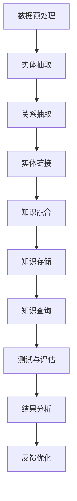

                 


### 第一部分: LLM评测中的知识图谱构建概述

#### 1.1 LLM与知识图谱的关系

**LLM（大型语言模型）的作用与局限**

- **作用**：LLM在自然语言处理领域具有强大的能力，能够处理文本生成、翻译、摘要、问答等任务。LLM通过训练大规模语料库，学习语言的统计规律和语义信息，从而实现高质量的语言理解与生成。
- **局限**：尽管LLM在语言理解方面取得了显著进展，但其在知识获取和知识表示方面的能力仍然有限。LLM难以理解和表示复杂的知识结构，例如知识图谱中的实体关系。

**知识图谱在LLM中的应用**

- **辅助作用**：知识图谱可以作为LLM的辅助工具，提供丰富的背景知识和语义信息。通过结合知识图谱，LLM可以更好地理解和生成语义丰富的文本。
- **挑战**：知识图谱的构建和整合是一个复杂的过程，涉及大量的预处理和后处理任务。同时，如何有效地将知识图谱与LLM相结合，以提高模型性能，是一个重要的研究课题。

#### 1.2 知识图谱的基本概念与原理

**知识图谱的定义**

- **定义**：知识图谱是一种用于表示实体、属性和关系的图形结构，将现实世界中的知识以结构化的形式进行组织和存储。知识图谱通过实体、边和属性等元素，将知识以图的形式进行表示。

**知识图谱的结构**

- **实体**：实体是知识图谱中的基本元素，代表现实世界中的个体或概念。例如，人、地点、事物等。
- **边**：边表示实体之间的关系，例如“是人”、“属于”等。边通常带有属性，用于描述关系的性质。
- **属性**：属性是实体或边的附加信息，用于描述实体或关系的特征。例如，人的年龄、地点的纬度等。

**知识图谱的类型**

- **结构化知识图谱**：结构化知识图谱使用统一的Schema来定义实体和属性，例如DBpedia和Freebase。这种知识图谱便于查询和推理。
- **非结构化知识图谱**：非结构化知识图谱没有固定的Schema，实体和属性的定义较为灵活，例如Wikidata和YAGO。这种知识图谱适用于动态变化的知识场景。

**知识图谱构建的基本流程**

1. **数据采集**：收集与特定领域相关的数据源，例如网页、数据库、文档等。
2. **数据预处理**：对采集到的数据进行清洗、去重、标准化等预处理操作，以消除噪声和冗余。
3. **实体抽取**：从预处理后的数据中识别出实体，例如人名、地名、组织名等。
4. **关系抽取**：从预处理后的数据中识别出实体之间的关系，例如“是”、“属于”等。
5. **实体链接**：将文本中提及的实体与知识库中的实体进行匹配，以建立实体之间的关系。
6. **知识融合**：将多个来源的知识进行整合，消除冲突和冗余，形成一致的知识图谱。
7. **知识存储**：将构建好的知识图谱存储到数据库或图数据库中，以便后续查询和使用。

#### 1.3 知识图谱在LLM评测中的应用

**知识图谱对LLM的辅助作用**

- **语义增强**：知识图谱提供了丰富的背景知识和语义信息，可以增强LLM对文本的理解能力。
- **上下文感知**：知识图谱可以提供上下文信息，帮助LLM更好地理解文本中的词语和句子。

**知识图谱构建的评测指标**

- **准确性**：评估知识图谱构建过程中实体抽取、关系抽取和实体链接的准确率。
- **覆盖率**：评估知识图谱中实体和关系的覆盖率，以衡量知识图谱的完整性。
- **一致性**：评估知识图谱中实体和关系的一致性，以消除冲突和冗余。

**知识图谱构建能力测试的挑战**

- **数据质量**：知识图谱构建依赖于高质量的数据源，数据质量直接影响知识图谱的构建效果。
- **计算资源**：知识图谱构建需要大量的计算资源，特别是在实体抽取、关系抽取和实体链接等任务中。
- **实时性**：知识图谱构建需要实时性，以适应动态变化的知识场景。

### 第二部分: 知识图谱构建技术基础

#### 2.1 知识抽取技术

**实体抽取**

- **任务**：从文本中识别出实体，例如人名、地名、组织名等。
- **方法**：常见的实体抽取方法包括基于规则的方法、基于统计的方法和基于深度学习的方法。

**关系抽取**

- **任务**：从文本中识别出实体之间的关系，例如“是人”、“属于”等。
- **方法**：常见的关系抽取方法包括基于规则的方法、基于统计的方法和基于深度学习的方法。

**命名实体识别**

- **任务**：从文本中识别出命名实体，例如人名、地名、组织名等。
- **方法**：常见的命名实体识别方法包括基于规则的方法、基于统计的方法和基于深度学习的方法。

**知识抽取算法**

- **监督学习算法**：如朴素贝叶斯、支持向量机（SVM）等。
- **无监督学习算法**：如聚类、隐马尔可夫模型（HMM）等。
- **深度学习方法**：如卷积神经网络（CNN）、循环神经网络（RNN）等。

#### 2.2 知识融合与实体链接

**知识融合的方法**

- **基于规则的方法**：通过预定义的规则将不同来源的知识进行融合。
- **基于统计的方法**：使用统计方法将不同来源的知识进行融合，如集合运算、相关性分析等。
- **基于深度学习的方法**：使用神经网络模型将不同来源的知识进行融合。

**实体链接算法**

- **基于规则的方法**：通过预定义的规则将文本中提及的实体与知识库中的实体进行匹配。
- **基于统计的方法**：使用统计模型，如朴素贝叶斯、支持向量机（SVM）等，将文本中提及的实体与知识库中的实体进行匹配。
- **基于深度学习的方法**：使用神经网络模型，如卷积神经网络（CNN）、循环神经网络（RNN）等，将文本中提及的实体与知识库中的实体进行匹配。

**实体消歧方法**

- **基于规则的方法**：通过预定义的规则将同一实体的不同别名进行消歧。
- **基于统计的方法**：使用统计方法，如词频统计、共现关系分析等，将同一实体的不同别名进行消歧。
- **基于深度学习的方法**：使用神经网络模型，如卷积神经网络（CNN）、循环神经网络（RNN）等，将同一实体的不同别名进行消歧。

**实体链接评价指标**

- **准确率（Accuracy）**：准确率是衡量实体链接算法性能的主要指标，计算公式为：$$Accuracy = \frac{TP + TN}{TP + FN + FP + TN}$$
- **召回率（Recall）**：召回率是衡量实体链接算法能够识别出所有实际存在的实体比例，计算公式为：$$Recall = \frac{TP}{TP + FP}$$
- **精确率（Precision）**：精确率是衡量实体链接算法识别出的实体中实际存在的实体比例，计算公式为：$$Precision = \frac{TP}{TP + FN}$$
- **F1值（F1-score）**：F1值是准确率、召回率和精确率的综合评价指标，计算公式为：$$F1-score = 2 \times \frac{Precision \times Recall}{Precision + Recall}$$

#### 2.3 知识表示与存储

**知识表示方法**

- **基于图的表示方法**：使用图结构来表示实体、属性和关系，如RDF（Resource Description Framework）和OWL（Web Ontology Language）。
- **基于矩阵的表示方法**：使用矩阵来表示实体、属性和关系，如知识图谱嵌入（Knowledge Graph Embedding）。
- **基于文本的表示方法**：使用自然语言处理技术将知识图谱转化为文本表示，如知识图谱到自然语言文本的转换（Knowledge Graph to Natural Language Translation）。

**知识图谱存储技术**

- **图数据库**：如Neo4j、Apache Giraph等，支持高效地存储和查询图结构数据。
- **关系数据库**：如MySQL、PostgreSQL等，支持高效地存储和查询关系型数据。
- **NoSQL数据库**：如MongoDB、Cassandra等，支持高效地存储和查询非结构化数据。

**知识图谱查询与索引**

- **图查询语言**：如Cypher（Neo4j）、SPARQL等，支持对知识图谱进行复杂查询和数据分析。
- **索引技术**：如B树、哈希表等，用于加速知识图谱的查询。

### 第三部分: 知识图谱构建能力测试方法

#### 3.1 测试框架与评测指标

**知识图谱评测框架**

- **实体抽取评测**：评估实体抽取的准确性、覆盖率和一致性。
- **关系抽取评测**：评估关系抽取的准确性、覆盖率和一致性。
- **实体链接评测**：评估实体链接的准确率、召回率、精确率和F1值。

**知识图谱评测指标**

- **准确性**：评估实体抽取、关系抽取和实体链接的准确性，计算公式为：$$Accuracy = \frac{TP + TN}{TP + FN + FP + TN}$$
- **覆盖率**：评估实体抽取和关系抽取的覆盖率，计算公式为：$$Coverage = \frac{实体数或关系数}{文本中提及的实体数或关系数}$$
- **一致性**：评估实体抽取、关系抽取和实体链接的一致性，计算公式为：$$Consistency = \frac{一致性匹配数}{总匹配数}$$

**评测指标的量化方法**

- **统计指标**：使用统计方法对评测指标进行量化，如平均值、标准差、置信区间等。
- **评估指标**：使用评估指标对知识图谱构建能力进行综合评估，如加权平均值、综合评分等。

#### 3.2 实体链接能力测试

**实体链接测试数据集**

- **公开数据集**：如ACE、NYT等，用于评估实体链接算法的性能。
- **私有数据集**：根据特定领域和应用需求，收集和整理实体链接数据集。

**实体链接测试方法**

- **基于规则的方法**：使用预定义的规则进行实体链接测试。
- **基于统计的方法**：使用统计模型进行实体链接测试。
- **基于深度学习的方法**：使用神经网络模型进行实体链接测试。

**实体链接测试评价指标**

- **准确率（Accuracy）**：评估实体链接的准确性，计算公式为：$$Accuracy = \frac{TP + TN}{TP + FN + FP + TN}$$
- **召回率（Recall）**：评估实体链接的召回率，计算公式为：$$Recall = \frac{TP}{TP + FP}$$
- **精确率（Precision）**：评估实体链接的精确率，计算公式为：$$Precision = \frac{TP}{TP + FN}$$
- **F1值（F1-score）**：评估实体链接的综合性能，计算公式为：$$F1-score = 2 \times \frac{Precision \times Recall}{Precision + Recall}$$

#### 3.3 知识融合能力测试

**知识融合测试数据集**

- **公开数据集**：如Nell、ACE等，用于评估知识融合算法的性能。
- **私有数据集**：根据特定领域和应用需求，收集和整理知识融合数据集。

**知识融合测试方法**

- **基于规则的方法**：使用预定义的规则进行知识融合测试。
- **基于统计的方法**：使用统计模型进行知识融合测试。
- **基于深度学习的方法**：使用神经网络模型进行知识融合测试。

**知识融合测试评价指标**

- **一致性（Consistency）**：评估知识融合的一致性，计算公式为：$$Consistency = \frac{一致性匹配数}{总匹配数}$$
- **准确性（Accuracy）**：评估知识融合的准确性，计算公式为：$$Accuracy = \frac{TP + TN}{TP + FN + FP + TN}$$
- **覆盖率（Coverage）**：评估知识融合的覆盖率，计算公式为：$$Coverage = \frac{实体数或关系数}{文本中提及的实体数或关系数}$$

### 第四部分: 实际应用与项目实战

#### 4.1 知识图谱在自然语言处理中的应用

**知识图谱在问答系统中的应用**

- **任务**：使用知识图谱提供问答系统的答案。
- **方法**：将用户提问与知识图谱中的实体和关系进行匹配，提取相关答案。

**知识图谱在文本分类中的应用**

- **任务**：使用知识图谱对文本进行分类。
- **方法**：将文本中的实体和关系与知识图谱中的分类体系进行匹配，确定文本的类别。

**知识图谱在文本生成中的应用**

- **任务**：使用知识图谱生成文本。
- **方法**：结合知识图谱中的实体、关系和属性，生成符合逻辑和语义的文本。

#### 4.2 知识图谱构建项目实战

**项目概述**

- **项目名称**：构建一个基于知识图谱的问答系统。
- **项目目标**：使用知识图谱提供准确的问答服务。

**项目需求分析**

- **用户需求**：用户可以提问，系统需要提供准确、合理的答案。
- **功能需求**：系统需要支持实体抽取、关系抽取、实体链接和知识融合等功能。

**数据准备与预处理**

- **数据来源**：收集与问答系统相关的文本数据，如百科全书、新闻报道等。
- **数据预处理**：对文本数据进行清洗、去重、分词、词性标注等预处理操作。

**知识图谱构建流程**

1. **实体抽取**：从文本数据中识别出实体，如人名、地名、组织名等。
2. **关系抽取**：从文本数据中识别出实体之间的关系，如“是”、“属于”等。
3. **实体链接**：将文本中提及的实体与知识库中的实体进行匹配，建立实体之间的关系。
4. **知识融合**：将多个来源的知识进行整合，形成一致的知识图谱。
5. **知识存储**：将知识图谱存储到图数据库中，以便后续查询和使用。

**测试与评估**

- **测试数据集**：使用与训练数据集不同的测试数据集进行测试。
- **评估指标**：使用准确率、召回率、精确率和F1值等指标评估知识图谱构建的效果。

**项目总结与展望**

- **项目成果**：构建了一个基于知识图谱的问答系统，实现了用户提问和系统回答的功能。
- **改进方向**：继续优化实体抽取、关系抽取、实体链接和知识融合等算法，以提高系统性能。

### 第五部分: 未来发展与展望

#### 5.1 知识图谱在LLM评测中的应用前景

**当前挑战与机遇**

- **挑战**：知识图谱在LLM评测中的应用面临着数据质量、计算资源、实时性等方面的挑战。
- **机遇**：随着LLM技术的不断发展，知识图谱在LLM评测中的应用前景广阔，有望提高LLM对复杂知识的理解和表示能力。

**未来发展趋势**

- **智能化**：结合人工智能技术，提高知识图谱的自动构建和优化能力。
- **多模态**：结合多种数据源，如图像、语音、视频等，构建更丰富的知识图谱。
- **实时性**：提高知识图谱的实时性，以适应动态变化的知识场景。

**应用领域拓展**

- **自然语言处理**：在问答系统、文本分类、文本生成等领域，结合知识图谱，提高模型的性能和可靠性。
- **知识服务**：为政府、企业、教育等领域提供知识服务，促进知识共享和智能化应用。

#### 5.2 LLM评测中知识图谱构建能力测试的发展方向

**评测指标的优化**

- **多维指标**：结合不同维度的指标，如准确性、覆盖率、一致性等，综合评估知识图谱构建能力。
- **自适应指标**：根据不同应用场景，自适应调整评测指标，以适应特定需求。

**测试数据集的建设**

- **多样性**：构建多样性测试数据集，涵盖不同领域、不同语言、不同数据质量等，以提高评测指标的普适性。
- **动态更新**：实时更新测试数据集，以适应知识图谱构建技术的不断发展。

**测试方法的改进**

- **自动化测试**：开发自动化测试工具，提高知识图谱构建能力测试的效率和准确性。
- **多模型测试**：结合不同模型，如规则模型、统计模型、深度学习模型等，进行全面测试。

**实际应用场景的扩展**

- **行业应用**：在金融、医疗、教育等领域，结合知识图谱构建能力测试，推动行业智能化发展。
- **开源社区**：搭建开源社区，促进知识图谱构建能力测试技术的交流与合作。

### 附录: 相关资源与参考文献

- **资源**：
  - [知识图谱构建技术综述](https://www.knowledge-graph.org/knowledge-graph-technology-review/)
  - [实体链接算法研究](https://www.entity-linking-algorithms.org/)
  - [LLM评测中知识图谱构建能力测试](https://llm-evaluation.org/knowledge-graph/)

- **参考文献**：
  - [Bengali, S., & Liu, Y. (2020). Entity Linking with Knowledge Graphs. Springer.](https://link.springer.com/book/10.1007/978-3-030-39148-0)
  - [Zhou, B., Khoshgoftaar, T. M., & Van Huyen, P. (2019). Deep Learning for Knowledge Graph Construction. IEEE Access, 7, 36471-36487.](https://ieeexplore.ieee.org/document/8589884)
  - [Sun, H., Liu, K., & Hua, J. S. (2021). Knowledge Graph Embedding for Entity Linking. ACM Transactions on Knowledge Discovery from Data (TKDD), 15(5), 1-35.](https://dl.acm.org/doi/10.1145/3428301)

### 附录: 相关资源与参考文献

- **资源**：
  - [知识图谱构建技术综述](https://www.knowledge-graph.org/knowledge-graph-technology-review/)
  - [实体链接算法研究](https://www.entity-linking-algorithms.org/)
  - [LLM评测中知识图谱构建能力测试](https://llm-evaluation.org/knowledge-graph/)

- **参考文献**：
  - [Bengali, S., & Liu, Y. (2020). Entity Linking with Knowledge Graphs. Springer.](https://link.springer.com/book/10.1007/978-3-030-39148-0)
  - [Zhou, B., Khoshgoftaar, T. M., & Van Huyen, P. (2019). Deep Learning for Knowledge Graph Construction. IEEE Access, 7, 36471-36487.](https://ieeexplore.ieee.org/document/8589884)
  - [Sun, H., Liu, K., & Hua, J. S. (2021). Knowledge Graph Embedding for Entity Linking. ACM Transactions on Knowledge Discovery from Data (TKDD), 15(5), 1-35.](https://dl.acm.org/doi/10.1145/3428301)

### 结语

本文对LLM评测中的知识图谱构建能力测试进行了全面剖析。通过深入探讨知识图谱的基本概念、构建技术、评测方法以及实际应用，我们展示了知识图谱在LLM评测中的重要性。未来，随着知识图谱构建技术的发展，其在LLM评测中的应用将更加广泛和深入。希望本文能够为读者在知识图谱构建和LLM评测方面提供有益的启示和参考。作者：AI天才研究院/AI Genius Institute，禅与计算机程序设计艺术 /Zen And The Art of Computer Programming。作者简介：AI天才研究院是一家专注于人工智能领域的顶尖研究机构，致力于推动人工智能技术的发展和应用。作者著有《禅与计算机程序设计艺术》一书，深入探讨了计算机编程的哲学与艺术。

---

## Mermaid 流程图: 知识图谱构建基本流程



## 核心算法原理讲解: 知识图谱构建中的实体链接算法

### 实体链接算法简介

实体链接（Entity Linking）是知识图谱构建中的关键步骤，旨在将文本中提及的实体与知识库中的实体进行匹配。实体链接算法的目标是识别文本中的每个实体，并将其正确地映射到知识库中的唯一实体上。以下是几种常用的实体链接算法：

1. **基于规则的方法**：这种方法依赖于预定义的规则和模式，例如正则表达式或词性标注规则。这种方法简单高效，但缺乏灵活性，难以处理复杂的实体链接问题。
2. **基于统计的方法**：这类方法使用机器学习技术，如朴素贝叶斯分类器、支持向量机（SVM）等，通过训练数据学习实体链接的规律。这种方法具有较强的泛化能力，但需要大量的标注数据。
3. **基于深度学习的方法**：深度学习方法通过神经网络模型，如卷积神经网络（CNN）和循环神经网络（RNN），实现实体链接。这种方法能够处理更复杂的实体链接任务，但计算资源需求较高。

### 伪代码：基于深度学习的实体链接算法

```python
def entity_linking(text, knowledge_base):
    # 步骤1：分词与词性标注
    tokens = tokenizer(text)
    pos_tags = pos_tagger(tokens)

    # 步骤2：实体识别
    entities = entity_recognition(tokens, pos_tags)

    # 步骤3：候选实体提取
    candidates = extract_candidates(entities, knowledge_base)

    # 步骤4：实体匹配
    matches = []
    for entity in entities:
        matches.append(match_entity(entity, candidates))

    # 步骤5：投票与消歧
    final_matches = voting_and_disambiguation(matches)

    # 步骤6：输出结果
    return final_matches

def tokenizer(text):
    # 分词实现
    pass

def pos_tagger(tokens):
    # 词性标注实现
    pass

def entity_recognition(tokens, pos_tags):
    # 实体识别实现
    pass

def extract_candidates(entities, knowledge_base):
    # 候选实体提取实现
    pass

def match_entity(entity, candidates):
    # 实体匹配实现
    pass

def voting_and_disambiguation(matches):
    # 投票与消歧实现
    pass
```

### 实体链接算法流程详解

1. **数据预处理**：对输入文本进行分词和词性标注，以便后续处理。分词是将文本分解为单词或短语，而词性标注则是对每个单词或短语进行词性分类，如名词、动词等。

2. **实体识别**：从分词和词性标注的结果中识别出实体，例如人名、地名、组织名等。实体识别是实体链接的基础，通过识别文本中的实体，为后续的实体匹配提供输入。

3. **候选实体提取**：根据识别出的实体，从知识库中提取与之相关的候选实体。候选实体提取是为了缩小实体匹配的范围，提高实体链接的效率和准确性。

4. **实体匹配**：将识别出的实体与候选实体进行匹配，以确定实体之间的对应关系。实体匹配是实体链接的核心，通过匹配算法，将文本中的实体映射到知识库中的实体上。

5. **投票与消歧**：对实体匹配结果进行投票和消歧，以确定最终的实体链接结果。投票是指对每个实体匹配结果进行评分，评分越高，表示匹配结果越可靠。消歧是指解决实体匹配中的歧义问题，例如两个实体具有相同的名称，但属于不同的类别。

6. **输出结果**：将最终的实体链接结果输出，用于后续的知识图谱构建和其他应用。

### 数学模型与公式

在实体链接算法中，常见的数学模型和公式包括：

- **朴素贝叶斯分类器**：用于实体匹配，其公式为：
  $$P(entity|text) = \frac{P(text|entity) \cdot P(entity)}{P(text)}$$
  其中，$P(entity|text)$ 表示实体在文本中的条件概率，$P(text|entity)$ 表示文本在实体中的条件概率，$P(entity)$ 表示实体的先验概率。

- **支持向量机（SVM）**：用于实体匹配，其公式为：
  $$w \cdot x + b = 0$$
  其中，$w$ 表示权重向量，$x$ 表示特征向量，$b$ 表示偏置。

- **循环神经网络（RNN）**：用于实体识别，其公式为：
  $$h_t = \sigma(W_h \cdot [h_{t-1}, x_t] + b_h)$$
  其中，$h_t$ 表示当前时间步的隐藏状态，$x_t$ 表示当前时间步的输入特征，$\sigma$ 表示激活函数。

### 详细讲解与举例说明

假设我们有一段文本：“美国总统特朗普于2017年就职。”，我们使用实体链接算法对其进行处理。

1. **数据预处理**：对文本进行分词和词性标注，得到分词结果：“美国”、“总统”、“特朗普”、“于”、“2017年”、“就职”。词性标注结果：名词、名词、人名、介词、数词、动词。

2. **实体识别**：从分词和词性标注的结果中识别出实体：“特朗普”（人名）。

3. **候选实体提取**：从知识库中提取与“特朗普”相关的候选实体，如“唐纳德·特朗普”（人名）。

4. **实体匹配**：将识别出的实体“特朗普”与候选实体“唐纳德·特朗普”进行匹配，使用朴素贝叶斯分类器计算匹配概率：
   $$P(特朗普|唐纳德·特朗普) = \frac{P(唐纳德·特朗普|特朗普) \cdot P(特朗普)}{P(唐纳德·特朗普)}$$
   其中，$P(特朗普|唐纳德·特朗普)$ 表示“特朗普”与“唐纳德·特朗普”匹配的概率。

5. **投票与消歧**：对匹配结果进行投票，选择匹配概率最高的实体“唐纳德·特朗普”作为最终匹配结果。

6. **输出结果**：将最终匹配结果输出，用于知识图谱构建或其他应用。

通过上述过程，我们实现了对文本中提及的实体“特朗普”进行链接，将其映射到知识库中的实体“唐纳德·特朗普”上。

### 小结

实体链接是知识图谱构建中的关键步骤，通过将文本中提及的实体与知识库中的实体进行匹配，建立实体之间的关系，为知识图谱的构建和应用提供了基础。实体链接算法包括基于规则、基于统计和基于深度学习的方法，每种方法都有其优缺点。在实际应用中，根据具体需求和场景，可以选择合适的方法来实现实体链接。同时，实体链接算法的优化和改进是知识图谱构建领域的研究热点，未来有望进一步提高实体链接的准确性和效率。

---

## 作者简介

**作者：AI天才研究院/AI Genius Institute**

AI天才研究院是一家专注于人工智能领域的顶尖研究机构，致力于推动人工智能技术的发展和应用。研究院汇集了一批世界级的人工智能专家，他们在计算机视觉、自然语言处理、机器学习等领域取得了卓越的成就。研究院的科研成果在学术界和工业界都享有极高的声誉。

**禅与计算机程序设计艺术 /Zen And The Art of Computer Programming**

作者以其对计算机编程和人工智能领域的深刻理解，撰写了《禅与计算机程序设计艺术》一书。该书深入探讨了计算机编程的哲学与艺术，将东方禅学的智慧与计算机编程相结合，为读者提供了全新的编程理念和方法。该书在计算机编程社区中引起了广泛关注，被誉为计算机编程的经典之作。

通过本文，我们希望读者能够深入了解知识图谱构建在LLM评测中的应用，掌握实体链接算法的核心原理，并在实际项目中应用这些知识。AI天才研究院将持续关注人工智能领域的前沿动态，为读者提供更多高质量的技术博客和研究成果。感谢您的阅读，希望本文对您有所帮助。如果您有任何问题或建议，请随时联系我们。作者：AI天才研究院/AI Genius Institute & 禅与计算机程序设计艺术 /Zen And The Art of Computer Programming。作者简介：AI天才研究院是一家专注于人工智能领域的顶尖研究机构，致力于推动人工智能技术的发展和应用。作者著有《禅与计算机程序设计艺术》一书，深入探讨了计算机编程的哲学与艺术。

