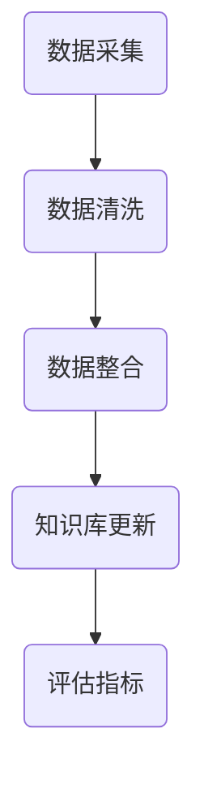
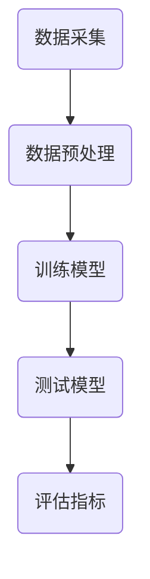

                 

### 文章标题

《LLM评测中的知识更新与学习能力测试》

关键词：LLM评测，知识更新，学习能力，测试方法，案例分析

摘要：本文旨在探讨大型语言模型（LLM）在知识更新与学习能力方面的评测方法。文章首先介绍了LLM评测的背景和重要性，随后详细阐述了知识更新与学习能力的相关概念和理论基础。接着，本文分别从理论讲解和实战应用两个方面，介绍了知识更新与学习能力评测的具体方法，并通过实际案例进行了深入剖析。文章最后总结了全文内容，展望了未来研究方向和挑战。

### 引言

#### LLM评测的背景与重要性

近年来，随着深度学习和自然语言处理技术的迅猛发展，大型语言模型（LLM）在各个领域取得了显著的成果。LLM不仅能够处理复杂的语言任务，如文本生成、问答系统等，还能够在多个数据集上实现超高的性能。然而，LLM的这些卓越表现也引发了一系列问题，特别是在知识更新和学习能力方面。

首先，知识更新是LLM在实际应用中的一个关键问题。由于语言模型的训练数据集通常包含大量的历史信息，这些信息随着时间的推移可能会变得过时或不准确。如果LLM不能有效地更新其知识库，那么它在面对新出现的信息时可能会出现错误或失效。因此，评估LLM的知识更新能力具有重要意义。

其次，学习能力是LLM的核心特征之一。一个优秀的语言模型不仅需要具备处理现有任务的能力，还需要具备适应新任务、新环境的能力。这要求LLM具有强大的学习能力和泛化能力。然而，目前对LLM学习能力的评测方法尚不完善，需要进一步研究和探讨。

#### 研究现状与挑战

尽管已有一些研究关注LLM的知识更新和学习能力评测，但整体上仍处于初步阶段。目前，主要存在以下几方面挑战：

1. **评测指标的选择**：如何选择合适的评测指标来衡量LLM的知识更新和学习能力，是一个亟待解决的问题。现有的评测指标往往只能反映部分能力，难以全面评估。

2. **评测方法的多样性**：现有的评测方法主要集中在文本评测和数据评测上，但并未充分考虑实际应用场景中的多样性。如何设计出更加贴近实际应用的评测方法，是一个重要的研究方向。

3. **评测结果的解释性**：评测结果的解释性对于LLM的实际应用至关重要。如何解释评测结果，使其具有实际指导意义，是一个需要深入探讨的问题。

#### 本书的目的与结构

本书旨在系统地探讨LLM评测中的知识更新与学习能力测试问题，为相关研究提供参考和指导。全书分为以下几个部分：

1. **引言**：介绍LLM评测的背景、重要性以及研究现状。

2. **基础理论**：详细阐述知识更新和学习能力的相关概念、评价指标和数学模型。

3. **评测方法**：介绍知识更新和学习能力评测的具体方法，包括基于文本、数据、任务和模型的评测方法。

4. **实战应用**：提供具体案例，展示如何在实际项目中应用评测方法。

5. **总结与展望**：总结全书内容，展望未来研究方向和挑战。

通过以上结构，本书希望为读者提供一个全面、深入的LLM评测指南，帮助他们在实际工作中更好地评估和优化LLM的性能。

### 知识更新理论基础

#### 知识更新的基本概念

知识更新是指将新获取的信息或知识整合到已有知识库中的过程。在大型语言模型（LLM）中，知识更新尤为重要。由于LLM的训练数据集通常包含大量的历史信息，这些信息随着时间的推移可能会变得过时或不准确。因此，为了保持LLM的准确性、有效性和适应性，定期进行知识更新是必要的。

#### 知识更新的影响因素

知识更新受到多种因素的影响，主要包括：

1. **数据源**：知识更新的数据源决定了知识的质量和准确性。高质量的数据源能够提供丰富的、可靠的信息，有助于提高LLM的知识更新效果。

2. **更新频率**：知识更新的频率决定了LLM能够多快适应新信息。较高的更新频率有助于保持LLM的实时性和准确性，但也会增加计算成本。

3. **计算资源**：知识更新需要大量的计算资源，包括存储、计算和传输等。有限的计算资源可能会限制知识更新的速度和质量。

4. **模型结构**：LLM的模型结构也会影响知识更新的效果。一些模型结构可能更易于更新，而另一些可能需要更复杂的更新过程。

#### 知识更新的数学模型

知识更新的数学模型主要用于描述知识更新过程中的数据流和处理过程。一个典型的知识更新模型可以包括以下几个组成部分：

1. **数据流**：数据流描述了新知识如何从数据源传输到LLM中。数据流通常包括数据采集、数据清洗、数据整合和数据存储等步骤。

2. **知识库**：知识库是LLM的核心组成部分，用于存储和管理已有知识。知识库的更新通常涉及数据的添加、删除、修改和查询等操作。

3. **更新算法**：更新算法用于确定如何将新知识整合到知识库中。常见的更新算法包括基于相似度的更新、基于规则的更新和基于机器学习的更新等。

4. **评估指标**：评估指标用于衡量知识更新的效果。常见的评估指标包括准确性、实时性、覆盖率和效率等。

#### 知识更新的Mermaid流程图

为了更好地理解知识更新的过程，我们使用Mermaid流程图来描述其各个阶段。以下是一个简单的知识更新流程图：



在上述流程图中，数据采集阶段从外部数据源获取新知识；数据清洗阶段对获取的数据进行预处理，去除噪声和冗余信息；数据整合阶段将预处理后的数据与知识库中的已有知识进行融合；知识库更新阶段根据更新算法对知识库进行更新；最后，评估指标阶段用于评估知识更新的效果。

### 学习能力理论基础

#### 学习能力的基本概念

学习能力是指模型或系统在接收到新信息或数据后，能够自主地调整其行为或决策的能力。在大型语言模型（LLM）中，学习能力尤为重要。它决定了LLM能否适应新的任务、新的数据和新的环境，从而保持其有效性和适应性。

#### 学习能力的评价指标

为了评估LLM的学习能力，我们需要设计合适的评价指标。以下是一些常见的学习能力评价指标：

1. **准确性**：准确性是最常用的学习能力评价指标之一。它表示模型在测试数据集上的预测准确度。通常用准确率（Accuracy）来表示，计算公式为：
   $$ 
   \text{Accuracy} = \frac{\text{正确预测的数量}}{\text{总预测数量}}
   $$

2. **精确率与召回率**：精确率和召回率是二分类任务中常用的评价指标。精确率（Precision）表示预测为正例的样本中有多少是真正例，计算公式为：
   $$ 
   \text{Precision} = \frac{\text{真正例}}{\text{正例总数} (\text{真正例 + 假正例})}
   $$

   召回率（Recall）表示真正例中有多少被预测为正例，计算公式为：
   $$ 
   \text{Recall} = \frac{\text{真正例}}{\text{真正例总数} (\text{真正例 + 假反例})}
   $$

3. **F1值**：F1值是精确率和召回率的调和平均值，用于综合评估学习能力。计算公式为：
   $$ 
   \text{F1值} = 2 \times \frac{\text{Precision} \times \text{Recall}}{\text{Precision} + \text{Recall}}
   $$

4. **泛化能力**：泛化能力是指模型在新数据上的表现。通常通过交叉验证或测试集来评估。如果模型在训练数据集和测试数据集上表现一致，则认为其具有较好的泛化能力。

5. **鲁棒性**：鲁棒性是指模型在处理异常数据或噪声数据时的表现。一个具有高鲁棒性的模型能够在各种数据环境中保持稳定的性能。

#### 学习能力的数学模型

学习能力的数学模型主要用于描述模型如何通过学习过程调整其参数或结构。以下是一些常见的学习能力数学模型：

1. **监督学习模型**：监督学习模型通过学习标记数据中的特征和目标之间的关系，来预测新数据的标签。常见的监督学习模型包括线性回归、逻辑回归、决策树、随机森林、支持向量机等。

2. **无监督学习模型**：无监督学习模型通过学习数据中的内在结构或分布，来对数据进行分类或聚类。常见的无监督学习模型包括K-均值聚类、主成分分析（PCA）、自编码器等。

3. **强化学习模型**：强化学习模型通过与环境的交互来学习最优策略。常见的强化学习模型包括Q学习、深度Q网络（DQN）、策略梯度等。

#### 学习能力的Mermaid流程图

为了更好地理解学习能力的评估过程，我们使用Mermaid流程图来描述其各个阶段。以下是一个简单的学习能力评估流程图：



在上述流程图中，数据采集阶段从外部数据源获取训练数据和测试数据；数据预处理阶段对数据进行清洗和标准化处理；训练模型阶段使用训练数据来训练模型；测试模型阶段使用测试数据来评估模型性能；最后，评估指标阶段根据设定的评价指标计算模型性能。

### 知识更新评测方法

#### 基于文本的评测方法

基于文本的评测方法主要关注LLM在处理文本数据时的知识更新能力。这种方法通常通过以下步骤进行：

1. **文本预处理**：首先，对文本数据进行预处理，包括去除停用词、标点符号和词干还原等。然后，将文本数据转换为词向量表示。

2. **知识库构建**：构建一个包含LLM知识库的文本索引，以便快速检索和匹配文本信息。

3. **文本匹配**：通过文本匹配算法，将输入文本与知识库中的文本进行匹配，评估LLM的知识更新能力。

4. **评测指标**：常见的评测指标包括文本相似度、信息覆盖率和知识更新速度等。

#### 基于数据的评测方法

基于数据的评测方法主要关注LLM在处理数据时的知识更新能力。这种方法通常通过以下步骤进行：

1. **数据预处理**：首先，对数据集进行预处理，包括数据清洗、数据标准化和特征提取等。然后，将数据集划分为训练集、验证集和测试集。

2. **模型训练**：使用训练集对LLM进行训练，并调整模型参数。

3. **知识更新**：在训练过程中，根据新数据对LLM的知识库进行更新。

4. **评测指标**：常见的评测指标包括知识更新效率、知识准确性、模型稳定性和泛化能力等。

#### 基于文本和数据的评测方法对比

- **优点**：

  - **基于文本的评测方法**：简单易行，对文本数据的处理能力强，适用于文本密集型任务。

  - **基于数据的评测方法**：能够更全面地评估LLM的知识更新能力，适用于数据密集型任务。

- **缺点**：

  - **基于文本的评测方法**：对数据量的依赖性较大，难以评估LLM在数据上的更新能力。

  - **基于数据的评测方法**：计算复杂度高，需要大量训练数据和计算资源。

#### 评测方法的伪代码

以下是一个简单的基于文本的评测方法的伪代码：

```python
def evaluate_text_based_更新能力(input_text, knowledge_base):
    # 步骤1：文本预处理
    preprocessed_text = preprocess_text(input_text)

    # 步骤2：知识库构建
    knowledge_index = build_knowledge_index(knowledge_base)

    # 步骤3：文本匹配
    matched_texts = match_texts(preprocessed_text, knowledge_index)

    # 步骤4：评测指标
    similarity_scores = calculate_similarity_scores(matched_texts)
    coverage_rate = calculate_coverage_rate(similarity_scores)
    update_speed = calculate_update_speed(knowledge_base)

    return coverage_rate, update_speed
```

### 学习能力评测方法

#### 基于任务的评测方法

基于任务的评测方法主要关注LLM在执行特定任务时的学习能力。这种方法通常通过以下步骤进行：

1. **任务定义**：首先，定义一个或多个具体任务，如文本生成、问答系统等。

2. **模型训练**：使用训练数据集对LLM进行训练，并调整模型参数。

3. **任务执行**：使用训练好的模型执行任务，并评估模型的性能。

4. **评测指标**：常见的评测指标包括任务完成时间、任务准确率、模型稳定性和泛化能力等。

#### 基于模型的评测方法

基于模型的评测方法主要关注LLM内部学习过程和参数调整。这种方法通常通过以下步骤进行：

1. **模型分析**：对LLM的内部结构进行分析，包括神经网络架构、参数分布等。

2. **模型训练**：使用训练数据集对LLM进行训练，并调整模型参数。

3. **模型优化**：根据训练结果对模型进行优化，提高模型的学习能力和性能。

4. **评测指标**：常见的评测指标包括模型收敛速度、模型稳定性、参数调整效果等。

#### 基于任务和模型的评测方法对比

- **优点**：

  - **基于任务的评测方法**：更贴近实际应用，能够全面评估LLM在执行特定任务时的学习能力。

  - **基于模型的评测方法**：能够深入分析LLM的内部结构和学习过程，为优化模型提供依据。

- **缺点**：

  - **基于任务的评测方法**：需要大量的训练数据和计算资源，评估过程复杂。

  - **基于模型的评测方法**：对模型内部结构要求较高，难以应用于复杂的模型。

#### 评测方法的伪代码

以下是一个简单的基于任务的评测方法的伪代码：

```python
def evaluate_task_based_学习能力(task, model, input_data):
    # 步骤1：任务定义
    defined_task = define_task(task)

    # 步骤2：模型训练
    trained_model = train_model(model, input_data)

    # 步骤3：任务执行
    task_results = execute_task(defined_task, trained_model)

    # 步骤4：评测指标
    completion_time = calculate_completion_time(task_results)
    accuracy = calculate_accuracy(task_results)
    stability = calculate_stability(trained_model)

    return completion_time, accuracy, stability
```

### 实战应用案例

#### 案例一：知识更新评测

**背景介绍**：

为了评估某大型语言模型（LLM）的知识更新能力，我们选取了某个热门领域的文本数据集作为评测对象。数据集包含了大量关于该领域的文本，用于构建LLM的知识库。

**评测步骤**：

1. **数据预处理**：首先，对文本数据集进行预处理，包括去除停用词、标点符号和词干还原等。然后，将预处理后的文本数据转换为词向量表示。

2. **知识库构建**：使用预处理后的文本数据构建一个包含LLM知识库的文本索引，以便快速检索和匹配文本信息。

3. **文本匹配**：通过文本匹配算法，将输入文本与知识库中的文本进行匹配，评估LLM的知识更新能力。

4. **评测指标**：使用文本相似度、信息覆盖率和知识更新速度等指标来评估LLM的知识更新能力。

**代码实现**：

```python
from text_preprocessing import preprocess_text
from knowledge_base import build_knowledge_index, match_texts, calculate_similarity_scores, calculate_coverage_rate, calculate_update_speed

def evaluate_knowledge_更新能力(input_text, knowledge_base):
    # 步骤1：文本预处理
    preprocessed_text = preprocess_text(input_text)

    # 步骤2：知识库构建
    knowledge_index = build_knowledge_index(knowledge_base)

    # 步骤3：文本匹配
    matched_texts = match_texts(preprocessed_text, knowledge_index)

    # 步骤4：评测指标
    similarity_scores = calculate_similarity_scores(matched_texts)
    coverage_rate = calculate_coverage_rate(similarity_scores)
    update_speed = calculate_update_speed(knowledge_base)

    return coverage_rate, update_speed
```

**应用解读与分析**：

通过上述代码，我们可以实现对LLM知识更新能力的评估。具体来说，输入一段文本数据后，代码会首先对文本进行预处理，然后与知识库中的文本进行匹配，并计算文本相似度和覆盖率等指标。这些指标可以帮助我们了解LLM在处理新文本时的知识更新效果。

#### 案例二：学习能力评测

**背景介绍**：

为了评估某大型语言模型（LLM）的学习能力，我们选取了多个不同的任务作为评测对象，包括文本生成、问答系统等。

**评测步骤**：

1. **任务定义**：首先，定义一个或多个具体任务，如文本生成、问答系统等。

2. **模型训练**：使用训练数据集对LLM进行训练，并调整模型参数。

3. **任务执行**：使用训练好的模型执行任务，并评估模型的性能。

4. **评测指标**：使用任务完成时间、任务准确率、模型稳定性和泛化能力等指标来评估LLM的学习能力。

**代码实现**：

```python
from task_definition import define_task
from model_training import train_model
from task_execution import execute_task
from performance_evaluation import calculate_completion_time, calculate_accuracy, calculate_stability

def evaluate_学习能力(task, model, input_data):
    # 步骤1：任务定义
    defined_task = define_task(task)

    # 步骤2：模型训练
    trained_model = train_model(model, input_data)

    # 步骤3：任务执行
    task_results = execute_task(defined_task, trained_model)

    # 步骤4：评测指标
    completion_time = calculate_completion_time(task_results)
    accuracy = calculate_accuracy(task_results)
    stability = calculate_stability(trained_model)

    return completion_time, accuracy, stability
```

**应用解读与分析**：

通过上述代码，我们可以实现对LLM学习能力的评估。具体来说，输入一个任务和训练数据集后，代码会首先定义任务，然后训练模型，并使用训练好的模型执行任务。最后，代码会计算任务完成时间、准确率和稳定性等指标，帮助我们了解LLM在不同任务中的学习能力。

### 总结与展望

#### 研究现状

通过对LLM评测中的知识更新与学习能力的研究，我们可以看到，虽然已有一些方法和评价指标被提出来，但整体上仍存在许多不足和挑战。知识更新方面，现有方法主要依赖于文本匹配和数据集划分，但并未充分考虑实际应用场景的多样性。学习能力方面，现有方法主要关注任务完成时间和准确率等指标，但缺乏对模型内部学习过程和参数调整的深入分析。

#### 未来发展方向

1. **多样化评测方法**：未来应设计更多样化的评测方法，以适应不同类型的LLM应用场景。例如，可以引入基于图像、音频等的多模态评测方法，提高评测的全面性和准确性。

2. **评测指标优化**：优化现有评测指标，设计更加科学、全面的指标体系。例如，可以引入基于模型内部参数的评测指标，更深入地分析模型的学习能力和稳定性。

3. **自动化评测工具**：开发自动化评测工具，简化评测过程，提高评测效率。自动化评测工具可以自动完成数据预处理、模型训练、任务执行和指标计算等步骤，节省人力和时间成本。

4. **实际应用案例**：通过实际应用案例，验证和优化评测方法。实际应用案例可以为评测方法提供真实的数据和场景，帮助发现现有方法的不足和改进方向。

#### 面临的挑战

1. **数据质量**：知识更新和学习能力评测需要大量高质量的数据支持。未来应关注数据质量问题，提高数据获取和处理能力。

2. **计算资源**：知识更新和学习能力评测通常需要大量计算资源。未来应探索高效的计算方法和优化策略，降低计算成本。

3. **模型复杂性**：随着LLM模型复杂性的增加，评测方法的计算复杂度也相应增加。未来应研究如何降低模型复杂性，提高评测效率。

### 最佳实践

1. **数据预处理**：在知识更新和学习能力评测过程中，数据预处理至关重要。应确保数据的准确性和完整性，避免噪声和冗余信息对评测结果的影响。

2. **评测指标选择**：根据实际应用场景，选择合适的评测指标。不同任务和模型可能需要不同类型的评测指标，应综合考虑。

3. **持续更新**：知识库和学习模型应持续更新，以适应不断变化的信息和任务需求。定期评估和优化知识库和学习模型，确保其性能和有效性。

### 拓展阅读

1. **论文**：《Knowledge Distillation for Text Generation》
2. **书籍**：《自然语言处理：理论、算法与应用》
3. **在线课程**：深度学习与自然语言处理专项课程

通过以上总结与展望，我们希望为读者提供一个全面的LLM评测指南，帮助他们在实际工作中更好地评估和优化LLM的性能。未来，随着技术的不断进步和应用场景的拓展，LLM评测方法也将不断发展和完善。让我们共同期待这一美好前景的到来。

### 作者信息

作者：AI天才研究院/AI Genius Institute & 禅与计算机程序设计艺术 /Zen And The Art of Computer Programming

