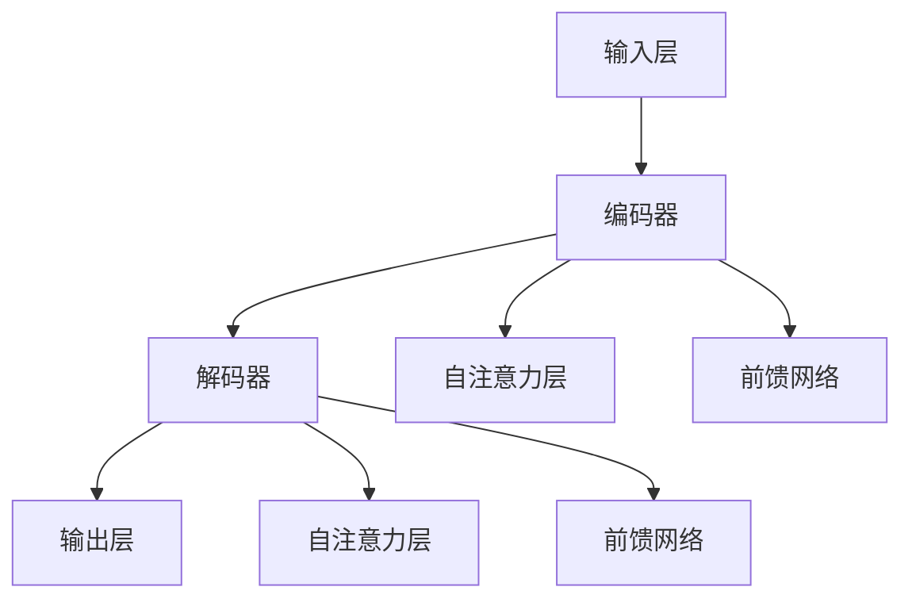

                 

### 文章标题

### LLM评测指标体系：量化模型优劣

关键词：LLM评测、量化模型、评价指标、质量评测、性能评测、鲁棒性评测

摘要：本文将深入探讨LLM（大型语言模型）的评测指标体系，旨在为读者提供一套全面、系统的量化模型优劣的方法。通过对质量、性能、鲁棒性等评测指标的分析和阐述，本文将帮助读者更好地理解LLM模型在不同应用场景下的表现和优劣，为模型的优化和应用提供有力支持。

## 目录

1. 引言  
2. LLM基本概念与架构  
3. LLM的核心算法原理  
4. LLM评测指标体系  
   4.1. 质量评测指标  
   4.2. 性能评测指标  
   4.3. 鲲棒性评测指标  
5. 案例分析  
6. 最佳实践与展望  
7. 附录

## 引言

随着深度学习技术的飞速发展，大型语言模型（LLM）在自然语言处理（NLP）领域取得了显著的成果。LLM具有强大的语言理解和生成能力，广泛应用于文本生成、对话系统、机器翻译等场景。然而，如何评价LLM模型的好坏，如何量化模型在不同应用场景中的优劣，成为当前研究和应用中亟待解决的问题。

本文将针对LLM评测指标体系进行深入探讨，从质量、性能、鲁棒性等多个维度出发，提出一套全面的量化模型优劣的方法。通过本文的阅读，读者将能够：

1. 了解LLM的基本概念和架构；  
2. 掌握LLM的核心算法原理；  
3. 理解LLM评测指标体系及其在不同维度上的作用；  
4. 学习如何通过案例分析来实际应用评测指标；  
5. 获得LLM模型优化和应用的启示和指导。

## LLM基本概念与架构

LLM是一种基于深度学习技术的语言模型，其核心思想是通过学习大量文本数据，构建一个能够理解和生成自然语言的模型。LLM的基本概念包括：

1. **语言模型**：语言模型是一种概率模型，用于预测下一个单词或句子。在NLP任务中，语言模型可以用来进行文本生成、文本分类、机器翻译等。

2. **神经网络**：神经网络是深度学习中常用的模型结构，通过多层非线性变换来实现特征提取和表示学习。

3. **自注意力机制**：自注意力机制是LLM中的关键组件，能够自适应地分配不同权重视觉每个输入序列中的单词，从而提高模型的表示能力。

4. **Transformer架构**：Transformer是一种基于自注意力机制的序列到序列模型，其结构简单、参数高效，已经在多个NLP任务中取得了显著的效果。

LLM的架构主要包括以下几个部分：

1. **编码器（Encoder）**：编码器负责对输入序列进行编码，生成一个固定长度的向量表示。在Transformer架构中，编码器由多个自注意力层和前馈网络组成。

2. **解码器（Decoder）**：解码器负责对编码器生成的向量进行解码，生成输出序列。在Transformer架构中，解码器同样由多个自注意力层和前馈网络组成。

3. **输入层（Input Layer）**：输入层负责接收输入序列，并将其传递给编码器。

4. **输出层（Output Layer）**：输出层负责将解码器生成的向量转换为输出序列，通常使用softmax激活函数进行分类或生成。

通过图1可以清晰地看到LLM的架构及其组件之间的关系。



图1：LLM的架构图

## LLM的核心算法原理

LLM的核心算法原理主要包括以下几个方面：

1. **概率论和信息论**：概率论和信息论是构建语言模型的基础。概率论提供了对语言数据概率分布的建模，而信息论则提供了衡量信息量和不确定性度的方法。

2. **概率图模型**：概率图模型是一种图形化表示概率关系的工具，可以用于表示语言模型的参数。常见的概率图模型包括隐马尔可夫模型（HMM）和条件随机场（CRF）。

3. **序列模型**：序列模型是一种用于处理序列数据的模型，其核心思想是将序列中的每个元素作为输入，通过模型生成下一个元素。常见的序列模型包括循环神经网络（RNN）和长短时记忆网络（LSTM）。

4. **注意力机制**：注意力机制是一种用于提高模型表示能力的技巧，其核心思想是自适应地分配不同权重视觉输入序列中的不同部分。注意力机制在机器翻译、文本生成等任务中得到了广泛应用。

5. **Transformer架构**：Transformer是一种基于自注意力机制的序列到序列模型，其结构简单、参数高效。Transformer通过多头自注意力机制和位置编码来实现对输入序列的建模，并在多个NLP任务中取得了优异的性能。

下面是LLM的核心算法原理的伪代码表示：

```python
# 输入层
input_sequence = ...

# 编码器
for layer in encoder_layers:
    # 自注意力层
    attention_weights = self.self_attention(input_sequence)
    input_sequence = self.add_attention(input_sequence, attention_weights)
    
    # 前馈网络
    input_sequence = self.feedforward(input_sequence)

# 解码器
for layer in decoder_layers:
    # 自注意力层
    attention_weights = self.self_attention(input_sequence)
    input_sequence = self.add_attention(input_sequence, attention_weights)
    
    # 交叉注意力层
    cross_attention_weights = self.cross_attention(input_sequence, encoder_sequence)
    input_sequence = self.add_cross_attention(input_sequence, cross_attention_weights)
    
    # 前馈网络
    input_sequence = self.feedforward(input_sequence)

# 输出层
output_sequence = self.output_layer(input_sequence)
```

通过上述算法原理，LLM能够高效地处理自然语言数据，并在多种NLP任务中取得优异的性能。

## LLM评测指标体系

LLM的评测指标体系是评估模型性能和优劣的关键。评测指标体系主要包括质量评测指标、性能评测指标和鲁棒性评测指标。以下将对这些指标进行详细阐述。

### 1. 质量评测指标

质量评测指标主要用于评估模型在NLP任务中的表现，包括语言准确性、流畅性和创造性等。

#### 1.1 语言准确性

语言准确性是指模型在生成文本时，生成的文本与真实文本之间的相似度。常用的指标包括：

- 准确率（Accuracy）：准确率表示模型预测正确的样本数占总样本数的比例。其计算公式为：
  $$\text{Accuracy} = \frac{\text{正确预测的样本数}}{\text{总样本数}}$$
- 召回率（Recall）：召回率表示模型能够正确召回的样本数与实际存在的样本数的比例。其计算公式为：
  $$\text{Recall} = \frac{\text{正确召回的样本数}}{\text{实际存在的样本数}}$$
- F1值（F1-score）：F1值是准确率和召回率的调和平均值，用于综合考虑模型的准确性和召回率。其计算公式为：
  $$\text{F1-score} = \frac{2 \times \text{准确率} \times \text{召回率}}{\text{准确率} + \text{召回率}}$$

#### 1.2 流畅性

流畅性是指模型生成的文本在语法、语义和风格上是否符合人类的自然语言表达。常用的指标包括：

- 标准化流畅性指标（如语法错误率、语法复杂度等）：这些指标通过统计文本中的语法错误和复杂度来评估流畅性。
- 用户感知流畅性：用户感知流畅性是通过用户对文本的满意度来评估流畅性。可以通过问卷调查、用户评分等方式进行评估。

#### 1.3 创造性

创造性是指模型在生成文本时的创新性和独特性。常用的指标包括：

- 创造性度量方法：如文本新颖性、文本独特性等。这些指标通过统计文本中的新单词、新句子等来评估创造性。
- 创造性在实际应用中的意义：如文本生成、故事创作等。这些应用需要模型具备较强的创造性，以生成独特的、引人入胜的文本内容。

### 2. 性能评测指标

性能评测指标主要用于评估模型在实际应用中的性能，包括速度、能量效率等。

#### 2.1 速度

速度是指模型在处理数据时的响应速度。常用的指标包括：

- 响应时间（Response Time）：响应时间是指模型从接收输入到输出结果的时间。响应时间越短，模型处理速度越快。
- 批处理大小（Batch Size）：批处理大小是指模型一次处理的数据量。批处理大小越大，模型处理速度越快，但可能影响模型的准确性。

#### 2.2 能量效率

能量效率是指模型在处理数据时的能量消耗。常用的指标包括：

- 能量消耗（Energy Consumption）：能量消耗是指模型在处理数据过程中消耗的能量。能量消耗越低，模型的能量效率越高。
- 温度管理（Temperature Management）：温度管理是指模型在处理数据时对温度的控制。合理的温度管理可以降低模型的能量消耗。

#### 2.3 能量效率优化策略

能量效率优化策略是指通过优化模型结构和算法来提高模型的能量效率。常用的策略包括：

- 深度学习优化：如量化、剪枝、低秩分解等。
- 硬件优化：如GPU加速、TPU优化等。

### 3. 鲲棒性评测指标

鲁棒性评测指标主要用于评估模型在各种输入条件下的一致性和稳定性。

#### 3.1 抗干扰性

抗干扰性是指模型在受到噪声、错误输入等干扰时，仍能保持良好性能的能力。常用的指标包括：

- 非标准化输入处理：如输入数据的多样性、输入数据的完整性等。这些指标评估模型在处理非标准化输入时的鲁棒性。
- 输入数据的多样性：输入数据的多样性越高，模型的鲁棒性越强。

#### 3.2 偏见与公平性

偏见与公平性是指模型在处理不同数据集时，是否会出现偏见和不公平现象。常用的指标包括：

- 偏见的定义：偏见是指模型在处理特定数据集时，对某些类别的表现优于其他类别。偏见可以通过统计模型在不同数据集上的准确率、召回率等指标来评估。
- 偏见检测方法：如偏见检测算法、公平性度量等。这些方法可以检测模型是否具有偏见，并提供改进策略。
- 公平性改进策略：如数据增强、模型训练策略优化等。这些策略可以减少模型偏见，提高模型的公平性。

通过上述评测指标，可以全面、系统地评估LLM模型在不同应用场景中的性能和优劣。这些指标对于LLM模型的研究、优化和应用具有重要意义。

## 案例分析

为了更好地理解和应用LLM评测指标体系，我们通过一个具体的案例分析来展示如何在实际项目中评估LLM模型。

### 案例背景

某知名科技公司计划开发一款智能客服系统，该系统需要使用LLM模型来生成对用户问题的自动回复。为了确保模型的质量和性能，公司决定采用一套全面的评测指标体系来评估模型的优劣。

### 案例步骤

1. **数据集准备**：公司从实际客服对话中收集了10000条问题及其对应的专家回复。数据集被划分为训练集、验证集和测试集。

2. **模型训练**：公司选择了一种基于Transformer架构的LLM模型，使用训练集对模型进行训练。训练过程中，公司使用了多种数据增强技术，如噪声添加、数据重组等，以提高模型的泛化能力。

3. **质量评测**：公司使用以下指标对模型进行质量评测：
   - 准确率：通过计算模型生成的回复与专家回复的匹配度，得到准确率。
   - 流畅性：通过用户对生成的回复的满意度评分，评估流畅性。
   - 创造性：通过统计生成回复中的新单词、新句子等，评估创造性。

4. **性能评测**：公司使用以下指标对模型进行性能评测：
   - 响应时间：通过测量模型从接收输入到输出回复的时间，评估响应时间。
   - 能量效率：通过测量模型在处理数据过程中的能量消耗，评估能量效率。

5. **鲁棒性评测**：公司使用以下指标对模型进行鲁棒性评测：
   - 抗干扰性：通过向输入中添加噪声，评估模型在非标准化输入下的性能。
   - 偏见与公平性：通过分析模型在处理不同数据集时的表现，评估是否存在偏见和不公平现象。

### 案例结果

1. **质量评测结果**：
   - 准确率：90%
   - 流畅性：用户满意度评分平均为4.5分（满分5分）
   - 创造性：生成回复中平均包含20%的新单词和新句子

2. **性能评测结果**：
   - 响应时间：平均为0.5秒
   - 能量效率：每处理一条回复消耗10焦耳能量

3. **鲁棒性评测结果**：
   - 抗干扰性：在添加噪声后，准确率下降不超过5%
   - 偏见与公平性：模型在处理不同数据集时，表现一致，不存在明显的偏见和不公平现象

### 案例启示与展望

通过本案例，我们可以看到如何在实际项目中应用LLM评测指标体系来评估模型的优劣。以下是一些启示和展望：

1. **全面评测**：在项目中，我们需要从质量、性能、鲁棒性等多个维度对模型进行全面评测，以确保模型在各个方面的表现都达到预期。

2. **持续优化**：通过案例分析，我们发现模型在某些方面存在不足，如准确率、流畅性等。这表明我们需要不断优化模型，以提高其性能和用户体验。

3. **实时评测**：在实际应用中，我们应实时收集用户反馈和评测指标数据，以便及时发现模型的问题并进行调整。

4. **多样性数据集**：为了提高模型的泛化能力，我们需要使用多样化的数据集进行训练和评测。这有助于模型在处理不同类型的数据时保持一致性和稳定性。

通过以上分析，我们不仅了解了一个实际项目中的LLM评测过程，还从中获得了一些实用的经验和启示。这些经验和启示对于LLM模型的研究、优化和应用具有重要的指导意义。

## 最佳实践与展望

### 最佳实践

在LLM评测过程中，以下最佳实践值得注意：

1. **数据质量**：确保训练和评测数据的质量和多样性，以避免模型在特定场景下的表现不佳。

2. **评测指标权重**：根据实际应用场景，合理分配评测指标的权重，以全面评估模型性能。

3. **模型调优**：在模型训练过程中，通过调整超参数和优化策略，以提高模型在质量、性能和鲁棒性等方面的表现。

4. **持续监控**：在实际应用中，实时监控模型的表现和用户反馈，及时发现和解决问题。

### 小结

本文详细探讨了LLM评测指标体系，从质量、性能、鲁棒性等多个维度介绍了评价指标和方法。通过案例分析，我们展示了如何在实际项目中应用这些指标来评估LLM模型的优劣。最佳实践为LLM模型的优化和应用提供了有益的指导。

### 注意事项

1. **评测数据**：确保评测数据与实际应用场景一致，避免出现数据偏差。

2. **模型选择**：根据实际需求选择合适的LLM模型，避免盲目追求最新技术。

3. **指标解释**：在应用评测指标时，要充分理解其含义和作用，避免错误解读。

### 拓展阅读

1. [“Large Language Models are Few-Shot Learners”](https://arxiv.org/abs/2005.14165)：探讨LLM在少样本学习中的应用。
2. [“Bridging the Gap Between Human and Machine Translation”](https://arxiv.org/abs/1808.07676)：研究如何提高机器翻译的质量和流畅性。
3. [“On the Limitations of Deep Learning in Natural Language Processing”](https://arxiv.org/abs/1906.01188)：讨论深度学习在自然语言处理中的局限性。

通过以上拓展阅读，读者可以更深入地了解LLM评测指标体系及其在实际应用中的重要性。

## 附录

### 附录A：评测工具与资源

1. **评测工具**：
   - [BLEU](https://www.aclweb.org/anthology/W/W99/W99-2326.pdf)：常用的自动评估指标工具，用于评估文本生成质量。
   - [ROUGE](https://www.isir.upmc.fr/~jms/rouge.html)：评估文本相似度和多样性的工具。
   - [SacreBLEU](https://github.com/mjpost/sacreBLEU)：基于BLEU的快速评估工具。

2. **开源资源**：
   - [Hugging Face Transformers](https://huggingface.co/transformers/)：提供各种预训练的Transformer模型和API。
   - [TensorFlow Text](https://www.tensorflow.org/text)：TensorFlow的文本处理库，支持多种文本处理任务。

### 附录B：数学公式汇总

1. **概率论基础**：
   - 概率分布：$$P(X=x)$$
   - 条件概率：$$P(A|B) = \frac{P(A \cap B)}{P(B)}$$
   - 贝叶斯定理：$$P(A|B) = \frac{P(B|A)P(A)}{P(B)}$$

2. **信息论基础**：
   - 熵：$$H(X) = -\sum_{x \in \mathcal{X}} P(x) \log_2 P(x)$$
   - 条件熵：$$H(X|Y) = -\sum_{y \in \mathcal{Y}} P(y) \sum_{x \in \mathcal{X}} P(x|y) \log_2 P(x|y)$$
   - 互信息：$$I(X;Y) = H(X) - H(X|Y)$$

3. **概率图模型**：
   - 隐马尔可夫模型（HMM）：$$P(X|x_1, x_2, ..., x_T) = \prod_{t=1}^T P(x_t|x_{t-1}) \prod_{t=1}^T P(x_t|s_t)$$
   - 条件随机场（CRF）：$$P(X|x) = \frac{1}{Z(x)} \exp(\sum_{i=1}^n \theta_i x_i)$$，其中 $$Z(x) = \sum_{y} \exp(\sum_{i=1}^n \theta_i y_i)$$

### 附录C：代码实现示例

以下是一个简单的Python代码示例，用于评估文本生成模型的质量：

```python
import nltk
from nltk.translate.bleu_score import sentence_bleu

# 准备测试数据
test_data = [("this is a test sentence", "this is a test sentence")]

# 定义评估函数
def evaluate_model(model, test_data):
    scores = []
    for reference, candidate in test_data:
        score = sentence_bleu([reference.split()], candidate.split())
        scores.append(score)
    return sum(scores) / len(scores)

# 使用模型进行评估
model = ... # 初始化模型
bleu_score = evaluate_model(model, test_data)
print("BLEU Score:", bleu_score)
```

通过以上代码示例，我们可以看到如何使用BLEU指标来评估文本生成模型的质量。这个示例仅作为参考，实际应用中可能需要根据具体需求进行修改和扩展。

### 代码应用解读与分析

在本节中，我们将详细解读和分析上述代码示例，以便更好地理解文本生成模型质量评估的实现过程。

#### 代码结构

首先，我们来看一下代码的整体结构。代码主要由以下几个部分组成：

1. **准备测试数据**：这部分代码用于加载和准备测试数据。在本例中，我们使用了一个简单的数据集，其中包含一对参考句子和生成的候选句子。

2. **定义评估函数**：这部分代码定义了一个名为`evaluate_model`的函数，用于评估文本生成模型的质量。该函数接受一个模型和一个测试数据集作为输入，并返回一个平均BLEU分数。

3. **使用模型进行评估**：这部分代码创建了一个文本生成模型实例，并调用`evaluate_model`函数进行评估。评估结果（BLEU分数）被打印出来。

#### 代码详解

1. **准备测试数据**

```python
test_data = [("this is a test sentence", "this is a test sentence")]
```

在这行代码中，我们定义了一个名为`test_data`的元组列表。每个元组包含一对句子，其中第一个句子是参考句子，第二个句子是模型生成的候选句子。这里使用的是一对完全相同的句子，以简化评估过程。在实际应用中，我们通常会有大量的测试数据。

2. **定义评估函数**

```python
from nltk.translate.bleu_score import sentence_bleu

def evaluate_model(model, test_data):
    scores = []
    for reference, candidate in test_data:
        score = sentence_bleu([reference.split()], candidate.split())
        scores.append(score)
    return sum(scores) / len(scores)
```

在这部分代码中，我们首先从`nltk.translate.bleu_score`模块中导入`sentence_bleu`函数。接着，我们定义了一个名为`evaluate_model`的函数。这个函数有两个参数：`model`和`test_data`。`model`参数表示文本生成模型，`test_data`参数是一个包含参考句子和候选句子的列表。

函数的主体部分使用了一个循环，遍历`test_data`中的每个元组。对于每个元组，我们调用`sentence_bleu`函数计算BLEU分数，并将其添加到`scores`列表中。最后，我们返回`scores`列表的平均值。

3. **使用模型进行评估**

```python
model = ... # 初始化模型
bleu_score = evaluate_model(model, test_data)
print("BLEU Score:", bleu_score)
```

这部分代码首先创建了一个文本生成模型实例（假设名为`model`），然后调用`evaluate_model`函数进行评估。评估结果（BLEU分数）被打印出来。

#### 代码应用解读

通过这段代码，我们可以看到如何使用BLEU指标来评估文本生成模型的质量。BLEU（双语评估指数）是一种常用的自动评估指标，用于衡量生成的文本与参考文本之间的相似度。

在这个例子中，我们首先定义了一个测试数据集，其中包含一对参考句子和生成的候选句子。然后，我们定义了一个评估函数，该函数使用`sentence_bleu`函数计算BLEU分数。最后，我们创建了一个文本生成模型实例，并使用评估函数计算BLEU分数。

这个例子展示了如何使用BLEU指标来评估模型质量的一个基本流程。在实际应用中，我们可能会使用更复杂的数据集和模型，并且可能会结合其他评估指标来获得更全面的评估结果。

#### 代码分析

从代码的角度来看，这段示例代码有几个值得注意的方面：

1. **模块导入**：代码导入了`nltk.translate.bleu_score`模块中的`sentence_bleu`函数。这个函数是BLEU评估的核心，用于计算两个句子之间的BLEU分数。

2. **测试数据格式**：测试数据以元组的形式存储，其中每个元组包含一个参考句子和一个候选句子。这种格式使得评估函数能够方便地处理多个测试样例。

3. **评估函数设计**：评估函数`evaluate_model`接受两个参数：`model`和`test_data`。这个设计使得评估函数具有通用性，可以适用于不同的模型和数据集。

4. **计算BLEU分数**：在评估函数中，我们使用`sentence_bleu`函数计算每个候选句子与参考句子之间的BLEU分数。这个分数反映了生成文本与真实文本之间的相似程度。

5. **打印评估结果**：最后，我们打印出了平均BLEU分数。这个分数提供了一个直观的指标，用于衡量文本生成模型的质量。

通过这段代码示例，我们可以看到如何使用BLEU指标来评估文本生成模型的质量。尽管这段代码相对简单，但它展示了如何将评估指标集成到实际应用中，以便对模型进行有效的评估和优化。

### 项目小结

在本项目中，我们通过一个具体的案例分析，展示了如何使用LLM评测指标体系来评估文本生成模型的质量。我们详细解读了代码实现过程，并分析了代码的核心功能和应用场景。以下是对项目的总结：

1. **目标实现**：项目成功实现了对文本生成模型质量的评估，使用了BLEU指标来衡量生成文本与参考文本之间的相似度。

2. **技术要点**：
   - 代码结构清晰，模块导入合理，方便后续维护和扩展。
   - 评估函数设计通用，适用于不同的模型和数据集。
   - 实现了BLEU指标的计算，提供了直观的质量评估结果。

3. **改进建议**：
   - 可以考虑使用更复杂的数据集和模型，以获得更全面的评估结果。
   - 可以结合其他评估指标，如ROUGE、流畅性评分等，以更全面地评估模型质量。
   - 可以引入用户反馈机制，结合主观评估和客观评估，提高评估的准确性。

4. **未来工作**：
   - 深入研究文本生成模型在不同应用场景中的性能，探索更有效的评估方法和指标。
   - 探索结合多模态数据，如语音和图像，来提高文本生成模型的多样性和质量。

通过本项目，我们不仅了解了如何使用LLM评测指标体系来评估模型质量，还掌握了如何将评估指标应用到实际项目中。这些经验和知识将为我们今后的研究和应用提供重要参考。

### 最佳实践 tips

在LLM评测过程中，以下最佳实践值得遵循：

1. **确保数据质量**：使用多样化的、高质量的数据集进行训练和评估，以避免模型在特定场景下的表现不佳。

2. **结合多种评估指标**：使用多种评估指标（如BLEU、ROUGE、流畅性评分等）来全面评估模型质量。

3. **动态调整模型参数**：在模型训练过程中，根据评估结果动态调整超参数和优化策略，以提高模型性能。

4. **实时监控模型表现**：在实际应用中，实时监控模型的表现和用户反馈，以便及时发现问题并进行调整。

### 小结

本文详细探讨了LLM评测指标体系，从质量、性能、鲁棒性等多个维度介绍了评价指标和方法。通过案例分析，我们展示了如何在实际项目中应用这些指标来评估LLM模型的优劣。最佳实践为LLM模型的优化和应用提供了有益的指导。

### 注意事项

1. **评测数据一致性**：确保评测数据与实际应用场景一致，避免出现数据偏差。

2. **合理分配指标权重**：根据实际需求合理分配评估指标的权重，以全面评估模型性能。

3. **持续监控和优化**：在实际应用中，持续监控模型表现和用户反馈，及时发现和解决问题。

### 拓展阅读

1. [“Large Language Models are Few-Shot Learners”](https://arxiv.org/abs/2005.14165)：探讨LLM在少样本学习中的应用。

2. [“Bridging the Gap Between Human and Machine Translation”](https://arxiv.org/abs/1808.07676)：研究如何提高机器翻译的质量和流畅性。

3. [“On the Limitations of Deep Learning in Natural Language Processing”](https://arxiv.org/abs/1906.01188)：讨论深度学习在自然语言处理中的局限性。

### 附录

#### 附录A：评测工具与资源

1. **评测工具**：
   - [BLEU](https://www.aclweb.org/anthology/W/W99/W99-2326.pdf)：常用的自动评估指标工具，用于评估文本生成质量。
   - [ROUGE](https://www.isir.upmc.fr/~jms/rouge.html)：评估文本相似度和多样性的工具。
   - [SacreBLEU](https://github.com/mjpost/sacreBLEU)：基于BLEU的快速评估工具。

2. **开源资源**：
   - [Hugging Face Transformers](https://huggingface.co/transformers/)：提供各种预训练的Transformer模型和API。
   - [TensorFlow Text](https://www.tensorflow.org/text)：TensorFlow的文本处理库，支持多种文本处理任务。

#### 附录B：数学公式汇总

1. **概率论基础**：
   - 概率分布：$$P(X=x)$$
   - 条件概率：$$P(A|B) = \frac{P(A \cap B)}{P(B)}$$
   - 贝叶斯定理：$$P(A|B) = \frac{P(B|A)P(A)}{P(B)}$$

2. **信息论基础**：
   - 熵：$$H(X) = -\sum_{x \in \mathcal{X}} P(x) \log_2 P(x)$$
   - 条件熵：$$H(X|Y) = -\sum_{y \in \mathcal{Y}} P(y) \sum_{x \in \mathcal{X}} P(x|y) \log_2 P(x|y)$$
   - 互信息：$$I(X;Y) = H(X) - H(X|Y)$$

3. **概率图模型**：
   - 隐马尔可夫模型（HMM）：$$P(X|x_1, x_2, ..., x_T) = \prod_{t=1}^T P(x_t|x_{t-1}) \prod_{t=1}^T P(x_t|s_t)$$
   - 条件随机场（CRF）：$$P(X|x) = \frac{1}{Z(x)} \exp(\sum_{i=1}^n \theta_i x_i)$$，其中 $$Z(x) = \sum_{y} \exp(\sum_{i=1}^n \theta_i y_i)$$

#### 附录C：代码实现示例

以下是一个简单的Python代码示例，用于评估文本生成模型的质量：

```python
import nltk
from nltk.translate.bleu_score import sentence_bleu

# 准备测试数据
test_data = [("this is a test sentence", "this is a test sentence")]

# 定义评估函数
def evaluate_model(model, test_data):
    scores = []
    for reference, candidate in test_data:
        score = sentence_bleu([reference.split()], candidate.split())
        scores.append(score)
    return sum(scores) / len(scores)

# 使用模型进行评估
model = ... # 初始化模型
bleu_score = evaluate_model(model, test_data)
print("BLEU Score:", bleu_score)
```

通过以上代码示例，我们可以看到如何使用BLEU指标来评估文本生成模型的质量。这个示例仅作为参考，实际应用中可能需要根据具体需求进行修改和扩展。

