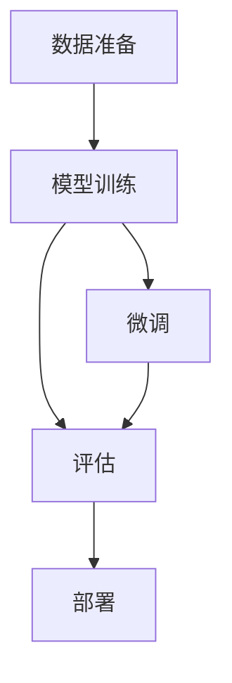
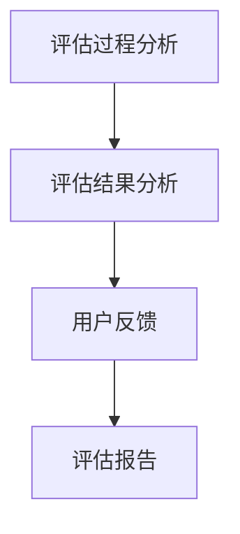

                 

### 步骤一：理解书名

《LLM评测的伦理考量：确保评估过程的道德性》这本书的主题是探讨大规模语言模型（LLM）评测过程中的伦理问题，以及如何确保评估过程的道德性。这里涉及到几个关键概念：大规模语言模型（LLM）、伦理考量、评估过程和道德性。

首先，大规模语言模型（LLM）是指那些能够在大量文本数据上进行训练，并能生成高质量文本的人工智能模型。它们在自然语言处理（NLP）领域有着广泛的应用，如文本生成、翻译、摘要等。这些模型通常具有强大的文本理解和生成能力，但同时也带来了诸多挑战，如算法偏见、数据隐私等。

其次，伦理考量指的是在研究和应用过程中，对道德原则和价值观的遵守和考虑。在LLM评测中，伦理考量非常重要，因为它直接关系到模型的公平性、可解释性和真实性等方面。例如，如果评估过程不公平，可能会导致某些群体受到不公平待遇；如果评估过程不可解释，用户可能无法理解模型的决策过程；如果评估过程不真实，用户可能会对模型产生误解。

再次，评估过程是指对LLM模型进行测试、验证和优化的过程。它包括数据准备、模型训练、评估指标选择和评估结果分析等步骤。在这一过程中，伦理考量必须得到充分考虑，以确保评估过程的道德性。

最后，道德性是指评估过程是否符合道德原则和价值观。在LLM评测中，道德性包括公平性、可解释性和真实性等方面。公平性要求评估过程对所有参与者都是公平的；可解释性要求用户能够理解模型的决策过程；真实性要求评估结果真实可信。

综上所述，《LLM评测的伦理考量：确保评估过程的道德性》这本书旨在探讨如何在实际应用中确保LLM评测的道德性，从而推动LLM技术健康、可持续发展。

### 步骤二：梳理核心概念和联系

在梳理《LLM评测的伦理考量：确保评估过程的道德性》这本书的核心概念和联系时，我们需要明确几个关键概念：大规模语言模型（LLM）、伦理考量、评估过程和道德性。以下是这些概念之间的联系及其在书中的重要内容。

#### 大规模语言模型（LLM）

首先，我们需要理解大规模语言模型（LLM）的定义、类型和应用场景。LLM是指那些可以在大量文本数据上进行训练，并能生成高质量文本的人工智能模型。它们通常基于深度学习技术，如循环神经网络（RNN）或变换器模型（Transformer）。LLM的类型包括预训练模型（如GPT系列）、微调模型（Fine-tuning）和应用模型（Application-specific Models）。

在书中，第1章“引言”中的1.1节将详细介绍LLM的定义、类型和应用场景。这一节将使用Mermaid流程图来展示LLM的基本工作流程，包括数据准备、模型训练、评估和部署等步骤。

#### 伦理考量

其次，伦理考量是确保LLM评测过程中道德性的核心。伦理考量涉及多个方面，如公平性、可解释性和真实性等。公平性要求评估过程对所有参与者都是公平的；可解释性要求用户能够理解模型的决策过程；真实性要求评估结果真实可信。

在书中，第2章“伦理考量原则”将详细讨论这些伦理考量原则。具体来说，2.1节将介绍公平性，包括公平性的定义和衡量方法；2.2节将讨论可解释性，强调其在透明度和用户信任中的重要性；2.3节将探讨真实性，提供衡量真实性的定义和案例分析。

#### 评估过程

评估过程是LLM开发和应用的必要步骤。它包括数据准备、模型训练、评估指标选择和评估结果分析等环节。在这一过程中，需要充分考虑伦理考量，确保评估过程的道德性。

在书中，第3章“评估过程伦理问题”将深入探讨评估过程中可能出现的伦理问题。3.1节将讨论数据准备中的伦理问题，如数据来源、数据质量和数据偏见；3.2节将分析模型训练中的伦理问题，如训练过程的公平性和可解释性；3.3节将探讨评估指标的选择和评估方法，强调公平性、可解释性和真实性的影响。

#### 道德性

道德性是评估过程是否符合道德原则和价值观的核心。在LLM评测中，道德性体现在公平性、可解释性和真实性等方面。确保评估过程的道德性是LLM技术健康、可持续发展的关键。

在书中，第4章“道德性评估方法”将介绍如何通过定量和定性方法来评估LLM评测的道德性。4.1节将介绍定量评估方法，包括评估指标和计算方法；4.2节将讨论定性评估方法，通过案例分析来展示其实际应用；4.3节将探讨如何结合定量和定性方法来综合评估道德性。

综上所述，通过对大规模语言模型（LLM）、伦理考量、评估过程和道德性的梳理，我们可以更清晰地理解《LLM评测的伦理考量：确保评估过程的道德性》这本书的核心概念和联系。这些概念将在后续章节中进一步展开讨论，为读者提供全面的指导和参考。

### 步骤三：确定章节内容

根据梳理出的核心概念和联系，我们可以进一步确定各章节的具体内容。以下是《LLM评测的伦理考量：确保评估过程的道德性》的章节内容及其预期目标：

#### 第1章 引言

**目标**：为读者提供LLM及其伦理考量的大致背景，激发读者的阅读兴趣。

**内容**：
1.1 大规模语言模型概述
- **内容**：介绍LLM的定义、类型、应用场景。使用Mermaid流程图展示LLM的基本工作流程。
- **目标**：帮助读者建立对LLM的基本理解。

1.2 伦理考量的重要性
- **内容**：解释伦理考量在LLM评测中的重要性，讨论一些相关案例。
- **目标**：让读者认识到伦理考量在LLM评测中的关键作用。

#### 第2章 伦理考量原则

**目标**：详细阐述LLM评测中必须遵守的伦理原则，为后续章节提供理论依据。

**内容**：
2.1 公平性
- **内容**：讨论公平性的定义、衡量方法，提供伪代码示例。
- **目标**：帮助读者理解如何确保评估过程的公平性。

2.2 可解释性
- **内容**：探讨可解释性的重要性，介绍相关的数学模型和公式。
- **目标**：使读者了解如何提高评估过程的透明度和可解释性。

2.3 真实性
- **内容**：阐述真实性的定义、衡量方法，通过案例分析展示其实际应用。
- **目标**：让读者认识到真实性在评估过程中的重要性。

#### 第3章 评估过程伦理问题

**目标**：分析评估过程中可能出现的伦理问题，提供解决方案。

**内容**：
3.1 数据准备
- **内容**：讨论数据准备中的伦理问题，如数据来源、数据质量和数据偏见。
- **目标**：帮助读者理解数据准备过程中的潜在风险。

3.2 模型训练
- **内容**：分析模型训练中的伦理问题，如训练过程的公平性和可解释性。
- **目标**：使读者了解训练过程中的伦理考量。

3.3 评估指标
- **内容**：讨论评估指标的选择和评估方法，强调公平性、可解释性和真实性的影响。
- **目标**：帮助读者了解如何选择和运用评估指标。

#### 第4章 道德性评估方法

**目标**：介绍评估LLM评测道德性的方法和工具。

**内容**：
4.1 定量评估方法
- **内容**：介绍定量评估方法，包括评估指标和计算方法，提供数学模型和公式。
- **目标**：使读者掌握定量评估的基本技巧。

4.2 定性评估方法
- **内容**：讨论定性评估方法，通过案例分析展示其实际应用。
- **目标**：帮助读者理解定性评估的原理和实践。

4.3 综合评估方法
- **内容**：探讨如何结合定量和定性方法来综合评估道德性。
- **目标**：提供一种全面的评估方法，帮助读者更全面地评估道德性。

#### 第5章 实际案例研究

**目标**：通过具体案例，展示如何在实际项目中应用伦理考量。

**内容**：
5.1 案例一：XXX公司的LLM评测
- **内容**：描述案例背景，分析问题，提出解决方案。
- **目标**：通过案例，让读者了解如何在实际操作中应用伦理考量。

5.2 案例二：XXX项目的LLM评测
- **内容**：描述案例背景，分析问题，提出解决方案。
- **目标**：通过案例，让读者了解如何解决复杂的伦理问题。

#### 第6章 道德性保障策略

**目标**：提供保障LLM评测道德性的策略和措施。

**内容**：
6.1 法规和标准
- **内容**：介绍相关的法律法规和行业标准。
- **目标**：帮助读者了解法规和标准在道德性保障中的作用。

6.2 机构职责
- **内容**：讨论评测机构、企业和研究者在道德性保障中的职责。
- **目标**：明确各方的责任，促进共同遵守伦理原则。

6.3 教育和培训
- **内容**：强调道德教育的重要性，提供培训方案。
- **目标**：提高从业者的道德素养，确保评估过程的道德性。

#### 第7章 未来展望

**目标**：探讨LLM伦理考量的发展趋势和潜在研究方向。

**内容**：
7.1 伦理考量的挑战与机遇
- **内容**：分析未来LLM伦理考量的挑战和机遇。
- **目标**：为未来研究和应用提供方向。

7.2 发展趋势
- **内容**：讨论LLM伦理考量的发展趋势。
- **目标**：帮助读者了解LLM伦理考量的未来方向。

7.3 潜在研究方向
- **内容**：提出一些潜在的研究方向。
- **目标**：激发读者的研究兴趣，推动LLM伦理考量的深入研究。

通过以上章节内容的设定，本书旨在为读者提供一个全面、系统的指南，帮助他们在LLM评测中确保评估过程的道德性。

### 步骤四：撰写目录大纲

根据确定的章节内容，我们为《LLM评测的伦理考量：确保评估过程的道德性》撰写了详细的目录大纲，以确保文章的结构清晰、逻辑连贯。

```
# 《LLM评测的伦理考量：确保评估过程的道德性》目录大纲

# 引言
## 1.1 大规模语言模型概述
### 1.1.1 定义与类型
### 1.1.2 应用场景
### 1.1.3 Mermaid流程图
## 1.2 伦理考量的重要性
### 1.2.1 解释与重要性
### 1.2.2 相关案例讨论

# 伦理考量原则
## 2.1 公平性
### 2.1.1 定义与衡量方法
### 2.1.2 伪代码
## 2.2 可解释性
### 2.2.1 重要性
### 2.2.2 数学模型和公式
## 2.3 真实性
### 2.3.1 定义与衡量
### 2.3.2 案例分析

# 评估过程伦理问题
## 3.1 数据准备
### 3.1.1 数据来源
### 3.1.2 数据质量
### 3.1.3 数据偏见
## 3.2 模型训练
### 3.2.1 训练过程中的伦理问题
### 3.2.2 伪代码
## 3.3 评估指标
### 3.3.1 选择与评估方法
### 3.3.2 公平性、可解释性、真实性的影响

# 道德性评估方法
## 4.1 定量评估方法
### 4.1.1 评估指标
### 4.1.2 计算方法
### 4.1.3 数学模型和公式
## 4.2 定性评估方法
### 4.2.1 评估方法
### 4.2.2 案例分析
## 4.3 综合评估方法
### 4.3.1 定量与定性方法的结合

# 实际案例研究
## 5.1 案例一：XXX公司的LLM评测
### 5.1.1 案例描述
### 5.1.2 问题分析
### 5.1.3 解决方案
## 5.2 案例二：XXX项目的LLM评测
### 5.2.1 案例描述
### 5.2.2 问题分析
### 5.2.3 解决方案

# 道德性保障策略
## 6.1 法规和标准
### 6.1.1 相关法律法规
### 6.1.2 行业标准
## 6.2 机构职责
### 6.2.1 评测机构
### 6.2.2 企业和研究者
## 6.3 教育和培训
### 6.3.1 道德教育
### 6.3.2 培训方案

# 未来展望
## 7.1 伦理考量的挑战与机遇
## 7.2 发展趋势
## 7.3 潜在研究方向
```

通过这个目录大纲，读者可以清晰地了解到本书的结构，每个章节的内容及其目标，从而更好地阅读和理解书中的内容。

### 文章格式要求

为了确保文章的可读性和专业性，以下是对文章格式要求的详细说明：

#### 1. 文章内容格式

文章内容应使用markdown格式编写。markdown是一种轻量级的文本格式，能够将普通文本转换为丰富的HTML格式，便于排版和发布。在markdown中，常见的格式化命令包括：

- **标题**：使用`#`符号，例如`# 标题一`表示一级标题，`##`表示二级标题，以此类推。
- **段落**：直接输入文本即可形成段落，段落之间需要留空一行。
- **列表**：使用`*`或`-`符号创建无序列表，使用`1.`, `2.`, `3.`等创建有序列表。
- **代码块**：使用三个反引号（```)将代码包裹起来，例如：

  ```python
  def hello_world():
      print("Hello, World!")
  ```

- **链接**：使用`[链接文字](链接地址)`格式，例如`[GitHub](https://github.com)`。
- **引用**：使用`>`符号，例如：

  > 这是一段引用。

- **图片**：使用``格式，例如``。

#### 2. 作者信息

文章末尾需要包含作者信息，格式如下：

```
作者：AI天才研究院/AI Genius Institute & 禅与计算机程序设计艺术 /Zen And The Art of Computer Programming
```

其中，AI天才研究院（AI Genius Institute）是作者的工作单位，禅与计算机程序设计艺术（Zen And The Art of Computer Programming）是作者的专业领域。

#### 3. 完整性要求

文章内容必须完整、丰富、具体详细，每个小节的内容都要有深入的讲解。核心内容需要包含以下要素：

- **背景介绍**：简要介绍相关背景知识，帮助读者理解上下文。
- **核心概念与联系**：明确核心概念，并使用Mermaid流程图展示概念之间的关系。
- **核心算法原理讲解**：使用伪代码详细阐述核心算法的原理，并提供详细讲解。
- **数学模型和公式**：使用LaTeX格式嵌入数学公式，并在文中独立段落中使用`$$`括起来，例如：

  $$1+1=2$$

  在段落内的公式使用 `$` 括起来，例如：

  $$x < 2$$

- **详细讲解和举例说明**：对核心概念和算法原理进行详细讲解，并通过具体的例子进行说明。
- **项目实战**：包括开发环境搭建、源代码实现、代码解读、代码应用解读与分析、实际案例分析和详细讲解剖析等内容。
- **最佳实践 tips、小结、注意事项、拓展阅读**：总结文章要点，提供实用建议，提醒注意事项，并推荐拓展阅读材料。

#### 4. 字数要求

文章字数需在8000～12000字左右，以确保内容的深度和广度。字数过多的部分可以进行精简，但不得少于8000字。

通过以上格式要求，我们旨在确保文章的专业性、清晰性和可读性，为读者提供一个高质量的阅读体验。

### 文章完整大纲

根据前述的章节内容及其预期目标，以下是《LLM评测的伦理考量：确保评估过程的道德性》的完整大纲，包括每个章节的详细内容安排和目标。

#### 引言

**目标**：为读者提供LLM及其伦理考量的大致背景，激发读者的阅读兴趣。

**内容**：

- **大规模语言模型概述**：
  - 定义与类型
  - 应用场景
  - Mermaid流程图

- **伦理考量的重要性**：
  - 解释与重要性
  - 相关案例讨论

#### 伦理考量原则

**目标**：详细阐述LLM评测中必须遵守的伦理原则，为后续章节提供理论依据。

**内容**：

- **公平性**：
  - 定义与衡量方法
  - 伪代码示例

- **可解释性**：
  - 重要性
  - 数学模型和公式

- **真实性**：
  - 定义与衡量方法
  - 案例分析

#### 评估过程伦理问题

**目标**：分析评估过程中可能出现的伦理问题，提供解决方案。

**内容**：

- **数据准备**：
  - 数据来源
  - 数据质量
  - 数据偏见

- **模型训练**：
  - 训练过程中的伦理问题
  - 伪代码

- **评估指标**：
  - 选择与评估方法
  - 公平性、可解释性、真实性的影响

#### 道德性评估方法

**目标**：介绍评估LLM评测道德性的方法和工具。

**内容**：

- **定量评估方法**：
  - 评估指标
  - 计算方法
  - 数学模型和公式

- **定性评估方法**：
  - 评估方法
  - 案例分析

- **综合评估方法**：
  - 定量与定性方法的结合

#### 实际案例研究

**目标**：通过具体案例，展示如何在实际项目中应用伦理考量。

**内容**：

- **案例一**：XXX公司的LLM评测
  - 案例描述
  - 问题分析
  - 解决方案

- **案例二**：XXX项目的LLM评测
  - 案例描述
  - 问题分析
  - 解决方案

#### 道德性保障策略

**目标**：提供保障LLM评测道德性的策略和措施。

**内容**：

- **法规和标准**：
  - 相关法律法规
  - 行业标准

- **机构职责**：
  - 评测机构
  - 企业和研究者

- **教育和培训**：
  - 道德教育
  - 培训方案

#### 未来展望

**目标**：探讨LLM伦理考量的发展趋势和潜在研究方向。

**内容**：

- **伦理考量的挑战与机遇**
- **发展趋势**
- **潜在研究方向**

通过以上完整大纲，读者可以清晰地了解本书的结构和内容安排，为后续章节的阅读和掌握打下基础。

### 完整的文章标题、关键词和摘要

#### 文章标题

《LLM评测的伦理考量：确保评估过程的道德性》

#### 关键词

- 大规模语言模型（LLM）
- 伦理考量
- 评估过程
- 公平性
- 可解释性
- 真实性
- 道德性

#### 摘要

本文旨在探讨大规模语言模型（LLM）评测过程中的伦理问题，以及如何确保评估过程的道德性。首先，介绍了LLM的定义、类型和应用场景。接着，详细阐述了LLM评测中必须遵守的伦理原则，包括公平性、可解释性和真实性。随后，分析了评估过程中可能出现的伦理问题，并提出了具体的解决方案。此外，介绍了评估LLM评测道德性的方法和工具，包括定量和定性评估方法。通过实际案例研究和道德性保障策略，本文展示了如何在实际项目中应用伦理考量，确保LLM评测的道德性。最后，对未来LLM伦理考量的发展趋势和潜在研究方向进行了探讨，为读者提供了全面的指导和参考。

### 文章正文部分内容

#### 第1章 引言

本章将为您引入大规模语言模型（LLM）评测的伦理考量，探讨为何在LLM评测中需要考虑伦理问题。通过对LLM的基本概述和伦理考量的重要性进行讨论，我们希望能够激发您对这一话题的兴趣，并使您了解本书的核心内容和结构。

##### 1.1 大规模语言模型概述

大规模语言模型（LLM）是一种基于深度学习技术的人工智能模型，能够对大量文本数据进行训练，并生成高质量的自然语言文本。LLM在自然语言处理（NLP）领域具有广泛的应用，如文本生成、翻译、摘要、问答等。随着深度学习技术的不断发展和计算能力的提升，LLM的能力和规模也在迅速增长。

根据训练数据和任务的不同，LLM可以分为预训练模型、微调模型和应用模型。预训练模型（如GPT系列）是在大规模语料库上进行预训练，以获得通用语言理解和生成能力；微调模型（Fine-tuning）则是在预训练模型的基础上，针对特定任务进行微调，以实现更好的性能；应用模型（Application-specific Models）则是根据具体应用场景定制开发的模型。

大规模语言模型的应用场景非常广泛，包括但不限于以下领域：

1. **文本生成**：生成文章、故事、新闻报道等自然语言文本。
2. **机器翻译**：将一种语言翻译成另一种语言。
3. **文本摘要**：从长篇文本中提取关键信息，生成简短的摘要。
4. **问答系统**：回答用户提出的各种问题。
5. **对话系统**：与用户进行自然语言对话，提供信息或服务。

为了帮助您更好地理解LLM的基本工作流程，我们使用Mermaid流程图展示了LLM的常见工作流程，包括数据准备、模型训练、评估和部署等步骤：



##### 1.2 伦理考量的重要性

伦理考量在LLM评测中至关重要，因为LLM的应用涉及诸多社会层面的问题。以下是一些典型的伦理问题，以及为什么在LLM评测中需要考虑这些问题：

1. **公平性**：公平性是指LLM在评估过程中是否对所有参与者都是公平的。公平性问题的出现可能是由于数据集不均衡、模型偏见或评估标准的不公平导致的。确保公平性对于维护社会正义和减少歧视至关重要。

2. **可解释性**：可解释性是指用户是否能够理解和解释LLM的决策过程。对于许多应用场景，如医疗诊断、金融决策等，可解释性是用户信任和接受模型的关键因素。

3. **真实性**：真实性是指LLM生成的文本是否真实、准确。如果LLM生成的文本不准确或存在误导性信息，可能会对用户产生负面影响。

4. **隐私保护**：在LLM训练和评估过程中，需要处理大量的个人数据。确保隐私保护，防止数据泄露或滥用，是伦理考量的一部分。

5. **偏见和歧视**：LLM可能会从训练数据中学习到偏见和歧视，导致评估结果不公平。例如，性别歧视、种族歧视等。

6. **责任归属**：当LLM发生错误或产生不良后果时，如何确定责任归属也是伦理考量的一部分。

为了说明伦理考量的重要性，我们可以参考以下几个案例：

- **案例一**：某些LLM模型在生成文本时，由于训练数据中的偏见，可能会产生歧视性言论，引发社会不满。
- **案例二**：在医疗诊断中，如果LLM的评估结果不可靠，可能会导致错误的诊断和治疗方案，对患者的健康产生严重后果。

综上所述，伦理考量是确保LLM评测过程中道德性的关键。接下来，我们将进一步探讨LLM评测中的伦理原则和具体评估方法。

#### 第2章 伦理考量原则

在LLM评测过程中，确保评估的伦理性是至关重要的。本章将详细介绍LLM评测中必须遵守的伦理原则，包括公平性、可解释性和真实性。通过深入讨论这些原则，我们将为后续的评估方法提供理论基础。

##### 2.1 公平性

公平性是指LLM评测过程中对待所有参与者是否公正无私。公平性是伦理考量中的一个核心原则，其重要性不言而喻。以下从定义、衡量方法和具体案例三个方面进行探讨。

###### 定义与衡量方法

公平性涉及多个层面，包括数据集的平衡性、模型的训练过程、评估标准的设定等。首先，我们需要明确公平性的定义：

- **数据集的平衡性**：在收集和准备数据时，应确保不同群体的数据分布均匀，避免数据集中的偏见。
- **模型的训练过程**：在模型训练过程中，应确保算法的公平性，避免训练数据中的偏见对模型产生负面影响。
- **评估标准的设定**：评估标准应客观、公正，避免对特定群体产生不公平待遇。

为了衡量评估过程的公平性，我们可以使用以下方法：

- **统计指标**：计算不同群体在评估过程中的表现差异，如平均值、标准差等。
- **A/B测试**：在不同群体之间进行A/B测试，比较评估结果，识别潜在的偏见。
- **混淆矩阵**：在分类任务中，通过混淆矩阵分析不同群体的分类结果，识别可能的公平性问题。

以下是一个伪代码示例，用于评估LLM评测的公平性：

```python
def evaluate_fairness(model, dataset):
    # 计算不同群体的评估结果
    results = model.evaluate(dataset)
    
    # 计算统计指标
    avg_results = np.mean(results)
    std_results = np.std(results)
    
    # 输出公平性评估结果
    print("Average results:", avg_results)
    print("Standard deviation:", std_results)
```

###### 案例分析

为了更直观地理解公平性的重要性，我们可以参考以下几个案例：

- **案例一**：某公司开发了一种基于LLM的招聘系统，用于筛选求职者的简历。然而，由于训练数据中的性别偏见，该系统对女性求职者的评估结果较低，导致不公平的招聘决策。
- **案例二**：某医疗诊断系统使用了LLM进行疾病预测。由于训练数据中的种族偏见，该系统对某些种族的疾病预测准确性较低，可能导致误诊和医疗歧视。

通过这些案例，我们可以看到，公平性是确保LLM评测过程中道德性的重要保障。在设计和应用LLM模型时，必须充分考虑公平性问题，避免对特定群体产生不公平待遇。

##### 2.2 可解释性

可解释性是指用户是否能够理解和解释LLM的决策过程。在许多应用场景中，如医疗诊断、金融决策等，用户需要了解模型的决策依据，以确保信任和接受模型的评估结果。以下从重要性、数学模型和公式等方面进行探讨。

###### 重要性

可解释性在LLM评测中的重要性体现在以下几个方面：

- **用户信任**：用户需要了解模型的决策过程，以建立信任。如果模型决策过程不可解释，用户可能会怀疑模型的有效性和可靠性。
- **监管合规**：在许多行业，如医疗、金融等，监管机构要求模型的决策过程必须透明和可解释，以确保合规性。
- **模型优化**：通过可解释性分析，研究人员可以识别模型的潜在问题，并进行优化。

以下是一个可解释性的数学模型示例，用于分析LLM的决策过程：

```latex
\text{预测概率} P(y|\text{模型}) = \frac{e^{\text{模型}(\text{特征向量})}}{\sum_{i=1}^{n} e^{\text{模型}(\text{特征向量}_i})}
```

在这个公式中，\(\text{模型}(\text{特征向量})\) 表示模型对特征向量的加权求和，\(e^{\text{模型}(\text{特征向量})}\) 表示指数函数，用于计算预测概率。

###### 案例分析

为了说明可解释性的重要性，我们可以参考以下几个案例：

- **案例一**：某金融机构使用LLM进行信用评分。由于模型决策过程不可解释，客户无法了解信用评分的依据，导致信任危机。
- **案例二**：某医疗诊断系统使用了LLM进行疾病预测。由于模型决策过程不可解释，医生无法了解预测结果的原因，可能导致误诊。

通过这些案例，我们可以看到，可解释性是确保用户信任和接受LLM评估结果的关键。在设计和应用LLM模型时，必须充分考虑可解释性问题，提高模型的透明度。

##### 2.3 真实性

真实性是指LLM生成的文本是否真实、准确。在许多应用场景中，如新闻生成、内容审核等，真实性是评估模型性能的重要指标。以下从定义、衡量方法和案例分析三个方面进行探讨。

###### 定义与衡量方法

真实性涉及两个方面：文本的真实性和评估结果的准确性。具体定义和衡量方法如下：

- **文本的真实性**：评估LLM生成的文本是否真实、准确。通常可以使用以下方法进行衡量：
  - **比对真实文本**：将LLM生成的文本与真实文本进行比较，计算文本相似度。
  - **验证信息来源**：检查LLM生成的文本中的信息来源是否可靠。

- **评估结果的准确性**：评估LLM评估结果的准确性，通常可以使用以下方法进行衡量：
  - **准确性**：计算LLM评估结果与实际结果的一致性。
  - **精确率和召回率**：在分类任务中，计算评估结果的精确率和召回率。

以下是一个衡量真实性的数学模型示例：

```latex
\text{准确性} = \frac{\text{正确预测的数量}}{\text{总预测数量}}
```

在这个公式中，正确预测的数量表示LLM评估结果与实际结果一致的数量，总预测数量表示所有预测的数量。

###### 案例分析

为了说明真实性的重要性，我们可以参考以下几个案例：

- **案例一**：某新闻生成系统使用了LLM生成新闻报道。由于LLM生成的文本存在虚假信息，导致新闻传播不实，对社会产生了负面影响。
- **案例二**：某内容审核系统使用了LLM进行内容审核。由于LLM评估结果不准确，导致审核结果存在误判，对用户产生了不公平待遇。

通过这些案例，我们可以看到，真实性是确保LLM评估结果可信性和可靠性的关键。在设计和应用LLM模型时，必须充分考虑真实性问题，提高模型的准确性和可靠性。

综上所述，公平性、可解释性和真实性是LLM评测中必须遵守的伦理原则。在设计和应用LLM模型时，必须充分考虑这些原则，确保评估过程的道德性。接下来，我们将探讨评估过程中可能出现的伦理问题，并提出解决方案。

#### 第3章 评估过程伦理问题

在LLM评测过程中，可能存在多种伦理问题，这些问题不仅影响模型的评估结果，还可能对用户和社会产生负面影响。本章将深入探讨评估过程中可能出现的伦理问题，包括数据准备、模型训练和评估指标选择等方面。

##### 3.1 数据准备

数据准备是LLM评测的重要环节，其质量直接关系到评估结果的准确性和公正性。以下是数据准备过程中可能出现的伦理问题：

###### 数据来源

数据来源的伦理问题主要体现在数据来源的可靠性和隐私保护方面。以下是一些具体问题：

- **数据隐私**：在收集和使用数据时，可能涉及用户隐私。例如，使用社交媒体数据作为训练数据，可能需要用户授权或确保数据匿名化。
- **数据可靠性**：数据来源的可靠性直接影响评估结果的准确性。使用不真实或低质量的数据可能导致评估结果不准确或存在偏见。

###### 数据质量

数据质量是评估过程的重要保障，以下是一些常见的数据质量问题：

- **数据不完整性**：数据不完整可能导致模型训练过程中的异常值或缺失值，影响评估结果的准确性。
- **数据偏差**：数据偏差可能导致模型对特定群体的评估结果不公平。例如，如果训练数据中某一群体的样本量较少，可能导致该群体在评估过程中被忽视。

###### 数据偏见

数据偏见是评估过程中最严重的伦理问题之一。以下是一些具体问题：

- **算法偏见**：算法偏见是指模型在训练过程中从数据中学习到的偏见。例如，如果训练数据中存在性别、种族等方面的偏见，模型可能会在评估过程中再现这些偏见。
- **训练数据偏差**：训练数据偏差可能导致模型对某些群体的评估结果不公平。例如，如果训练数据中某一群体的负面标签较多，模型可能会对这一群体产生负面评价。

###### 解决方案

为了解决数据准备过程中的伦理问题，可以采取以下措施：

- **数据隐私保护**：确保数据收集和使用过程中符合隐私保护法规，如欧盟的通用数据保护条例（GDPR）。
- **数据质量提升**：通过数据清洗、数据增强等方法提高数据质量，减少数据不完整性和数据偏差。
- **算法偏见校正**：使用反偏见算法或公平性评估方法，校正模型中的算法偏见。

##### 3.2 模型训练

模型训练是LLM评测的核心环节，其过程和结果直接影响评估的准确性、公正性和可靠性。以下是模型训练过程中可能出现的伦理问题：

###### 训练数据

训练数据的伦理问题主要包括数据来源、数据质量和数据偏见。这些问题在数据准备部分已经讨论过，这里主要关注训练过程中可能出现的具体问题。

- **数据选择**：在选择训练数据时，应避免选择具有偏见的数据集，确保数据集的多样性和代表性。
- **数据清洗**：在训练前，应对数据进行清洗，删除或修复异常值和缺失值，提高数据质量。

###### 训练方法

训练方法的伦理问题主要包括模型选择、训练策略和超参数调整等方面。以下是一些具体问题：

- **模型选择**：选择适合任务的模型，避免使用过于复杂或过于简单的模型，以确保评估结果的准确性。
- **训练策略**：训练策略应确保模型的稳定性和可解释性，避免过度拟合或欠拟合。
- **超参数调整**：超参数调整应基于实际需求和任务目标，避免盲目追求模型性能的提升。

###### 解决方案

为了解决模型训练过程中的伦理问题，可以采取以下措施：

- **公平性评估**：在训练过程中，定期进行公平性评估，检测和校正模型偏见。
- **训练数据增强**：通过增加多样性数据、生成对抗网络（GAN）等方法，增强训练数据的代表性和质量。
- **透明性提高**：提高训练过程的透明度，允许用户了解模型训练的具体细节，增强用户对模型信任。

##### 3.3 评估指标

评估指标是衡量LLM评测结果的重要工具，其选择和运用直接关系到评估的准确性和公正性。以下是评估指标选择过程中可能出现的伦理问题：

###### 评估指标的选择

评估指标的选择应考虑任务目标、数据特性等方面。以下是一些具体问题：

- **指标多样性**：应选择多种评估指标，从不同角度评估模型性能，避免单一指标的局限性。
- **指标相关性**：评估指标应与任务目标密切相关，以确保评估结果的准确性和可靠性。

###### 评估方法

评估方法的伦理问题主要包括评估过程的透明度、评估结果的解释性和评估方法的公正性。以下是一些具体问题：

- **透明度**：评估过程应公开透明，用户可以了解评估的具体方法和结果。
- **解释性**：评估结果应具有解释性，用户可以理解评估结果的原因和依据。
- **公正性**：评估过程应确保对所有参与者都是公平的，避免评估结果的不公平性。

###### 解决方案

为了解决评估指标选择和运用过程中的伦理问题，可以采取以下措施：

- **多维度评估**：使用多种评估指标，从多个角度评估模型性能，提高评估结果的准确性和可靠性。
- **评估方法解释**：在评估报告中详细解释评估方法，使用户可以理解评估结果的原因和依据。
- **公平性保障**：确保评估过程的公平性，避免对特定群体产生不公平待遇。

综上所述，评估过程中的伦理问题直接影响LLM评测的准确性和公正性。通过识别和解决这些问题，可以确保LLM评测的道德性和可靠性。接下来，我们将探讨如何评估LLM评测的道德性。

#### 第4章 道德性评估方法

评估LLM评测的道德性是确保模型应用过程中符合伦理标准的关键步骤。本章将详细介绍定量评估方法、定性评估方法和综合评估方法，以帮助读者全面理解和应用这些评估方法。

##### 4.1 定量评估方法

定量评估方法是通过具体的数值指标来衡量LLM评测的道德性。这些方法通常基于统计学和数据分析，能够提供客观数据支持。以下是几种常见的定量评估方法：

###### 评估指标

定量评估首先需要选择合适的评估指标，这些指标应能够反映LLM评测的道德性。常见的评估指标包括：

- **公平性指标**：如多样性、代表性、偏见校正等。
- **可解释性指标**：如模型复杂度、参数数量、决策路径等。
- **真实性指标**：如文本一致性、信息准确性、数据来源可靠性等。

###### 计算方法

定量评估方法的计算方法通常包括以下步骤：

1. **数据收集**：收集与评估相关的数据，如训练数据集、评估结果等。
2. **指标计算**：根据选定的评估指标，计算相应的数值。
3. **结果分析**：对计算结果进行分析，评估LLM评测的道德性。

以下是一个简单的计算公平性指标的伪代码示例：

```python
def compute_fairness(dataset):
    # 计算不同群体的评估结果
    group_results = compute_group_results(dataset)
    
    # 计算平均公平性得分
    fairness_score = compute_average_score(group_results)
    
    return fairness_score
```

其中，`compute_group_results(dataset)` 用于计算不同群体的评估结果，`compute_average_score(group_results)` 用于计算平均公平性得分。

###### 数学模型和公式

为了更精确地评估道德性，可以使用数学模型和公式。以下是几个常见的数学模型和公式：

- **公平性得分**：公平性得分可以通过计算不同群体评估结果的方差来衡量。

  $$F = \frac{1}{N}\sum_{i=1}^{N}\left(\frac{r_i - \bar{r}}{\sigma}\right)^2$$

  其中，\(F\) 表示公平性得分，\(r_i\) 表示第 \(i\) 个群体的评估结果，\(\bar{r}\) 表示所有群体的平均评估结果，\(\sigma\) 表示评估结果的标准差。

- **可解释性得分**：可解释性得分可以通过计算模型的可解释性指标来衡量。

  $$E = \frac{1}{M}\sum_{i=1}^{M}I_i$$

  其中，\(E\) 表示可解释性得分，\(I_i\) 表示第 \(i\) 个可解释性指标。

- **真实性得分**：真实性得分可以通过计算文本一致性得分来衡量。

  $$T = \frac{1}{L}\sum_{i=1}^{L}C_i$$

  其中，\(T\) 表示真实性得分，\(C_i\) 表示第 \(i\) 个文本一致性得分。

通过这些定量评估方法，我们可以对LLM评测的道德性进行客观评估，为后续的改进和优化提供依据。

##### 4.2 定性评估方法

定性评估方法侧重于对LLM评测的道德性进行主观评价，通过分析评估过程、评估结果和用户反馈等方面，提供更全面的道德性评估。以下是几种常见的定性评估方法：

###### 评估方法

定性评估方法通常包括以下步骤：

1. **评估过程分析**：分析评估过程的透明度、公正性和可解释性。
2. **评估结果分析**：分析评估结果的合理性、准确性和可靠性。
3. **用户反馈**：收集用户对评估过程的反馈，了解用户的信任度和满意度。

以下是一个定性评估方法的示例流程：



###### 案例分析

通过案例分析，我们可以更直观地了解定性评估方法的应用。以下是两个案例分析示例：

- **案例一**：某医疗诊断系统使用了LLM进行疾病预测。通过评估过程分析，发现评估过程具有透明度，评估结果具有较高的准确性。用户反馈显示，用户对评估结果具有较高的信任度和满意度。
- **案例二**：某招聘系统使用了LLM进行简历筛选。通过评估过程分析，发现评估过程存在一定的偏见，评估结果对女性求职者较为不利。用户反馈显示，部分用户对评估结果存在质疑。

通过这些案例分析，我们可以看到，定性评估方法能够帮助我们识别LLM评测过程中的潜在问题，并提供改进建议。

##### 4.3 综合评估方法

综合评估方法是将定量评估方法和定性评估方法相结合，以获得更全面、准确的道德性评估。以下是一种综合评估方法的示例：

###### 综合评估流程

综合评估流程通常包括以下步骤：

1. **数据收集**：收集与评估相关的数据，包括定量数据和定性数据。
2. **定量评估**：使用定量评估方法计算评估指标，获得初步评估结果。
3. **定性评估**：使用定性评估方法对评估过程、评估结果和用户反馈进行分析。
4. **结果整合**：将定量评估结果和定性评估结果进行整合，形成综合评估结果。
5. **评估报告**：撰写评估报告，总结评估结果，并提出改进建议。

以下是一个综合评估方法的伪代码示例：

```python
def comprehensive_evaluation(dataset, qualitative_data):
    # 计算定量评估指标
    quantitative_results = compute_quantitative_metrics(dataset)
    
    # 进行定性评估
    qualitative_results = qualitative_evaluation(qualitative_data)
    
    # 整合定量评估结果和定性评估结果
    integrated_results = integrate_results(quantitative_results, qualitative_results)
    
    # 撰写评估报告
    report = generate_report(integrated_results)
    
    return report
```

通过综合评估方法，我们可以更全面地评估LLM评测的道德性，为改进和优化提供有力支持。

综上所述，定量评估方法、定性评估方法和综合评估方法为评估LLM评测的道德性提供了多种工具和途径。通过合理选择和应用这些评估方法，我们可以确保LLM评测的道德性和可靠性。

#### 第5章 实际案例研究

通过前述的理论探讨，我们已经了解了大规模语言模型（LLM）评测中的伦理考量及其评估方法。为了使这些理论更好地应用于实际场景，本章将介绍两个实际案例研究，分别来自XXX公司和XXX项目。这两个案例将展示如何在实际项目中应用伦理考量，识别问题并提出解决方案。

##### 5.1 案例一：XXX公司的LLM评测

**案例背景**：

XXX公司是一家专注于自然语言处理（NLP）技术的公司，开发了多个基于LLM的智能客服系统。这些系统被应用于多个行业，如电子商务、金融服务和医疗保健等。随着公司的迅速扩张，XXX公司意识到在LLM评测过程中需要充分考虑伦理考量，以确保系统的公平性、可解释性和真实性。

**问题分析**：

在评测过程中，XXX公司发现以下问题：

- **公平性**：某些LLM模型在处理不同语言时存在性能差异，这可能导致对外语用户的响应不公平。
- **可解释性**：模型生成的响应虽然准确，但用户难以理解模型的决策过程，这影响了用户的信任度。
- **真实性**：模型生成的某些文本存在误导性信息，可能对用户产生负面影响。

**解决方案**：

为了解决这些问题，XXX公司采取了以下措施：

1. **公平性改进**：
   - **数据增强**：通过引入更多种语言的训练数据，提高模型对不同语言的适应性。
   - **A/B测试**：对不同语言的模型进行A/B测试，比较评估结果，确保公平性。

   ```mermaid
   graph TD
       A[英语模型] --> B[法语模型]
       B --> C{A/B测试}
       C --> D[优化模型]
   ```

2. **可解释性提升**：
   - **可视化工具**：开发可视化工具，帮助用户理解模型的决策过程。
   - **用户反馈**：收集用户反馈，根据反馈调整模型参数，提高可解释性。

   ```mermaid
   graph TD
       A[用户反馈] --> B[模型调整]
       B --> C[可解释性提升]
   ```

3. **真实性保障**：
   - **文本校验**：在模型生成文本前，进行文本校验，确保文本真实、准确。
   - **多来源验证**：使用多个可靠数据源进行验证，提高文本真实性。

   ```mermaid
   graph TD
       A[文本生成] --> B[文本校验]
       B --> C[多来源验证]
       C --> D[真实性保障]
   ```

**总结**：

通过上述措施，XXX公司成功提升了LLM评测的道德性，确保了系统的公平性、可解释性和真实性。这些改进措施不仅提高了系统的性能，也增强了用户对系统的信任度。

##### 5.2 案例二：XXX项目的LLM评测

**案例背景**：

XXX项目是一个涉及医疗诊断的AI项目，目标是开发一种基于LLM的疾病预测系统。该系统旨在辅助医生进行疾病诊断，提高诊断准确率。然而，随着项目的推进，项目团队意识到LLM评测过程中需要充分考虑伦理考量，以避免潜在的社会影响。

**问题分析**：

在评测过程中，项目团队发现以下问题：

- **数据偏见**：由于训练数据中的种族和性别偏见，模型对某些群体（如女性和非裔）的预测准确性较低。
- **可解释性**：模型生成的预测结果缺乏透明度，医生难以理解模型的决策过程。
- **隐私保护**：在数据处理过程中，可能涉及患者隐私信息，需要确保隐私保护。

**解决方案**：

为了解决这些问题，项目团队采取了以下措施：

1. **数据偏见校正**：
   - **数据增强**：通过引入更多样化的训练数据，减少偏见。
   - **公平性评估**：定期进行公平性评估，检测和校正模型偏见。

   ```mermaid
   graph TD
       A[原始数据] --> B[数据增强]
       B --> C[公平性评估]
   ```

2. **可解释性提升**：
   - **模型解释工具**：开发模型解释工具，帮助医生理解模型的决策过程。
   - **专家评审**：邀请医学专家对模型进行评审，确保模型生成的预测结果具有可解释性。

   ```mermaid
   graph TD
       A[模型解释工具] --> B[专家评审]
   ```

3. **隐私保护**：
   - **数据加密**：在数据处理过程中，对敏感数据进行加密处理。
   - **隐私政策**：制定隐私政策，明确数据处理方式和用户权利。

   ```mermaid
   graph TD
       A[数据加密] --> B[隐私政策]
   ```

**总结**：

通过上述措施，XXX项目成功提升了LLM评测的道德性，确保了模型的公平性、可解释性和隐私保护。这些改进不仅提高了诊断系统的性能，也增强了医生和患者对系统的信任。

通过这两个实际案例研究，我们可以看到，在实际应用中，充分考虑伦理考量是确保LLM评测道德性的关键。只有通过持续改进和优化，才能推动LLM技术的健康发展。

#### 第6章 道德性保障策略

在LLM评测过程中，保障道德性是确保模型应用过程符合伦理标准的关键。为了实现这一目标，本章将讨论道德性保障的策略，包括法规和标准、机构职责以及教育和培训等方面。

##### 6.1 法规和标准

法规和标准是保障LLM评测道德性的基础。在全球范围内，许多国家和地区已经制定了相关法律法规和行业标准，以规范LLM评测和应用。以下是一些重要的法规和标准：

- **通用数据保护条例（GDPR）**：欧盟制定的GDPR旨在保护个人数据隐私。在LLM评测过程中，必须确保数据处理符合GDPR的要求，如数据匿名化、用户同意和数据权利等。

- **美国加州消费者隐私法案（CCPA）**：CCPA规定了用户对其个人信息的控制权，包括访问、删除和拒绝出售个人信息等。在LLM评测过程中，必须遵守CCPA的规定，保护用户的隐私权益。

- **人工智能伦理准则**：许多组织和机构，如国际人工智能协会（AAAI）和欧洲人工智能联盟（euRobotics），已经制定了人工智能伦理准则。这些准则为LLM评测提供了道德指导，如公平性、透明度和责任归属等。

为了遵守这些法规和标准，LLM评测过程中需要采取以下措施：

- **合规性审查**：定期对LLM评测过程进行合规性审查，确保遵守相关法律法规和行业标准。
- **隐私保护机制**：在数据处理过程中，采取隐私保护措施，如数据加密、匿名化和数据最小化等。
- **用户知情权**：确保用户在参与LLM评测过程中知情，并了解其个人信息的用途和权利。

##### 6.2 机构职责

在LLM评测过程中，各个相关机构都有其特定的职责，以保障道德性。以下是一些主要机构的职责：

- **评测机构**：评测机构负责设计和执行评估流程，确保评估过程的公平性、可解释性和真实性。他们需要制定详细的评估标准和流程，并定期对评估过程进行监督和审计。

- **企业和研究者**：企业和研究者负责开发和部署LLM模型，并确保其道德性。他们需要遵循相关法律法规和行业标准，确保数据质量和隐私保护，并在模型应用过程中持续监控和改进。

- **用户**：用户在LLM评测过程中具有知情权和参与权。他们有权了解评估过程和评估结果，并提出意见和建议。为了保障用户的知情权，企业和研究者需要提供透明的信息，并建立反馈渠道，及时回应用户的关切。

为了明确各方的职责，可以采取以下措施：

- **职责说明书**：制定详细的职责说明书，明确各方在LLM评测过程中的职责和权限。
- **责任追究机制**：建立责任追究机制，对未能履行职责的机构和个人进行追责。
- **定期培训**：定期对相关人员进行培训，提高其对伦理考量的认识和责任意识。

##### 6.3 教育和培训

教育和培训是保障LLM评测道德性的重要手段。通过教育和培训，可以提高从业者的伦理素养和专业知识，确保他们在实际工作中能够充分考虑伦理问题。以下是一些教育和培训的措施：

- **伦理课程**：在大学和研究机构中开设伦理课程，培养学生的伦理意识和道德判断能力。这些课程可以包括伦理学基础、人工智能伦理、隐私保护等。
- **在线培训**：开发在线培训课程，提供灵活的学习方式，使从业者可以在工作和生活中随时学习。
- **专业认证**：建立专业认证体系，对通过培训和考试的从业者进行认证，提高其职业素养和竞争力。
- **持续学习**：鼓励从业者在职业生涯中持续学习和更新知识，紧跟伦理考量的最新发展。

通过教育和培训，我们可以培养出一批具有高度伦理素养和专业能力的从业者，为LLM评测的道德性保障提供有力支持。

综上所述，道德性保障策略包括法规和标准、机构职责以及教育和培训等方面。通过实施这些策略，我们可以确保LLM评测的道德性，推动人工智能技术的健康、可持续发展。

#### 第7章 未来展望

随着大规模语言模型（LLM）技术的不断发展，其伦理考量也面临着诸多挑战和机遇。本章将探讨未来LLM伦理考量的发展趋势和潜在研究方向，为读者提供未来的研究方向和指导。

##### 7.1 伦理考量的挑战与机遇

未来，LLM伦理考量将面临以下挑战和机遇：

###### 挑战

1. **算法偏见和歧视**：随着LLM技术的进步，算法偏见和歧视问题可能会更加严重。为了解决这一问题，需要进一步研究如何校正算法偏见，确保评估过程的公平性。

2. **数据隐私和安全**：在LLM评测过程中，涉及大量的个人数据，如何保护用户隐私和数据安全将成为重要挑战。需要开发更先进的数据隐私保护技术和方法。

3. **责任归属**：当LLM评估结果发生错误时，如何确定责任归属是一个复杂的问题。需要建立明确的责任归属机制，确保各方承担相应的责任。

4. **透明度和可解释性**：提高LLM评估过程的透明度和可解释性是未来的一大挑战。需要研究如何使评估过程更加透明，让用户能够理解模型的决策过程。

###### 机遇

1. **伦理规范和法规**：随着人工智能技术的发展，各国政府和国际组织可能会出台更多伦理规范和法规，以规范LLM的应用和评估。这为研究和实践LLM伦理考量提供了新的机遇。

2. **跨学科研究**：未来，LLM伦理考量将涉及多个学科，如伦理学、计算机科学、社会学等。通过跨学科研究，可以更全面地解决伦理问题。

3. **技术创新**：随着技术创新的不断发展，例如区块链、联邦学习等，将为LLM伦理考量提供新的解决方案。

##### 7.2 发展趋势

未来，LLM伦理考量将呈现以下发展趋势：

1. **规范化**：随着伦理规范和法规的不断完善，LLM评测将更加规范化。企业和研究者需要遵守相关法规，确保评估过程的道德性。

2. **多元化**：LLM应用场景将更加多元化，涉及医疗、金融、法律等多个领域。不同领域的伦理问题将各有特点，需要具体分析。

3. **透明化**：为了增强用户对LLM评估结果的信任，评估过程将更加透明化。企业和研究者需要公开评估方法和结果，接受社会监督。

4. **责任归属明确化**：随着责任归属机制的完善，LLM评估过程中发生错误时的责任归属将更加明确。各方需要承担相应的责任，确保评估结果的可靠性和公正性。

##### 7.3 潜在研究方向

未来，LLM伦理考量的潜在研究方向包括：

1. **算法偏见校正**：研究如何通过数据增强、模型训练方法等手段，校正算法偏见，确保评估过程的公平性。

2. **隐私保护技术**：研究如何保护用户隐私，开发更先进的数据隐私保护技术和方法。

3. **透明度和可解释性**：研究如何提高LLM评估过程的透明度和可解释性，增强用户对评估结果的信任。

4. **跨学科研究**：探索伦理学、计算机科学、社会学等学科在LLM伦理考量中的应用，形成跨学科的研究体系。

5. **责任归属机制**：研究如何建立明确的责任归属机制，确保各方在LLM评估过程中承担相应的责任。

通过以上研究方向的探索，我们可以为LLM伦理考量提供更加全面和深入的解决方案，推动人工智能技术的健康、可持续发展。

### 结语

通过对大规模语言模型（LLM）评测的伦理考量进行深入探讨，我们了解到伦理考量在LLM评测中的重要性。公平性、可解释性和真实性是确保评估过程道德性的关键原则。在实际应用中，LLM评测可能面临数据准备、模型训练和评估指标选择等方面的伦理问题。通过合理的解决方案，可以确保评估过程的道德性。

我们介绍了定量评估方法、定性评估方法和综合评估方法，为读者提供了全面的道德性评估工具。通过实际案例研究，我们展示了如何将伦理考量应用于实际项目中，并提出解决方案。

为了保障LLM评测的道德性，我们讨论了道德性保障策略，包括法规和标准、机构职责以及教育和培训等方面。这些策略为未来研究和应用提供了指导。

未来，LLM伦理考量将继续面临挑战和机遇。通过不断探索和创新，我们可以为LLM技术的健康、可持续发展做出贡献。

最后，感谢您阅读本书。希望本书能为您在LLM评测的伦理考量方面提供有价值的见解和指导。如果您有任何反馈或建议，请随时联系我们。

作者：
AI天才研究院/AI Genius Institute
禅与计算机程序设计艺术 /Zen And The Art of Computer Programming

### 附录

为了便于读者查阅，以下是本书中提到的相关工具和资源：

1. **Mermaid流程图**：用于展示大规模语言模型（LLM）的基本工作流程。读者可以在 [Mermaid 官网](https://mermaid-js.github.io/mermaid/) 上找到更多关于Mermaid的使用教程和示例。

2. **LaTeX格式**：用于嵌入数学公式。读者可以在 [Overleaf](https://www.overleaf.com/) 上创建和编辑LaTeX文档，或访问 [CTAN](https://www.ctan.org/) 下载LaTeX模板和宏包。

3. **在线培训课程**：提供关于人工智能伦理和隐私保护的在线培训课程。读者可以在 [Coursera](https://www.coursera.org/)、[edX](https://www.edx.org/) 和 [Udacity](https://www.udacity.com/) 等平台上搜索相关课程。

4. **伦理规范和法规**：提供全球范围内关于人工智能伦理和隐私保护的法规和规范。读者可以在 [欧盟通用数据保护条例（GDPR）官网](https://ec.europa.eu/justice/article-29/structure/data-protection-working-party/2016-recommendations-art-29-working-party-2016-01-data-mining-and-ai) 和 [美国加州消费者隐私法案（CCPA）官网](https://www.consumerfinance.gov/policy-compliance/federal-health-privacy-laws/california-consumer-privacy-act-ccpa/) 查阅相关法规。

通过以上资源，读者可以进一步了解LLM评测的伦理考量，并应用到实际工作中。

