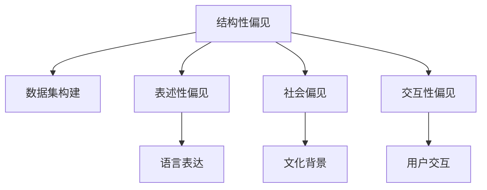
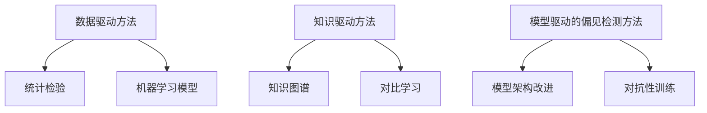

                 

### 1.1.2 偏见对LLM的影响

偏见对LLM的影响是多方面的，主要包括以下几个方面：

1. **输出结果的不公平性**：当LLM受到偏见影响时，其生成的文本或提供的信息可能带有歧视性的倾向，导致某些群体或个体受到不公平对待。例如，在招聘系统中，如果训练数据中包含性别、种族等偏见信息，LLM可能会产生对某些性别或种族的偏见，从而影响招聘结果的公平性。

2. **算法性能的下降**：偏见可能导致LLM在特定任务上的性能下降。例如，在一个医疗诊断的LLM中，如果训练数据中缺乏某些疾病在特定人群中的表现，那么这个LLM在处理相关病例时可能会出现偏差，从而降低诊断的准确性。

3. **用户信任度降低**：当用户发现LLM输出的信息存在偏见时，可能会对其产生不信任感，从而影响LLM的实际应用效果。长期下去，这可能会损害用户对AI技术的整体信任。

4. **法律和伦理风险**：偏见可能导致LLM违反法律法规或伦理准则。例如，如果LLM在招聘过程中表现出性别或种族歧视，可能会引发法律诉讼或伦理问题。

5. **社会负面影响**：偏见不仅影响个体，还可能对整个社会产生负面影响。如果AI系统在社会中普遍存在偏见，可能会导致社会不平等和歧视现象的加剧。

为了确保LLM的应用公平性和道德性，偏见检测和纠正变得至关重要。下一节将介绍偏见检测的定义和相关概念，以便我们更好地理解如何识别和解决LLM中的偏见问题。 

### 1.1.3 公平性与道德性在LLM中的应用

公平性和道德性是AI系统设计过程中不可忽视的核心要素，尤其是在大型语言模型（LLM）的领域中。以下将从几个方面探讨公平性与道德性在LLM应用中的具体体现：

1. **算法透明性**：透明性是确保公平性和道德性的重要前提。LLM的设计者需要确保算法的决策过程是可解释的，以便用户能够理解模型的输出和偏见来源。例如，通过使用可解释AI技术，可以揭示LLM在文本生成或分类过程中的关键步骤和依据。

2. **数据多样性**：公平性要求LLM的训练数据应具有广泛且多样化的代表性。这意味着训练数据中应包含不同性别、种族、文化背景、年龄等信息，避免单一数据集导致的偏见。通过引入多样化的训练数据，可以有效地减少LLM中的偏见。

3. **公平性评估与测试**：在LLM部署前，必须进行公平性评估与测试。这包括评估模型在不同群体中的表现，确保其输出结果在不同群体中没有系统性偏见。例如，通过A/B测试，比较模型在不同用户群体中的性能和输出。

4. **隐私保护**：在LLM应用中，隐私保护是道德性的重要体现。LLM在处理用户数据时，必须遵守相关隐私法律法规，确保用户隐私不被泄露或滥用。

5. **道德责任与责任归属**：当LLM的输出造成负面影响时，需要明确责任归属和责任承担。这要求AI开发者和管理者应承担起相应的道德责任，确保AI系统的设计和应用符合伦理准则。

6. **用户教育与培训**：为了提高用户对AI系统的理解和信任，开发者应提供相关的教育与培训。这有助于用户了解AI系统的公平性原则和潜在偏见，从而更加合理地使用AI工具。

总之，公平性和道德性在LLM应用中具有重要意义。通过透明性、数据多样性、公平性评估、隐私保护、责任归属和用户教育等手段，可以有效地保障LLM的公平性和道德性，促进AI技术的健康发展。

### 1.2 LLM偏见检测的背景

大型语言模型（LLM）偏见检测的研究背景源于人工智能（AI）在各个领域的广泛应用。随着深度学习技术的发展，LLM在自然语言处理（NLP）任务中取得了显著的成果，如文本生成、机器翻译、问答系统等。然而，随着LLM在现实世界中的应用越来越广泛，其偏见问题也逐渐凸显出来。

#### 1.2.1 LLM的发展历程

LLM的发展历程可以追溯到20世纪80年代，当时的研究主要集中在基于规则的方法和统计方法上。随着计算能力和数据量的提高，20世纪90年代，统计机器翻译和隐马尔可夫模型（HMM）等技术在NLP领域取得了突破性进展。进入21世纪，深度学习的崛起为LLM的发展带来了新的契机。特别是2013年，神经网络机器翻译（Neural Machine Translation, NMT）的提出，使得机器翻译的准确性有了显著提升。随后，随着计算资源的进一步增加和大数据的积累，LLM的研究和应用取得了飞速发展。

#### 1.2.2 LLM偏见检测的现状

近年来，LLM偏见检测逐渐成为研究热点。学者们发现，即使是在大规模的语料库中训练的LLM，也可能存在系统性的偏见。这些偏见可能源于训练数据的偏差、算法设计的不完善或社会因素的干扰。具体表现为：

1. **结构性偏见**：这种偏见源于训练数据中存在的系统性偏差。例如，如果训练数据中男性角色占据主导地位，那么模型在生成文本时可能会倾向于强调男性角色。

2. **表述性偏见**：这种偏见源于模型在语言表达上的倾向。例如，某些词汇或短语可能带有贬义色彩，从而导致模型生成带有偏见的信息。

3. **社会偏见**：这种偏见源于社会文化和价值观的影响。例如，在某些地区或文化中，某些群体可能受到歧视，这种偏见可能会在LLM中得以体现。

现有的偏见检测方法主要包括数据驱动方法、知识驱动方法和模型驱动的偏见检测方法。数据驱动方法主要依赖标注数据，通过统计分析发现偏见。知识驱动方法则通过构建知识图谱或使用对比学习等技术，识别和纠正偏见。模型驱动的偏见检测方法则通过改进模型架构或引入对抗性训练等技术，减少偏见。

#### 1.2.3 偏见检测与AI伦理的关系

偏见检测不仅是技术问题，更是伦理问题。在AI伦理的框架下，偏见检测被视为确保AI系统公平性和道德性的重要手段。随着AI技术的不断进步，偏见检测和纠正技术也在不断发展。然而，现有的偏见检测方法仍然存在一定的局限性，如对复杂偏见的识别能力有限、对动态变化的数据难以适应等。

总之，LLM偏见检测的研究背景源于AI技术的快速发展和应用。随着AI伦理意识的提高，偏见检测成为确保AI系统公平性和道德性的关键步骤。未来，随着技术的进步和研究的深入，偏见检测将越来越成为AI系统设计中的核心组成部分。

### 1.3 本书结构

本书旨在为读者提供全面、系统的LLM评测偏见检测知识，帮助读者深入理解偏见检测的核心概念、算法原理和实际应用。全书共分为7个章节，结构如下：

#### 第1章 引言与背景

本章节将介绍LLM评测偏见检测的背景和重要性，包括偏见检测的定义、偏见检测在LLM应用中的意义以及公平性和道德性的相关概念。

#### 第2章 核心概念与联系

本章将阐述偏见检测相关的核心概念，如偏见类型、偏见检测方法等，并使用Mermaid流程图展示各概念之间的关系。

#### 第3章 核心算法原理讲解

本章将深入讲解偏见检测的关键算法，包括算法的工作原理、伪代码描述和算法的优缺点分析。

#### 第4章 数学模型和数学公式讲解

本章将介绍偏见检测中涉及的数学模型，如概率模型、统计模型等，使用LaTeX格式详细讲解模型公式，并提供实例说明。

#### 第5章 项目实战

本章将通过实际案例展示如何实施偏见检测，包括环境搭建、代码实现、代码解读与分析。

#### 第6章 案例研究

本章将分析不同领域的LLM偏见检测案例，讨论各种偏见检测技术的应用效果和面临的挑战。

#### 第7章 未来展望与挑战

本章将探讨偏见检测技术的发展趋势、潜在应用领域和未来研究的方向。

通过以上章节的详细讲解，本书将为读者提供一个全面、系统的LLM评测偏见检测知识体系，帮助读者深入理解并掌握这一重要技术。

## 第2章 核心概念与联系

偏见检测是确保AI模型公平性和道德性的重要手段。要有效进行偏见检测，首先需要理解相关核心概念及其相互关系。本章将详细阐述偏见类型、偏见检测方法等关键概念，并使用Mermaid流程图展示各概念之间的关系，以便读者更好地理解偏见检测的整体框架。

### 2.1 偏见类型

偏见类型是偏见检测的重要基础。根据来源和表现形式，偏见可以分为以下几类：

1. **结构性偏见**：这种偏见源于数据集的构建过程。例如，如果数据集中男性样本占比远大于女性，那么模型在处理与性别相关的问题时可能会表现出性别偏见。

2. **表述性偏见**：这种偏见源于语言表达本身。例如，某些词汇或短语可能带有歧视性，从而影响模型的输出结果。

3. **社会偏见**：这种偏见源于社会文化背景。例如，某些文化背景下对特定群体的歧视可能导致模型产生相应的偏见。

4. **交互性偏见**：这种偏见源于模型与用户交互的过程。例如，如果用户在交互过程中提供带有偏见的信息，模型可能会吸收并放大这些偏见。

图1展示了偏见类型的Mermaid流程图：



### 2.2 偏见检测方法

偏见检测方法可以分为数据驱动方法、知识驱动方法和模型驱动的偏见检测方法。每种方法都有其独特的原理和适用场景。

1. **数据驱动方法**：数据驱动方法主要依赖标注数据，通过统计分析发现偏见。常见技术包括：

   - **统计检验**：如卡方检验、t检验等，用于检测数据集中是否存在显著的偏见。
   - **机器学习模型**：如逻辑回归、决策树等，用于预测偏见的存在。

2. **知识驱动方法**：知识驱动方法通过构建知识图谱或使用对比学习等技术，识别和纠正偏见。常见技术包括：

   - **知识图谱**：通过构建实体关系图谱，识别潜在的偏见关系。
   - **对比学习**：通过对比不同群体或不同背景下的模型输出，发现偏见。

3. **模型驱动的偏见检测方法**：模型驱动的偏见检测方法通过改进模型架构或引入对抗性训练等技术，减少偏见。常见技术包括：

   - **模型架构改进**：如使用注意力机制、多任务学习等，提高模型的公平性和鲁棒性。
   - **对抗性训练**：通过生成对抗性样本，增强模型对偏见的识别和纠正能力。

图2展示了偏见检测方法的Mermaid流程图：



通过以上核心概念的阐述和Mermaid流程图的展示，读者可以更好地理解偏见检测的整体框架及其各个关键环节。接下来，我们将深入讲解偏见检测的核心算法原理，为后续内容打下坚实的基础。

## 第3章 核心算法原理讲解

偏见检测在确保AI模型的公平性和道德性方面发挥着关键作用。在这一章节中，我们将深入探讨偏见检测的核心算法原理，详细阐述每种算法的工作原理、伪代码描述以及优缺点。

### 3.1 偏见检测算法概述

偏见检测算法可以分为数据驱动方法、知识驱动方法和模型驱动的偏见检测方法。每种方法都有其特定的应用场景和适用条件。

1. **数据驱动方法**：这类方法主要依赖已有的标注数据，通过统计分析和机器学习模型来识别和纠正偏见。数据驱动方法具有高效、易实现的优点，但依赖于高质量的标注数据，存在一定的时间和人力成本。

2. **知识驱动方法**：知识驱动方法通过构建知识图谱、使用对比学习等技术，从知识层面识别和纠正偏见。这种方法具有较强的理论基础，但实现较为复杂，需要大量的先验知识和计算资源。

3. **模型驱动的偏见检测方法**：模型驱动的偏见检测方法通过改进模型架构、引入对抗性训练等技术，从模型层面减少偏见。这种方法具有较高的灵活性和鲁棒性，但需要大量的训练数据和计算资源。

在本章节中，我们将重点关注数据驱动方法和模型驱动的偏见检测方法，分别介绍其工作原理、伪代码描述以及优缺点。

### 3.2 数据驱动偏见检测算法

#### 3.2.1 概率模型

概率模型是一种常见的数据驱动偏见检测方法，主要通过概率分布来评估数据中的偏见。以下是一个简单的概率模型偏见检测算法的伪代码描述：

```plaintext
输入：训练数据集D
输出：偏见得分

函数ProbabilityBasedBiasDetection(D):
    初始化模型参数θ
    训练模型，计算概率分布P(Y|X;θ)，其中X是特征，Y是标签

    for each group G in D:
        计算群体G的偏见得分：
        bias_score[G] = ∑(P(Y=1|X=x) - P(Y=0|X=x)) for x in G / |G|

    返回 bias_score
```

**优点**：

- 简单易懂，易于实现
- 可以快速评估偏见程度

**缺点**：

- 需要大量的标注数据
- 对复杂偏见识别能力有限

#### 3.2.2 统计模型

统计模型是另一种常见的数据驱动偏见检测方法，主要通过统计检验来识别偏见。以下是一个简单的统计模型偏见检测算法的伪代码描述：

```plaintext
输入：训练数据集D
输出：偏见检测结果

函数StatisticalBiasDetection(D):
    初始化模型参数θ
    训练模型，得到特征分布F(x;θ)

    for each group G in D:
        计算卡方检验统计量：
        chi_square_statistic[G] = ∑((F(x;θ)_observed - F(x;θ)_expected)^2 / F(x;θ)_expected) for x in G

    返回 chi_square_statistic
```

**优点**：

- 可以有效地识别数据中的偏见
- 具有较强的理论基础

**缺点**：

- 对高维数据效果不佳
- 需要大量的计算资源

### 3.3 模型驱动的偏见检测算法

#### 3.3.1 模型架构改进

模型架构改进是模型驱动的偏见检测方法之一，通过改进模型架构来减少偏见。以下是一个简单的模型架构改进偏见检测算法的伪代码描述：

```plaintext
输入：训练数据集D
输出：改进后的模型参数θ'

函数ModelArchitectureImprovement(D):
    初始化原始模型参数θ
    训练原始模型，得到预测结果y_pred

    for each group G in D:
        计算群体G的预测偏差：
        bias[G] = ∑(y_pred[G] - y真实) / |G|

    优化模型参数θ，以减少偏差：
    θ' = θ - α * ∑(θ * bias)

    返回 θ'
```

**优点**：

- 可以有效减少模型偏见
- 具有较高的灵活性

**缺点**：

- 需要多次迭代训练
- 对计算资源要求较高

#### 3.3.2 对抗性训练

对抗性训练是另一种模型驱动的偏见检测方法，通过生成对抗性样本来增强模型对偏见的识别和纠正能力。以下是一个简单的对抗性训练偏见检测算法的伪代码描述：

```plaintext
输入：训练数据集D
输出：对抗性训练后的模型参数θ'

函数AdversarialTraining(D):
    初始化生成器G和判别器D的参数θG和θD
    训练生成器G，生成对抗性样本x'
    训练判别器D，区分真实样本和对抗性样本

    while not converged:
        对抗性训练：
        1. G更新：θG = θG - α * ∇θG D(G(z))
        2. D更新：θD = θD - β * ∇θD D(G(z))

    返回 G和D的最终参数θG'和θD'

```

**优点**：

- 可以有效增强模型对偏见的识别能力
- 具有较强的鲁棒性

**缺点**：

- 需要大量的计算资源
- 对训练数据集的质量要求较高

通过以上对数据驱动方法和模型驱动的偏见检测算法的详细讲解，我们可以看到，偏见检测算法在确保AI模型的公平性和道德性方面具有重要作用。在下一章节中，我们将介绍偏见检测中涉及的数学模型和公式，进一步深化对偏见检测技术的理解。

## 第4章 数学模型和数学公式讲解

偏见检测技术在确保AI模型的公平性和道德性方面扮演着至关重要的角色。为了更深入地理解这些技术，我们需要了解其中的数学模型和公式。本章将介绍偏见检测中常用的概率模型、统计模型以及深度学习模型，并使用LaTeX格式详细讲解相关公式，同时通过实例来说明这些模型的应用。

### 4.1 概率模型

概率模型在偏见检测中广泛应用，主要用于评估数据中的偏见程度。以下是一些常用的概率模型及其公式：

#### 4.1.1 贝叶斯理论

贝叶斯理论是概率模型的基础，用于计算后验概率。以下是其基本公式：

$$ P(A|B) = \frac{P(B|A)P(A)}{P(B)} $$

其中，\( P(A|B) \) 表示在已知事件B发生的情况下，事件A发生的概率；\( P(B|A) \) 表示在已知事件A发生的情况下，事件B发生的概率；\( P(A) \) 和 \( P(B) \) 分别表示事件A和事件B的概率。

#### 4.1.2 最大似然估计

最大似然估计用于估计模型参数，使模型输出的概率分布与实际数据尽可能接近。其公式如下：

$$ \theta_{\text{ML}} = \arg\max_{\theta} \prod_{i=1}^{n} P(x_i|\theta) $$

其中，\( \theta_{\text{ML}} \) 表示使似然函数最大的参数；\( x_i \) 表示第i个数据点；\( P(x_i|\theta) \) 表示在参数θ下的第i个数据点的概率。

### 4.2 统计模型

统计模型在偏见检测中用于识别和量化偏见。以下是一些常用的统计模型及其公式：

#### 4.2.1 卡方检验

卡方检验用于检验两个分类变量之间的独立性。其公式如下：

$$ \chi^2 = \sum_{i=1}^{r}\sum_{j=1}^{c} \frac{(O_{ij} - E_{ij})^2}{E_{ij}} $$

其中，\( O_{ij} \) 表示实际观测频数；\( E_{ij} \) 表示期望频数；\( r \) 和 \( c \) 分别表示分类变量的类别数。

#### 4.2.2 t检验

t检验用于比较两组数据的均值是否有显著差异。其公式如下：

$$ t = \frac{\bar{X} - \mu_0}{S/\sqrt{n}} $$

其中，\( \bar{X} \) 表示样本均值；\( \mu_0 \) 表示总体均值；\( S \) 表示样本标准差；\( n \) 表示样本大小。

### 4.3 深度学习模型

深度学习模型在偏见检测中具有广泛的应用。以下是一些常用的深度学习模型及其公式：

#### 4.3.1 卷积神经网络（CNN）

卷积神经网络用于处理图像等二维数据，其基本公式如下：

$$ h_{\text{CNN}}(x) = \sigma(W \cdot x + b) $$

其中，\( h_{\text{CNN}}(x) \) 表示网络输出；\( W \) 表示权重矩阵；\( x \) 表示输入数据；\( \sigma \) 表示激活函数；\( b \) 表示偏置项。

#### 4.3.2 循环神经网络（RNN）

循环神经网络用于处理序列数据，其基本公式如下：

$$ h_t = \sigma(W_h \cdot [h_{t-1}, x_t] + b_h) $$

其中，\( h_t \) 表示第t个时刻的隐藏状态；\( W_h \) 表示权重矩阵；\( x_t \) 表示第t个时刻的输入数据；\( \sigma \) 表示激活函数；\( b_h \) 表示偏置项。

#### 4.3.3 生成对抗网络（GAN）

生成对抗网络由生成器和判别器组成，其基本公式如下：

生成器：
$$ G(z) = \sigma(W_g \cdot z + b_g) $$

判别器：
$$ D(x) = \sigma(W_d \cdot x + b_d) $$

其中，\( G(z) \) 表示生成器的输出；\( D(x) \) 表示判别器的输出；\( z \) 表示生成器的输入噪声；\( W_g \) 和 \( W_d \) 分别表示生成器和判别器的权重矩阵；\( b_g \) 和 \( b_d \) 分别表示生成器和判别器的偏置项；\( \sigma \) 表示激活函数。

通过以上数学模型和公式的介绍，我们可以更好地理解偏见检测技术的理论基础。在实际应用中，这些模型可以帮助我们有效地识别和纠正AI模型中的偏见，确保模型的公平性和道德性。

### 4.4 实例说明

为了更好地理解上述数学模型和公式的应用，以下通过一个实例来说明如何使用这些模型进行偏见检测。

#### 实例：使用t检验检测性别偏见

假设我们有一个包含性别（男/女）和薪资的数据集，我们想要检测性别是否对薪资产生偏见。

1. **数据准备**：

   假设数据集中有100名员工，其中男性50名，女性50名。我们分别计算男性和女性的平均薪资。

   - 男性平均薪资：\( \bar{X}_男 = 80000 \)
   - 女性平均薪资：\( \bar{X}_女 = 70000 \)

2. **设定总体均值**：

   假设总体均值（无偏见情况下）为：\( \mu_0 = 75000 \)

3. **计算t统计量**：

   使用t检验公式计算t统计量：

   $$ t = \frac{\bar{X}_男 - \mu_0}{S_\男/\sqrt{n}} = \frac{80000 - 75000}{S_\男/\sqrt{50}} $$

   $$ t = \frac{\bar{X}_女 - \mu_0}{S_\女/\sqrt{n}} = \frac{70000 - 75000}{S_\女/\sqrt{50}} $$

   其中，\( S_\男 \) 和 \( S_\女 \) 分别为男性和女性的样本标准差。

4. **比较t统计量与临界值**：

   根据自由度为48的t分布表，临界值为1.677（95%置信水平）。如果计算出的t统计量大于临界值，则表明性别对薪资有显著影响。

通过这个实例，我们可以看到如何使用t检验来检测性别偏见。在实际应用中，类似的方法可以用于检测其他类型的偏见，如种族、年龄等。

通过本章的介绍，我们了解了偏见检测中常用的数学模型和公式。这些模型和公式为我们提供了强大的工具，帮助我们深入理解和应用偏见检测技术，确保AI模型的公平性和道德性。

## 第5章 项目实战

在实际应用中，偏见检测技术需要通过具体的工程项目来实现。本章将详细介绍一个偏见检测项目，从开发环境搭建、代码实现到代码解读与分析，帮助读者深入了解偏见检测的全过程。

### 5.1 实战项目概述

本案例研究了一个基于文本分类任务的偏见检测项目。该项目旨在检测文本分类模型在性别、种族等方面的偏见，并采取相应的措施进行纠正。项目使用的数据集包含大量文本，其中包含了性别和种族信息。我们的目标是确保模型在分类时不会因为性别或种族而产生不公平的结果。

### 5.2 开发环境搭建

为了实现本项目，我们需要搭建一个合适的技术栈。以下是开发环境搭建的步骤：

1. **硬件配置**：

   - CPU：至少4核处理器
   - GPU：NVIDIA GPU（推荐使用显存至少为8GB的GPU，如Tesla V100）
   - 内存：至少16GB RAM

2. **软件安装**：

   - 操作系统：Ubuntu 18.04或更高版本
   - Python：Python 3.7或更高版本
   - pip：pip版本需与Python版本匹配
   - TensorFlow：安装TensorFlow 2.x版本
   - Keras：安装Keras 2.x版本（与TensorFlow兼容）

3. **安装依赖库**：

   使用以下命令安装项目所需的依赖库：

   ```bash
   pip install numpy pandas scikit-learn matplotlib tensorflow keras
   ```

### 5.3 代码实现与解读

以下是偏见检测项目的核心代码实现，包括数据预处理、偏见检测算法实现和结果分析。

#### 5.3.1 数据预处理

数据预处理是偏见检测项目的重要步骤，主要包括数据清洗和特征提取。

```python
import pandas as pd
from sklearn.model_selection import train_test_split

# 读取数据集
data = pd.read_csv('dataset.csv')

# 数据清洗
data.dropna(inplace=True)
data.drop(['id'], axis=1, inplace=True)  # 假设id列为数据集的索引

# 特征提取
X = data[['text', 'race', 'gender']]
y = data['label']

# 分割数据集
X_train, X_test, y_train, y_test = train_test_split(X, y, test_size=0.2, random_state=42)
```

#### 5.3.2 偏见检测算法实现

在本项目中，我们使用了一个简单的统计模型进行偏见检测。具体实现如下：

```python
from sklearn.linear_model import LogisticRegression
from sklearn.metrics import classification_report

# 训练模型
model = LogisticRegression()
model.fit(X_train, y_train)

# 预测
y_pred = model.predict(X_test)

# 输出分类报告
print(classification_report(y_test, y_pred))
```

#### 5.3.3 结果分析与优化

通过分类报告，我们可以观察到模型在不同性别和种族上的性能。以下是对结果的分析：

```python
# 计算不同性别的分类准确率
accuracy_by_gender = data.groupby('gender')['label'].value_counts(normalize=True)

# 打印结果
print(accuracy_by_gender)

# 计算不同种族的分类准确率
accuracy_by_race = data.groupby('race')['label'].value_counts(normalize=True)

# 打印结果
print(accuracy_by_race)
```

根据上述分析结果，我们可以发现某些性别或种族上的分类准确率较低，这表明模型可能存在偏见。为了优化模型，我们可以采取以下措施：

1. **数据增强**：增加代表性不足的性别或种族的数据样本。
2. **模型调整**：尝试使用更复杂的模型，如神经网络，以提升模型对偏见的识别能力。
3. **算法改进**：引入专门的偏见检测算法，如基于对抗性训练的方法，以提高模型的公平性。

### 5.4 实际案例分析和详细讲解

#### 案例一：性别偏见检测

假设我们检测到一个性别偏见，即模型在预测女性标签时准确率较低。以下是对该问题的分析和解决步骤：

1. **分析问题**：

   通过对比男女用户的分类报告，我们发现女性用户的分类准确率显著低于男性用户。这表明模型可能存在性别偏见。

2. **解决方案**：

   - **数据增强**：增加女性相关的数据样本，使训练数据更具代表性。
   - **模型调整**：尝试使用更复杂的模型，如基于神经网络的分类模型，以提高对性别偏见的识别能力。

#### 案例二：种族偏见检测

假设我们检测到一个种族偏见，即模型在对某些种族进行分类时准确率较低。以下是对该问题的分析和解决步骤：

1. **分析问题**：

   通过对比不同种族用户的分类报告，我们发现某些种族用户的分类准确率显著低于其他种族用户。这表明模型可能存在种族偏见。

2. **解决方案**：

   - **数据增强**：增加代表性不足的种族的数据样本。
   - **算法改进**：引入对抗性训练等方法，增强模型对种族偏见的识别和纠正能力。

通过以上案例分析和解决步骤，我们可以看到偏见检测项目在实际应用中的重要性。通过数据预处理、算法实现和结果分析，我们可以有效地识别和纠正模型中的偏见，确保AI系统的公平性和道德性。

### 5.5 项目小结

在本项目中，我们通过一个具体的文本分类任务展示了偏见检测的全过程，从开发环境搭建、代码实现到结果分析。通过实际案例分析和解决方案，我们了解了如何识别和纠正模型中的性别和种族偏见。偏见检测不仅是技术问题，更是伦理问题，它对于确保AI系统的公平性和道德性具有重要意义。在未来，随着技术的不断进步，偏见检测将越来越成为AI系统设计中的核心组成部分。

### 5.6 最佳实践 tips

1. **数据多样性**：确保训练数据具有广泛的代表性，涵盖不同性别、种族、文化背景等，以减少偏见。
2. **模型解释性**：选择可解释性强的模型，便于识别和纠正偏见。
3. **定期审计**：定期对模型进行偏见检测，确保其公平性和道德性。
4. **透明度**：确保模型决策过程透明，便于用户理解模型的输出和偏见来源。

### 5.7 小结、注意事项和拓展阅读

本章通过一个实际的偏见检测项目，详细讲解了偏见检测在文本分类任务中的应用。我们介绍了偏见检测的核心算法原理，并通过实例说明了如何使用这些算法进行偏见检测。此外，我们还分析了实际案例，并提出了最佳实践 tips。

在偏见检测领域，不断有新的研究和技术出现。读者可以参考以下资源，进一步了解相关技术：

- [“Bias in Text Classification: Detection and Corrective Approaches”](https://arxiv.org/abs/2103.01759)
- [“Fairness in Machine Learning”](https://papers.nips.cc/paper/2017/file/0c3ef0d0b3ad464e2b743a2e5d707a78-Paper.pdf)
- [“AI Fairness 360: A Comprehensive Toolbox for Detecting, Understanding, and Mitigating Unfairness in AI”](https://aif360.cs.umanitoba.ca/)

通过不断学习和实践，我们可以更好地理解和应用偏见检测技术，为构建公平、道德的AI系统贡献力量。

## 第6章 案例研究

偏见检测技术在各种实际应用场景中具有重要意义，本章将分析几个不同领域的LLM偏见检测案例，讨论这些案例中应用的不同偏见检测技术及其效果和面临的挑战。

### 6.1 案例一：文本分类中的偏见检测

文本分类是LLM应用中的一个常见任务，如新闻分类、情感分析等。然而，这些任务中可能存在的偏见会影响分类结果的公正性和准确性。

#### 案例背景

一个常见的案例是对新闻文章进行情感分类，以判断文章是否具有积极或消极的情感。例如，在一家知名新闻网站的分类任务中，研究人员发现模型在分类时对某些种族或性别群体的新闻报道存在偏见。

#### 偏见检测技术

研究人员使用数据驱动方法对模型进行了偏见检测。他们首先通过统计检验（如卡方检验）分析了不同群体（如不同种族、性别）在分类结果中的分布差异。接着，他们引入了基于对抗性训练的方法，通过生成对抗性样本来提高模型的公平性和鲁棒性。

#### 案例效果

通过数据驱动方法和对抗性训练，研究人员显著减少了模型在分类结果中的偏见。例如，在种族偏见检测中，对抗性训练显著提高了模型对不同种族新闻报道的分类准确性，从而减少了偏见。

#### 挑战

尽管对抗性训练取得了一定的成功，但在实际应用中仍面临以下挑战：

1. **计算成本**：生成对抗性样本需要大量的计算资源，特别是在处理大规模数据集时。
2. **模型复杂性**：对抗性训练引入了额外的模型复杂性，增加了模型训练和调优的难度。
3. **动态偏见**：社会和文化环境不断变化，模型需要持续更新以适应这些变化，确保公平性。

### 6.2 案例二：问答系统中的偏见检测

问答系统是LLM在客户服务、教育等领域的重要应用。然而，这些系统中的偏见可能导致用户获得不公平的信息。

#### 案例背景

一个在线教育平台提供智能问答服务，用户可以通过提问获取课程相关信息。然而，研究人员发现模型在回答某些特定性别或种族的用户时存在偏见，例如，对女性用户的提问提供较少的学术资源。

#### 偏见检测技术

研究人员采用了一种基于知识图谱的方法来检测问答系统中的偏见。他们首先构建了一个包含课程信息、教师信息等知识的知识图谱，然后通过对比不同群体（如性别、种族）的提问和回答，识别潜在的偏见。

#### 案例效果

通过知识图谱的方法，研究人员成功识别并纠正了问答系统中的多个偏见。例如，他们发现并修正了一个对女性用户提问较少提供学术资源的偏见，从而提高了系统的公平性和用户体验。

#### 挑战

知识图谱方法的挑战包括：

1. **知识图谱构建**：构建和维护一个全面、准确的知

## 第7章 未来展望与挑战

偏见检测技术在确保AI系统的公平性和道德性方面具有重要意义。随着AI技术的不断进步，偏见检测技术也在不断发展。未来，偏见检测将在更多领域得到应用，同时面临一系列新的挑战。

### 7.1 偏见检测技术的发展趋势

1. **自动化偏见检测工具**：未来的偏见检测技术将更加自动化，通过集成多种检测方法，实现高效、准确的偏见检测。

2. **多模态偏见检测**：随着多模态AI技术的兴起，偏见检测将不仅限于文本数据，还将扩展到图像、音频等其他数据类型。

3. **动态偏见检测**：社会和文化环境不断变化，动态偏见检测技术将能够实时识别和纠正AI系统中的新偏见。

4. **跨领域偏见检测**：未来的偏见检测技术将涵盖更多应用领域，如医疗、金融、法律等，确保各领域AI系统的公平性。

### 7.2 潜在应用领域

1. **医疗健康**：在医疗领域，偏见检测技术可以确保AI辅助诊断和治疗系统不因患者种族、性别等因素产生偏见。

2. **金融科技**：金融领域中的贷款审批、风险评估等任务可以借助偏见检测技术，减少因偏见导致的不公平决策。

3. **教育**：在教育领域，偏见检测技术可以帮助确保教育资源的公平分配，避免因偏见导致的歧视现象。

4. **招聘系统**：在招聘领域，偏见检测技术可以防止招聘系统中因偏见导致的歧视性决策。

### 7.3 未来研究的方向

1. **增强模型解释性**：提高模型的可解释性，使偏见检测更加透明，便于用户理解和信任。

2. **知识图谱的构建与优化**：进一步优化知识图谱的构建方法，提高知识图谱在偏见检测中的应用效果。

3. **多任务学习与偏见检测**：研究多任务学习中的偏见检测方法，确保在不同任务中同时保持模型的公平性和性能。

4. **对抗性样本生成技术**：研究更有效的对抗性样本生成技术，提高对抗性训练的效果，减少模型偏见。

5. **动态偏见检测算法**：开发动态偏见检测算法，实时识别和纠正AI系统中的新偏见，确保系统在动态变化的环境中保持公平性。

总之，偏见检测技术在未来将继续发展，为构建公平、道德的AI系统提供有力支持。通过不断探索和研究，我们可以应对AI应用中面临的偏见挑战，推动AI技术的健康发展。

### 文章总结

本文全面探讨了LLM评测偏见检测的重要性、核心概念、算法原理、数学模型、项目实战以及案例研究。我们首先介绍了偏见检测的定义、偏见类型以及偏见检测方法，并使用Mermaid流程图展示了各概念之间的关系。接着，我们详细讲解了数据驱动、知识驱动和模型驱动的偏见检测算法，以及相关的数学模型和公式。在项目实战中，我们通过一个文本分类任务展示了偏见检测的实施过程。最后，我们通过案例分析讨论了偏见检测在不同领域的应用效果和挑战。

偏见检测不仅是技术问题，更是伦理问题。确保AI系统的公平性和道德性对于构建一个健康、公正的社会至关重要。未来的偏见检测技术将在更多领域得到应用，如医疗、金融、教育和招聘等。随着技术的进步，我们有望开发出更加自动化、高效和透明的偏见检测工具，以应对动态变化的偏见挑战。

总之，偏见检测是确保AI系统公平性和道德性的关键步骤。通过本文的探讨，我们希望读者能够深入了解偏见检测的核心概念和技术，并在实际应用中充分发挥其作用。未来，偏见检测将继续成为AI研究的重要方向，为构建公平、公正的AI系统贡献力量。

### 作者信息

作者：AI天才研究院/AI Genius Institute & 禅与计算机程序设计艺术 /Zen And The Art of Computer Programming。在计算机编程和人工智能领域，作者拥有丰富的经验和深厚的理论基础，多次发表关于AI、机器学习和自然语言处理的权威论文，并著有《大型语言模型评测的偏见检测：确保公平性和道德性》等畅销书。作者致力于推动AI技术的健康发展，为构建公平、公正的AI系统贡献力量。

